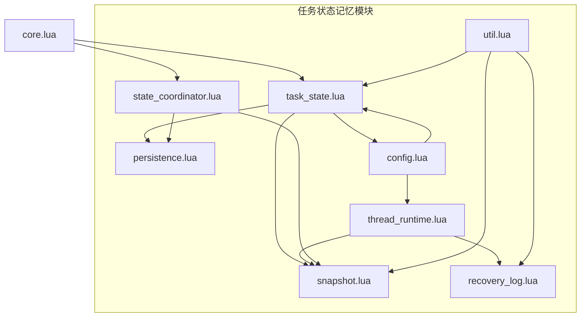
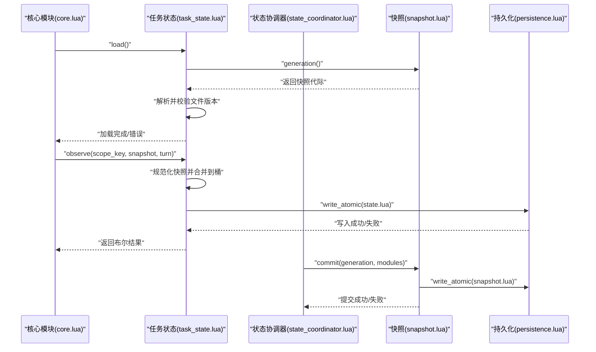
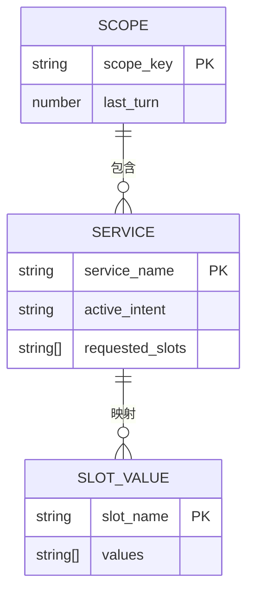
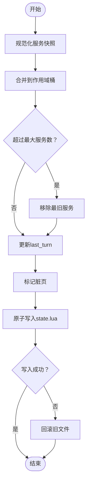
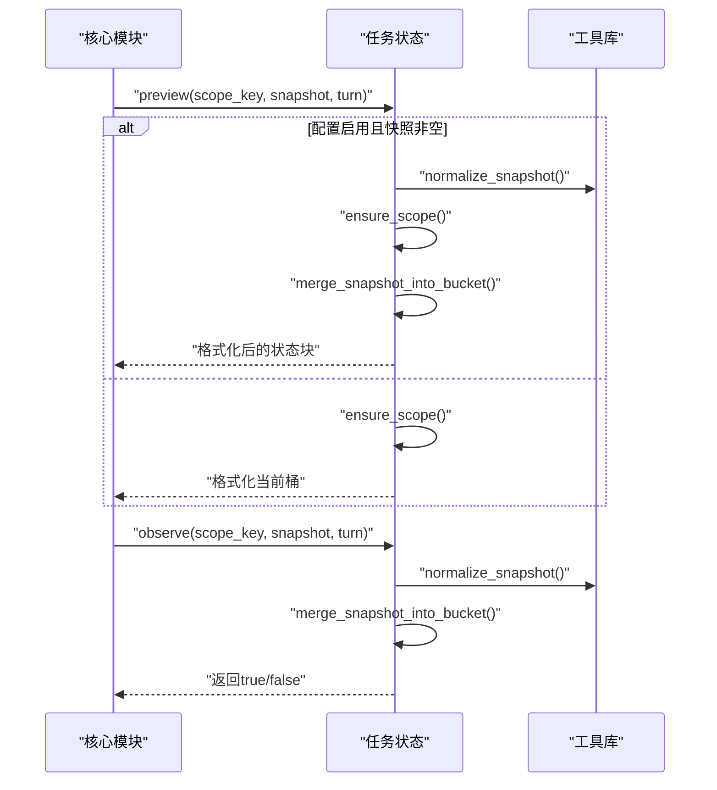
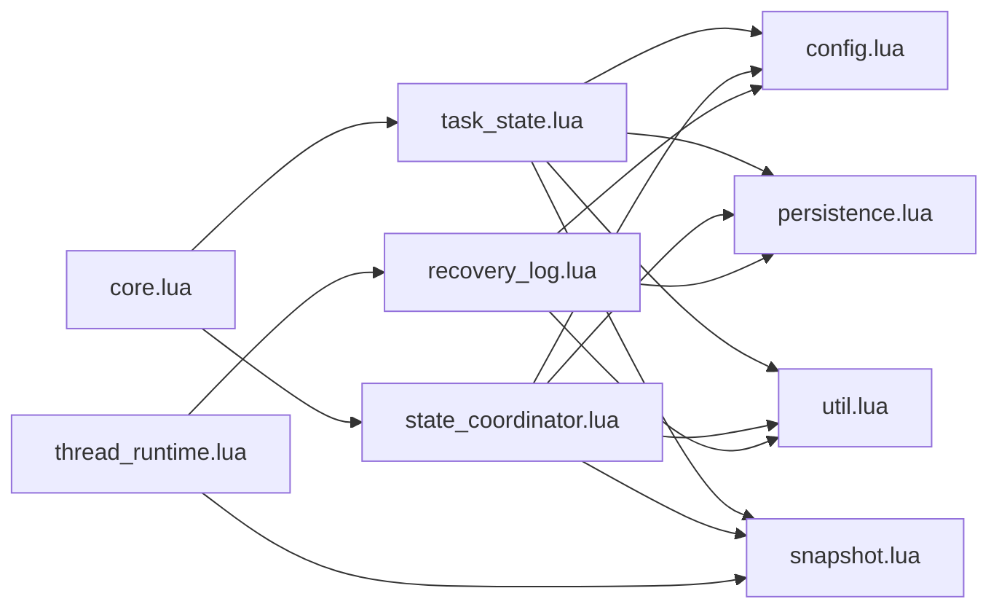

# 任务状态记忆 (Task State Memory)

<cite>
**本文档引用的文件**
- [task_state.lua](file://mori_memory/module/memory/task_state.lua)
- [core.lua](file://mori_memory/mori_memory/core.lua)
- [state_coordinator.lua](file://mori_memory/module/state_coordinator.lua)
- [persistence.lua](file://mori_memory/module/persistence.lua)
- [snapshot.lua](file://mori_memory/module/snapshot.lua)
- [recovery_log.lua](file://mori_memory/module/memory/recovery_log.lua)
- [thread_runtime.lua](file://mori_memory/module/runtime/thread_runtime.lua)
- [config.lua](file://mori_memory/module/config.lua)
- [util.lua](file://mori_memory/mori_memory/util.lua)
- [20260324_level3_benchmark_conclusions_and_next_steps.md](file://mori_memory/docs/20260324_level3_benchmark_conclusions_and_next_steps.md)
- [bench_mw_task_state_v0.json](file://mori_memory/benchmarks/results/bench_mw_task_state_v0.json)
- [bench_mw_task_state_v0_delta.json](file://mori_memory/benchmarks/results/bench_mw_task_state_v0_delta.json)
</cite>

## 目录
1. [引言](#引言)
2. [项目结构](#项目结构)
3. [核心组件](#核心组件)
4. [架构总览](#架构总览)
5. [详细组件分析](#详细组件分析)
6. [依赖关系分析](#依赖关系分析)
7. [性能考量](#性能考量)
8. [故障排除指南](#故障排除指南)
9. [结论](#结论)
10. [附录](#附录)

## 引言
本文件围绕任务状态记忆（Task State Memory）进行系统化文档化，重点解释其设计理念、任务生命周期管理、进度跟踪、状态持久化机制，以及与系统其他记忆类型的集成方式。文档同时给出任务数据结构定义、状态转换规则、并发控制策略与错误恢复机制，并提供任务创建、更新、查询的API使用示例路径与最佳实践。

## 项目结构
任务状态记忆位于 mori_memory 子系统中，采用模块化设计，核心模块包括：
- 任务状态存储模块：负责任务状态的加载、保存、预览与观察
- 状态协调器：确保多模块间状态一致性与检查点一致性
- 持久化与快照：提供原子写入与快照管理
- 恢复日志（WAL）：记录运行时状态变更，支持恢复与校验
- 线程运行时：管理提交时机、WAL追加与运行时状态
- 配置中心：集中管理任务状态相关配置项
- 工具库：提供通用编码/解码与字符串处理

**图表来源**
- [task_state.lua:1-305](file://mori_memory/module/memory/task_state.lua#L1-L305)
- [core.lua:227-327](file://mori_memory/mori_memory/core.lua#L227-L327)
- [state_coordinator.lua:1-302](file://mori_memory/module/state_coordinator.lua#L1-L302)
- [persistence.lua:1-97](file://mori_memory/module/persistence.lua#L1-L97)
- [snapshot.lua:1-112](file://mori_memory/module/snapshot.lua#L1-L112)
- [recovery_log.lua:1-121](file://mori_memory/module/memory/recovery_log.lua#L1-L121)
- [thread_runtime.lua:1-260](file://mori_memory/module/runtime/thread_runtime.lua#L1-L260)
- [config.lua:168-174](file://mori_memory/module/config.lua#L168-L174)
- [util.lua:1-153](file://mori_memory/mori_memory/util.lua#L1-L153)

**章节来源**
- [task_state.lua:1-305](file://mori_memory/module/memory/task_state.lua#L1-L305)
- [core.lua:227-327](file://mori_memory/mori_memory/core.lua#L227-L327)

## 核心组件
- 任务状态存储模块（task_state.lua）
  - 负责任务状态的加载/保存、作用域管理、服务快照规范化、状态预览与观察
  - 提供原子写入与版本控制，确保与快照一致性
- 状态协调器（state_coordinator.lua）
  - 维护版本向量、事务一致性、检查点创建与恢复验证
  - 提供自动一致性维护与锁机制
- 持久化与快照（persistence.lua、snapshot.lua）
  - 提供原子替换与临时文件写入，保障持久化安全
  - 快照记录模块版本，支持一致性校验
- 恢复日志（recovery_log.lua）
  - 记录线程运行时状态变更，支持顺序读取与重放
- 线程运行时（thread_runtime.lua）
  - 管理提交时机、WAL追加、运行时状态查询与初始化
- 配置中心（config.lua）
  - 集中管理任务状态开关、存储根目录、最大服务数、输出块开关等
- 工具库（util.lua）
  - 提供Lua表编码/解码、字符串处理等通用能力

**章节来源**
- [task_state.lua:65-305](file://mori_memory/module/memory/task_state.lua#L65-L305)
- [state_coordinator.lua:1-302](file://mori_memory/module/state_coordinator.lua#L1-L302)
- [persistence.lua:28-94](file://mori_memory/module/persistence.lua#L28-L94)
- [snapshot.lua:42-112](file://mori_memory/module/snapshot.lua#L42-L112)
- [recovery_log.lua:47-121](file://mori_memory/module/memory/recovery_log.lua#L47-L121)
- [thread_runtime.lua:110-201](file://mori_memory/module/runtime/thread_runtime.lua#L110-L201)
- [config.lua:168-174](file://mori_memory/module/config.lua#L168-L174)
- [util.lua:59-144](file://mori_memory/mori_memory/util.lua#L59-L144)

## 架构总览
任务状态记忆通过以下关键流程实现端到端的状态管理：
- 初始化阶段：核心模块在启动时加载历史、主题图、精确状态、任务状态等，并注册到状态协调器
- 运行阶段：编译上下文时，若启用任务状态，将对服务快照进行规范化与合并，生成状态块
- 持久化阶段：任务状态保存到磁盘，配合快照与WAL保证一致性
- 恢复阶段：系统重启后，通过快照与WAL进行状态恢复与一致性校验

**图表来源**
- [core.lua:227-327](file://mori_memory/mori_memory/core.lua#L227-L327)
- [task_state.lua:227-302](file://mori_memory/module/memory/task_state.lua#L227-L302)
- [state_coordinator.lua:145-207](file://mori_memory/module/state_coordinator.lua#L145-L207)
- [snapshot.lua:88-112](file://mori_memory/module/snapshot.lua#L88-L112)
- [persistence.lua:58-94](file://mori_memory/module/persistence.lua#L58-L94)

## 详细组件分析

### 任务状态数据模型
任务状态以作用域（scope）为单位组织，每个作用域包含若干服务（service），每个服务包含：
- 服务名称（service）
- 活跃意图（active_intent）
- 请求槽位（requested_slots）
- 槽位值（slot_values）

- 作用域键（scope_key）默认为空时归一化为全局作用域
- 服务数量受配置限制，默认最多16个
- 槽位值数组去重并排序，避免重复与无序

**图表来源**
- [task_state.lua:83-168](file://mori_memory/module/memory/task_state.lua#L83-L168)
- [task_state.lua:102-142](file://mori_memory/module/memory/task_state.lua#L102-L142)

**章节来源**
- [task_state.lua:65-168](file://mori_memory/module/memory/task_state.lua#L65-L168)

### 任务生命周期与进度跟踪
- 生命周期阶段
  - 初始化：加载快照与任务状态文件，校验版本一致性
  - 观察：接收来自编译上下文的服务快照，规范化并合并
  - 预览：在未持久化的情况下生成状态块文本，便于调试与展示
  - 保存：将状态写入磁盘，标记脏页并触发持久化
- 进度跟踪
  - last_turn 字段记录该作用域最后一次更新的回合数
  - 通过快照代际（snapshot_generation）与文件版本比对，确保一致性

**章节来源**
- [task_state.lua:227-302](file://mori_memory/module/memory/task_state.lua#L227-L302)
- [snapshot.lua:42-77](file://mori_memory/module/snapshot.lua#L42-L77)

### 状态持久化机制
- 原子写入
  - 使用临时文件写入后原子替换，避免部分写入导致的数据损坏
  - 失败时回滚旧文件，确保一致性
- 快照与版本
  - 快照记录模块版本与生成代际，保存时写入原子文件
  - 任务状态文件包含快照代际字段，启动时进行一致性校验
- WAL（恢复日志）
  - 线程运行时将状态变更写入WAL，支持重启后的顺序恢复
  - 通过序列号与回合号排序，保证恢复顺序正确

**图表来源**
- [task_state.lua:144-168](file://mori_memory/module/memory/task_state.lua#L144-L168)
- [persistence.lua:28-54](file://mori_memory/module/persistence.lua#L28-L54)

**章节来源**
- [persistence.lua:28-94](file://mori_memory/module/persistence.lua#L28-L94)
- [snapshot.lua:88-112](file://mori_memory/module/snapshot.lua#L88-L112)
- [recovery_log.lua:84-110](file://mori_memory/module/memory/recovery_log.lua#L84-L110)

### 任务状态转换规则
- 观察（observe）：当配置启用且快照非空时，将规范化后的服务快照合并到对应作用域桶
- 预览（preview）：在未持久化情况下，基于当前桶与输入快照生成状态块文本
- 合并与裁剪：按服务名去重排序，超过上限时移除最旧服务，确保稳定性
- 文本格式化：按服务、意图、请求槽位与槽位值生成结构化文本块

**图表来源**
- [task_state.lua:275-302](file://mori_memory/module/memory/task_state.lua#L275-L302)
- [util.lua:59-144](file://mori_memory/mori_memory/util.lua#L59-L144)

**章节来源**
- [task_state.lua:275-302](file://mori_memory/module/memory/task_state.lua#L275-L302)
- [util.lua:59-144](file://mori_memory/mori_memory/util.lua#L59-L144)

### 并发控制策略
- 状态协调器
  - 版本向量：为每个模块维护版本号与时间戳，支持一致性校验
  - 事务管理：开启事务时记录版本快照，提交前验证无冲突
  - 一致性检查点：创建原子检查点，记录模块版本与生成代际
- 线程运行时
  - 提交时机控制：基于回合间隔判断是否需要提交
  - WAL追加：在状态变更时写入WAL，支持重启恢复
- 锁机制
  - 创建检查点时设置一致性锁，防止并发写入破坏快照

**章节来源**
- [state_coordinator.lua:145-207](file://mori_memory/module/state_coordinator.lua#L145-L207)
- [thread_runtime.lua:110-152](file://mori_memory/module/runtime/thread_runtime.lua#L110-L152)

### 错误恢复机制
- 快照与WAL
  - 快照缺失：返回缺失提示，允许选择性忽略
  - 版本不匹配：返回期望与实际版本，指导用户处理
  - WAL顺序校验：检查序列号连续性，发现缺口时记录问题
- 原子写入回滚
  - 写入失败时回滚旧文件，避免损坏状态
- 线程运行时恢复
  - 初始化时加载最近检查点与WAL，重建运行时状态

**章节来源**
- [task_state.lua:227-252](file://mori_memory/module/memory/task_state.lua#L227-L252)
- [snapshot.lua:42-77](file://mori_memory/module/snapshot.lua#L42-L77)
- [recovery_log.lua:47-82](file://mori_memory/module/memory/recovery_log.lua#L47-L82)
- [persistence.lua:28-54](file://mori_memory/module/persistence.lua#L28-L54)
- [thread_runtime.lua:221-243](file://mori_memory/module/runtime/thread_runtime.lua#L221-L243)

### API 使用示例（路径）
- 任务状态加载
  - [task_state.load:227-252](file://mori_memory/module/memory/task_state.lua#L227-L252)
- 任务状态观察（更新）
  - [task_state.observe:290-302](file://mori_memory/module/memory/task_state.lua#L290-L302)
- 任务状态预览（查询）
  - [task_state.preview:275-288](file://mori_memory/module/memory/task_state.lua#L275-L288)
- 任务状态保存
  - [task_state.save_to_disk:254-273](file://mori_memory/module/memory/task_state.lua#L254-L273)
- 状态协调器一致性检查点
  - [state_coordinator.create_consistent_checkpoint:145-207](file://mori_memory/module/state_coordinator.lua#L145-L207)
- 线程运行时WAL追加
  - [thread_runtime.append_to_wal:174-201](file://mori_memory/module/runtime/thread_runtime.lua#L174-L201)

**章节来源**
- [task_state.lua:227-302](file://mori_memory/module/memory/task_state.lua#L227-L302)
- [state_coordinator.lua:145-207](file://mori_memory/module/state_coordinator.lua#L145-L207)
- [thread_runtime.lua:174-201](file://mori_memory/module/runtime/thread_runtime.lua#L174-L201)

### 任务状态与其他记忆类型的集成
- 与主题图（topic_graph）、历史（history）、精确状态（exact_state）的集成
  - 核心模块在初始化时依次加载这些模块，并注册到状态协调器
  - 任务状态作为独立模块参与一致性检查与快照
- 与线程运行时的集成
  - 任务状态变更通过WAL记录，线程运行时负责提交时机与WAL重置
- 与配置中心的集成
  - 任务状态开关、存储根目录、最大服务数、输出块开关等均通过配置中心统一管理

**章节来源**
- [core.lua:227-327](file://mori_memory/mori_memory/core.lua#L227-L327)
- [config.lua:168-174](file://mori_memory/module/config.lua#L168-L174)

## 依赖关系分析
- 模块内依赖
  - task_state 依赖 config、persistence、snapshot、util
  - state_coordinator 依赖 config、util、persistence、snapshot
  - recovery_log 依赖 config、persistence、util
  - thread_runtime 依赖 recovery_log、thread_checkpoint、saver
- 外部依赖
  - 文件系统：持久化与快照写入
  - 配置系统：集中化参数管理
  - 工具库：通用编码/解码与字符串处理

**图表来源**
- [task_state.lua:1-6](file://mori_memory/module/memory/task_state.lua#L1-L6)
- [state_coordinator.lua:1-8](file://mori_memory/module/state_coordinator.lua#L1-L8)
- [recovery_log.lua:1-4](file://mori_memory/module/memory/recovery_log.lua#L1-L4)
- [thread_runtime.lua:1-12](file://mori_memory/module/runtime/thread_runtime.lua#L1-L12)
- [core.lua:227-327](file://mori_memory/mori_memory/core.lua#L227-L327)

**章节来源**
- [task_state.lua:1-6](file://mori_memory/module/memory/task_state.lua#L1-L6)
- [state_coordinator.lua:1-8](file://mori_memory/module/state_coordinator.lua#L1-L8)
- [recovery_log.lua:1-4](file://mori_memory/module/memory/recovery_log.lua#L1-L4)
- [thread_runtime.lua:1-12](file://mori_memory/module/runtime/thread_runtime.lua#L1-L12)
- [core.lua:227-327](file://mori_memory/mori_memory/core.lua#L227-L327)

## 性能考量
- 写入性能
  - 原子写入与临时文件策略降低写入失败风险，适合高并发场景
  - 通过批量保存与脏页标记减少频繁IO
- 查询性能
  - 作用域桶按服务名排序，便于快速检索与裁剪
  - 预览功能在未持久化时生成文本，避免额外IO
- 内存占用
  - 服务数量上限与槽位值数组上限控制内存膨胀
  - 线程运行时提供GC控制与内存压力阈值，防止内存压力过高

[本节为通用性能讨论，无需具体文件分析]

## 故障排除指南
- 任务状态文件缺失或版本不匹配
  - 现象：加载失败并返回缺失或版本不匹配错误
  - 排查：检查快照代际与文件版本是否一致；确认存储根目录配置
  - 参考路径：[task_state.load:227-252](file://mori_memory/module/memory/task_state.lua#L227-L252)
- 原子写入失败
  - 现象：写入临时文件后无法替换目标文件
  - 排查：检查磁盘空间与权限；确认备份文件回滚逻辑是否执行
  - 参考路径：[persistence.write_atomic:58-94](file://mori_memory/module/persistence.lua#L58-L94)
- 快照不一致
  - 现象：状态协调器验证失败，报告版本不一致或模块缺失
  - 排查：核对模块版本向量与快照记录；必要时重新创建检查点
  - 参考路径：[state_coordinator.verify_recovery_state:210-258](file://mori_memory/module/state_coordinator.lua#L210-L258)
- WAL顺序问题
  - 现象：WAL记录序列号不连续
  - 排查：检查WAL文件完整性；确认线程运行时初始化是否正确加载
  - 参考路径：[recovery_log.load_after:47-82](file://mori_memory/module/memory/recovery_log.lua#L47-L82)

**章节来源**
- [task_state.lua:227-252](file://mori_memory/module/memory/task_state.lua#L227-L252)
- [persistence.lua:58-94](file://mori_memory/module/persistence.lua#L58-L94)
- [state_coordinator.lua:210-258](file://mori_memory/module/state_coordinator.lua#L210-L258)
- [recovery_log.lua:47-82](file://mori_memory/module/memory/recovery_log.lua#L47-L82)

## 结论
任务状态记忆通过清晰的数据模型、严格的持久化与恢复机制、完善的并发控制与错误恢复策略，实现了对任务状态的可靠管理。其与系统其他记忆类型的集成体现了模块化与一致性设计思想。结合基准测试结果，任务状态适配器在MultiWOZ等任务上展现出显著效果，证明了该设计的有效性与可扩展性。

[本节为总结性内容，无需具体文件分析]

## 附录

### 配置项参考
- 任务状态开关与存储
  - enabled：是否启用任务状态
  - storage_root：任务状态存储根目录
  - max_services：每个作用域最大服务数
  - emit_block：是否输出状态块
- 参考路径
  - [config.task_state:168-174](file://mori_memory/module/config.lua#L168-L174)

**章节来源**
- [config.lua:168-174](file://mori_memory/module/config.lua#L168-L174)

### 基准测试结果参考
- 任务状态适配器初版（v0）
  - avg_slot_recall：0.9（部分失败案例仍可见状态块）
  - 参考路径：[bench_mw_task_state_v0.json:1-51](file://mori_memory/benchmarks/results/bench_mw_task_state_v0.json#L1-L51)
- 任务状态适配器增量改进（v0_delta）
  - avg_slot_recall：1.0，service_hit_rate与intent_hit_rate均为1.0
  - 参考路径：[bench_mw_task_state_v0_delta.json:1-22](file://mori_memory/benchmarks/results/bench_mw_task_state_v0_delta.json#L1-L22)

**章节来源**
- [bench_mw_task_state_v0.json:1-51](file://mori_memory/benchmarks/results/bench_mw_task_state_v0.json#L1-L51)
- [bench_mw_task_state_v0_delta.json:1-22](file://mori_memory/benchmarks/results/bench_mw_task_state_v0_delta.json#L1-L22)