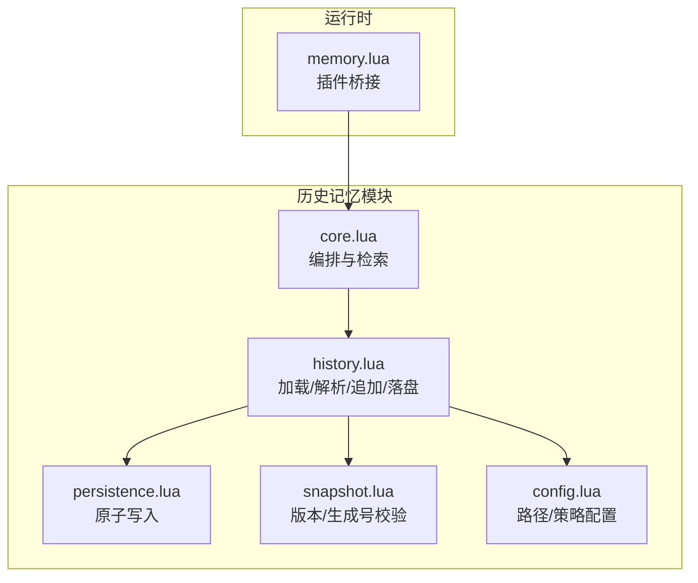
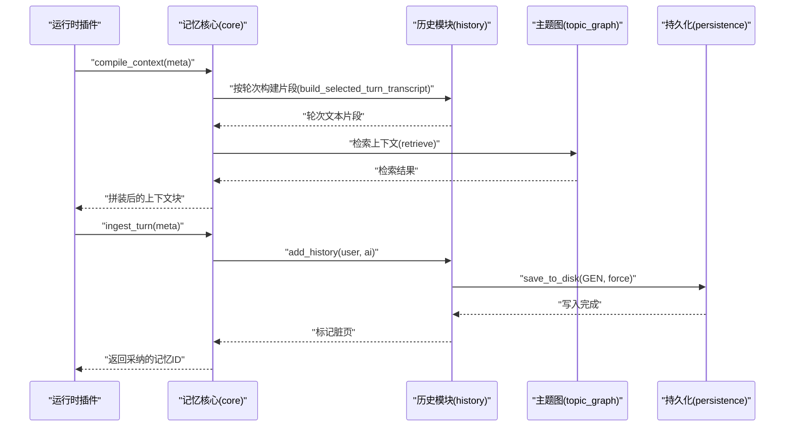
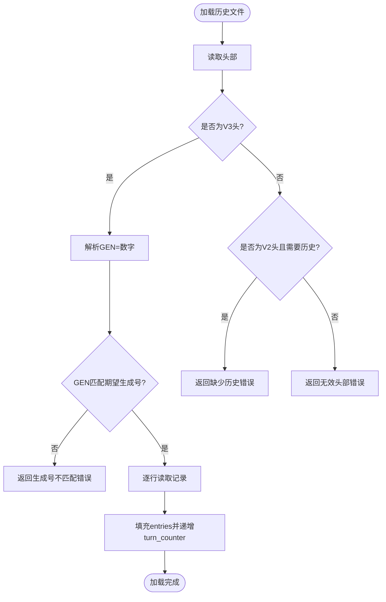
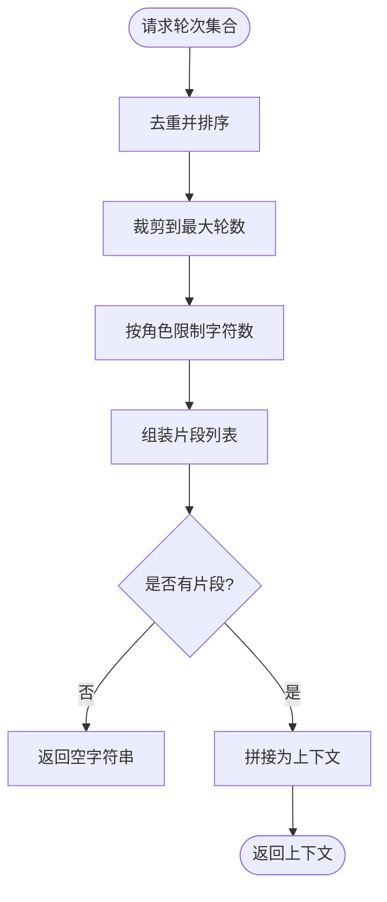
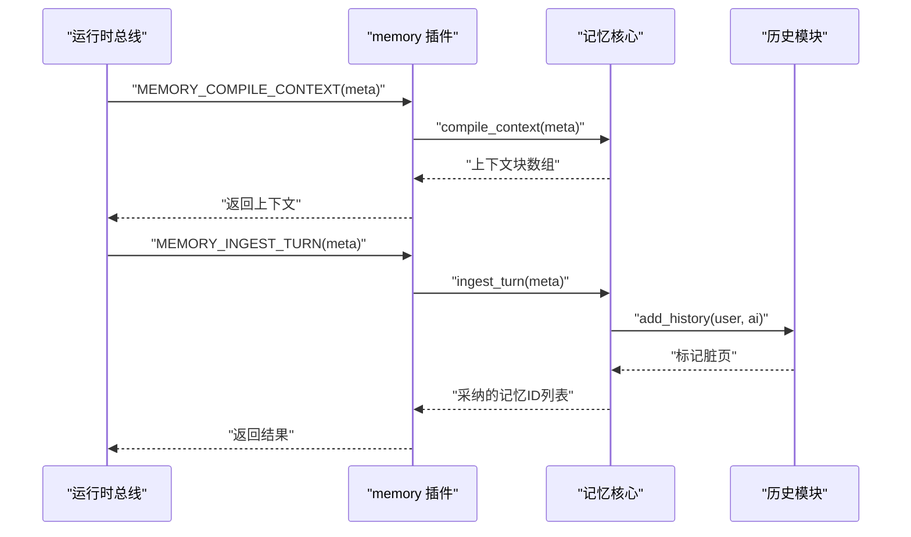
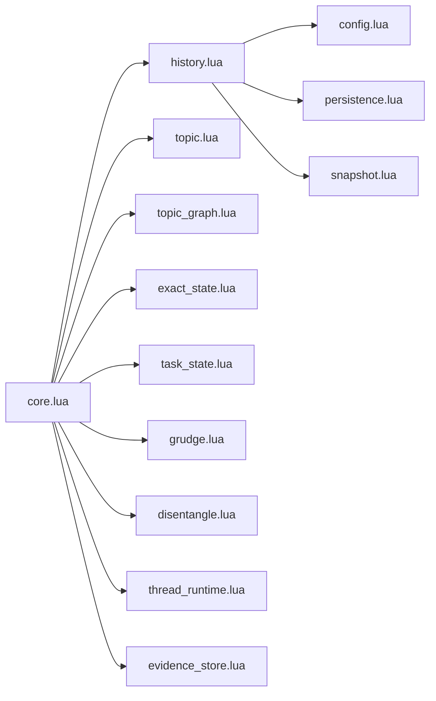

# 历史记忆（History Memory）

<cite>
**本文引用的文件**
- [history.lua](file://mori_memory/module/memory/history.lua)
- [core.lua](file://mori_memory/mori_memory/core.lua)
- [memory.lua](file://mori_runtime/lua/mori/plugins/memory.lua)
- [config.lua](file://mori_memory/module/config.lua)
- [persistence.lua](file://mori_memory/module/persistence.lua)
- [snapshot.lua](file://mori_memory/module/snapshot.lua)
</cite>

## 目录
1. [简介](#简介)
2. [项目结构](#项目结构)
3. [核心组件](#核心组件)
4. [架构总览](#架构总览)
5. [详细组件分析](#详细组件分析)
6. [依赖关系分析](#依赖关系分析)
7. [性能考量](#性能考量)
8. [故障排查指南](#故障排查指南)
9. [结论](#结论)
10. [附录](#附录)

## 简介
本文件系统化阐述历史记忆（History Memory）的设计与实现，涵盖数据结构、存储格式、检索算法、与其他记忆类型（尤其是主题记忆）的协作关系、配置参数、性能优化与常见使用场景。历史记忆负责以“轮次”为单位持久化用户与AI的对话文本，支持按轮次范围查询、上下文构建与对话流重建，是多模态记忆系统中的基础层。

## 项目结构
历史记忆位于 mori_memory 子模块中，采用“功能域+文件”的组织方式：
- 数据层：history.lua 负责历史记录的加载、解析、追加与落盘
- 协调层：core.lua 在记忆核心中编排历史与主题、精确状态等模块的交互
- 运行时桥接：memory.lua 将历史记忆能力暴露给运行时插件总线
- 配置与持久化：config.lua 提供策略与路径配置；persistence.lua 提供原子写入保障；snapshot.lua 提供快照版本控制

图表来源
- [history.lua:1-195](file://mori_memory/module/memory/history.lua#L1-L195)
- [core.lua:1-327](file://mori_memory/mori_memory/core.lua#L1-L327)
- [memory.lua:1-30](file://mori_runtime/lua/mori/plugins/memory.lua#L1-L30)
- [persistence.lua:1-97](file://mori_memory/module/persistence.lua#L1-L97)
- [snapshot.lua](file://mori_memory/module/snapshot.lua)

章节来源
- [history.lua:1-195](file://mori_memory/module/memory/history.lua#L1-L195)
- [core.lua:1-327](file://mori_memory/mori_memory/core.lua#L1-L327)
- [memory.lua:1-30](file://mori_runtime/lua/mori/plugins/memory.lua#L1-L30)
- [config.lua:1-680](file://mori_memory/module/config.lua#L1-L680)
- [persistence.lua:1-97](file://mori_memory/module/persistence.lua#L1-L97)
- [snapshot.lua](file://mori_memory/module/snapshot.lua)

## 核心组件
- 历史记录容器与计数器：entries 表维护按轮次顺序的记录，turn_counter 记录当前轮次总数
- 文件头与版本管理：V2/V3 头部与 GEN= 生成号，确保快照一致性
- 编码/解码：FIELD_SEP 与 RECORD_SEP 分隔符，转义/反转义函数保证字段安全
- 加载/保存：原子写入与错误处理，支持缺失历史的降级
- 查询接口：按轮次获取、按角色提取文本、构建选定轮次的摘要

章节来源
- [history.lua:17-195](file://mori_memory/module/memory/history.lua#L17-L195)

## 架构总览
历史记忆在记忆核心中承担“输入-输出-持久化”的基础职责，配合主题图进行检索与上下文拼装，并与精确状态、任务状态、离散解耦等模块协同工作。

图表来源
- [core.lua:438-474](file://mori_memory/mori_memory/core.lua#L438-L474)
- [core.lua:1961-2273](file://mori_memory/mori_memory/core.lua#L1961-L2273)
- [core.lua:1712-1959](file://mori_memory/mori_memory/core.lua#L1712-L1959)
- [history.lua:117-192](file://mori_memory/module/memory/history.lua#L117-L192)
- [persistence.lua:56-94](file://mori_memory/module/persistence.lua#L56-L94)

## 详细组件分析

### 历史记录数据结构与存储格式
- 存储介质：文本文件，每行一条记录
- 字段分隔：使用不可见字符作为分隔符，避免与自然语言冲突
- 记录格式：用户文本 | 分隔符 | AI文本（经思维链清理后）
- 版本头与生成号：
  - V2/V3 头部用于兼容与升级
  - GEN= 数字表示当前快照生成号，加载时与期望生成号比对，防止跨快照混用
- 时间戳与轮次索引：无显式时间戳字段；轮次即行号（从1开始），由 turn_counter 维护

图表来源
- [history.lua:67-115](file://mori_memory/module/memory/history.lua#L67-L115)

章节来源
- [history.lua:8-15](file://mori_memory/module/memory/history.lua#L8-L15)
- [history.lua:67-115](file://mori_memory/module/memory/history.lua#L67-L115)

### 用户与AI对话内容的组织方式
- 文本预处理：在写入前移除思维链中间产物，确保只保留最终输出
- 字段转义：对换行、反斜杠、分隔符进行转义，保证解析安全
- 角色文本提取：按角色返回对应文本，便于上下文拼装

章节来源
- [history.lua:117-165](file://mori_memory/module/memory/history.lua#L117-L165)

### 时间戳管理与轮次索引机制
- 轮次计数：每次 add_history 增加一次，get_turn 返回当前轮次
- 解析与查询：parse_entry 将单行解析为用户/AI两段；get_by_turn 返回指定轮次记录
- 上下文片段：build_selected_turn_transcript 选择若干轮次，按固定格式拼装成“第N轮 用户/助手”片段

章节来源
- [history.lua:141-165](file://mori_memory/module/memory/history.lua#L141-L165)
- [core.lua:438-474](file://mori_memory/mori_memory/core.lua#L438-L474)

### 历史记忆的检索算法
- 按轮次范围查询：通过 get_by_turn 与 unique_sorted_numbers 实现去重与排序
- 上下文构建：build_selected_turn_transcript 限制最大轮数与每段字符上限，避免上下文膨胀
- 对话流重建：compile_context 中将 exact_state、主题检索、趋势候选、本地待定等多源信息按权重门控拼装

图表来源
- [core.lua:438-474](file://mori_memory/mori_memory/core.lua#L438-L474)

章节来源
- [core.lua:438-474](file://mori_memory/mori_memory/core.lua#L438-L474)

### 历史记忆与其他记忆类型的协作关系
- 与主题记忆的重建依赖：compile_context 在检索主题上下文时，若主题图不可用则回退到历史片段；主题锚点不稳定时，历史片段可作为补充
- 与精确状态的协作：exact_state.retrieve 与 reply_parent_hint 提供精确的时间线与父回复线索，增强上下文可信度
- 与离散解耦（流）的协作：disentangle 在 ingest_turn 中对事件进行阶段化处理，历史记录作为事实来源之一参与评估与采纳

章节来源
- [core.lua:1961-2273](file://mori_memory/mori_memory/core.lua#L1961-L2273)
- [core.lua:1712-1959](file://mori_memory/mori_memory/core.lua#L1712-L1959)

### 配置参数说明
- 快照与路径
  - storage.base_dir：相对路径的基目录
  - storage.snapshot_path：快照文件路径
- 历史文件版本
  - 历史文件头与 GEN= 由 snapshot 与 history 共同校验
- 读取门控（读出权重与阈值）
  - disentangle.readout_gating_enabled：是否启用读出门控
  - readout_min_memory/transcript/pending/trend：各模块最小权重阈值
- 其他相关配置（影响历史使用的上下文拼装）
  - topic_graph.ai_query.max_turns：检索时最大轮数
  - topic_graph.trend_candidates：趋势候选检索参数

章节来源
- [config.lua:11-15](file://mori_memory/module/config.lua#L11-L15)
- [config.lua:21-25](file://mori_memory/module/config.lua#L21-L25)
- [config.lua:474-481](file://mori_memory/module/config.lua#L474-L481)
- [config.lua:74-86](file://mori_memory/module/config.lua#L74-L86)

### 性能优化建议
- 控制上下文长度：通过 max_selected_turns 与 user_chars/assistant_chars 限制每轮字符数，避免上下文爆炸
- 原子写入与批量落盘：使用 persistence.write_atomic 降低落盘开销与数据损坏风险
- 生成号一致性：严格校验 snapshot 生成号，避免跨快照历史被错误加载
- 轮次缓存：core 内部对召回状态进行有限缓存，减少重复计算

章节来源
- [core.lua:438-474](file://mori_memory/mori_memory/core.lua#L438-L474)
- [persistence.lua:56-94](file://mori_memory/module/persistence.lua#L56-L94)
- [history.lua:167-192](file://mori_memory/module/memory/history.lua#L167-L192)
- [core.lua:29-50](file://mori_memory/mori_memory/core.lua#L29-L50)

### 常见使用场景与流程
- 插件接入运行时：运行时插件通过 bus 注册 MEMORY_COMPILE_CONTEXT/MEMORY_INGEST_TURN 事件，转发到记忆核心
- 编译上下文：compile_context 依据用户输入与当前轮次，拼装来自主题、精确状态、历史片段、趋势候选与本地待定的上下文块
- 接收轮次：ingest_turn 接收用户输入与AI输出，写入历史并触发主题与精确状态观测，随后进行选择性写入与持久化

图表来源
- [memory.lua:8-26](file://mori_runtime/lua/mori/plugins/memory.lua#L8-L26)
- [core.lua:1961-2273](file://mori_memory/mori_memory/core.lua#L1961-L2273)
- [core.lua:1712-1959](file://mori_memory/mori_memory/core.lua#L1712-L1959)
- [history.lua:117-126](file://mori_memory/module/memory/history.lua#L117-L126)

## 依赖关系分析
- 历史模块依赖
  - config：解析路径与快照根目录
  - persistence：原子写入
  - snapshot：生成号与版本一致性校验
  - tool：文本清理（移除思维链中间产物）
- 核心模块依赖
  - history/topic/topic_graph/exact_state/task_state/grudge/disentangle/recovery_log/thread_runtime/evidence_store：多模块编排与事务协调

图表来源
- [history.lua:3-6](file://mori_memory/module/memory/history.lua#L3-L6)
- [core.lua:1-18](file://mori_memory/mori_memory/core.lua#L1-L18)

章节来源
- [history.lua:3-6](file://mori_memory/module/memory/history.lua#L3-L6)
- [core.lua:1-18](file://mori_memory/mori_memory/core.lua#L1-L18)

## 性能考量
- I/O 原子性：使用临时文件+原子替换，避免部分写入导致的数据损坏
- 上下文裁剪：通过 max_selected_turns 与字符上限控制内存与传输成本
- 事务一致性：在 ingest_turn/compile_context 中使用状态协调器与分布式同步，保证多模块一致性
- 缓存与复用：召回状态缓存与向量维度校验，减少重复计算与无效检索

## 故障排查指南
- 历史文件头错误：检查头部是否为 V2/V3，或是否存在 GEN 行
- 生成号不匹配：确认 snapshot 生成号与历史文件 GEN 是否一致
- 缺少历史：当期望生成号>0而历史文件不存在时，返回 missing_history 错误
- 写入失败：write_atomic 返回具体错误原因（打开/写入/关闭/替换）
- 维度不一致：当 query_vec 维度与主题图期望不一致时，跳过向量检索并提示

章节来源
- [history.lua:67-115](file://mori_memory/module/memory/history.lua#L67-L115)
- [history.lua:167-192](file://mori_memory/module/memory/history.lua#L167-L192)
- [persistence.lua:56-94](file://mori_memory/module/persistence.lua#L56-L94)
- [core.lua:2042-2051](file://mori_memory/mori_memory/core.lua#L2042-L2051)

## 结论
历史记忆以简洁稳定的文本格式承载对话轮次，通过严格的版本与生成号校验确保一致性，并与主题图、精确状态、任务状态及离散解耦模块协同，形成从“输入-处理-持久化-检索-上下文拼装”的完整闭环。通过合理的配置与性能优化策略，可在大规模实时场景中保持稳定与高效。

## 附录
- 关键接口路径参考
  - 加载历史：[history.lua:67-115](file://mori_memory/module/memory/history.lua#L67-L115)
  - 追加历史：[history.lua:117-126](file://mori_memory/module/memory/history.lua#L117-L126)
  - 保存历史：[history.lua:167-192](file://mori_memory/module/memory/history.lua#L167-L192)
  - 按轮次查询：[history.lua:147-165](file://mori_memory/module/memory/history.lua#L147-L165)
  - 上下文构建：[core.lua:438-474](file://mori_memory/mori_memory/core.lua#L438-L474)
  - 编译上下文：[core.lua:1961-2273](file://mori_memory/mori_memory/core.lua#L1961-L2273)
  - 接收轮次：[core.lua:1712-1959](file://mori_memory/mori_memory/core.lua#L1712-L1959)
  - 原子写入：[persistence.lua:56-94](file://mori_memory/module/persistence.lua#L56-L94)
  - 配置解析：[config.lua:615-621](file://mori_memory/module/config.lua#L615-L621)