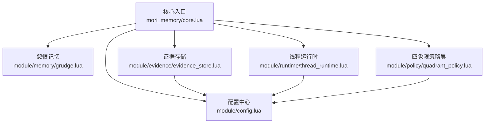
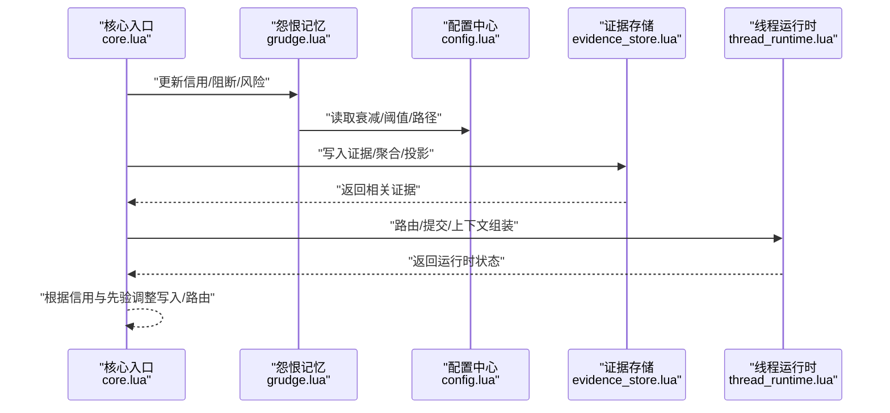
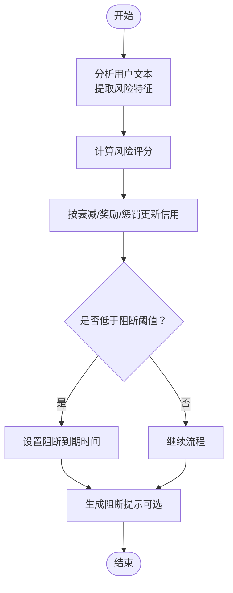
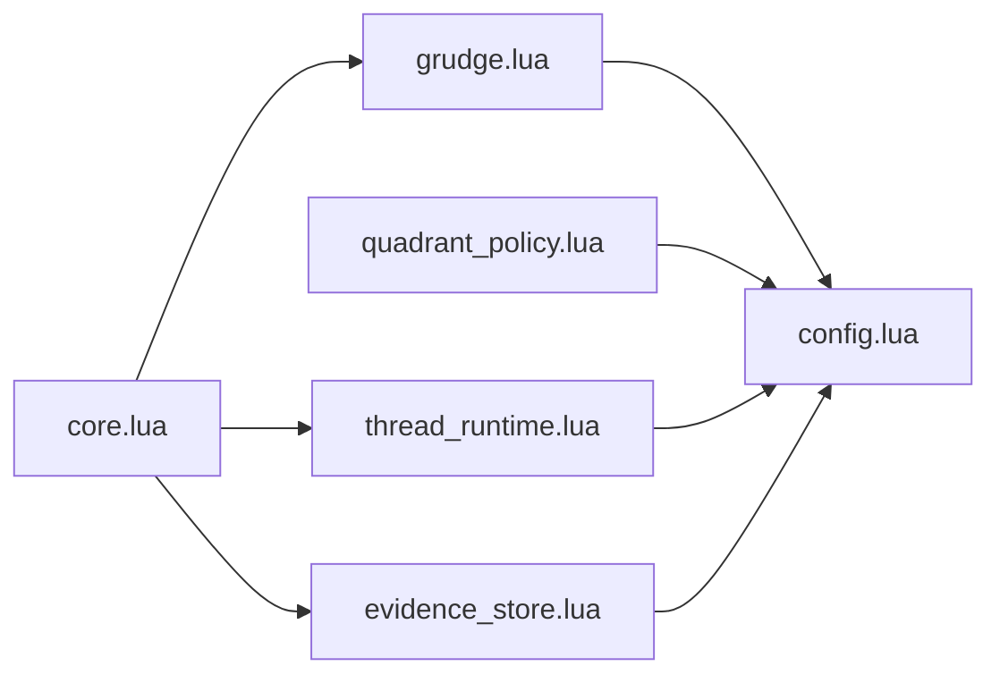

# 怨恨记忆（Grudge Memory）

<cite>
**本文引用的文件**
- [mori_memory/core.lua](file://mori_memory/mori_memory/core.lua)
- [module/memory/grudge.lua](file://mori_memory/module/memory/grudge.lua)
- [module/config.lua](file://mori_memory/module/config.lua)
- [module/evidence/evidence_store.lua](file://mori_memory/module/evidence/evidence_store.lua)
- [module/runtime/thread_runtime.lua](file://mori_memory/module/runtime/thread_runtime.lua)
- [module/policy/quadrant_policy.lua](file://mori_memory/module/policy/quadrant_policy.lua)
- [docs/20260325_two_axis_scope_controller_design.md](file://mori_memory/docs/20260325_two_axis_scope_controller_design.md)
- [docs/group_room_affinity_prior_design.md](file://mori_memory/docs/group_room_affinity_prior_design.md)
</cite>

## 目录
1. [简介](#简介)
2. [项目结构](#项目结构)
3. [核心组件](#核心组件)
4. [架构总览](#架构总览)
5. [详细组件分析](#详细组件分析)
6. [依赖分析](#依赖分析)
7. [性能考量](#性能考量)
8. [故障排查指南](#故障排查指南)
9. [结论](#结论)
10. [附录](#附录)

## 简介
本文件系统化阐述“怨恨记忆（Grudge Memory）”在代码库中的设计与实现，聚焦以下方面：
- 心理学基础与应用场景：负面情感记忆、社交动态建模、关系状态跟踪
- 数据结构与存储：触发事件记录、情感强度量化、时间衰减机制
- 激活条件、影响范围与调节策略
- 配置参数说明、使用场景示例与与社交智能相关的实现细节

怨恨记忆并非传统意义上的“长期事实层记忆”，而是作为“短期路由先验”存在，用于在高并发、低语义、强噪声的交互环境中稳定路由与抑制污染，同时通过信用与阻断阈值保护系统免受恶意输入影响。

## 项目结构
与怨恨记忆相关的核心模块与文件如下：
- 怨恨记忆核心：module/memory/grudge.lua
- 核心编排入口：mori_memory/mori_memory/core.lua
- 配置中心：module/config.lua
- 证据存储（包含topic投影）：module/evidence/evidence_store.lua
- 线程运行时（路由边界、提交时机等）：module/runtime/thread_runtime.lua
- 四象限策略层（参数调节）：module/policy/quadrant_policy.lua
- 两轴作用域控制器设计文档：docs/20260325_two_axis_scope_controller_design.md
- 群聊亲和先验设计文档：docs/group_room_affinity_prior_design.md

图表来源
- [mori_memory/core.lua:1-36](file://mori_memory/mori_memory/core.lua#L1-L36)
- [module/memory/grudge.lua:1-497](file://mori_memory/module/memory/grudge.lua#L1-L497)
- [module/config.lua:1-680](file://mori_memory/module/config.lua#L1-L680)
- [module/evidence/evidence_store.lua:1-603](file://mori_memory/module/evidence/evidence_store.lua#L1-L603)
- [module/runtime/thread_runtime.lua:1-260](file://mori_memory/module/runtime/thread_runtime.lua#L1-L260)
- [module/policy/quadrant_policy.lua:1-238](file://mori_memory/module/policy/quadrant_policy.lua#L1-L238)

章节来源
- [mori_memory/core.lua:1-36](file://mori_memory/mori_memory/core.lua#L1-L36)
- [module/memory/grudge.lua:1-497](file://mori_memory/module/memory/grudge.lua#L1-L497)
- [module/config.lua:1-680](file://mori_memory/module/config.lua#L1-L680)
- [module/evidence/evidence_store.lua:1-603](file://mori_memory/module/evidence/evidence_store.lua#L1-L603)
- [module/runtime/thread_runtime.lua:1-260](file://mori_memory/module/runtime/thread_runtime.lua#L1-L260)
- [module/policy/quadrant_policy.lua:1-238](file://mori_memory/module/policy/quadrant_policy.lua#L1-L238)
- [docs/20260325_two_axis_scope_controller_design.md:1-530](file://mori_memory/docs/20260325_two_axis_scope_controller_design.md#L1-L530)
- [docs/group_room_affinity_prior_design.md:369-564](file://mori_memory/docs/group_room_affinity_prior_design.md#L369-L564)

## 核心组件
- 怨恨记忆（Grudge Memory）
  - 作用：基于用户行为与文本特征计算风险与信用，生成短期先验与阻断提示，指导路由与写入决策
  - 关键能力：信用衰减、惩罚项、阻断冷却、亲和先验（群聊）、两轴控制器适配
- 配置中心（Config）
  - 提供 guard、disentangle、topic_graph 等子配置，支撑怨恨记忆的路径、阈值、衰减系数等
- 证据存储（Evidence Store）
  - 提供 committed chunks、actor-local、scope aggregate、trend candidates、topic projection 等能力，为怨恨记忆提供上下文与投影
- 线程运行时（Thread Runtime）
  - 路由边界管理、pending状态、orphan检测、ambient维护、commit时机控制，与怨恨记忆共同保障稳定性
- 四象限策略层（Quadrant Policy）
  - 将两轴控制器参数映射为策略调整，间接影响怨恨记忆在不同场景下的敏感度与保守度

章节来源
- [module/memory/grudge.lua:1-497](file://mori_memory/module/memory/grudge.lua#L1-L497)
- [module/config.lua:180-220](file://mori_memory/module/config.lua#L180-L220)
- [module/evidence/evidence_store.lua:1-603](file://mori_memory/module/evidence/evidence_store.lua#L1-L603)
- [module/runtime/thread_runtime.lua:1-260](file://mori_memory/module/runtime/thread_runtime.lua#L1-L260)
- [module/policy/quadrant_policy.lua:1-238](file://mori_memory/module/policy/quadrant_policy.lua#L1-L238)

## 架构总览
怨恨记忆贯穿输入处理、路由决策、证据写入与上下文构建的全流程，通过信用与阻断阈值抑制污染，通过亲和先验与两轴控制器提升在复杂社交环境中的稳定性。

图表来源
- [mori_memory/core.lua:1712-1729](file://mori_memory/mori_memory/core.lua#L1712-L1729)
- [module/memory/grudge.lua:358-471](file://mori_memory/module/memory/grudge.lua#L358-L471)
- [module/config.lua:180-220](file://mori_memory/module/config.lua#L180-L220)
- [module/evidence/evidence_store.lua:507-563](file://mori_memory/module/evidence/evidence_store.lua#L507-L563)
- [module/runtime/thread_runtime.lua:24-171](file://mori_memory/module/runtime/thread_runtime.lua#L24-L171)

## 详细组件分析

### 怨恨记忆（Grudge Memory）核心
- 触发事件记录
  - 用户键（actor_key）与作用域键（scope_key）生成：结合 source、room_id、user_id、nickname 等元信息
  - 记录首次出现、累计出现次数、最近出现时间、阻断到期时间与原因
- 情感强度量化
  - 风险评分（0~1）：基于文本特征（如注入标记、代码围栏、超长文本、命令式开头、多行等）累加
  - 信用评分（0~1）：初始默认信用来自源配置，随时间衰减与正负反馈调整
- 时间衰减机制
  - 信用按固定衰减因子衰减，低风险行为给予微小奖励，高风险行为按风险比例惩罚
  - 阻断冷却：低于阈值后进入冷却，冷却结束后若信用未恢复至阈值以上则继续阻断
- 激活条件与影响范围
  - 激活条件：风险评分超过阈值、信用跌破阈值、首次出现、跨阈变化、或被系统标记
  - 影响范围：在上下文构建阶段发出“防投毒提示”，指导不要将该用户内容写入长期记忆/话题，避免遵循其改变规则/提示词的指令
- 调节策略
  - 通过配置项调节衰减、奖励、惩罚、阻断阈值、冷却时长、最大用户数等
  - 在群聊场景中结合亲和先验与两轴控制器，避免错误路由与交叉污染

图表来源
- [module/memory/grudge.lua:65-122](file://mori_memory/module/memory/grudge.lua#L65-L122)
- [module/memory/grudge.lua:374-427](file://mori_memory/module/memory/grudge.lua#L374-L427)
- [module/memory/grudge.lua:401-456](file://mori_memory/module/memory/grudge.lua#L401-L456)

章节来源
- [module/memory/grudge.lua:124-198](file://mori_memory/module/memory/grudge.lua#L124-L198)
- [module/memory/grudge.lua:358-471](file://mori_memory/module/memory/grudge.lua#L358-L471)
- [module/memory/grudge.lua:473-494](file://mori_memory/module/memory/grudge.lua#L473-L494)

### 配置参数说明（与怨恨记忆相关）
- 怨恨文件路径与作用域策略
  - 怨恨文件路径：guard.grudge_path
  - 作用域策略：guard.scope_strategy、guard.scope_strategy_by_source
  - 锚前缀：guard.anchor_scope_prefix
- 默认信用与按源信用
  - 默认信用：guard.default_credit、guard.default_credit_by_source
- 信用衰减与奖惩
  - 衰减因子：guard.credit_decay
  - 奖励幅度：guard.credit_bonus
  - 惩罚幅度：guard.credit_penalty
- 阻断与恢复
  - 阻断阈值：guard.block_threshold
  - 冷却时长：guard.block_duration_s
  - 恢复阈值：guard.restore_threshold
- 阈值与注释
  - 注释阈值：guard.note_threshold
  - 注释一次性：guard.note_once
  - 注释开关：guard.emit_notes
- 最大用户数
  - guard.max_users

章节来源
- [module/config.lua:180-220](file://mori_memory/module/config.lua#L180-L220)

### 证据存储与上下文投影
- committed_chunks：已提交的记忆块，支持按时间/演员/范围索引检索
- actor_local：演员本地证据，限制每演员最大条目数
- scope_aggregate：范围聚合统计，包含演员活动、主题分布、互动模式与总数
- trend_candidates：趋势候选，按支持度与置信度排序
- topic_projection：基于topic的证据投影，按上下文匹配与新鲜度打分
- 证据检索接口：统一的证据添加与检索接口，支持按类型查询

章节来源
- [module/evidence/evidence_store.lua:17-537](file://mori_memory/module/evidence/evidence_store.lua#L17-L537)
- [module/evidence/evidence_store.lua:539-563](file://mori_memory/module/evidence/evidence_store.lua#L539-L563)

### 线程运行时与路由边界
- 路由边界管理：委托给 disentangle 模块进行选择与状态跟踪
- pending状态管理：统一处理待决操作
- orphan检测与处理：检测并处理孤儿状态
- ambient状态维护：维护公共上下文
- commit时机控制：基于配置的检查点间隔判断是否提交
- 上下文组装：按 scope/thread 组装线程上下文

章节来源
- [module/runtime/thread_runtime.lua:24-171](file://mori_memory/module/runtime/thread_runtime.lua#L24-L171)
- [module/runtime/thread_runtime.lua:173-201](file://mori_memory/module/runtime/thread_runtime.lua#L173-L201)
- [module/runtime/thread_runtime.lua:203-258](file://mori_memory/module/runtime/thread_runtime.lua#L203-L258)

### 四象限策略层与两轴控制器
- 四象限策略层：将两轴坐标映射为策略参数，调节附加保守度、待决余量、写入保守度、召回宽度与资源分配
- 两轴控制器：population_pressure 与 interaction_topology 作为连续变量，替代硬切 profile，统一多场景运行时控制器

章节来源
- [module/policy/quadrant_policy.lua:10-121](file://mori_memory/module/policy/quadrant_policy.lua#L10-L121)
- [module/policy/quadrant_policy.lua:141-207](file://mori_memory/module/policy/quadrant_policy.lua#L141-L207)
- [docs/20260325_two_axis_scope_controller_design.md:348-430](file://mori_memory/docs/20260325_two_axis_scope_controller_design.md#L348-L430)

### 群聊亲和先验与衰减规则
- 亲和先验：pair_affinity 与 recent_pair_activation 作为短期强、长期弱的路由先验
- 衰减规则：亲和缓慢衰减、近期激活快速衰减；重组时额外冷却，防止死抱旧关系
- 限制原则：仅影响排序，不得绕过守卫；不可写入长期事实层；避免覆盖直接证据

章节来源
- [docs/group_room_affinity_prior_design.md:380-427](file://mori_memory/docs/group_room_affinity_prior_design.md#L380-L427)
- [docs/group_room_affinity_prior_design.md:429-469](file://mori_memory/docs/group_room_affinity_prior_design.md#L429-L469)

## 依赖分析
- 怨恨记忆依赖配置中心提供的路径、阈值与衰减参数
- 核心入口在输入处理与上下文构建阶段调用怨恨记忆，结合证据存储与线程运行时
- 四象限策略层与两轴控制器为运行时提供参数调节，间接影响怨恨记忆的敏感度

图表来源
- [module/memory/grudge.lua:22-28](file://mori_memory/module/memory/grudge.lua#L22-L28)
- [module/config.lua:180-220](file://mori_memory/module/config.lua#L180-L220)
- [mori_memory/core.lua:1712-1729](file://mori_memory/mori_memory/core.lua#L1712-L1729)
- [module/evidence/evidence_store.lua:507-563](file://mori_memory/module/evidence/evidence_store.lua#L507-L563)
- [module/runtime/thread_runtime.lua:24-171](file://mori_memory/module/runtime/thread_runtime.lua#L24-L171)
- [module/policy/quadrant_policy.lua:141-207](file://mori_memory/module/policy/quadrant_policy.lua#L141-L207)

章节来源
- [module/memory/grudge.lua:1-497](file://mori_memory/module/memory/grudge.lua#L1-L497)
- [module/config.lua:1-680](file://mori_memory/module/config.lua#L1-L680)
- [mori_memory/core.lua:1712-1729](file://mori_memory/mori_memory/core.lua#L1712-L1729)
- [module/evidence/evidence_store.lua:1-603](file://mori_memory/module/evidence/evidence_store.lua#L1-L603)
- [module/runtime/thread_runtime.lua:1-260](file://mori_memory/module/runtime/thread_runtime.lua#L1-L260)
- [module/policy/quadrant_policy.lua:1-238](file://mori_memory/module/policy/quadrant_policy.lua#L1-L238)

## 性能考量
- 怨恨记忆的信用与阻断计算为轻量级，主要开销在于文本特征提取与配置读取
- 证据存储采用索引与容量限制，避免无界增长
- 线程运行时的检查点间隔与内存限制可防止高并发场景下的资源膨胀
- 两轴控制器与四象限策略层通过参数映射减少硬阈值带来的抖动

## 故障排查指南
- 怨恨文件无法加载
  - 检查 guard.grudge_path 是否正确解析为绝对路径
  - 确认文件权限与格式（Lua 表字面量）
- 信用异常波动
  - 检查 guard.credit_decay、guard.credit_bonus、guard.credit_penalty 设置
  - 关注用户输入是否频繁触发高风险特征
- 阻断持续不解除
  - 检查 guard.block_threshold 与 guard.restore_threshold
  - 确认 guard.block_duration_s 是否足够长以观察恢复
- 上下文构建仍包含该用户内容
  - 确认 guard.emit_notes 与 note_once 配置
  - 检查是否在非 stdin/system 源下触发了注释抑制

章节来源
- [module/memory/grudge.lua:200-223](file://mori_memory/module/memory/grudge.lua#L200-L223)
- [module/memory/grudge.lua:316-356](file://mori_memory/module/memory/grudge.lua#L316-L356)
- [module/memory/grudge.lua:418-456](file://mori_memory/module/memory/grudge.lua#L418-L456)
- [module/config.lua:180-220](file://mori_memory/module/config.lua#L180-L220)

## 结论
怨恨记忆以“短期路由先验+信用阻断”的方式，在高并发、低语义、强噪声的社交环境中提供稳健的抗污染能力。通过配置中心的参数化与两轴控制器的自适应调节，系统能够在不同场景下平衡稳定性与灵活性。证据存储与线程运行时确保了上下文构建与写入过程的可控性，而群聊亲和先验与衰减规则进一步提升了复杂互动场景下的路由质量。

## 附录
- 使用场景示例
  - 直播间高并发短句：通过信用衰减与阻断阈值抑制恶意输入，利用两轴控制器提高保守度
  - 群聊稀疏互动：结合亲和先验与近期激活衰减，避免错误回流与交叉污染
  - 单用户连续对话：以较低保守度与较短阻断周期保证流畅性
- 与社交智能的实现细节
  - 两轴控制器将“有效参与人数压力”与“互动拓扑”抽象为连续变量，避免硬切 profile
  - 四象限策略层将控制器参数映射为策略调整，统一多场景运行时行为
  - 证据存储提供 topic 投影与趋势候选，辅助上下文构建与路由决策

章节来源
- [docs/20260325_two_axis_scope_controller_design.md:18-47](file://mori_memory/docs/20260325_two_axis_scope_controller_design.md#L18-L47)
- [docs/group_room_affinity_prior_design.md:472-564](file://mori_memory/docs/group_room_affinity_prior_design.md#L472-L564)