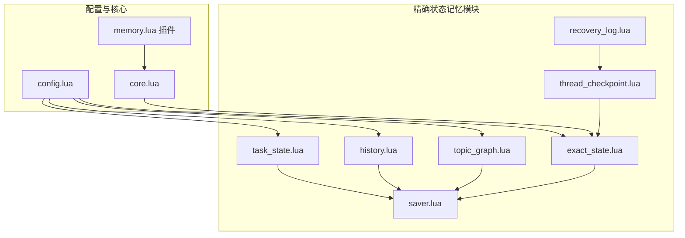
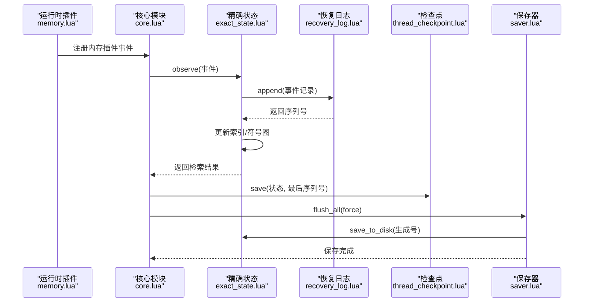
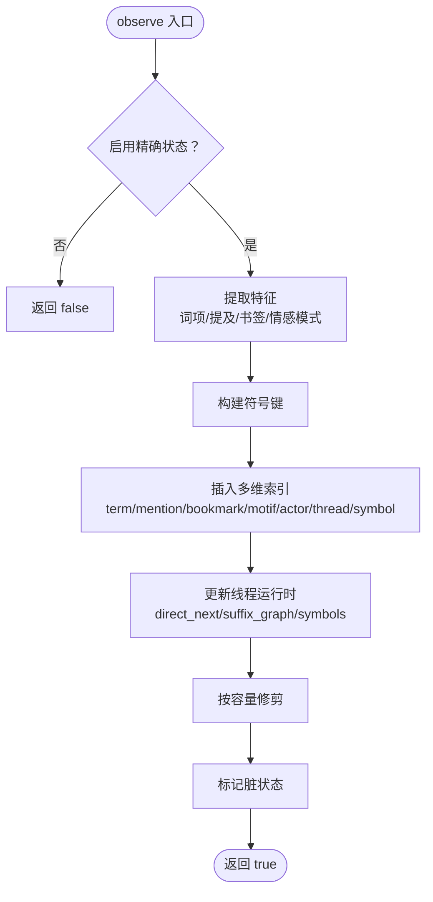
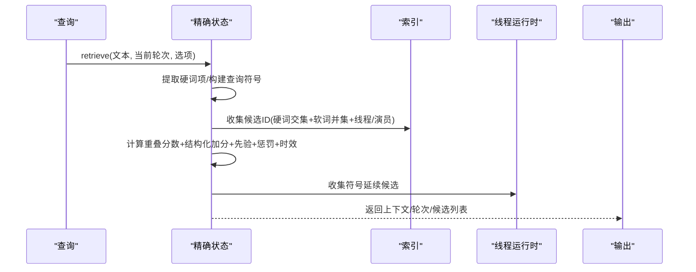
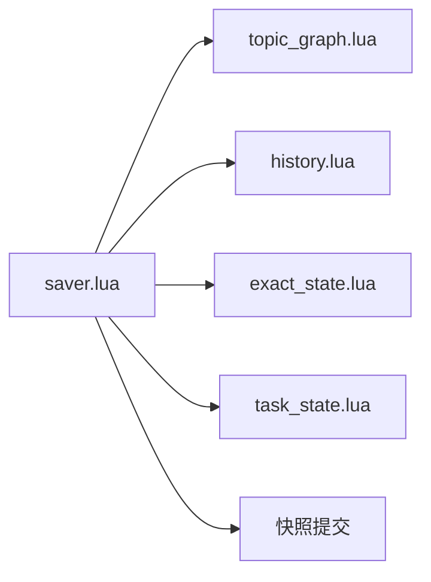
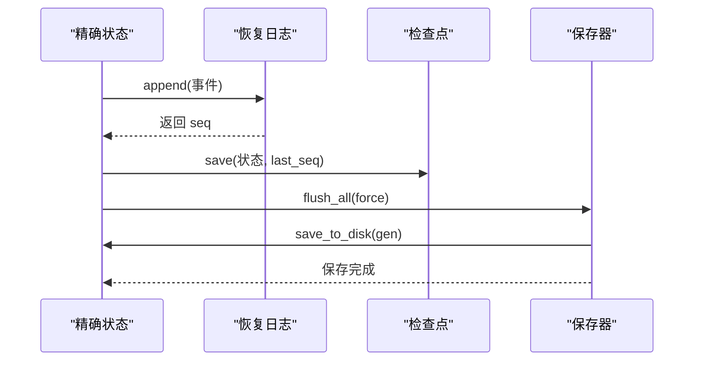
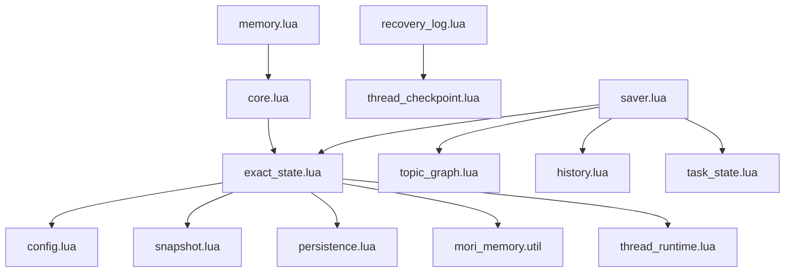

# 精确状态记忆 (Exact State Memory)

<cite>
**本文档引用的文件**
- [exact_state.lua](file://mori_memory/module/memory/exact_state.lua)
- [topic_graph.lua](file://mori_memory/module/memory/topic_graph.lua)
- [history.lua](file://mori_memory/module/memory/history.lua)
- [task_state.lua](file://mori_memory/module/memory/task_state.lua)
- [saver.lua](file://mori_memory/module/memory/saver.lua)
- [recovery_log.lua](file://mori_memory/module/memory/recovery_log.lua)
- [thread_checkpoint.lua](file://mori_memory/module/memory/thread_checkpoint.lua)
- [config.lua](file://mori_memory/module/config.lua)
- [core.lua](file://mori_memory/mori_memory/core.lua)
- [memory.lua](file://mori_runtime/lua/mori/plugins/memory.lua)
- [MORI_MEMORY_CONSISTENCY_ANALYSIS.md](file://MORI_MEMORY_CONSISTENCY_ANALYSIS.md)
- [MORI_MEMORY_IMPLEMENTATION_PLAN.md](file://MORI_MEMORY_IMPLEMENTATION_PLAN.md)
- [MORI_MEMORY_ARCHITECTURE_REFACTOR_SUMMARY.md](file://MORI_MEMORY_ARCHITECTURE_REFACTOR_SUMMARY.md)
</cite>

## 目录
1. [简介](#简介)
2. [项目结构](#项目结构)
3. [核心组件](#核心组件)
4. [架构概览](#架构概览)
5. [详细组件分析](#详细组件分析)
6. [依赖关系分析](#依赖关系分析)
7. [性能考量](#性能考量)
8. [故障排查指南](#故障排查指南)
9. [结论](#结论)
10. [附录](#附录)

## 简介
精确状态记忆（Exact State Memory）是 Mori Memory 系统中的核心子系统，专注于提供高精度、可追溯、可恢复的实时状态存储与检索能力。其设计目标包括：
- 实时状态跟踪：对每一轮对话事件进行精确索引与存储，支持基于文本特征、提及、书签、情感模式的精确匹配。
- 精确信息存储：构建多维索引（词项、提及、书签、情感模式、符号序列）以支持高效检索与上下文生成。
- 状态变更检测机制：通过增量更新、符号图重建、线程运行时维护，确保状态变更的可见性与一致性。
- 与主题图谱、历史记录、任务状态等其他记忆类型的协调：通过统一的保存器与快照机制，保证多模块状态的一致性与原子性。

## 项目结构
精确状态记忆位于 mori_memory/module/memory 目录下，核心文件包括：
- exact_state.lua：精确状态的观察、检索、索引与持久化
- topic_graph.lua：主题图谱（与精确状态协同）
- history.lua：历史记录（与精确状态协同）
- task_state.lua：任务状态（与精确状态协同）
- saver.lua：统一保存器（协调多模块持久化）
- recovery_log.lua：恢复日志（WAL）
- thread_checkpoint.lua：线程检查点（持久化快照）

**图表来源**
- [exact_state.lua:1-1529](file://mori_memory/module/memory/exact_state.lua#L1-L1529)
- [topic_graph.lua:1-3783](file://mori_memory/module/memory/topic_graph.lua#L1-L3783)
- [history.lua:1-195](file://mori_memory/module/memory/history.lua#L1-L195)
- [task_state.lua:1-305](file://mori_memory/module/memory/task_state.lua#L1-L305)
- [saver.lua:1-67](file://mori_memory/module/memory/saver.lua#L1-L67)
- [recovery_log.lua:1-121](file://mori_memory/module/memory/recovery_log.lua#L1-L121)
- [thread_checkpoint.lua:1-76](file://mori_memory/module/memory/thread_checkpoint.lua#L1-L76)
- [config.lua:1-680](file://mori_memory/module/config.lua#L1-L680)
- [core.lua:1-2324](file://mori_memory/mori_memory/core.lua#L1-L2324)
- [memory.lua:1-28](file://mori_runtime/lua/mori/plugins/memory.lua#L1-L28)

**章节来源**
- [exact_state.lua:1-1529](file://mori_memory/module/memory/exact_state.lua#L1-L1529)
- [config.lua:1-680](file://mori_memory/module/config.lua#L1-L680)
- [core.lua:1-2324](file://mori_memory/mori_memory/core.lua#L1-L2324)

## 核心组件
- 精确状态引擎（exact_state）：负责事件观察、特征提取、索引构建、检索与上下文生成，支持符号序列图与线程运行时维护。
- 统一保存器（saver）：协调 topic_graph、history、exact_state、task_state 的原子保存与快照提交。
- 恢复日志（recovery_log）：WAL 形式的事件日志，记录序列号、轮次、作用域与状态片段。
- 线程检查点（thread_checkpoint）：持久化线程运行时状态与最后序列号，用于崩溃恢复。
- 配置中心（config）：提供精确匹配、符号序列、检索限制等参数配置。

**章节来源**
- [exact_state.lua:969-1529](file://mori_memory/module/memory/exact_state.lua#L969-L1529)
- [saver.lua:10-51](file://mori_memory/module/memory/saver.lua#L10-L51)
- [recovery_log.lua:84-121](file://mori_memory/module/memory/recovery_log.lua#L84-L121)
- [thread_checkpoint.lua:26-76](file://mori_memory/module/memory/thread_checkpoint.lua#L26-L76)
- [config.lua:87-145](file://mori_memory/module/config.lua#L87-L145)

## 架构概览
精确状态记忆在系统中的位置与交互如下：

**图表来源**
- [memory.lua:8-26](file://mori_runtime/lua/mori/plugins/memory.lua#L8-L26)
- [core.lua:227-262](file://mori_memory/mori_memory/core.lua#L227-L262)
- [exact_state.lua:969-1030](file://mori_memory/module/memory/exact_state.lua#L969-L1030)
- [recovery_log.lua:84-110](file://mori_memory/module/memory/recovery_log.lua#L84-L110)
- [thread_checkpoint.lua:60-73](file://mori_memory/module/memory/thread_checkpoint.lua#L60-L73)
- [saver.lua:10-51](file://mori_memory/module/memory/saver.lua#L10-L51)

## 详细组件分析

### 精确状态引擎（exact_state）
- 观察与索引
  - observe：接收事件，提取词项权重、提及、书签、情感模式，生成符号键，更新桶内事件表与多维索引（term、mention、bookmark、motif、actor、thread、symbol），并维护线程运行时的符号图与后缀图。
  - 线程运行时：维护 direct_next 边、suffix_graph（后缀长度 1..k）、symbols 列表与 last_turn，支持符号延续候选生成。
- 检索与上下文生成
  - retrieve：基于查询文本提取硬词项（fact:id、=键值对、数字/下划线标识），在候选集中计算重叠分数，应用结构化加分、先验权重、查询倾向惩罚与时效衰减，排序并截断，生成精确命中片段与符号延续候选上下文。
  - reply_parent_hint：在启用时，基于最近窗口内的事件，按领头名、URL、短文本、词汇重叠等启发式规则，提供回复父节点提示。
- 存储与版本控制
  - load/save_to_disk：加载/保存状态，包含版本号、下一个事件 ID 与作用域桶集合；保存时写入快照生成号。
  - 脏标记：通过 saver.mark_dirty 通知统一保存器进行原子保存。

**图表来源**
- [exact_state.lua:969-1030](file://mori_memory/module/memory/exact_state.lua#L969-L1030)
- [exact_state.lua:810-863](file://mori_memory/module/memory/exact_state.lua#L810-L863)
- [exact_state.lua:900-906](file://mori_memory/module/memory/exact_state.lua#L900-L906)

**章节来源**
- [exact_state.lua:969-1529](file://mori_memory/module/memory/exact_state.lua#L969-L1529)

### 检索与上下文生成流程
- 查询预处理：过滤硬词项，构建查询符号键。
- 候选收集：按硬词项交集与软词项并集收集事件 ID，补充线程/演员索引。
- 评分与排序：计算重叠分数，叠加结构化加分、先验权重、惩罚与时效衰减，按分数与轮次排序并截断。
- 上下文拼装：生成精确命中片段与符号延续候选上下文，汇总所选轮次。

**图表来源**
- [exact_state.lua:1378-1526](file://mori_memory/module/memory/exact_state.lua#L1378-L1526)
- [exact_state.lua:1263-1376](file://mori_memory/module/memory/exact_state.lua#L1263-L1376)

**章节来源**
- [exact_state.lua:1378-1529](file://mori_memory/module/memory/exact_state.lua#L1378-L1529)

### 与主题图谱、历史记录、任务状态的协调
- 统一保存：saver.flush_all 依次保存 topic_graph、history、exact_state、task_state，并提交快照，确保多模块原子性。
- 版本与生成号：各模块保存时携带快照生成号，用于一致性校验与恢复。
- 配置联动：精确匹配参数（检索限制、最小分数、先验权重、时效衰减、符号序列参数等）在 config.lua 中集中管理。

**图表来源**
- [saver.lua:10-51](file://mori_memory/module/memory/saver.lua#L10-L51)
- [config.lua:87-145](file://mori_memory/module/config.lua#L87-L145)

**章节来源**
- [saver.lua:10-51](file://mori_memory/module/memory/saver.lua#L10-L51)
- [config.lua:87-145](file://mori_memory/module/config.lua#L87-L145)

### 恢复日志与检查点机制
- 恢复日志（WAL）：记录事件序列号、轮次、作用域与状态片段，支持按 last_seq 追加与加载。
- 线程检查点：保存线程运行时状态与最后序列号，用于崩溃恢复与增量恢复。
- 一致性保障：通过序列号分配、原子写入与快照提交，尽量保证持久化顺序与一致性。

**图表来源**
- [exact_state.lua:969-1030](file://mori_memory/module/memory/exact_state.lua#L969-L1030)
- [recovery_log.lua:84-121](file://mori_memory/module/memory/recovery_log.lua#L84-L121)
- [thread_checkpoint.lua:60-76](file://mori_memory/module/memory/thread_checkpoint.lua#L60-L76)
- [saver.lua:10-51](file://mori_memory/module/memory/saver.lua#L10-L51)

**章节来源**
- [recovery_log.lua:1-121](file://mori_memory/module/memory/recovery_log.lua#L1-L121)
- [thread_checkpoint.lua:1-76](file://mori_memory/module/memory/thread_checkpoint.lua#L1-L76)

## 依赖关系分析
- 组件耦合
  - exact_state 依赖 config（参数）、util（编码/解析）、snapshot（生成号）、persistence（原子写入）、index（多维索引）、thread_runtime（符号图）。
  - saver 依赖各模块的 save_to_disk 与 snapshot.commit，形成统一协调。
  - recovery_log/thread_checkpoint 与 exact_state 的持久化流程紧密耦合。
- 外部依赖
  - 运行时插件 memory.lua 通过 bus 事件桥接 core.lua 与 exact_state。
  - 配置中心 config.lua 提供精确匹配、符号序列、检索限制等参数。

**图表来源**
- [exact_state.lua:1-1529](file://mori_memory/module/memory/exact_state.lua#L1-L1529)
- [saver.lua:1-67](file://mori_memory/module/memory/saver.lua#L1-L67)
- [recovery_log.lua:1-121](file://mori_memory/module/memory/recovery_log.lua#L1-L121)
- [thread_checkpoint.lua:1-76](file://mori_memory/module/memory/thread_checkpoint.lua#L1-L76)
- [core.lua:1-2324](file://mori_memory/mori_memory/core.lua#L1-L2324)
- [memory.lua:1-28](file://mori_runtime/lua/mori/plugins/memory.lua#L1-L28)
- [config.lua:1-680](file://mori_memory/module/config.lua#L1-L680)

**章节来源**
- [core.lua:1-2324](file://mori_memory/mori_memory/core.lua#L1-L2324)
- [memory.lua:1-28](file://mori_runtime/lua/mori/plugins/memory.lua#L1-L28)

## 性能考量
- 索引规模与检索成本：精确匹配依赖多维索引（term/mention/bookmark/motif/actor/thread/symbol），检索时需在候选集中计算重叠分数并排序，建议合理设置检索限制与最小分数阈值。
- 符号序列图：线程运行时维护 suffix_graph 与 direct_next，后缀长度与延续候选数量受配置控制，应平衡召回与性能。
- 持久化开销：统一保存器串行保存多模块，建议在内存压力或周期性检查点时触发保存，避免频繁全量保存。
- WAL 与检查点：WAL 追加与检查点保存需注意序列号分配与原子写入，避免竞态与数据不一致。

[本节为通用指导，无需具体文件分析]

## 故障排查指南
- 状态不一致与竞态
  - WAL 序列号分配与文件写入存在竞态风险，建议参考一致性分析报告中的锁机制与序列号池方案。
  - 检查点可能指向未持久化的 WAL 记录，需确保 WAL 已刷盘后再创建检查点。
- 模块状态不同步
  - 各模块独立维护脏标记，建议通过 saver 的统一保存流程，确保多模块原子提交。
- 恢复与校验
  - 检查点与 WAL 的校验和验证有助于发现损坏与不一致，建议在加载时进行完整性校验。
- 监控与告警
  - 建议监控序列号间隙、检查点滞后、内存使用率与一致性率，设置阈值告警。

**章节来源**
- [MORI_MEMORY_CONSISTENCY_ANALYSIS.md:1-649](file://MORI_MEMORY_CONSISTENCY_ANALYSIS.md#L1-L649)
- [MORI_MEMORY_IMPLEMENTATION_PLAN.md:1-714](file://MORI_MEMORY_IMPLEMENTATION_PLAN.md#L1-L714)

## 结论
精确状态记忆通过多维索引与符号序列图，实现了对实时对话事件的高精度存储与检索；通过统一保存器与快照机制，确保多模块状态的一致性与原子性。结合配置中心的参数化控制与恢复日志/检查点机制，系统能够在生产环境中提供可靠的精确状态记忆能力。后续可通过锁机制、版本向量与增量持久化等手段进一步提升一致性与性能。

[本节为总结性内容，无需具体文件分析]

## 附录

### 配置选项（与精确状态相关）
- 精确匹配启用与存储根路径
  - exact_state.enabled：启用精确状态
  - exact_state.storage_root：精确状态存储根路径
- 检索参数
  - topic_graph.exact_match.retrieve_limit：检索返回条数上限
  - topic_graph.exact_match.retrieve_min_score：最小匹配分数
  - topic_graph.exact_match.prior_weight：先验权重
  - topic_graph.exact_match.recency_penalty：时效衰减系数
  - topic_graph.exact_match.actor_bonus：演员先验加分
  - topic_graph.exact_match.thread_bonus：线程先验加分
- 回复父节点提示
  - topic_graph.exact_match.reply_parent_enabled：启用回复父节点提示
  - topic_graph.exact_match.reply_parent_window：最近窗口大小
  - topic_graph.exact_match.reply_parent_min_score：提示最小分数
  - topic_graph.exact_match.reply_parent_sources：允许的来源列表
- 符号序列与延续
  - topic_graph.exact_match.symbolic_enabled：启用符号序列
  - topic_graph.exact_match.suffix_max_len：后缀最大长度
  - topic_graph.exact_match.continuation_limit：延续候选上限
  - topic_graph.exact_match.continuation_min_score：延续最小分数
  - topic_graph.exact_match.continuation_edge_bonus：延续边奖励
  - topic_graph.exact_match.continuation_count_weight：延续计数权重
  - topic_graph.exact_match.continuation_length_bonus：延续长度奖励
- 作用域容量
  - topic_graph.exact_match.scope_event_cap：作用域事件容量

**章节来源**
- [config.lua:87-145](file://mori_memory/module/config.lua#L87-L145)

### 使用示例（路径指引）
- 观察事件并更新索引
  - [exact_state.observe:969-1030](file://mori_memory/module/memory/exact_state.lua#L969-L1030)
- 检索上下文
  - [exact_state.retrieve:1378-1526](file://mori_memory/module/memory/exact_state.lua#L1378-L1526)
- 生成回复父节点提示
  - [exact_state.reply_parent_hint:1032-1126](file://mori_memory/module/memory/exact_state.lua#L1032-L1126)
- 保存精确状态
  - [exact_state.save_to_disk:947-967](file://mori_memory/module/memory/exact_state.lua#L947-L967)
- 统一保存多模块
  - [saver.flush_all:10-51](file://mori_memory/module/memory/saver.lua#L10-L51)

### 最佳实践
- 合理设置检索参数：根据业务场景调整检索上限、最小分数与先验权重，平衡召回与性能。
- 控制符号序列长度：根据对话复杂度调整后缀最大长度与延续候选上限，避免过度计算。
- 定期触发保存：在周期性检查点或内存压力较大时触发 saver.flush_all，避免长时间未持久化。
- 监控 WAL 与检查点：关注序列号间隙与检查点滞后，及时发现潜在一致性问题。

**章节来源**
- [MORI_MEMORY_CONSISTENCY_ANALYSIS.md:1-649](file://MORI_MEMORY_CONSISTENCY_ANALYSIS.md#L1-L649)
- [MORI_MEMORY_IMPLEMENTATION_PLAN.md:1-714](file://MORI_MEMORY_IMPLEMENTATION_PLAN.md#L1-L714)