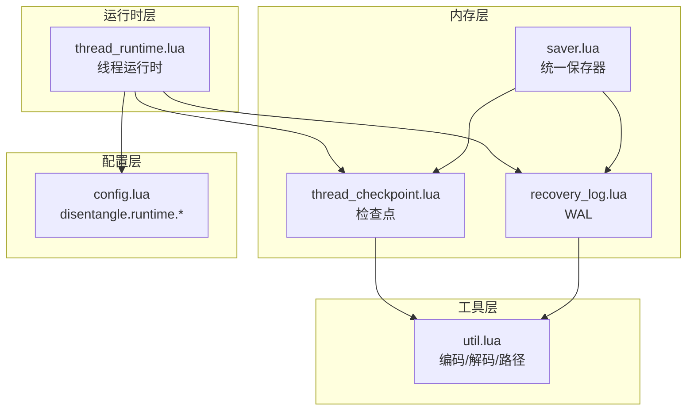
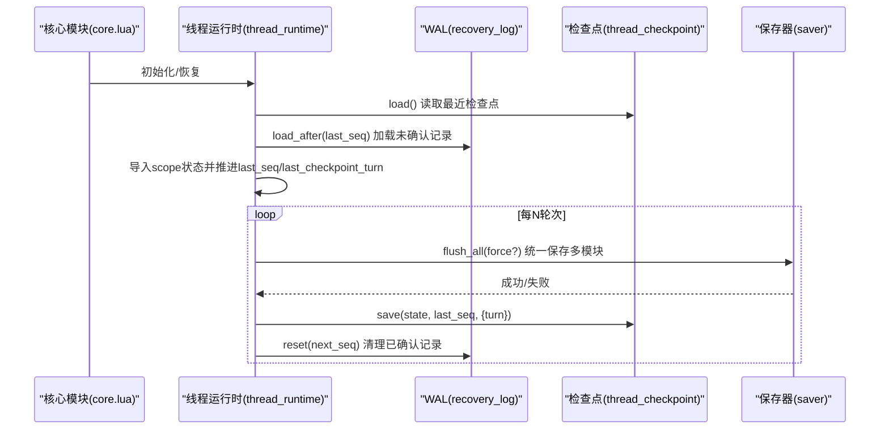
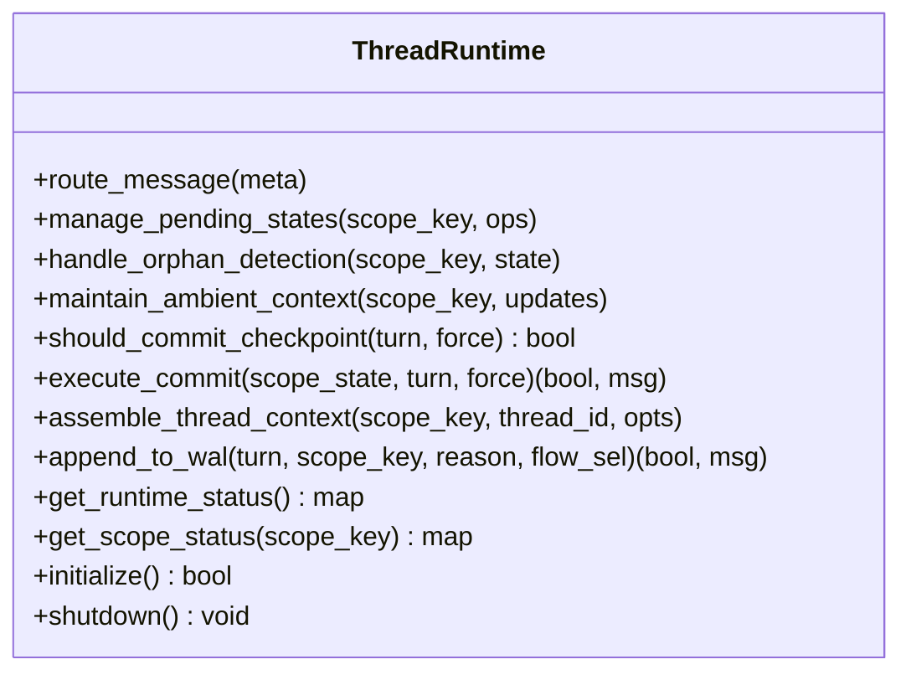
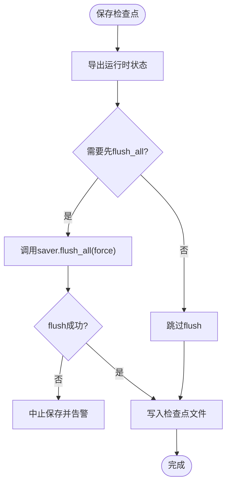
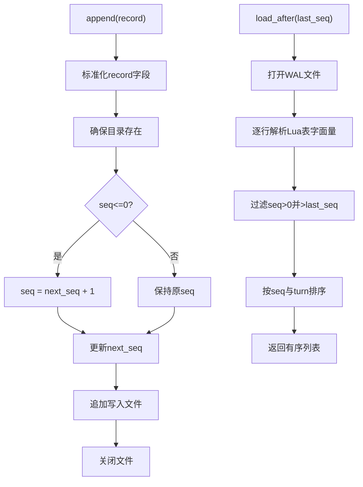
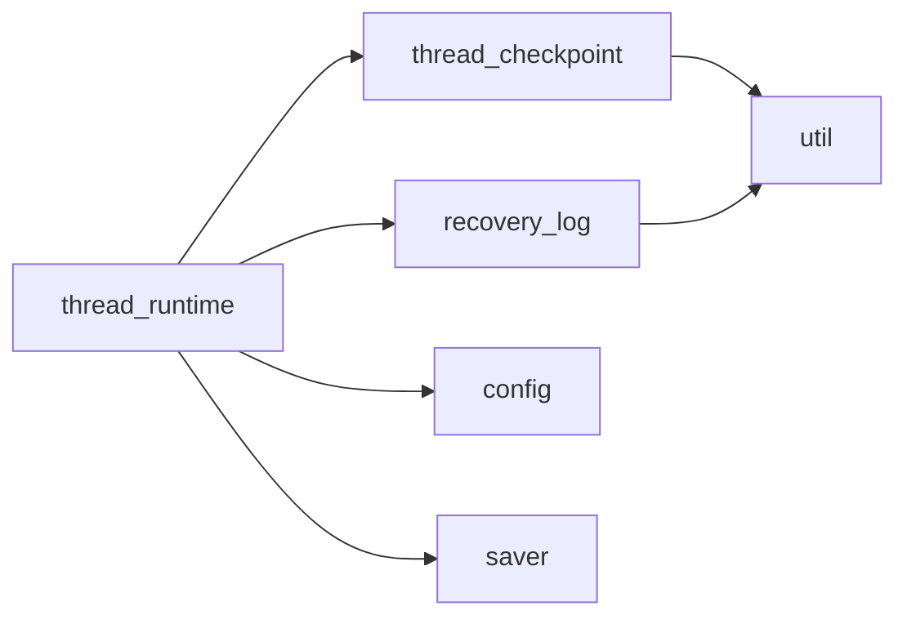

# 线程检查点记忆 (Thread Checkpoint Memory)

<cite>
**本文档引用的文件**
- [mori_memory/core.lua](file://mori_memory/mori_memory/core.lua)
- [module/runtime/thread_runtime.lua](file://mori_memory/module/runtime/thread_runtime.lua)
- [module/memory/thread_checkpoint.lua](file://mori_memory/module/memory/thread_checkpoint.lua)
- [module/memory/recovery_log.lua](file://mori_memory/module/memory/recovery_log.lua)
- [module/memory/saver.lua](file://mori_memory/module/memory/saver.lua)
- [module/config.lua](file://mori_memory/module/config.lua)
- [mori_memory/util.lua](file://mori_memory/mori_memory/util.lua)
- [MORI_MEMORY_CONSISTENCY_ANALYSIS.md](file://MORI_MEMORY_CONSISTENCY_ANALYSIS.md)
- [MORI_MEMORY_ARCHITECTURE_REFACTOR_SUMMARY.md](file://MORI_MEMORY_ARCHITECTURE_REFACTOR_SUMMARY.md)
</cite>

## 目录
1. [简介](#简介)
2. [项目结构](#项目结构)
3. [核心组件](#核心组件)
4. [架构总览](#架构总览)
5. [详细组件分析](#详细组件分析)
6. [依赖关系分析](#依赖关系分析)
7. [性能考量](#性能考量)
8. [故障排查指南](#故障排查指南)
9. [结论](#结论)
10. [附录](#附录)

## 简介
本文件系统性阐述线程检查点记忆（Thread Checkpoint Memory）的设计目标、工作机制与工程实现，重点覆盖：
- 多线程状态同步与一致性保障
- 检查点创建与状态恢复流程
- 检查点数据结构定义（线程标识、状态快照、时间戳、依赖关系）
- 生命周期管理（创建时机、清理策略、存储优化）
- 多线程环境下的强一致性和弱一致场景权衡
- 性能影响与故障恢复策略

## 项目结构
围绕线程检查点记忆的相关模块主要分布在以下位置：
- 运行时层：负责线程运行时的路由、状态管理、提交时机控制与上下文组装
- 内存层：提供检查点持久化、预写日志（WAL）与统一保存器
- 配置层：提供运行时根目录、检查点间隔等关键参数
- 工具层：提供序列化/反序列化、路径解析等通用能力

**图表来源**
- [module/runtime/thread_runtime.lua:1-260](file://mori_memory/module/runtime/thread_runtime.lua#L1-L260)
- [module/memory/thread_checkpoint.lua:1-76](file://mori_memory/module/memory/thread_checkpoint.lua#L1-L76)
- [module/memory/recovery_log.lua:1-121](file://mori_memory/module/memory/recovery_log.lua#L1-L121)
- [module/memory/saver.lua:1-67](file://mori_memory/module/memory/saver.lua#L1-L67)
- [module/config.lua:492-496](file://mori_memory/module/config.lua#L492-L496)
- [mori_memory/util.lua:1-153](file://mori_memory/mori_memory/util.lua#L1-L153)

**章节来源**
- [module/runtime/thread_runtime.lua:1-260](file://mori_memory/module/runtime/thread_runtime.lua#L1-L260)
- [module/memory/thread_checkpoint.lua:1-76](file://mori_memory/module/memory/thread_checkpoint.lua#L1-L76)
- [module/memory/recovery_log.lua:1-121](file://mori_memory/module/memory/recovery_log.lua#L1-L121)
- [module/memory/saver.lua:1-67](file://mori_memory/module/memory/saver.lua#L1-L67)
- [module/config.lua:492-496](file://mori_memory/module/config.lua#L492-L496)
- [mori_memory/util.lua:1-153](file://mori_memory/mori_memory/util.lua#L1-L153)

## 核心组件
- 线程运行时（Thread Runtime）
  - 路由边界管理、pending状态管理、orphan检测与处理、ambient状态维护
  - 提供检查点提交时机判断与执行、WAL追加、运行时状态查询与初始化
- 检查点（Thread Checkpoint）
  - 保存线程运行时状态快照、记录最后序列号与保存轮次、时间戳
- 预写日志（Recovery Log/WAL）
  - 记录scope状态变更事件，按序列号有序存储，支持从指定序列号之后加载
- 统一保存器（Saver）
  - 负责将多模块状态原子性地落盘，配合检查点形成最终持久化
- 配置（Config）
  - 提供运行时根目录、检查点间隔轮次等参数

**章节来源**
- [module/runtime/thread_runtime.lua:24-243](file://mori_memory/module/runtime/thread_runtime.lua#L24-L243)
- [module/memory/thread_checkpoint.lua:26-73](file://mori_memory/module/memory/thread_checkpoint.lua#L26-L73)
- [module/memory/recovery_log.lua:47-118](file://mori_memory/module/memory/recovery_log.lua#L47-L118)
- [module/memory/saver.lua:10-51](file://mori_memory/module/memory/saver.lua#L10-L51)
- [module/config.lua:492-496](file://mori_memory/module/config.lua#L492-L496)

## 架构总览
线程检查点记忆通过“WAL先行 + 检查点周期性保存 + 统一保存器落盘”的三层协同，实现多线程状态的可靠持久化与快速恢复。

**图表来源**
- [mori_memory/core.lua:261-296](file://mori_memory/mori_memory/core.lua#L261-L296)
- [module/runtime/thread_runtime.lua:221-243](file://mori_memory/module/runtime/thread_runtime.lua#L221-L243)
- [module/memory/thread_checkpoint.lua:60-73](file://mori_memory/module/memory/thread_checkpoint.lua#L60-L73)
- [module/memory/recovery_log.lua:112-118](file://mori_memory/module/memory/recovery_log.lua#L112-L118)
- [module/memory/saver.lua:10-51](file://mori_memory/module/memory/saver.lua#L10-L51)

## 详细组件分析

### 线程运行时（Thread Runtime）
- 路由与上下文
  - 路由选择、pending状态管理、orphan检测、ambient上下文维护
  - 提供线程本地上下文组装接口
- 检查点提交控制
  - 基于配置的检查点间隔轮次判断
  - 执行状态导出、检查点保存、WAL重置
- WAL管理
  - 追加scope状态记录，维护next_seq与last_seq
- 初始化与恢复
  - 加载检查点，从WAL恢复未确认状态，设置next_seq

**图表来源**
- [module/runtime/thread_runtime.lua:24-243](file://mori_memory/module/runtime/thread_runtime.lua#L24-L243)

**章节来源**
- [module/runtime/thread_runtime.lua:24-243](file://mori_memory/module/runtime/thread_runtime.lua#L24-L243)

### 检查点（Thread Checkpoint）
- 数据结构
  - 版本号、最后序列号、保存轮次、保存时间、状态快照
- 存储与加载
  - 原子写入，Lua表字面量编码，路径解析
- 创建时机
  - 达到配置的轮次间隔或强制提交时触发

**图表来源**
- [module/runtime/thread_runtime.lua:125-152](file://mori_memory/module/runtime/thread_runtime.lua#L125-L152)
- [module/memory/thread_checkpoint.lua:60-73](file://mori_memory/module/memory/thread_checkpoint.lua#L60-L73)
- [module/memory/saver.lua:10-51](file://mori_memory/module/memory/saver.lua#L10-L51)

**章节来源**
- [module/memory/thread_checkpoint.lua:26-73](file://mori_memory/module/memory/thread_checkpoint.lua#L26-L73)

### 预写日志（WAL）
- 记录格式
  - 序列号、轮次、记录类型、作用域键、原因、scope状态
- 追加与加载
  - 自增序列号、排序加载、去重与过滤
- 清理
  - 基于next_seq重置WAL内容

**图表来源**
- [module/memory/recovery_log.lua:84-118](file://mori_memory/module/memory/recovery_log.lua#L84-L118)

**章节来源**
- [module/memory/recovery_log.lua:47-118](file://mori_memory/module/memory/recovery_log.lua#L47-L118)

### 统一保存器（Saver）
- 职责
  - 调用各模块保存接口，统一提交快照，标记脏状态
- 行为
  - 仅在脏状态或强制时执行，失败时保留脏标记以便重试

**章节来源**
- [module/memory/saver.lua:10-51](file://mori_memory/module/memory/saver.lua#L10-L51)

### 配置（Config）
- 关键参数
  - 运行时根目录、检查点间隔轮次
- 解析
  - 支持相对路径解析与策略配置应用

**章节来源**
- [module/config.lua:492-496](file://mori_memory/module/config.lua#L492-L496)
- [module/config.lua:670-677](file://mori_memory/module/config.lua#L670-L677)

## 依赖关系分析
- 线程运行时依赖
  - 检查点模块：保存状态快照
  - WAL模块：记录scope状态变更
  - 配置模块：读取运行时根目录与检查点间隔
  - 保存器模块：在必要时统一落盘
- 恢复流程
  - 从检查点加载状态，再从WAL增量恢复未确认记录

**图表来源**
- [module/runtime/thread_runtime.lua:1-12](file://mori_memory/module/runtime/thread_runtime.lua#L1-L12)
- [module/memory/thread_checkpoint.lua:1-3](file://mori_memory/module/memory/thread_checkpoint.lua#L1-L3)
- [module/memory/recovery_log.lua:1-3](file://mori_memory/module/memory/recovery_log.lua#L1-L3)
- [mori_memory/util.lua:1-153](file://mori_memory/mori_memory/util.lua#L1-L153)

**章节来源**
- [module/runtime/thread_runtime.lua:1-12](file://mori_memory/module/runtime/thread_runtime.lua#L1-L12)
- [module/memory/thread_checkpoint.lua:1-3](file://mori_memory/module/memory/thread_checkpoint.lua#L1-L3)
- [module/memory/recovery_log.lua:1-3](file://mori_memory/module/memory/recovery_log.lua#L1-L3)
- [mori_memory/util.lua:1-153](file://mori_memory/mori_memory/util.lua#L1-L153)

## 性能考量
- 检查点间隔
  - 通过配置控制轮次间隔，平衡持久化开销与恢复粒度
- WAL写入
  - 顺序追加写入，避免随机IO；序列号自增，降低竞争
- 统一保存器
  - 脏标记驱动，避免频繁全量保存；失败时重试
- 内存压力
  - 通过内存限制与GC控制缓解压力，但需注意与持久化之间的协调

**章节来源**
- [module/config.lua:492-496](file://mori_memory/module/config.lua#L492-L496)
- [module/memory/saver.lua:10-51](file://mori_memory/module/memory/saver.lua#L10-L51)
- [MORI_MEMORY_CONSISTENCY_ANALYSIS.md:430-473](file://MORI_MEMORY_CONSISTENCY_ANALYSIS.md#L430-L473)

## 故障排查指南
- 检查点缺失或损坏
  - 检查点文件不存在或解析失败时，系统会回退到重放WAL
  - 建议：确认运行时根目录权限与磁盘空间
- WAL损坏或乱序
  - WAL加载后按seq与turn排序；若出现gap，应检查写入并发与文件系统一致性
  - 建议：启用校验和与完整性检查（见一致性分析文档中的增强建议）
- 恢复不完整
  - 确认last_seq与saved_turn是否正确推进
  - 检查WAL重置是否成功
- 性能退化
  - 检查检查点间隔是否过密；评估保存器脏标记触发频率

**章节来源**
- [module/memory/thread_checkpoint.lua:26-58](file://mori_memory/module/memory/thread_checkpoint.lua#L26-L58)
- [module/memory/recovery_log.lua:47-82](file://mori_memory/module/memory/recovery_log.lua#L47-L82)
- [module/runtime/thread_runtime.lua:221-243](file://mori_memory/module/runtime/thread_runtime.lua#L221-L243)
- [MORI_MEMORY_CONSISTENCY_ANALYSIS.md:144-160](file://MORI_MEMORY_CONSISTENCY_ANALYSIS.md#L144-L160)

## 结论
线程检查点记忆通过“WAL先行 + 周期性检查点 + 统一保存”的组合，为多线程状态提供了可靠的持久化与恢复能力。其设计强调：
- 严格的运行时职责边界（Thread-First）
- 以轮次为单位的检查点节奏控制
- 以序列号为核心的WAL有序性保障
- 通过配置灵活调整持久化策略

在生产环境中，建议结合一致性分析文档中的增强方案（如锁机制、版本向量、校验和、增量检查点等）进一步提升可靠性与可运维性。

## 附录

### 检查点数据结构定义
- 字段
  - version：版本号
  - last_seq：最后确认的WAL序列号
  - saved_turn：保存时的轮次
  - saved_at：保存时间戳
  - state：线程运行时状态快照

**章节来源**
- [module/memory/thread_checkpoint.lua:63-69](file://mori_memory/module/memory/thread_checkpoint.lua#L63-L69)

### 生命周期管理
- 创建时机
  - 达到配置的检查点间隔轮次或强制提交
- 清理策略
  - 成功保存后重置WAL至last_seq之后的内容
- 存储优化
  - 使用原子写入与Lua表字面量编码，减少解析成本

**章节来源**
- [module/runtime/thread_runtime.lua:111-152](file://mori_memory/module/runtime/thread_runtime.lua#L111-L152)
- [module/memory/recovery_log.lua:112-118](file://mori_memory/module/memory/recovery_log.lua#L112-L118)
- [module/memory/thread_checkpoint.lua:60-73](file://mori_memory/module/memory/thread_checkpoint.lua#L60-L73)

### 多线程一致性与恢复策略
- 一致性
  - WAL保证事件顺序；检查点提供快照；保存器提供多模块原子落盘
- 恢复
  - 先加载检查点，再重放WAL增量；推进last_seq与last_checkpoint_turn
- 建议
  - 在高并发场景下引入序列号池或轻量锁，增强WAL写入的原子性

**章节来源**
- [mori_memory/core.lua:261-296](file://mori_memory/mori_memory/core.lua#L261-L296)
- [module/runtime/thread_runtime.lua:221-243](file://mori_memory/module/runtime/thread_runtime.lua#L221-L243)
- [MORI_MEMORY_CONSISTENCY_ANALYSIS.md:161-409](file://MORI_MEMORY_CONSISTENCY_ANALYSIS.md#L161-L409)