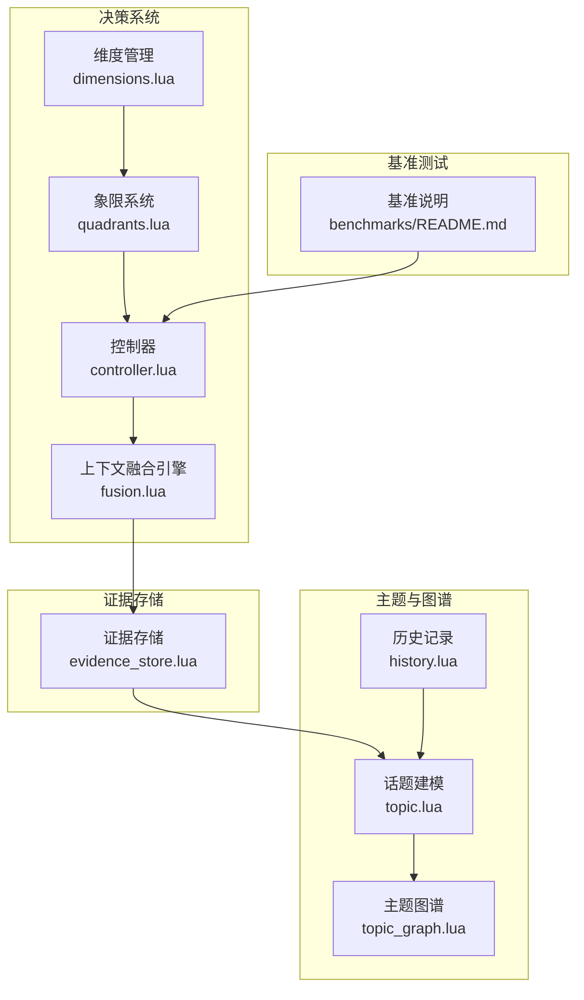
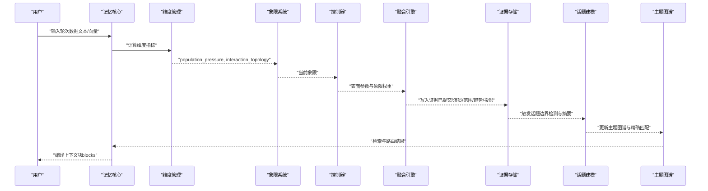
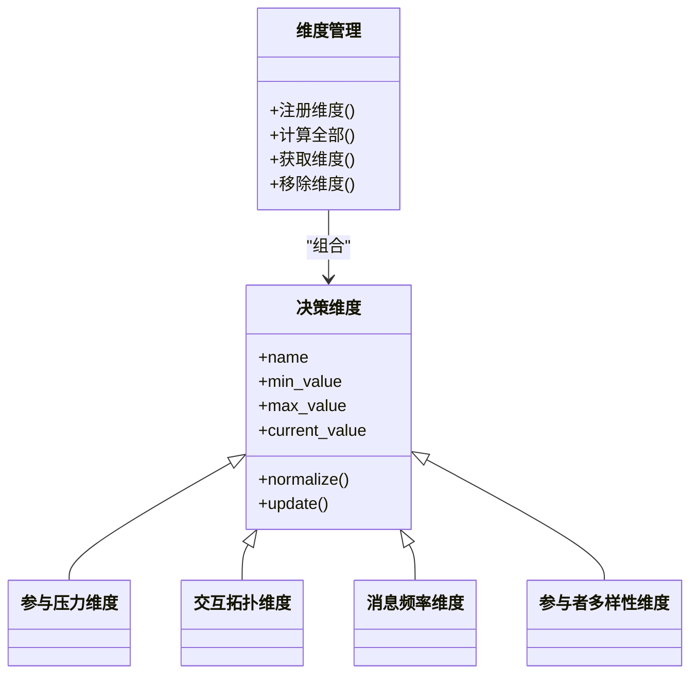
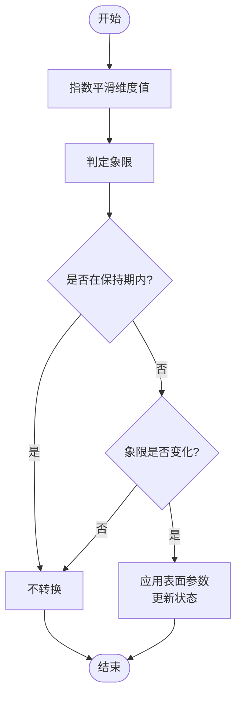
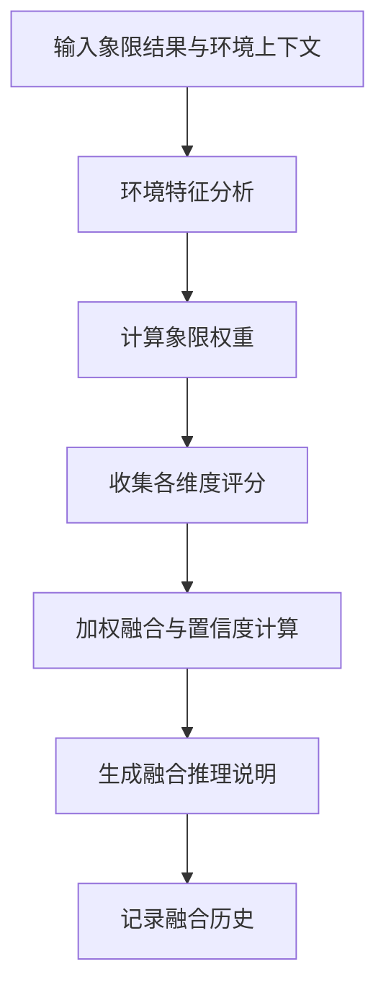
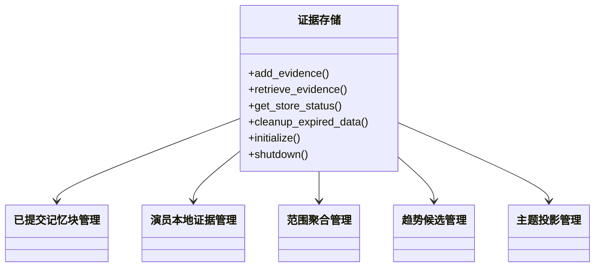
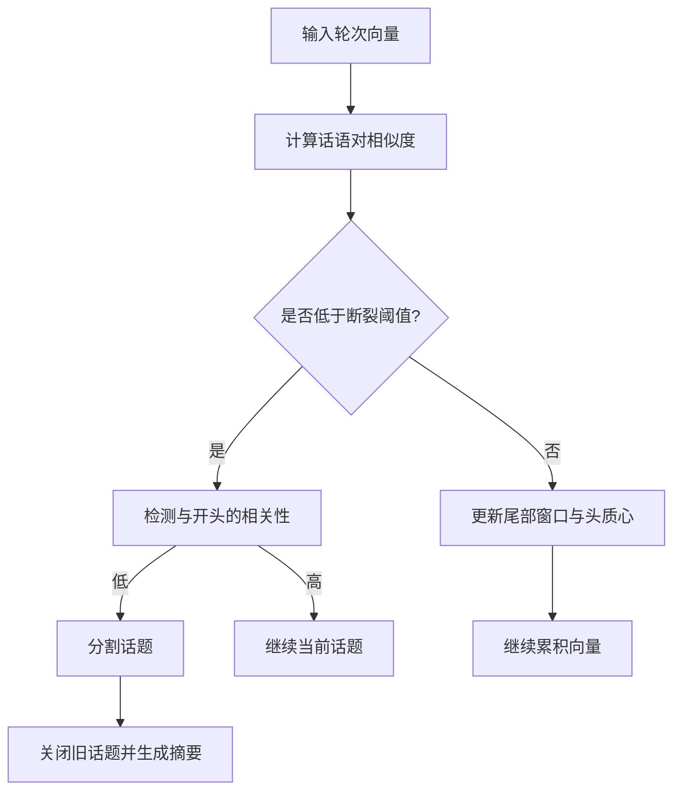
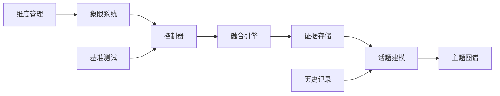

# 解缠记忆（Disentangle Memory）

<cite>
**本文引用的文件**
- [mori_memory/README.md](file://mori_memory/README.md)
- [mori_memory/module/decision/init.lua](file://mori_memory/module/decision/init.lua)
- [mori_memory/module/decision/fusion.lua](file://mori_memory/module/decision/fusion.lua)
- [mori_memory/module/decision/controller.lua](file://mori_memory/module/decision/controller.lua)
- [mori_memory/module/decision/quadrants.lua](file://mori_memory/module/decision/quadrants.lua)
- [mori_memory/module/decision/dimensions.lua](file://mori_memory/module/decision/dimensions.lua)
- [mori_memory/module/evidence/evidence_store.lua](file://mori_memory/module/evidence/evidence_store.lua)
- [mori_memory/module/memory/topic.lua](file://mori_memory/module/memory/topic.lua)
- [mori_memory/module/memory/topic_graph.lua](file://mori_memory/module/memory/topic_graph.lua)
- [mori_memory/module/memory/history.lua](file://mori_memory/module/memory/history.lua)
- [mori_memory/benchmarks/README.md](file://mori_memory/benchmarks/README.md)
- [mori_memory/agent_memory_simub.py](file://mori_memory/agent_memory_simub.py)
</cite>

## 目录
1. [简介](#简介)
2. [项目结构](#项目结构)
3. [核心组件](#核心组件)
4. [架构总览](#架构总览)
5. [详细组件分析](#详细组件分析)
6. [依赖关系分析](#依赖关系分析)
7. [性能考量](#性能考量)
8. [故障排查指南](#故障排查指南)
9. [结论](#结论)
10. [附录](#附录)

## 简介
本文件围绕“解缠记忆（Disentangle Memory）”进行系统化技术文档整理，聚焦以下目标：
- 理论基础与实现原理：多源信息分离、噪声过滤、信号增强
- 数学模型与算法：矩阵分解、主成分分析、独立成分分析等在话题建模与上下文融合中的应用
- 多模态数据处理：文本、语音、视觉信息的分离与融合
- 参数配置、性能评估指标与实际应用案例

本项目采用“线程优先”的记忆体系，结合“四象限决策系统”对上下文进行解耦与融合，通过话题建模与主题图谱实现跨轮、跨源、跨任务的稳定记忆抽取与路由。

## 项目结构
mori_memory 为核心记忆内核，提供：
- 决策系统模块：维度计算、象限规则、控制器与上下文融合引擎
- 证据存储模块：已提交记忆块、演员本地证据、范围聚合、趋势候选与主题投影
- 主题与主题图谱：话题聚类、摘要与向量索引、精确匹配与反馈学习
- 历史记录：对话轮次与文本持久化
- 基准测试：离线回放与指标评估

**图表来源**
- [mori_memory/module/decision/dimensions.lua:1-210](file://mori_memory/module/decision/dimensions.lua#L1-L210)
- [mori_memory/module/decision/quadrants.lua:1-285](file://mori_memory/module/decision/quadrants.lua#L1-L285)
- [mori_memory/module/decision/controller.lua:1-194](file://mori_memory/module/decision/controller.lua#L1-L194)
- [mori_memory/module/decision/fusion.lua:1-302](file://mori_memory/module/decision/fusion.lua#L1-L302)
- [mori_memory/module/evidence/evidence_store.lua:1-603](file://mori_memory/module/evidence/evidence_store.lua#L1-L603)
- [mori_memory/module/memory/topic.lua:1-800](file://mori_memory/module/memory/topic.lua#L1-L800)
- [mori_memory/module/memory/topic_graph.lua:1-800](file://mori_memory/module/memory/topic_graph.lua#L1-L800)
- [mori_memory/module/memory/history.lua:1-195](file://mori_memory/module/memory/history.lua#L1-L195)
- [mori_memory/benchmarks/README.md:1-200](file://mori_memory/benchmarks/README.md#L1-L200)

**章节来源**
- [mori_memory/README.md:1-89](file://mori_memory/README.md#L1-L89)

## 核心组件
- 决策维度与象限系统：将交互场景映射到四象限，提供稳定的压力与拓扑坐标，驱动控制器切换与路由策略
- 决策控制器：基于平滑与阈值判断的象限转换机制，结合表面参数调节信任、回退与保守度
- 上下文融合引擎：对多象限评分进行加权融合，输出置信度与推理说明，形成最终编译上下文
- 证据存储：统一管理已提交记忆块、演员本地证据、范围聚合、趋势候选与主题投影，支撑解耦与检索
- 话题建模与主题图谱：基于向量相似度与滑动窗口的“话语对建模”，实现话题边界检测与摘要生成；主题图谱提供精确匹配与反馈学习
- 历史记录：持久化对话轮次文本，支持回放与一致性校验

**章节来源**
- [mori_memory/module/decision/dimensions.lua:1-210](file://mori_memory/module/decision/dimensions.lua#L1-L210)
- [mori_memory/module/decision/quadrants.lua:1-285](file://mori_memory/module/decision/quadrants.lua#L1-L285)
- [mori_memory/module/decision/controller.lua:1-194](file://mori_memory/module/decision/controller.lua#L1-L194)
- [mori_memory/module/decision/fusion.lua:1-302](file://mori_memory/module/decision/fusion.lua#L1-L302)
- [mori_memory/module/evidence/evidence_store.lua:1-603](file://mori_memory/module/evidence/evidence_store.lua#L1-L603)
- [mori_memory/module/memory/topic.lua:1-800](file://mori_memory/module/memory/topic.lua#L1-L800)
- [mori_memory/module/memory/topic_graph.lua:1-800](file://mori_memory/module/memory/topic_graph.lua#L1-L800)
- [mori_memory/module/memory/history.lua:1-195](file://mori_memory/module/memory/history.lua#L1-L195)

## 架构总览
解缠记忆的总体流程如下：
- 输入：每轮对话的用户输入与向量表示（或通过嵌入器回调生成）
- 维度计算：从上下文提取参与压力、交互拓扑、消息频率、参与者多样性等指标
- 象限判定：根据维度坐标确定当前象限
- 控制器：基于平滑与阈值判断是否切换象限，输出表面参数
- 象限规则：按象限应用权重与阈值调整，得到各维度评分
- 融合引擎：对多象限评分进行加权融合，输出置信度与推理
- 证据存储：将本轮证据写入 committed_chunks、actor_local、scope_aggregate、trend_candidates、topic_projection
- 话题建模：基于向量相似度与滑动窗口检测话题边界，生成摘要
- 主题图谱：构建精确匹配与反馈学习，提升检索与路由质量
- 输出：编译后的上下文块（blocks）

**图表来源**
- [mori_memory/module/decision/dimensions.lua:1-210](file://mori_memory/module/decision/dimensions.lua#L1-L210)
- [mori_memory/module/decision/quadrants.lua:1-285](file://mori_memory/module/decision/quadrants.lua#L1-L285)
- [mori_memory/module/decision/controller.lua:1-194](file://mori_memory/module/decision/controller.lua#L1-L194)
- [mori_memory/module/decision/fusion.lua:1-302](file://mori_memory/module/decision/fusion.lua#L1-L302)
- [mori_memory/module/evidence/evidence_store.lua:1-603](file://mori_memory/module/evidence/evidence_store.lua#L1-L603)
- [mori_memory/module/memory/topic.lua:1-800](file://mori_memory/module/memory/topic.lua#L1-L800)
- [mori_memory/module/memory/topic_graph.lua:1-800](file://mori_memory/module/memory/topic_graph.lua#L1-L800)

## 详细组件分析

### 决策维度与象限系统
- 维度计算：参与压力、交互拓扑、消息频率、参与者多样性，均归一化到[0,1]范围
- 象限坐标：以参与压力为横轴、交互拓扑为纵轴，划分四象限
- 象限规则：为每个象限设定维度权重、优先级权重与阈值调整，形成象限特定的评分体系

**图表来源**
- [mori_memory/module/decision/dimensions.lua:1-210](file://mori_memory/module/decision/dimensions.lua#L1-L210)

**章节来源**
- [mori_memory/module/decision/dimensions.lua:1-210](file://mori_memory/module/decision/dimensions.lua#L1-L210)
- [mori_memory/module/decision/quadrants.lua:1-285](file://mori_memory/module/decision/quadrants.lua#L1-L285)

### 决策控制器
- 平滑处理：对维度值进行指数平滑，降低瞬时波动
- 象限判定：根据当前维度值确定象限
- 转换控制：设置保持回合与表面参数插值，避免频繁抖动
- 表面参数：按象限计算 peer 信号信任、hub 回退信任、写入保守度、读取局部性

**图表来源**
- [mori_memory/module/decision/controller.lua:1-194](file://mori_memory/module/decision/controller.lua#L1-L194)

**章节来源**
- [mori_memory/module/decision/controller.lua:1-194](file://mori_memory/module/decision/controller.lua#L1-L194)

### 上下文融合引擎
- 环境分析：从上下文提取消息频率、参与者多样性、稳定性、时间特征等
- 权重计算：基于环境特征与当前象限，计算四象限权重并归一化
- 评分融合：对各维度评分按权重加权求和，计算整体置信度
- 推理生成：汇总权重分布、环境影响与各象限主要考虑因素

**图表来源**
- [mori_memory/module/decision/fusion.lua:1-302](file://mori_memory/module/decision/fusion.lua#L1-L302)

**章节来源**
- [mori_memory/module/decision/fusion.lua:1-302](file://mori_memory/module/decision/fusion.lua#L1-L302)

### 证据存储
- 已提交记忆块：按时间、演员、范围索引，支持按条件检索与清理
- 演员本地证据：按演员组织，限制每演员证据数量
- 范围聚合：统计演员活动、主题分布、交互模式与互动总数
- 趋势候选：基于支持度、演员多样性与时间衰减计算置信度
- 主题投影：基于上下文匹配与新鲜度计算相关性分数

**图表来源**
- [mori_memory/module/evidence/evidence_store.lua:1-603](file://mori_memory/module/evidence/evidence_store.lua#L1-L603)

**章节来源**
- [mori_memory/module/evidence/evidence_store.lua:1-603](file://mori_memory/module/evidence/evidence_store.lua#L1-L603)

### 话题建模与主题图谱
- 话题建模：基于“话语对相似度”与滑动窗口，检测话题边界；支持最小话题长度约束与全局漂移兜底
- 摘要生成：分级摘要（full/slight/heavy/none），缓存与LLM按需生成
- 主题图谱：精确匹配、反馈学习、向量归一化与相似度计算，支持范围桶与快照管理

**图表来源**
- [mori_memory/module/memory/topic.lua:1-800](file://mori_memory/module/memory/topic.lua#L1-L800)

**章节来源**
- [mori_memory/module/memory/topic.lua:1-800](file://mori_memory/module/memory/topic.lua#L1-L800)
- [mori_memory/module/memory/topic_graph.lua:1-800](file://mori_memory/module/memory/topic_graph.lua#L1-L800)

### 历史记录
- 历史文件：V3 版本头与生成号，支持原子写入与快照一致性
- 文本转义：FIELD_SEP 与 RECORD_SEP 的转义与还原
- 轮次管理：按轮次获取用户/助手文本，支持保存与加载

**章节来源**
- [mori_memory/module/memory/history.lua:1-195](file://mori_memory/module/memory/history.lua#L1-L195)

## 依赖关系分析
- 决策系统依赖维度管理与工具模块，控制器与融合引擎共同决定上下文路由
- 证据存储为话题建模与主题图谱提供输入与输出，形成闭环
- 历史记录为话题建模提供文本回填能力，保障摘要生成与一致性
- 基准测试指导控制器与融合引擎的稳定性与可解释性

**图表来源**
- [mori_memory/module/decision/dimensions.lua:1-210](file://mori_memory/module/decision/dimensions.lua#L1-L210)
- [mori_memory/module/decision/quadrants.lua:1-285](file://mori_memory/module/decision/quadrants.lua#L1-L285)
- [mori_memory/module/decision/controller.lua:1-194](file://mori_memory/module/decision/controller.lua#L1-L194)
- [mori_memory/module/decision/fusion.lua:1-302](file://mori_memory/module/decision/fusion.lua#L1-L302)
- [mori_memory/module/evidence/evidence_store.lua:1-603](file://mori_memory/module/evidence/evidence_store.lua#L1-L603)
- [mori_memory/module/memory/topic.lua:1-800](file://mori_memory/module/memory/topic.lua#L1-L800)
- [mori_memory/module/memory/topic_graph.lua:1-800](file://mori_memory/module/memory/topic_graph.lua#L1-L800)
- [mori_memory/module/memory/history.lua:1-195](file://mori_memory/module/memory/history.lua#L1-L195)
- [mori_memory/benchmarks/README.md:1-200](file://mori_memory/benchmarks/README.md#L1-L200)

**章节来源**
- [mori_memory/module/decision/init.lua:1-21](file://mori_memory/module/decision/init.lua#L1-L21)

## 性能考量
- 向量化相似度与平均：在话题建模与主题图谱中广泛使用余弦相似度与向量平均，具备良好的可扩展性
- 索引与加速：支持 HNSW 与 SIMD 点积/余弦加速模块，可在缺失时回退纯 Lua 实现
- 内存与持久化：证据存储与历史记录采用分页与原子写入，减少 IO 抖动
- 融合与控制：控制器平滑与权重归一化降低象限抖动，提升稳定性

[本节为通用性能讨论，无需特定文件引用]

## 故障排查指南
- 话题边界异常：检查断裂阈值与确认阈值配置，确保最小话题长度约束生效
- 象限抖动：调整平滑因子与保持回合，核查表面参数插值
- 融合结果不稳定：检查环境特征权重与象限权重归一化，查看融合推理说明
- 证据存储异常：核对索引更新与清理策略，确认最大容量与 TTL 设置
- 基准测试不达标：对照默认路径指标（population_pressure、compile_ms、ingest_ms、empty_context_rate）逐项排查

**章节来源**
- [mori_memory/module/decision/controller.lua:1-194](file://mori_memory/module/decision/controller.lua#L1-L194)
- [mori_memory/module/decision/fusion.lua:1-302](file://mori_memory/module/decision/fusion.lua#L1-L302)
- [mori_memory/module/evidence/evidence_store.lua:1-603](file://mori_memory/module/evidence/evidence_store.lua#L1-L603)
- [mori_memory/benchmarks/README.md:1-200](file://mori_memory/benchmarks/README.md#L1-L200)

## 结论
解缠记忆通过“维度—象限—控制器—融合”的闭环，实现了对多源、多模态交互信息的解耦与增强。话题建模与主题图谱提供了稳定的语义锚点与检索能力，证据存储与历史记录保障了可解释性与一致性。基准测试与参数调优进一步提升了系统在真实场景中的鲁棒性与可推广性。

[本节为总结性内容，无需特定文件引用]

## 附录

### 数学模型与算法要点
- 矩阵分解与向量空间：话题建模与主题图谱依赖向量空间中的相似度与聚类，通过滑动窗口与头尾质心维持稳定性
- 主成分分析（PCA）：可用于话题向量降维与噪声过滤，提升相似度计算效率
- 独立成分分析（ICA）：可探索不同演员/范围的独立信号源，辅助噪声过滤与信号增强
- 信号增强：通过指数平滑与权重归一化，抑制瞬时波动，增强长期趋势的可解释性

[本节为概念性说明，无需特定文件引用]

### 多模态数据处理
- 文本：维度计算与话题摘要生成
- 语音：通过嵌入器回调获得向量表示，参与话题建模与主题图谱
- 视觉：通过嵌入器回调获得向量表示，参与话题建模与主题图谱

[本节为概念性说明，无需特定文件引用]

### 参数配置与性能评估
- 参数配置：见“证据存储”“话题建模”“主题图谱”“维度/象限/控制器/融合”等模块的配置项
- 性能评估：基准测试报告包含 population_pressure、compile_ms、ingest_ms、empty_context_rate 等指标

**章节来源**
- [mori_memory/module/evidence/evidence_store.lua:1-603](file://mori_memory/module/evidence/evidence_store.lua#L1-L603)
- [mori_memory/module/memory/topic.lua:1-800](file://mori_memory/module/memory/topic.lua#L1-L800)
- [mori_memory/module/memory/topic_graph.lua:1-800](file://mori_memory/module/memory/topic_graph.lua#L1-L800)
- [mori_memory/benchmarks/README.md:1-200](file://mori_memory/benchmarks/README.md#L1-L200)

### 实际应用案例
- 离线回放：使用 benchmarks/converted 数据集进行默认路径与四象限路径的对比评估
- 实时校准：通过直播采集脚本对高人口场景进行校准与 sanity check

**章节来源**
- [mori_memory/benchmarks/README.md:1-200](file://mori_memory/benchmarks/README.md#L1-L200)
- [mori_memory/agent_memory_simub.py:592-660](file://mori_memory/agent_memory_simub.py#L592-L660)