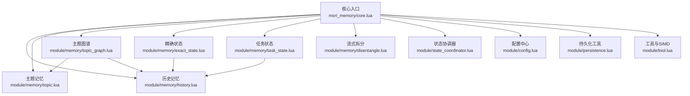
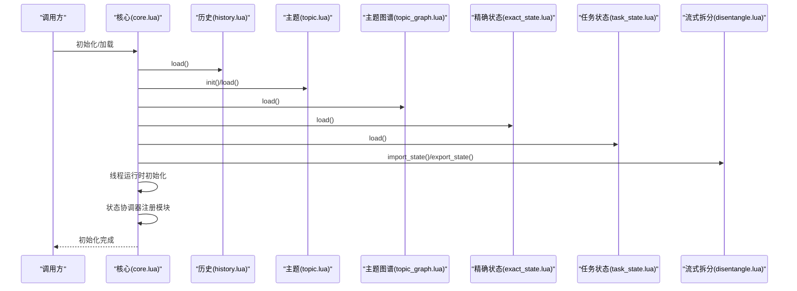
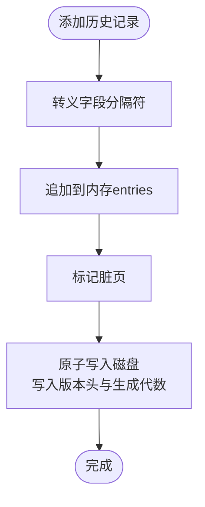
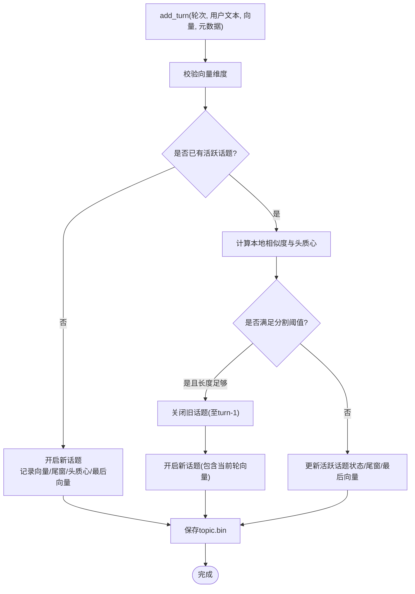
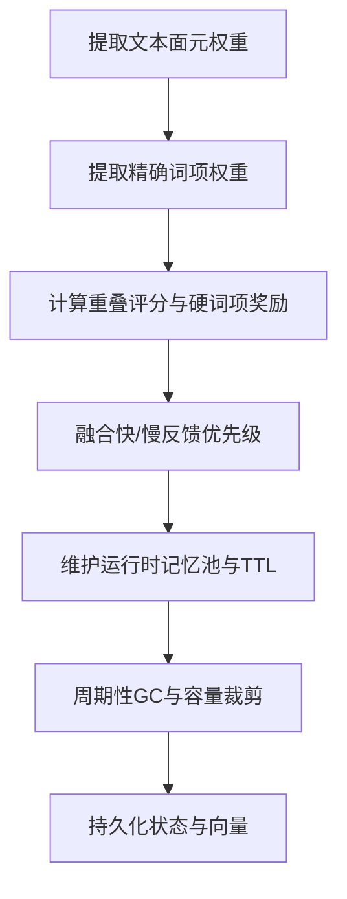
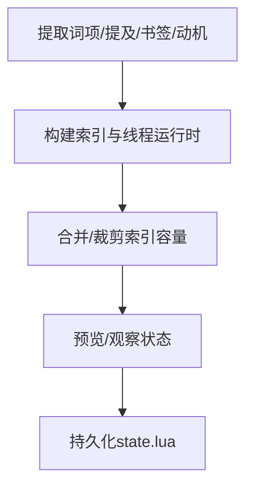
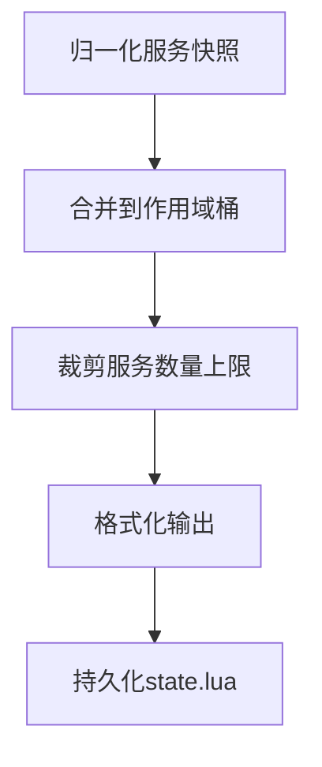
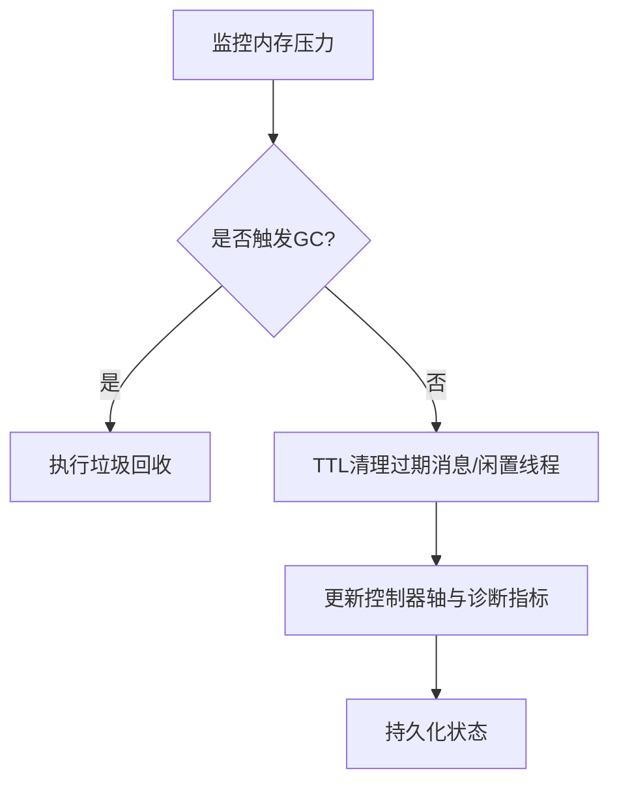
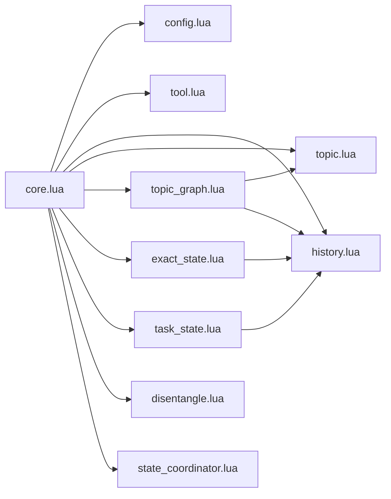

# 记忆类型管理

<cite>
**本文档引用的文件**
- [mori_memory/core.lua](file://mori_memory/mori_memory/core.lua)
- [mori_memory/init.lua](file://mori_memory/mori_memory/init.lua)
- [module/config.lua](file://mori_memory/module/config.lua)
- [module/state_coordinator.lua](file://mori_memory/module/state_coordinator.lua)
- [module/persistence.lua](file://mori_memory/module/persistence.lua)
- [module/memory/history.lua](file://mori_memory/module/memory/history.lua)
- [module/memory/topic.lua](file://mori_memory/module/memory/topic.lua)
- [module/memory/topic_graph.lua](file://mori_memory/module/memory/topic_graph.lua)
- [module/memory/exact_state.lua](file://mori_memory/module/memory/exact_state.lua)
- [module/memory/task_state.lua](file://mori_memory/module/memory/task_state.lua)
- [module/memory/disentangle.lua](file://mori_memory/module/memory/disentangle.lua)
- [module/tool.lua](file://mori_memory/module/tool.lua)
</cite>

## 目录
1. [简介](#简介)
2. [项目结构](#项目结构)
3. [核心组件](#核心组件)
4. [架构总览](#架构总览)
5. [详细组件分析](#详细组件分析)
6. [依赖关系分析](#依赖关系分析)
7. [性能考虑](#性能考虑)
8. [故障排除指南](#故障排除指南)
9. [结论](#结论)

## 简介
本文件系统性阐述多维度记忆系统的记忆类型管理设计与实现，围绕以下四大记忆类型展开：
- 主题记忆（Topic Memory）：基于话语对相似度与话题边界检测的建模，支持摘要分级与向量质心维护。
- 历史记忆（History Memory）：按轮次顺序存储对话文本，提供上下文拼接与检索能力。
- 精确状态（Exact State）：以精确词项、提及、动机等细粒度特征构建的可查询状态索引，支持回复父节点与符号图谱。
- 任务状态（Task State）：面向服务化的槽位与意图追踪，支持跨轮次的状态合并与展示。

同时，文档说明主题图谱（Topic Graph）的构建与维护、记忆间的依赖关系与相互影响、配置参数、性能优化策略以及常见问题处理方法。

## 项目结构
多维度记忆系统采用模块化分层设计：
- 核心入口与协调：core.lua 负责初始化、模块加载、线程运行时与状态协调器集成。
- 配置中心：config.lua 提供统一配置读取与策略应用。
- 存储与持久化：persistence.lua 提供原子写入与替换保障。
- 记忆模块：history、topic、topic_graph、exact_state、task_state 独立实现各自的数据结构与检索算法。
- 工具与加速：tool.lua 提供向量运算、SIMD 加速与序列化工具。
- 状态一致性：state_coordinator 提供版本向量、事务与快照一致性校验。
- 流式拆分与多流管理：disentangle 提供多来源/多房间的流式拆分、阈值控制与 TTL 清理。

**图表来源**
- [mori_memory/core.lua:1-327](file://mori_memory/mori_memory/core.lua#L1-L327)
- [module/config.lua:1-680](file://mori_memory/module/config.lua#L1-L680)
- [module/state_coordinator.lua:1-302](file://mori_memory/module/state_coordinator.lua#L1-L302)
- [module/persistence.lua:1-97](file://mori_memory/module/persistence.lua#L1-L97)
- [module/memory/history.lua:1-195](file://mori_memory/module/memory/history.lua#L1-L195)
- [module/memory/topic.lua:1-800](file://mori_memory/module/memory/topic.lua#L1-L800)
- [module/memory/topic_graph.lua:1-800](file://mori_memory/module/memory/topic_graph.lua#L1-L800)
- [module/memory/exact_state.lua:1-800](file://mori_memory/module/memory/exact_state.lua#L1-L800)
- [module/memory/task_state.lua:1-305](file://mori_memory/module/memory/task_state.lua#L1-L305)
- [module/memory/disentangle.lua:1-800](file://mori_memory/module/memory/disentangle.lua#L1-L800)
- [module/tool.lua:1-800](file://mori_memory/module/tool.lua#L1-L800)

**章节来源**
- [mori_memory/core.lua:1-327](file://mori_memory/mori_memory/core.lua#L1-L327)
- [module/config.lua:1-680](file://mori_memory/module/config.lua#L1-L680)

## 核心组件
- 核心入口与初始化
  - 初始化顺序：历史记忆 → 主题记忆 → 主题图谱 → 精确状态 → 任务状态 → 流式拆分状态导入与恢复 → 线程运行时初始化 → 证据存储初始化 → 状态协调器注册模块。
  - 关键职责：统一加载与错误处理、向量维度校验、嵌入器选择、回合序号与写入保护、一致性检查点与恢复日志。
- 配置系统
  - 默认设置与策略配置：包含主题图谱、主题、精确状态、任务状态、反污染与多流拆分等参数。
  - 路径解析与绝对路径处理：支持相对路径基目录与绝对路径。
- 状态协调器
  - 版本向量与事务：提供模块版本号、事务开始/提交/回滚、一致性快照与 WAL 记录。
- 持久化工具
  - 原子写入与临时文件替换：保证写入过程中的数据一致性。
- 工具与SIMD
  - 向量维度校验、余弦相似度、平均向量、二进制编解码、SIMD加速（dot/cosine）。

**章节来源**
- [mori_memory/core.lua:227-327](file://mori_memory/mori_memory/core.lua#L227-L327)
- [module/config.lua:1-680](file://mori_memory/module/config.lua#L1-L680)
- [module/state_coordinator.lua:1-302](file://mori_memory/module/state_coordinator.lua#L1-L302)
- [module/persistence.lua:1-97](file://mori_memory/module/persistence.lua#L1-L97)
- [module/tool.lua:143-800](file://mori_memory/module/tool.lua#L143-L800)

## 架构总览
多维度记忆系统通过“核心协调 + 模块化记忆 + 主题图谱 + 精确状态 + 任务状态”的组合，实现：
- 语义层面的主题建模与边界检测；
- 对话流转的历史维护与上下文拼接；
- 精确词项与符号图谱的快速检索；
- 服务化槽位与意图的跨轮次追踪；
- 多来源/多房间的流式拆分与阈值控制；
- 一致性快照与恢复日志保障。

**图表来源**
- [mori_memory/core.lua:227-327](file://mori_memory/mori_memory/core.lua#L227-L327)
- [module/memory/history.lua:67-115](file://mori_memory/module/memory/history.lua#L67-L115)
- [module/memory/topic.lua:373-464](file://mori_memory/module/memory/topic.lua#L373-L464)
- [module/memory/topic_graph.lua:1-800](file://mori_memory/module/memory/topic_graph.lua#L1-L800)
- [module/memory/exact_state.lua:1-800](file://mori_memory/module/memory/exact_state.lua#L1-L800)
- [module/memory/task_state.lua:227-252](file://mori_memory/module/memory/task_state.lua#L227-L252)
- [module/memory/disentangle.lua:1-800](file://mori_memory/module/memory/disentangle.lua#L1-L800)

## 详细组件分析

### 历史记忆（History Memory）
- 存储结构
  - 文本文件：以固定分隔符记录用户与AI文本，带版本头与生成代数。
  - 内存结构：entries 数组按轮次存储，turn_counter 记录当前轮次。
- 检索算法
  - 按轮次获取原始记录与角色文本；支持转录片段拼接（限制轮次与字符数）。
- 更新机制
  - 添加记录时进行转义处理；标记脏页触发保存；保存时写入版本头与生成代数。
- 生命周期管理
  - 加载失败时根据快照要求决定报错或返回空历史；保存时原子写入。
- 性能特性
  - 纯文本顺序读写，适合大体量历史；转录拼接时进行字符截断与紧凑化。

**图表来源**
- [module/memory/history.lua:117-192](file://mori_memory/module/memory/history.lua#L117-L192)

**章节来源**
- [module/memory/history.lua:1-195](file://mori_memory/module/memory/history.lua#L1-L195)
- [module/persistence.lua:25-94](file://mori_memory/module/persistence.lua#L25-L94)

### 主题记忆（Topic Memory）
- 设计理念
  - 基于“话语对相似度”与“全局漂移”双重阈值检测话题边界，支持最小话题长度约束。
  - 使用头质心与尾部滑窗质心维持活跃话题的稳定性。
- 存储结构
  - topic.bin：二进制记录包含话题起止轮次、摘要、向量质心与摘要变体；支持活跃话题头/尾/最后向量的持久化。
  - 内存结构：topics 列表、active_topic（含 vectors、tail_window、head_centroid、last_vec、scope_key、摘要缓存）。
- 检索算法
  - 解析稳定话题键（S:start）、归一化与标准化；支持摘要变体（full/slight/heavy/none）缓存与生成。
- 更新机制
  - add_turn：校验向量维度，按阈值判断是否分割；更新活跃话题状态并保存。
  - close_current_topic：生成整体质心与摘要，写入历史记录并重置活跃状态。
- 生命周期管理
  - 重建与水化：在核心模式下不负责从文本重算embedding，仅恢复二进制状态。
- 性能特性
  - 平均向量与余弦相似度计算；滑动窗口减少内存占用；摘要分级降低LLM调用频率。

**图表来源**
- [module/memory/topic.lua:659-794](file://mori_memory/module/memory/topic.lua#L659-L794)
- [module/tool.lua:502-528](file://mori_memory/module/tool.lua#L502-L528)

**章节来源**
- [module/memory/topic.lua:1-800](file://mori_memory/module/memory/topic.lua#L1-L800)
- [module/tool.lua:143-800](file://mori_memory/module/tool.lua#L143-L800)

### 主题图谱（Topic Graph）
- 设计理念
  - 以“面元（facet）”权重与“精确词项”为核心特征，构建可检索的主题图谱；支持快/慢反馈优先级与动量查找。
  - 提供主题图谱的向量维度校验、归一化、平均向量与相似度计算。
- 存储结构
  - state.lua：版本、快照代数、下一个ID、向量维度、词汇表映射、记忆条目集合等。
  - vectors.bin：向量序列化存储；支持版本魔数与维度校验。
- 检索算法
  - 文本面元权重提取（ASCII与CJK混合窗口）；精确词项权重提取（硬词项优先）；重叠评分与惩罚因子。
  - 运行时记忆池（按流/作用域/话题）与TTL清理。
- 更新机制
  - 读取配置参数（召回/采纳学习率、反馈权重、槽位上限等）；运行时状态（last_anchor、last_selected、last_turn）维护。
  - 周期性GC与容量裁剪，避免内存膨胀。
- 生命周期管理
  - 状态版本与快照生成；WAL记录一致性检查；运行时内存清理与容量控制。

**图表来源**
- [module/memory/topic_graph.lua:442-792](file://mori_memory/module/memory/topic_graph.lua#L442-L792)
- [module/memory/topic_graph.lua:311-352](file://mori_memory/module/memory/topic_graph.lua#L311-L352)

**章节来源**
- [module/memory/topic_graph.lua:1-800](file://mori_memory/module/memory/topic_graph.lua#L1-L800)
- [module/config.lua:27-144](file://mori_memory/module/config.lua#L27-L144)

### 精确状态（Exact State）
- 设计理念
  - 基于精确词项、提及、动机（反应动机）与书签（turn/thread/segment）构建细粒度索引；支持回复父节点提示与符号图谱。
- 存储结构
  - state.lua：版本、下一个事件ID、作用域桶（events/event_order/索引）。
  - 索引：term_index、mention_index、bookmark_index、motif_index、actor_index、thread_index、symbol_index。
  - 线程运行时：direct_next、suffix_graph、symbols、symbol_index。
- 检索算法
  - 精确词项权重提取（硬词项优先）；重叠评分与事实ID/键值对奖励；查询提示惩罚。
  - 符号键构建（稳定token集合），支持后缀图与直接后继链接。
- 更新机制
  - 提取特征（词项、提及、书签、动机）；构建索引与线程运行时；合并/裁剪索引容量。
- 生命周期管理
  - 作用域隔离；线程重建与运行时图谱维护；TTL与容量控制。

**图表来源**
- [module/memory/exact_state.lua:729-800](file://mori_memory/module/memory/exact_state.lua#L729-L800)
- [module/memory/exact_state.lua:556-678](file://mori_memory/module/memory/exact_state.lua#L556-L678)

**章节来源**
- [module/memory/exact_state.lua:1-800](file://mori_memory/module/memory/exact_state.lua#L1-L800)
- [module/config.lua:87-110](file://mori_memory/module/config.lua#L87-L110)

### 任务状态（Task State）
- 设计理念
  - 面向服务化场景的槽位与意图追踪；支持跨轮次合并与展示。
- 存储结构
  - state.lua：版本、scopes（按作用域划分）。
  - 服务快照：active_intent、requested_slots、slot_values。
- 检索算法
  - 格式化输出服务块（服务名、意图、请求槽位、槽位值）。
- 更新机制
  - 归一化服务快照；合并到作用域桶；裁剪服务数量上限。
- 生命周期管理
  - 预览与观察接口；持久化保存。

**图表来源**
- [module/memory/task_state.lua:129-168](file://mori_memory/module/memory/task_state.lua#L129-L168)
- [module/memory/task_state.lua:275-302](file://mori_memory/module/memory/task_state.lua#L275-L302)

**章节来源**
- [module/memory/task_state.lua:1-305](file://mori_memory/module/memory/task_state.lua#L1-L305)
- [module/config.lua:168-174](file://mori_memory/module/config.lua#L168-L174)

### 流式拆分与多流管理（Disentangle）
- 设计理念
  - 面向多来源/多房间的流式拆分，动态阈值与象限控制器，支持TTL清理与GC触发。
- 关键机制
  - 内存压力检测与GC触发；线程事件上限与过期消息清理；闲置线程孤儿化。
  - 控制器轴（人口压力/互动拓扑）与表面锚点插值；诊断指标（有效参与者数、切换率、对等边比率、密度、枢纽主导度、不稳定度、熵、显式回复强度等）。
- 生命周期管理
  - 定期清理与GC；阈值状态与动态阈值更新；控制器状态持久化。

**图表来源**
- [module/memory/disentangle.lua:127-269](file://mori_memory/module/memory/disentangle.lua#L127-L269)
- [module/memory/disentangle.lua:271-329](file://mori_memory/module/memory/disentangle.lua#L271-L329)

**章节来源**
- [module/memory/disentangle.lua:1-800](file://mori_memory/module/memory/disentangle.lua#L1-L800)
- [module/config.lua:224-496](file://mori_memory/module/config.lua#L224-L496)

## 依赖关系分析
- 模块耦合
  - core.lua 作为中枢，依赖 config、tool、history、topic、topic_graph、exact_state、task_state、disentangle、state_coordinator、thread_runtime、evidence_store。
  - topic_graph 依赖 topic、history；exact_state 依赖 history；task_state 依赖 history。
- 一致性与版本
  - state_coordinator 通过版本向量与快照保障模块一致性；WAL记录用于恢复。
- 外部依赖
  - 向量运算依赖 SIMD 加速；嵌入器通过 tool.lua 与 Python 管道交互。

**图表来源**
- [mori_memory/core.lua:1-18](file://mori_memory/mori_memory/core.lua#L1-L18)
- [module/state_coordinator.lua:1-13](file://mori_memory/module/state_coordinator.lua#L1-L13)

**章节来源**
- [mori_memory/core.lua:1-18](file://mori_memory/mori_memory/core.lua#L1-L18)
- [module/state_coordinator.lua:1-13](file://mori_memory/module/state_coordinator.lua#L1-L13)

## 性能考虑
- 向量计算与SIMD
  - 使用SIMD加速点积与余弦相似度；平均向量与二进制编解码减少内存占用。
- 索引与检索
  - 主题图谱与精确状态采用权重化检索与重叠评分；通过槽位上限与容量裁剪控制规模。
- 持久化与一致性
  - 原子写入与快照保障；WAL记录与版本向量避免数据不一致。
- 内存与GC
  - 流式拆分的TTL清理与GC触发；内存压力阈值与最小间隔控制GC频率。

[本节为通用指导，无需特定文件引用]

## 故障排除指南
- 初始化失败
  - 检查历史/主题/图谱/精确状态/任务状态加载返回值；核对向量维度与嵌入器可用性。
- 生成代数不匹配
  - 快照生成代数与模块文件不一致时，需修复或重新生成快照。
- 内存压力过高
  - 启用GC控制与TTL清理；调整内存上限与清理间隔；检查线程事件上限。
- 查询结果异常
  - 校验配置参数（召回/采纳学习率、反馈权重、槽位上限等）；检查主题图谱与精确状态的维度与权重设置。

**章节来源**
- [mori_memory/core.lua:227-327](file://mori_memory/mori_memory/core.lua#L227-L327)
- [module/memory/history.lua:67-115](file://mori_memory/module/memory/history.lua#L67-L115)
- [module/memory/topic_graph.lua:311-352](file://mori_memory/module/memory/topic_graph.lua#L311-L352)
- [module/memory/disentangle.lua:127-269](file://mori_memory/module/memory/disentangle.lua#L127-L269)

## 结论
多维度记忆系统通过主题记忆、历史记忆、主题图谱、精确状态与任务状态的协同，实现了从语义建模到细粒度检索再到服务化追踪的完整闭环。核心协调器与状态一致性机制确保了系统的可靠性，而流式拆分与多流管理则提升了在复杂多源场景下的鲁棒性。合理配置参数、利用SIMD加速与原子持久化策略，可在保证性能的同时提升系统的可维护性与扩展性。