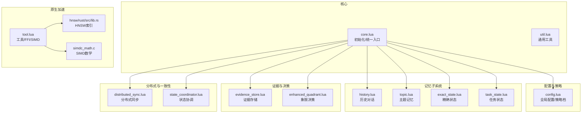
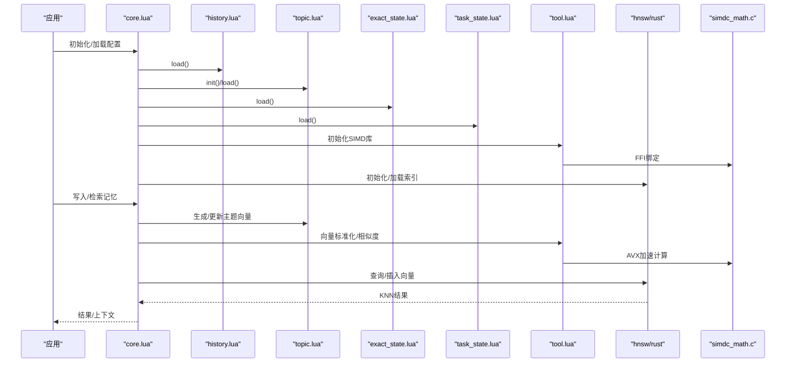
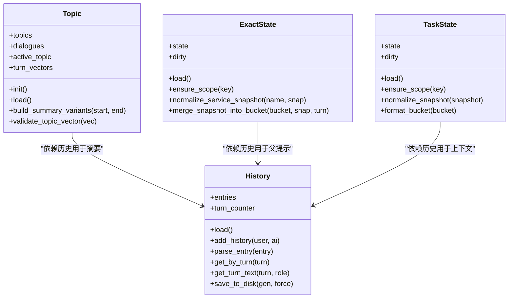
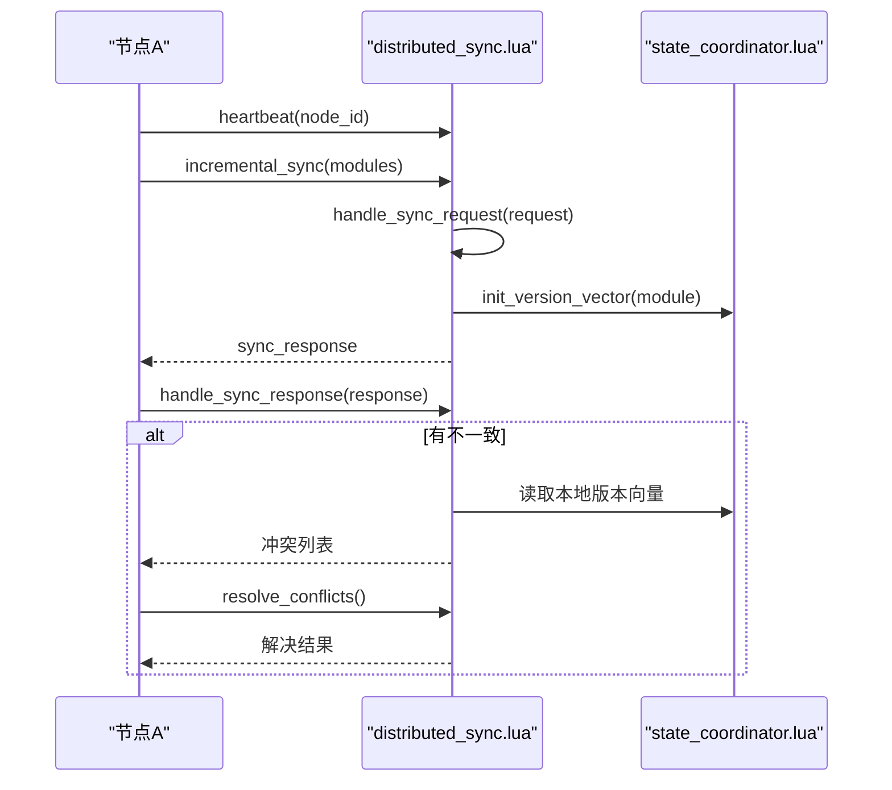
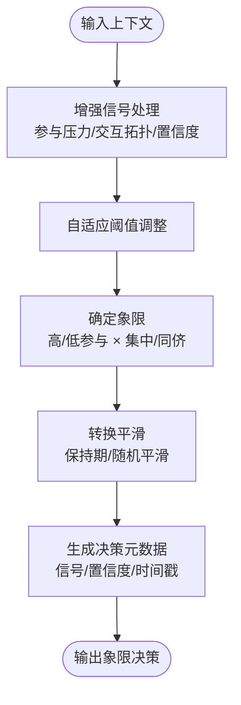
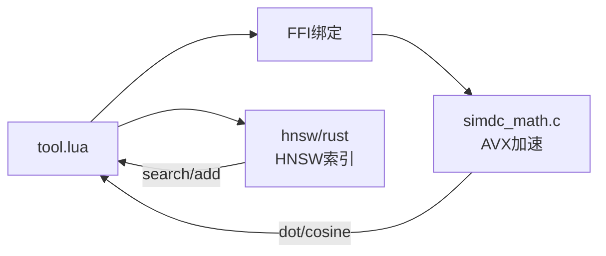
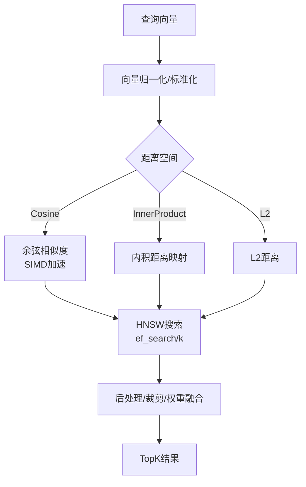
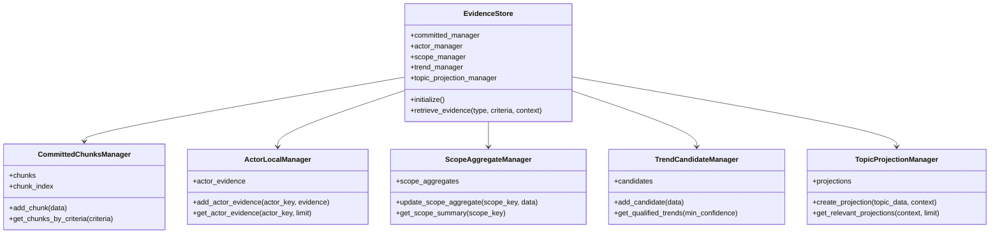
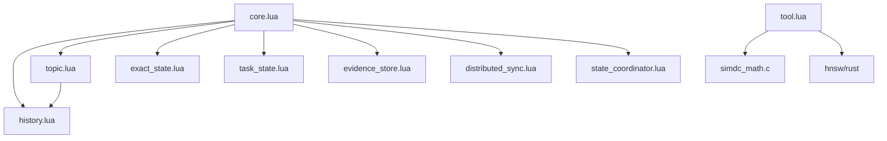

# 记忆系统核心 (mori_memory)

<cite>
**本文档引用的文件**
- [mori_memory/init.lua](file://mori_memory/mori_memory/init.lua)
- [mori_memory/core.lua](file://mori_memory/mori_memory/core.lua)
- [module/config.lua](file://mori_memory/module/config.lua)
- [module/distributed_sync.lua](file://mori_memory/module/distributed_sync.lua)
- [module/state_coordinator.lua](file://mori_memory/module/state_coordinator.lua)
- [module/evidence/evidence_store.lua](file://mori_memory/module/evidence/evidence_store.lua)
- [module/decision/enhanced_quadrant.lua](file://mori_memory/module/decision/enhanced_quadrant.lua)
- [module/tool.lua](file://mori_memory/module/tool.lua)
- [native/hnsw/rust/src/lib.rs](file://mori_memory/native/hnsw/rust/src/lib.rs)
- [native/simdc_math/simd_math.c](file://mori_memory/native/simdc_math/simd_math.c)
- [module/memory/topic.lua](file://mori_memory/module/memory/topic.lua)
- [module/memory/history.lua](file://mori_memory/module/memory/history.lua)
- [module/memory/exact_state.lua](file://mori_memory/module/memory/exact_state.lua)
- [module/memory/task_state.lua](file://mori_memory/module/memory/task_state.lua)
- [mori_memory/util.lua](file://mori_memory/mori_memory/util.lua)
</cite>

## 目录
1. [简介](#简介)
2. [项目结构](#项目结构)
3. [核心组件](#核心组件)
4. [架构总览](#架构总览)
5. [详细组件分析](#详细组件分析)
6. [依赖关系分析](#依赖关系分析)
7. [性能考量](#性能考量)
8. [故障排除指南](#故障排除指南)
9. [结论](#结论)
10. [附录](#附录)

## 简介
本文件系统化梳理记忆系统核心（mori_memory）的架构与实现，覆盖多维度记忆类型（主题记忆、历史记忆、精确状态、任务状态）、分布式同步与一致性保障、决策系统（象限分析与融合）、原生模块集成（HNSW近似最近邻、SIMD数学加速）、检索算法（向量相似度、索引与查询优化），并提供配置参数说明、性能调优建议与故障排除方法。

## 项目结构
mori_memory 采用“模块化 + 多层记忆”的组织方式：
- 核心入口与初始化：mori_memory/init.lua → mori_memory/core.lua
- 配置中心：module/config.lua
- 决策系统：module/decision/*
- 分布式与一致性：module/distributed_sync.lua, module/state_coordinator.lua
- 记忆子系统：module/memory/*（history、topic、exact_state、task_state 等）
- 证据存储：module/evidence/evidence_store.lua
- 工具与原生加速：module/tool.lua 及 native/hnsw/rust、native/simdc_math
- 辅助工具：mori_memory/util.lua

图表来源
- [mori_memory/core.lua:1-327](file://mori_memory/mori_memory/core.lua#L1-L327)
- [module/config.lua:1-680](file://mori_memory/module/config.lua#L1-L680)
- [module/distributed_sync.lua:1-287](file://mori_memory/module/distributed_sync.lua#L1-L287)
- [module/state_coordinator.lua:1-302](file://mori_memory/module/state_coordinator.lua#L1-L302)
- [module/evidence/evidence_store.lua:1-603](file://mori_memory/module/evidence/evidence_store.lua#L1-L603)
- [module/decision/enhanced_quadrant.lua:1-335](file://mori_memory/module/decision/enhanced_quadrant.lua#L1-L335)
- [module/tool.lua:1-800](file://mori_memory/module/tool.lua#L1-L800)
- [native/hnsw/rust/src/lib.rs:1-592](file://mori_memory/native/hnsw/rust/src/lib.rs#L1-L592)
- [native/simdc_math/simd_math.c:1-146](file://mori_memory/native/simdc_math/simd_math.c#L1-L146)

章节来源
- [mori_memory/init.lua:1-3](file://mori_memory/mori_memory/init.lua#L1-L3)
- [mori_memory/core.lua:1-327](file://mori_memory/mori_memory/core.lua#L1-L327)

## 核心组件
- 初始化与统一入口：core.lua 负责模块初始化、线程运行时、证据存储、分布式同步启动与状态协调注册。
- 配置中心：config.lua 提供策略档、路径解析、默认值与深度合并。
- 记忆子系统：history/topic/exact_state/task_state 实现不同粒度的记忆持久化与检索。
- 证据存储：evidence_store.lua 提供已提交块、演员本地、范围聚合、趋势候选与主题投影。
- 决策系统：enhanced_quadrant.lua 基于增强信号进行象限决策与平滑过渡。
- 分布式与一致性：distributed_sync.lua 与 state_coordinator.lua 提供节点管理、增量同步、版本向量与检查点。
- 原生加速：tool.lua 通过 FFI 调用 simdc_math.c 与 rust HNSW 实现 SIMD 向量运算与高效近似最近邻。

章节来源
- [mori_memory/core.lua:1-327](file://mori_memory/mori_memory/core.lua#L1-L327)
- [module/config.lua:1-680](file://mori_memory/module/config.lua#L1-L680)
- [module/evidence/evidence_store.lua:1-603](file://mori_memory/module/evidence/evidence_store.lua#L1-L603)
- [module/decision/enhanced_quadrant.lua:1-335](file://mori_memory/module/decision/enhanced_quadrant.lua#L1-L335)
- [module/distributed_sync.lua:1-287](file://mori_memory/module/distributed_sync.lua#L1-L287)
- [module/state_coordinator.lua:1-302](file://mori_memory/module/state_coordinator.lua#L1-L302)
- [module/tool.lua:1-800](file://mori_memory/module/tool.lua#L1-L800)

## 架构总览
mori_memory 的控制流与数据流如下：

图表来源
- [mori_memory/core.lua:227-327](file://mori_memory/mori_memory/core.lua#L227-L327)
- [module/memory/history.lua:67-115](file://mori_memory/module/memory/history.lua#L67-L115)
- [module/memory/topic.lua:1-200](file://mori_memory/module/memory/topic.lua#L1-L200)
- [module/tool.lua:1-800](file://mori_memory/module/tool.lua#L1-L800)
- [native/hnsw/rust/src/lib.rs:243-592](file://mori_memory/native/hnsw/rust/src/lib.rs#L243-L592)
- [native/simdc_math/simd_math.c:1-146](file://mori_memory/native/simdc_math/simd_math.c#L1-L146)

## 详细组件分析

### 多维度记忆类型设计与实现
- 历史记忆（history）
  - 采用固定字段分隔的文本格式，带版本头与快照生成号，支持按轮次读取与转义/反转义。
  - 关键能力：按轮次获取、解析条目、保存到磁盘。
- 主题记忆（topic）
  - 维护活跃主题的头尾质心、滑动窗口与摘要变体，支持分级摘要与向量维度校验。
  - 关键能力：活跃主题更新、摘要生成、向量校验、二进制索引路径。
- 精确状态（exact_state）
  - 作用域化存储，支持回复父提示、反应模式、令牌计数与最近窗口回溯。
  - 关键能力：作用域桶、事件顺序、最近行选择、父提示上下文拼接。
- 任务状态（task_state）
  - 服务槽位与意图跟踪，规范化与去重，限制最大服务数。
  - 关键能力：服务快照归一化、合并、格式化输出。

图表来源
- [module/memory/history.lua:1-195](file://mori_memory/module/memory/history.lua#L1-L195)
- [module/memory/topic.lua:1-200](file://mori_memory/module/memory/topic.lua#L1-L200)
- [module/memory/exact_state.lua:1-200](file://mori_memory/module/memory/exact_state.lua#L1-L200)
- [module/memory/task_state.lua:1-200](file://mori_memory/module/memory/task_state.lua#L1-L200)

章节来源
- [module/memory/history.lua:67-195](file://mori_memory/module/memory/history.lua#L67-L195)
- [module/memory/topic.lua:1-200](file://mori_memory/module/memory/topic.lua#L1-L200)
- [module/memory/exact_state.lua:1-200](file://mori_memory/module/memory/exact_state.lua#L1-L200)
- [module/memory/task_state.lua:1-200](file://mori_memory/module/memory/task_state.lua#L1-L200)

### 分布式同步与一致性保障
- 节点管理与心跳：维护节点列表、超时与状态，支持广播状态变更。
- 增量同步：基于版本向量比较，识别不一致并决定拉取/推送。
- 冲突解决：基于时间戳的简单策略（本地新则保留，远端新则接受）。
- 状态协调：版本向量、事务开始/提交/回滚、一致性检查点与快照、恢复日志。
- 优雅降级：网络分区检测，切换本地优先与降低同步频率。

图表来源
- [module/distributed_sync.lua:1-287](file://mori_memory/module/distributed_sync.lua#L1-L287)
- [module/state_coordinator.lua:1-302](file://mori_memory/module/state_coordinator.lua#L1-L302)

章节来源
- [module/distributed_sync.lua:1-287](file://mori_memory/module/distributed_sync.lua#L1-L287)
- [module/state_coordinator.lua:1-302](file://mori_memory/module/state_coordinator.lua#L1-L302)

### 决策系统：象限分析与融合
- 增强信号处理器：综合参与压力、交互拓扑、稳定性与环境一致性，动态调整阈值。
- 象限决策器：根据增强信号与置信度确定象限，并应用转换平滑避免频繁切换。
- 融合算法：控制器数值键聚合与平均，支持表面控制器启用与规范化。

图表来源
- [module/decision/enhanced_quadrant.lua:1-335](file://mori_memory/module/decision/enhanced_quadrant.lua#L1-L335)

章节来源
- [module/decision/enhanced_quadrant.lua:1-335](file://mori_memory/module/decision/enhanced_quadrant.lua#L1-L335)

### 原生模块集成：HNSW 与 SIMD 数学
- HNSW（Rust）：支持 L2/IP/Cosine 空间，动态 ef 搜索、容量与维度查询、错误处理。
- SIMD 数学（C/AVX）：向量点积与余弦相似度加速，支持指针与表混合输入，回退至纯 LuaJIT。
- 工具桥接：tool.lua 通过 FFI 加载 simdc_math.so，暴露 dot_product/cosine_similarity/vector_to_bin 等。

图表来源
- [module/tool.lua:1-800](file://mori_memory/module/tool.lua#L1-L800)
- [native/hnsw/rust/src/lib.rs:1-592](file://mori_memory/native/hnsw/rust/src/lib.rs#L1-L592)
- [native/simdc_math/simd_math.c:1-146](file://mori_memory/native/simdc_math/simd_math.c#L1-L146)

章节来源
- [module/tool.lua:1-800](file://mori_memory/module/tool.lua#L1-L800)
- [native/hnsw/rust/src/lib.rs:1-592](file://mori_memory/native/hnsw/rust/src/lib.rs#L1-L592)
- [native/simdc_math/simd_math.c:1-146](file://mori_memory/native/simdc_math/simd_math.c#L1-L146)

### 记忆检索算法：向量相似度、索引与查询优化
- 向量相似度：支持余弦相似度与点积，SIMD 加速路径优先，回退纯 LuaJIT。
- 索引构建：topic_graph 配置启用 HNSW，支持 ef_construction/ef_search/k/m/max_elements。
- 查询优化：按检索预算与窗口限制返回 TopK，结合主题局部先验与反馈权重。

图表来源
- [module/tool.lua:618-725](file://mori_memory/module/tool.lua#L618-L725)
- [native/hnsw/rust/src/lib.rs:497-554](file://mori_memory/native/hnsw/rust/src/lib.rs#L497-L554)
- [module/config.lua:133-145](file://mori_memory/module/config.lua#L133-L145)

章节来源
- [module/tool.lua:553-725](file://mori_memory/module/tool.lua#L553-L725)
- [native/hnsw/rust/src/lib.rs:243-554](file://mori_memory/native/hnsw/rust/src/lib.rs#L243-L554)
- [module/config.lua:133-145](file://mori_memory/module/config.lua#L133-L145)

### 证据存储与上下文投影
- 已提交块：按时间/演员/范围索引，支持清理与检索。
- 演员本地证据：按演员上限限制，返回最新证据。
- 范围聚合：统计演员活动、主题分布与交互模式。
- 趋势候选：支持最小支持度、演员多样性与置信度计算。
- 主题投影：基于上下文匹配与新鲜度评分，生成相关性投影。

图表来源
- [module/evidence/evidence_store.lua:1-603](file://mori_memory/module/evidence/evidence_store.lua#L1-L603)

章节来源
- [module/evidence/evidence_store.lua:1-603](file://mori_memory/module/evidence/evidence_store.lua#L1-L603)

## 依赖关系分析
- 模块耦合
  - core.lua 对历史、主题、精确状态、任务状态、证据存储、状态协调、分布式同步均有直接依赖。
  - tool.lua 依赖 simdc_math.c 与 HNSW Rust 接口，提供统一向量运算 API。
  - topic.lua 依赖 history.lua 与工具模块，用于摘要与向量校验。
- 外部依赖
  - Python 向量化管线（通过 py_pipeline）用于嵌入生成。
  - FFI（LuaJIT）用于 C 扩展加载与指针传递。
- 潜在循环依赖
  - 未发现直接循环；topic.lua 间接依赖 history.lua，但为单向读取。

图表来源
- [mori_memory/core.lua:1-327](file://mori_memory/mori_memory/core.lua#L1-L327)
- [module/tool.lua:1-800](file://mori_memory/module/tool.lua#L1-L800)
- [module/memory/topic.lua:1-200](file://mori_memory/module/memory/topic.lua#L1-L200)

章节来源
- [mori_memory/core.lua:1-327](file://mori_memory/mori_memory/core.lua#L1-L327)
- [module/tool.lua:1-800](file://mori_memory/module/tool.lua#L1-L800)

## 性能考量
- 向量运算
  - 优先使用 SIMD 路径（dot_product_avx/cosine_similarity_avx），在向量维度较大时收益显著。
  - 通过指针与表混合输入减少拷贝开销。
- HNSW 查询
  - ef_search 与 k 控制召回与延迟的平衡；m/k/max_elements 影响索引质量与内存占用。
- 内存与 GC
  - disentangle 的 GC 控制与内存压力阈值，避免长时间驻留导致内存膨胀。
- I/O 与快照
  - 增量保存与检查点（state_coordinator）降低全量落盘成本，提升崩溃恢复效率。

## 故障排除指南
- 向量维度不匹配
  - 症状：embedding 返回空或维度不符。
  - 处理：核对 topic_graph.get_vector_dim 与工具 validate_vector 的期望维度，确保嵌入模型输出一致。
- HNSW 错误
  - 症状：mori_hnsw_last_error 返回错误信息。
  - 处理：检查维度/容量/空间类型，确认索引加载路径与维度一致性。
- 分布式同步异常
  - 症状：节点超时、版本不一致、冲突无法解决。
  - 处理：检查节点心跳、同步间隔、版本向量一致性；必要时启用优雅降级。
- 精确状态/任务状态写入受限
  - 症状：写入被拒绝或阈值不足。
  - 处理：检查 guard.* 阈值与信用等级，确认来源/用户标识正确传入。

章节来源
- [module/tool.lua:160-170](file://mori_memory/module/tool.lua#L160-L170)
- [native/hnsw/rust/src/lib.rs:223-241](file://mori_memory/native/hnsw/rust/src/lib.rs#L223-L241)
- [module/distributed_sync.lua:1-287](file://mori_memory/module/distributed_sync.lua#L1-L287)
- [module/config.lua:182-220](file://mori_memory/module/config.lua#L182-L220)

## 结论
mori_memory 通过模块化设计与原生加速，在多维度记忆、分布式一致性与决策驱动之间取得平衡。其配置中心与状态协调机制确保跨模块一致性，而 HNSW 与 SIMD 的引入显著提升了检索性能。建议在生产部署中结合监控与调优参数（ef_search/k、GC 阈值、同步间隔）持续优化。

## 附录

### 配置参数速览（关键项）
- topic_graph
  - topic_hnsw：启用开关、k、m、ef_construction、ef_search、max_elements
  - feedback：fast/slow prior 权重、衰减与容量
  - 其他：query_semantic_weight、bridge_weight、family_*、趋势候选参数
- disentangle
  - 内存限制、GC 控制、TTL 设置、状态版本控制、动态阈值与两轴控制器
- task_state
  - 启用开关、存储根目录、最大服务数
- guard
  - 信用体系、阈值、屏蔽策略、锚定前缀
- distributed
  - 启用开关、节点 ID、同步间隔、节点超时

章节来源
- [module/config.lua:6-680](file://mori_memory/module/config.lua#L6-L680)