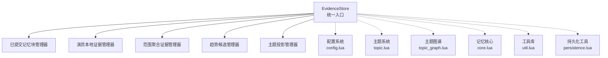
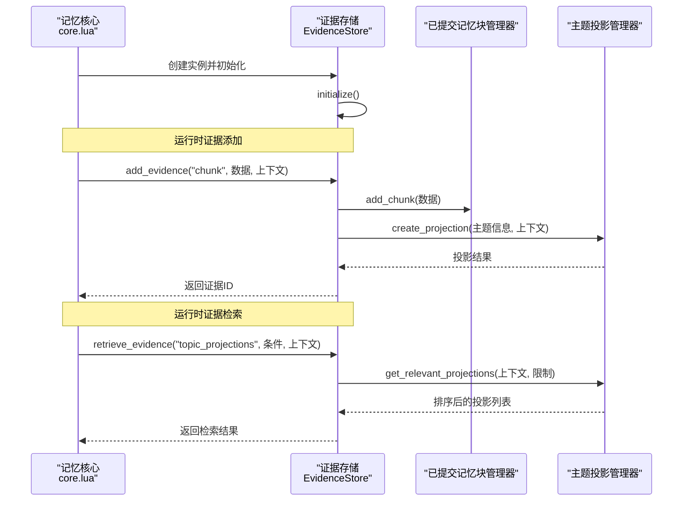
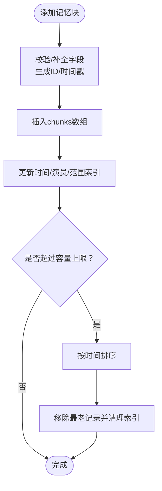
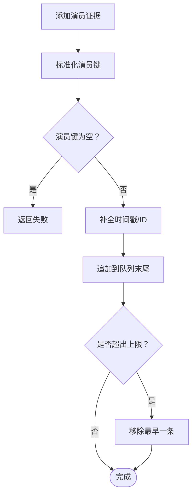
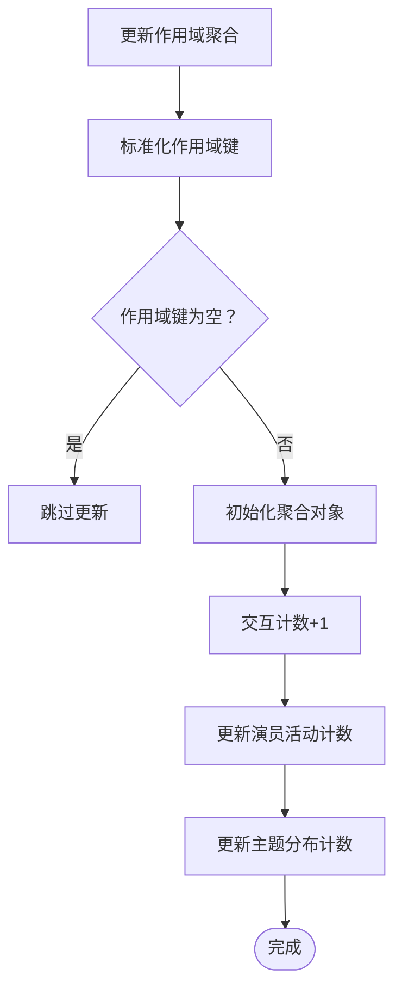
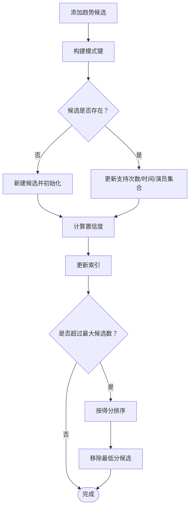
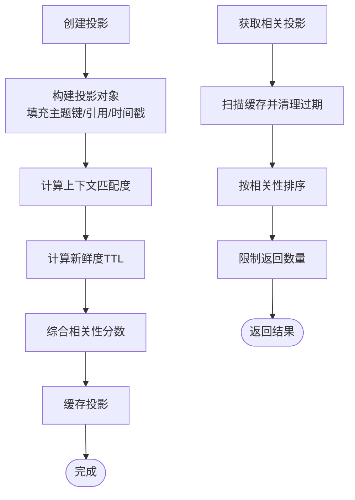
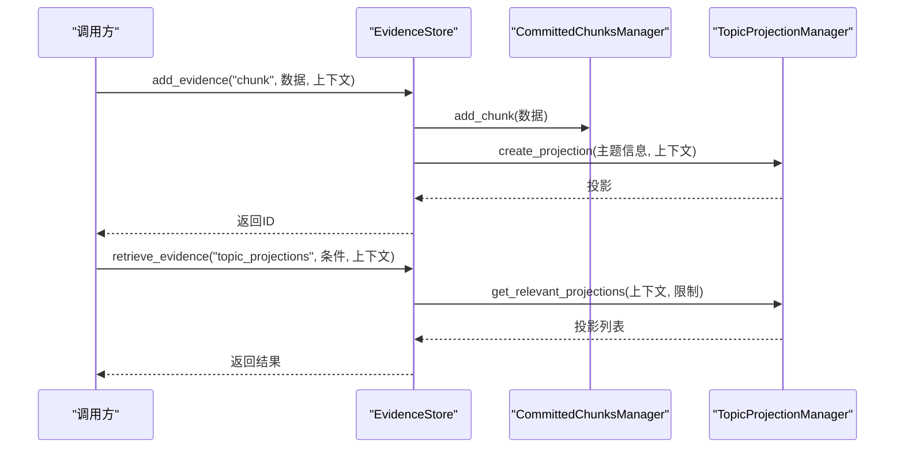
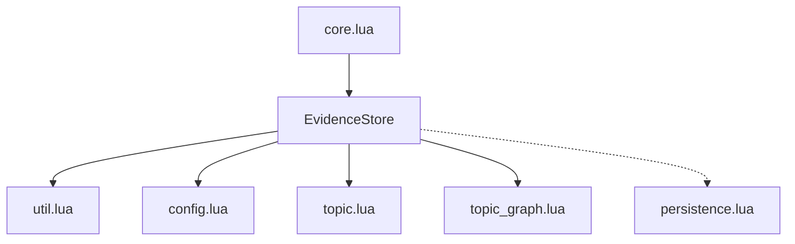

# 证据存储

<cite>
**本文档引用的文件**
- [evidence_store.lua](file://mori_memory/module/evidence/evidence_store.lua)
- [init.lua](file://mori_memory/module/evidence/init.lua)
- [config.lua](file://mori_memory/module/config.lua)
- [topic.lua](file://mori_memory/module/memory/topic.lua)
- [topic_graph.lua](file://mori_memory/module/memory/topic_graph.lua)
- [core.lua](file://mori_memory/mori_memory/core.lua)
- [util.lua](file://mori_memory/mori_memory/util.lua)
- [persistence.lua](file://mori_memory/module/persistence.lua)
</cite>

## 目录
1. [简介](#简介)
2. [项目结构](#项目结构)
3. [核心组件](#核心组件)
4. [架构总览](#架构总览)
5. [详细组件分析](#详细组件分析)
6. [依赖关系分析](#依赖关系分析)
7. [性能考量](#性能考量)
8. [故障排查指南](#故障排查指南)
9. [结论](#结论)
10. [附录](#附录)

## 简介
本文件系统化阐述证据存储（Evidence Store）的设计与实现，涵盖证据的采集、分类、存储与检索机制，以及证据生命周期管理（从生成到过期）。重点说明证据与主题投影（Topic Projection）的关系，以及如何通过证据增强主题记忆的准确性。同时提供配置项、性能调优参数与容量管理策略，并给出证据查询接口的使用方法与最佳实践。

## 项目结构
证据存储位于记忆模块的证据子系统中，采用“统一入口 + 多管理器”的分层设计：
- 统一入口：EvidenceStore 类，提供统一的证据添加与检索接口
- 核心管理器：
  - 已提交记忆块管理器（CommittedChunksManager）
  - 演员本地证据管理器（ActorLocalManager）
  - 范围聚合证据管理器（ScopeAggregateManager）
  - 趋势候选管理器（TrendCandidateManager）
  - 主题投影管理器（TopicProjectionManager）

证据存储与主题系统、主题图谱、配置系统紧密协作，贯穿记忆核心的初始化与运行时流程。

图表来源
- [evidence_store.lua:490-603](file://mori_memory/module/evidence/evidence_store.lua#L490-L603)
- [config.lua:1-680](file://mori_memory/module/config.lua#L1-L680)
- [topic.lua:1-800](file://mori_memory/module/memory/topic.lua#L1-L800)
- [topic_graph.lua:1-800](file://mori_memory/module/memory/topic_graph.lua#L1-L800)
- [core.lua:306-311](file://mori_memory/mori_memory/core.lua#L306-L311)
- [util.lua:1-153](file://mori_memory/mori_memory/util.lua#L1-L153)
- [persistence.lua:1-97](file://mori_memory/module/persistence.lua#L1-L97)

章节来源
- [evidence_store.lua:1-603](file://mori_memory/module/evidence/evidence_store.lua#L1-L603)
- [init.lua:1-10](file://mori_memory/module/evidence/init.lua#L1-L10)
- [config.lua:1-680](file://mori_memory/module/config.lua#L1-L680)
- [topic.lua:1-800](file://mori_memory/module/memory/topic.lua#L1-L800)
- [topic_graph.lua:1-800](file://mori_memory/module/memory/topic_graph.lua#L1-L800)
- [core.lua:306-311](file://mori_memory/mori_memory/core.lua#L306-L311)
- [util.lua:1-153](file://mori_memory/mori_memory/util.lua#L1-L153)
- [persistence.lua:1-97](file://mori_memory/module/persistence.lua#L1-L97)

## 核心组件
- 已提交记忆块管理器（CommittedChunksManager）
  - 职责：维护已提交的记忆块集合，支持按演员、范围、时间等维度检索，内置容量控制与索引维护
  - 关键能力：按相关性排序、时间索引、演员索引、范围索引、容量上限清理
- 演员本地证据管理器（ActorLocalManager）
  - 职责：按演员维度缓存本地证据，限制每演员最大条目数
  - 关键能力：最新证据获取、自动裁剪
- 范围聚合证据管理器（ScopeAggregateManager）
  - 职责：按作用域聚合交互统计，维护窗口期内的活动与主题分布
  - 关键能力：聚合更新、摘要获取
- 趋势候选管理器（TrendCandidateManager）
  - 职责：识别跨时间、跨演员的模式，计算置信度并维护候选集
  - 关键能力：置信度计算、支持度阈值、候选清理
- 主题投影管理器（TopicProjectionManager）
  - 职责：基于主题数据创建证据投影，结合上下文与新鲜度计算相关性
  - 关键能力：投影创建、相关性排序、TTL清理

章节来源
- [evidence_store.lua:26-175](file://mori_memory/module/evidence/evidence_store.lua#L26-L175)
- [evidence_store.lua:177-226](file://mori_memory/module/evidence/evidence_store.lua#L177-L226)
- [evidence_store.lua:228-284](file://mori_memory/module/evidence/evidence_store.lua#L228-L284)
- [evidence_store.lua:286-411](file://mori_memory/module/evidence/evidence_store.lua#L286-L411)
- [evidence_store.lua:413-488](file://mori_memory/module/evidence/evidence_store.lua#L413-L488)

## 架构总览
证据存储在记忆核心初始化阶段被创建并初始化，随后在运行时通过统一接口对外提供证据的增删改查能力。证据与主题系统存在耦合：当添加“chunk”类型证据时，会触发主题投影的创建与更新，从而增强主题记忆的准确性与上下文相关性。

图表来源
- [core.lua:306-311](file://mori_memory/mori_memory/core.lua#L306-L311)
- [evidence_store.lua:507-563](file://mori_memory/module/evidence/evidence_store.lua#L507-L563)
- [evidence_store.lua:413-488](file://mori_memory/module/evidence/evidence_store.lua#L413-L488)

章节来源
- [core.lua:306-311](file://mori_memory/mori_memory/core.lua#L306-L311)
- [evidence_store.lua:507-563](file://mori_memory/module/evidence/evidence_store.lua#L507-L563)

## 详细组件分析

### 已提交记忆块管理器（CommittedChunksManager）
- 数据结构与索引
  - chunks：按插入顺序维护的记忆块数组
  - chunk_index：按时间、演员、范围建立的倒排索引，便于快速检索
- 查询与排序
  - 支持按演员、范围、时间窗、内容过滤条件检索
  - 结果按相关性字段降序排序
- 容量与清理
  - 通过配置项设置最大块数，超过上限时按时间顺序淘汰最老记录
  - 删除时同步从索引中移除

图表来源
- [evidence_store.lua:40-55](file://mori_memory/module/evidence/evidence_store.lua#L40-L55)
- [evidence_store.lua:76-99](file://mori_memory/module/evidence/evidence_store.lua#L76-L99)
- [evidence_store.lua:129-145](file://mori_memory/module/evidence/evidence_store.lua#L129-L145)
- [evidence_store.lua:147-175](file://mori_memory/module/evidence/evidence_store.lua#L147-L175)

章节来源
- [evidence_store.lua:26-175](file://mori_memory/module/evidence/evidence_store.lua#L26-L175)

### 演员本地证据管理器（ActorLocalManager）
- 设计要点
  - 以演员键为单位维护证据队列，限制每演员最大条目数
  - 获取时默认返回最新若干条，支持limit参数
- 使用场景
  - 保存演员最近的行为或事实，用于短期决策与上下文增强

图表来源
- [evidence_store.lua:190-207](file://mori_memory/module/evidence/evidence_store.lua#L190-L207)
- [evidence_store.lua:209-226](file://mori_memory/module/evidence/evidence_store.lua#L209-L226)

章节来源
- [evidence_store.lua:177-226](file://mori_memory/module/evidence/evidence_store.lua#L177-L226)

### 范围聚合证据管理器（ScopeAggregateManager）
- 功能概述
  - 维护作用域内的演员活动、主题分布、交互次数等统计
  - 支持按作用域查询汇总摘要
- 更新策略
  - 新增数据时累加交互次数，更新演员活动与主题分布
  - 通过配置项设置聚合窗口（小时）

图表来源
- [evidence_store.lua:241-275](file://mori_memory/module/evidence/evidence_store.lua#L241-L275)
- [evidence_store.lua:277-284](file://mori_memory/module/evidence/evidence_store.lua#L277-L284)

章节来源
- [evidence_store.lua:228-284](file://mori_memory/module/evidence/evidence_store.lua#L228-L284)

### 趋势候选管理器（TrendCandidateManager）
- 趋势识别
  - 以模式字符串为键，累计支持次数、记录首次/最后出现时间、记录涉及演员
  - 置信度由时间衰减、支持度、演员多样性三因子相乘构成
- 候选维护
  - 通过最小支持度阈值与最大候选数控制规模
  - 超限时按置信度×支持度得分排序，移除最低分候选

图表来源
- [evidence_store.lua:301-342](file://mori_memory/module/evidence/evidence_store.lua#L301-L342)
- [evidence_store.lua:366-373](file://mori_memory/module/evidence/evidence_store.lua#L366-L373)
- [evidence_store.lua:384-411](file://mori_memory/module/evidence/evidence_store.lua#L384-L411)

章节来源
- [evidence_store.lua:286-411](file://mori_memory/module/evidence/evidence_store.lua#L286-L411)

### 主题投影管理器（TopicProjectionManager）
- 投影创建
  - 基于主题数据与上下文（scope/actor）计算上下文匹配度与新鲜度
  - 综合得到相关性分数，缓存投影并设置TTL
- 投影检索
  - 过滤过期投影，按相关性排序，限制返回数量

图表来源
- [evidence_store.lua:426-459](file://mori_memory/module/evidence/evidence_store.lua#L426-L459)
- [evidence_store.lua:461-488](file://mori_memory/module/evidence/evidence_store.lua#L461-L488)

章节来源
- [evidence_store.lua:413-488](file://mori_memory/module/evidence/evidence_store.lua#L413-L488)

### 统一接口与生命周期
- 统一添加接口（add_evidence）
  - 支持类型：chunk、actor_local、scope_aggregate、trend_candidate
  - “chunk”类型证据会触发主题投影创建
- 统一检索接口（retrieve_evidence）
  - 支持类型：chunks、actor_evidence、scope_summary、trends、topic_projections
- 生命周期管理
  - initialize：记录启动时间
  - cleanup_expired_data：触发清理（各管理器内部执行）
  - shutdown：清空存储状态

图表来源
- [evidence_store.lua:507-563](file://mori_memory/module/evidence/evidence_store.lua#L507-L563)
- [evidence_store.lua:413-488](file://mori_memory/module/evidence/evidence_store.lua#L413-L488)

章节来源
- [evidence_store.lua:490-603](file://mori_memory/module/evidence/evidence_store.lua#L490-L603)

## 依赖关系分析
- 内部依赖
  - util：提供字符串处理、表复制、编码等通用工具
  - config：提供配置读取与策略应用
  - topic/topic_graph：与主题系统协作，驱动主题投影
- 外部依赖
  - persistence：提供原子写入与替换能力（用于持久化相关模块）
- 运行时集成
  - 在记忆核心初始化时创建并初始化证据存储实例

图表来源
- [evidence_store.lua:7-12](file://mori_memory/module/evidence/evidence_store.lua#L7-L12)
- [core.lua:306-311](file://mori_memory/mori_memory/core.lua#L306-L311)

章节来源
- [evidence_store.lua:7-12](file://mori_memory/module/evidence/evidence_store.lua#L7-L12)
- [core.lua:306-311](file://mori_memory/mori_memory/core.lua#L306-L311)

## 性能考量
- 索引与查询
  - 已提交记忆块管理器维护时间/演员/范围索引，提升检索效率
  - 检索结果按相关性排序，建议在高基数场景下配合limit限制
- 容量控制
  - 通过配置项限制各类证据上限，避免内存膨胀
  - 超限后按时间或得分淘汰，确保系统稳定
- 置信度与趋势候选
  - 置信度计算包含时间衰减因子，建议根据业务调整衰减参数
  - 支持度阈值与最大候选数共同控制趋势候选规模
- TTL与清理
  - 主题投影与演员本地证据均支持TTL，建议结合业务周期合理设置

章节来源
- [evidence_store.lua:33-35](file://mori_memory/module/evidence/evidence_store.lua#L33-L35)
- [evidence_store.lua:184-185](file://mori_memory/module/evidence/evidence_store.lua#L184-L185)
- [evidence_store.lua:235-236](file://mori_memory/module/evidence/evidence_store.lua#L235-L236)
- [evidence_store.lua:294-296](file://mori_memory/module/evidence/evidence_store.lua#L294-L296)
- [evidence_store.lua:420-421](file://mori_memory/module/evidence/evidence_store.lua#L420-L421)

## 故障排查指南
- 初始化失败
  - 现象：证据存储初始化报错
  - 排查：确认配置项是否存在、类型是否正确；检查依赖模块（util/config/topic/topic_graph）可用性
- 查询结果为空
  - 现象：检索返回空列表
  - 排查：确认检索条件是否过于严格；检查TTL是否导致过期；核对上下文键（scope/actor）是否匹配
- 内存占用异常
  - 现象：系统内存持续增长
  - 排查：检查容量配置是否生效；确认清理逻辑是否正常触发；评估聚合窗口与候选上限设置
- 投影相关性异常
  - 现象：主题投影相关性不符合预期
  - 排查：检查上下文匹配权重与新鲜度TTL；确认主题数据是否包含有效topics字段

章节来源
- [evidence_store.lua:578-583](file://mori_memory/module/evidence/evidence_store.lua#L578-L583)
- [evidence_store.lua:566-576](file://mori_memory/module/evidence/evidence_store.lua#L566-L576)

## 结论
证据存储通过多管理器协同，实现了对已提交记忆块、演员本地证据、范围聚合、趋势候选与主题投影的统一管理。其设计兼顾了检索效率、容量控制与生命周期管理，能够有效支撑主题记忆的准确性与上下文相关性。结合合理的配置与调优，可在不同业务场景下获得稳定的性能表现。

## 附录

### 配置项与参数
- 已提交记忆块
  - evidence_store.max_committed_chunks：最大记忆块数
- 演员本地证据
  - evidence_store.max_actor_evidence：每演员最大证据数
- 范围聚合
  - evidence_store.aggregation_window_hours：聚合窗口（小时）
- 趋势候选
  - evidence_store.trend_min_support：最小支持度
  - evidence_store.max_trend_candidates：最大候选数
- 主题投影
  - evidence_store.topic_projection_ttl_hours：投影TTL（小时）

章节来源
- [config.lua:1-680](file://mori_memory/module/config.lua#L1-L680)
- [evidence_store.lua:33-35](file://mori_memory/module/evidence/evidence_store.lua#L33-L35)
- [evidence_store.lua:184-185](file://mori_memory/module/evidence/evidence_store.lua#L184-L185)
- [evidence_store.lua:235-236](file://mori_memory/module/evidence/evidence_store.lua#L235-L236)
- [evidence_store.lua:294-296](file://mori_memory/module/evidence/evidence_store.lua#L294-L296)
- [evidence_store.lua:420-421](file://mori_memory/module/evidence/evidence_store.lua#L420-L421)

### 证据查询接口使用方法与最佳实践
- 添加证据
  - 类型选择：chunk（触发主题投影）、actor_local、scope_aggregate、trend_candidate
  - 上下文：提供scope_key/actor_key等关键键值，提升投影与聚合准确性
- 检索证据
  - chunks：按演员/范围/时间/内容过滤，配合limit限制结果规模
  - actor_evidence：获取演员最新证据，注意上限配置
  - scope_summary：获取作用域聚合摘要
  - trends：按最小置信度筛选趋势候选
  - topic_projections：按上下文与TTL获取相关投影
- 最佳实践
  - 合理设置容量与TTL，避免内存压力
  - 在添加chunk时提供topics字段，以充分利用主题投影
  - 检索时优先缩小条件范围，减少排序开销

章节来源
- [evidence_store.lua:507-563](file://mori_memory/module/evidence/evidence_store.lua#L507-L563)