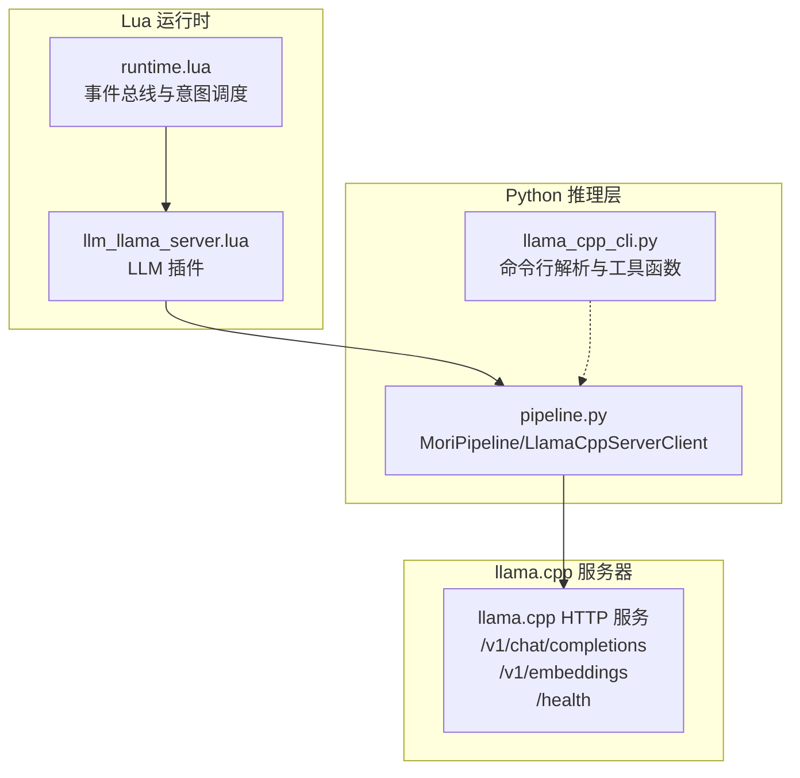
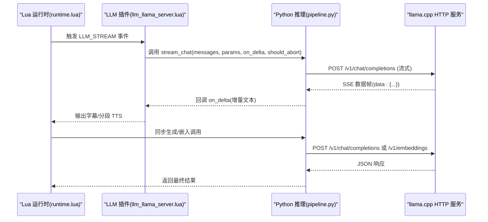
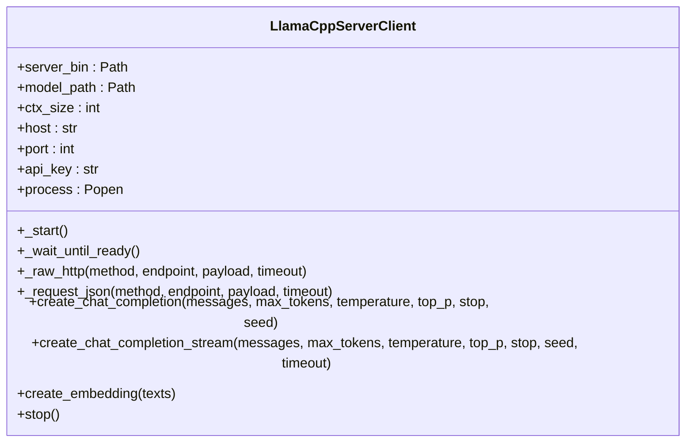
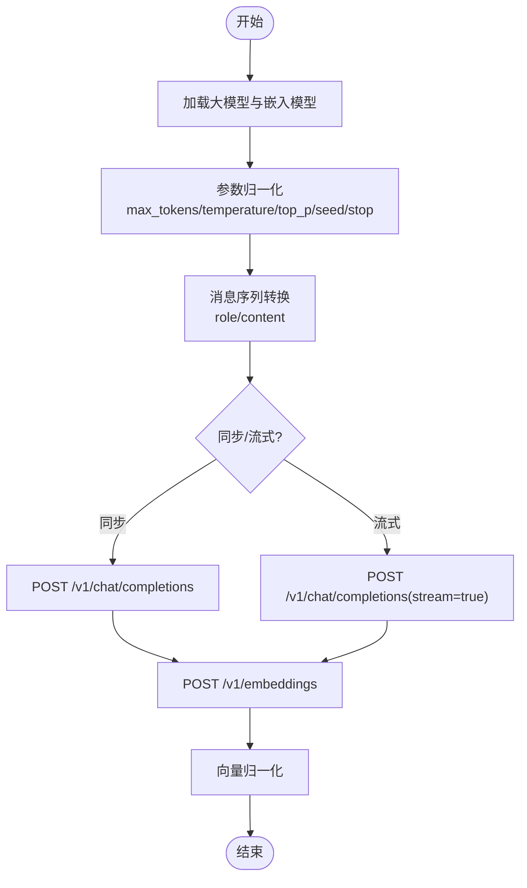
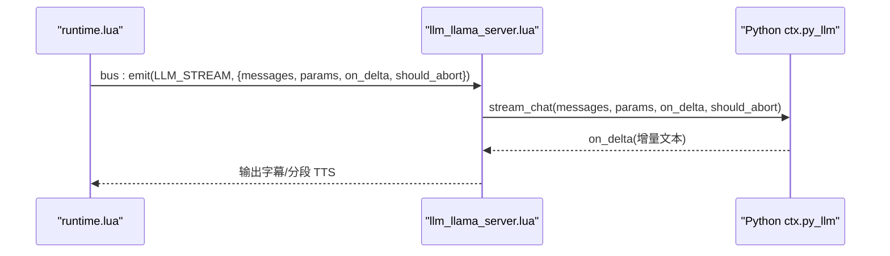
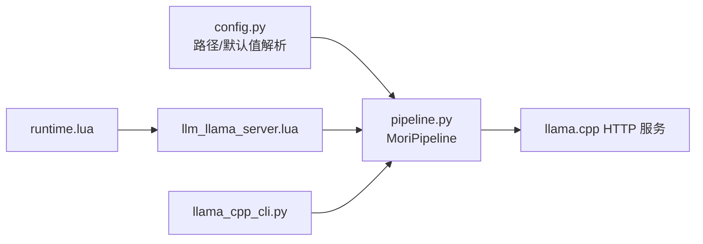

# HTTP服务

<cite>
**本文档引用的文件**
- [llm_llama_server.lua](file://mori_runtime/lua/mori/plugins/llm_llama_server.lua)
- [pipeline.py](file://mori_llm/pipeline.py)
- [llama_cpp_cli.py](file://mori_llm/llama_cpp_cli.py)
- [runtime.lua](file://mori_runtime/lua/mori/app/runtime.lua)
- [http.lua](file://mori_live_stream/lua/mori_live_stream/http.lua)
- [config.py](file://mori_runtime/config.py)
</cite>

## 目录
1. [简介](#简介)
2. [项目结构](#项目结构)
3. [核心组件](#核心组件)
4. [架构总览](#架构总览)
5. [详细组件分析](#详细组件分析)
6. [依赖关系分析](#依赖关系分析)
7. [性能考虑](#性能考虑)
8. [故障排除指南](#故障排除指南)
9. [结论](#结论)
10. [附录](#附录)

## 简介
本文件面向希望使用并扩展基于 llama.cpp 的本地 HTTP 服务的开发者，系统性梳理了项目中 HTTP 服务的设计与实现，包括：
- HTTP API 设计与端点规范（聊天补全、嵌入向量、健康检查）
- 请求参数与响应格式
- 流式响应与错误处理
- 客户端使用示例（curl、Python requests、WebSocket）
- 性能优化与安全配置建议

项目通过 Python 启动 llama.cpp 的内置 HTTP 服务器，并在 Lua 运行时中通过事件总线桥接到 Python 的推理管线，形成“Lua 事件 → Python HTTP 客户端 → llama.cpp HTTP 服务器”的完整链路。

## 项目结构
与 HTTP 服务直接相关的模块分布如下：
- Python 推理与 HTTP 客户端：负责启动 llama.cpp HTTP 服务器、封装 OpenAI 兼容 API、处理流式响应与错误
- Lua 运行时与插件：负责将业务意图转换为消息序列并通过事件总线触发 Python 推理
- HTTP 客户端工具：Lua 层提供基于 libcurl 的轻量 HTTP GET 能力（非 OpenAI 兼容 API）

图表来源
- [runtime.lua:543-668](file://mori_runtime/lua/mori/app/runtime.lua#L543-L668)
- [llm_llama_server.lua:1-25](file://mori_runtime/lua/mori/plugins/llm_llama_server.lua#L1-L25)
- [pipeline.py:56-353](file://mori_llm/pipeline.py#L56-L353)

章节来源
- [runtime.lua:543-668](file://mori_runtime/lua/mori/app/runtime.lua#L543-L668)
- [llm_llama_server.lua:1-25](file://mori_runtime/lua/mori/plugins/llm_llama_server.lua#L1-L25)
- [pipeline.py:56-353](file://mori_llm/pipeline.py#L56-L353)

## 核心组件
- LlamaCppServerClient：封装 llama.cpp HTTP 服务器的客户端，提供 OpenAI 兼容的聊天补全与嵌入接口，支持流式输出与错误处理
- MoriPipeline：高层封装，负责加载大模型与嵌入模型、参数归一化、消息序列转换
- llama_cpp_cli：提供二进制定位、默认模型选择、JSON 解析等辅助能力
- llm_llama_server.lua：Lua 插件，将业务事件映射到 Python 推理调用
- runtime.lua：运行时调度器，将用户意图转化为消息序列并通过事件总线触发推理
- http.lua：Lua 层 HTTP GET 客户端（非 OpenAI 兼容 API 使用场景）

章节来源
- [pipeline.py:56-353](file://mori_llm/pipeline.py#L56-L353)
- [llama_cpp_cli.py:1-248](file://mori_llm/llama_cpp_cli.py#L1-L248)
- [llm_llama_server.lua:1-25](file://mori_runtime/lua/mori/plugins/llm_llama_server.lua#L1-L25)
- [runtime.lua:543-668](file://mori_runtime/lua/mori/app/runtime.lua#L543-L668)
- [http.lua:1-190](file://mori_live_stream/lua/mori_live_stream/http.lua#L1-L190)

## 架构总览
下图展示了从 Lua 事件到 Python HTTP 客户端再到 llama.cpp 服务器的完整调用链：

图表来源
- [runtime.lua:448-493](file://mori_runtime/lua/mori/app/runtime.lua#L448-L493)
- [llm_llama_server.lua:13-20](file://mori_runtime/lua/mori/plugins/llm_llama_server.lua#L13-L20)
- [pipeline.py:228-290](file://mori_llm/pipeline.py#L228-L290)

## 详细组件分析

### 组件A：LlamaCppServerClient（HTTP 客户端）
- 负责启动 llama.cpp HTTP 服务器（通过子进程），监听本地端口
- 提供 OpenAI 兼容 API：
  - POST /v1/chat/completions（同步与流式）
  - POST /v1/embeddings
  - GET /health（健康检查）
- 支持鉴权头 Authorization: Bearer <api_key>
- 流式响应解析：逐行读取 data: 前缀，解析 choices[0].delta.content 或 choices[0].text
- 错误处理：HTTP 4xx/5xx 抛出异常，JSON 解析失败抛出异常

图表来源
- [pipeline.py:56-305](file://mori_llm/pipeline.py#L56-L305)

章节来源
- [pipeline.py:56-305](file://mori_llm/pipeline.py#L56-L305)

### 组件B：MoriPipeline（高层封装）
- 负责加载两个独立的 llama.cpp HTTP 服务实例：
  - 大模型（聊天）：禁用 WebUI/Jinja，启用推理格式 none
  - 嵌入模型：启用 --embeddings
- 参数归一化与模式前缀处理（query/passage）
- 将 Lua 消息序列转换为 Python 可用格式，调用 LlamaCppServerClient

图表来源
- [pipeline.py:307-582](file://mori_llm/pipeline.py#L307-L582)

章节来源
- [pipeline.py:307-582](file://mori_llm/pipeline.py#L307-L582)

### 组件C：llm_llama_server.lua（Lua 事件桥接）
- 监听 LLM_STREAM 事件，将消息与参数传递给 Python 的 ctx.py_llm:stream_chat
- 通过回调 on_delta 实现增量输出，should_abort 支持中断

图表来源
- [llm_llama_server.lua:13-20](file://mori_runtime/lua/mori/plugins/llm_llama_server.lua#L13-L20)
- [runtime.lua:448-493](file://mori_runtime/lua/mori/app/runtime.lua#L448-L493)

章节来源
- [llm_llama_server.lua:1-25](file://mori_runtime/lua/mori/plugins/llm_llama_server.lua#L1-L25)
- [runtime.lua:448-493](file://mori_runtime/lua/mori/app/runtime.lua#L448-L493)

### 组件D：llama_cpp_cli.py（辅助工具）
- 二进制目录解析与默认模型选择
- JSON 提取与错误处理（提取首个 JSON 对象）
- Lua 序列迭代器适配

章节来源
- [llama_cpp_cli.py:1-248](file://mori_llm/llama_cpp_cli.py#L1-L248)

### 组件E：http.lua（Lua HTTP GET 客户端）
- 基于 LuaJIT FFI 调用 libcurl，提供 GET 请求能力
- 适用于非 OpenAI 兼容 API 的简单 HTTP 获取场景

章节来源
- [http.lua:1-190](file://mori_live_stream/lua/mori_live_stream/http.lua#L1-L190)

## 依赖关系分析
- 运行时依赖
  - runtime.lua 通过插件系统加载 llm_llama_server.lua
  - llm_llama_server.lua 依赖 Python 上下文 ctx.py_llm
  - pipeline.py 依赖 subprocess、urllib、socket 等标准库
- 配置依赖
  - config.py 提供路径解析与默认值，影响模型路径与工作目录

图表来源
- [config.py:134-157](file://mori_runtime/config.py#L134-L157)
- [pipeline.py:307-353](file://mori_llm/pipeline.py#L307-L353)
- [runtime.lua:556-562](file://mori_runtime/lua/mori/app/runtime.lua#L556-L562)
- [llm_llama_server.lua:8-11](file://mori_runtime/lua/mori/plugins/llm_llama_server.lua#L8-L11)

章节来源
- [config.py:134-157](file://mori_runtime/config.py#L134-L157)
- [pipeline.py:307-353](file://mori_llm/pipeline.py#L307-L353)
- [runtime.lua:556-562](file://mori_runtime/lua/mori/app/runtime.lua#L556-L562)

## 性能考虑
- 端口与网络绑定
  - 默认绑定到 127.0.0.1，避免外部暴露；如需外网访问，可通过 host 参数调整
- GPU 加速与上下文大小
  - 通过 --gpu-layers 与 --ctx-size 控制推理性能与显存占用
- 流式输出
  - 使用 SSE 流式传输，降低首字延迟；注意客户端缓冲与解码策略
- 并发与超时
  - Python HTTP 客户端设置合理超时（默认 600s），避免长时间阻塞
- 嵌入向量
  - 支持批量嵌入与向量归一化，便于检索加速

## 故障排除指南
- 服务器未就绪
  - 现象：等待 /health 超时
  - 处理：检查模型路径、GPU 层配置、日志输出
- HTTP 4xx/5xx
  - 现象：请求失败，返回错误码
  - 处理：检查 Authorization 头、请求体格式、端点路径
- JSON 解析错误
  - 现象：响应体非合法 JSON
  - 处理：确认服务器版本与兼容性，检查编码与字符集
- 流式解析异常
  - 现象：SSE 行解析失败
  - 处理：确保客户端正确处理 data: 前缀与 [DONE] 结束符

章节来源
- [pipeline.py:159-173](file://mori_llm/pipeline.py#L159-L173)
- [pipeline.py:192-202](file://mori_llm/pipeline.py#L192-L202)
- [pipeline.py:228-290](file://mori_llm/pipeline.py#L228-L290)

## 结论
本项目通过“Lua 事件 + Python HTTP 客户端 + llama.cpp HTTP 服务”的架构，实现了 OpenAI 兼容的本地推理服务。其优势在于：
- 易于集成：OpenAI 风格 API，便于迁移
- 可扩展：支持流式输出、嵌入向量、多模型并行
- 可靠性：完善的错误处理与健康检查机制

建议在生产环境中结合安全与性能最佳实践进行部署与运维。

## 附录

### HTTP API 设计与端点规范
- 基础地址
  - 由 Python 客户端动态分配端口并拼接基础 URL
- 认证
  - 可选 Authorization: Bearer <api_key>
- 端点列表
  - GET /health：健康检查
  - POST /v1/chat/completions：聊天补全（支持流式）
  - POST /v1/embeddings：嵌入向量

章节来源
- [pipeline.py:80-81](file://mori_llm/pipeline.py#L80-L81)
- [pipeline.py:167-168](file://mori_llm/pipeline.py#L167-L168)
- [pipeline.py:204-226](file://mori_llm/pipeline.py#L204-L226)
- [pipeline.py:292-294](file://mori_llm/pipeline.py#L292-L294)

### 请求参数规范
- /v1/chat/completions
  - 必填：model、messages（数组，每项含 role 与 content）
  - 可选：max_tokens、temperature、top_p、stop、seed、stream
- /v1/embeddings
  - 必填：model、input（字符串或字符串数组）、encoding_format
- 流式响应
  - stream=true 时，服务端以 SSE 发送多行数据帧，以 [DONE] 结束

章节来源
- [pipeline.py:204-226](file://mori_llm/pipeline.py#L204-L226)
- [pipeline.py:228-290](file://mori_llm/pipeline.py#L228-L290)
- [pipeline.py:292-294](file://mori_llm/pipeline.py#L292-L294)

### 响应数据结构
- /v1/chat/completions
  - 同步：返回包含 choices[].message 的 JSON
  - 流式：逐行返回 data: 前缀的增量块，choices[].delta.content 或 choices[].text
- /v1/embeddings
  - 返回包含 data[].embedding 的 JSON
- 错误
  - HTTP 4xx/5xx：抛出异常，包含状态码与响应体摘要

章节来源
- [pipeline.py:192-202](file://mori_llm/pipeline.py#L192-L202)
- [pipeline.py:228-290](file://mori_llm/pipeline.py#L228-L290)
- [pipeline.py:292-294](file://mori_llm/pipeline.py#L292-L294)

### 客户端使用示例
- curl
  - 聊天补全（同步）：POST /v1/chat/completions
  - 聊天补全（流式）：添加 stream=true，逐行读取 data: 块
  - 嵌入向量：POST /v1/embeddings
  - 健康检查：GET /health
- Python requests
  - 与 curl 类似，构造 JSON 请求体，处理响应或迭代流式响应
- WebSocket
  - 当前 Python 客户端不直接提供 WebSocket；可自行封装或通过代理层转接

章节来源
- [pipeline.py:204-226](file://mori_llm/pipeline.py#L204-L226)
- [pipeline.py:228-290](file://mori_llm/pipeline.py#L228-L290)
- [pipeline.py:292-294](file://mori_llm/pipeline.py#L292-L294)

### 安全配置指南
- 仅监听本地回环地址（默认 127.0.0.1），避免外部访问
- 启用 API Key（--api-key），并在请求头中携带 Authorization: Bearer <key>
- 在反向代理后统一鉴权与速率限制
- 定期更新 llama.cpp 与模型，确保安全补丁

章节来源
- [pipeline.py:129-131](file://mori_llm/pipeline.py#L129-L131)
- [pipeline.py:181-182](file://mori_llm/pipeline.py#L181-L182)