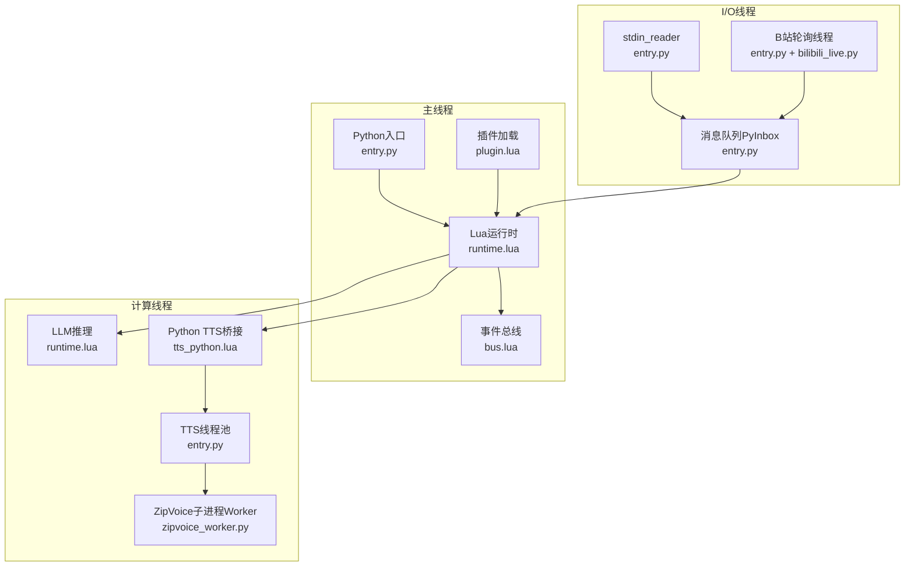
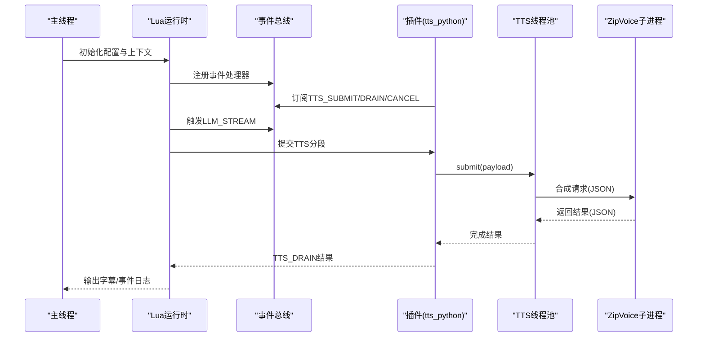
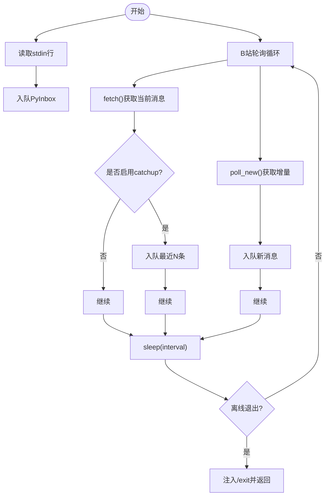
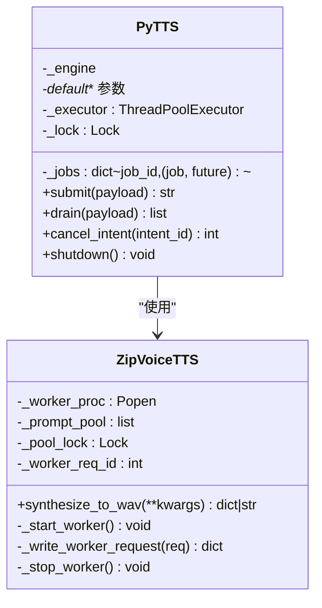
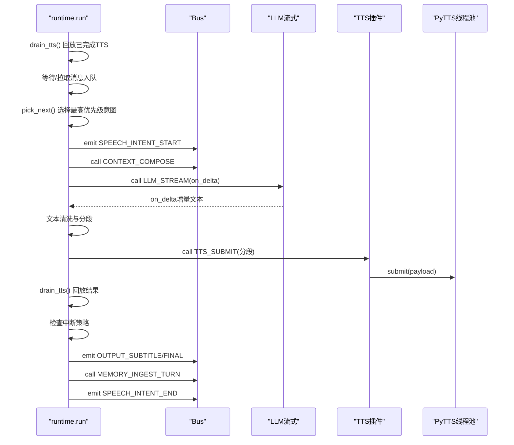
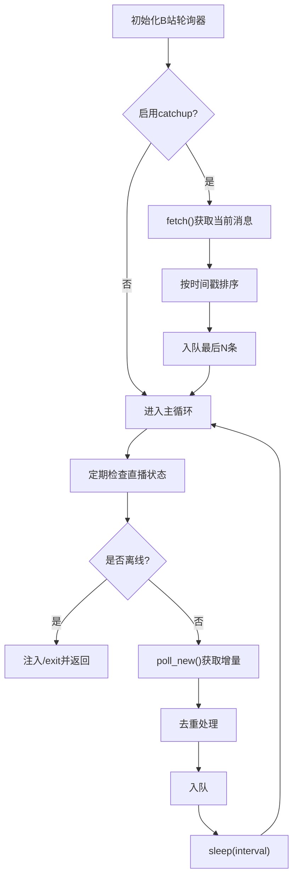
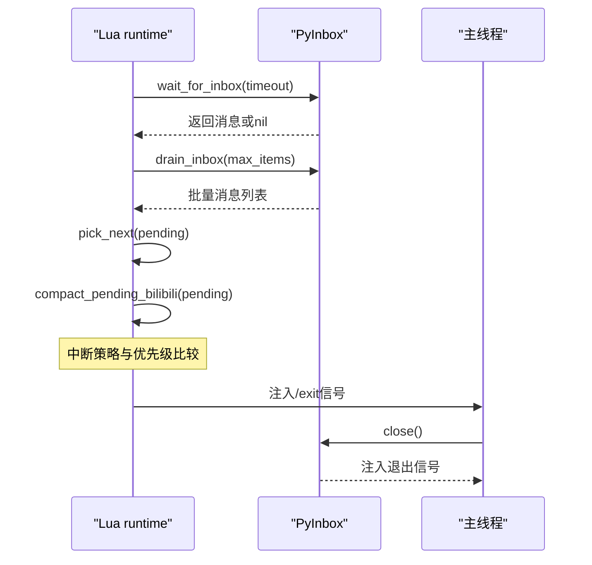
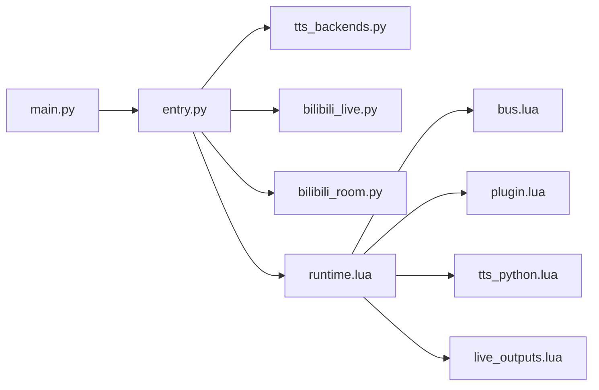

# 多线程系统

<cite>
**本文档引用的文件**
- [main.py](file://main.py)
- [entry.py](file://mori_runtime/entry.py)
- [tts_backends.py](file://mori_runtime/tts_backends.py)
- [zipvoice_worker.py](file://mori_runtime/zipvoice_worker.py)
- [bilibili_live.py](file://mori_live_stream/bilibili_live.py)
- [bilibili_room.py](file://mori_live_stream/bilibili_room.py)
- [runtime.lua](file://mori_runtime/lua/mori/app/runtime.lua)
- [bus.lua](file://mori_runtime/lua/mori/core/bus.lua)
- [plugin.lua](file://mori_runtime/lua/mori/core/plugin.lua)
- [tts_python.lua](file://mori_runtime/lua/mori/plugins/tts_python.lua)
- [live_outputs.lua](file://mori_runtime/lua/mori/plugins/live_outputs.lua)
</cite>

## 目录
1. [简介](#简介)
2. [项目结构](#项目结构)
3. [核心组件](#核心组件)
4. [架构总览](#架构总览)
5. [详细组件分析](#详细组件分析)
6. [依赖关系分析](#依赖关系分析)
7. [性能考量](#性能考量)
8. [故障排查指南](#故障排查指南)
9. [结论](#结论)
10. [附录](#附录)

## 简介
本文件系统性梳理该多线程系统的架构与实现，重点覆盖以下方面：
- 主线程、I/O线程、计算线程的分工与协作
- TTS多线程处理：ThreadPoolExecutor使用、任务队列管理、并发控制策略
- 直播轮询线程：B站直播数据获取、定时任务调度、异常处理机制
- 线程间通信：消息传递、状态同步、优雅关闭
- 线程安全编程指南：锁机制、原子操作、资源共享
- 性能监控与调试技巧

## 项目结构
该系统采用“主线程 + 多个后台线程”的模式，结合Lua事件总线驱动业务流程：
- Python入口负责初始化模型、TTS引擎、I/O线程，并注入Lua运行时
- Lua侧通过事件总线驱动意图处理、LLM流式生成、TTS提交与结果回传
- I/O线程负责从标准输入与B站直播接口拉取消息，统一入队
- 计算线程负责LLM推理与TTS合成（含子进程ZipVoice Worker）

**图表来源**
- [entry.py:452-579](file://mori_runtime/entry.py#L452-L579)
- [runtime.lua:543-665](file://mori_runtime/lua/mori/app/runtime.lua#L543-L665)
- [bus.lua:14-91](file://mori_runtime/lua/mori/core/bus.lua#L14-L91)
- [plugin.lua:13-48](file://mori_runtime/lua/mori/core/plugin.lua#L13-L48)
- [tts_python.lua:8-28](file://mori_runtime/lua/mori/plugins/tts_python.lua#L8-L28)
- [zipvoice_worker.py:446-729](file://mori_runtime/zipvoice_worker.py#L446-L729)

**章节来源**
- [main.py:1-13](file://main.py#L1-L13)
- [entry.py:796-1084](file://mori_runtime/entry.py#L796-L1084)

## 核心组件
- 消息队列与I/O桥接：PyInbox提供有界队列，支持超时入队与溢出丢弃策略，保障主线程不被阻塞
- 事件总线：Lua侧Bus提供事件订阅/发布与有序调用，确保模块解耦
- 插件化：插件按约定注册事件处理器，如TTS、直播输出等
- LLM推理：Lua侧流式回调驱动增量文本输出，同时进行分段与TTS提交
- TTS多线程：PyTTS封装ThreadPoolExecutor，维护作业表与完成结果回传
- ZipVoice子进程：独立进程承载重计算任务，通过stdin/stdout与父进程交互

**章节来源**
- [entry.py:89-144](file://mori_runtime/entry.py#L89-L144)
- [runtime.lua:146-220](file://mori_runtime/lua/mori/app/runtime.lua#L146-L220)
- [bus.lua:21-91](file://mori_runtime/lua/mori/core/bus.lua#L21-L91)
- [plugin.lua:13-48](file://mori_runtime/lua/mori/core/plugin.lua#L13-L48)
- [tts_python.lua:8-28](file://mori_runtime/lua/mori/plugins/tts_python.lua#L8-L28)

## 架构总览
系统以Lua事件驱动为核心，Python负责模型与I/O，形成如下层次：
- 应用层：Lua runtime.lua负责意图编排、消息分发、中断策略、TTS结果回放
- 事件层：bus.lua提供事件订阅/发布，plugin.lua加载插件并注册事件处理器
- I/O层：stdin_reader与B站轮询线程将外部消息统一入队至PyInbox
- 计算层：LLM流式生成与TTS线程池/子进程并行处理

**图表来源**
- [runtime.lua:303-541](file://mori_runtime/lua/mori/app/runtime.lua#L303-L541)
- [tts_python.lua:13-27](file://mori_runtime/lua/mori/plugins/tts_python.lua#L13-L27)
- [zipvoice_worker.py:625-725](file://mori_runtime/zipvoice_worker.py#L625-L725)

## 详细组件分析

### 组件A：消息队列与I/O线程
- PyInbox
  - 使用有界队列，超时时尝试丢弃最旧元素后重试，避免阻塞
  - 提供阻塞/非阻塞获取与批量drain，便于Lua侧高效消费
  - 关闭时注入退出信号，确保主线程可感知
- stdin_reader线程
  - 读取标准输入，将每行文本包装为消息入队
- B站轮询线程
  - 周期性调用BilibiliLivePoller.fetch/poll_new，去重后入队
  - 支持“离线退出”策略，定期检查房间直播状态
  - 可选“catchup”模式，启动时拉取最近N条历史消息

**图表来源**
- [entry.py:452-579](file://mori_runtime/entry.py#L452-L579)
- [bilibili_live.py:147-205](file://mori_live_stream/bilibili_live.py#L147-L205)
- [bilibili_room.py:93-141](file://mori_live_stream/bilibili_room.py#L93-L141)

**章节来源**
- [entry.py:89-144](file://mori_runtime/entry.py#L89-L144)
- [entry.py:452-579](file://mori_runtime/entry.py#L452-L579)
- [bilibili_live.py:93-205](file://mori_live_stream/bilibili_live.py#L93-L205)
- [bilibili_room.py:93-141](file://mori_live_stream/bilibili_room.py#L93-L141)

### 组件B：TTS多线程处理
- PyTTS
  - 使用ThreadPoolExecutor(max_workers)管理并发
  - 作业表_jobs维护job_id到(任务, Future)映射，配合threading.Lock保证线程安全
  - submit创建任务函数，内部根据payload动态组装参数，回退兼容部分参数缺失
  - drain遍历作业表，收集已完成Future结果，合并元信息并桥接为Lua记录
  - cancel_intent按intent_id取消未完成作业
  - shutdown优雅关闭线程池
- ZipVoice子进程Worker
  - 独立进程承载模型推理与声码器，stdin/json请求，stdout/json响应
  - 支持预热、合成、关闭命令，失败时抛出异常并由父进程捕获
  - 通过持久化提示缓存减少重复特征提取开销

**图表来源**
- [entry.py:203-412](file://mori_runtime/entry.py#L203-L412)
- [tts_backends.py:525-800](file://mori_runtime/tts_backends.py#L525-L800)
- [zipvoice_worker.py:446-729](file://mori_runtime/zipvoice_worker.py#L446-L729)

**章节来源**
- [entry.py:203-412](file://mori_runtime/entry.py#L203-L412)
- [tts_backends.py:525-800](file://mori_runtime/tts_backends.py#L525-L800)
- [zipvoice_worker.py:446-729](file://mori_runtime/zipvoice_worker.py#L446-L729)

### 组件C：Lua事件驱动与意图处理
- Bus
  - 提供on/emit/call，事件处理器异常自动上报BUS_ERROR
  - call按注册顺序执行，返回首个非nil结果
- plugin.load_all
  - 加载插件并校验setup接口，上报MODULE_ANNOUNCE/MODULE_READY/MODULE_ERROR
- runtime.run
  - 维护pending队列，按优先级与入队时间选择下一个意图
  - 中断策略：根据配置与待处理消息优先级决定是否打断当前意图
  - 分段与TTS：文本清洗后按分段器切分为语音片段，逐段提交TTS
  - TTS结果回放：周期性drain_tts，输出事件与字幕
  - 优雅关闭：释放内存、关闭LLM与TTS

**图表来源**
- [runtime.lua:543-665](file://mori_runtime/lua/mori/app/runtime.lua#L543-L665)
- [bus.lua:50-91](file://mori_runtime/lua/mori/core/bus.lua#L50-L91)
- [tts_python.lua:13-27](file://mori_runtime/lua/mori/plugins/tts_python.lua#L13-L27)

**章节来源**
- [runtime.lua:146-220](file://mori_runtime/lua/mori/app/runtime.lua#L146-L220)
- [runtime.lua:303-541](file://mori_runtime/lua/mori/app/runtime.lua#L303-L541)
- [bus.lua:14-91](file://mori_runtime/lua/mori/core/bus.lua#L14-L91)
- [plugin.lua:13-48](file://mori_runtime/lua/mori/core/plugin.lua#L13-L48)

### 组件D：直播轮询线程
- BilibiliLivePoller
  - 基于Lua模块封装的轻量轮询实现，支持去重窗口与增量获取
- get_room_info/is_live
  - 通过线程局部存储复用LuaRuntime与模块，查询房间状态
- 轮询线程
  - 启动时可选抓取最近N条消息
  - 周期性检查直播状态，支持离线退出
  - 将用户ID、昵称、文本、时间轴等字段标准化后入队

**图表来源**
- [entry.py:479-579](file://mori_runtime/entry.py#L479-L579)
- [bilibili_live.py:93-205](file://mori_live_stream/bilibili_live.py#L93-L205)
- [bilibili_room.py:93-141](file://mori_live_stream/bilibili_room.py#L93-L141)

**章节来源**
- [entry.py:479-579](file://mori_runtime/entry.py#L479-L579)
- [bilibili_live.py:93-205](file://mori_live_stream/bilibili_live.py#L93-L205)
- [bilibili_room.py:93-141](file://mori_live_stream/bilibili_room.py#L93-L141)

### 组件E：线程间通信与状态同步
- 消息传递
  - PyInbox作为跨线程消息通道，Lua侧通过ctx.py_inbox桥接
  - runtime.lua中wait_for_inbox与drain_inbox实现阻塞/非阻塞读取
- 状态同步
  - pending队列按优先级与入队时间排序
  - compact_pending_bilibili压缩同源消息，保留最新一条
- 优雅关闭
  - PyInbox.close注入退出信号
  - runtime.run在退出前释放资源、关闭LLM与TTS

**图表来源**
- [runtime.lua:146-220](file://mori_runtime/lua/mori/app/runtime.lua#L146-L220)
- [runtime.lua:582-650](file://mori_runtime/lua/mori/app/runtime.lua#L582-L650)
- [entry.py:89-144](file://mori_runtime/entry.py#L89-L144)

**章节来源**
- [runtime.lua:146-220](file://mori_runtime/lua/mori/app/runtime.lua#L146-L220)
- [runtime.lua:582-650](file://mori_runtime/lua/mori/app/runtime.lua#L582-L650)
- [entry.py:89-144](file://mori_runtime/entry.py#L89-L144)

## 依赖关系分析
- Python入口依赖
  - mori_runtime.entry：构建CLI/Vtuber模式，启动I/O线程与Lua运行时
  - mori_runtime.tts_backends：构建TTS引擎（含ZipVoice）
  - mori_live_stream.bilibili_live/bilibili_room：直播轮询与房间状态
- Lua侧依赖
  - mori.core.bus/plugin/protocol：事件总线与插件框架
  - mori.plugins.tts_python/live_outputs：TTS桥接与直播输出
  - mori.app.runtime：应用主循环与意图处理

**图表来源**
- [main.py:1-13](file://main.py#L1-L13)
- [entry.py:796-1084](file://mori_runtime/entry.py#L796-L1084)
- [runtime.lua:543-665](file://mori_runtime/lua/mori/app/runtime.lua#L543-L665)

**章节来源**
- [main.py:1-13](file://main.py#L1-L13)
- [entry.py:796-1084](file://mori_runtime/entry.py#L796-L1084)
- [runtime.lua:543-665](file://mori_runtime/lua/mori/app/runtime.lua#L543-L665)

## 性能考量
- 并发度控制
  - TTS线程池max_workers默认为1，可通过参数调整；ZipVoice子进程num_thread可配置
  - LLM推理在主线程流式回调，避免阻塞事件循环
- 队列与背压
  - PyInbox有界队列与超时入队，溢出时丢弃最旧消息，防止内存膨胀
  - Lua侧批量drain_inbox限制单次处理数量
- I/O优化
  - B站轮询间隔可调，离线检测降低无效请求
  - 去重窗口与紧凑化减少重复消息
- 子进程隔离
  - ZipVoice Worker独立进程，避免Python GIL与主线程争抢
  - 持久化提示缓存减少重复特征提取

[本节为通用指导，无需具体文件分析]

## 故障排查指南
- TTS子进程异常
  - 父进程写入失败或子进程意外退出会触发重启逻辑
  - 检查ZipVoice Worker启动参数与模型路径
- 线程池关闭
  - shutdown时尝试cancel_futures，若失败则回退等待
- Lua模块加载失败
  - plugin.load_all会上报MODULE_ERROR，检查模块路径与依赖
- 事件处理异常
  - Bus在处理器抛错时自动上报BUS_ERROR，定位具体处理器ID

**章节来源**
- [tts_backends.py:729-759](file://mori_runtime/tts_backends.py#L729-L759)
- [plugin.lua:13-48](file://mori_runtime/lua/mori/core/plugin.lua#L13-L48)
- [bus.lua:50-91](file://mori_runtime/lua/mori/core/bus.lua#L50-L91)

## 结论
该系统通过清晰的线程分工与事件驱动架构，实现了高吞吐的多模态交互：
- I/O线程专注消息采集与去重，保障输入质量
- Lua事件总线解耦业务逻辑，便于扩展
- Python计算线程与ZipVoice子进程协同，兼顾灵活性与性能
- 完善的异常处理与优雅关闭机制，提升稳定性

[本节为总结，无需具体文件分析]

## 附录
- 配置要点
  - TTS后端与参数：backend、prompt、采样步数、速度、平滑输出等
  - B站轮询：房间ID、轮询间隔、catchup数量、离线退出间隔
  - 中断策略：priority/always/never
- 调试建议
  - 开启事件日志与字幕文件，观察消息流转
  - 逐步提高TTS并发度，监控延迟与资源占用
  - 使用离线测试验证中断与队列行为

[本节为补充说明，无需具体文件分析]