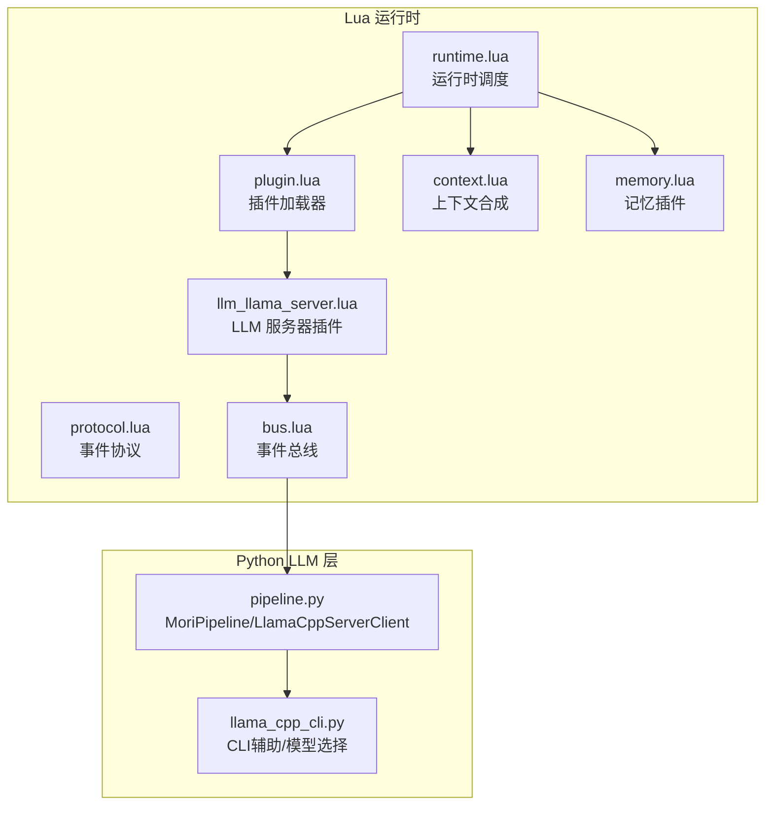
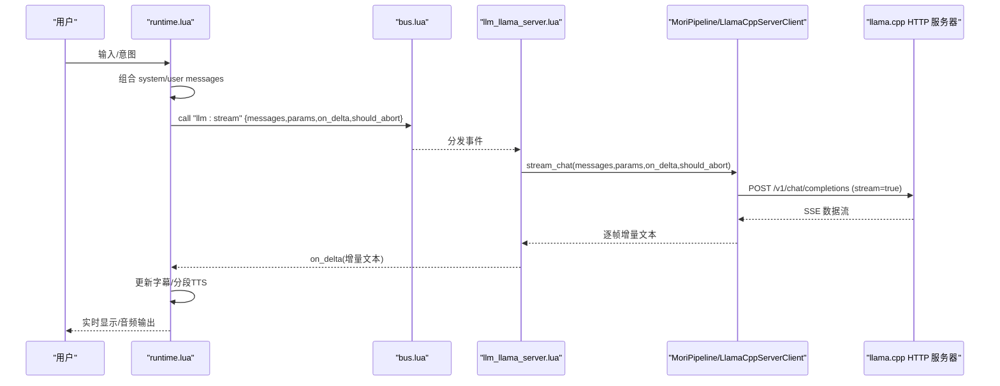
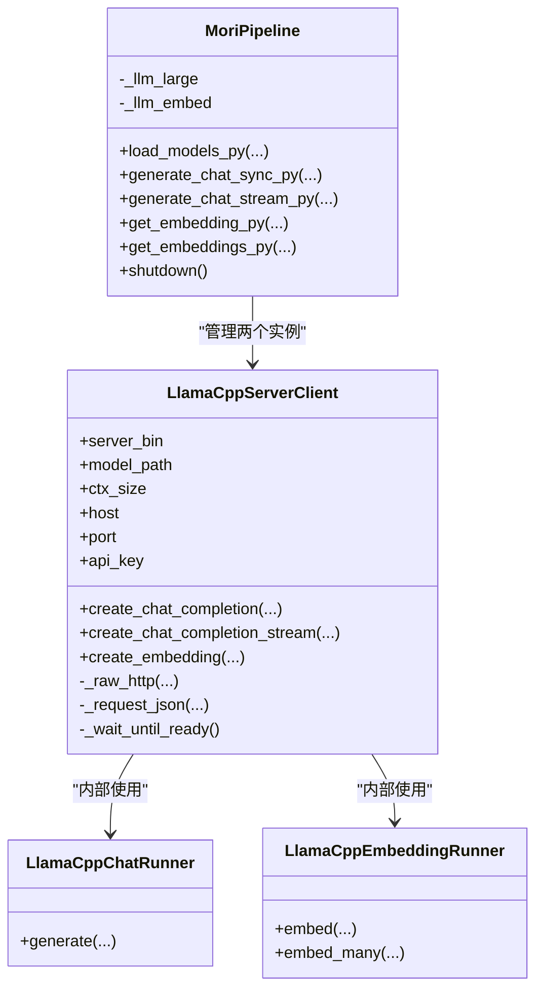
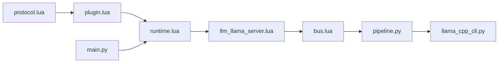

# LLM服务器插件

<cite>
**本文引用的文件**
- [mori_runtime/lua/mori/plugins/llm_llama_server.lua](file://mori_runtime/lua/mori/plugins/llm_llama_server.lua)
- [mori_runtime/lua/mori/app/runtime.lua](file://mori_runtime/lua/mori/app/runtime.lua)
- [mori_runtime/lua/mori/core/protocol.lua](file://mori_runtime/lua/mori/core/protocol.lua)
- [mori_runtime/lua/mori/core/plugin.lua](file://mori_runtime/lua/mori/core/plugin.lua)
- [mori_runtime/lua/mori/core/bus.lua](file://mori_runtime/lua/mori/core/bus.lua)
- [mori_runtime/lua/mori/plugins/context.lua](file://mori_runtime/lua/mori/plugins/context.lua)
- [mori_runtime/lua/mori/plugins/memory.lua](file://mori_runtime/lua/mori/plugins/memory.lua)
- [mori_llm/pipeline.py](file://mori_llm/pipeline.py)
- [mori_llm/llama_cpp_cli.py](file://mori_llm/llama_cpp_cli.py)
- [README.md](file://README.md)
- [mori.config.json](file://mori.config.json)
- [main.py](file://main.py)
</cite>

## 目录
1. [简介](#简介)
2. [项目结构](#项目结构)
3. [核心组件](#核心组件)
4. [架构总览](#架构总览)
5. [详细组件分析](#详细组件分析)
6. [依赖关系分析](#依赖关系分析)
7. [性能考量](#性能考量)
8. [故障排查指南](#故障排查指南)
9. [结论](#结论)
10. [附录](#附录)

## 简介
本文件面向“LLM服务器插件”，系统性阐述其架构设计与实现细节，重点覆盖以下方面：
- HTTP API 设计与 RESTful 接口规范
- 插件与 llama.cpp 后端的通信机制（请求路由、响应处理、错误管理）
- 功能特性（流式响应、批量处理、并发控制）
- 配置项（端口、超时、安全等）
- 使用示例与集成指南（含客户端 SDK 与 API 测试工具）

该插件采用 LuaJIT 事件总线驱动的插件化架构，通过事件协议触发 Python 侧的 LlamaCppServerClient，后者以 HTTP 方式与 llama.cpp 的内置 HTTP 服务器交互。

## 项目结构
围绕 LLM 服务器插件的关键文件与职责如下：
- Lua 插件层
  - 插件定义与事件绑定：mori_runtime/lua/mori/plugins/llm_llama_server.lua
  - 运行时调度与事件编排：mori_runtime/lua/mori/app/runtime.lua
  - 事件协议常量：mori_runtime/lua/mori/core/protocol.lua
  - 插件加载器：mori_runtime/lua/mori/core/plugin.lua
  - 总线实现：mori_runtime/lua/mori/core/bus.lua
  - 上下文合成插件：mori_runtime/lua/mori/plugins/context.lua
  - 记忆插件：mori_runtime/lua/mori/plugins/memory.lua
- Python LLM 层
  - LlamaCppServerClient 与 MoriPipeline：mori_llm/pipeline.py
  - llama.cpp CLI 辅助与模型选择：mori_llm/llama_cpp_cli.py
- 配置与入口
  - 项目说明与运行指引：README.md
  - 统一配置文件：mori.config.json
  - CLI 入口：main.py

图表来源
- [mori_runtime/lua/mori/app/runtime.lua:543-665](file://mori_runtime/lua/mori/app/runtime.lua#L543-L665)
- [mori_runtime/lua/mori/core/plugin.lua:13-47](file://mori_runtime/lua/mori/core/plugin.lua#L13-L47)
- [mori_runtime/lua/mori/plugins/llm_llama_server.lua:8-21](file://mori_runtime/lua/mori/plugins/llm_llama_server.lua#L8-L21)
- [mori_llm/pipeline.py:307-582](file://mori_llm/pipeline.py#L307-L582)
- [mori_llm/llama_cpp_cli.py:26-80](file://mori_llm/llama_cpp_cli.py#L26-L80)

章节来源
- [mori_runtime/lua/mori/app/runtime.lua:543-665](file://mori_runtime/lua/mori/app/runtime.lua#L543-L665)
- [mori_runtime/lua/mori/core/plugin.lua:13-47](file://mori_runtime/lua/mori/core/plugin.lua#L13-L47)
- [mori_runtime/lua/mori/plugins/llm_llama_server.lua:8-21](file://mori_runtime/lua/mori/plugins/llm_llama_server.lua#L8-L21)
- [mori_llm/pipeline.py:307-582](file://mori_llm/pipeline.py#L307-L582)
- [mori_llm/llama_cpp_cli.py:26-80](file://mori_llm/llama_cpp_cli.py#L26-L80)

## 核心组件
- 事件协议（protocol.lua）
  - 定义事件名常量，如 llm:stream、context:compose、memory:* 等，用于跨语言边界传递语义化事件。
- 插件加载器（plugin.lua）
  - 负责动态加载插件模块，校验插件接口，发出模块生命周期事件（announce/ready/error）。
- 事件总线（bus.lua）
  - 提供 on/emit/call 机制，支持事件广播与首个非空返回收集，异常通过 bus:error 统一上报。
- LLM 服务器插件（llm_llama_server.lua）
  - 订阅 llm:stream 事件，将消息与参数转发给 Python 侧 ctx.py_llm 的 stream_chat 方法。
- 运行时（runtime.lua）
  - 在意图执行流程中构造 messages，组装 llm_params，并通过 bus:call 触发 llm:stream，回调 on_delta 处理增量文本。
- Python 管道（pipeline.py）
  - 提供 MoriPipeline 与 LlamaCppServerClient，负责启动/管理 llama-server 进程、HTTP 请求封装、流式 SSE 解析、嵌入向量生成与归一化。
- CLI 辅助（llama_cpp_cli.py）
  - 提供二进制定位、模型选择、JSON 提取、Lua 序列迭代适配等能力。

章节来源
- [mori_runtime/lua/mori/core/protocol.lua:3-32](file://mori_runtime/lua/mori/core/protocol.lua#L3-L32)
- [mori_runtime/lua/mori/core/plugin.lua:13-47](file://mori_runtime/lua/mori/core/plugin.lua#L13-L47)
- [mori_runtime/lua/mori/core/bus.lua:21-91](file://mori_runtime/lua/mori/core/bus.lua#L21-L91)
- [mori_runtime/lua/mori/plugins/llm_llama_server.lua:8-21](file://mori_runtime/lua/mori/plugins/llm_llama_server.lua#L8-L21)
- [mori_runtime/lua/mori/app/runtime.lua:448-479](file://mori_runtime/lua/mori/app/runtime.lua#L448-L479)
- [mori_llm/pipeline.py:307-582](file://mori_llm/pipeline.py#L307-L582)
- [mori_llm/llama_cpp_cli.py:223-248](file://mori_llm/llama_cpp_cli.py#L223-L248)

## 架构总览
下图展示从用户意图到 LLM 流式输出的端到端流程，以及与 Python 侧服务的交互：

图表来源
- [mori_runtime/lua/mori/app/runtime.lua:448-479](file://mori_runtime/lua/mori/app/runtime.lua#L448-L479)
- [mori_runtime/lua/mori/plugins/llm_llama_server.lua:13-20](file://mori_runtime/lua/mori/plugins/llm_llama_server.lua#L13-L20)
- [mori_llm/pipeline.py:228-290](file://mori_llm/pipeline.py#L228-L290)

## 详细组件分析

### 事件协议与插件加载
- 事件协议集中定义了模块生命周期、输入/输出、上下文、记忆、TTS、LLM 等事件名，确保 Lua 与 Python 之间的语义一致。
- 插件加载器负责：
  - 校验插件是否返回包含 setup 的表
  - 发出 announce/ready/error 事件
  - 将 bus 与 ctx 注入插件 setup
- LLM 服务器插件通过订阅 llm:stream，在 Lua 侧完成消息与参数的组装后，委托 ctx.py_llm 执行。

章节来源
- [mori_runtime/lua/mori/core/protocol.lua:3-32](file://mori_runtime/lua/mori/core/protocol.lua#L3-L32)
- [mori_runtime/lua/mori/core/plugin.lua:13-47](file://mori_runtime/lua/mori/core/plugin.lua#L13-L47)
- [mori_runtime/lua/mori/plugins/llm_llama_server.lua:8-21](file://mori_runtime/lua/mori/plugins/llm_llama_server.lua#L8-L21)

### 运行时意图执行与 LLM 流式回调
- 运行时在执行单轮意图前，通过 bus:call 触发 context:compose，得到最终 messages 列表。
- 构造 llm_params（含种子、温度、top_p、停止符等），并通过 bus:call 触发 llm:stream。
- on_delta 回调负责：
  - 追加增量文本
  - 过滤推理标记（reasoning）
  - 分段输出字幕
  - 触发 TTS 分段提交
- should_abort 用于中断与抢占控制，结合队列策略实现优先级中断。

章节来源
- [mori_runtime/lua/mori/app/runtime.lua:333-354](file://mori_runtime/lua/mori/app/runtime.lua#L333-L354)
- [mori_runtime/lua/mori/app/runtime.lua:417-446](file://mori_runtime/lua/mori/app/runtime.lua#L417-L446)
- [mori_runtime/lua/mori/app/runtime.lua:448-479](file://mori_runtime/lua/mori/app/runtime.lua#L448-L479)

### Python 管道与 HTTP 交互
- LlamaCppServerClient
  - 启动/等待健康检查：通过 /health 轮询，超时即报错
  - 同步对话：POST /v1/chat/completions，解析 JSON，提取 content
  - 流式对话：POST /v1/chat/completions（stream=true），逐行解析 SSE，过滤 data: 前缀与 [DONE]
  - 嵌入向量：POST /v1/embeddings，规范化输出
  - 安全头：若配置 api_key，则附加 Authorization: Bearer
- MoriPipeline
  - 同时维护“大模型聊天”和“嵌入模型”两个 LlamaCppServerClient
  - 提供同步/流式对话、批量嵌入、模型装载与关闭

图表来源
- [mori_llm/pipeline.py:56-305](file://mori_llm/pipeline.py#L56-L305)
- [mori_llm/pipeline.py:307-582](file://mori_llm/pipeline.py#L307-L582)
- [mori_llm/llama_cpp_cli.py:90-160](file://mori_llm/llama_cpp_cli.py#L90-L160)
- [mori_llm/llama_cpp_cli.py:162-221](file://mori_llm/llama_cpp_cli.py#L162-L221)

章节来源
- [mori_llm/pipeline.py:56-305](file://mori_llm/pipeline.py#L56-L305)
- [mori_llm/pipeline.py:307-582](file://mori_llm/pipeline.py#L307-L582)
- [mori_llm/llama_cpp_cli.py:90-160](file://mori_llm/llama_cpp_cli.py#L90-L160)
- [mori_llm/llama_cpp_cli.py:162-221](file://mori_llm/llama_cpp_cli.py#L162-L221)

### HTTP API 设计与 RESTful 规范
- 健康检查
  - 方法：GET
  - 路径：/health
  - 用途：启动后可用性探测
- 对话补全（同步）
  - 方法：POST
  - 路径：/v1/chat/completions
  - 请求体字段：model、messages、max_tokens、temperature、top_p、stop、seed 等
  - 响应：JSON，choices[0].message.content 或 choices[0].text
- 对话补全（流式）
  - 方法：POST
  - 路径：/v1/chat/completions
  - 查询参数：stream=true
  - 响应：SSE，逐行 data: 开头，[DONE] 结束
- 嵌入向量
  - 方法：POST
  - 路径：/v1/embeddings
  - 请求体字段：model、input、encoding_format
  - 响应：JSON，data[].embedding

章节来源
- [mori_llm/pipeline.py:159-174](file://mori_llm/pipeline.py#L159-L174)
- [mori_llm/pipeline.py:204-227](file://mori_llm/pipeline.py#L204-L227)
- [mori_llm/pipeline.py:228-290](file://mori_llm/pipeline.py#L228-L290)
- [mori_llm/pipeline.py:292-294](file://mori_llm/pipeline.py#L292-L294)

### 请求路由、响应处理与错误管理
- 请求路由
  - 由 LlamaCppServerClient 统一封装 HTTP 调用，自动拼接 base_url 与端点
  - 支持可选 api_key，自动注入 Authorization 头
- 响应处理
  - 同步：_request_json 解析 2xx 响应，4xx/5xx 抛出 LlamaServerError
  - 流式：逐行解析，过滤空行与非 JSON，抽取 choices[0].delta.content 或 choices[0].text
- 错误管理
  - 启动阶段：_wait_until_ready 超时抛出 TimeoutError
  - 运行阶段：_raw_http 捕获 HTTPError 并返回状态码与 body
  - JSON 解析失败：抛出 LlamaServerError，附带上下文信息

章节来源
- [mori_llm/pipeline.py:175-203](file://mori_llm/pipeline.py#L175-L203)
- [mori_llm/pipeline.py:253-290](file://mori_llm/pipeline.py#L253-L290)

### 功能特性
- 流式响应
  - 通过 /v1/chat/completions 的 stream=true 实现
  - Python 侧逐行读取并解析，实时回调 on_delta
- 批量处理
  - 嵌入向量支持批量输入（/v1/embeddings）
  - Python 侧 iter_lua_sequence 适配 Lua 序列/表/userdata
- 并发控制
  - 单进程内串行处理对话请求
  - 中断与抢占：should_abort 与队列优先级策略配合
  - 可扩展方向：多进程/多实例部署以提升吞吐

章节来源
- [mori_llm/pipeline.py:228-290](file://mori_llm/pipeline.py#L228-L290)
- [mori_llm/pipeline.py:436-460](file://mori_llm/pipeline.py#L436-L460)
- [mori_llm/llama_cpp_cli.py:223-248](file://mori_llm/llama_cpp_cli.py#L223-L248)
- [mori_runtime/lua/mori/app/runtime.lua:113-136](file://mori_runtime/lua/mori/app/runtime.lua#L113-L136)

### 配置选项
- 端口与主机
  - 自动分配空闲端口（_find_free_port），或显式指定
  - 支持 host 与 request_host 区分（当 host 为 0.0.0.0/:: 时）
- 超时参数
  - 启动超时 startup_timeout_s（默认 600s）
  - HTTP 请求超时（不同接口默认不同）
- 安全配置
  - api_key：启用时自动附加 Authorization: Bearer
- 模型与推理参数
  - ctx_size、gpu_layers、draft 模型与 SpecConfig
  - temperature、top_p、max_tokens、stop、seed 等
- 入口与统一配置
  - 通过 mori.config.json 设置 llama_bin_dir、chat_model、embed_model、ctx_size 等
  - CLI 入口 main.py 调用运行时入口

章节来源
- [mori_llm/pipeline.py:57-98](file://mori_llm/pipeline.py#L57-L98)
- [mori_llm/pipeline.py:159-174](file://mori_llm/pipeline.py#L159-L174)
- [mori_llm/pipeline.py:204-227](file://mori_llm/pipeline.py#L204-L227)
- [mori.config.json:1-83](file://mori.config.json#L1-L83)
- [main.py:6-7](file://main.py#L6-L7)

## 依赖关系分析
- Lua 侧依赖
  - protocol.lua 提供事件名契约
  - plugin.lua 加载插件并注入 bus/ctx
  - bus.lua 提供事件分发与错误上报
  - runtime.lua 编排意图执行与 LLM 流式回调
- Python 侧依赖
  - pipeline.py 依赖 urllib、socket、subprocess 等标准库
  - llama_cpp_cli.py 提供二进制与模型路径解析
- 运行时入口
  - main.py 作为 CLI 入口，委托运行时入口函数

图表来源
- [mori_runtime/lua/mori/core/protocol.lua:3-32](file://mori_runtime/lua/mori/core/protocol.lua#L3-L32)
- [mori_runtime/lua/mori/core/plugin.lua:13-47](file://mori_runtime/lua/mori/core/plugin.lua#L13-L47)
- [mori_runtime/lua/mori/core/bus.lua:21-91](file://mori_runtime/lua/mori/core/bus.lua#L21-L91)
- [mori_runtime/lua/mori/app/runtime.lua:543-665](file://mori_runtime/lua/mori/app/runtime.lua#L543-L665)
- [mori_runtime/lua/mori/plugins/llm_llama_server.lua:8-21](file://mori_runtime/lua/mori/plugins/llm_llama_server.lua#L8-L21)
- [mori_llm/pipeline.py:307-582](file://mori_llm/pipeline.py#L307-L582)
- [mori_llm/llama_cpp_cli.py:26-80](file://mori_llm/llama_cpp_cli.py#L26-L80)
- [main.py:6-7](file://main.py#L6-L7)

章节来源
- [mori_runtime/lua/mori/core/protocol.lua:3-32](file://mori_runtime/lua/mori/core/protocol.lua#L3-L32)
- [mori_runtime/lua/mori/core/plugin.lua:13-47](file://mori_runtime/lua/mori/core/plugin.lua#L13-L47)
- [mori_runtime/lua/mori/core/bus.lua:21-91](file://mori_runtime/lua/mori/core/bus.lua#L21-L91)
- [mori_runtime/lua/mori/app/runtime.lua:543-665](file://mori_runtime/lua/mori/app/runtime.lua#L543-L665)
- [mori_runtime/lua/mori/plugins/llm_llama_server.lua:8-21](file://mori_runtime/lua/mori/plugins/llm_llama_server.lua#L8-L21)
- [mori_llm/pipeline.py:307-582](file://mori_llm/pipeline.py#L307-L582)
- [mori_llm/llama_cpp_cli.py:26-80](file://mori_llm/llama_cpp_cli.py#L26-L80)
- [main.py:6-7](file://main.py#L6-L7)

## 性能考量
- 启动与连接
  - 启动超时与健康检查避免长时间阻塞
  - 自动端口分配减少冲突
- 流式传输
  - SSE 逐行解析，降低内存峰值
  - on_delta 回调中及时分段输出，缩短感知延迟
- 批量嵌入
  - 批量接口减少往返次数，提高吞吐
- 并发与中断
  - 当前实现为单进程串行；可通过多实例/多进程扩展
  - 中断策略基于优先级与队列长度，避免高优先级任务被低优先级淹没

[本节为通用指导，无需列出具体文件来源]

## 故障排查指南
- 启动失败
  - 现象：启动超时或进程提前退出
  - 排查：检查模型路径、GPU 层数、LLM 二进制路径、日志输出
  - 参考：启动超时与进程状态检查逻辑
- HTTP 错误
  - 现象：4xx/5xx 返回
  - 排查：确认 api_key、Authorization 头、请求体格式
  - 参考：_raw_http 与 _request_json 的错误处理
- JSON 解析失败
  - 现象：Invalid JSON from llama-server
  - 排查：检查服务端输出完整性与编码
  - 参考：JSON 解析与截断处理
- 流式解析异常
  - 现象：SSE 行解析失败或无增量内容
  - 排查：确认 stream=true、数据行格式与 [DONE] 结束符
  - 参考：流式解析与增量抽取逻辑

章节来源
- [mori_llm/pipeline.py:159-174](file://mori_llm/pipeline.py#L159-L174)
- [mori_llm/pipeline.py:175-203](file://mori_llm/pipeline.py#L175-L203)
- [mori_llm/pipeline.py:253-290](file://mori_llm/pipeline.py#L253-L290)

## 结论
LLM 服务器插件通过 LuaJIT 事件总线与 Python 管道解耦，实现了清晰的职责划分：Lua 负责意图编排与实时回调，Python 负责与 llama.cpp HTTP 服务的稳定交互。该设计具备良好的扩展性与可维护性，适合在本地部署场景中提供低延迟、可中断的流式对话体验。后续可在多实例/多进程层面进一步提升吞吐与稳定性。

[本节为总结性内容，无需列出具体文件来源]

## 附录

### 使用示例与集成指南
- 运行与配置
  - 准备模型文件至 model/ 目录
  - 编辑 mori.config.json，设置 llama_bin_dir、chat_model、embed_model、ctx_size 等
  - 使用 python3 main.py 启动
- API 测试建议
  - 使用 curl 或 HTTP 客户端直接访问 /v1/chat/completions 与 /v1/embeddings
  - 流式场景使用 stream=true，逐行解析 data: 行
- 客户端 SDK
  - 可基于 LlamaCppServerClient 的封装思路，抽象出统一的 Python SDK
  - 提供同步/流式两类接口，支持超时与重试策略

章节来源
- [README.md:33-127](file://README.md#L33-L127)
- [mori.config.json:1-83](file://mori.config.json#L1-L83)
- [main.py:6-7](file://main.py#L6-L7)