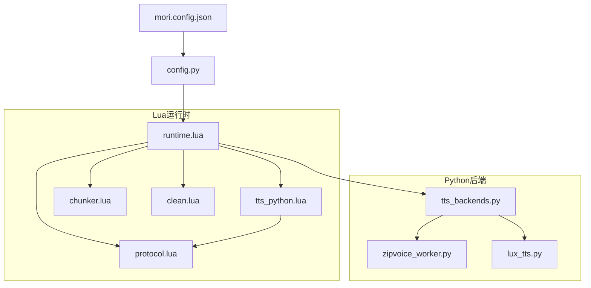
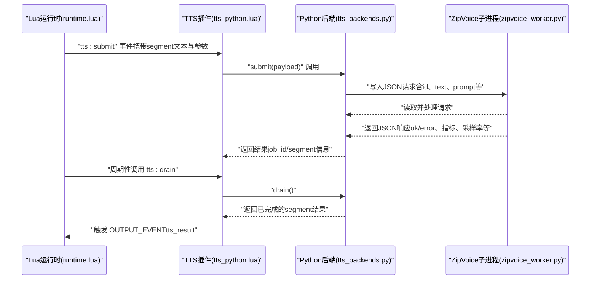
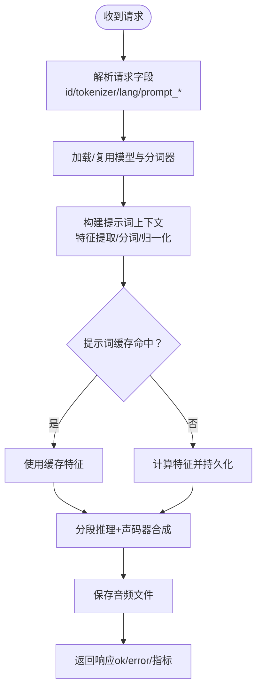
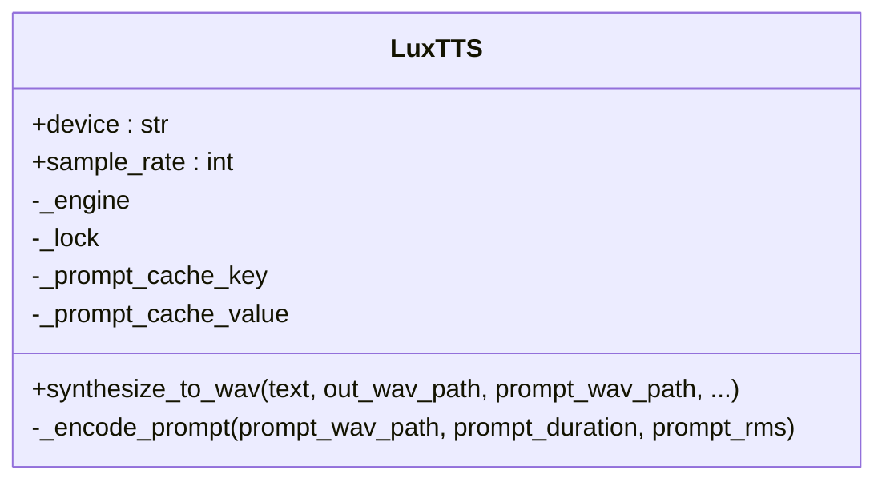
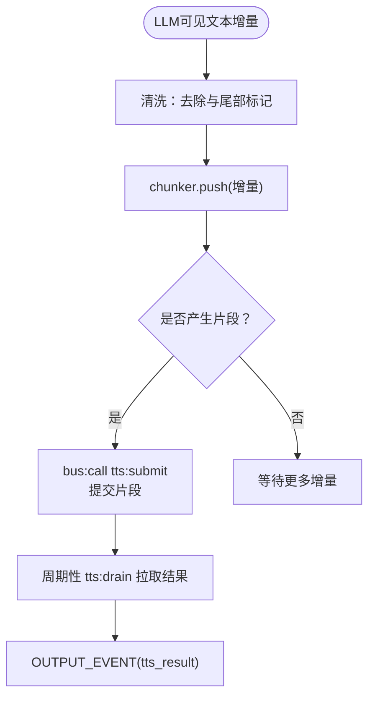
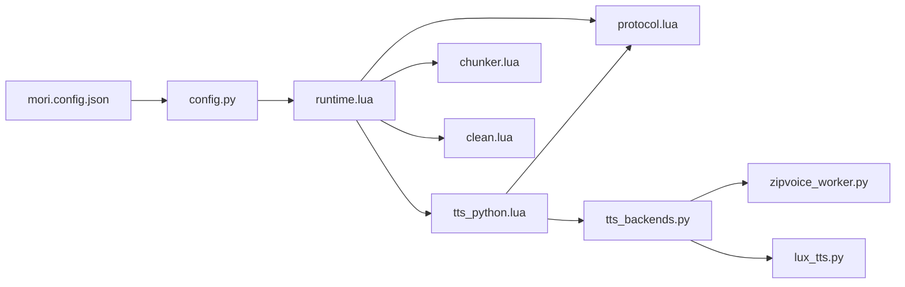

# TTS插件

<cite>
**本文引用的文件**
- [tts_backends.py](file://mori_runtime/tts_backends.py)
- [zipvoice_worker.py](file://mori_runtime/zipvoice_worker.py)
- [lux_tts.py](file://mori_tts/lux_tts.py)
- [tts_python.lua](file://mori_runtime/lua/mori/plugins/tts_python.lua)
- [runtime.lua](file://mori_runtime/lua/mori/app/runtime.lua)
- [protocol.lua](file://mori_runtime/lua/mori/core/protocol.lua)
- [chunker.lua](file://mori_runtime/lua/mori/speech/chunker.lua)
- [clean.lua](file://mori_runtime/lua/mori/text/clean.lua)
- [config.py](file://mori_runtime/config.py)
- [mori.config.json](file://mori.config.json)
- [README.md](file://README.md)
</cite>

## 目录
1. [简介](#简介)
2. [项目结构](#项目结构)
3. [核心组件](#核心组件)
4. [架构总览](#架构总览)
5. [详细组件分析](#详细组件分析)
6. [依赖关系分析](#依赖关系分析)
7. [性能考量](#性能考量)
8. [故障排除指南](#故障排除指南)
9. [结论](#结论)
10. [附录](#附录)

## 简介
本文件面向TTS插件的使用者与维护者，系统化阐述TTS插件的架构设计与实现细节，重点覆盖以下方面：
- Python后端集成方式与数据传输机制
- 文本转语音的完整处理流程（文本预处理、语音合成、音频输出）
- 与Python运行时的通信协议（消息格式、状态同步）
- 插件配置项（语音参数、音色选择、输出格式等）
- 性能优化技巧与并发控制策略
- 故障排除方法（内存管理、错误定位、常见问题）

## 项目结构
TTS插件由Lua运行时调度层与Python后端两部分组成：
- Lua侧负责事件总线、意图编排、文本切分与TTS结果消费
- Python侧负责具体TTS引擎（ZipVoice/LuxTTS）的推理与音频生成，并通过子进程与Lua侧进行双向通信

图表来源
- [runtime.lua:543-665](file://mori_runtime/lua/mori/app/runtime.lua#L543-L665)
- [tts_python.lua:1-31](file://mori_runtime/lua/mori/plugins/tts_python.lua#L1-L31)
- [protocol.lua:1-35](file://mori_runtime/lua/mori/core/protocol.lua#L1-L35)
- [chunker.lua:1-157](file://mori_runtime/lua/mori/speech/chunker.lua#L1-L157)
- [clean.lua:1-49](file://mori_runtime/lua/mori/text/clean.lua#L1-L49)
- [tts_backends.py:525-800](file://mori_runtime/tts_backends.py#L525-L800)
- [zipvoice_worker.py:446-729](file://mori_runtime/zipvoice_worker.py#L446-L729)
- [lux_tts.py:65-171](file://mori_tts/lux_tts.py#L65-L171)
- [config.py:188-270](file://mori_runtime/config.py#L188-L270)
- [mori.config.json:1-83](file://mori.config.json#L1-L83)

章节来源
- [runtime.lua:543-665](file://mori_runtime/lua/mori/app/runtime.lua#L543-L665)
- [tts_python.lua:1-31](file://mori_runtime/lua/mori/plugins/tts_python.lua#L1-L31)
- [protocol.lua:1-35](file://mori_runtime/lua/mori/core/protocol.lua#L1-L35)
- [chunker.lua:1-157](file://mori_runtime/lua/mori/speech/chunker.lua#L1-L157)
- [clean.lua:1-49](file://mori_runtime/lua/mori/text/clean.lua#L1-L49)
- [tts_backends.py:525-800](file://mori_runtime/tts_backends.py#L525-L800)
- [zipvoice_worker.py:446-729](file://mori_runtime/zipvoice_worker.py#L446-L729)
- [lux_tts.py:65-171](file://mori_tts/lux_tts.py#L65-L171)
- [config.py:188-270](file://mori_runtime/config.py#L188-L270)
- [mori.config.json:1-83](file://mori.config.json#L1-L83)

## 核心组件
- Lua运行时与插件桥接
  - runtime.lua：主循环、意图编排、文本切分、TTS结果消费与事件输出
  - tts_python.lua：注册TTS事件监听，转发到Python桥接对象
  - protocol.lua：定义事件常量（如 tts:submit、tts:drain、tts:cancel_intent 等）
  - chunker.lua：按标点与字符长度切分文本，支持软/硬断点
  - clean.lua：去除思维标记与尾部占位符，保留可见文本

- Python后端
  - tts_backends.py：ZipVoice/LuxTTS封装、语言检测、提示词池、工作进程管理、请求/响应协议
  - zipvoice_worker.py：ZipVoice推理子进程，负责模型加载、分词器缓存、特征提取、声码器、持久化提示词缓存
  - lux_tts.py：LuxTTS封装，设备选择、提示词编码缓存、生成与写盘

- 配置系统
  - config.py：将JSON配置映射为运行时参数，支持路径解析、键名转换
  - mori.config.json：统一配置入口，含TTS相关键值

章节来源
- [runtime.lua:303-541](file://mori_runtime/lua/mori/app/runtime.lua#L303-L541)
- [tts_python.lua:8-28](file://mori_runtime/lua/mori/plugins/tts_python.lua#L8-L28)
- [protocol.lua:24-27](file://mori_runtime/lua/mori/core/protocol.lua#L24-L27)
- [chunker.lua:56-153](file://mori_runtime/lua/mori/speech/chunker.lua#L56-L153)
- [clean.lua:16-46](file://mori_runtime/lua/mori/text/clean.lua#L16-L46)
- [tts_backends.py:525-800](file://mori_runtime/tts_backends.py#L525-L800)
- [zipvoice_worker.py:446-729](file://mori_runtime/zipvoice_worker.py#L446-L729)
- [lux_tts.py:65-171](file://mori_tts/lux_tts.py#L65-L171)
- [config.py:204-270](file://mori_runtime/config.py#L204-L270)
- [mori.config.json:14-51](file://mori.config.json#L14-L51)

## 架构总览
TTS插件采用“Lua调度 + Python子进程”的异步通信模式：
- Lua侧在LLM流式输出时，将可见文本切分为适长片段，逐段提交TTS任务
- Python侧以子进程形式承载ZipVoice/LuxTTS推理，通过标准输入/输出进行JSON消息交换
- 子进程启动后先上报“就绪”状态，随后循环读取请求、执行推理并返回结果
- Lua侧周期性拉取已完成的TTS结果，触发后续事件与输出

图表来源
- [runtime.lua:375-485](file://mori_runtime/lua/mori/app/runtime.lua#L375-L485)
- [tts_python.lua:13-27](file://mori_runtime/lua/mori/plugins/tts_python.lua#L13-L27)
- [tts_backends.py:704-794](file://mori_runtime/tts_backends.py#L704-L794)
- [zipvoice_worker.py:625-725](file://mori_runtime/zipvoice_worker.py#L625-L725)

章节来源
- [runtime.lua:375-485](file://mori_runtime/lua/mori/app/runtime.lua#L375-L485)
- [tts_python.lua:13-27](file://mori_runtime/lua/mori/plugins/tts_python.lua#L13-L27)
- [tts_backends.py:704-794](file://mori_runtime/tts_backends.py#L704-L794)
- [zipvoice_worker.py:625-725](file://mori_runtime/zipvoice_worker.py#L625-L725)

## 详细组件分析

### ZipVoice后端与子进程通信协议
- 启动与就绪
  - Python后端通过subprocess启动zipvoice_worker.py，传递模型路径、分词器类型、声码器配置等
  - 子进程初始化完成后向stdout发送“就绪”消息，包含设备、采样率、声码器配置等
- 请求/响应格式
  - 请求字段：id、tokenizer、lang、prompt_wav、prompt_text、prompt_cache_path、text、out_wav、num_step、guidance_scale、t_shift、speed、return_smooth、target_rms、feat_scale、max_duration、remove_long_sil
  - 响应字段：id、ok、error、out_wav、sample_rate、vocoder_profile、t、t_no_vocoder、t_vocoder、wav_seconds、rtf、rtf_no_vocoder、rtf_vocoder
- 语言检测与路由
  - 支持启发式规则与第三方语言检测库组合，自动判定中日英路由
- 提示词缓存
  - 支持内存与持久化两级缓存，避免重复特征计算
- 声码器
  - 支持基础24k与Lux 48k两种配置，后者需额外依赖

图表来源
- [zipvoice_worker.py:642-725](file://mori_runtime/zipvoice_worker.py#L642-L725)
- [tts_backends.py:761-800](file://mori_runtime/tts_backends.py#L761-L800)

章节来源
- [zipvoice_worker.py:446-729](file://mori_runtime/zipvoice_worker.py#L446-L729)
- [tts_backends.py:525-800](file://mori_runtime/tts_backends.py#L525-L800)

### LuxTTS后端
- 设备选择：自动探测CUDA/MPS/CPU，支持显式指定
- 提示词编码缓存：基于提示音频路径、修改时间、时长、RMS构建缓存键
- 生成流程：编码提示词 → 生成语音张量 → 写入WAV文件
- 线程与锁：内部使用锁保护生成过程，避免并发冲突

图表来源
- [lux_tts.py:65-171](file://mori_tts/lux_tts.py#L65-L171)

章节来源
- [lux_tts.py:65-171](file://mori_tts/lux_tts.py#L65-L171)

### Lua侧文本切分与TTS提交
- 文本清洗：移除思维标记与尾部占位符，仅保留可见文本
- 切分策略：根据硬/软断点与字符数阈值进行切分，首段可降低阈值以提升交互体验
- 提交流程：每段文本作为独立TTS任务提交，生成独立音频片段，便于低延迟播放与打断

图表来源
- [runtime.lua:375-485](file://mori_runtime/lua/mori/app/runtime.lua#L375-L485)
- [chunker.lua:67-153](file://mori_runtime/lua/mori/speech/chunker.lua#L67-L153)
- [clean.lua:16-46](file://mori_runtime/lua/mori/text/clean.lua#L16-L46)

章节来源
- [runtime.lua:375-485](file://mori_runtime/lua/mori/app/runtime.lua#L375-L485)
- [chunker.lua:67-153](file://mori_runtime/lua/mori/speech/chunker.lua#L67-L153)
- [clean.lua:16-46](file://mori_runtime/lua/mori/text/clean.lua#L16-L46)

### 事件协议与状态同步
- 事件定义：tts:submit、tts:drain、tts:cancel_intent、tts:result、output:event、output:print 等
- 状态同步：Lua侧通过周期性调用drain获取已完成任务，结合intent_id与segment索引进行匹配与去重
- 中断策略：当有更高优先级意图进入队列时，取消当前TTS意图并清理已提交但未完成的任务

章节来源
- [protocol.lua:24-32](file://mori_runtime/lua/mori/core/protocol.lua#L24-L32)
- [runtime.lua:448-485](file://mori_runtime/lua/mori/app/runtime.lua#L448-L485)
- [tts_python.lua:18-27](file://mori_runtime/lua/mori/plugins/tts_python.lua#L18-L27)

### 配置选项与参数映射
- 统一配置入口：mori.config.json
- 参数映射：config.py将JSON键映射为运行时参数，如 tts_backend、tts_model、tts_prompt_wav、tts_num_steps 等
- ZipVoice特有参数：模型类型、模型目录、检查点名称、分词器与语言、提示词清单、质量档位、声码器配置、语言检测策略等
- CLI/VTuber模式：支持不同入口的默认值与覆盖策略

章节来源
- [mori.config.json:14-51](file://mori.config.json#L14-L51)
- [config.py:204-270](file://mori_runtime/config.py#L204-L270)
- [README.md:63-121](file://README.md#L63-L121)

## 依赖关系分析
- 运行时依赖
  - Lua运行时依赖事件总线、插件系统、文本清洗与切分模块
  - TTS插件依赖协议常量与Python桥接对象
- Python后端依赖
  - ZipVoice子进程依赖ZipVoice仓库、模型权重、分词器、特征提取器与声码器
  - LuxTTS依赖PyTorch、SoundFile与ZipVoice提供的LuxTTS实现
- 配置依赖
  - 配置解析器负责路径展开、键名映射与默认值注入

图表来源
- [runtime.lua:543-665](file://mori_runtime/lua/mori/app/runtime.lua#L543-L665)
- [tts_python.lua:1-31](file://mori_runtime/lua/mori/plugins/tts_python.lua#L1-L31)
- [protocol.lua:1-35](file://mori_runtime/lua/mori/core/protocol.lua#L1-L35)
- [chunker.lua:1-157](file://mori_runtime/lua/mori/speech/chunker.lua#L1-L157)
- [clean.lua:1-49](file://mori_runtime/lua/mori/text/clean.lua#L1-L49)
- [tts_backends.py:525-800](file://mori_runtime/tts_backends.py#L525-L800)
- [zipvoice_worker.py:446-729](file://mori_runtime/zipvoice_worker.py#L446-L729)
- [lux_tts.py:65-171](file://mori_tts/lux_tts.py#L65-L171)
- [config.py:188-270](file://mori_runtime/config.py#L188-L270)
- [mori.config.json:1-83](file://mori.config.json#L1-L83)

章节来源
- [runtime.lua:543-665](file://mori_runtime/lua/mori/app/runtime.lua#L543-L665)
- [tts_backends.py:525-800](file://mori_runtime/tts_backends.py#L525-L800)
- [zipvoice_worker.py:446-729](file://mori_runtime/zipvoice_worker.py#L446-L729)
- [lux_tts.py:65-171](file://mori_tts/lux_tts.py#L65-L171)
- [config.py:188-270](file://mori_runtime/config.py#L188-L270)
- [mori.config.json:1-83](file://mori.config.json#L1-L83)

## 性能考量
- 并发与线程
  - ZipVoice子进程内通过torch线程数控制推理并行度，建议与CPU核心数匹配
  - LuxTTS内部使用锁串行化生成，避免GPU内存竞争
- 采样率与声码器
  - Lux 48k声码器可提升音质，但需额外依赖；24k声码器开销更低
- 提示词缓存
  - 内存与持久化双层缓存显著减少重复特征计算；注意磁盘空间与缓存失效策略
- 文本切分
  - 合理的最小/最大字符阈值与首段boost可降低首包延迟，改善交互体验
- I/O与中断
  - 将音频写入磁盘而非内存，避免大段音频占用过多内存
  - 高优先级意图到达时及时取消与丢弃未完成片段，减少资源浪费

## 故障排除指南
- 子进程异常退出
  - 现象：读取响应时报错或子进程提前退出
  - 排查：检查ZipVoice仓库路径、模型权重与分词器文件是否存在；确认声码器依赖安装
  - 参考
    - [zipvoice_worker.py:455-468](file://mori_runtime/zipvoice_worker.py#L455-L468)
    - [zipvoice_worker.py:637-640](file://mori_runtime/zipvoice_worker.py#L637-L640)
- 语言检测不稳定
  - 现象：混合语言文本路由错误
  - 排查：调整语言检测模式（启发式/自动）与置信度阈值
  - 参考
    - [tts_backends.py:496-523](file://mori_runtime/tts_backends.py#L496-L523)
- 提示词无效或为空
  - 现象：分词或token-id映射为空
  - 排查：确认提示词文本与音频路径正确，且分词器支持对应语言
  - 参考
    - [zipvoice_worker.py:100-104](file://mori_runtime/zipvoice_worker.py#L100-L104)
- 设备不可用
  - 现象：LuxTTS无法选择期望设备
  - 排查：检查CUDA/MPS可用性，必要时显式指定设备
  - 参考
    - [lux_tts.py:42-56](file://mori_tts/lux_tts.py#L42-L56)
- 音频质量与延迟
  - 现象：RTF过高或音质不佳
  - 排查：调整质量档位、声码器配置、num_steps、guidance_scale、t_shift、speed
  - 参考
    - [tts_backends.py:393-446](file://mori_runtime/tts_backends.py#L393-L446)
    - [zipvoice_worker.py:684-725](file://mori_runtime/zipvoice_worker.py#L684-L725)

章节来源
- [zipvoice_worker.py:455-468](file://mori_runtime/zipvoice_worker.py#L455-L468)
- [zipvoice_worker.py:637-640](file://mori_runtime/zipvoice_worker.py#L637-L640)
- [tts_backends.py:496-523](file://mori_runtime/tts_backends.py#L496-L523)
- [zipvoice_worker.py:100-104](file://mori_runtime/zipvoice_worker.py#L100-L104)
- [lux_tts.py:42-56](file://mori_tts/lux_tts.py#L42-L56)
- [tts_backends.py:393-446](file://mori_runtime/tts_backends.py#L393-L446)
- [zipvoice_worker.py:684-725](file://mori_runtime/zipvoice_worker.py#L684-L725)

## 结论
TTS插件通过Lua与Python的清晰分工与稳定的JSON协议实现了高扩展性的文本转语音能力。ZipVoice与LuxTTS两种后端满足不同场景需求：前者强调实时性与多语言路由，后者强调音质与可控参数。配合文本切分、提示词缓存与中断策略，可在保证低延迟的同时获得良好的用户体验。

## 附录
- 快速上手
  - 安装LuxTTS依赖与ZipVoice声码器依赖
  - 在mori.config.json中配置tts后端、模型与提示词路径
  - 启动主程序，即可在LLM流式输出时自动分段TTS
- 常用参数建议
  - ZipVoice：质量档位balanced或realtime，声码器lux_48k，num_steps 4~8
  - LuxTTS：num_steps 4，guidance_scale 3.0，t_shift 0.5，speed 1.0

章节来源
- [README.md:63-121](file://README.md#L63-L121)
- [mori.config.json:14-51](file://mori.config.json#L14-L51)