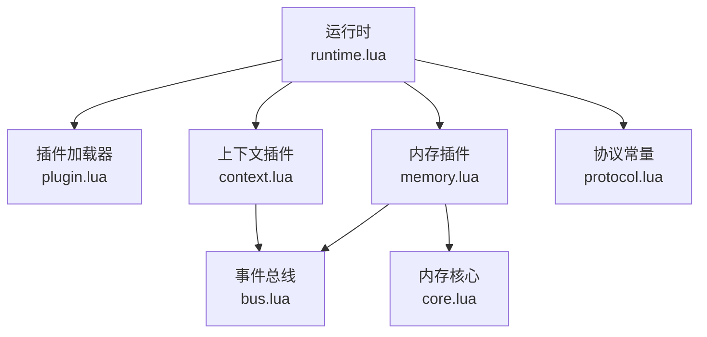
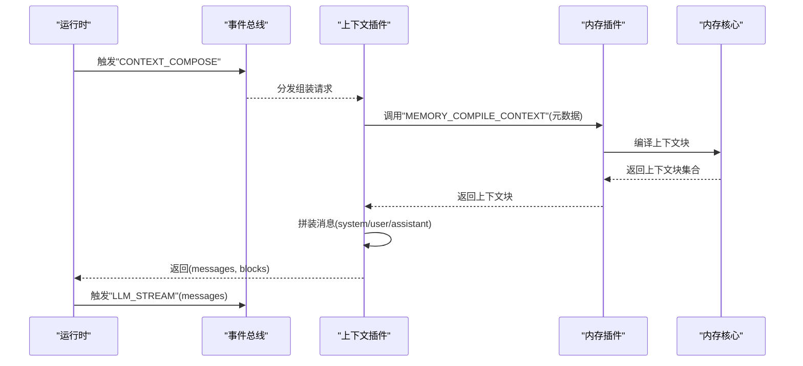
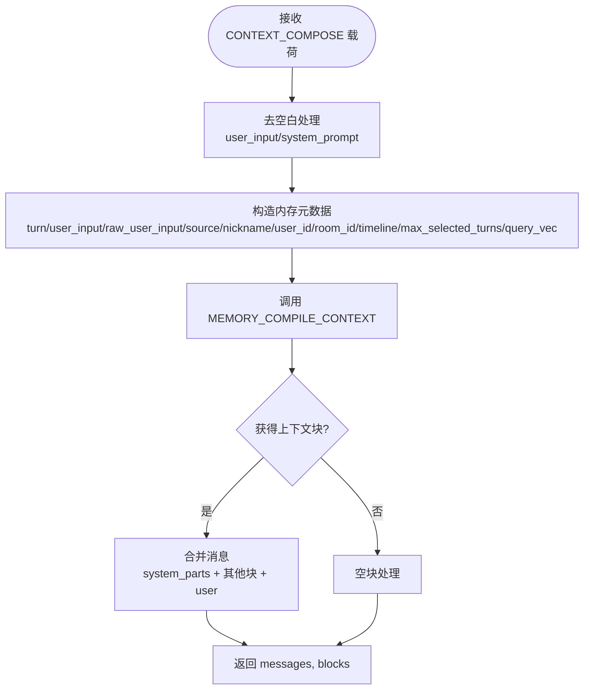
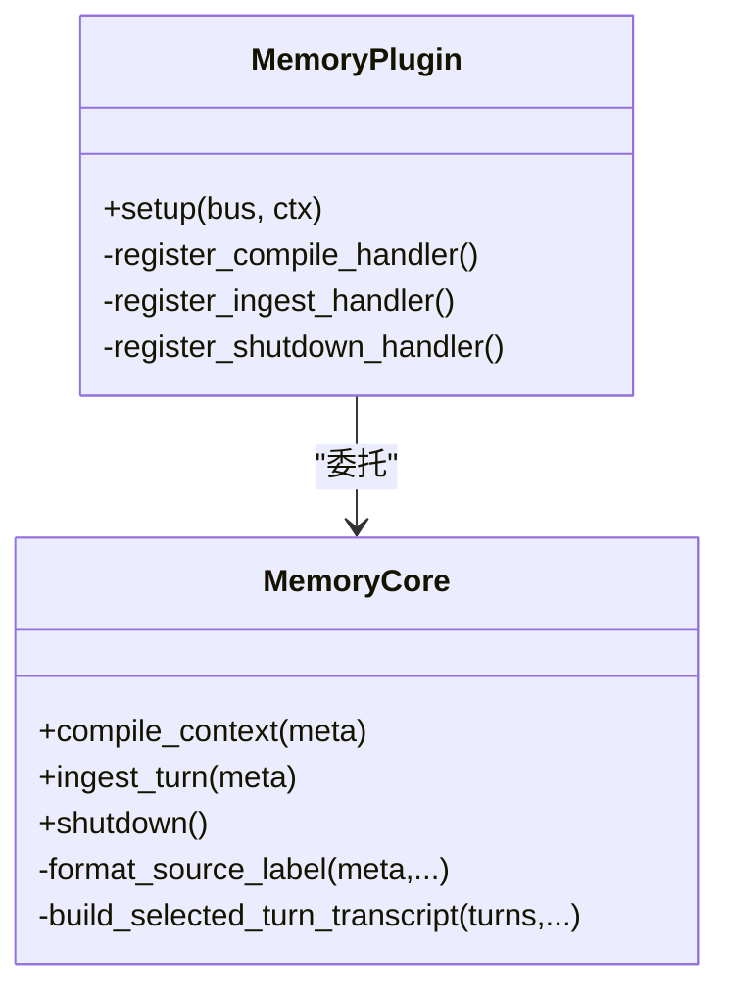
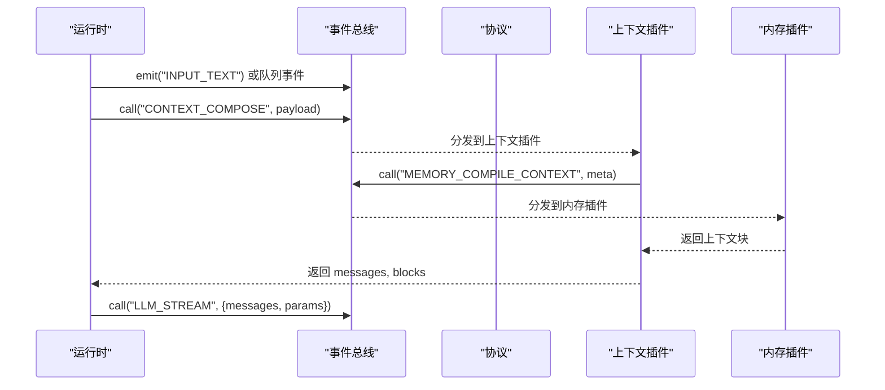
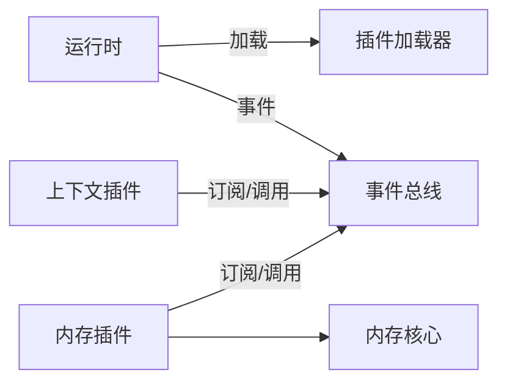

# 上下文插件

<cite>
**本文引用的文件**
- [context.lua](file://mori_runtime/lua/mori/plugins/context.lua)
- [plugin.lua](file://mori_runtime/lua/mori/core/plugin.lua)
- [runtime.lua](file://mori_runtime/lua/mori/app/runtime.lua)
- [protocol.lua](file://mori_runtime/lua/mori/core/protocol.lua)
- [bus.lua](file://mori_runtime/lua/mori/core/bus.lua)
- [memory.lua](file://mori_runtime/lua/mori/plugins/memory.lua)
- [core.lua](file://mori_memory/mori_memory/core.lua)
- [config.py](file://mori_runtime/config.py)
</cite>

## 目录
1. [简介](#简介)
2. [项目结构](#项目结构)
3. [核心组件](#核心组件)
4. [架构总览](#架构总览)
5. [详细组件分析](#详细组件分析)
6. [依赖分析](#依赖分析)
7. [性能考量](#性能考量)
8. [故障排查指南](#故障排查指南)
9. [结论](#结论)
10. [附录](#附录)

## 简介
本文件系统性阐述“上下文插件”的作用、实现原理与集成方式，覆盖以下主题：
- 上下文数据的收集、处理与传递机制
- 会话状态、用户信息与环境数据的管理
- 与内存插件、运行时调度等其他插件的交互模式与事件契约
- 配置项与可定制能力（如系统提示、最大选择轮次、查询向量等）
- 使用示例与调试技巧（日志分析、性能监控）

## 项目结构
上下文插件位于运行时系统中，通过事件总线与内存插件协作，驱动 LLM 的上下文组装流程。其核心位置与职责如下：
- 运行时入口负责加载插件、调度意图、触发上下文组装与 LLM 推理
- 上下文插件监听上下文组装事件，调用内存插件生成上下文块，并拼装最终消息序列
- 内存插件负责从历史、主题、证据等维度提取与格式化上下文内容
- 总线与协议定义了跨模块通信契约

**图表来源**
- [runtime.lua:543-563](file://mori_runtime/lua/mori/app/runtime.lua#L543-L563)
- [plugin.lua:13-47](file://mori_runtime/lua/mori/core/plugin.lua#L13-L47)
- [context.lua:30-86](file://mori_runtime/lua/mori/plugins/context.lua#L30-L86)
- [memory.lua:8-25](file://mori_runtime/lua/mori/plugins/memory.lua#L8-L25)
- [bus.lua:14-91](file://mori_runtime/lua/mori/core/bus.lua#L14-L91)
- [protocol.lua:3-32](file://mori_runtime/lua/mori/core/protocol.lua#L3-L32)
- [core.lua:1-20](file://mori_memory/mori_memory/core.lua#L1-L20)

**章节来源**
- [runtime.lua:543-563](file://mori_runtime/lua/mori/app/runtime.lua#L543-L563)
- [plugin.lua:13-47](file://mori_runtime/lua/mori/core/plugin.lua#L13-L47)
- [context.lua:30-86](file://mori_runtime/lua/mori/plugins/context.lua#L30-L86)
- [memory.lua:8-25](file://mori_runtime/lua/mori/plugins/memory.lua#L8-L25)
- [bus.lua:14-91](file://mori_runtime/lua/mori/core/bus.lua#L14-L91)
- [protocol.lua:3-32](file://mori_runtime/lua/mori/core/protocol.lua#L3-L32)
- [core.lua:1-20](file://mori_memory/mori_memory/core.lua#L1-L20)

## 核心组件
- 上下文插件（context.lua）
  - 负责响应上下文组装事件，接收用户输入、系统提示、来源信息等，调用内存插件生成上下文块，最终输出消息数组与原始块列表
- 内存插件（memory.lua）
  - 注册上下文编译与记忆注入事件处理器，委托内存核心进行上下文构建与记忆写入
- 内存核心（core.lua）
  - 提供历史、主题、证据等多源上下文的提取、格式化与安全阈值控制
- 运行时（runtime.lua）
  - 插件加载、意图调度、事件分发、LLM 推理与 TTS 流水线的主控
- 事件总线与协议（bus.lua、protocol.lua）
  - 定义事件契约与广播/调用语义，确保模块间解耦

**章节来源**
- [context.lua:30-86](file://mori_runtime/lua/mori/plugins/context.lua#L30-L86)
- [memory.lua:8-25](file://mori_runtime/lua/mori/plugins/memory.lua#L8-L25)
- [core.lua:1-20](file://mori_memory/mori_memory/core.lua#L1-L20)
- [runtime.lua:543-563](file://mori_runtime/lua/mori/app/runtime.lua#L543-L563)
- [bus.lua:14-91](file://mori_runtime/lua/mori/core/bus.lua#L14-L91)
- [protocol.lua:3-32](file://mori_runtime/lua/mori/core/protocol.lua#L3-L32)

## 架构总览
上下文插件在运行时生命周期中的位置与交互如下：

**图表来源**
- [runtime.lua:333-344](file://mori_runtime/lua/mori/app/runtime.lua#L333-L344)
- [context.lua:30-86](file://mori_runtime/lua/mori/plugins/context.lua#L30-L86)
- [memory.lua:12-14](file://mori_runtime/lua/mori/plugins/memory.lua#L12-L14)
- [protocol.lua:12-16](file://mori_runtime/lua/mori/core/protocol.lua#L12-L16)

## 详细组件分析

### 上下文插件（context.lua）
- 事件订阅
  - 订阅“CONTEXT_COMPOSE”事件，接收包含轮次、用户输入、系统提示、来源、昵称、用户/房间标识、时间线等字段的载荷
- 数据预处理
  - 对用户输入与系统提示进行去空白处理
  - 将载荷转换为内存元数据（含可选的最大选择轮数与查询向量）
- 上下文块编译
  - 调用“MEMORY_COMPILE_CONTEXT”事件，由内存插件返回上下文块集合
- 消息拼装
  - 将系统提示合并为首条消息（role=system）
  - 将非系统角色的块按顺序加入消息列表
  - 最后追加用户消息（role=user）
- 输出
  - 返回 messages 与 blocks，供运行时后续推理与记忆写入使用

**图表来源**
- [context.lua:30-86](file://mori_runtime/lua/mori/plugins/context.lua#L30-L86)

**章节来源**
- [context.lua:30-86](file://mori_runtime/lua/mori/plugins/context.lua#L30-L86)

### 内存插件（memory.lua）与内存核心（core.lua）
- 内存插件职责
  - 注册“MEMORY_COMPILE_CONTEXT”处理器，委托内存核心的编译函数
  - 注册“MEMORY_INGEST_TURN”处理器，用于记忆写入
  - 注册“MEMORY_SHUTDOWN”，统一关闭资源
- 内存核心能力
  - 历史、主题、证据等多源上下文提取与格式化
  - 安全阈值控制（召回、历史、主题、写入）
  - 事件来源标签格式化、向量化校验、线程运行时与检查点管理
  - 构建“相关对话片段”等上下文文本

**图表来源**
- [memory.lua:8-25](file://mori_runtime/lua/mori/plugins/memory.lua#L8-L25)
- [core.lua:438-474](file://mori_memory/mori_memory/core.lua#L438-L474)
- [core.lua:156-195](file://mori_memory/mori_memory/core.lua#L156-L195)

**章节来源**
- [memory.lua:8-25](file://mori_runtime/lua/mori/plugins/memory.lua#L8-L25)
- [core.lua:438-474](file://mori_memory/mori_memory/core.lua#L438-L474)
- [core.lua:156-195](file://mori_memory/mori_memory/core.lua#L156-L195)

### 运行时（runtime.lua）与事件总线（bus.lua）、协议（protocol.lua）
- 运行时职责
  - 加载插件（默认包含上下文插件）
  - 解析系统提示、增强提示（直播场景）、拼接“/no_think”
  - 触发上下文组装、LLM 流式推理、TTS 提交与结果回传
  - 记忆注入与事件输出
- 事件总线与协议
  - 定义事件名常量（如 CONTEXT_COMPOSE、MEMORY_COMPILE_CONTEXT、LLM_STREAM 等）
  - 提供 emit/call 语义，确保模块间松耦合

**图表来源**
- [runtime.lua:333-344](file://mori_runtime/lua/mori/app/runtime.lua#L333-L344)
- [protocol.lua:12-22](file://mori_runtime/lua/mori/core/protocol.lua#L12-L22)
- [bus.lua:50-91](file://mori_runtime/lua/mori/core/bus.lua#L50-L91)

**章节来源**
- [runtime.lua:333-344](file://mori_runtime/lua/mori/app/runtime.lua#L333-L344)
- [protocol.lua:12-22](file://mori_runtime/lua/mori/core/protocol.lua#L12-L22)
- [bus.lua:50-91](file://mori_runtime/lua/mori/core/bus.lua#L50-L91)

## 依赖分析
- 插件加载与生命周期
  - 运行时通过插件加载器加载上下文与内存插件，注册模块就绪事件
- 事件契约
  - 上下文插件依赖“CONTEXT_COMPOSE”与“MEMORY_COMPILE_CONTEXT”事件
  - 运行时依赖“LLM_STREAM”、“MEMORY_INGEST_TURN”等事件
- 模块内聚与耦合
  - 上下文插件与内存插件通过事件契约解耦
  - 运行时作为编排者，不直接依赖具体实现细节

**图表来源**
- [plugin.lua:13-47](file://mori_runtime/lua/mori/core/plugin.lua#L13-L47)
- [runtime.lua:543-563](file://mori_runtime/lua/mori/app/runtime.lua#L543-L563)
- [context.lua:30-86](file://mori_runtime/lua/mori/plugins/context.lua#L30-L86)
- [memory.lua:8-25](file://mori_runtime/lua/mori/plugins/memory.lua#L8-L25)

**章节来源**
- [plugin.lua:13-47](file://mori_runtime/lua/mori/core/plugin.lua#L13-L47)
- [runtime.lua:543-563](file://mori_runtime/lua/mori/app/runtime.lua#L543-L563)
- [context.lua:30-86](file://mori_runtime/lua/mori/plugins/context.lua#L30-L86)
- [memory.lua:8-25](file://mori_runtime/lua/mori/plugins/memory.lua#L8-L25)

## 性能考量
- 上下文块数量与长度
  - 可通过配置限制“最大选择轮次”，避免上下文过长导致延迟与成本上升
- 文本截断策略
  - 内存核心提供按字符上限压缩的策略，减少冗余
- 并发与中断
  - 运行时支持优先级与中断策略，避免长时间阻塞
- 向量化与嵌入
  - 若提供查询向量，可用于更精准的上下文召回，但需平衡计算开销

[本节为通用指导，无需特定文件来源]

## 故障排查指南
- 插件加载失败
  - 检查插件是否返回包含 setup 函数的表，以及版本与 ID 字段
- 事件未触发或无响应
  - 确认事件名称与载荷字段一致（如 turn、user_input、system_prompt、source、nickname、user_id、room_id、timeline、max_selected_turns、query_vec）
- 上下文为空
  - 检查内存插件是否正确注册“MEMORY_COMPILE_CONTEXT”处理器，确认内存核心初始化成功
- 日志与错误
  - 运行时会将总线错误打印到标准错误；可通过输出事件与打印事件定位问题
- 配置项核对
  - 系统提示、直播增强、最大选择轮次、TTS 开关等均影响上下文与输出行为

**章节来源**
- [plugin.lua:18-45](file://mori_runtime/lua/mori/core/plugin.lua#L18-L45)
- [runtime.lua:551-554](file://mori_runtime/lua/mori/app/runtime.lua#L551-L554)
- [runtime.lua:333-344](file://mori_runtime/lua/mori/app/runtime.lua#L333-L344)
- [memory.lua:12-14](file://mori_runtime/lua/mori/plugins/memory.lua#L12-L14)

## 结论
上下文插件以事件驱动的方式，将用户输入、系统提示与多源记忆整合为 LLM 可消费的消息序列。它通过内存插件与内存核心实现可扩展的记忆编译与注入，配合运行时的调度与事件总线，形成高内聚、低耦合的上下文管理方案。通过合理的配置与监控手段，可在保证响应质量的同时优化性能与稳定性。

[本节为总结性内容，无需特定文件来源]

## 附录

### 配置选项与定制能力
- 运行时配置键（Python 层）
  - 系统提示、上下文大小、预测步数、温度、采样参数等
  - TTS 相关开关与参数映射
  - 直播场景相关开关与行为策略
- 上下文组装参数
  - 轮次（turn）、原始用户输入（raw_user_input）、系统提示（system_prompt）
  - 来源（source）、昵称（nickname）、用户/房间标识（user_id、room_id）
  - 时间线（timeline）、最大选择轮次（max_selected_turns）、查询向量（query_vec）
- 定制建议
  - 在运行时根据场景增强系统提示（如直播场景）
  - 通过 max_selected_turns 控制上下文规模
  - 提供 query_vec 以提升相关性

**章节来源**
- [config.py:11-270](file://mori_runtime/config.py#L11-L270)
- [runtime.lua:333-344](file://mori_runtime/lua/mori/app/runtime.lua#L333-L344)
- [context.lua:33-52](file://mori_runtime/lua/mori/plugins/context.lua#L33-L52)

### 使用示例与调试技巧
- 示例路径
  - 触发上下文组装：参考运行时对“CONTEXT_COMPOSE”的调用
  - 查看输出事件：关注“output:subtitle”“output:event”“output:print”
- 调试要点
  - 关注“BUS_ERROR”事件，定位回调异常
  - 使用“/tts on/off/toggle”动态调整 TTS 行为
  - 通过“print_to_stdout”观察队列与 TTS 状态

**章节来源**
- [runtime.lua:333-344](file://mori_runtime/lua/mori/app/runtime.lua#L333-L344)
- [runtime.lua:608-638](file://mori_runtime/lua/mori/app/runtime.lua#L608-L638)
- [bus.lua:58-69](file://mori_runtime/lua/mori/core/bus.lua#L58-L69)