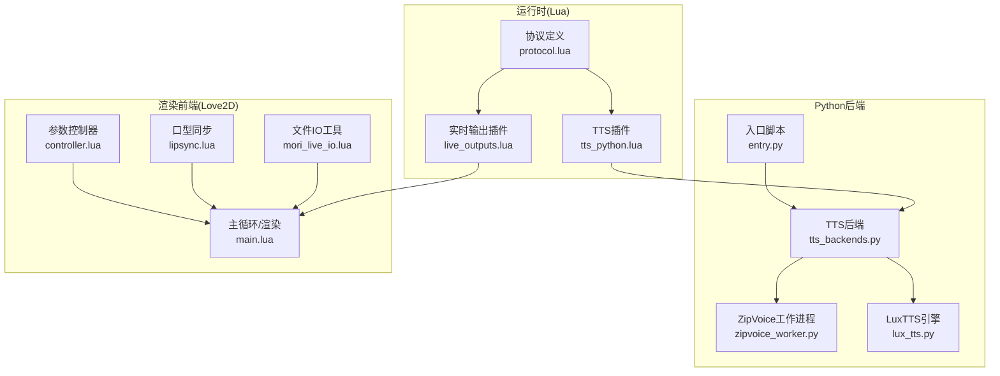
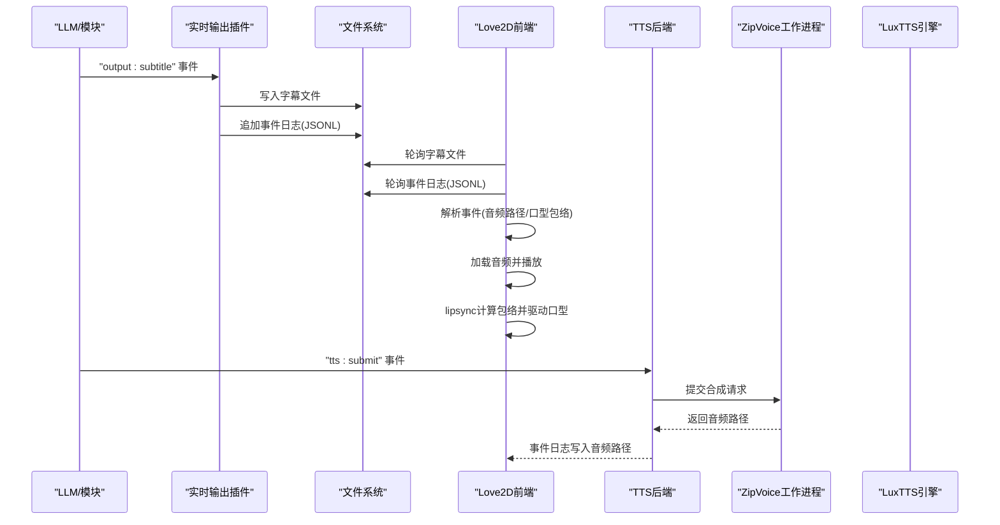
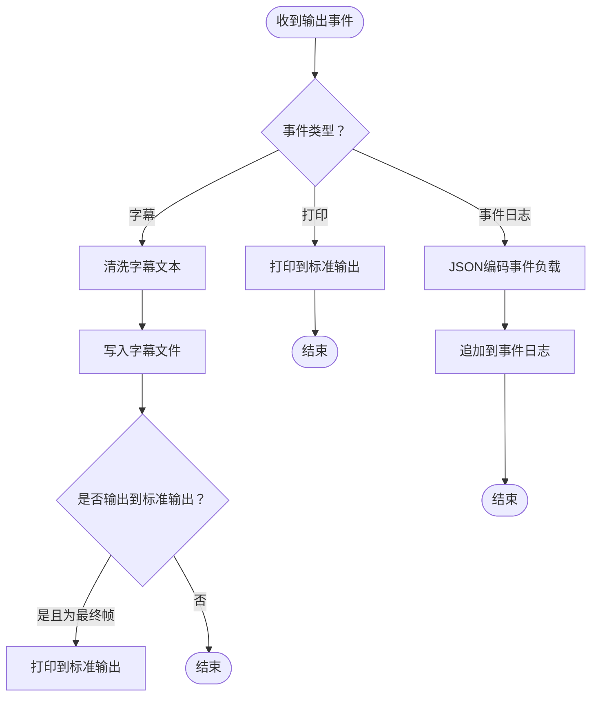
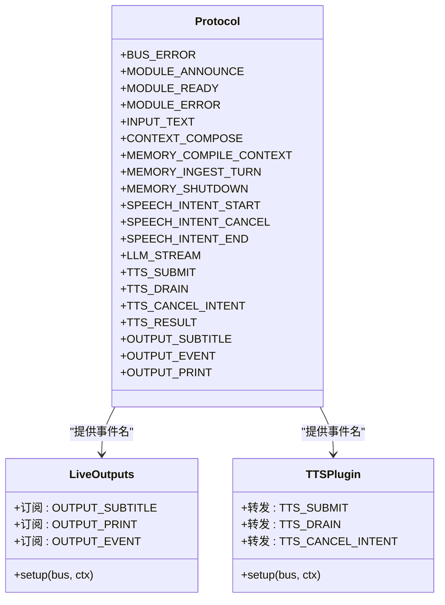
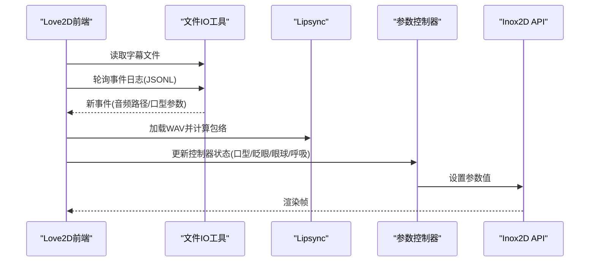
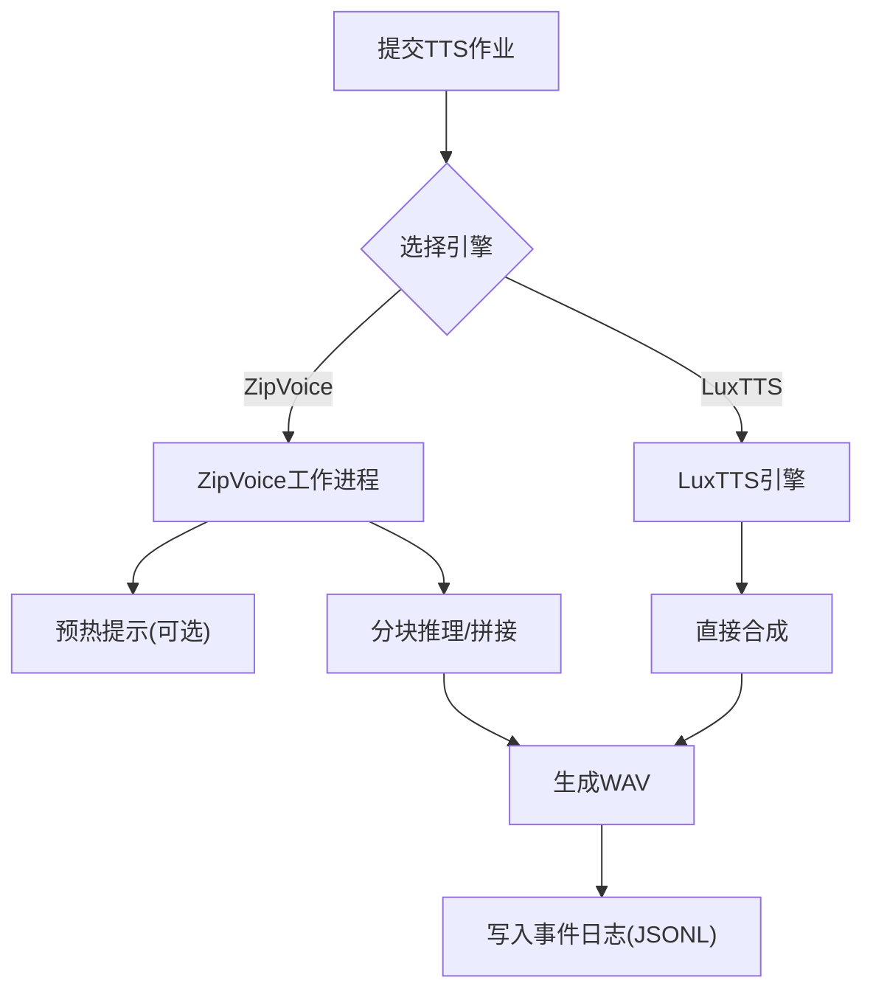
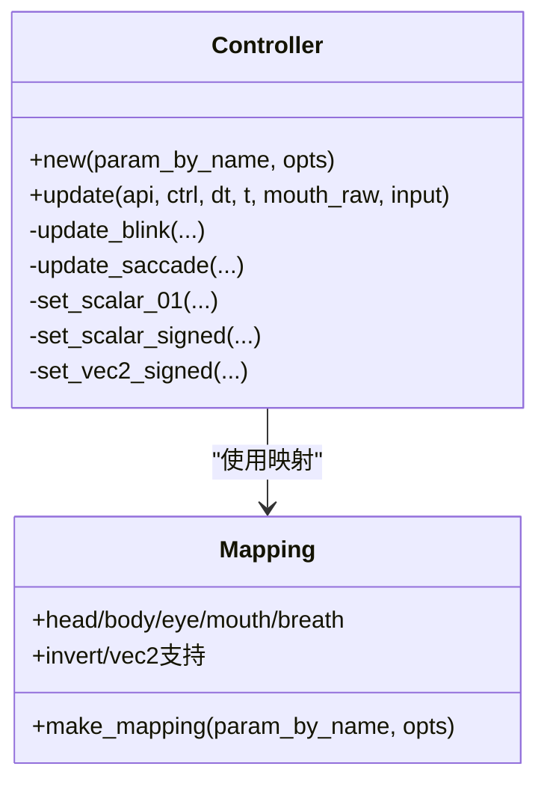
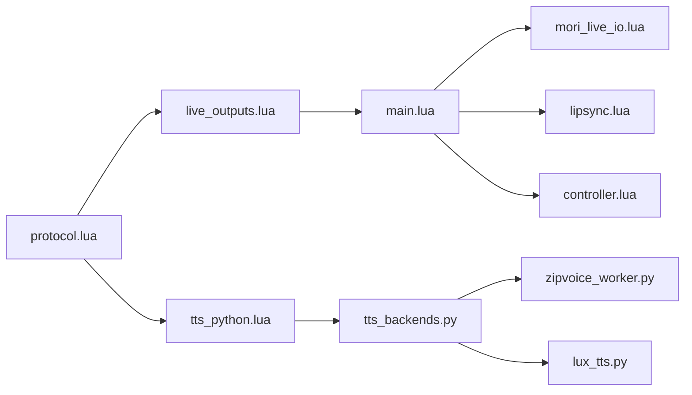

# 实时输出插件

<cite>
**本文档引用的文件**
- [live_outputs.lua](file://mori_runtime/lua/mori/plugins/live_outputs.lua)
- [protocol.lua](file://mori_runtime/lua/mori/core/protocol.lua)
- [tts_python.lua](file://mori_runtime/lua/mori/plugins/tts_python.lua)
- [controller.lua](file://mori_live2d/love2d_frontend/controller.lua)
- [main.lua](file://mori_live2d/love2d_frontend/main.lua)
- [mori_live_io.lua](file://mori_live2d/love2d_frontend/mori_live_io.lua)
- [lipsync.lua](file://mori_live2d/love2d_frontend/lipsync.lua)
- [tts_backends.py](file://mori_runtime/tts_backends.py)
- [zipvoice_worker.py](file://mori_runtime/zipvoice_worker.py)
- [lux_tts.py](file://mori_tts/lux_tts.py)
- [entry.py](file://mori_runtime/entry.py)
</cite>

## 目录
1. [简介](#简介)
2. [项目结构](#项目结构)
3. [核心组件](#核心组件)
4. [架构总览](#架构总览)
5. [详细组件分析](#详细组件分析)
6. [依赖关系分析](#依赖关系分析)
7. [性能考虑](#性能考虑)
8. [故障排除指南](#故障排除指南)
9. [结论](#结论)

## 简介
本文件系统性阐述实时输出插件的设计与实现，重点覆盖以下方面：
- 字幕显示：从协议事件中提取文本，进行清洗与标准化，写入文件供渲染前端读取。
- 音频播放：通过事件日志记录音频路径与口型包络，Love2D前端解析并驱动口型同步。
- 视觉反馈：Love2D前端基于参数映射将口型、眨眼、眼球运动、呼吸等参数驱动到Live2D模型。
- 多模态同步与时序控制：通过事件日志的增量读取与口型包络的滑动窗采样，实现音频与口型的时序对齐。
- 插件协作：实时输出插件与TTS插件、Live2D前端之间的数据流与状态同步。
- 配置选项：显示参数、音频设置与渲染选项的说明与最佳实践。
- 性能优化与故障排除：延迟控制、资源管理与常见问题定位。

## 项目结构
实时输出插件位于运行时的Lua插件体系中，配合TTS后端与Love2D前端共同完成“字幕+音频+Live2D”的实时输出。关键文件与职责如下：
- 实时输出插件：负责接收输出事件，写入字幕文件与事件日志。
- 协议定义：统一事件命名空间，确保跨语言桥接的一致性。
- TTS插件：转发TTS提交/排空/取消意图到Python侧引擎。
- Love2D前端：读取字幕与事件日志，播放音频并驱动Live2D参数。
- Lipsync模块：计算音频包络，驱动口型同步。
- TTS后端：ZipVoice/LuxTTS引擎，负责文本转语音与音频生成。
- 入口脚本：统一配置与启动流程，串联各子系统。

**图表来源**
- [live_outputs.lua:63-111](file://mori_runtime/lua/mori/plugins/live_outputs.lua#L63-L111)
- [protocol.lua:3-32](file://mori_runtime/lua/mori/core/protocol.lua#L3-L32)
- [tts_python.lua:8-28](file://mori_runtime/lua/mori/plugins/tts_python.lua#L8-L28)
- [main.lua:156-283](file://mori_live2d/love2d_frontend/main.lua#L156-L283)
- [mori_live_io.lua:214-260](file://mori_live2d/love2d_frontend/mori_live_io.lua#L214-L260)
- [lipsync.lua:62-125](file://mori_live2d/love2d_frontend/lipsync.lua#L62-L125)
- [controller.lua:601-872](file://mori_live2d/love2d_frontend/controller.lua#L601-L872)
- [tts_backends.py:525-800](file://mori_runtime/tts_backends.py#L525-L800)
- [zipvoice_worker.py:446-729](file://mori_runtime/zipvoice_worker.py#L446-L729)
- [lux_tts.py:65-171](file://mori_tts/lux_tts.py#L65-L171)
- [entry.py:796-1084](file://mori_runtime/entry.py#L796-L1084)

**章节来源**
- [live_outputs.lua:63-111](file://mori_runtime/lua/mori/plugins/live_outputs.lua#L63-L111)
- [protocol.lua:3-32](file://mori_runtime/lua/mori/core/protocol.lua#L3-L32)
- [tts_python.lua:8-28](file://mori_runtime/lua/mori/plugins/tts_python.lua#L8-L28)
- [main.lua:156-283](file://mori_live2d/love2d_frontend/main.lua#L156-L283)
- [mori_live_io.lua:214-260](file://mori_live2d/love2d_frontend/mori_live_io.lua#L214-L260)
- [lipsync.lua:62-125](file://mori_live2d/love2d_frontend/lipsync.lua#L62-L125)
- [controller.lua:601-872](file://mori_live2d/love2d_frontend/controller.lua#L601-L872)
- [tts_backends.py:525-800](file://mori_runtime/tts_backends.py#L525-L800)
- [zipvoice_worker.py:446-729](file://mori_runtime/zipvoice_worker.py#L446-L729)
- [lux_tts.py:65-171](file://mori_tts/lux_tts.py#L65-L171)
- [entry.py:796-1084](file://mori_runtime/entry.py#L796-L1084)

## 核心组件
- 实时输出插件
  - 功能：订阅输出事件，写入字幕文件、标准输出与事件日志。
  - 关键点：文本清洗、文件写入、事件编码与追加。
- 协议定义
  - 提供统一事件名空间，涵盖输入、内存、语音意图、LLM流、TTS与输出事件。
- TTS插件
  - 将TTS相关事件转发至Python侧，实现提交、排空与取消意图。
- Love2D前端
  - 读取字幕与事件日志，播放音频并驱动Live2D参数映射。
- Lipsync模块
  - 计算音频包络，驱动口型同步。
- TTS后端
  - ZipVoice/LuxTTS引擎，负责文本转语音与音频生成。
- 入口脚本
  - 统一配置与启动流程，串联各子系统。

**章节来源**
- [live_outputs.lua:63-111](file://mori_runtime/lua/mori/plugins/live_outputs.lua#L63-L111)
- [protocol.lua:3-32](file://mori_runtime/lua/mori/core/protocol.lua#L3-L32)
- [tts_python.lua:8-28](file://mori_runtime/lua/mori/plugins/tts_python.lua#L8-L28)
- [main.lua:156-283](file://mori_live2d/love2d_frontend/main.lua#L156-L283)
- [lipsync.lua:62-125](file://mori_live2d/love2d_frontend/lipsync.lua#L62-L125)
- [tts_backends.py:525-800](file://mori_runtime/tts_backends.py#L525-L800)
- [entry.py:796-1084](file://mori_runtime/entry.py#L796-L1084)

## 架构总览
实时输出插件在运行时中承担“事件汇聚与文件输出”的职责，与TTS后端和Love2D前端形成清晰的数据通路：
- 输出事件 → 实时输出插件 → 字幕文件/事件日志/标准输出
- Love2D前端 → 读取字幕文件/事件日志 → 播放音频 → lipsync → 参数映射 → Live2D渲染
- TTS后端 → 生成音频 → 写入事件日志 → Love2D前端消费

**图表来源**
- [live_outputs.lua:80-110](file://mori_runtime/lua/mori/plugins/live_outputs.lua#L80-L110)
- [main.lua:293-399](file://mori_live2d/love2d_frontend/main.lua#L293-L399)
- [mori_live_io.lua:229-260](file://mori_live2d/love2d_frontend/mori_live_io.lua#L229-L260)
- [lipsync.lua:109-125](file://mori_live2d/love2d_frontend/lipsync.lua#L109-L125)
- [tts_backends.py:245-389](file://mori_runtime/tts_backends.py#L245-L389)
- [zipvoice_worker.py:625-725](file://mori_runtime/zipvoice_worker.py#L625-725)

**章节来源**
- [live_outputs.lua:80-110](file://mori_runtime/lua/mori/plugins/live_outputs.lua#L80-L110)
- [main.lua:293-399](file://mori_live2d/love2d_frontend/main.lua#L293-L399)
- [mori_live_io.lua:229-260](file://mori_live2d/love2d_frontend/mori_live_io.lua#L229-L260)
- [lipsync.lua:109-125](file://mori_live2d/love2d_frontend/lipsync.lua#L109-L125)
- [tts_backends.py:245-389](file://mori_runtime/tts_backends.py#L245-L389)
- [zipvoice_worker.py:625-725](file://mori_runtime/zipvoice_worker.py#L625-725)

## 详细组件分析

### 实时输出插件（字幕与事件日志）
- 功能要点
  - 订阅输出事件：字幕事件、打印事件、事件日志事件。
  - 文本清洗：去除多余换行、标题、列表标记、强调符号等，保留纯文本。
  - 文件写入：字幕文件清空与重写、事件日志追加一行。
  - 标准输出：可选将最终字幕输出到标准输出。
- 关键实现路径
  - [setup函数与事件监听:63-111](file://mori_runtime/lua/mori/plugins/live_outputs.lua#L63-L111)
  - [字幕文本清洗:13-41](file://mori_runtime/lua/mori/plugins/live_outputs.lua#L13-L41)
  - [文件写入与追加:43-61](file://mori_runtime/lua/mori/plugins/live_outputs.lua#L43-L61)

**图表来源**
- [live_outputs.lua:63-111](file://mori_runtime/lua/mori/plugins/live_outputs.lua#L63-L111)
- [live_outputs.lua:13-41](file://mori_runtime/lua/mori/plugins/live_outputs.lua#L13-L41)
- [live_outputs.lua:43-61](file://mori_runtime/lua/mori/plugins/live_outputs.lua#L43-L61)

**章节来源**
- [live_outputs.lua:63-111](file://mori_runtime/lua/mori/plugins/live_outputs.lua#L63-L111)
- [live_outputs.lua:13-41](file://mori_runtime/lua/mori/plugins/live_outputs.lua#L13-L41)
- [live_outputs.lua:43-61](file://mori_runtime/lua/mori/plugins/live_outputs.lua#L43-L61)

### 协议与事件流
- 协议事件命名空间
  - 输入、上下文、内存、语音意图、LLM流、TTS、输出等事件。
- 实时输出插件订阅
  - 输出字幕、打印、事件日志事件。
- TTS插件转发
  - 将TTS提交、排空、取消意图转发给Python侧。

**图表来源**
- [protocol.lua:3-32](file://mori_runtime/lua/mori/core/protocol.lua#L3-L32)
- [live_outputs.lua:63-111](file://mori_runtime/lua/mori/plugins/live_outputs.lua#L63-L111)
- [tts_python.lua:8-28](file://mori_runtime/lua/mori/plugins/tts_python.lua#L8-L28)

**章节来源**
- [protocol.lua:3-32](file://mori_runtime/lua/mori/core/protocol.lua#L3-L32)
- [live_outputs.lua:63-111](file://mori_runtime/lua/mori/plugins/live_outputs.lua#L63-L111)
- [tts_python.lua:8-28](file://mori_runtime/lua/mori/plugins/tts_python.lua#L8-L28)

### Love2D前端：字幕与音频播放
- 字幕读取
  - 定期轮询字幕文件，避免频繁磁盘I/O。
- 事件日志解析
  - 使用事件尾指针增量读取，解析音频路径与口型包络。
- 音频播放与口型同步
  - 加载WAV并创建音频源，计算包络，驱动口型参数。
- 参数映射与控制器
  - 基于参数映射将口型、眨眼、眼球运动、呼吸等参数写入Live2D。

**图表来源**
- [main.lua:293-399](file://mori_live2d/love2d_frontend/main.lua#L293-L399)
- [mori_live_io.lua:214-260](file://mori_live2d/love2d_frontend/mori_live_io.lua#L214-L260)
- [lipsync.lua:62-125](file://mori_live2d/love2d_frontend/lipsync.lua#L62-L125)
- [controller.lua:700-872](file://mori_live2d/love2d_frontend/controller.lua#L700-L872)

**章节来源**
- [main.lua:293-399](file://mori_live2d/love2d_frontend/main.lua#L293-L399)
- [mori_live_io.lua:214-260](file://mori_live2d/love2d_frontend/mori_live_io.lua#L214-L260)
- [lipsync.lua:62-125](file://mori_live2d/love2d_frontend/lipsync.lua#L62-L125)
- [controller.lua:700-872](file://mori_live2d/love2d_frontend/controller.lua#L700-L872)

### TTS后端与工作进程
- ZipVoice
  - Python子进程工作模式，通过stdin/stdout与主进程通信。
  - 支持预热提示、持久化提示缓存、分块推理与交叉淡化拼接。
- LuxTTS
  - 直接调用引擎生成语音，适合轻量场景或兼容旧版需求。
- 任务调度
  - Python侧PyTTS封装线程池，提交/排空/取消意图，返回作业元数据。

**图表来源**
- [tts_backends.py:203-412](file://mori_runtime/tts_backends.py#L203-L412)
- [zipvoice_worker.py:625-725](file://mori_runtime/zipvoice_worker.py#L625-725)
- [lux_tts.py:132-171](file://mori_tts/lux_tts.py#L132-L171)

**章节来源**
- [tts_backends.py:203-412](file://mori_runtime/tts_backends.py#L203-L412)
- [zipvoice_worker.py:625-725](file://mori_runtime/zipvoice_worker.py#L625-725)
- [lux_tts.py:132-171](file://mori_tts/lux_tts.py#L132-L171)

### 参数映射与控制器
- 参数映射
  - 从Live2D模型参数中查找匹配项，支持显式覆盖与关键词模糊匹配。
- 控制器
  - 驱动头/身体/口型/眼球/眨眼/呼吸等参数，平滑过渡与外部输入融合。

**图表来源**
- [controller.lua:601-872](file://mori_live2d/love2d_frontend/controller.lua#L601-L872)
- [controller.lua:201-452](file://mori_live2d/love2d_frontend/controller.lua#L201-L452)

**章节来源**
- [controller.lua:601-872](file://mori_live2d/love2d_frontend/controller.lua#L601-L872)
- [controller.lua:201-452](file://mori_live2d/love2d_frontend/controller.lua#L201-L452)

## 依赖关系分析
- 实时输出插件依赖协议事件命名空间，确保跨语言一致性。
- TTS插件依赖Python侧TTS后端，后端可选择ZipVoice或LuxTTS。
- Love2D前端依赖文件系统读取与音频库，通过事件日志驱动参数映射。
- 参数映射与控制器解耦于具体Live2D模型，通过名称匹配实现通用性。

**图表来源**
- [protocol.lua:3-32](file://mori_runtime/lua/mori/core/protocol.lua#L3-L32)
- [live_outputs.lua:63-111](file://mori_runtime/lua/mori/plugins/live_outputs.lua#L63-L111)
- [tts_python.lua:8-28](file://mori_runtime/lua/mori/plugins/tts_python.lua#L8-L28)
- [tts_backends.py:525-800](file://mori_runtime/tts_backends.py#L525-L800)
- [zipvoice_worker.py:446-729](file://mori_runtime/zipvoice_worker.py#L446-L729)
- [lux_tts.py:65-171](file://mori_tts/lux_tts.py#L65-L171)
- [main.lua:156-283](file://mori_live2d/love2d_frontend/main.lua#L156-L283)
- [mori_live_io.lua:214-260](file://mori_live2d/love2d_frontend/mori_live_io.lua#L214-L260)
- [lipsync.lua:62-125](file://mori_live2d/love2d_frontend/lipsync.lua#L62-L125)
- [controller.lua:601-872](file://mori_live2d/love2d_frontend/controller.lua#L601-L872)

**章节来源**
- [protocol.lua:3-32](file://mori_runtime/lua/mori/core/protocol.lua#L3-L32)
- [live_outputs.lua:63-111](file://mori_runtime/lua/mori/plugins/live_outputs.lua#L63-L111)
- [tts_python.lua:8-28](file://mori_runtime/lua/mori/plugins/tts_python.lua#L8-L28)
- [tts_backends.py:525-800](file://mori_runtime/tts_backends.py#L525-L800)
- [zipvoice_worker.py:446-729](file://mori_runtime/zipvoice_worker.py#L446-L729)
- [lux_tts.py:65-171](file://mori_tts/lux_tts.py#L65-L171)
- [main.lua:156-283](file://mori_live2d/love2d_frontend/main.lua#L156-L283)
- [mori_live_io.lua:214-260](file://mori_live2d/love2d_frontend/mori_live_io.lua#L214-L260)
- [lipsync.lua:62-125](file://mori_live2d/love2d_frontend/lipsync.lua#L62-L125)
- [controller.lua:601-872](file://mori_live2d/love2d_frontend/controller.lua#L601-L872)

## 性能考虑
- I/O轮询频率
  - 字幕轮询周期：降低磁盘压力，避免频繁读取。
  - 事件日志轮询：基于尾指针增量读取，减少全量扫描。
- 音频包络计算
  - 滑动窗大小影响时序精度与CPU占用，需权衡。
  - 包络归一化与幂次变换提升口型自然度。
- 多线程与进程
  - ZipVoice采用子进程与stdin/stdout通信，避免阻塞主线程。
  - Python侧线程池并发合成，提高吞吐。
- 参数平滑
  - 指数平滑与阻尼控制，避免参数突变导致抖动。
- 资源管理
  - 及时释放音频源与文件句柄，避免泄漏。
  - 控制事件队列长度，防止积压。

[本节为通用指导，无需特定文件引用]

## 故障排除指南
- 字幕不更新
  - 检查实时输出插件是否正确写入字幕文件与事件日志。
  - Love2D前端字幕轮询周期是否过长。
  - 参考：[main.lua:296-304](file://mori_live2d/love2d_frontend/main.lua#L296-L304)
- 音频不播放或口型不同步
  - 确认事件日志中是否存在有效音频路径与口型包络。
  - 检查音频文件是否存在且可读。
  - 参考：[main.lua:357-399](file://mori_live2d/love2d_frontend/main.lua#L357-L399)，[mori_live_io.lua:229-260](file://mori_live2d/love2d_frontend/mori_live_io.lua#L229-L260)，[lipsync.lua:62-125](file://mori_live2d/love2d_frontend/lipsync.lua#L62-L125)
- 参数映射无效
  - 检查映射文件或自动匹配是否成功。
  - 确认Live2D模型参数名称与映射一致。
  - 参考：[controller.lua:201-452](file://mori_live2d/love2d_frontend/controller.lua#L201-L452)
- TTS合成异常
  - 检查ZipVoice工作进程是否正常启动与响应。
  - 确认提示词与模型配置正确。
  - 参考：[zipvoice_worker.py:625-725](file://mori_runtime/zipvoice_worker.py#L625-725)，[tts_backends.py:203-412](file://mori_runtime/tts_backends.py#L203-L412)
- 性能问题
  - 降低字幕轮询频率、调整包络滑窗、减少并发任务数量。
  - 参考：[main.lua:296-304](file://mori_live2d/love2d_frontend/main.lua#L296-L304)，[lipsync.lua:31-60](file://mori_live2d/love2d_frontend/lipsync.lua#L31-L60)

**章节来源**
- [main.lua:296-304](file://mori_live2d/love2d_frontend/main.lua#L296-L304)
- [mori_live_io.lua:229-260](file://mori_live2d/love2d_frontend/mori_live_io.lua#L229-L260)
- [lipsync.lua:62-125](file://mori_live2d/love2d_frontend/lipsync.lua#L62-L125)
- [controller.lua:201-452](file://mori_live2d/love2d_frontend/controller.lua#L201-L452)
- [zipvoice_worker.py:625-725](file://mori_runtime/zipvoice_worker.py#L625-725)
- [tts_backends.py:203-412](file://mori_runtime/tts_backends.py#L203-L412)

## 结论
实时输出插件通过简洁的事件订阅与文件写入，为字幕显示与事件日志提供了稳定的基础。结合TTS后端与Love2D前端，实现了高质量的多模态实时输出：字幕、音频与Live2D视觉反馈协同工作。通过参数映射与控制器，系统在不同Live2D模型间具备良好的可移植性。遵循本文的配置建议与性能优化策略，可进一步降低延迟、提升稳定性，并简化故障排查流程。