# 插件核心架构

<cite>
**本文档引用的文件**
- [plugin.lua](file://mori_runtime/lua/mori/core/plugin.lua)
- [bus.lua](file://mori_runtime/lua/mori/core/bus.lua)
- [protocol.lua](file://mori_runtime/lua/mori/core/protocol.lua)
- [runtime.lua](file://mori_runtime/lua/mori/app/runtime.lua)
- [context.lua](file://mori_runtime/lua/mori/plugins/context.lua)
- [memory.lua](file://mori_runtime/lua/mori/plugins/memory.lua)
- [live_outputs.lua](file://mori_runtime/lua/mori/plugins/live_outputs.lua)
- [llm_llama_server.lua](file://mori_runtime/lua/mori/plugins/llm_llama_server.lua)
- [tts_python.lua](file://mori_runtime/lua/mori/plugins/tts_python.lua)
- [json.lua](file://mori_runtime/lua/mori/core/json.lua)
</cite>

## 目录
1. [简介](#简介)
2. [项目结构](#项目结构)
3. [核心组件](#核心组件)
4. [架构概览](#架构概览)
5. [详细组件分析](#详细组件分析)
6. [依赖关系分析](#依赖关系分析)
7. [性能考虑](#性能考虑)
8. [故障排除指南](#故障排除指南)
9. [结论](#结论)
10. [附录](#附录)

## 简介

本文件详细阐述了Mori项目中的插件核心架构，包括插件加载机制、接口规范、生命周期管理以及与消息总线的交互模式。该架构采用事件驱动的设计模式，通过统一的消息总线实现模块间的解耦通信。

## 项目结构

Mori项目的插件系统主要由以下层次组成：

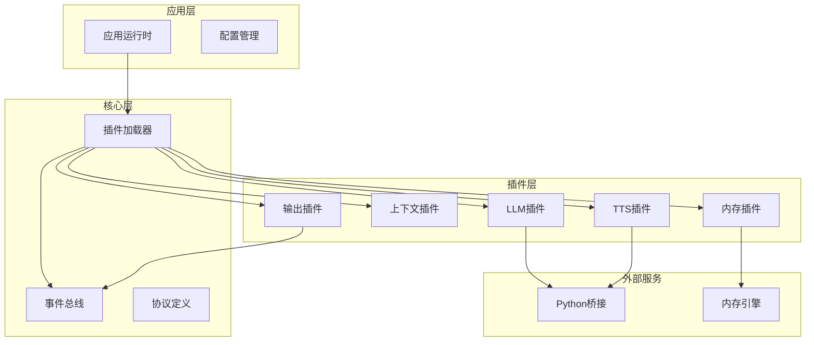

**图表来源**
- [runtime.lua:543-665](file://mori_runtime/lua/mori/app/runtime.lua#L543-L665)
- [plugin.lua:13-48](file://mori_runtime/lua/mori/core/plugin.lua#L13-L48)

**章节来源**
- [runtime.lua:1-668](file://mori_runtime/lua/mori/app/runtime.lua#L1-L668)
- [plugin.lua:1-52](file://mori_runtime/lua/mori/core/plugin.lua#L1-L52)

## 核心组件

### 插件加载器 (Plugin Loader)

插件加载器是整个插件系统的核心组件，负责插件的发现、验证和初始化。

**主要功能特性：**
- 插件发现：通过require动态加载指定名称的插件模块
- 插件验证：确保插件符合必需的接口规范
- 生命周期管理：触发插件生命周期事件
- 错误处理：提供完善的错误捕获和报告机制

**加载流程：**

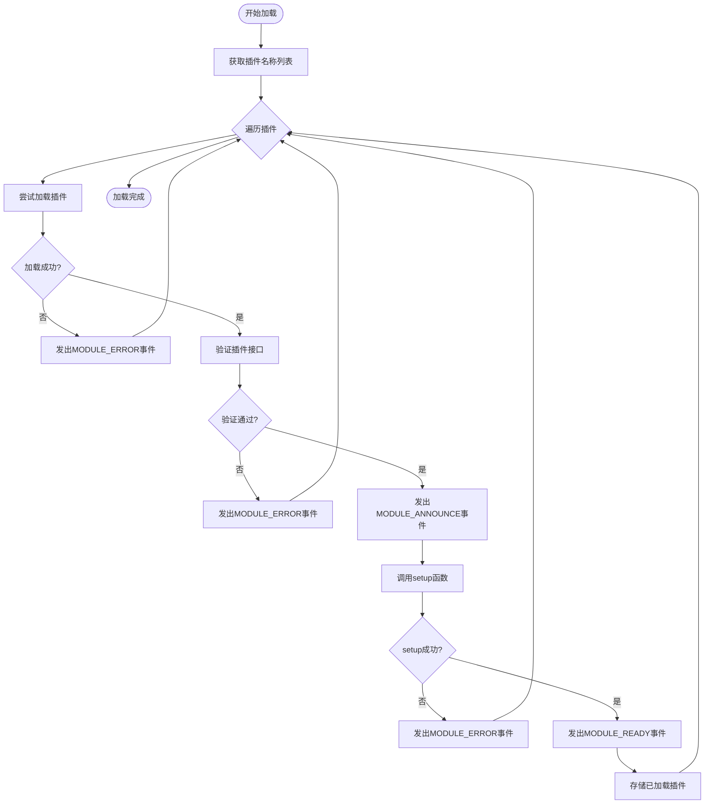

**图表来源**
- [plugin.lua:13-48](file://mori_runtime/lua/mori/core/plugin.lua#L13-L48)

**章节来源**
- [plugin.lua:13-48](file://mori_runtime/lua/mori/core/plugin.lua#L13-L48)

### 事件总线 (Event Bus)

事件总线实现了发布-订阅模式的消息传递机制，是插件间通信的核心基础设施。

**核心特性：**
- 事件注册：支持按事件类型注册处理器
- 事件分发：将事件广播给所有注册的处理器
- 错误隔离：处理器异常不会影响其他处理器
- 同步调用：支持call方法获取第一个非空返回值

**事件处理流程：**

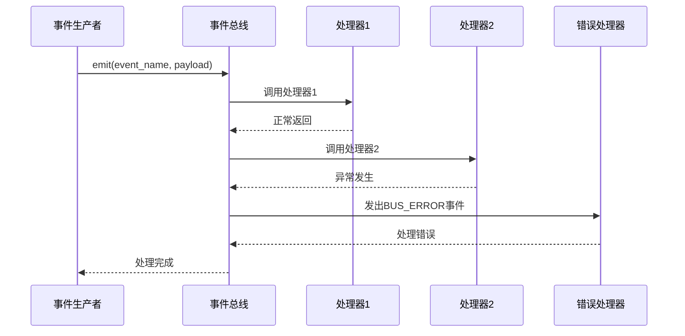

**图表来源**
- [bus.lua:50-91](file://mori_runtime/lua/mori/core/bus.lua#L50-L91)

**章节来源**
- [bus.lua:14-95](file://mori_runtime/lua/mori/core/bus.lua#L14-L95)

### 协议定义 (Protocol)

协议定义文件集中管理所有事件类型的常量，确保系统各部分使用一致的事件标识符。

**核心事件类型：**
- 模块生命周期事件：MODULE_ANNOUNCE、MODULE_READY、MODULE_ERROR
- 输入输出事件：INPUT_TEXT、OUTPUT_SUBTITLE、OUTPUT_EVENT、OUTPUT_PRINT
- 内存管理事件：MEMORY_COMPILE_CONTEXT、MEMORY_INGEST_TURN、MEMORY_SHUTDOWN
- 语音合成事件：TTS_SUBMIT、TTS_DRAIN、TTS_CANCEL_INTENT、TTS_RESULT
- 对话流程事件：SPEECH_INTENT_START、SPEECH_INTENT_CANCEL、SPEECH_INTENT_END

**章节来源**
- [protocol.lua:3-32](file://mori_runtime/lua/mori/core/protocol.lua#L3-L32)

## 架构概览

Mori插件系统的整体架构采用分层设计，从上到下分别为应用层、核心层和插件层。

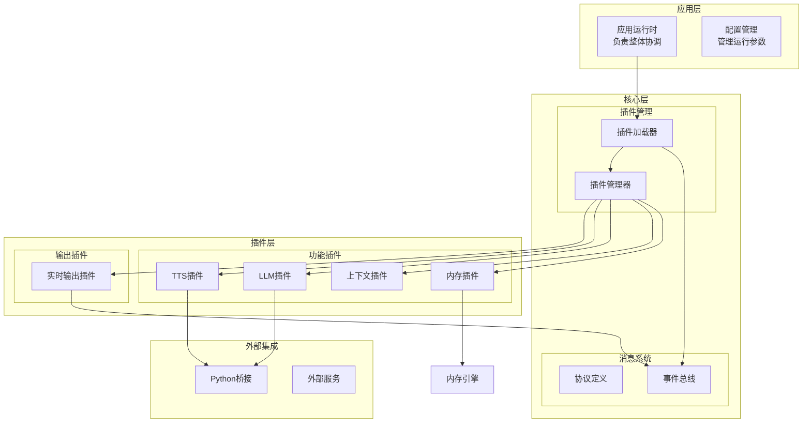

**图表来源**
- [runtime.lua:543-563](file://mori_runtime/lua/mori/app/runtime.lua#L543-L563)
- [plugin.lua:13-48](file://mori_runtime/lua/mori/core/plugin.lua#L13-L48)

## 详细组件分析

### 插件接口规范

每个插件必须遵循统一的接口规范，确保系统的一致性和可维护性。

**必需接口：**
- `setup(bus, ctx)`：插件初始化函数，负责注册事件处理器和建立与其他组件的连接

**可选元数据：**
- `id`：插件唯一标识符，默认使用模块名称
- `version`：插件版本信息，默认为空字符串

**接口实现示例：**

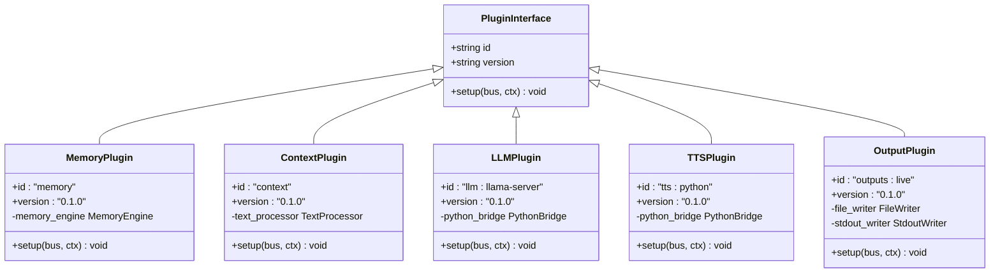

**图表来源**
- [memory.lua:3-6](file://mori_runtime/lua/mori/plugins/memory.lua#L3-L6)
- [context.lua:3-6](file://mori_runtime/lua/mori/plugins/context.lua#L3-L6)
- [llm_llama_server.lua:3-6](file://mori_runtime/lua/mori/plugins/llm_llama_server.lua#L3-L6)
- [tts_python.lua:3-6](file://mori_runtime/lua/mori/plugins/tts_python.lua#L3-L6)
- [live_outputs.lua:4-7](file://mori_runtime/lua/mori/plugins/live_outputs.lua#L4-L7)

**章节来源**
- [memory.lua:3-6](file://mori_runtime/lua/mori/plugins/memory.lua#L3-L6)
- [context.lua:3-6](file://mori_runtime/lua/mori/plugins/context.lua#L3-L6)
- [llm_llama_server.lua:3-6](file://mori_runtime/lua/mori/plugins/llm_llama_server.lua#L3-L6)
- [tts_python.lua:3-6](file://mori_runtime/lua/mori/plugins/tts_python.lua#L3-L6)
- [live_outputs.lua:4-7](file://mori_runtime/lua/mori/plugins/live_outputs.lua#L4-L7)

### 插件生命周期管理

插件生命周期通过三个核心事件进行管理：MODULE_ANNOUNCE、MODULE_READY、MODULE_ERROR。

**生命周期流程：**

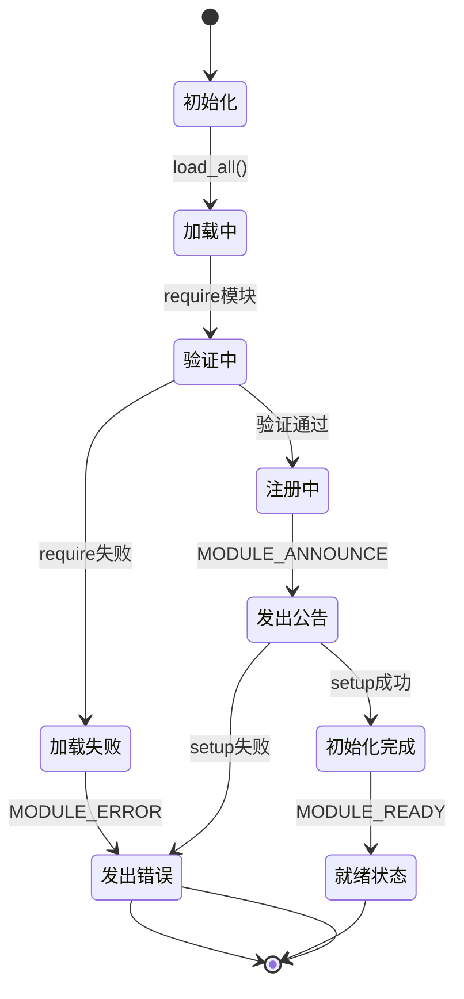

**图表来源**
- [plugin.lua:13-48](file://mori_runtime/lua/mori/core/plugin.lua#L13-L48)

**生命周期事件详解：**

1. **MODULE_ANNOUNCE (模块公告)**：插件被成功加载后触发，用于通知系统插件的存在和版本信息
2. **MODULE_READY (模块就绪)**：插件setup函数成功执行后触发，表示插件已准备好处理业务逻辑
3. **MODULE_ERROR (模块错误)**：在加载或初始化过程中发生任何错误时触发，提供详细的错误信息

**章节来源**
- [plugin.lua:18-42](file://mori_runtime/lua/mori/core/plugin.lua#L18-L42)
- [protocol.lua:6-8](file://mori_runtime/lua/mori/core/protocol.lua#L6-L8)

### 插件与消息总线的交互

插件通过消息总线实现松耦合的事件驱动通信。

**事件交互模式：**

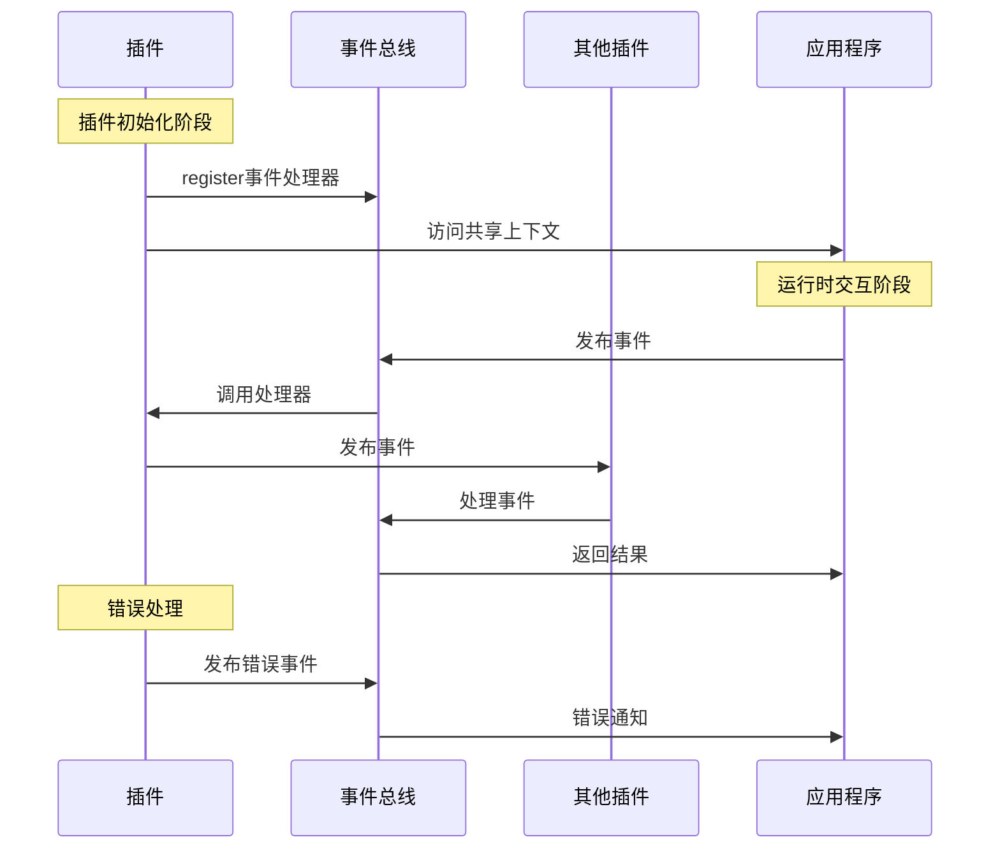

**图表来源**
- [bus.lua:21-91](file://mori_runtime/lua/mori/core/bus.lua#L21-L91)
- [runtime.lua:548-563](file://mori_runtime/lua/mori/app/runtime.lua#L548-L563)

**事件处理机制：**

1. **事件注册**：插件通过`bus:on(event_name, handler)`注册事件处理器
2. **事件发布**：使用`bus:emit(event_name, payload)`发布事件
3. **同步调用**：使用`bus:call(event_name, payload)`获取处理器返回值
4. **错误传播**：处理器异常自动转换为BUS_ERROR事件

**章节来源**
- [bus.lua:21-91](file://mori_runtime/lua/mori/core/bus.lua#L21-L91)

### 核心插件实现

#### 内存插件 (Memory Plugin)

内存插件负责管理对话历史和上下文信息的持久化。

**核心功能：**
- 上下文编译：将用户输入和历史对话转换为LLM可理解的格式
- 记忆注入：将新的对话回合添加到记忆库
- 系统关闭：优雅地清理内存资源

**工作流程：**

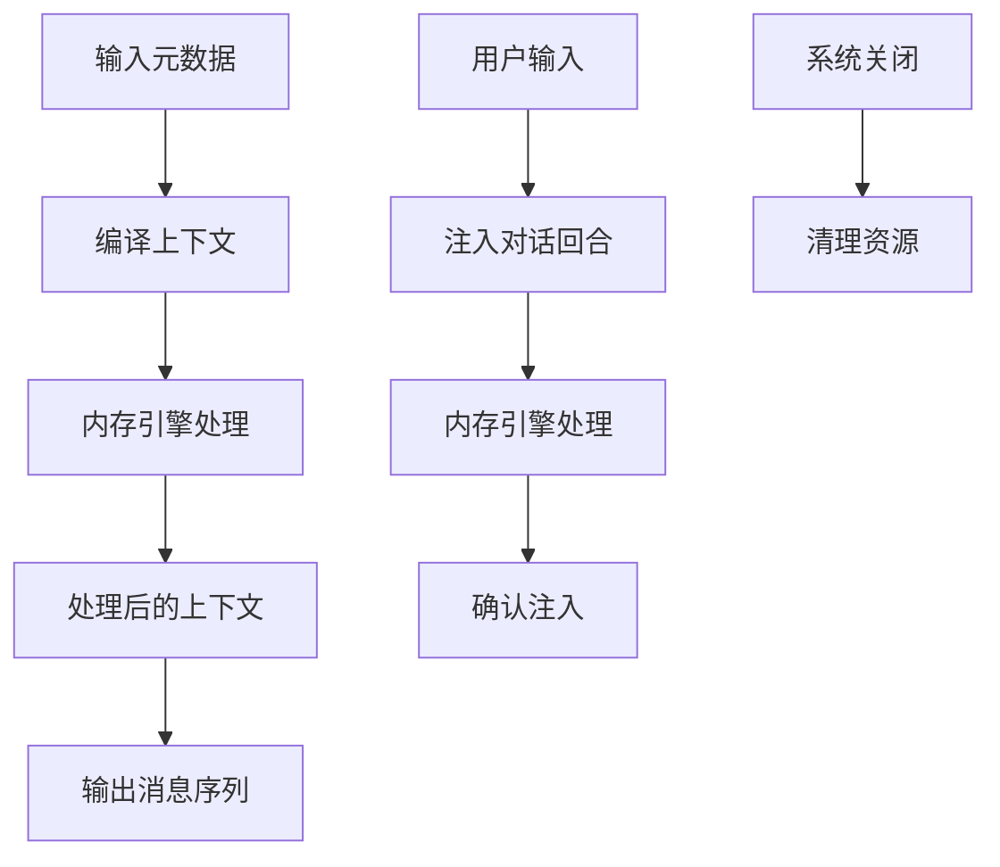

**图表来源**
- [memory.lua:8-26](file://mori_runtime/lua/mori/plugins/memory.lua#L8-L26)

**章节来源**
- [memory.lua:1-30](file://mori_runtime/lua/mori/plugins/memory.lua#L1-L30)

#### 上下文插件 (Context Plugin)

上下文插件负责构建适合LLM使用的对话上下文。

**核心功能：**
- 文本预处理：清理和标准化用户输入
- 上下文组装：将多个信息源组合成统一的上下文
- 系统提示管理：动态调整系统提示词

**处理流程：**

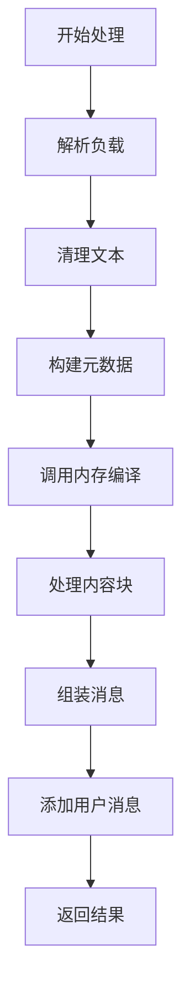

**图表来源**
- [context.lua:30-86](file://mori_runtime/lua/mori/plugins/context.lua#L30-L86)

**章节来源**
- [context.lua:1-90](file://mori_runtime/lua/mori/plugins/context.lua#L1-L90)

#### 实时输出插件 (Live Outputs Plugin)

实时输出插件负责将处理结果以多种格式输出。

**核心功能：**
- 字幕输出：将生成的文本保存为字幕文件
- 控制台输出：向标准输出打印实时信息
- 事件日志：记录系统运行事件到JSONL文件

**输出处理：**

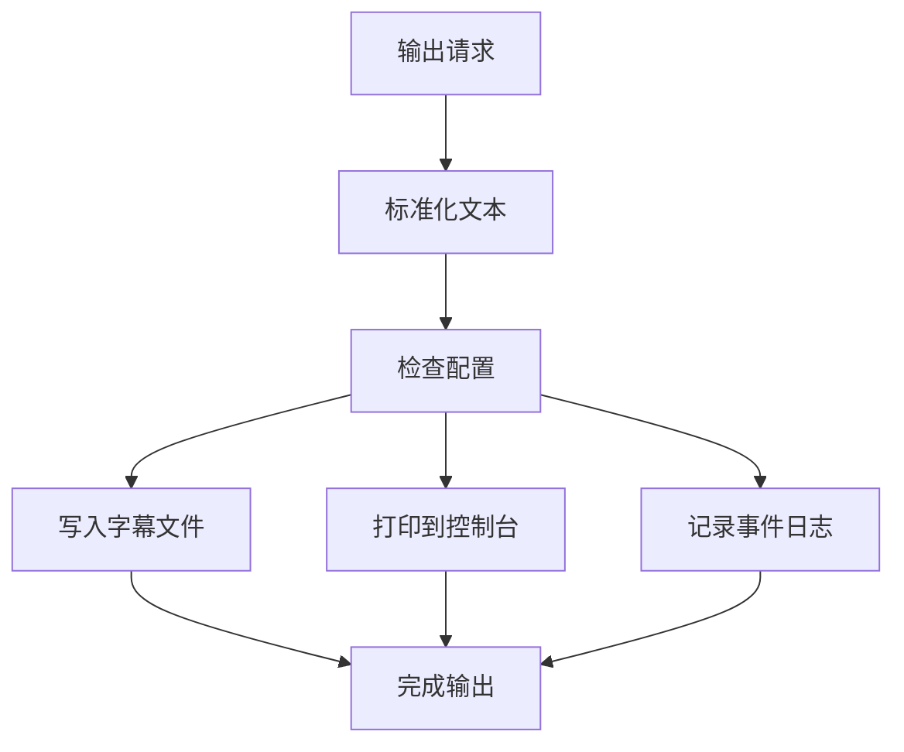

**图表来源**
- [live_outputs.lua:63-111](file://mori_runtime/lua/mori/plugins/live_outputs.lua#L63-L111)

**章节来源**
- [live_outputs.lua:1-114](file://mori_runtime/lua/mori/plugins/live_outputs.lua#L1-L114)

## 依赖关系分析

插件系统内部的依赖关系呈现清晰的层次结构。

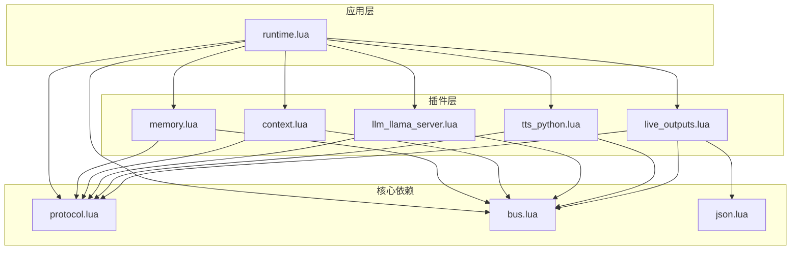

**图表来源**
- [runtime.lua:1-3](file://mori_runtime/lua/mori/app/runtime.lua#L1-L3)
- [memory.lua:1](file://mori_runtime/lua/mori/plugins/memory.lua#L1)
- [context.lua:1](file://mori_runtime/lua/mori/plugins/context.lua#L1)
- [llm_llama_server.lua:1](file://mori_runtime/lua/mori/plugins/llm_llama_server.lua#L1)
- [tts_python.lua:1](file://mori_runtime/lua/mori/plugins/tts_python.lua#L1)
- [live_outputs.lua:1](file://mori_runtime/lua/mori/plugins/live_outputs.lua#L1)
- [json.lua:1](file://mori_runtime/lua/mori/core/json.lua#L1)

**依赖特点：**
- **单向依赖**：插件依赖核心模块，但核心模块不依赖插件
- **接口隔离**：通过协议文件定义清晰的接口契约
- **松耦合**：插件间通过事件总线通信，避免直接依赖

**章节来源**
- [runtime.lua:1-6](file://mori_runtime/lua/mori/app/runtime.lua#L1-L6)

## 性能考虑

### 异步处理优化

插件系统采用异步事件驱动模式，有效避免了阻塞操作：

1. **非阻塞I/O**：文件操作和网络请求采用异步方式
2. **事件队列**：消息通过事件总线排队处理
3. **批处理机制**：批量处理多个事件以提高效率

### 内存管理

- **垃圾回收友好**：避免创建大量临时对象
- **资源池**：复用连接和缓冲区
- **及时清理**：在插件卸载时释放占用的资源

### 错误恢复

- **容错设计**：单个插件故障不影响其他插件
- **重试机制**：关键操作具备自动重试能力
- **降级策略**：在资源不足时提供基础功能

## 故障排除指南

### 常见问题诊断

**插件加载失败：**
1. 检查插件模块路径是否正确
2. 验证插件是否导出setup函数
3. 确认插件依赖的外部库已安装

**事件处理异常：**
1. 查看BUS_ERROR事件的具体错误信息
2. 检查处理器函数的参数类型
3. 验证事件负载的结构完整性

**内存泄漏排查：**
1. 监控插件实例的数量变化
2. 检查是否有未释放的资源引用
3. 确认插件在关闭时正确清理

**章节来源**
- [bus.lua:58-67](file://mori_runtime/lua/mori/core/bus.lua#L58-L67)
- [plugin.lua:18-38](file://mori_runtime/lua/mori/core/plugin.lua#L18-L38)

### 调试技巧

1. **启用详细日志**：通过BUS_ERROR事件获取完整的错误堆栈
2. **单元测试**：为每个插件编写独立的测试用例
3. **性能监控**：使用计时器测量插件处理时间
4. **内存分析**：定期检查内存使用情况

## 结论

Mori项目的插件核心架构展现了优秀的软件工程实践：

- **模块化设计**：清晰的职责分离和接口定义
- **事件驱动**：灵活的消息传递机制
- **容错性强**：完善的错误处理和恢复机制
- **扩展性好**：易于添加新功能插件

该架构为构建复杂的AI应用提供了坚实的基础，通过插件化设计实现了功能的模块化和可扩展性。

## 附录

### 开发模板

**基础插件模板：**
```lua
-- my_plugin.lua
local protocol = require("mori.core.protocol")

local M = {
    id = "my:plugin",
    version = "1.0.0",
}

function M.setup(bus, ctx)
    -- 注册事件处理器
    bus:on(protocol.events.SOME_EVENT, function(payload)
        -- 处理逻辑
    end)
    
    -- 访问共享资源
    local shared_resource = ctx.shared_resource
end

return M
```

**最佳实践清单：**
1. 始终实现必需的setup函数
2. 提供有意义的id和version信息
3. 使用事件总线进行插件间通信
4. 实现适当的错误处理和日志记录
5. 在插件关闭时清理资源
6. 遵循单一职责原则
7. 编写充分的单元测试

### 配置示例

**插件配置：**
```lua
{
    plugins = {
        "mori.plugins.memory",
        "mori.plugins.context", 
        "mori.plugins.llm_llama_server",
        "mori.plugins.tts_python",
        "mori.plugins.live_outputs"
    }
}
```