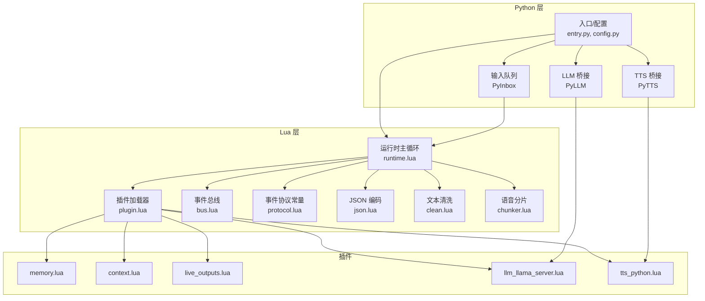
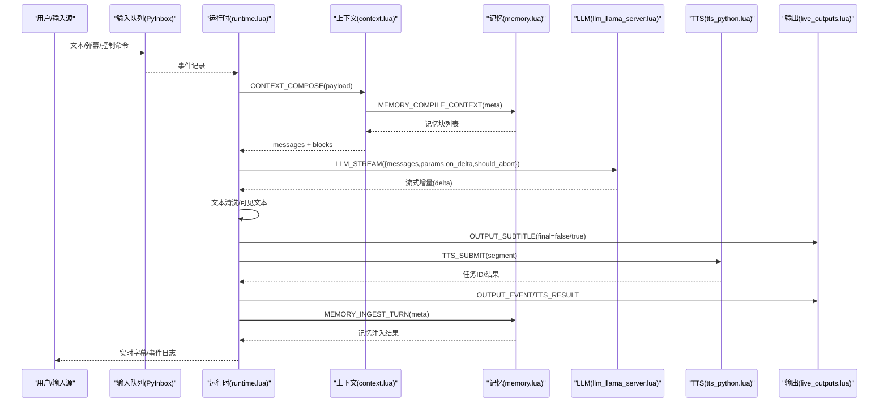
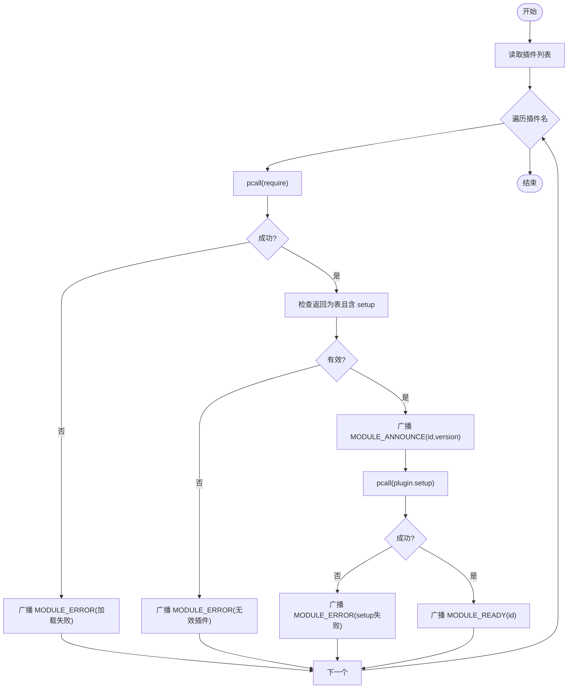
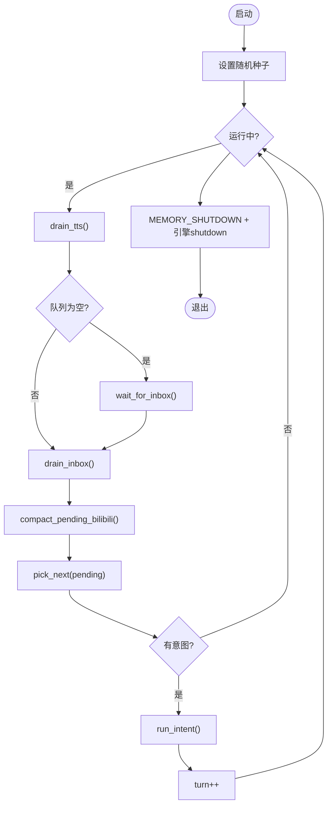
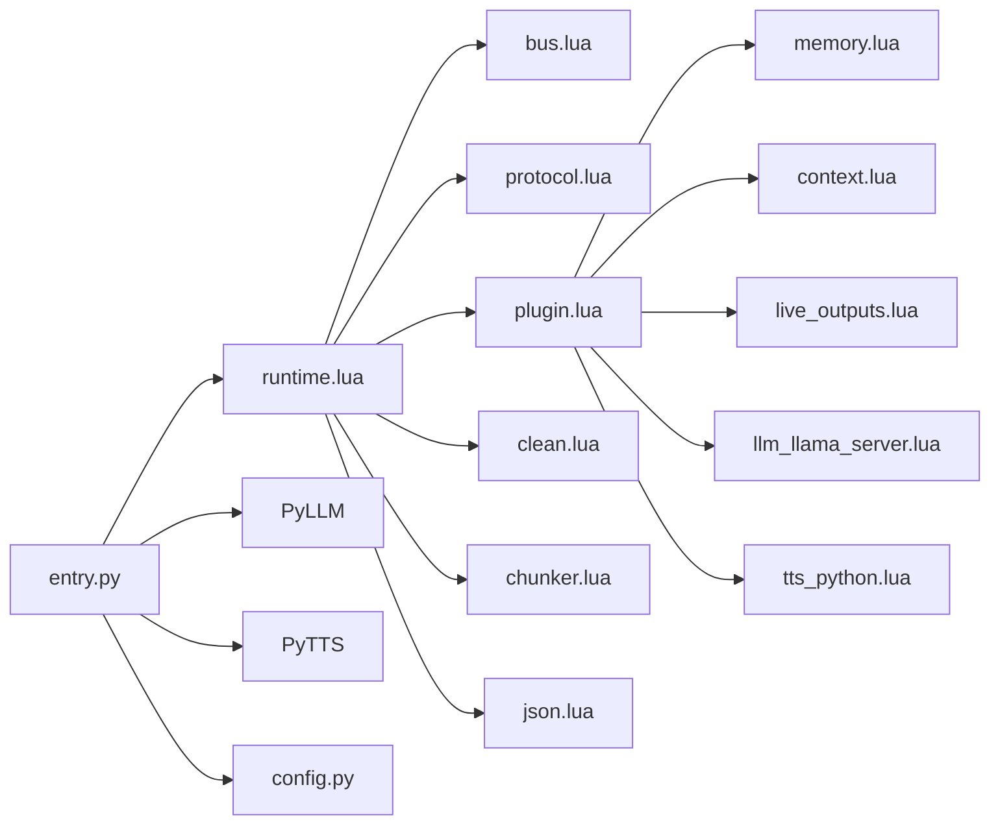

# 插件管理系统

<cite>
**本文引用的文件**
- [plugin.lua](file://mori_runtime/lua/mori/core/plugin.lua)
- [bus.lua](file://mori_runtime/lua/mori/core/bus.lua)
- [protocol.lua](file://mori_runtime/lua/mori/core/protocol.lua)
- [runtime.lua](file://mori_runtime/lua/mori/app/runtime.lua)
- [memory.lua](file://mori_runtime/lua/mori/plugins/memory.lua)
- [context.lua](file://mori_runtime/lua/mori/plugins/context.lua)
- [live_outputs.lua](file://mori_runtime/lua/mori/plugins/live_outputs.lua)
- [llm_llama_server.lua](file://mori_runtime/lua/mori/plugins/llm_llama_server.lua)
- [tts_python.lua](file://mori_runtime/lua/mori/plugins/tts_python.lua)
- [json.lua](file://mori_runtime/lua/mori/core/json.lua)
- [clean.lua](file://mori_runtime/lua/mori/text/clean.lua)
- [chunker.lua](file://mori_runtime/lua/mori/speech/chunker.lua)
- [config.py](file://mori_runtime/config.py)
- [entry.py](file://mori_runtime/entry.py)
- [tts_backends.py](file://mori_runtime/tts_backends.py)
</cite>

## 目录
1. [简介](#简介)
2. [项目结构](#项目结构)
3. [核心组件](#核心组件)
4. [架构总览](#架构总览)
5. [详细组件分析](#详细组件分析)
6. [依赖关系分析](#依赖关系分析)
7. [性能考量](#性能考量)
8. [故障排查指南](#故障排查指南)
9. [结论](#结论)
10. [附录](#附录)

## 简介
本文件系统性梳理了基于 Lua 运行时的插件化 AI 助手系统，涵盖插件加载机制、生命周期管理、事件协议与插件间通信、配置管理与动态加载、以及插件开发指南与扩展实践。重点解析以下内置插件：memory（记忆）、context（上下文）、live_outputs（实时输出）、llm_llama_server（LLM 推理）、tts_python（语音合成）。同时给出架构图、流程图与最佳实践，帮助开发者快速上手与扩展。

## 项目结构
系统采用“Python 主进程桥接 + Lua 运行时 + 插件模块”的分层架构：
- Python 层负责模型/引擎初始化、输入队列、TTS 后端、命令行与配置解析。
- Lua 层负责运行时调度、事件总线、插件加载与生命周期管理、文本清洗与分片、实时输出。
- 插件通过统一事件协议进行解耦协作，形成松耦合的模块化体系。

图表来源
- [runtime.lua:543-665](file://mori_runtime/lua/mori/app/runtime.lua#L543-L665)
- [plugin.lua:13-48](file://mori_runtime/lua/mori/core/plugin.lua#L13-L48)
- [bus.lua:14-91](file://mori_runtime/lua/mori/core/bus.lua#L14-L91)
- [protocol.lua:3-32](file://mori_runtime/lua/mori/core/protocol.lua#L3-L32)
- [entry.py:796-1084](file://mori_runtime/entry.py#L796-L1084)
- [config.py:188-270](file://mori_runtime/config.py#L188-L270)

章节来源
- [runtime.lua:543-665](file://mori_runtime/lua/mori/app/runtime.lua#L543-L665)
- [plugin.lua:13-48](file://mori_runtime/lua/mori/core/plugin.lua#L13-L48)
- [bus.lua:14-91](file://mori_runtime/lua/mori/core/bus.lua#L14-L91)
- [protocol.lua:3-32](file://mori_runtime/lua/mori/core/protocol.lua#L3-L32)
- [entry.py:796-1084](file://mori_runtime/entry.py#L796-L1084)
- [config.py:188-270](file://mori_runtime/config.py#L188-L270)

## 核心组件
- 事件总线与协议
  - 事件总线提供订阅/发布能力，支持 emit/call 两种模式，异常安全处理与 BUS_ERROR 回退。
  - 协议定义了模块生命周期事件（MODULE_ANNOUNCE/READY/ERROR）与业务事件（INPUT_TEXT、CONTEXT_COMPOSE、MEMORY_*、SPEECH_*、LLM_STREAM、TTS_*、OUTPUT_*）。
- 插件加载器
  - 负责按名称加载 Lua 插件模块，校验插件表结构与 setup 函数，广播模块声明与就绪事件。
- 运行时主循环
  - 组织输入、上下文构建、LLM 流式生成、TTS 提交与分片、记忆注入与输出事件，贯穿完整对话回合。
- 文本清洗与分片
  - 去除推理标记、保留可见文本；按标点与长度切分语音段落。
- JSON 编码
  - 安全稳定的 JSON 编码器，保证事件日志一致性。

章节来源
- [bus.lua:14-91](file://mori_runtime/lua/mori/core/bus.lua#L14-L91)
- [protocol.lua:3-32](file://mori_runtime/lua/mori/core/protocol.lua#L3-L32)
- [plugin.lua:13-48](file://mori_runtime/lua/mori/core/plugin.lua#L13-L48)
- [runtime.lua:303-541](file://mori_runtime/lua/mori/app/runtime.lua#L303-L541)
- [clean.lua:16-46](file://mori_runtime/lua/mori/text/clean.lua#L16-L46)
- [chunker.lua:56-153](file://mori_runtime/lua/mori/speech/chunker.lua#L56-L153)
- [json.lua:34-86](file://mori_runtime/lua/mori/core/json.lua#L34-L86)

## 架构总览
下图展示从输入到输出的端到端流程，以及插件间如何通过事件协议协作。

图表来源
- [runtime.lua:333-541](file://mori_runtime/lua/mori/app/runtime.lua#L333-L541)
- [context.lua:30-87](file://mori_runtime/lua/mori/plugins/context.lua#L30-L87)
- [memory.lua:8-26](file://mori_runtime/lua/mori/plugins/memory.lua#L8-L26)
- [llm_llama_server.lua:8-21](file://mori_runtime/lua/mori/plugins/llm_llama_server.lua#L8-L21)
- [tts_python.lua:8-28](file://mori_runtime/lua/mori/plugins/tts_python.lua#L8-L28)
- [live_outputs.lua:63-111](file://mori_runtime/lua/mori/plugins/live_outputs.lua#L63-L111)

## 详细组件分析

### 插件加载与生命周期
- 加载流程
  - 读取配置中的插件列表，逐个 require 插件模块。
  - 校验插件返回值为表且包含 setup 函数，否则广播 MODULE_ERROR。
  - 广播 MODULE_ANNOUNCE → 执行 setup → 成功后广播 MODULE_READY。
- 生命周期事件
  - 模块错误：MODULE_ERROR（包含模块名与错误信息）。
  - 就绪通知：MODULE_READY（包含模块 id/version）。
- 错误处理
  - 使用 pcall 包裹 require/setup，避免单模块失败影响整体。

图表来源
- [plugin.lua:13-48](file://mori_runtime/lua/mori/core/plugin.lua#L13-L48)

章节来源
- [plugin.lua:13-48](file://mori_runtime/lua/mori/core/plugin.lua#L13-L48)

### 事件总线与协议
- 总线特性
  - on/off 注册/注销处理器。
  - emit 广播事件，call 返回首个非空响应。
  - 异常捕获并转发至 BUS_ERROR。
- 协议事件
  - 模块生命周期：MODULE_ANNOUNCE、MODULE_READY、MODULE_ERROR。
  - 输入与上下文：INPUT_TEXT、CONTEXT_COMPOSE。
  - 记忆：MEMORY_COMPILE_CONTEXT、MEMORY_INGEST_TURN、MEMORY_SHUTDOWN。
  - 语音意图：SPEECH_INTENT_START/CANCEL/END。
  - LLM：LLM_STREAM。
  - TTS：TTS_SUBMIT、TTS_DRAIN、TTS_CANCEL_INTENT、TTS_RESULT。
  - 输出：OUTPUT_SUBTITLE、OUTPUT_EVENT、OUTPUT_PRINT。

章节来源
- [bus.lua:21-91](file://mori_runtime/lua/mori/core/bus.lua#L21-L91)
- [protocol.lua:3-32](file://mori_runtime/lua/mori/core/protocol.lua#L3-L32)

### 上下文插件（context）
- 职责
  - 将用户输入与系统提示拼装为 messages，合并记忆块生成最终上下文。
  - 支持可选 max_selected_turns、查询向量等参数透传给记忆编译。
- 关键行为
  - 从 bus:call(MEMORY_COMPILE_CONTEXT, meta) 获取记忆块。
  - 将 system_parts 合并为首条 system 消息，其余块映射为 user/assistant 消息。
  - 最终返回 messages 与 blocks。

章节来源
- [context.lua:30-87](file://mori_runtime/lua/mori/plugins/context.lua#L30-L87)

### 记忆插件（memory）
- 职责
  - 对外暴露 compile_context/ingest_turn/shutdown 接口。
  - 通过 bus:call/MEMORY_COMPILE_CONTEXT/MEMORY_INGEST_TURN 与运行时交互。
- 集成点
  - 在 setup 中注册事件处理器，将请求委托给底层内存模块。

章节来源
- [memory.lua:8-26](file://mori_runtime/lua/mori/plugins/memory.lua#L8-L26)

### 实时输出插件（live_outputs）
- 职责
  - 处理 OUTPUT_SUBTITLE、OUTPUT_PRINT、OUTPUT_EVENT 三类事件。
  - 可选写入字幕文件、事件日志文件，或打印到标准输出。
- 文本规范化
  - 清洗 Markdown/引用/多余空白，保留最终可读文本。
- 文件写入
  - 初始化时清空目标文件；事件到达时追加 JSON 行或覆盖字幕。

章节来源
- [live_outputs.lua:63-111](file://mori_runtime/lua/mori/plugins/live_outputs.lua#L63-L111)
- [json.lua:34-86](file://mori_runtime/lua/mori/core/json.lua#L34-L86)

### LLM 插件（llm_llama_server）
- 职责
  - 作为 LLM_STREAM 的调用方，将 messages/params/on_delta/should_abort 交给 Python 桥接。
- 依赖
  - ctx.py_llm 必须存在，否则抛出错误。

章节来源
- [llm_llama_server.lua:8-21](file://mori_runtime/lua/mori/plugins/llm_llama_server.lua#L8-L21)
- [runtime.lua:449-466](file://mori_runtime/lua/mori/app/runtime.lua#L449-L466)

### TTS 插件（tts_python）
- 职责
  - 提交语音合成任务（TTS_SUBMIT），拉取已完成结果（TTS_DRAIN），取消意图（TTS_CANCEL_INTENT）。
- 依赖
  - ctx.py_tts 必须存在，否则抛出错误。
- 结果回传
  - 通过 bus:emit(OUTPUT_EVENT) 发布 TTS 结果元数据，供运行时打印与后续处理。

章节来源
- [tts_python.lua:8-28](file://mori_runtime/lua/mori/plugins/tts_python.lua#L8-L28)
- [runtime.lua:222-280](file://mori_runtime/lua/mori/app/runtime.lua#L222-L280)

### 运行时主循环（runtime）
- 输入与调度
  - 从 Python 桥接的 Inbox 拉取事件，支持阻塞/非阻塞获取。
  - bilibili 场景下对消息队列进行去重与优先级策略。
- 对话回合
  - 构建系统提示与用户输入，调用 CONTEXT_COMPOSE 获取 messages。
  - LLM_STREAM 流式增量回调中进行文本清洗、可见文本提取、分片与 TTS 提交。
  - TTS_DRAIN 拉取完成结果，发布事件并打印摘要。
  - 结束时调用 MEMORY_INGEST_TURN 注入本轮对话。
- 生命周期收尾
  - 广播 MEMORY_SHUTDOWN，关闭 LLM/TTS 引擎。

图表来源
- [runtime.lua:571-665](file://mori_runtime/lua/mori/app/runtime.lua#L571-L665)

章节来源
- [runtime.lua:543-665](file://mori_runtime/lua/mori/app/runtime.lua#L543-L665)

### 文本清洗与分片
- 文本清洗
  - 去除<think>...标记与不完整片段，移除结尾标记，保留可见文本。
- 分片策略
  - 基于中英文标点与软/硬断点，结合最小/最大字符阈值，UTF-8 安全切分。
  - 首段 boost 策略提升首句连贯性。

章节来源
- [clean.lua:16-46](file://mori_runtime/lua/mori/text/clean.lua#L16-L46)
- [chunker.lua:56-153](file://mori_runtime/lua/mori/speech/chunker.lua#L56-L153)

### 配置管理与动态加载
- Python 配置
  - 支持统一 JSON 配置文件，自动解析路径、键映射与默认值。
  - CLI 参数与不同入口模式（cli/vtuber/love2d/inochi）的键集合。
- Lua 插件列表
  - 默认加载顺序：memory、context、llm_llama_server、tts_python、live_outputs。
  - 可通过配置覆盖插件列表，实现动态启用/禁用与顺序调整。
- 热重载建议
  - 当前实现未提供原生热重载；可通过重启运行时触发重新加载插件列表。

章节来源
- [config.py:188-270](file://mori_runtime/config.py#L188-L270)
- [runtime.lua:556-563](file://mori_runtime/lua/mori/app/runtime.lua#L556-L563)

## 依赖关系分析
- 运行时依赖
  - 依赖 bus/protocol/plugin 提供事件与插件框架。
  - 依赖 clean/chunker/json 提供文本处理与序列化。
- 插件依赖
  - memory/context/live_outputs 为纯 Lua 插件，依赖协议事件。
  - llm_llama_server/tts_python 依赖 Python 桥接对象（ctx.py_llm/ctx.py_tts）。
- Python 侧依赖
  - LLM 桥接（PyLLM）与 TTS 桥接（PyTTS）分别对接推理管线与语音合成后端。
  - 配置解析（config.py）与入口（entry.py）负责参数与资源准备。

图表来源
- [runtime.lua:1-668](file://mori_runtime/lua/mori/app/runtime.lua#L1-L668)
- [plugin.lua:1-52](file://mori_runtime/lua/mori/core/plugin.lua#L1-L52)
- [bus.lua:1-95](file://mori_runtime/lua/mori/core/bus.lua#L1-L95)
- [protocol.lua:1-35](file://mori_runtime/lua/mori/core/protocol.lua#L1-L35)
- [entry.py:796-1084](file://mori_runtime/entry.py#L796-L1084)
- [config.py:188-270](file://mori_runtime/config.py#L188-L270)

章节来源
- [runtime.lua:1-668](file://mori_runtime/lua/mori/app/runtime.lua#L1-L668)
- [plugin.lua:1-52](file://mori_runtime/lua/mori/core/plugin.lua#L1-L52)
- [bus.lua:1-95](file://mori_runtime/lua/mori/core/bus.lua#L1-L95)
- [protocol.lua:1-35](file://mori_runtime/lua/mori/core/protocol.lua#L1-L35)
- [entry.py:796-1084](file://mori_runtime/entry.py#L796-L1084)
- [config.py:188-270](file://mori_runtime/config.py#L188-L270)

## 性能考量
- 流式处理
  - LLM 以流式增量返回，边生成边清洗、分片与提交 TTS，降低端到端延迟。
- 队列与中断
  - Inbox 采用有界队列，溢出丢弃旧项；支持优先级与“是否打断”策略，避免长文本阻塞。
- TTS 并发
  - PyTTS 使用线程池并发合成，drain 拉取已完成任务，减少等待时间。
- 文本处理
  - UTF-8 安全迭代与固定阈值切分，避免截断导致的语音质量下降。
- I/O
  - 输出插件支持文件与标准输出，建议在高吞吐场景仅启用必要输出，避免磁盘瓶颈。

## 故障排查指南
- 插件加载失败
  - 现象：广播 MODULE_ERROR(require_failed/invalid_plugin/setup_failed)。
  - 排查：确认插件模块路径正确、返回表包含 setup 函数、setup 内部无致命错误。
- LLM/TTS 未初始化
  - 现象：llm_llama_server/tts_python 抛出缺失 ctx.py_llm/py_tts。
  - 排查：确保 Python 入口已构造对应桥接对象并注入 ctx。
- 事件处理异常
  - 现象：BUS_ERROR 广播。
  - 排查：检查事件处理器内部异常，确保 pcall 包裹与错误信息可诊断。
- 输出异常
  - 现象：字幕/事件日志写入失败。
  - 排查：检查文件路径权限与磁盘空间；确认配置中路径为绝对或相对 repo 根解析后的路径。

章节来源
- [plugin.lua:17-45](file://mori_runtime/lua/mori/core/plugin.lua#L17-L45)
- [bus.lua:50-91](file://mori_runtime/lua/mori/core/bus.lua#L50-L91)
- [llm_llama_server.lua:9-11](file://mori_runtime/lua/mori/plugins/llm_llama_server.lua#L9-L11)
- [tts_python.lua:9-11](file://mori_runtime/lua/mori/plugins/tts_python.lua#L9-L11)
- [live_outputs.lua:43-61](file://mori_runtime/lua/mori/plugins/live_outputs.lua#L43-L61)

## 结论
该插件系统以事件驱动为核心，通过统一协议与总线实现模块解耦，结合 Python 桥接与 Lua 运行时，形成可扩展、可观测、可维护的 AI 助手运行框架。内置 memory/context/llm/tts/live_outputs 插件覆盖典型对话链路，具备良好的可测试性与可演进性。建议在生产环境关注 I/O 与并发配置、事件日志与错误监控，并遵循插件接口规范进行扩展。

## 附录

### 插件开发指南
- 接口规范
  - 插件需导出表，包含 id/version 字段与 setup(bus, ctx) 函数。
  - setup 中通过 bus:on 订阅协议事件，通过 bus:emit 或 bus:call 与其他插件交互。
- 最佳实践
  - 使用 bus:call 获取上游结果，避免强耦合；对异常进行 pcall 包裹。
  - 事件负载尽量轻量化，复杂逻辑放入后台任务或异步队列。
  - 输出插件仅在需要时启用，避免磁盘写入成为瓶颈。
- 调试技巧
  - 利用 BUS_ERROR 与 MODULE_ERROR 事件定位问题。
  - 通过 OUTPUT_EVENT 记录关键中间态，便于回放与分析。
  - 使用最小化配置快速验证插件功能。

章节来源
- [plugin.lua:13-48](file://mori_runtime/lua/mori/core/plugin.lua#L13-L48)
- [bus.lua:21-91](file://mori_runtime/lua/mori/core/bus.lua#L21-L91)
- [protocol.lua:3-32](file://mori_runtime/lua/mori/core/protocol.lua#L3-L32)

### 实际使用示例与扩展案例
- 示例一：启用/禁用 TTS
  - 在运行时中输入 /tts on/off/toggle 控制 TTS 开关，运行时根据配置与引擎可用性反馈。
- 示例二：自定义上下文
  - 通过 CONTEXT_COMPOSE 的 payload 传入 max_selected_turns/query_vec，驱动记忆选择策略。
- 示例三：扩展输出
  - 新增输出插件订阅 OUTPUT_SUBTITLE/OUTPUT_EVENT，实现自定义渲染或上报。
- 示例四：替换 LLM 后端
  - 保持 LLM_STREAM 事件不变，仅替换 llm_llama_server 插件实现，或新增替代插件并调整插件列表。

章节来源
- [runtime.lua:608-638](file://mori_runtime/lua/mori/app/runtime.lua#L608-L638)
- [context.lua:30-54](file://mori_runtime/lua/mori/plugins/context.lua#L30-L54)
- [live_outputs.lua:80-111](file://mori_runtime/lua/mori/plugins/live_outputs.lua#L80-L111)
- [llm_llama_server.lua:8-21](file://mori_runtime/lua/mori/plugins/llm_llama_server.lua#L8-L21)