# 记忆插件

<cite>
**本文档引用的文件**
- [mori_memory/__init__.py](file://mori_memory/__init__.py)
- [mori_memory/mori_memory.lua](file://mori_memory/mori_memory.lua)
- [mori_memory/module/evidence/evidence_store.lua](file://mori_memory/module/evidence/evidence_store.lua)
- [mori_memory/module/persistence.lua](file://mori_memory/module/persistence.lua)
- [mori_memory/module/state_coordinator.lua](file://mori_memory/module/state_coordinator.lua)
- [mori_memory/module/config.lua](file://mori_memory/module/config.lua)
- [mori_memory/module/memory/topic.lua](file://mori_memory/module/memory/topic.lua)
- [mori_memory/module/memory/history.lua](file://mori_memory/module/memory/history.lua)
- [mori_memory/module/memory/exact_state.lua](file://mori_memory/module/memory/exact_state.lua)
- [mori_memory/module/memory/task_state.lua](file://mori_memory/module/memory/task_state.lua)
- [mori_memory/module/tool.lua](file://mori_memory/module/tool.lua)
- [mori_runtime/lua/mori/plugins/memory.lua](file://mori_runtime/lua/mori/plugins/memory.lua)
</cite>

## 目录
1. [简介](#简介)
2. [项目结构](#项目结构)
3. [核心组件](#核心组件)
4. [架构总览](#架构总览)
5. [详细组件分析](#详细组件分析)
6. [依赖关系分析](#依赖关系分析)
7. [性能考虑](#性能考虑)
8. [故障排除指南](#故障排除指南)
9. [结论](#结论)
10. [附录](#附录)

## 简介
本文件系统性阐述记忆插件的设计与实现，重点覆盖以下方面：
- 与 mori_memory 模块的集成方式与桥接路径
- 记忆数据的存储格式、访问接口与查询机制
- 如何处理主题记忆、历史记录、精确状态等不同类型的记忆
- 记忆插件与其他插件的协作关系与数据共享
- 配置项、缓存策略与索引机制
- 实际使用示例与常见问题排查

## 项目结构
记忆插件由 Lua 核心与 Python 桥接两部分组成：
- Python 桥接层：提供 mori_memory 的 Python 接口，便于与 Python 生态交互
- Lua 核心层：提供完整的记忆子系统，包括证据存储、主题记忆、历史记录、精确状态、任务状态、工具库与持久化

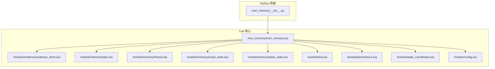

**图表来源**
- [mori_memory/__init__.py:1-3](file://mori_memory/__init__.py#L1-L3)
- [mori_memory/mori_memory.lua:1-3](file://mori_memory/mori_memory.lua#L1-L3)
- [mori_memory/module/evidence/evidence_store.lua:1-603](file://mori_memory/module/evidence/evidence_store.lua#L1-L603)
- [mori_memory/module/memory/topic.lua:1-800](file://mori_memory/module/memory/topic.lua#L1-L800)
- [mori_memory/module/memory/history.lua:1-195](file://mori_memory/module/memory/history.lua#L1-L195)
- [mori_memory/module/memory/exact_state.lua:1-800](file://mori_memory/module/memory/exact_state.lua#L1-L800)
- [mori_memory/module/memory/task_state.lua:1-305](file://mori_memory/module/memory/task_state.lua#L1-L305)
- [mori_memory/module/tool.lua:1-800](file://mori_memory/module/tool.lua#L1-L800)
- [mori_memory/module/persistence.lua:1-97](file://mori_memory/module/persistence.lua#L1-L97)
- [mori_memory/module/state_coordinator.lua:1-302](file://mori_memory/module/state_coordinator.lua#L1-L302)
- [mori_memory/module/config.lua:1-680](file://mori_memory/module/config.lua#L1-L680)

**章节来源**
- [mori_memory/__init__.py:1-3](file://mori_memory/__init__.py#L1-L3)
- [mori_memory/mori_memory.lua:1-3](file://mori_memory/mori_memory.lua#L1-L3)

## 核心组件
- 证据存储（Evidence Store）：统一管理 committed chunks、演员本地证据、范围聚合、趋势候选与主题投影
- 主题记忆（Topic）：基于向量的对话主题聚类与摘要，支持分级摘要与活跃话题管理
- 历史记录（History）：按轮次的对话文本持久化，支持转义/还原与快照校验
- 精确状态（Exact State）：结构化事实与符号索引，支持线程/提及/动机等精确检索
- 任务状态（Task State）：服务意图与槽位值的结构化存储与预览
- 工具库（Tool）：向量运算、SIMD 加速、序列化/反序列化、Lua 表解析等
- 持久化（Persistence）：原子写入与临时文件替换，保障写入一致性
- 状态协调器（State Coordinator）：版本向量、事务、快照与 WAL 协调，保证多模块一致性
- 配置中心（Config）：集中管理策略、阈值、窗口与行为参数

**章节来源**
- [mori_memory/module/evidence/evidence_store.lua:490-603](file://mori_memory/module/evidence/evidence_store.lua#L490-L603)
- [mori_memory/module/memory/topic.lua:43-60](file://mori_memory/module/memory/topic.lua#L43-L60)
- [mori_memory/module/memory/history.lua:1-195](file://mori_memory/module/memory/history.lua#L1-L195)
- [mori_memory/module/memory/exact_state.lua:1-800](file://mori_memory/module/memory/exact_state.lua#L1-L800)
- [mori_memory/module/memory/task_state.lua:1-305](file://mori_memory/module/memory/task_state.lua#L1-L305)
- [mori_memory/module/tool.lua:1-800](file://mori_memory/module/tool.lua#L1-L800)
- [mori_memory/module/persistence.lua:1-97](file://mori_memory/module/persistence.lua#L1-L97)
- [mori_memory/module/state_coordinator.lua:1-302](file://mori_memory/module/state_coordinator.lua#L1-L302)
- [mori_memory/module/config.lua:1-680](file://mori_memory/module/config.lua#L1-L680)

## 架构总览
记忆插件通过 LuaJIT 核心实现高性能的记忆管理，并通过 Python 桥接对外暴露接口。运行时通过消息总线与其它插件协作。

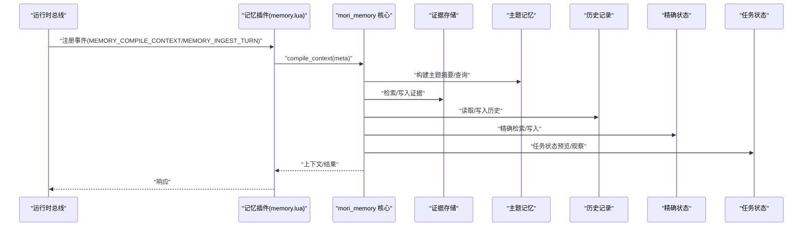

**图表来源**
- [mori_runtime/lua/mori/plugins/memory.lua:1-30](file://mori_runtime/lua/mori/plugins/memory.lua#L1-L30)
- [mori_memory/mori_memory.lua:1-3](file://mori_memory/mori_memory.lua#L1-L3)
- [mori_memory/module/evidence/evidence_store.lua:507-563](file://mori_memory/module/evidence/evidence_store.lua#L507-L563)
- [mori_memory/module/memory/topic.lua:488-794](file://mori_memory/module/memory/topic.lua#L488-L794)
- [mori_memory/module/memory/history.lua:67-192](file://mori_memory/module/memory/history.lua#L67-L192)
- [mori_memory/module/memory/exact_state.lua:521-800](file://mori_memory/module/memory/exact_state.lua#L521-L800)
- [mori_memory/module/memory/task_state.lua:227-302](file://mori_memory/module/memory/task_state.lua#L227-L302)

## 详细组件分析

### 证据存储（Evidence Store）
证据存储是记忆系统的核心枢纽，统一管理四类证据与投影：
- 已提交的记忆块（committed chunks）：按时间/演员/范围索引，支持条件检索与相关性排序
- 演员本地证据（actor-local）：按演员键维护最近证据，受上限控制
- 范围聚合（scope aggregate）：按作用域统计互动模式、主题分布与活动统计
- 趋势候选（trend candidates）：基于模式支持度与演员多样性计算置信度，支持清理与排序
- 主题投影（topic projection）：基于上下文与新鲜度计算相关性，带 TTL 缓存

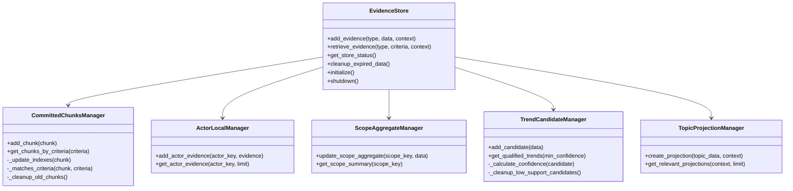

**图表来源**
- [mori_memory/module/evidence/evidence_store.lua:26-563](file://mori_memory/module/evidence/evidence_store.lua#L26-L563)

**章节来源**
- [mori_memory/module/evidence/evidence_store.lua:17-588](file://mori_memory/module/evidence/evidence_store.lua#L17-L588)

### 主题记忆（Topic）
主题记忆通过向量相似度与滑动窗口实现话题边界检测与摘要生成，支持分级摘要与活跃话题缓存：
- 话语对相似度：当前轮与上一轮向量的余弦相似度
- 头质心与尾窗口：分别用于话题开头稳定性与近期漂移检测
- 分割判定：同时满足“话语对断裂阈值”与“全局漂移兜底”，且最小长度约束
- 摘要生成：支持 full/slight/heavy/none 四级摘要，按需生成并缓存

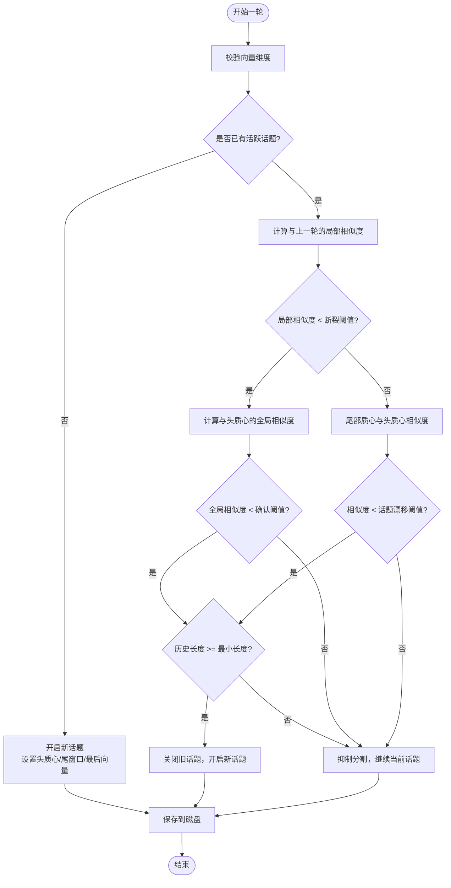

**图表来源**
- [mori_memory/module/memory/topic.lua:659-794](file://mori_memory/module/memory/topic.lua#L659-L794)

**章节来源**
- [mori_memory/module/memory/topic.lua:43-794](file://mori_memory/module/memory/topic.lua#L43-L794)

### 历史记录（History）
历史记录以固定分隔符编码的文本文件持久化，支持：
- 转义/还原：FIELD_SEP/RECORD_SEP 与转义字符
- 快照校验：V2/V3 头与 GEN= 代际标记
- 按轮次读取与文本解析

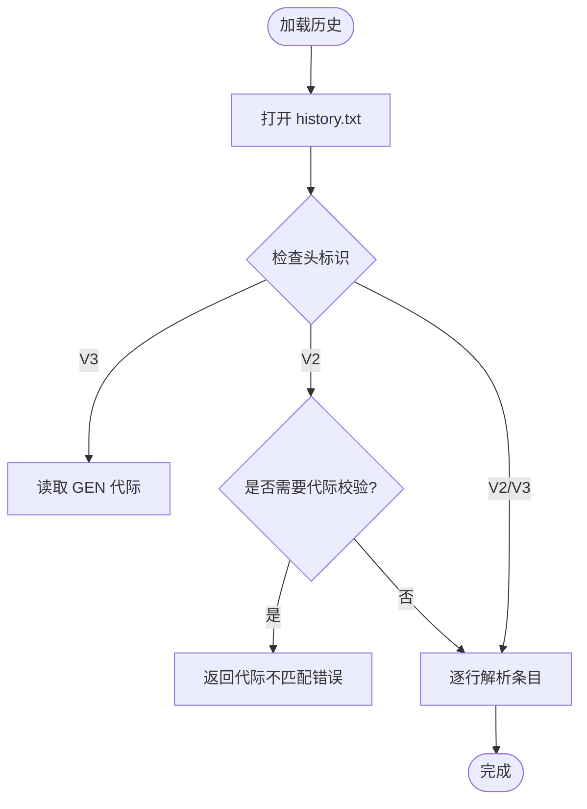

**图表来源**
- [mori_memory/module/memory/history.lua:67-115](file://mori_memory/module/memory/history.lua#L67-L115)

**章节来源**
- [mori_memory/module/memory/history.lua:1-195](file://mori_memory/module/memory/history.lua#L1-L195)

### 精确状态（Exact State）
精确状态以结构化事实与符号索引为核心，支持：
- 术语权重提取与硬词过滤
- 提及/动机/反应等特征提取
- 线程/符号图与后缀图构建
- 父节点提示与回复上下文

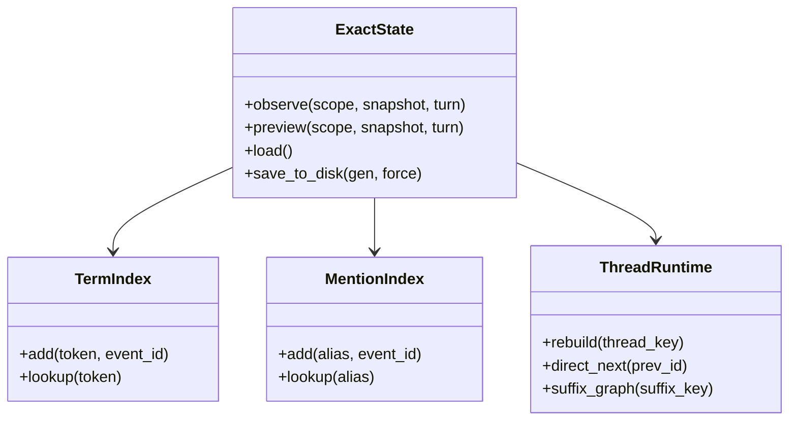

**图表来源**
- [mori_memory/module/memory/exact_state.lua:521-800](file://mori_memory/module/memory/exact_state.lua#L521-L800)

**章节来源**
- [mori_memory/module/memory/exact_state.lua:1-800](file://mori_memory/module/memory/exact_state.lua#L1-L800)

### 任务状态（Task State）
任务状态用于记录服务意图与槽位值，支持：
- 服务快照归一化与合并
- 作用域桶管理与去重排序
- 预览与观察接口

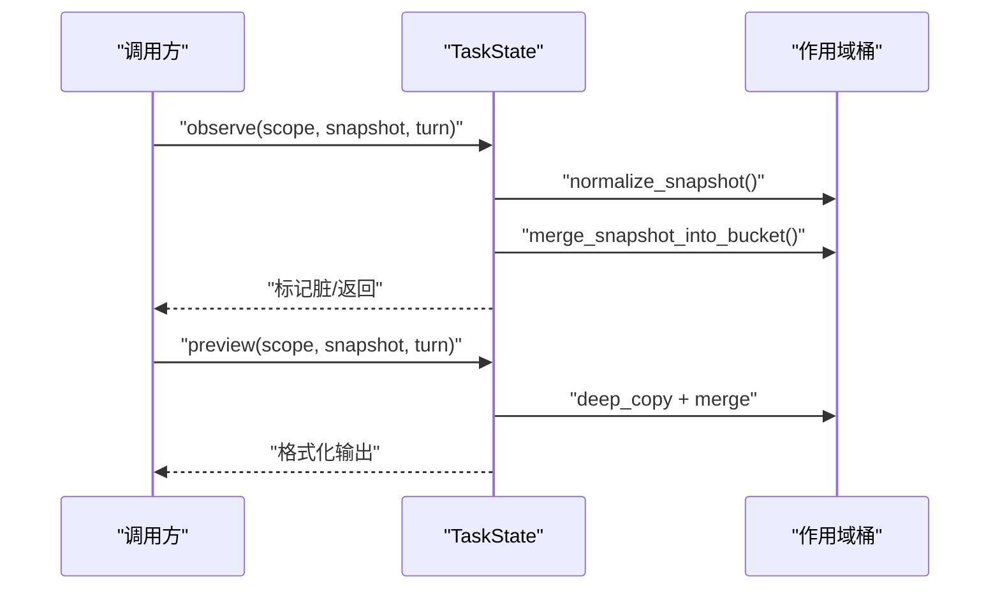

**图表来源**
- [mori_memory/module/memory/task_state.lua:227-302](file://mori_memory/module/memory/task_state.lua#L227-L302)

**章节来源**
- [mori_memory/module/memory/task_state.lua:1-305](file://mori_memory/module/memory/task_state.lua#L1-L305)

### 工具库（Tool）
工具库提供向量运算、SIMD 加速、序列化/反序列化与 Lua 表解析：
- 向量运算：平均值、点积、余弦相似度，支持 FFI 指针加速
- 序列化：float 数组二进制编解码，字符串形式存储
- 文本工具：去除思维过程标记、提取 Lua 表、UTF-8 清洗

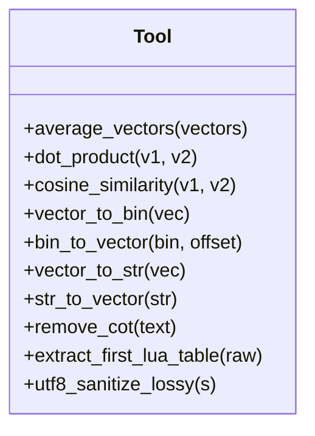

**图表来源**
- [mori_memory/module/tool.lua:503-764](file://mori_memory/module/tool.lua#L503-L764)

**章节来源**
- [mori_memory/module/tool.lua:1-800](file://mori_memory/module/tool.lua#L1-L800)

### 持久化（Persistence）
持久化模块提供原子写入与替换，确保写入一致性：
- 临时文件 + 原子替换：失败回滚，保障数据安全
- 写入回调封装：统一错误处理与关闭流程

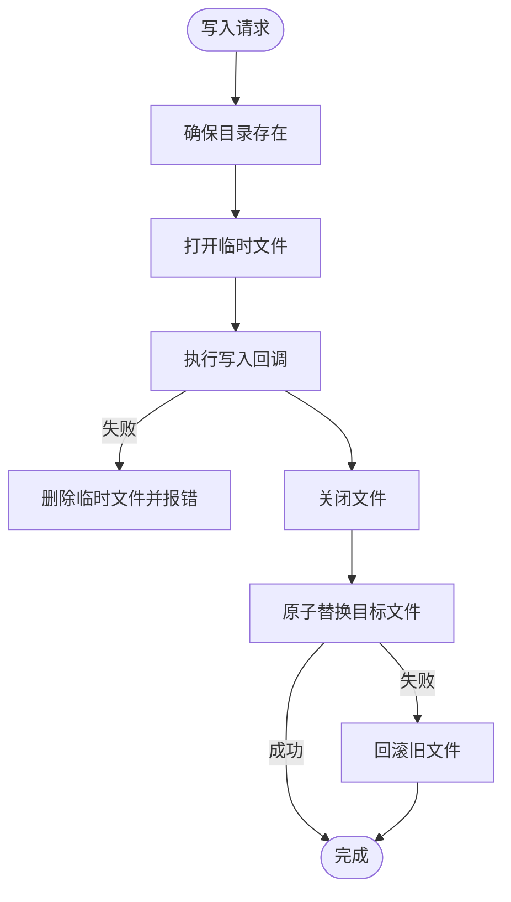

**图表来源**
- [mori_memory/module/persistence.lua:28-94](file://mori_memory/module/persistence.lua#L28-L94)

**章节来源**
- [mori_memory/module/persistence.lua:1-97](file://mori_memory/module/persistence.lua#L1-L97)

### 状态协调器（State Coordinator）
状态协调器通过版本向量与事务管理，确保多模块一致性：
- 版本向量：模块版本号与时间戳
- 事务：开始/提交/回滚，快照校验
- 检查点：原子快照与 WAL 记录
- 自动维护：周期性一致性检查

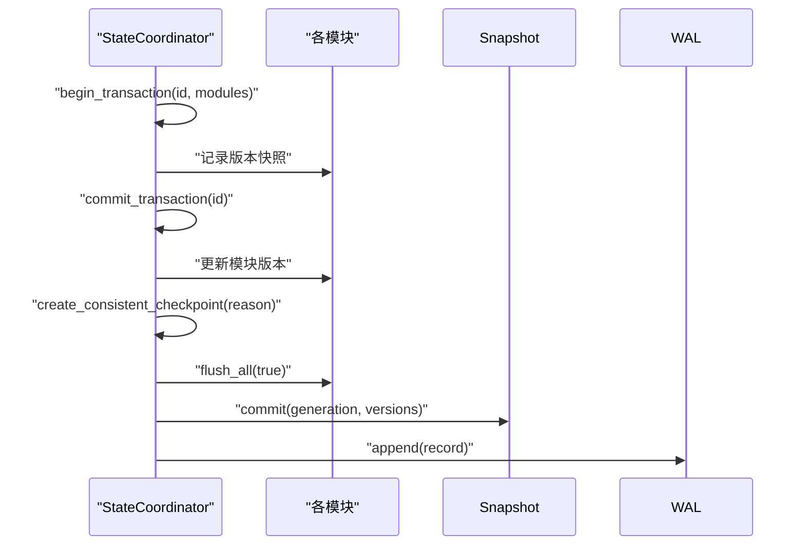

**图表来源**
- [mori_memory/module/state_coordinator.lua:75-207](file://mori_memory/module/state_coordinator.lua#L75-L207)

**章节来源**
- [mori_memory/module/state_coordinator.lua:1-302](file://mori_memory/module/state_coordinator.lua#L1-L302)

### 配置中心（Config）
配置中心集中管理策略、阈值、窗口与行为参数，支持：
- 默认设置与策略档案
- 路径解析与绝对/相对路径处理
- 深拷贝与合并

**章节来源**
- [mori_memory/module/config.lua:1-680](file://mori_memory/module/config.lua#L1-L680)

## 依赖关系分析
- Python 桥接层依赖 Lua 核心模块，通过 require("mori_memory.core") 暴露统一接口
- 运行时插件通过总线订阅事件，调用核心 compile_context/ingest_turn/shutdown
- 核心模块内部依赖工具库、持久化、配置与状态协调器
- 证据存储与主题/历史/精确/任务模块共同构成完整记忆体系

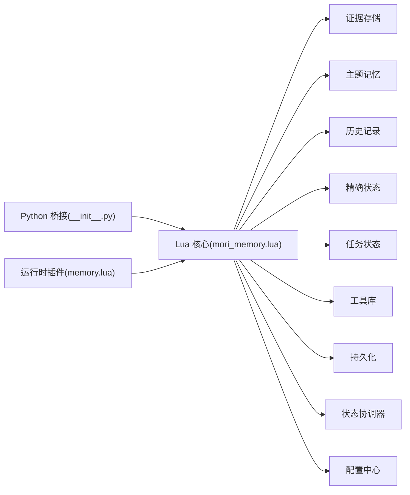

**图表来源**
- [mori_memory/__init__.py:1-3](file://mori_memory/__init__.py#L1-L3)
- [mori_memory/mori_memory.lua:1-3](file://mori_memory/mori_memory.lua#L1-L3)
- [mori_runtime/lua/mori/plugins/memory.lua:1-30](file://mori_runtime/lua/mori/plugins/memory.lua#L1-L30)

**章节来源**
- [mori_runtime/lua/mori/plugins/memory.lua:1-30](file://mori_runtime/lua/mori/plugins/memory.lua#L1-L30)

## 性能考虑
- 向量计算与相似度：优先使用 SIMD 加速（dot/cosine），在无可用库时回退纯 Lua 实现
- 索引与缓存：证据存储按时间/演员/范围建立索引；主题投影带 TTL 缓存；活跃话题向量缓存减少重复计算
- 写入一致性：原子写入与临时文件替换，避免部分写入导致的数据损坏
- 内存压力控制：精确状态与主题记忆的条目上限与窗口大小，结合自动 GC 触发策略
- I/O 优化：批量写入与快照代际校验，减少频繁 IO

[本节为通用指导，无需特定文件引用]

## 故障排除指南
- 历史文件头无效或代际不匹配：检查历史文件头标识与 GEN 代际是否与快照一致
  - 参考：[mori_memory/module/memory/history.lua:83-104](file://mori_memory/module/memory/history.lua#L83-L104)
- topic.bin 损坏或版本不兼容：加载时会跳过损坏记录并打印警告，必要时重建
  - 参考：[mori_memory/module/memory/topic.lua:373-464](file://mori_memory/module/memory/topic.lua#L373-L464)
- 写入失败或回滚：原子写入失败会回滚旧文件，检查权限与磁盘空间
  - 参考：[mori_memory/module/persistence.lua:28-94](file://mori_memory/module/persistence.lua#L28-L94)
- 版本不一致或快照异常：使用状态协调器的验证接口检查模块版本与 WAL 连续性
  - 参考：[mori_memory/module/state_coordinator.lua:210-258](file://mori_memory/module/state_coordinator.lua#L210-L258)
- 向量维度不匹配：在主题记忆与工具库中进行维度校验，确保输入向量符合预期
  - 参考：[mori_memory/module/tool.lua:160-170](file://mori_memory/module/tool.lua#L160-L170), [mori_memory/module/memory/topic.lua:663-666](file://mori_memory/module/memory/topic.lua#L663-L666)

**章节来源**
- [mori_memory/module/memory/history.lua:83-115](file://mori_memory/module/memory/history.lua#L83-L115)
- [mori_memory/module/memory/topic.lua:373-464](file://mori_memory/module/memory/topic.lua#L373-L464)
- [mori_memory/module/persistence.lua:28-94](file://mori_memory/module/persistence.lua#L28-L94)
- [mori_memory/module/state_coordinator.lua:210-258](file://mori_memory/module/state_coordinator.lua#L210-L258)
- [mori_memory/module/tool.lua:160-170](file://mori_memory/module/tool.lua#L160-L170)

## 结论
记忆插件通过 LuaJIT 核心实现了高性能、可扩展的记忆管理能力，涵盖证据存储、主题记忆、历史记录、精确状态与任务状态，并提供完善的持久化与一致性保障。其与运行时插件通过消息总线协作，形成统一的记忆编译与注入流程。通过合理的配置与缓存策略，可在实时性与准确性之间取得良好平衡。

[本节为总结性内容，无需特定文件引用]

## 附录

### 使用示例（步骤说明）
- 编译上下文
  - 运行时插件订阅 MEMORY_COMPILE_CONTEXT 事件，调用核心 compile_context 生成上下文
  - 参考：[mori_runtime/lua/mori/plugins/memory.lua:12-14](file://mori_runtime/lua/mori/plugins/memory.lua#L12-L14)
- 注入一轮对话
  - 运行时插件订阅 MEMORY_INGEST_TURN 事件，调用核心 ingest_turn 完成向量化与记忆写入
  - 参考：[mori_runtime/lua/mori/plugins/memory.lua:16-18](file://mori_runtime/lua/mori/plugins/memory.lua#L16-L18)
- 关闭与清理
  - 订阅 MEMORY_SHUTDOWN，调用核心 shutdown 进行资源清理
  - 参考：[mori_runtime/lua/mori/plugins/memory.lua:20-25](file://mori_runtime/lua/mori/plugins/memory.lua#L20-L25)

### 配置要点（节选）
- 主题记忆阈值与摘要策略
  - 参考：[mori_memory/module/config.lua:14-166](file://mori_memory/module/config.lua#L14-L166)
- 精确状态与线程/符号索引
  - 参考：[mori_memory/module/config.lua:87-110](file://mori_memory/module/config.lua#L87-L110), [mori_memory/module/memory/exact_state.lua:521-800](file://mori_memory/module/memory/exact_state.lua#L521-L800)
- 证据存储容量与清理
  - 参考：[mori_memory/module/config.lua:74-86](file://mori_memory/module/config.lua#L74-L86), [mori_memory/module/evidence/evidence_store.lua:34-54](file://mori_memory/module/evidence/evidence_store.lua#L34-L54)