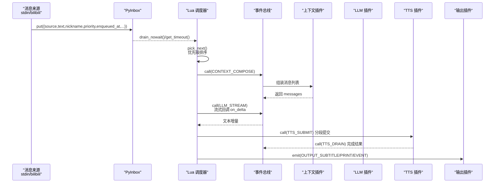
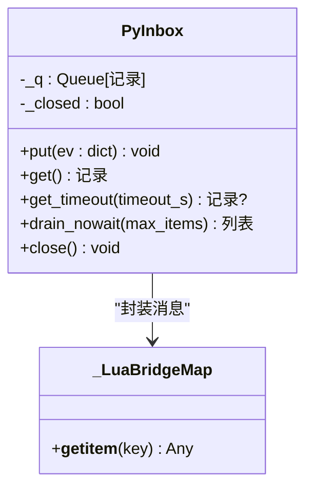
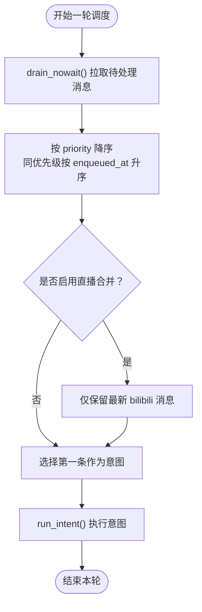
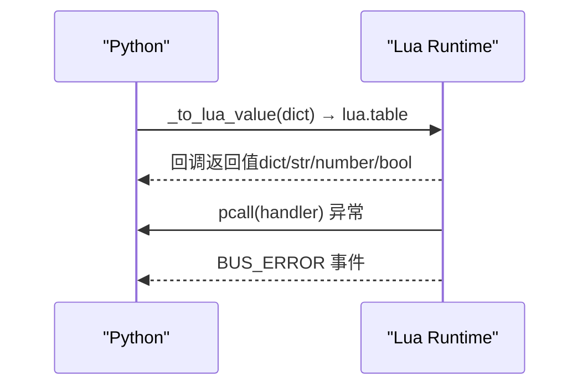
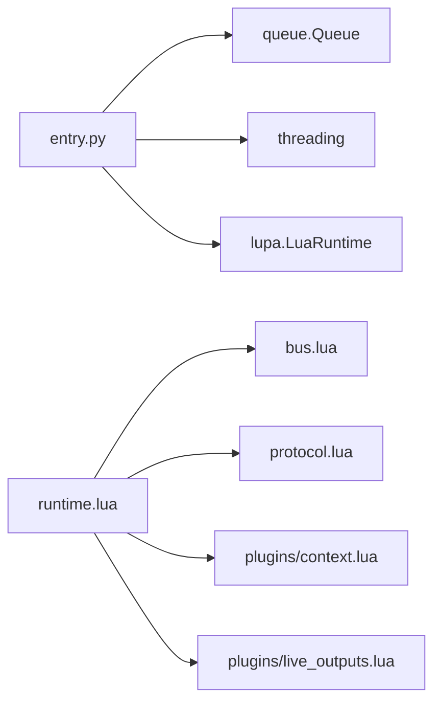

# 消息队列系统

<cite>
**本文引用的文件**
- [entry.py](file://mori_runtime/entry.py)
- [runtime.lua](file://mori_runtime/lua/mori/app/runtime.lua)
- [bus.lua](file://mori_runtime/lua/mori/core/bus.lua)
- [protocol.lua](file://mori_runtime/lua/mori/core/protocol.lua)
- [context.lua](file://mori_runtime/lua/mori/plugins/context.lua)
- [live_outputs.lua](file://mori_runtime/lua/mori/plugins/live_outputs.lua)
- [quadrants.lua](file://mori_memory/module/decision/quadrants.lua)
- [capture_bilibili_memory_live.py](file://scripts/capture_bilibili_memory_live.py)
</cite>

## 目录
1. [简介](#简介)
2. [项目结构](#项目结构)
3. [核心组件](#核心组件)
4. [架构总览](#架构总览)
5. [详细组件分析](#详细组件分析)
6. [依赖分析](#依赖分析)
7. [性能考虑](#性能考虑)
8. [故障排除指南](#故障排除指南)
9. [结论](#结论)
10. [附录](#附录)

## 简介
本文件面向消息队列系统，聚焦于 Python 侧的 PyInbox 类设计与实现，涵盖以下主题：
- 线程安全的消息队列模型与背压控制策略
- 优先级处理机制与批处理策略
- 消息格式规范与字段校验
- 与 Lua 运行时的消息桥接（数据转换、类型映射、错误处理）
- 实际使用示例（发送、接收、处理不同来源消息）
- 性能优化建议与故障排除

## 项目结构
消息队列系统由三层协作构成：
- Python 层：负责消息生产、入队、背压与关闭信号；提供与 Lua 的桥接对象。
- Lua 层：负责消息调度、优先级排序、批量合并、中断策略与输出。
- 内存/决策模块：提供路由与优先级权重，影响消息的后续处理。

```mermaid
graph TB
subgraph "Python 运行时"
PY_INBOX["PyInbox<br/>线程安全队列"]
PY_LLM["PyLLM"]
PY_TTS["PyTTS"]
end
subgraph "Lua 运行时"
RT["runtime.lua<br/>调度循环"]
BUS["bus.lua<br/>事件总线"]
PROTO["protocol.lua<br/>事件协议"]
PLG_CTX["plugins/context.lua<br/>上下文合成"]
PLG_OUT["plugins/live_outputs.lua<br/>输出插件"]
end
PY_INBOX <- --> RT
PY_LLM <- --> RT
PY_TTS <- --> RT
RT --> BUS
BUS --> PROTO
RT --> PLG_CTX
RT --> PLG_OUT
```

**图表来源**
- [entry.py:89-126](file://mori_runtime/entry.py#L89-L126)
- [runtime.lua:543-665](file://mori_runtime/lua/mori/app/runtime.lua#L543-L665)
- [bus.lua:1-95](file://mori_runtime/lua/mori/core/bus.lua#L1-L95)
- [protocol.lua:1-35](file://mori_runtime/lua/mori/core/protocol.lua#L1-L35)
- [context.lua:30-86](file://mori_runtime/lua/mori/plugins/context.lua#L30-L86)
- [live_outputs.lua:63-111](file://mori_runtime/lua/mori/plugins/live_outputs.lua#L63-L111)

**章节来源**
- [entry.py:89-126](file://mori_runtime/entry.py#L89-L126)
- [runtime.lua:543-665](file://mori_runtime/lua/mori/app/runtime.lua#L543-L665)

## 核心组件
- PyInbox：Python 侧消息入口，封装线程安全队列、背压控制与关闭信号。
- Lua 调度器：从 PyInbox 批量拉取消息，按优先级与时间戳排序，支持中断与批量合并。
- 事件总线与协议：统一事件命名空间，确保跨模块通信一致性。
- 上下文合成与输出插件：将消息转化为 LLM 输入并生成字幕/日志输出。

**章节来源**
- [entry.py:89-126](file://mori_runtime/entry.py#L89-L126)
- [runtime.lua:98-165](file://mori_runtime/lua/mori/app/runtime.lua#L98-L165)
- [bus.lua:14-91](file://mori_runtime/lua/mori/core/bus.lua#L14-L91)
- [protocol.lua:3-32](file://mori_runtime/lua/mori/core/protocol.lua#L3-L32)
- [context.lua:30-86](file://mori_runtime/lua/mori/plugins/context.lua#L30-L86)
- [live_outputs.lua:63-111](file://mori_runtime/lua/mori/plugins/live_outputs.lua#L63-L111)

## 架构总览
消息从来源进入 Python，经 PyInbox 入队；Lua 调度器周期性从队列拉取并排序，选择最高优先级意图执行；过程中通过事件总线分发到上下文合成、LLM 推理、TTS 合成与输出插件。



**图表来源**
- [entry.py:452-579](file://mori_runtime/entry.py#L452-L579)
- [runtime.lua:98-165](file://mori_runtime/lua/mori/app/runtime.lua#L98-L165)
- [runtime.lua:303-541](file://mori_runtime/lua/mori/app/runtime.lua#L303-L541)
- [bus.lua:50-91](file://mori_runtime/lua/mori/core/bus.lua#L50-L91)
- [protocol.lua:10-32](file://mori_runtime/lua/mori/core/protocol.lua#L10-L32)
- [context.lua:30-86](file://mori_runtime/lua/mori/plugins/context.lua#L30-L86)
- [live_outputs.lua:63-111](file://mori_runtime/lua/mori/plugins/live_outputs.lua#L63-L111)

## 详细组件分析

### PyInbox 设计与实现
- 线程安全：内部使用 Python 标准库队列，最大容量固定，避免内存无限增长。
- 背压控制：当队列满时，先尝试丢弃最旧元素，再重试入队，保证新消息不被完全丢弃。
- 关闭信号：close() 发送特殊系统消息，携带高优先级，确保调度器能及时退出。
- 批量拉取：drain_nowait() 支持一次性获取多个消息，降低调度开销。



**图表来源**
- [entry.py:54-62](file://mori_runtime/entry.py#L54-L62)
- [entry.py:89-144](file://mori_runtime/entry.py#L89-L144)

**章节来源**
- [entry.py:89-144](file://mori_runtime/entry.py#L89-L144)

### 消息格式规范
- 必填字段
  - source：消息来源标识（如 "stdin"、"bilibili"、"system"）
  - text：消息文本
  - priority：整数优先级，数值越大越优先
  - enqueued_at：入队时间戳（秒）
- 可选字段（按来源扩展）
  - stdin：nickname（空字符串）
  - bilibili：nickname、user_id、room_id、timeline
  - system：用于控制信号（如 "/exit"）

字段校验与默认值
- 优先级与时间戳会进行数值化处理，缺失时采用默认值。
- 来源字段标准化为字符串，避免类型不一致。

**章节来源**
- [entry.py:452-579](file://mori_runtime/entry.py#L452-L579)
- [runtime.lua:98-111](file://mori_runtime/lua/mori/app/runtime.lua#L98-L111)

### 优先级处理与批量策略
- 优先级排序：Lua 侧按 priority 降序，若相同则按 enqueued_at 升序（先进先出）。
- 批量拉取：每次最多拉取固定数量（例如 32），减少频繁阻塞。
- 直播消息合并：同一轮中仅保留最新一条 bilibili 消息，丢弃较早重复消息，降低抖动。



**图表来源**
- [runtime.lua:146-165](file://mori_runtime/lua/mori/app/runtime.lua#L146-L165)
- [runtime.lua:98-111](file://mori_runtime/lua/mori/app/runtime.lua#L98-L111)
- [runtime.lua:167-204](file://mori_runtime/lua/mori/app/runtime.lua#L167-L204)

**章节来源**
- [runtime.lua:98-111](file://mori_runtime/lua/mori/app/runtime.lua#L98-L111)
- [runtime.lua:146-165](file://mori_runtime/lua/mori/app/runtime.lua#L146-L165)
- [runtime.lua:167-204](file://mori_runtime/lua/mori/app/runtime.lua#L167-L204)

### 中断策略与背压控制
- 中断策略：根据配置决定是否允许更高优先级打断当前意图。
- 背压控制：Python 侧队列满时，先丢弃最旧消息再重试，避免阻塞生产者线程。
- 关闭流程：PyInbox.close() 发送系统消息，携带极高优先级，确保调度器尽快退出。

**章节来源**
- [runtime.lua:113-136](file://mori_runtime/lua/mori/app/runtime.lua#L113-L136)
- [entry.py:94-108](file://mori_runtime/entry.py#L94-L108)
- [entry.py:128-143](file://mori_runtime/entry.py#L128-L143)

### 与 Lua 运行时的消息桥接
- 数据转换
  - Python 字典 → Lua 表：递归将 dict/list/tuple 转换为 Lua table。
  - Lua 表 → Python：遍历键值，必要时转为字符串，避免类型不兼容。
- 类型映射
  - dict → lua.table_from
  - list/tuple → lua.table_from
  - 其他原样传递
- 错误处理
  - Lua 侧通过 pcall 包裹回调，捕获异常并通过 BUS_ERROR 事件上报。
  - Python 侧对 Lua 回调失败进行保护，避免阻塞流式输出。



**图表来源**
- [entry.py:441-449](file://mori_runtime/entry.py#L441-L449)
- [capture_bilibili_memory_live.py:241-282](file://scripts/capture_bilibili_memory_live.py#L241-L282)
- [bus.lua:50-91](file://mori_runtime/lua/mori/core/bus.lua#L50-L91)

**章节来源**
- [entry.py:441-449](file://mori_runtime/entry.py#L441-L449)
- [capture_bilibili_memory_live.py:241-282](file://scripts/capture_bilibili_memory_live.py#L241-L282)
- [bus.lua:50-91](file://mori_runtime/lua/mori/core/bus.lua#L50-L91)

### 消息路由与来源分类
- 来源分类
  - stdin：用户命令行输入，优先级较高（例如 100）。
  - bilibili：直播弹幕，包含昵称、用户 ID、房间号、时间线等。
  - system：系统控制信号，如退出指令。
- 路由与优先级
  - Lua 侧通过优先级排序与中断策略决定执行顺序。
  - 决策模块（如 quadrants.lua）提供维度权重与阈值调整，影响后续路由评分，但消息本身仍以 source/priority/enqueued_at 为准。

**章节来源**
- [entry.py:452-579](file://mori_runtime/entry.py#L452-L579)
- [runtime.lua:312-321](file://mori_runtime/lua/mori/app/runtime.lua#L312-L321)
- [quadrants.lua:91-177](file://mori_memory/module/decision/quadrants.lua#L91-L177)

### 使用示例
- 发送消息（Python）
  - 将消息字典传入 PyInbox.put()，包含 source、text、priority、enqueued_at 等字段。
  - bilibili 线程会自动构造消息并入队。
- 接收消息（Lua）
  - 通过 drain_nowait() 或 get_timeout() 获取消息，随后按优先级排序并选择意图。
- 处理消息
  - 上下文插件将消息组装为 LLM messages。
  - LLM 插件流式回调 on_delta，逐字更新字幕。
  - TTS 插件按分段提交语音合成任务。
  - 输出插件写入字幕文件与事件日志。

**章节来源**
- [entry.py:452-579](file://mori_runtime/entry.py#L452-L579)
- [runtime.lua:146-165](file://mori_runtime/lua/mori/app/runtime.lua#L146-L165)
- [runtime.lua:303-541](file://mori_runtime/lua/mori/app/runtime.lua#L303-L541)
- [context.lua:30-86](file://mori_runtime/lua/mori/plugins/context.lua#L30-L86)
- [live_outputs.lua:63-111](file://mori_runtime/lua/mori/plugins/live_outputs.lua#L63-L111)

## 依赖分析
- Python 侧依赖
  - queue：线程安全队列，实现背压与容量限制。
  - threading/time：后台线程读取 stdin 与 bilibili 流。
  - lupa：LuaJIT 运行时桥接。
- Lua 侧依赖
  - bus：事件总线，统一事件分发。
  - protocol：事件名常量，确保跨模块一致性。
  - 插件：context、live_outputs 等模块按协议注册处理器。



**图表来源**
- [entry.py:1-15](file://mori_runtime/entry.py#L1-L15)
- [runtime.lua:1-6](file://mori_runtime/lua/mori/app/runtime.lua#L1-L6)

**章节来源**
- [entry.py:1-15](file://mori_runtime/entry.py#L1-L15)
- [runtime.lua:1-6](file://mori_runtime/lua/mori/app/runtime.lua#L1-L6)

## 性能考虑
- 队列容量与背压
  - 固定最大容量避免内存膨胀；满时丢弃最旧消息再重试，平衡吞吐与延迟。
- 批量拉取
  - Lua 侧每轮最多拉取固定数量消息，减少阻塞与上下文切换。
- 优先级与中断
  - 高优先级消息可打断当前意图，降低关键路径延迟。
- 分段 TTS
  - 将长文本分段提交，提高并发度与响应速度。
- I/O 与日志
  - 输出插件异步写入文件，避免阻塞主调度循环。

[本节为通用性能建议，无需特定文件引用]

## 故障排除指南
- Lua 回调异常
  - 现象：事件处理抛错导致调度器中断。
  - 处理：检查 BUS_ERROR 事件输出，定位具体事件与处理器 ID。
- 队列积压
  - 现象：消息堆积，延迟增大。
  - 处理：检查生产速率与消费速率，适当降低优先级或增加批处理大小。
- bilibili 消息过多
  - 现象：直播弹幕密集导致抖动。
  - 处理：启用直播合并策略，仅保留最新弹幕。
- TTS 结果丢失
  - 现象：TTS 完成但未输出。
  - 处理：确认 TTS_DRAIN 事件是否触发，检查输出插件写入权限。

**章节来源**
- [bus.lua:50-91](file://mori_runtime/lua/mori/core/bus.lua#L50-L91)
- [runtime.lua:167-204](file://mori_runtime/lua/mori/app/runtime.lua#L167-L204)
- [live_outputs.lua:63-111](file://mori_runtime/lua/mori/plugins/live_outputs.lua#L63-L111)

## 结论
该消息队列系统通过 Python 的线程安全队列与 Lua 的事件驱动调度相结合，实现了高吞吐、可中断、可扩展的消息处理链路。PyInbox 提供稳定的入队与背压控制，Lua 调度器负责优先级排序与批量处理，事件总线确保模块间解耦。配合上下文合成与输出插件，系统能够高效处理来自不同来源的消息并生成高质量的交互体验。

[本节为总结性内容，无需特定文件引用]

## 附录

### 消息字段定义与校验清单
- 必填
  - source：字符串，来源标识
  - text：字符串，消息正文
  - priority：整数，数值越大越优先
  - enqueued_at：浮点数，Unix 时间戳
- 可选（按来源）
  - stdin：nickname（空字符串）
  - bilibili：nickname、user_id、room_id、timeline
  - system：控制信号（如 "/exit"）

**章节来源**
- [entry.py:452-579](file://mori_runtime/entry.py#L452-L579)
- [runtime.lua:98-111](file://mori_runtime/lua/mori/app/runtime.lua#L98-L111)