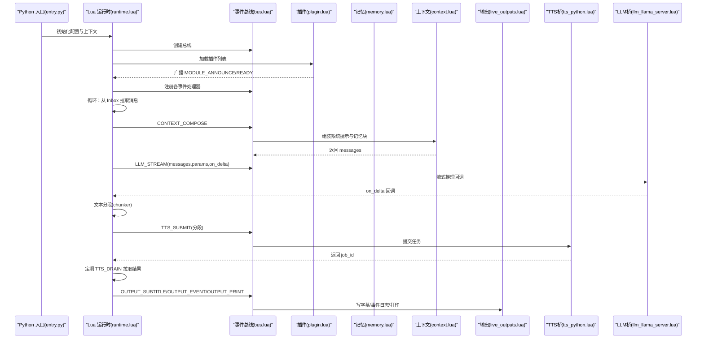
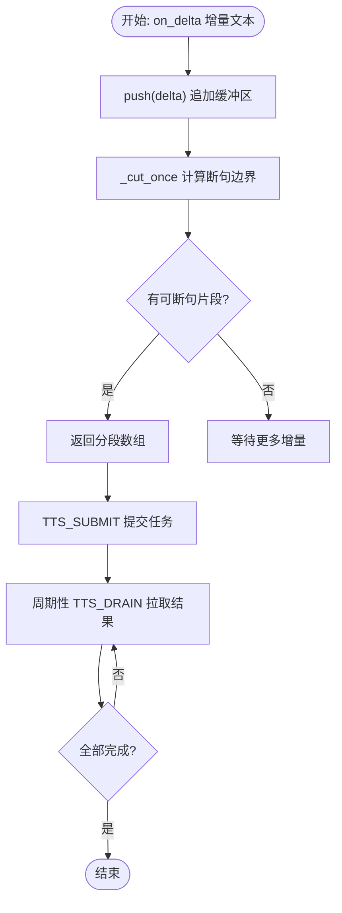
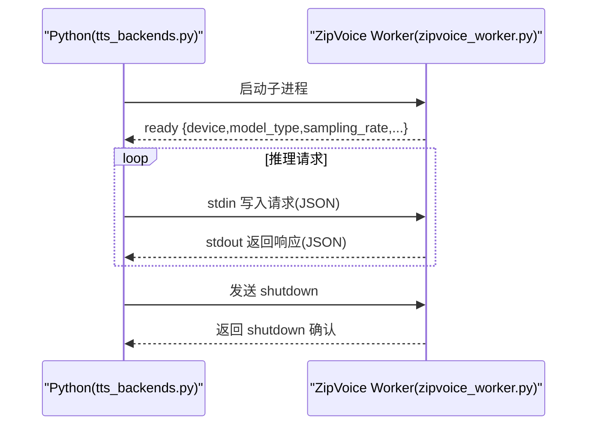
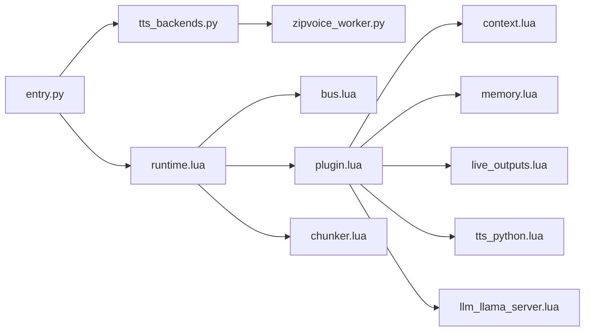

# 运行时系统 (mori_runtime)

<cite>
**本文引用的文件**
- [entry.py](file://mori_runtime/entry.py)
- [config.py](file://mori_runtime/config.py)
- [tts_backends.py](file://mori_runtime/tts_backends.py)
- [zipvoice_worker.py](file://mori_runtime/zipvoice_worker.py)
- [runtime.lua](file://mori_runtime/lua/mori/app/runtime.lua)
- [bus.lua](file://mori_runtime/lua/mori/core/bus.lua)
- [plugin.lua](file://mori_runtime/lua/mori/core/plugin.lua)
- [protocol.lua](file://mori_runtime/lua/mori/core/protocol.lua)
- [context.lua](file://mori_runtime/lua/mori/plugins/context.lua)
- [memory.lua](file://mori_runtime/lua/mori/plugins/memory.lua)
- [live_outputs.lua](file://mori_runtime/lua/mori/plugins/live_outputs.lua)
- [tts_python.lua](file://mori_runtime/lua/mori/plugins/tts_python.lua)
- [llm_llama_server.lua](file://mori_runtime/lua/mori/plugins/llm_llama_server.lua)
- [chunker.lua](file://mori_runtime/lua/mori/speech/chunker.lua)
</cite>

## 目录
1. [简介](#简介)
2. [项目结构](#项目结构)
3. [核心组件](#核心组件)
4. [架构总览](#架构总览)
5. [详细组件分析](#详细组件分析)
6. [依赖关系分析](#依赖关系分析)
7. [性能考量](#性能考量)
8. [故障排查指南](#故障排查指南)
9. [结论](#结论)
10. [附录](#附录)

## 简介
本文件系统性阐述运行时系统（mori_runtime）的整体设计与实现，涵盖消息总线、插件管理、配置管理、Python 主运行时与 Lua 运行时的协作模式、插件生命周期与接口规范、消息路由与并发处理、以及 TTS 子系统的 ZipVoice 工作进程通信机制。文档同时给出架构图、流程图与序列图，帮助开发者快速理解并扩展该运行时系统。

## 项目结构
mori_runtime 由三层组成：
- Python 层：负责 CLI 启动、配置解析、消息队列桥接、LLM/TTS 桥接、多线程采集器与 ZipVoice 工作进程管理。
- Lua 层：运行时调度器（runtime.lua）、事件总线（bus.lua）、协议定义（protocol.lua）、插件框架（plugin.lua）及各功能插件（context/memory/live_outputs/tts_python/llm_llama_server）。
- TTS 子系统：ZipVoice 推理工作进程（zipvoice_worker.py），通过标准输入输出与 Python 层通信。

```mermaid
graph TB
subgraph "Python 层"
E["entry.py<br/>启动与桥接"]
C["config.py<br/>配置解析与默认值"]
TTS["tts_backends.py<br/>TTS 后端与 ZipVoice 工作进程"]
ZW["zipvoice_worker.py<br/>ZipVoice 推理子进程"]
end
subgraph "Lua 层"
RT["app/runtime.lua<br/>运行时调度器"]
BUS["core/bus.lua<br/>事件总线"]
PLUG["core/plugin.lua<br/>插件加载器"]
PROT["core/protocol.lua<br/>事件协议"]
CTX["plugins/context.lua"]
MEM["plugins/memory.lua"]
OUT["plugins/live_outputs.lua"]
TTS_P["plugins/tts_python.lua"]
LLM["plugins/llm_llama_server.lua"]
CH["speech/chunker.lua<br/>文本分段"]
end
E --> RT
E --> TTS
TTS <- --> ZW
RT --> BUS
RT --> PLUG
PLUG --> CTX
PLUG --> MEM
PLUG --> OUT
PLUG --> TTS_P
PLUG --> LLM
RT --> CH
BUS --> PROT
```

图表来源
- [entry.py:414-438](file://mori_runtime/entry.py#L414-L438)
- [runtime.lua:543-563](file://mori_runtime/lua/mori/app/runtime.lua#L543-L563)
- [bus.lua:14-19](file://mori_runtime/lua/mori/core/bus.lua#L14-L19)
- [plugin.lua:13-47](file://mori_runtime/lua/mori/core/plugin.lua#L13-L47)
- [protocol.lua:3-32](file://mori_runtime/lua/mori/core/protocol.lua#L3-L32)
- [context.lua:30-86](file://mori_runtime/lua/mori/plugins/context.lua#L30-L86)
- [memory.lua:8-25](file://mori_runtime/lua/mori/plugins/memory.lua#L8-L25)
- [live_outputs.lua:63-111](file://mori_runtime/lua/mori/plugins/live_outputs.lua#L63-L111)
- [tts_python.lua:8-27](file://mori_runtime/lua/mori/plugins/tts_python.lua#L8-L27)
- [llm_llama_server.lua:8-20](file://mori_runtime/lua/mori/plugins/llm_llama_server.lua#L8-L20)
- [chunker.lua:56-65](file://mori_runtime/lua/mori/speech/chunker.lua#L56-L65)

章节来源
- [entry.py:414-438](file://mori_runtime/entry.py#L414-L438)
- [runtime.lua:543-563](file://mori_runtime/lua/mori/app/runtime.lua#L543-L563)

## 核心组件
- 配置系统：统一 JSON 配置文件解析、键映射、相对路径解析、按入口模式生成默认参数。
- 消息总线：Lua 侧事件总线，支持注册/注销处理器、同步 call 返回首个非空结果、异步 emit 广播，并内置错误事件。
- 插件框架：按名称列表加载模块，校验插件接口，广播模块生命周期事件（announce/ready/error）。
- Python 桥接：将 Python 的队列、LLM、TTS 封装为 Lua 可调用对象，提供回调驱动的流式推理与异步 TTS 提交/拉取。
- TTS 子系统：ZipVoice 工作进程通过 JSON-RPC 风格的 stdin/stdout 通信，支持预热、推理与关闭命令。
- 文本分段：基于中英文标点与 UTF-8 字符粒度的智能断句，保障语音合成的自然停顿。

章节来源
- [config.py:188-269](file://mori_runtime/config.py#L188-L269)
- [bus.lua:21-91](file://mori_runtime/lua/mori/core/bus.lua#L21-L91)
- [plugin.lua:13-47](file://mori_runtime/lua/mori/core/plugin.lua#L13-L47)
- [entry.py:89-144](file://mori_runtime/entry.py#L89-L144)
- [tts_backends.py:525-800](file://mori_runtime/tts_backends.py#L525-L800)
- [zipvoice_worker.py:446-725](file://mori_runtime/zipvoice_worker.py#L446-L725)
- [chunker.lua:67-153](file://mori_runtime/lua/mori/speech/chunker.lua#L67-L153)

## 架构总览
mori_runtime 采用“Python 主运行时 + Lua 协调器”的双层架构：
- Python 负责 IO、模型与 TTS 的重型计算与资源管理；
- Lua 负责事件驱动的业务编排、插件调度与实时输出。



图表来源
- [runtime.lua:543-665](file://mori_runtime/lua/mori/app/runtime.lua#L543-L665)
- [bus.lua:50-91](file://mori_runtime/lua/mori/core/bus.lua#L50-L91)
- [plugin.lua:13-47](file://mori_runtime/lua/mori/core/plugin.lua#L13-L47)
- [context.lua:30-86](file://mori_runtime/lua/mori/plugins/context.lua#L30-L86)
- [memory.lua:8-25](file://mori_runtime/lua/mori/plugins/memory.lua#L8-L25)
- [live_outputs.lua:63-111](file://mori_runtime/lua/mori/plugins/live_outputs.lua#L63-L111)
- [tts_python.lua:8-27](file://mori_runtime/lua/mori/plugins/tts_python.lua#L8-L27)
- [llm_llama_server.lua:8-20](file://mori_runtime/lua/mori/plugins/llm_llama_server.lua#L8-L20)

## 详细组件分析

### 配置管理系统
- 配置文件定位：支持显式路径、当前目录与仓库根目录下的默认文件名，返回绝对路径。
- 键映射：将统一的 JSON 键映射到 CLI/VTuber/Launcher 不同入口的参数集合。
- 默认值生成：根据入口模式选择 COMMON/CLI/VTUBER/LOVE2D/INOCHI 等键集，合并生成默认参数。
- 相对路径解析：对路径类键进行 expanduser + 相对路径拼接，支持逗号分隔的路径列表。
- CLI 参数覆盖：解析已知参数后，将配置中的默认值设置到 ArgumentParser，实现命令行覆盖。

最佳实践
- 将通用参数放在 common 节点，平台特定参数分别放在 cli/love2d/inochi 节点。
- 使用相对路径时确保与配置文件位置一致，避免部署漂移。
- 通过命令行参数覆盖配置，便于不同环境快速切换。

章节来源
- [config.py:160-269](file://mori_runtime/config.py#L160-L269)

### 消息总线与事件协议
- 总线能力：注册/注销处理器、同步 call（返回首个非空结果）、异步 emit 广播、BUS_ERROR 统一兜底。
- 协议事件：INPUT_TEXT、CONTEXT_COMPOSE、MEMORY_*、LLM_STREAM、TTS_*、OUTPUT_* 等。
- 错误处理：处理器抛错时自动广播 BUS_ERROR，避免中断整个事件链。

章节来源
- [bus.lua:14-91](file://mori_runtime/lua/mori/core/bus.lua#L14-L91)
- [protocol.lua:3-32](file://mori_runtime/lua/mori/core/protocol.lua#L3-L32)

### 插件管理机制
- 加载流程：遍历插件名列表，require 模块，校验返回表含 setup 函数，广播 announce/ready/error。
- 生命周期：插件在 setup 中注册事件处理器，参与运行时编排。
- 扩展方式：新增插件只需实现 { id, version, setup(bus,ctx) }，并在 runtime.lua 的插件列表中启用。

章节来源
- [plugin.lua:13-47](file://mori_runtime/lua/mori/core/plugin.lua#L13-L47)
- [runtime.lua:556-563](file://mori_runtime/lua/mori/app/runtime.lua#L556-L563)

### Python 主运行时与 Lua 协作
- 队列桥接：PyInbox 将 Python 线程读取的 stdin/bilibili 消息桥接到 Lua，带优先级与入队时间戳。
- LLM 桥接：PyLLM.stream_chat 以回调驱动的方式将增量输出传给 Lua，支持中断检查。
- TTS 桥接：PyTTS.submit 返回 job_id，drain 拉取完成的任务，支持取消意图与并发控制。
- Lua 调度：runtime.lua 周期性从 Inbox 拉取、排序选择、触发 LLM 流式生成、分段提交 TTS、输出字幕与事件。

章节来源
- [entry.py:89-144](file://mori_runtime/entry.py#L89-L144)
- [entry.py:146-188](file://mori_runtime/entry.py#L146-L188)
- [entry.py:203-412](file://mori_runtime/entry.py#L203-L412)
- [runtime.lua:543-665](file://mori_runtime/lua/mori/app/runtime.lua#L543-L665)

### 文本分段与语音合成
- 分段策略：基于中英文标点与软/硬断点阈值，UTF-8 字符粒度切分，保证语音自然停顿。
- TTS 提交流程：runtime.lua 将可见文本分段提交到 TTS_SUBMIT，Lua 插件转发至 Python 桥，Python 以线程池并发执行。
- ZipVoice 工作进程：Python 通过子进程与 zipvoice_worker.py 通信，支持预热、推理与关闭命令，输出指标与 RTF。



图表来源
- [chunker.lua:67-153](file://mori_runtime/lua/mori/speech/chunker.lua#L67-L153)
- [runtime.lua:375-446](file://mori_runtime/lua/mori/app/runtime.lua#L375-L446)
- [tts_python.lua:13-27](file://mori_runtime/lua/mori/plugins/tts_python.lua#L13-L27)
- [tts_backends.py:245-389](file://mori_runtime/tts_backends.py#L245-L389)

章节来源
- [chunker.lua:56-153](file://mori_runtime/lua/mori/speech/chunker.lua#L56-L153)
- [runtime.lua:375-446](file://mori_runtime/lua/mori/app/runtime.lua#L375-L446)
- [tts_python.lua:8-27](file://mori_runtime/lua/mori/plugins/tts_python.lua#L8-L27)
- [tts_backends.py:245-389](file://mori_runtime/tts_backends.py#L245-L389)

### ZipVoice 工作进程通信
- 启动与握手：Python 启动 zipvoice_worker.py，读取 ready 消息，确认采样率与设备信息。
- 请求格式：stdin 写入 JSON，字段包含 tokenizer/lang/prompt_wav/prompt_text/text/out_wav 等。
- 响应格式：stdout 逐行返回 JSON，包含 ok/error 与推理指标。
- 关闭流程：发送 shutdown 命令并等待退出，失败则终止/杀死进程。



图表来源
- [tts_backends.py:668-754](file://mori_runtime/tts_backends.py#L668-L754)
- [zipvoice_worker.py:614-623](file://mori_runtime/zipvoice_worker.py#L614-L623)
- [zipvoice_worker.py:637-724](file://mori_runtime/zipvoice_worker.py#L637-L724)

章节来源
- [tts_backends.py:525-800](file://mori_runtime/tts_backends.py#L525-L800)
- [zipvoice_worker.py:446-725](file://mori_runtime/zipvoice_worker.py#L446-L725)

### 插件接口规范与实现要点
- 上下文插件（context.lua）：注册 CONTEXT_COMPOSE，组装 system 提示与记忆块，返回 messages。
- 记忆插件（memory.lua）：对接 mori_memory，实现 compile_context/ingest_turn/shutdown。
- 输出插件（live_outputs.lua）：订阅 OUTPUT_SUBTITLE/OUTPUT_EVENT/OUTPUT_PRINT，落地文件与控制台。
- TTS 桥插件（tts_python.lua）：转发 TTS_SUBMIT/DRAIN/CANCEL_INTENT 到 Python 桥。
- LLM 桥插件（llm_llama_server.lua）：转发 LLM_STREAM 到 Python 桥。

章节来源
- [context.lua:30-86](file://mori_runtime/lua/mori/plugins/context.lua#L30-L86)
- [memory.lua:8-25](file://mori_runtime/lua/mori/plugins/memory.lua#L8-L25)
- [live_outputs.lua:63-111](file://mori_runtime/lua/mori/plugins/live_outputs.lua#L63-L111)
- [tts_python.lua:8-27](file://mori_runtime/lua/mori/plugins/tts_python.lua#L8-L27)
- [llm_llama_server.lua:8-20](file://mori_runtime/lua/mori/plugins/llm_llama_server.lua#L8-L20)

## 依赖关系分析
- Python 层依赖：
  - lupa（LuaJIT）用于嵌入 Lua 运行时。
  - mori_llm、mori_tts、mori_live_stream、mori_memory 等模块。
- Lua 层依赖：
  - core/* 提供 bus、plugin、protocol。
  - plugins/* 实现具体功能。
  - speech/chunker 提供文本分段。
- ZipVoice 工作进程依赖：
  - zipvoice 仓库与模型权重、tokenizer、vocoder。



图表来源
- [entry.py:414-438](file://mori_runtime/entry.py#L414-L438)
- [runtime.lua:543-563](file://mori_runtime/lua/mori/app/runtime.lua#L543-L563)
- [tts_backends.py:525-648](file://mori_runtime/tts_backends.py#L525-L648)
- [zipvoice_worker.py:446-525](file://mori_runtime/zipvoice_worker.py#L446-L525)

章节来源
- [entry.py:414-438](file://mori_runtime/entry.py#L414-L438)
- [runtime.lua:543-563](file://mori_runtime/lua/mori/app/runtime.lua#L543-L563)

## 性能考量
- 并发与背压：Python 端使用线程池执行 TTS，Lua 端周期性 drain，避免阻塞主循环。
- 文本分段：通过软/硬断点与字符粒度切分，减少长句带来的语音合成延迟。
- ZipVoice：预热 prompt 特征缓存，持久化到磁盘，降低重复 prompt 的开销。
- 优先级与中断：支持优先级队列与中断策略，保证高优先级消息及时响应。
- I/O 优化：Lua 输出插件批量写文件，减少频繁打开/关闭文件的开销。

## 故障排查指南
常见问题与定位建议：
- Lua 插件加载失败：检查插件是否返回包含 setup 的表，查看 MODULE_ERROR 事件。
- LLM 流式回调异常：BUS_ERROR 会记录处理器 ID 与错误字符串，定位具体插件。
- TTS 提交无响应：确认 Python 桥已初始化，检查 TTS_SUBMIT 返回 job_id 与 TTS_DRAIN 结果。
- ZipVoice 工作进程崩溃：查看子进程退出码与异常，确认模型路径、tokenizer 与 vocoder 配置正确。
- 配置路径解析错误：确认配置文件中的相对路径与工作目录一致，必要时使用绝对路径。

章节来源
- [plugin.lua:13-47](file://mori_runtime/lua/mori/core/plugin.lua#L13-L47)
- [bus.lua:50-91](file://mori_runtime/lua/mori/core/bus.lua#L50-L91)
- [tts_backends.py:668-754](file://mori_runtime/tts_backends.py#L668-L754)
- [zipvoice_worker.py:655-703](file://mori_runtime/zipvoice_worker.py#L655-L703)
- [config.py:134-157](file://mori_runtime/config.py#L134-L157)

## 结论
mori_runtime 通过清晰的分层与事件驱动设计，实现了 Python 与 Lua 的高效协作。其插件化架构与标准化事件协议使得扩展新功能变得简单；配置系统与路径解析提供了灵活的部署能力；ZipVoice 工作进程与线程池并发模型兼顾了实时性与稳定性。遵循本文的接口规范与最佳实践，开发者可以安全地扩展运行时系统并适配不同的应用场景。

## 附录
- 使用场景示例（路径指引）
  - 启动 CLI：参考 [entry.py:796-1084](file://mori_runtime/entry.py#L796-L1084) 中的 run_cli。
  - 自定义插件：参考 [plugin.lua:13-47](file://mori_runtime/lua/mori/core/plugin.lua#L13-L47) 与 [runtime.lua:556-563](file://mori_runtime/lua/mori/app/runtime.lua#L556-L563) 的插件列表。
  - 配置文件结构：参考 [config.py:188-269](file://mori_runtime/config.py#L188-L269) 的键映射与默认值生成。
  - ZipVoice 推理：参考 [tts_backends.py:525-800](file://mori_runtime/tts_backends.py#L525-L800) 与 [zipvoice_worker.py:446-725](file://mori_runtime/zipvoice_worker.py#L446-L725)。
  - 文本分段：参考 [chunker.lua:67-153](file://mori_runtime/lua/mori/speech/chunker.lua#L67-L153)。
  - 输出与日志：参考 [live_outputs.lua:63-111](file://mori_runtime/lua/mori/plugins/live_outputs.lua#L63-L111)。