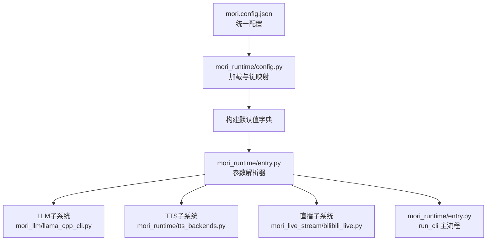
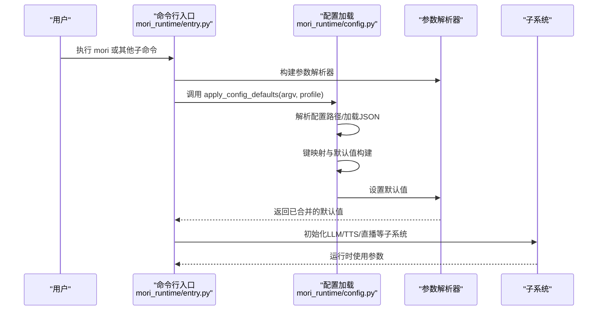
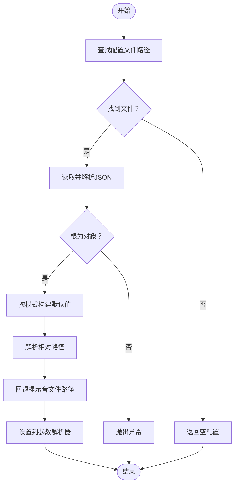
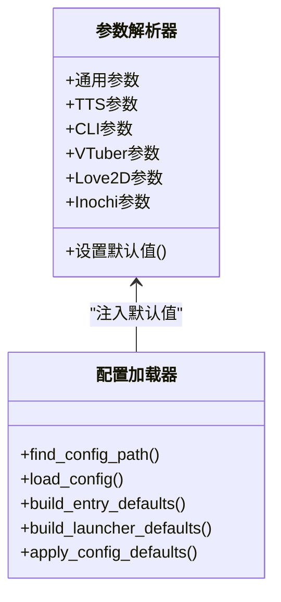
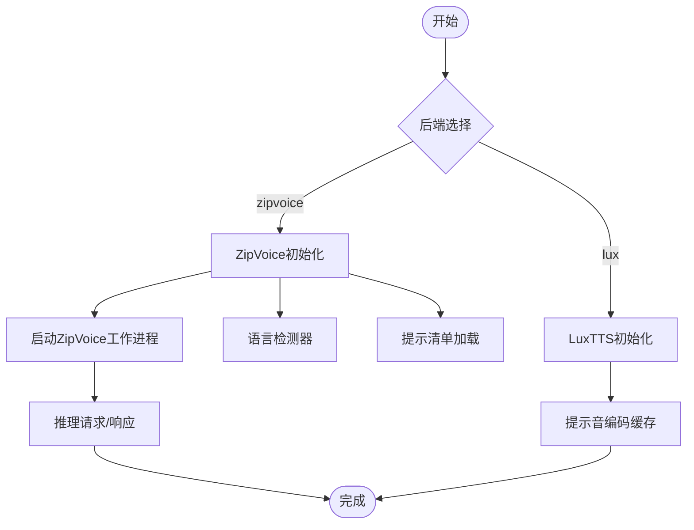
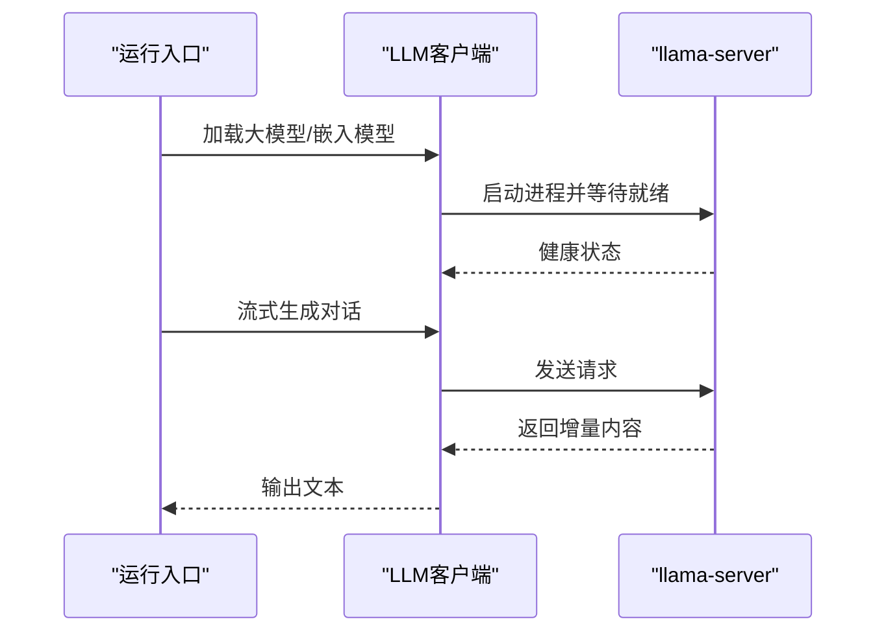
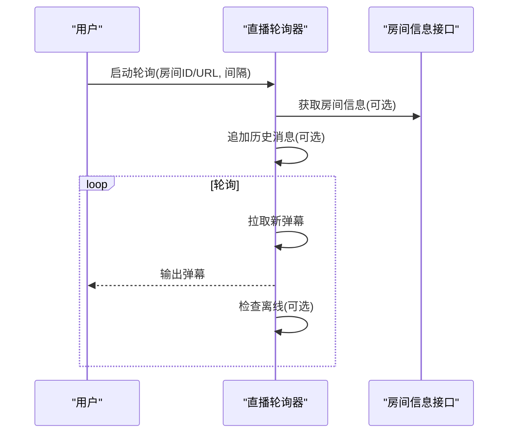
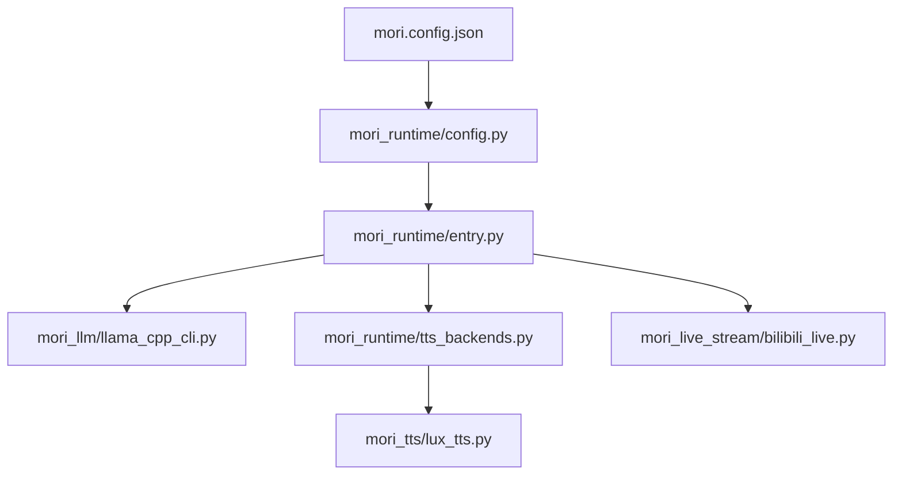

# 配置管理系统

<cite>
**本文档引用的文件**
- [mori.config.json](file://mori.config.json)
- [config.py](file://mori_runtime/config.py)
- [entry.py](file://mori_runtime/entry.py)
- [tts_backends.py](file://mori_runtime/tts_backends.py)
- [lux_tts.py](file://mori_tts/lux_tts.py)
- [llama_cpp_cli.py](file://mori_llm/llama_cpp_cli.py)
- [bilibili_live.py](file://mori_live_stream/bilibili_live.py)
- [bilibili_room.py](file://mori_live_stream/bilibili_room.py)
- [main.py](file://main.py)
</cite>

## 目录
1. [简介](#简介)
2. [项目结构](#项目结构)
3. [核心组件](#核心组件)
4. [架构总览](#架构总览)
5. [详细组件分析](#详细组件分析)
6. [依赖关系分析](#依赖关系分析)
7. [性能考量](#性能考量)
8. [故障排除指南](#故障排除指南)
9. [结论](#结论)
10. [附录](#附录)

## 简介
本文件系统化梳理并解释本项目的配置管理系统，涵盖以下方面：
- 配置文件结构与JSON格式规范
- 默认值处理与参数验证策略
- 配置项分类（运行时、模型、TTS、直播等）
- 配置覆盖机制（命令行优先级、环境变量、动态更新）
- 验证与错误处理（类型检查、范围校验、依赖关系）
- 最佳实践（模板、环境适配、安全建议）
- 完整配置参考与常见场景示例

## 项目结构
配置系统围绕统一的JSON配置文件展开，并通过运行入口将配置注入到各子系统（LLM、TTS、直播等）。核心流程如下：
- 统一配置文件：mori.config.json
- 运行入口：main.py → mori_runtime.entry.run_cli
- 配置加载与合并：mori_runtime.config.apply_config_defaults
- 子系统参数：mori_runtime/entry 构建参数解析器，注册默认值
- 后端实现：mori_runtime/tts_backends、mori_tts/lux_tts、mori_llm/llama_cpp_cli、mori_live_stream/bilibili_live

**图表来源**
- [mori.config.json](file://mori.config.json)
- [config.py](file://mori_runtime/config.py)
- [entry.py](file://mori_runtime/entry.py)

**章节来源**
- [main.py](file://main.py)
- [config.py](file://mori_runtime/config.py)
- [entry.py](file://mori_runtime/entry.py)

## 核心组件
- 统一配置文件：定义版本号、通用参数、TTS、CLI、VTuber、Love2D、Inochi等分组
- 配置加载器：扫描配置路径、读取JSON、提取分组、键映射、相对路径解析
- 参数解析器：构建命令行参数，设置默认值，支持别名与覆盖
- 子系统后端：LLM服务器客户端、TTS引擎、直播轮询器

**章节来源**
- [mori.config.json](file://mori.config.json)
- [config.py](file://mori_runtime/config.py)
- [entry.py](file://mori_runtime/entry.py)

## 架构总览
配置系统采用“配置文件 + 命令行参数”的双源输入，通过键映射与默认值注入，最终在运行入口集中消费。

**图表来源**
- [entry.py](file://mori_runtime/entry.py)
- [config.py](file://mori_runtime/config.py)

## 详细组件分析

### 配置文件结构与解析
- 文件位置与发现规则：支持显式路径、当前工作目录、仓库根目录自动发现
- 根对象校验：必须为JSON对象
- 分组提取：common、tts、cli、vtuber、love2d、inochi
- 键映射：将配置中的键转换为运行时使用的键（如 tts → tts_backend）
- 相对路径解析：对路径类键进行相对路径解析，支持逗号分隔的路径列表
- 提示音文件回退：若未指定则尝试从配置目录下的 mori_tts/prompt.wav 自动定位

**图表来源**
- [config.py](file://mori_runtime/config.py)

**章节来源**
- [config.py](file://mori_runtime/config.py)
- [mori.config.json](file://mori.config.json)

### 参数解析与默认值注入
- 通用参数：工作目录、llama二进制目录、聊天/嵌入模型、上下文大小、预测长度、温度、top_p、系统提示
- TTS参数：后端选择、模型、设备、线程数、提示音、采样步数、引导系数、t_shift、语速、平滑输出、ZipVoice专用参数（Python可执行文件、仓库路径、模型类型、模型目录、检查点、分词器、语言、提示文本/音频、长静音移除、线程数、语言检测器、最小置信度、提示清单、策略、质量配置文件、vocoder配置文件与模型）
- CLI参数：音频输出目录、中断策略
- VTuber参数：直播目录、字幕文件、事件日志、打印到标准输出、B站房间ID/URL、轮询间隔、追加消息数量、离线退出、直播检查间隔、中断策略
- Love2D参数：启用TTS、Love2D可执行文件、偶象文件、映射文件、鼠标视角、跳过准备
- Inochi参数：根目录、可执行文件、X11支持

**图表来源**
- [entry.py](file://mori_runtime/entry.py)
- [config.py](file://mori_runtime/config.py)

**章节来源**
- [entry.py](file://mori_runtime/entry.py)
- [config.py](file://mori_runtime/config.py)

### TTS子系统配置与验证
- 后端选择：lux（传统）与 zipvoice（显式分词器路由）
- ZipVoice质量配置文件：realtime/balanced/hq，自动推导采样步数、引导系数、t_shift、语速、平滑输出
- 语言检测：启发式、规则、lingua（可配置最小置信度）
- 提示清单：支持TSV/CSV，自动嗅探分隔符，支持多列别名（文本、音频、语言、启用等）
- 工作进程：启动ZipVoice推理脚本，建立双向通信，失败重试与优雅关闭
- LuxTTS：设备自动探测（CUDA/MPS/CPU），提示音缓存，生成WAV文件

**图表来源**
- [tts_backends.py](file://mori_runtime/tts_backends.py)
- [lux_tts.py](file://mori_tts/lux_tts.py)

**章节来源**
- [tts_backends.py](file://mori_runtime/tts_backends.py)
- [lux_tts.py](file://mori_tts/lux_tts.py)

### LLM子系统参数与模型选择
- 二进制目录解析：支持环境变量与默认路径
- 模型选择：聊天模型与嵌入模型的默认策略
- 服务器客户端：封装llama-server进程，健康检查、超时控制、错误处理
- 对话流式生成：支持温度、top_p、停止序列、随机种子等参数

**图表来源**
- [entry.py](file://mori_runtime/entry.py)
- [llama_cpp_cli.py](file://mori_llm/llama_cpp_cli.py)

**章节来源**
- [llama_cpp_cli.py](file://mori_llm/llama_cpp_cli.py)
- [entry.py](file://mori_runtime/entry.py)

### 直播子系统参数与轮询
- 房间信息获取：解析房间ID（支持URL提取）、在线状态、标题、在线人数
- 弹幕轮询：去重窗口、时间戳排序、消息结构化
- 线程模型：后台轮询线程，支持追加历史消息、定时检查离线退出

**图表来源**
- [bilibili_live.py](file://mori_live_stream/bilibili_live.py)
- [bilibili_room.py](file://mori_live_stream/bilibili_room.py)

**章节来源**
- [bilibili_live.py](file://mori_live_stream/bilibili_live.py)
- [bilibili_room.py](file://mori_live_stream/bilibili_room.py)

## 依赖关系分析
- 配置系统依赖关系
  - 统一配置文件 → 配置加载器 → 参数解析器 → 子系统
  - TTS子系统依赖ZipVoice/LuxTTS实现
  - LLM子系统依赖llama-server与llama.cpp工具链
  - 直播子系统依赖B站API与Lua模块

**图表来源**
- [mori.config.json](file://mori.config.json)
- [config.py](file://mori_runtime/config.py)
- [entry.py](file://mori_runtime/entry.py)
- [tts_backends.py](file://mori_runtime/tts_backends.py)
- [lux_tts.py](file://mori_tts/lux_tts.py)
- [llama_cpp_cli.py](file://mori_llm/llama_cpp_cli.py)
- [bilibili_live.py](file://mori_live_stream/bilibili_live.py)

**章节来源**
- [config.py](file://mori_runtime/config.py)
- [entry.py](file://mori_runtime/entry.py)

## 性能考量
- ZipVoice质量配置文件
  - realtime：低延迟，步数较少，适合实时场景
  - balanced：折中，兼顾速度与质量
  - hq：高质量，步数较多，适合离线合成
- LuxTTS设备选择
  - 自动探测GPU/CPU，避免不必要的CPU压力
- 直播轮询
  - 合理设置轮询间隔与历史追加，避免频繁网络请求
- 提示音缓存
  - LuxTTS对提示音编码结果进行缓存，减少重复计算

[本节为通用指导，无需特定文件来源]

## 故障排除指南
- 配置文件未找到
  - 检查配置路径是否正确，确认文件存在
  - 参考：[config.py](file://mori_runtime/config.py)
- 配置根非对象
  - 确认JSON根为对象
  - 参考：[config.py](file://mori_runtime/config.py)
- LLM服务器启动失败
  - 检查llama-server可执行文件与模型路径
  - 参考：[llama_cpp_cli.py](file://mori_llm/llama_cpp_cli.py)
- TTS后端初始化失败
  - ZipVoice：检查Python可执行文件、仓库路径、模型目录、检查点文件、提示清单
  - LuxTTS：检查依赖安装与设备可用性
  - 参考：[tts_backends.py](file://mori_runtime/tts_backends.py), [lux_tts.py](file://mori_tts/lux_tts.py)
- 直播轮询异常
  - 检查房间ID/URL、网络连通性、Lua模块加载
  - 参考：[bilibili_live.py](file://mori_live_stream/bilibili_live.py), [bilibili_room.py](file://mori_live_stream/bilibili_room.py)

**章节来源**
- [config.py](file://mori_runtime/config.py)
- [llama_cpp_cli.py](file://mori_llm/llama_cpp_cli.py)
- [tts_backends.py](file://mori_runtime/tts_backends.py)
- [lux_tts.py](file://mori_tts/lux_tts.py)
- [bilibili_live.py](file://mori_live_stream/bilibili_live.py)
- [bilibili_room.py](file://mori_live_stream/bilibili_room.py)

## 结论
本配置管理系统以统一JSON配置为核心，结合命令行参数与子系统默认值，实现了灵活、可扩展且易于维护的配置体系。通过严格的键映射、路径解析与参数验证，确保了跨模块的一致性与可靠性。建议在实际部署中遵循最佳实践，明确环境差异与安全边界，持续优化性能与稳定性。

[本节为总结性内容，无需特定文件来源]

## 附录

### 配置项分类与含义
- 通用配置（common）
  - 工作目录、llama二进制目录、聊天/嵌入模型、上下文大小、预测长度、温度、top_p、系统提示
- TTS配置（tts）
  - 后端、模型、设备、线程数、提示音、采样步数、引导系数、t_shift、语速、平滑输出、ZipVoice专用参数（Python可执行文件、仓库路径、模型类型、模型目录、检查点、分词器、语言、提示文本/音频、长静音移除、线程数、语言检测器、最小置信度、提示清单、策略、质量配置文件、vocoder配置文件与模型）
- CLI配置（cli）
  - 音频输出目录、中断策略
- VTuber配置（vtuber）
  - 直播目录、字幕文件、事件日志、打印到标准输出、B站房间ID/URL、轮询间隔、追加消息数量、离线退出、直播检查间隔、中断策略
- Love2D配置（love2d）
  - 启用TTS、Love2D可执行文件、偶象文件、映射文件、鼠标视角、跳过准备
- Inochi配置（inochi）
  - 根目录、可执行文件、X11支持

**章节来源**
- [mori.config.json](file://mori.config.json)
- [entry.py](file://mori_runtime/entry.py)

### 配置覆盖机制
- 命令行优先级
  - 命令行参数覆盖配置文件中的对应项
- 环境变量支持
  - LLM二进制目录解析支持环境变量
- 动态配置更新
  - 当前实现为一次性加载，不支持运行时热更新；可通过重启进程应用新配置

**章节来源**
- [config.py](file://mori_runtime/config.py)
- [entry.py](file://mori_runtime/entry.py)
- [llama_cpp_cli.py](file://mori_llm/llama_cpp_cli.py)

### 配置验证与错误处理
- 类型检查：参数解析器对数值、布尔、枚举进行类型转换与校验
- 范围验证：如温度、top_p、步数、引导系数、t_shift、语速等参数的范围约束
- 依赖关系检查：ZipVoice要求提示清单或固定提示，LuxTTS要求提示音文件存在
- 错误传播：子系统异常向上抛出，便于运行入口捕获并记录

**章节来源**
- [entry.py](file://mori_runtime/entry.py)
- [tts_backends.py](file://mori_runtime/tts_backends.py)
- [lux_tts.py](file://mori_tts/lux_tts.py)

### 配置最佳实践
- 使用统一配置模板，按环境拆分（开发/测试/生产）
- 明确路径解析策略，优先使用绝对路径或基于配置文件的相对路径
- 为不同场景预设质量配置文件（realtime/balanced/hq）
- 严格管理提示音资源与语言检测器配置
- 在容器/CI环境中通过环境变量与命令行参数组合覆盖配置

[本节为通用指导，无需特定文件来源]

### 常见配置场景示例
- 实时TTS（低延迟）
  - 选择ZipVoice，质量配置文件设为realtime，适当降低采样步数与引导系数
- 高质量离线合成
  - 选择ZipVoice，质量配置文件设为hq，提升采样步数与引导系数
- CPU受限环境
  - LuxTTS设备选择CPU，ZipVoice减少线程数与vocoder复杂度
- B站直播监听
  - 设置房间ID/URL、轮询间隔、离线退出策略、事件日志输出

**章节来源**
- [mori.config.json](file://mori.config.json)
- [entry.py](file://mori_runtime/entry.py)
- [tts_backends.py](file://mori_runtime/tts_backends.py)
- [bilibili_live.py](file://mori_live_stream/bilibili_live.py)