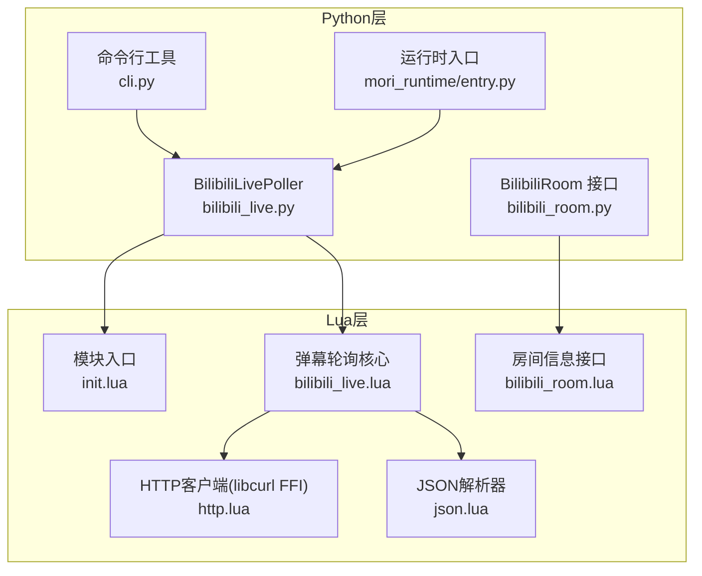
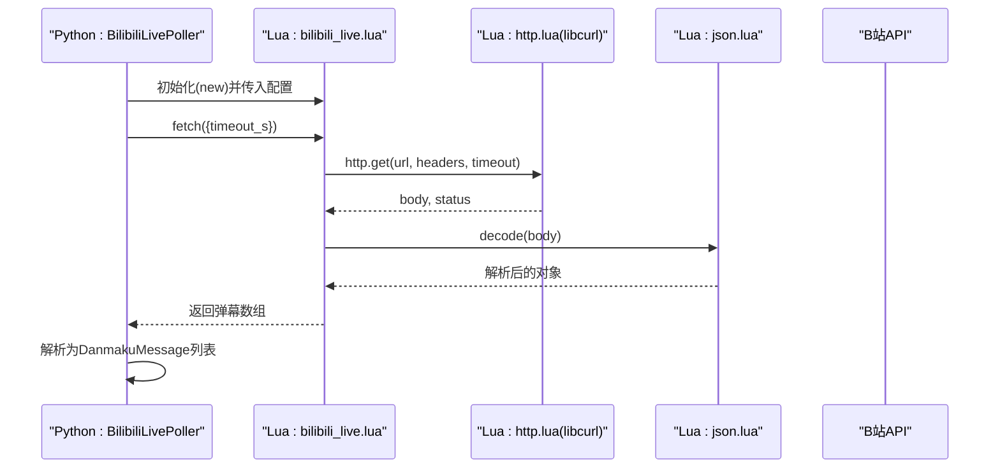
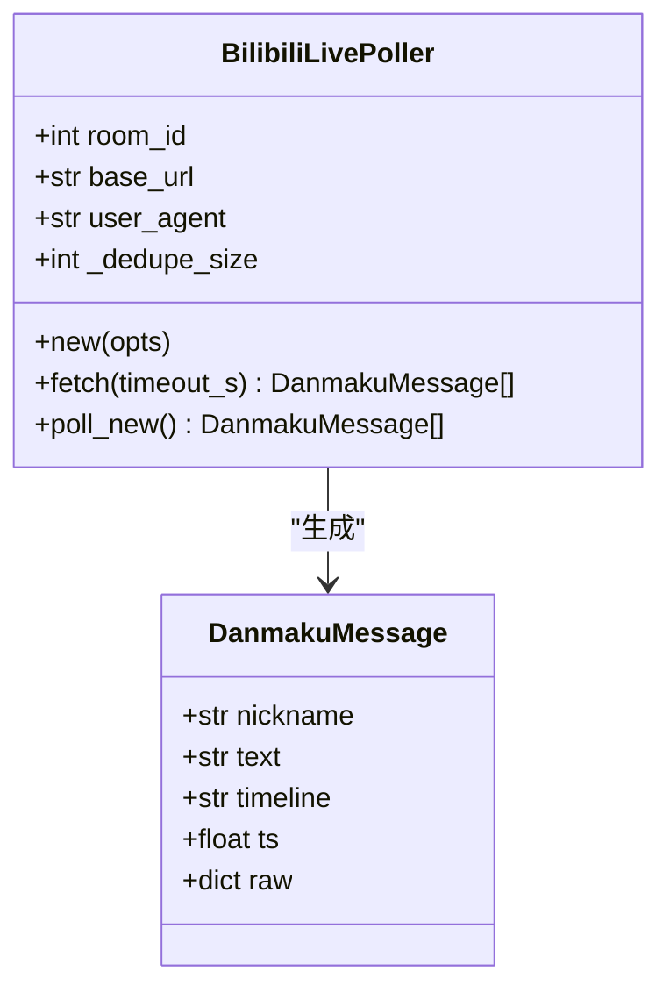
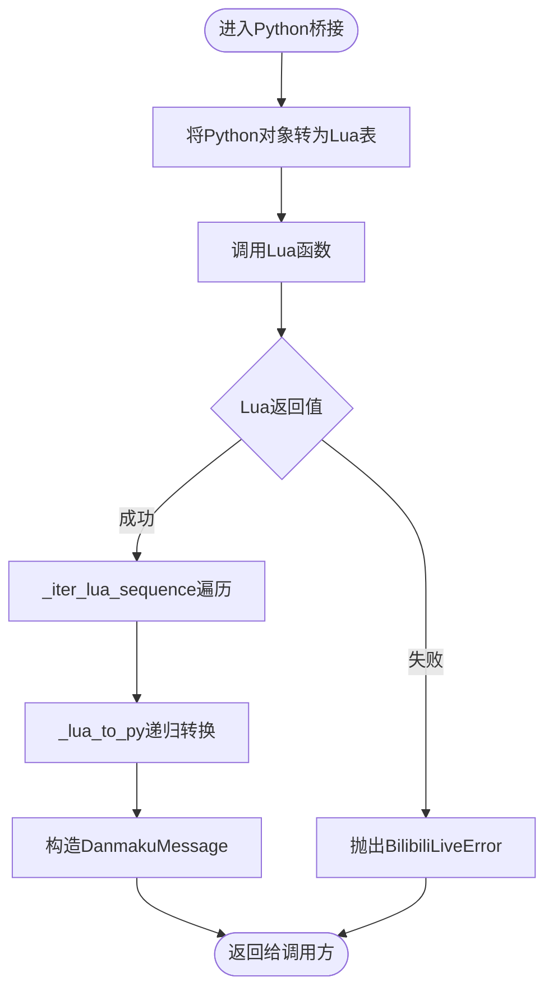
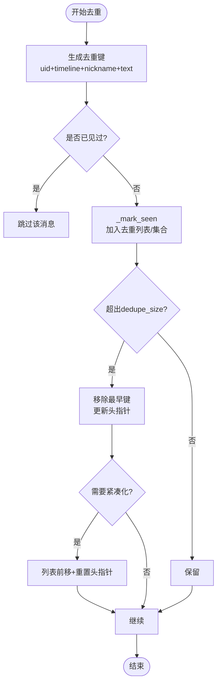
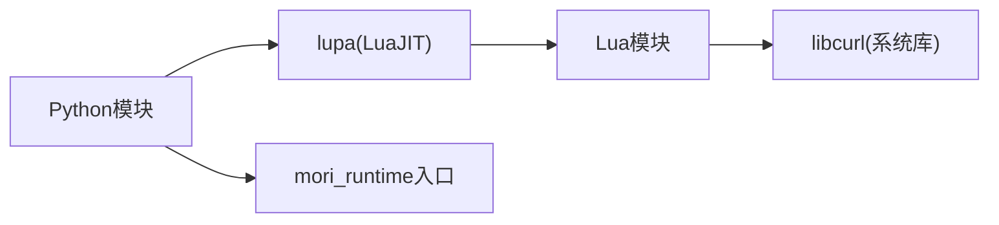

# Bilibili直播集成

<cite>
**本文引用的文件**
- [mori_live_stream/bilibili_live.py](file://mori_live_stream/bilibili_live.py)
- [mori_live_stream/bilibili_room.py](file://mori_live_stream/bilibili_room.py)
- [mori_live_stream/cli.py](file://mori_live_stream/cli.py)
- [mori_live_stream/README.md](file://mori_live_stream/README.md)
- [mori_live_stream/lua/mori_live_stream/bilibili_live.lua](file://mori_live_stream/lua/mori_live_stream/bilibili_live.lua)
- [mori_live_stream/lua/mori_live_stream/bilibili_room.lua](file://mori_live_stream/lua/mori_live_stream/bilibili_room.lua)
- [mori_live_stream/lua/mori_live_stream/http.lua](file://mori_live_stream/lua/mori_live_stream/http.lua)
- [mori_live_stream/lua/mori_live_stream/json.lua](file://mori_live_stream/lua/mori_live_stream/json.lua)
- [mori_live_stream/lua/mori_live_stream/init.lua](file://mori_live_stream/lua/mori_live_stream/init.lua)
- [mori_runtime/entry.py](file://mori_runtime/entry.py)
- [scripts/run_bili_vtuber_inochi.py](file://scripts/run_bili_vtuber_inochi.py)
- [vtuber.py](file://vtuber.py)
</cite>

## 目录
1. [简介](#简介)
2. [项目结构](#项目结构)
3. [核心组件](#核心组件)
4. [架构总览](#架构总览)
5. [组件详解](#组件详解)
6. [依赖关系分析](#依赖关系分析)
7. [性能考量](#性能考量)
8. [故障排查指南](#故障排查指南)
9. [结论](#结论)
10. [附录](#附录)

## 简介
本技术文档面向Bilibili直播集成模块，聚焦于BilibiliLivePoller类的设计与实现，系统阐述其轮询机制、HTTP请求处理、弹幕数据解析流程，并深入解析LuaJIT桥接机制（Python与Lua的数据转换、错误处理、内存管理）。同时，文档详细说明弹幕消息的数据结构设计（DanmakuMessage类）、去重机制（dedupe_size参数、哈希算法、内存优化策略），并提供完整配置参数说明与使用示例及最佳实践。

## 项目结构
该模块采用“LuaJIT（libcurl FFI）核心 + Python薄桥接”的混合架构：
- Python侧负责初始化Lua运行时、加载Lua模块、参数传递、结果序列化与异常包装。
- Lua侧负责HTTP请求、JSON解析、弹幕去重与增量拉取逻辑。
- CLI与运行时入口将弹幕消息注入到Mori运行时的输入队列中，供后续处理链路消费。

图表来源
- [mori_live_stream/bilibili_live.py:93-221](file://mori_live_stream/bilibili_live.py#L93-L221)
- [mori_live_stream/bilibili_room.py:64-141](file://mori_live_stream/bilibili_room.py#L64-L141)
- [mori_live_stream/cli.py:39-57](file://mori_live_stream/cli.py#L39-L57)
- [mori_live_stream/lua/mori_live_stream/init.lua:1-6](file://mori_live_stream/lua/mori_live_stream/init.lua#L1-L6)
- [mori_live_stream/lua/mori_live_stream/bilibili_live.lua:70-242](file://mori_live_stream/lua/mori_live_stream/bilibili_live.lua#L70-L242)
- [mori_live_stream/lua/mori_live_stream/bilibili_room.lua:18-74](file://mori_live_stream/lua/mori_live_stream/bilibili_room.lua#L18-L74)
- [mori_live_stream/lua/mori_live_stream/http.lua:104-186](file://mori_live_stream/lua/mori_live_stream/http.lua#L104-L186)
- [mori_live_stream/lua/mori_live_stream/json.lua:288-303](file://mori_live_stream/lua/mori_live_stream/json.lua#L288-L303)

章节来源
- [mori_live_stream/README.md:1-26](file://mori_live_stream/README.md#L1-L26)
- [mori_live_stream/bilibili_live.py:93-221](file://mori_live_stream/bilibili_live.py#L93-L221)
- [mori_live_stream/bilibili_room.py:64-141](file://mori_live_stream/bilibili_room.py#L64-L141)
- [mori_live_stream/cli.py:22-57](file://mori_live_stream/cli.py#L22-L57)
- [mori_live_stream/lua/mori_live_stream/init.lua:1-6](file://mori_live_stream/lua/mori_live_stream/init.lua#L1-L6)

## 核心组件
- BilibiliLivePoller：Python侧轮询器，封装LuaJIT核心，提供fetch/poll_new方法，返回标准化的DanmakuMessage列表。
- DanmakuMessage：弹幕消息数据模型，包含昵称、文本、时间线、时间戳与原始数据字典。
- BilibiliRoom接口：获取房间状态、在线人数、标题等信息。
- Lua模块：bilibili_live.lua（轮询与去重）、bilibili_room.lua（房间信息）、http.lua（libcurl FFI封装）、json.lua（自研JSON解析器）。
- CLI与运行时：命令行工具与运行时入口，将弹幕消息注入Mori运行时。

章节来源
- [mori_live_stream/bilibili_live.py:13-20](file://mori_live_stream/bilibili_live.py#L13-L20)
- [mori_live_stream/bilibili_live.py:93-221](file://mori_live_stream/bilibili_live.py#L93-L221)
- [mori_live_stream/bilibili_room.py:13-21](file://mori_live_stream/bilibili_room.py#L13-L21)
- [mori_live_stream/bilibili_room.py:93-141](file://mori_live_stream/bilibili_room.py#L93-L141)
- [mori_live_stream/lua/mori_live_stream/bilibili_live.lua:31-242](file://mori_live_stream/lua/mori_live_stream/bilibili_live.lua#L31-L242)
- [mori_live_stream/lua/mori_live_stream/bilibili_room.lua:18-74](file://mori_live_stream/lua/mori_live_stream/bilibili_room.lua#L18-L74)
- [mori_live_stream/lua/mori_live_stream/http.lua:104-186](file://mori_live_stream/lua/mori_live_stream/http.lua#L104-L186)
- [mori_live_stream/lua/mori_live_stream/json.lua:288-303](file://mori_live_stream/lua/mori_live_stream/json.lua#L288-L303)

## 架构总览
下图展示从Python调用到Lua核心再到HTTP请求与JSON解析的整体流程，以及错误处理与结果回传路径。

图表来源
- [mori_live_stream/bilibili_live.py:133-152](file://mori_live_stream/bilibili_live.py#L133-L152)
- [mori_live_stream/lua/mori_live_stream/bilibili_live.lua:149-206](file://mori_live_stream/lua/mori_live_stream/bilibili_live.lua#L149-L206)
- [mori_live_stream/lua/mori_live_stream/http.lua:104-186](file://mori_live_stream/lua/mori_live_stream/http.lua#L104-L186)
- [mori_live_stream/lua/mori_live_stream/json.lua:288-303](file://mori_live_stream/lua/mori_live_stream/json.lua#L288-L303)

## 组件详解

### BilibiliLivePoller类设计与轮询机制
- 初始化流程
  - Python侧通过lupa加载Lua模块路径，require“mori_live_stream.bilibili_live”，构造Lua侧Poller实例。
  - 支持配置项：room_id、base_url、user_agent、dedupe_size。
- 轮询接口
  - fetch：一次性获取当前房间所有弹幕，按时间线排序后返回。
  - poll_new：基于上次最大时间戳进行增量拉取，避免重复推送。
- 结果解析
  - 将Lua返回的表序列迭代为Python列表，逐条提取nickname、text、timeline、ts、raw字段，构造DanmakuMessage。
  - raw原始数据通过递归转换函数转换为Python字典，保证跨语言类型一致性。

图表来源
- [mori_live_stream/bilibili_live.py:93-221](file://mori_live_stream/bilibili_live.py#L93-L221)
- [mori_live_stream/bilibili_live.py:13-20](file://mori_live_stream/bilibili_live.py#L13-L20)

章节来源
- [mori_live_stream/bilibili_live.py:101-146](file://mori_live_stream/bilibili_live.py#L101-L146)
- [mori_live_stream/bilibili_live.py:147-205](file://mori_live_stream/bilibili_live.py#L147-L205)

### LuaJIT桥接机制：Python与Lua数据转换、错误处理、内存管理
- 数据转换
  - Python侧将字典/列表转换为Lua表（lua.table_from），Lua侧将表序列化为Python迭代器。
  - _lua_to_py递归转换Lua表为Python字典，限制递归深度防止栈溢出。
  - _iter_lua_sequence兼容None、列表、元组与可迭代对象，确保健壮性。
- 错误处理
  - Lua侧在http.get/json.decode失败时返回错误字符串；Python侧统一捕获并抛出BilibiliLiveError。
  - CLI与运行时入口对异常进行吞吐与优雅退出处理。
- 内存管理
  - Lua侧使用libcurl FFI直接分配/释放缓冲区，回调写入chunks后立即清理。
  - Python侧不持有Lua对象引用，避免循环引用；错误时及时释放句柄。

图表来源
- [mori_live_stream/bilibili_live.py:22-83](file://mori_live_stream/bilibili_live.py#L22-L83)
- [mori_live_stream/bilibili_live.py:147-205](file://mori_live_stream/bilibili_live.py#L147-L205)
- [mori_live_stream/lua/mori_live_stream/http.lua:104-186](file://mori_live_stream/lua/mori_live_stream/http.lua#L104-L186)
- [mori_live_stream/lua/mori_live_stream/json.lua:288-303](file://mori_live_stream/lua/mori_live_stream/json.lua#L288-L303)

章节来源
- [mori_live_stream/bilibili_live.py:22-83](file://mori_live_stream/bilibili_live.py#L22-L83)
- [mori_live_stream/lua/mori_live_stream/http.lua:104-186](file://mori_live_stream/lua/mori_live_stream/http.lua#L104-L186)
- [mori_live_stream/lua/mori_live_stream/json.lua:288-303](file://mori_live_stream/lua/mori_live_stream/json.lua#L288-L303)

### 弹幕消息数据结构设计：DanmakuMessage
- 字段定义
  - nickname：用户昵称（清洗后非空）
  - text：弹幕文本（清洗后非空）
  - timeline：时间线字符串（如“YYYY-MM-DD HH:MM:SS”）
  - ts：时间戳（秒，由timeline解析而来）
  - raw：原始B站响应字典（经Python侧转换）
- 时间戳处理
  - Lua侧解析timeline为本地时间戳；Python侧将其转换为浮点数，便于排序与比较。
- 原始数据保留
  - 保留raw以便上层业务扩展（如抽取uid、表情包、礼物等）。

章节来源
- [mori_live_stream/bilibili_live.py:13-20](file://mori_live_stream/bilibili_live.py#L13-L20)
- [mori_live_stream/lua/mori_live_stream/bilibili_live.lua:11-29](file://mori_live_stream/lua/mori_live_stream/bilibili_live.lua#L11-L29)
- [mori_live_stream/bilibili_live.py:165-174](file://mori_live_stream/bilibili_live.py#L165-L174)

### 去重机制：dedupe_size、哈希算法与内存优化
- 哈希键生成
  - 从raw中提取uid（多键兼容）、timeline、nickname、text拼接为key，确保组合唯一性。
- 去重容器
  - 使用固定容量环形队列（列表）与头指针维护最近N条记录，集合用于O(1)存在性检查。
- 内存优化
  - 当去重列表长度超过阈值时，从头部移除旧键并清理集合对应项。
  - 当头指针超过一定比例时触发紧凑化，将列表前移，减少稀疏占用。
- dedupe_size参数
  - 控制去重窗口大小，默认512，最小16；过大增加内存占用，过小可能导致误判重复。

图表来源
- [mori_live_stream/lua/mori_live_stream/bilibili_live.lua:59-68](file://mori_live_stream/lua/mori_live_stream/bilibili_live.lua#L59-L68)
- [mori_live_stream/lua/mori_live_stream/bilibili_live.lua:108-147](file://mori_live_stream/lua/mori_live_stream/bilibili_live.lua#L108-L147)

章节来源
- [mori_live_stream/lua/mori_live_stream/bilibili_live.lua:82-85](file://mori_live_stream/lua/mori_live_stream/bilibili_live.lua#L82-L85)
- [mori_live_stream/lua/mori_live_stream/bilibili_live.lua:108-147](file://mori_live_stream/lua/mori_live_stream/bilibili_live.lua#L108-L147)

### HTTP请求处理：libcurl FFI与JSON解析
- HTTP层
  - 通过LuaJIT FFI绑定libcurl，支持设置URL、超时、连接超时、User-Agent、请求头、自动跟随重定向与编码压缩。
  - 回调收集响应体分片，最终拼接为字符串；返回响应码与错误信息。
- JSON层
  - 自研轻量JSON解析器，支持字符串、数字、布尔、null、数组与对象，处理Unicode转义与surrogate pair。
  - 对异常情况返回明确错误原因，便于上层定位问题。

章节来源
- [mori_live_stream/lua/mori_live_stream/http.lua:104-186](file://mori_live_stream/lua/mori_live_stream/http.lua#L104-L186)
- [mori_live_stream/lua/mori_live_stream/json.lua:288-303](file://mori_live_stream/lua/mori_live_stream/json.lua#L288-L303)

### 房间信息接口：BilibiliRoom
- 提供房间基本信息查询（直播状态、标题、在线人数、直播时长）与is_live便捷判断。
- 通过独立模块bilibili_room.lua实现，Python侧通过相同桥接模式调用。

章节来源
- [mori_live_stream/bilibili_room.py:93-141](file://mori_live_stream/bilibili_room.py#L93-L141)
- [mori_live_stream/lua/mori_live_stream/bilibili_room.lua:18-74](file://mori_live_stream/lua/mori_live_stream/bilibili_room.lua#L18-L74)

### 配置参数说明
- room_id：房间ID（整数），必填。
- base_url：B站弹幕接口基础URL（默认为ajax/msg），末尾斜杠会被清理。
- user_agent：请求User-Agent，默认使用常见Chrome UA。
- timeout_s：HTTP请求超时（秒），默认10。
- dedupe_size：去重窗口大小（默认512，最小16）。
- CLI参数
  - --room-id：房间ID（整数）
  - --room-url：可选，从URL中提取房间ID
  - --interval：轮询间隔（秒，默认2.0）
  - --stop-after：停止时间（秒，0表示持续运行）
  - --include-history：启动时打印当前房间历史消息一次

章节来源
- [mori_live_stream/bilibili_live.py:101-119](file://mori_live_stream/bilibili_live.py#L101-L119)
- [mori_live_stream/bilibili_live.py:147-152](file://mori_live_stream/bilibili_live.py#L147-L152)
- [mori_live_stream/cli.py:22-36](file://mori_live_stream/cli.py#L22-L36)
- [mori_live_stream/lua/mori_live_stream/bilibili_live.lua:70-102](file://mori_live_stream/lua/mori_live_stream/bilibili_live.lua#L70-L102)

### 使用示例与最佳实践
- 命令行快速测试
  - 使用内置CLI进行快速验证与演示。
- 与运行时集成
  - 运行时入口会根据配置启动B站弹幕线程，支持“离线退出”“历史抓取”“优先级”等策略。
- 最佳实践
  - 合理设置轮询间隔与去重窗口，避免频繁请求与内存膨胀。
  - 在高并发场景下，建议增加间隔或更换UA以规避限流。
  - 对raw原始数据进行二次解析，提取uid、表情、礼物等扩展字段。

章节来源
- [mori_live_stream/README.md:11-26](file://mori_live_stream/README.md#L11-L26)
- [mori_live_stream/cli.py:39-57](file://mori_live_stream/cli.py#L39-L57)
- [mori_runtime/entry.py:479-580](file://mori_runtime/entry.py#L479-L580)

## 依赖关系分析
- Python依赖
  - lupa（LuaJIT运行时）
  - 标准库：time、dataclasses、pathlib、typing
- Lua依赖
  - libcurl（系统库）
  - Lua标准库（bit、ffi、string、table等）
- 运行时集成
  - 运行时入口通过线程池与消息队列消费弹幕消息，支持优先级与离线检测。

图表来源
- [mori_live_stream/bilibili_live.py:110-114](file://mori_live_stream/bilibili_live.py#L110-L114)
- [mori_live_stream/lua/mori_live_stream/http.lua:43-49](file://mori_live_stream/lua/mori_live_stream/http.lua#L43-L49)
- [mori_runtime/entry.py:479-580](file://mori_runtime/entry.py#L479-L580)

章节来源
- [mori_live_stream/bilibili_live.py:110-114](file://mori_live_stream/bilibili_live.py#L110-L114)
- [mori_live_stream/lua/mori_live_stream/http.lua:43-49](file://mori_live_stream/lua/mori_live_stream/http.lua#L43-L49)
- [mori_runtime/entry.py:479-580](file://mori_runtime/entry.py#L479-L580)

## 性能考量
- 轮询频率与带宽
  - 增大轮询间隔可降低服务器压力，但会增加延迟；需结合业务需求权衡。
- 去重窗口
  - dedupe_size越大，去重效果越好，但内存占用越高；建议根据并发与消息密度调整。
- JSON解析
  - 自研解析器避免引入外部依赖，但功能相对精简；对于复杂嵌套结构建议谨慎使用。
- 线程与内存
  - Python侧无持久Lua对象引用，Lua侧libcurl回调写入分片后立即释放；整体内存压力可控。

## 故障排查指南
- 缺少依赖
  - 未安装lupa或系统缺少libcurl：初始化时会抛出模块缺失异常，请按README安装依赖。
- 请求失败
  - http.get返回nil并携带错误信息：检查网络、代理、User-Agent与URL。
- JSON解析失败
  - json.decode返回错误：确认返回体格式是否符合预期，必要时打印body进行诊断。
- 重复消息
  - 若出现重复弹幕：检查去重键生成逻辑与dedupe_size设置，适当增大窗口。
- 离线退出
  - 运行时入口支持离线检测，当房间状态非直播时发送/system退出事件，避免无效轮询。

章节来源
- [mori_live_stream/bilibili_live.py:110-114](file://mori_live_stream/bilibili_live.py#L110-L114)
- [mori_live_stream/lua/mori_live_stream/http.lua:104-186](file://mori_live_stream/lua/mori_live_stream/http.lua#L104-L186)
- [mori_live_stream/lua/mori_live_stream/json.lua:288-303](file://mori_live_stream/lua/mori_live_stream/json.lua#L288-L303)
- [mori_runtime/entry.py:539-556](file://mori_runtime/entry.py#L539-L556)

## 结论
本模块以LuaJIT为核心，结合libcurl FFI与自研JSON解析器，在Python薄桥接下实现了高效、稳定的B站弹幕轮询与去重。通过清晰的数据模型与可配置参数，满足不同场景下的实时弹幕接入需求。建议在生产环境中合理设置轮询间隔与去重窗口，并关注网络与服务端策略变化，以获得更稳健的体验。

## 附录
- 快速开始
  - 安装依赖后，使用命令行工具进行测试。
- 与vtuber集成
  - 通过脚本启动Inochi前端与vtuber管道，实现弹幕到字幕/语音的完整链路。

章节来源
- [mori_live_stream/README.md:11-26](file://mori_live_stream/README.md#L11-L26)
- [scripts/run_bili_vtuber_inochi.py:122-232](file://scripts/run_bili_vtuber_inochi.py#L122-L232)
- [vtuber.py:1-13](file://vtuber.py#L1-L13)