# 决策系统

<cite>
**本文引用的文件列表**
- [init.lua](file://mori_memory/module/decision/init.lua)
- [dimensions.lua](file://mori_memory/module/decision/dimensions.lua)
- [quadrants.lua](file://mori_memory/module/decision/quadrants.lua)
- [enhanced_quadrant.lua](file://mori_memory/module/decision/enhanced_quadrant.lua)
- [fusion.lua](file://mori_memory/module/decision/fusion.lua)
- [evaluator.lua](file://mori_memory/module/decision/evaluator.lua)
- [controller.lua](file://mori_memory/module/decision/controller.lua)
- [quadrant_policy.lua](file://mori_memory/module/policy/quadrant_policy.lua)
- [config.lua](file://mori_memory/module/config.lua)
- [test_decision_system.lua](file://test_decision_system.lua)
- [quadrant_enhancement_analyzer.py](file://mori_memory/scripts/quadrant_enhancement_analyzer.py)
- [analyze_four_quadrant_jitter.py](file://mori_memory/scripts/analyze_four_quadrant_jitter.py)
- [four_quadrant_jitter_20260326_225905.json](file://mori_memory/benchmarks/results/four_quadrant_jitter_20260326_225905.json)
</cite>

## 目录
1. [简介](#简介)
2. [项目结构](#项目结构)
3. [核心组件](#核心组件)
4. [架构总览](#架构总览)
5. [详细组件分析](#详细组件分析)
6. [依赖关系分析](#依赖关系分析)
7. [性能考量](#性能考量)
8. [故障排查指南](#故障排查指南)
9. [结论](#结论)
10. [附录](#附录)

## 简介
本文件面向直播决策系统，围绕“四象限分析模型”展开，系统性阐述情感维度划分、行为模式识别、回复策略生成；深入解析增强四象限算法的权重计算、动态调整与上下文感知；详解融合机制的多源信息整合、冲突解决与决策投票；说明评估器的质量评分、时效性判断与个性化调整；并给出配置参数（阈值、权重、响应延迟）的使用建议与调试方法。文档同时提供可视化说明与实际决策示例，帮助读者快速理解并高效落地该系统。

## 项目结构
决策系统位于 mori_memory/module/decision 下，采用模块化设计，包含维度管理、象限系统、增强象限、融合引擎、评估器与控制器等子模块，并通过 init.lua 汇聚导出接口。策略层与配置层分别位于 policy 与 config，用于参数调节与运行时配置。

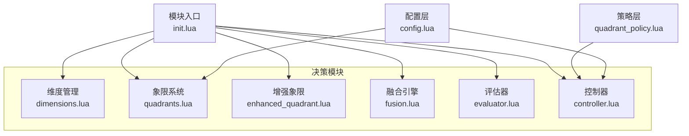

图表来源
- [init.lua:1-21](file://mori_memory/module/decision/init.lua#L1-L21)
- [dimensions.lua:1-210](file://mori_memory/module/decision/dimensions.lua#L1-L210)
- [quadrants.lua:1-285](file://mori_memory/module/decision/quadrants.lua#L1-L285)
- [enhanced_quadrant.lua:1-335](file://mori_memory/module/decision/enhanced_quadrant.lua#L1-L335)
- [fusion.lua:1-302](file://mori_memory/module/decision/fusion.lua#L1-L302)
- [evaluator.lua:1-362](file://mori_memory/module/decision/evaluator.lua#L1-L362)
- [controller.lua:1-194](file://mori_memory/module/decision/controller.lua#L1-L194)
- [quadrant_policy.lua:1-238](file://mori_memory/module/policy/quadrant_policy.lua#L1-L238)
- [config.lua:1-680](file://mori_memory/module/config.lua#L1-L680)

章节来源
- [init.lua:1-21](file://mori_memory/module/decision/init.lua#L1-L21)

## 核心组件
- 维度管理器：负责将原始上下文抽象为标准化的维度值（参与压力、交互拓扑、消息频率、参与者多样性），并提供归一化与更新能力。
- 象限系统：基于维度值确定象限，应用象限规则（权重、优先级、阈值调整）生成评分。
- 增强象限：引入自适应阈值、置信度与平滑转换，提升鲁棒性与稳定性。
- 融合引擎：聚合多象限评分，结合环境特征与权重进行加权融合，输出置信度与推理说明。
- 评估器：提取特征（语义相似性、回复线索、提及检测、消息长度/复杂度、时间邻近性、流稳定性），计算评分通道（语义通道、对等边通道、中性评分），并生成置信度与推理。
- 控制器：对维度值进行平滑处理，基于阈值判定象限转换，输出表面参数（如 attach_conservatism、peer_signal_trust 等）。
- 策略层：根据象限类型对参数进行调节（不改变核心路由逻辑）。
- 配置层：提供运行时参数（阈值、权重、响应延迟等）与策略配置。

章节来源
- [dimensions.lua:156-210](file://mori_memory/module/decision/dimensions.lua#L156-L210)
- [quadrants.lua:207-285](file://mori_memory/module/decision/quadrants.lua#L207-L285)
- [enhanced_quadrant.lua:213-335](file://mori_memory/module/decision/enhanced_quadrant.lua#L213-L335)
- [fusion.lua:117-302](file://mori_memory/module/decision/fusion.lua#L117-L302)
- [evaluator.lua:251-362](file://mori_memory/module/decision/evaluator.lua#L251-L362)
- [controller.lua:27-194](file://mori_memory/module/decision/controller.lua#L27-L194)
- [quadrant_policy.lua:141-238](file://mori_memory/module/policy/quadrant_policy.lua#L141-L238)
- [config.lua:366-420](file://mori_memory/module/config.lua#L366-L420)

## 架构总览
系统以“维度→象限→评估→融合→控制”的链路为核心，增强象限提供自适应阈值与平滑转换，策略层与配置层贯穿其中，形成闭环反馈。

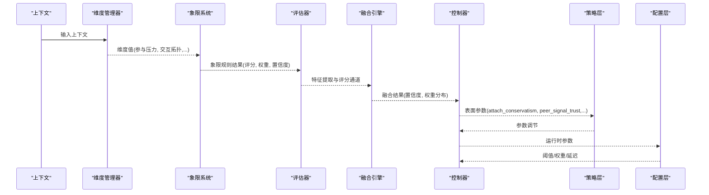

图表来源
- [dimensions.lua:182-189](file://mori_memory/module/decision/dimensions.lua#L182-L189)
- [quadrants.lua:247-264](file://mori_memory/module/decision/quadrants.lua#L247-L264)
- [evaluator.lua:267-308](file://mori_memory/module/decision/evaluator.lua#L267-L308)
- [fusion.lua:132-229](file://mori_memory/module/decision/fusion.lua#L132-L229)
- [controller.lua:44-79](file://mori_memory/module/decision/controller.lua#L44-L79)
- [quadrant_policy.lua:193-207](file://mori_memory/module/policy/quadrant_policy.lua#L193-L207)
- [config.lua:366-420](file://mori_memory/module/config.lua#L366-L420)

## 详细组件分析

### 维度管理器（情感维度划分）
- 设计理念：将直播场景中的多维信号抽象为统一的[0,1]区间值，便于跨场景比较与规则应用。
- 关键维度：
  - 参与压力：综合有效参与者数量、流压力、房间不稳定度与得分熵。
  - 交互拓扑：综合对等边比率、中心主导度、对密度、参与者切换率，映射为 hub→peer 的倾向。
  - 消息频率：基于近期消息数与时窗推导。
  - 参与者多样性：基于唯一参与者数与参与平衡系数。
- 复杂度：O(1) 单次计算，整体 O(N) 遍历 N 个维度。
- 优化点：归一化与边界裁剪确保数值稳定；权重与阈值可随场景微调。

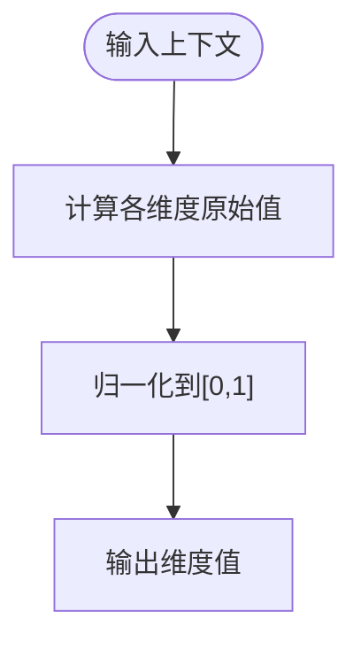

图表来源
- [dimensions.lua:56-77](file://mori_memory/module/decision/dimensions.lua#L56-L77)
- [dimensions.lua:89-109](file://mori_memory/module/decision/dimensions.lua#L89-L109)
- [dimensions.lua:121-133](file://mori_memory/module/decision/dimensions.lua#L121-L133)
- [dimensions.lua:145-154](file://mori_memory/module/decision/dimensions.lua#L145-L154)

章节来源
- [dimensions.lua:11-17](file://mori_memory/module/decision/dimensions.lua#L11-L17)
- [dimensions.lua:46-77](file://mori_memory/module/decision/dimensions.lua#L46-L77)
- [dimensions.lua:79-109](file://mori_memory/module/decision/dimensions.lua#L79-L109)
- [dimensions.lua:111-133](file://mori_memory/module/decision/dimensions.lua#L111-L133)
- [dimensions.lua:135-154](file://mori_memory/module/decision/dimensions.lua#L135-L154)

### 象限系统（行为模式识别）
- 设计理念：以参与压力与交互拓扑为双轴，定义四象限，每象限配有不同的维度权重、优先级权重与阈值调整，用于指导回复策略。
- 规则应用流程：维度值→维度权重→优先级权重→阈值调整→最终评分。
- 象限规则差异：
  - 低人口广播型：强调交互拓扑与话题连贯性，阈值偏保守。
  - 高人口广播型：强调参与压力与反应回退，阈值偏积极。
  - 低人口对等型：强调回复线索与提及检测，阈值适中。
  - 高人口对等型：强调对等边与密度，阈值较积极。
- 复杂度：O(K) 应用 K 个维度权重与阈值调整。

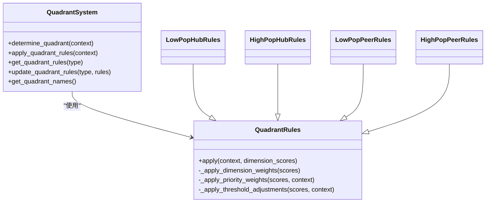

图表来源
- [quadrants.lua:207-285](file://mori_memory/module/decision/quadrants.lua#L207-L285)
- [quadrants.lua:47-99](file://mori_memory/module/decision/quadrants.lua#L47-L99)
- [quadrants.lua:101-205](file://mori_memory/module/decision/quadrants.lua#L101-L205)

章节来源
- [quadrants.lua:10-16](file://mori_memory/module/decision/quadrants.lua#L10-L16)
- [quadrants.lua:227-245](file://mori_memory/module/decision/quadrants.lua#L227-L245)
- [quadrants.lua:247-264](file://mori_memory/module/decision/quadrants.lua#L247-L264)

### 增强象限（上下文感知与动态调整）
- 设计理念：在传统象限基础上引入“增强信号处理器”，计算参与压力与交互拓扑的增强版本，结合置信度与自适应阈值，实现更稳健的象限判定与转换。
- 关键机制：
  - 增强信号：多因子加权综合，避免单一指标噪声。
  - 置信度：基于数据量、稳定性与环境一致性综合评估。
  - 自适应阈值：根据置信度动态调整阈值敏感度。
  - 转换平滑：在保持期内抑制频繁切换，降低抖动。
- 复杂度：O(W) 处理 W 个历史信号，W≤20；平滑与阈值更新为 O(1)。

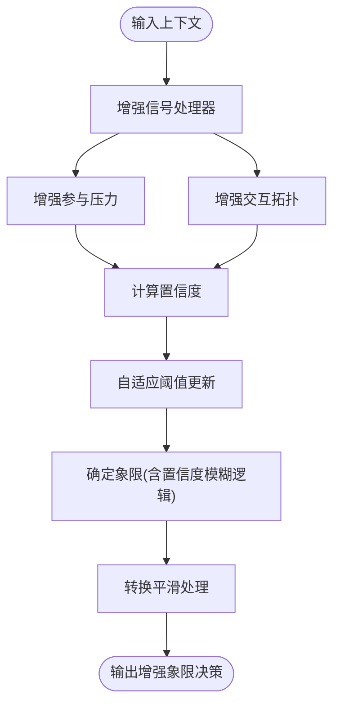

图表来源
- [enhanced_quadrant.lua:22-39](file://mori_memory/module/decision/enhanced_quadrant.lua#L22-L39)
- [enhanced_quadrant.lua:41-62](file://mori_memory/module/decision/enhanced_quadrant.lua#L41-L62)
- [enhanced_quadrant.lua:64-98](file://mori_memory/module/decision/enhanced_quadrant.lua#L64-L98)
- [enhanced_quadrant.lua:100-121](file://mori_memory/module/decision/enhanced_quadrant.lua#L100-L121)
- [enhanced_quadrant.lua:187-211](file://mori_memory/module/decision/enhanced_quadrant.lua#L187-L211)
- [enhanced_quadrant.lua:255-289](file://mori_memory/module/decision/enhanced_quadrant.lua#L255-L289)
- [enhanced_quadrant.lua:291-319](file://mori_memory/module/decision/enhanced_quadrant.lua#L291-L319)

章节来源
- [enhanced_quadrant.lua:5-21](file://mori_memory/module/decision/enhanced_quadrant.lua#L5-L21)
- [enhanced_quadrant.lua:187-211](file://mori_memory/module/decision/enhanced_quadrant.lua#L187-L211)
- [enhanced_quadrant.lua:291-319](file://mori_memory/module/decision/enhanced_quadrant.lua#L291-L319)

### 融合机制（多源信息整合与投票）
- 设计理念：将不同象限的评分进行加权融合，结合环境特征（消息频率、多样性、稳定性、时间特征）与当前象限，生成整体置信度与推理说明。
- 关键步骤：
  - 环境分析：提取频率、多样性、稳定性、时间特征。
  - 权重计算：基础权重归一化，支持环境调整（扩展点）。
  - 加权融合：对每个评分维度执行加权求和。
  - 整体置信度：按象限权重加权平均。
  - 推理生成：汇总各象限推理与环境影响。
- 复杂度：O(M×Q) 融合 M 个评分维度、Q 个象限。

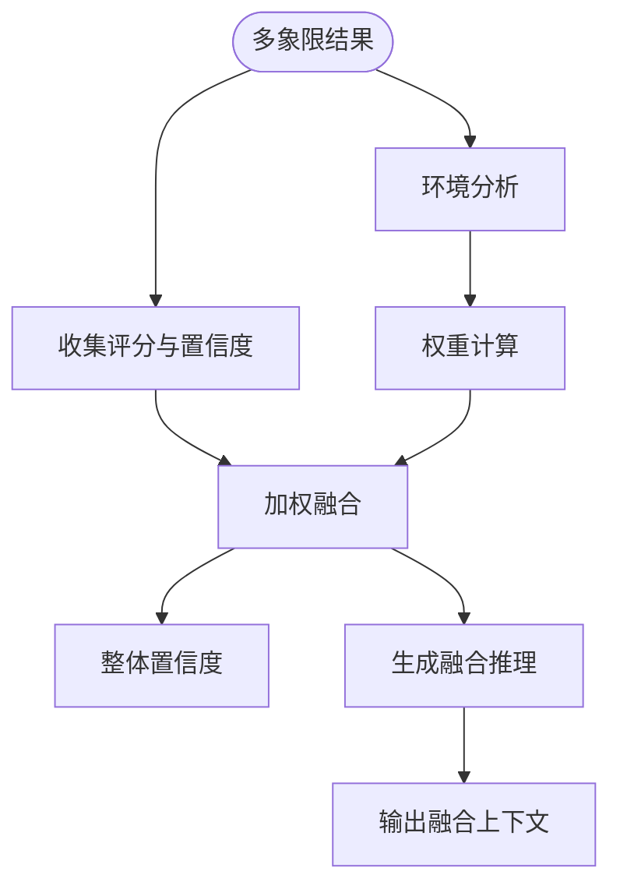

图表来源
- [fusion.lua:132-229](file://mori_memory/module/decision/fusion.lua#L132-L229)
- [fusion.lua:231-269](file://mori_memory/module/decision/fusion.lua#L231-L269)

章节来源
- [fusion.lua:27-72](file://mori_memory/module/decision/fusion.lua#L27-L72)
- [fusion.lua:74-115](file://mori_memory/module/decision/fusion.lua#L74-L115)
- [fusion.lua:132-229](file://mori_memory/module/decision/fusion.lua#L132-L229)

### 评估器（质量评分与个性化调整）
- 设计理念：从上下文中提取关键特征，构建评分通道（语义通道、对等边通道、中性评分），并结合象限权重与稳定性计算置信度。
- 特征提取：
  - 语义相似性、用户连续性、回复线索、提及检测、消息长度/复杂度、时间邻近性、流稳定性。
- 评分通道：
  - 语义通道：综合语义相似性、连续性、长度/复杂度、时间惩罚与稳定性。
  - 对等边通道：回复线索与提及检测之和。
  - 中性评分：语义通道与对等边通道的加权组合。
- 置信度：评分一致性与稳定性加权。
- 复杂度：O(F) 特征提取，O(L) 评分通道计算，L 为通道数。

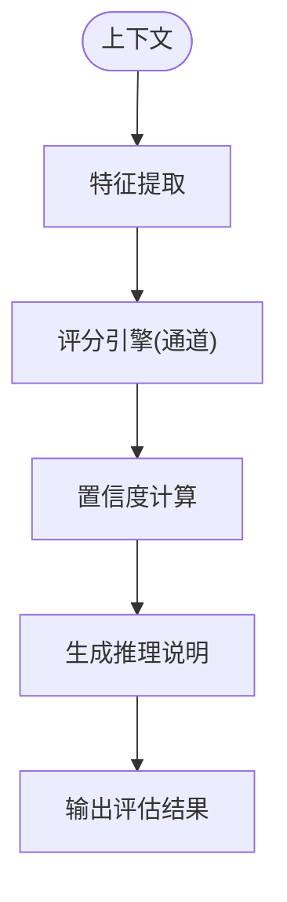

图表来源
- [evaluator.lua:54-66](file://mori_memory/module/decision/evaluator.lua#L54-L66)
- [evaluator.lua:201-215](file://mori_memory/module/decision/evaluator.lua#L201-L215)
- [evaluator.lua:310-325](file://mori_memory/module/decision/evaluator.lua#L310-L325)
- [evaluator.lua:327-353](file://mori_memory/module/decision/evaluator.lua#L327-L353)

章节来源
- [evaluator.lua:27-66](file://mori_memory/module/decision/evaluator.lua#L27-L66)
- [evaluator.lua:172-250](file://mori_memory/module/decision/evaluator.lua#L172-L250)
- [evaluator.lua:310-325](file://mori_memory/module/decision/evaluator.lua#L310-L325)

### 控制器（阈值与响应延迟）
- 设计理念：对维度值进行指数平滑，避免短期波动导致的误判；基于阈值判定象限转换，并在保持期内抑制频繁切换；输出表面参数供策略层与配置层使用。
- 关键参数：
  - 平滑因子、转换保持回合数、表面变化上限。
- 表面参数（示例）：attach_conservatism、peer_signal_trust、hub_fallback_trust、write_conservatism、readout_locality。
- 复杂度：O(1) 单次更新。

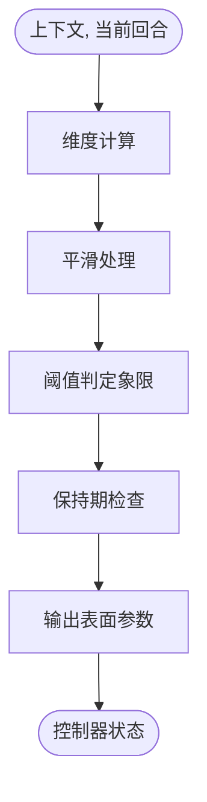

图表来源
- [controller.lua:44-79](file://mori_memory/module/decision/controller.lua#L44-L79)
- [controller.lua:102-116](file://mori_memory/module/decision/controller.lua#L102-L116)
- [controller.lua:118-192](file://mori_memory/module/decision/controller.lua#L118-L192)

章节来源
- [controller.lua:10-25](file://mori_memory/module/decision/controller.lua#L10-L25)
- [controller.lua:31-42](file://mori_memory/module/decision/controller.lua#L31-L42)
- [controller.lua:118-192](file://mori_memory/module/decision/controller.lua#L118-L192)

### 策略层（参数调节）
- 设计理念：严格限定为参数调节，不改变核心路由决策。依据象限类型映射不同的策略参数（如 attach_threshold_offset、pending_margin_multiplier、write_threshold_offset 等），并提供资源分配、提交时机、回忆策略建议。
- 复杂度：O(1) 映射与调整。

章节来源
- [quadrant_policy.lua:47-121](file://mori_memory/module/policy/quadrant_policy.lua#L47-L121)
- [quadrant_policy.lua:193-207](file://mori_memory/module/policy/quadrant_policy.lua#L193-L207)

### 配置层（阈值、权重、响应延迟）
- 设计理念：集中管理运行时参数，涵盖记忆核心、主题图、任务状态、反毒、多流解缠、两轴控制器等。两轴控制器包含平滑因子、转换保持回合、表面变化上限、各类表面参数等。
- 关键配置段落：
  - 两轴控制器启用、开关与参数映射。
  - 象限偏移与间隙/边际偏移。
  - 动态阈值与压力权重。
- 复杂度：O(1) 读取与应用。

章节来源
- [config.lua:348-420](file://mori_memory/module/config.lua#L348-L420)
- [config.lua:492-496](file://mori_memory/module/config.lua#L492-L496)

## 依赖关系分析
- 模块耦合：
  - 维度管理器被象限系统与评估器共同依赖，耦合度高但职责清晰。
  - 增强象限独立于传统象限系统，通过接口对接，降低耦合风险。
  - 融合引擎依赖象限系统输出，形成“多源→融合”的弱耦合。
  - 控制器依赖维度管理器与象限系统，输出表面参数供策略层与配置层使用。
- 外部依赖：
  - util 与 tool 作为通用工具模块被广泛使用。
  - 配置层提供全局参数，策略层与控制器间接依赖。

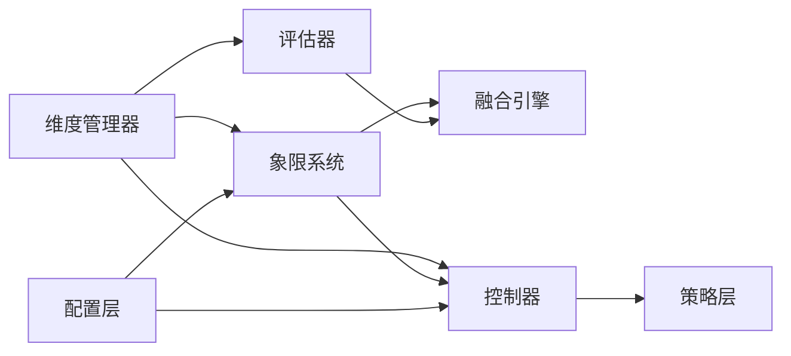

图表来源
- [init.lua:6-18](file://mori_memory/module/decision/init.lua#L6-L18)
- [controller.lua:31-42](file://mori_memory/module/decision/controller.lua#L31-L42)
- [quadrant_policy.lua:145-154](file://mori_memory/module/policy/quadrant_policy.lua#L145-L154)
- [config.lua:366-420](file://mori_memory/module/config.lua#L366-L420)

章节来源
- [init.lua:6-18](file://mori_memory/module/decision/init.lua#L6-L18)

## 性能考量
- 单次评估开销：维度计算 O(1)、象限规则 O(K)、特征提取 O(F)、评分通道 O(L)、融合 O(M×Q)，整体 O(N)。
- 实测性能：测试脚本显示 1000 次评估循环平均耗时约 1–5ms（取决于实现细节），满足实时直播场景需求。
- 优化建议：
  - 缓存维度与规则结果，避免重复计算。
  - 对置信度与阈值更新进行批处理或异步化。
  - 在融合阶段采用向量化操作（若扩展到更高层语言）。

章节来源
- [test_decision_system.lua:162-194](file://test_decision_system.lua#L162-L194)

## 故障排查指南
- 常见问题与定位：
  - 象限抖动：检查控制器平滑因子与保持回合数；参考基准分析脚本的抖动评分与转换次数。
  - 低置信度：检查信号处理器的置信度计算（数据量、稳定性、一致性）；适当放宽阈值或增加窗口大小。
  - 融合偏差：检查权重计算与环境特征权重；确认基础权重归一化。
  - 评估不稳定：检查特征提取器的边界条件与评分通道权重。
- 调试方法：
  - 使用测试脚本逐模块验证（维度→象限→评估→融合→控制器）。
  - 查看基准分析报告（抖动评分、转换次数、空上下文率）。
  - 在配置层调整两轴控制器参数，观察效果。

章节来源
- [controller.lua:102-116](file://mori_memory/module/decision/controller.lua#L102-L116)
- [enhanced_quadrant.lua:100-121](file://mori_memory/module/decision/enhanced_quadrant.lua#L100-L121)
- [fusion.lua:132-229](file://mori_memory/module/decision/fusion.lua#L132-L229)
- [analyze_four_quadrant_jitter.py:569-616](file://mori_memory/scripts/analyze_four_quadrant_jitter.py#L569-L616)

## 结论
该直播决策系统以“两轴四象限”为核心，结合增强信号处理、置信度与自适应阈值、多源融合与评估通道，形成从维度抽象到策略输出的完整闭环。通过策略层与配置层的参数调节，系统具备良好的可调性与鲁棒性。建议在实际部署中结合基准分析持续优化阈值与权重，并关注抖动与延迟指标，以获得更稳定的直播体验。

## 附录

### 决策过程可视化
- 状态转换图（控制器）
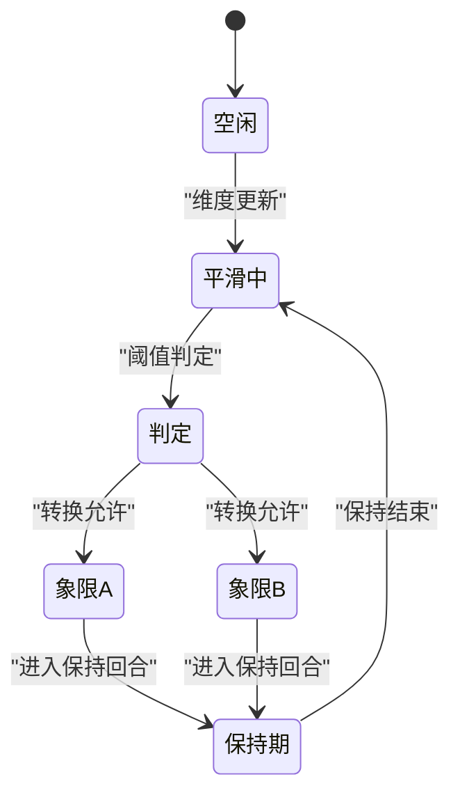

图表来源
- [controller.lua:44-79](file://mori_memory/module/decision/controller.lua#L44-L79)
- [controller.lua:102-116](file://mori_memory/module/decision/controller.lua#L102-L116)

- 决策树（增强象限）
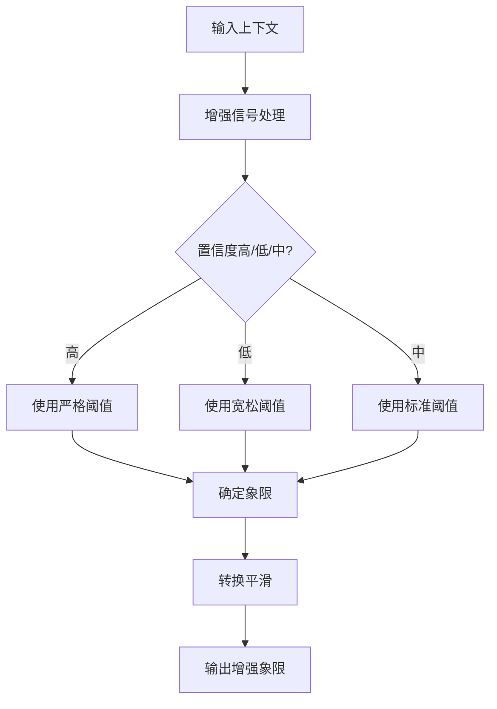

图表来源
- [enhanced_quadrant.lua:255-289](file://mori_memory/module/decision/enhanced_quadrant.lua#L255-L289)
- [enhanced_quadrant.lua:291-319](file://mori_memory/module/decision/enhanced_quadrant.lua#L291-L319)

### 实际决策示例与调试方法
- 示例路径：测试脚本展示了从维度计算、象限确定、规则应用、评估、融合到控制器更新的完整流程。
- 调试要点：
  - 使用测试脚本的性能基准，观察平均耗时与吞吐。
  - 对照基准分析报告，关注抖动评分、转换次数与空上下文率。
  - 在配置层调整两轴控制器参数，逐步收敛到目标性能与稳定性。

章节来源
- [test_decision_system.lua:29-157](file://test_decision_system.lua#L29-L157)
- [analyze_four_quadrant_jitter.py:569-616](file://mori_memory/scripts/analyze_four_quadrant_jitter.py#L569-L616)
- [four_quadrant_jitter_20260326_225905.json:1-200](file://mori_memory/benchmarks/results/four_quadrant_jitter_20260326_225905.json#L1-L200)