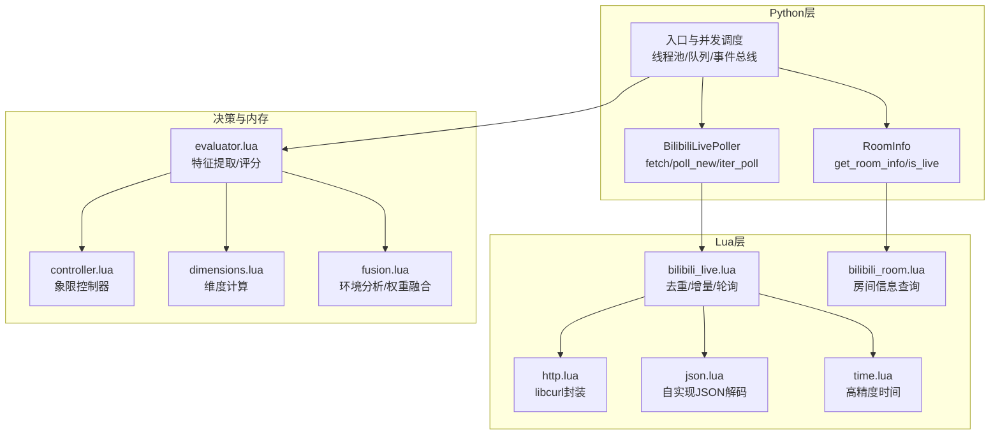
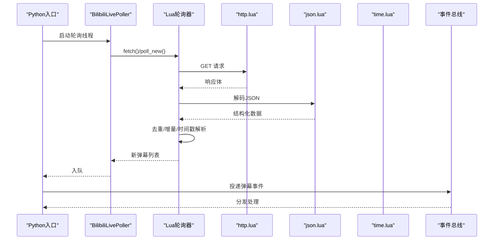
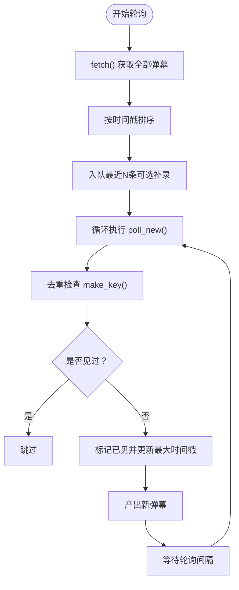
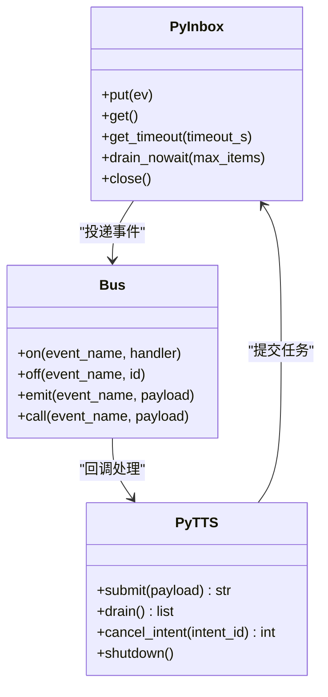
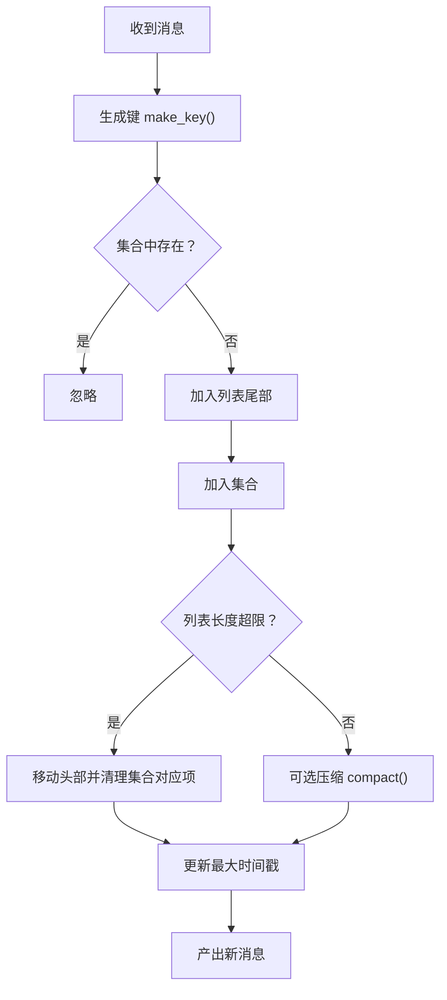
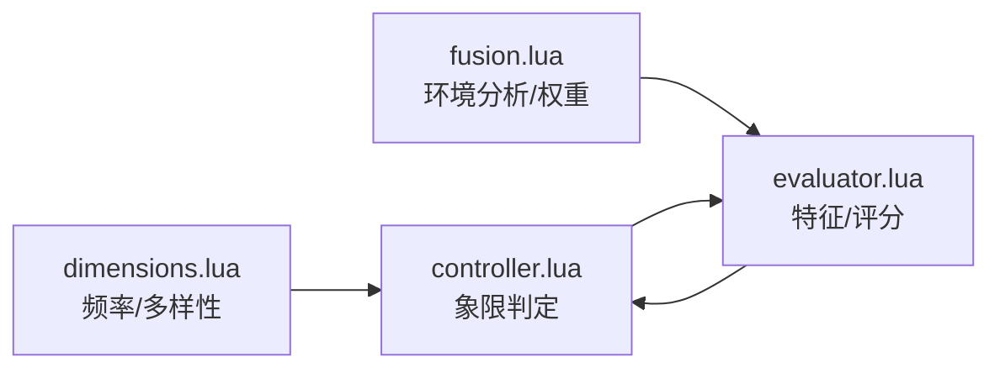
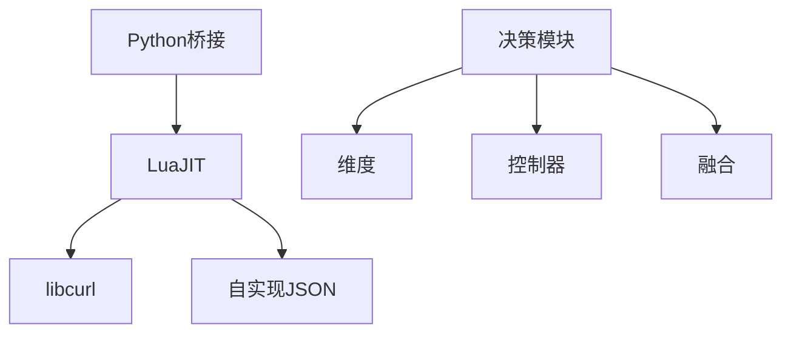

# 弹幕处理系统

<cite>
**本文引用的文件**
- [mori_live_stream/bilibili_live.py](file://mori_live_stream/bilibili_live.py)
- [mori_live_stream/bilibili_room.py](file://mori_live_stream/bilibili_room.py)
- [mori_live_stream/lua/mori_live_stream/bilibili_live.lua](file://mori_live_stream/lua/mori_live_stream/bilibili_live.lua)
- [mori_live_stream/lua/mori_live_stream/bilibili_room.lua](file://mori_live_stream/lua/mori_live_stream/bilibili_room.lua)
- [mori_live_stream/lua/mori_live_stream/http.lua](file://mori_live_stream/lua/mori_live_stream/http.lua)
- [mori_live_stream/lua/mori_live_stream/json.lua](file://mori_live_stream/lua/mori_live_stream/json.lua)
- [mori_live_stream/lua/mori_live_stream/time.lua](file://mori_live_stream/lua/mori_live_stream/time.lua)
- [scripts/capture_bilibili_memory_live.py](file://scripts/capture_bilibili_memory_live.py)
- [mori_runtime/entry.py](file://mori_runtime/entry.py)
- [mori_runtime/lua/mori/app/runtime.lua](file://mori_runtime/lua/mori/app/runtime.lua)
- [mori_runtime/lua/mori/core/bus.lua](file://mori_runtime/lua/mori/core/bus.lua)
- [mori_memory/module/decision/controller.lua](file://mori_memory/module/decision/controller.lua)
- [mori_memory/module/decision/evaluator.lua](file://mori_memory/module/decision/evaluator.lua)
- [mori_memory/module/decision/dimensions.lua](file://mori_memory/module/decision/dimensions.lua)
- [mori_memory/module/decision/fusion.lua](file://mori_memory/module/decision/fusion.lua)
- [mori_memory/scripts/analyze_four_quadrant_jitter.py](file://mori_memory/scripts/analyze_four_quadrant_jitter.py)
</cite>

## 目录
1. [简介](#简介)
2. [项目结构](#项目结构)
3. [核心组件](#核心组件)
4. [架构总览](#架构总览)
5. [详细组件分析](#详细组件分析)
6. [依赖分析](#依赖分析)
7. [性能考虑](#性能考虑)
8. [故障排查指南](#故障排查指南)
9. [结论](#结论)
10. [附录](#附录)

## 简介
本技术文档围绕弹幕处理系统进行深入解析，覆盖弹幕数据获取流程（轮询间隔控制、批量获取、增量更新）、弹幕消息预处理（文本清洗、特殊字符处理、长度限制、格式标准化）、并发处理机制（多线程安全、队列管理、异步处理模式）、弹幕过滤与去重策略（重复检测算法、缓存机制、内存控制）、弹幕统计分析（用户活跃度、关键词提取、情感分析），并提供性能优化建议与API使用示例及错误处理方案。

## 项目结构
弹幕处理系统由三层组成：
- Python层：负责轮询、抓取、入队、并发调度与生命周期管理
- Lua层：负责HTTP请求、JSON解析、时间工具与弹幕去重/增量逻辑
- 决策与内存层：负责上下文编译、记忆注入、象限决策与分析

图表来源
- [mori_live_stream/bilibili_live.py:93-221](file://mori_live_stream/bilibili_live.py#L93-L221)
- [mori_live_stream/bilibili_room.py:93-141](file://mori_live_stream/bilibili_room.py#L93-L141)
- [mori_live_stream/lua/mori_live_stream/bilibili_live.lua:70-242](file://mori_live_stream/lua/mori_live_stream/bilibili_live.lua#L70-L242)
- [mori_live_stream/lua/mori_live_stream/bilibili_room.lua:18-74](file://mori_live_stream/lua/mori_live_stream/bilibili_room.lua#L18-L74)
- [mori_live_stream/lua/mori_live_stream/http.lua:104-186](file://mori_live_stream/lua/mori_live_stream/http.lua#L104-L186)
- [mori_live_stream/lua/mori_live_stream/json.lua:288-303](file://mori_live_stream/lua/mori_live_stream/json.lua#L288-L303)
- [mori_live_stream/lua/mori_live_stream/time.lua:22-32](file://mori_live_stream/lua/mori_live_stream/time.lua#L22-L32)
- [mori_runtime/entry.py:479-580](file://mori_runtime/entry.py#L479-L580)
- [mori_memory/module/decision/evaluator.lua:252-308](file://mori_memory/module/decision/evaluator.lua#L252-L308)
- [mori_memory/module/decision/controller.lua:44-79](file://mori_memory/module/decision/controller.lua#L44-L79)
- [mori_memory/module/decision/dimensions.lua:121-154](file://mori_memory/module/decision/dimensions.lua#L121-L154)
- [mori_memory/module/decision/fusion.lua:37-72](file://mori_memory/module/decision/fusion.lua#L37-L72)

章节来源
- [mori_live_stream/bilibili_live.py:1-221](file://mori_live_stream/bilibili_live.py#L1-L221)
- [mori_live_stream/bilibili_room.py:1-141](file://mori_live_stream/bilibili_room.py#L1-L141)
- [mori_live_stream/lua/mori_live_stream/bilibili_live.lua:1-242](file://mori_live_stream/lua/mori_live_stream/bilibili_live.lua#L1-L242)
- [mori_live_stream/lua/mori_live_stream/bilibili_room.lua:1-74](file://mori_live_stream/lua/mori_live_stream/bilibili_room.lua#L1-L74)
- [mori_live_stream/lua/mori_live_stream/http.lua:1-190](file://mori_live_stream/lua/mori_live_stream/http.lua#L1-L190)
- [mori_live_stream/lua/mori_live_stream/json.lua:1-307](file://mori_live_stream/lua/mori_live_stream/json.lua#L1-L307)
- [mori_live_stream/lua/mori_live_stream/time.lua:1-38](file://mori_live_stream/lua/mori_live_stream/time.lua#L1-L38)
- [mori_runtime/entry.py:479-580](file://mori_runtime/entry.py#L479-L580)

## 核心组件
- 弹幕轮询器（Python）：提供一次性批量抓取与增量轮询接口，并支持迭代式持续轮询
- 弹幕轮询器（Lua）：实现HTTP请求、JSON解析、时间戳解析、去重与增量更新
- 房间信息查询：获取直播状态、在线人数、标题等
- 运行时入口：启动线程、入队弹幕、处理离线退出、并发调度
- 决策与内存：特征提取、评分、象限控制、权重融合与上下文编译

章节来源
- [mori_live_stream/bilibili_live.py:93-221](file://mori_live_stream/bilibili_live.py#L93-L221)
- [mori_live_stream/lua/mori_live_stream/bilibili_live.lua:70-242](file://mori_live_stream/lua/mori_live_stream/bilibili_live.lua#L70-L242)
- [mori_live_stream/bilibili_room.py:93-141](file://mori_live_stream/bilibili_room.py#L93-L141)
- [mori_runtime/entry.py:479-580](file://mori_runtime/entry.py#L479-L580)
- [mori_memory/module/decision/evaluator.lua:252-308](file://mori_memory/module/decision/evaluator.lua#L252-L308)

## 架构总览
弹幕从B站接口拉取后，经Lua层解析与去重，进入Python层队列，随后被运行时消费并送入记忆系统进行上下文编译与记忆注入。同时，决策模块对消息进行特征提取与评分，驱动象限切换与权重融合。

图表来源
- [mori_runtime/entry.py:479-580](file://mori_runtime/entry.py#L479-L580)
- [mori_live_stream/bilibili_live.py:147-205](file://mori_live_stream/bilibili_live.py#L147-L205)
- [mori_live_stream/lua/mori_live_stream/bilibili_live.lua:149-237](file://mori_live_stream/lua/mori_live_stream/bilibili_live.lua#L149-L237)
- [mori_live_stream/lua/mori_live_stream/http.lua:104-186](file://mori_live_stream/lua/mori_live_stream/http.lua#L104-L186)
- [mori_live_stream/lua/mori_live_stream/json.lua:288-303](file://mori_live_stream/lua/mori_live_stream/json.lua#L288-L303)
- [mori_live_stream/lua/mori_live_stream/time.lua:22-32](file://mori_live_stream/lua/mori_live_stream/time.lua#L22-L32)

## 详细组件分析

### 弹幕数据获取与轮询
- 轮询间隔控制：通过Python侧的定时器与sleep实现，可配置轮询间隔秒数
- 批量获取机制：fetch一次性返回当前全部弹幕，便于首次“补录”
- 增量更新策略：poll_new基于时间戳与去重集合仅返回新消息，并维护最大时间戳

图表来源
- [mori_live_stream/bilibili_live.py:147-205](file://mori_live_stream/bilibili_live.py#L147-L205)
- [mori_live_stream/lua/mori_live_stream/bilibili_live.lua:149-237](file://mori_live_stream/lua/mori_live_stream/bilibili_live.lua#L149-L237)

章节来源
- [mori_live_stream/bilibili_live.py:147-221](file://mori_live_stream/bilibili_live.py#L147-L221)
- [mori_live_stream/lua/mori_live_stream/bilibili_live.lua:70-242](file://mori_live_stream/lua/mori_live_stream/bilibili_live.lua#L70-L242)

### 弹幕消息预处理
- 文本清洗：去除首尾空白，保留非空昵称与文本
- 特殊字符处理：JSON解码器支持转义序列与Unicode代理对
- 长度限制：在上游逻辑中通过截断或过滤实现（例如上下文预览长度限制）
- 格式标准化：统一时间戳解析为Unix时间，构造标准化字段

章节来源
- [mori_live_stream/bilibili_live.py:153-175](file://mori_live_stream/bilibili_live.py#L153-L175)
- [mori_live_stream/lua/mori_live_stream/json.lua:56-139](file://mori_live_stream/lua/mori_live_stream/json.lua#L56-L139)
- [mori_live_stream/lua/mori_live_stream/bilibili_live.lua:11-29](file://mori_live_stream/lua/mori_live_stream/bilibili_live.lua#L11-L29)

### 并发处理机制
- 多线程安全：Python端使用线程池与队列，带容量上限与丢弃策略
- 队列管理：固定大小队列，满载时尝试弹出旧项再入队
- 异步处理模式：事件总线分发，Lua侧回调安全包装

图表来源
- [mori_runtime/entry.py:89-144](file://mori_runtime/entry.py#L89-L144)
- [mori_runtime/entry.py:203-412](file://mori_runtime/entry.py#L203-L412)
- [mori_runtime/lua/mori/core/bus.lua:14-93](file://mori_runtime/lua/mori/core/bus.lua#L14-L93)

章节来源
- [mori_runtime/entry.py:89-144](file://mori_runtime/entry.py#L89-L144)
- [mori_runtime/entry.py:203-412](file://mori_runtime/entry.py#L203-L412)
- [mori_runtime/lua/mori/core/bus.lua:1-93](file://mori_runtime/lua/mori/core/bus.lua#L1-L93)

### 弹幕过滤与去重策略
- 重复检测算法：基于组合键（用户ID、时间线、昵称、文本）生成唯一键
- 缓存机制：环形去重列表与哈希集合，维持固定窗口大小
- 内存控制：当头部偏移过大时压缩列表，避免无限增长

图表来源
- [mori_live_stream/lua/mori_live_stream/bilibili_live.lua:59-147](file://mori_live_stream/lua/mori_live_stream/bilibili_live.lua#L59-L147)

章节来源
- [mori_live_stream/lua/mori_live_stream/bilibili_live.lua:59-147](file://mori_live_stream/lua/mori_live_stream/bilibili_live.lua#L59-L147)

### 弹幕统计分析与情感分析
- 用户活跃度：通过维度模块计算消息频率与参与者多样性
- 关键词提取：在上下文编译阶段抽取话题与事实标识
- 情感分析：通过特征提取器结合语义相似性与回复线索进行综合评分

图表来源
- [mori_memory/module/decision/dimensions.lua:121-154](file://mori_memory/module/decision/dimensions.lua#L121-L154)
- [mori_memory/module/decision/controller.lua:44-79](file://mori_memory/module/decision/controller.lua#L44-L79)
- [mori_memory/module/decision/evaluator.lua:252-308](file://mori_memory/module/decision/evaluator.lua#L252-L308)
- [mori_memory/module/decision/fusion.lua:37-72](file://mori_memory/module/decision/fusion.lua#L37-L72)

章节来源
- [mori_memory/module/decision/dimensions.lua:121-154](file://mori_memory/module/decision/dimensions.lua#L121-L154)
- [mori_memory/module/decision/evaluator.lua:54-88](file://mori_memory/module/decision/evaluator.lua#L54-L88)
- [mori_memory/module/decision/controller.lua:44-79](file://mori_memory/module/decision/controller.lua#L44-L79)
- [mori_memory/module/decision/fusion.lua:37-72](file://mori_memory/module/decision/fusion.lua#L37-L72)

### API使用示例与错误处理
- 使用示例
  - Python侧轮询：调用轮询器的fetch/poll_new，迭代器支持自定义间隔
  - 运行时入口：启动线程池，设置轮询间隔、补录数量、离线退出策略
  - 决策与内存：通过上下文元数据触发编译与记忆注入
- 错误处理
  - Lua层：HTTP失败、JSON解码失败、房间接口异常均返回错误字符串
  - Python层：捕获异常并记录，避免中断主流程

章节来源
- [mori_live_stream/bilibili_live.py:147-205](file://mori_live_stream/bilibili_live.py#L147-L205)
- [mori_runtime/entry.py:479-580](file://mori_runtime/entry.py#L479-L580)
- [mori_live_stream/lua/mori_live_stream/bilibili_live.lua:149-175](file://mori_live_stream/lua/mori_live_stream/bilibili_live.lua#L149-L175)
- [mori_live_stream/lua/mori_live_stream/http.lua:104-186](file://mori_live_stream/lua/mori_live_stream/http.lua#L104-L186)
- [mori_live_stream/lua/mori_live_stream/json.lua:288-303](file://mori_live_stream/lua/mori_live_stream/json.lua#L288-L303)

## 依赖分析
- Python依赖LuaJIT运行时，加载Lua模块路径，桥接Python与Lua对象
- Lua层依赖libcurl进行HTTP请求，自实现JSON解码器，提供高精度时间
- 决策模块相互协作，形成特征提取—评分—象限控制—权重融合的闭环

图表来源
- [mori_live_stream/bilibili_live.py:110-145](file://mori_live_stream/bilibili_live.py#L110-L145)
- [mori_live_stream/lua/mori_live_stream/http.lua:1-190](file://mori_live_stream/lua/mori_live_stream/http.lua#L1-L190)
- [mori_live_stream/lua/mori_live_stream/json.lua:1-307](file://mori_live_stream/lua/mori_live_stream/json.lua#L1-L307)
- [mori_memory/module/decision/evaluator.lua:252-308](file://mori_memory/module/decision/evaluator.lua#L252-L308)
- [mori_memory/module/decision/controller.lua:44-79](file://mori_memory/module/decision/controller.lua#L44-L79)
- [mori_memory/module/decision/fusion.lua:37-72](file://mori_memory/module/decision/fusion.lua#L37-L72)

章节来源
- [mori_live_stream/bilibili_live.py:110-145](file://mori_live_stream/bilibili_live.py#L110-L145)
- [mori_live_stream/lua/mori_live_stream/http.lua:1-190](file://mori_live_stream/lua/mori_live_stream/http.lua#L1-L190)
- [mori_live_stream/lua/mori_live_stream/json.lua:1-307](file://mori_live_stream/lua/mori_live_stream/json.lua#L1-L307)
- [mori_memory/module/decision/evaluator.lua:252-308](file://mori_memory/module/decision/evaluator.lua#L252-L308)

## 性能考虑
- 批量处理：首次启动使用fetch进行批量补录，减少后续轮询压力
- 缓存策略：Lua端去重窗口固定，避免内存无限增长；Python端队列容量与丢弃策略保障吞吐
- 网络优化：libcurl复用连接、设置超时与编码接受，降低延迟与失败率
- 决策开销：特征提取与评分在Lua侧完成，Python侧仅做桥接与调度

## 故障排查指南
- HTTP请求失败：检查libcurl可用性、URL与超时设置
- JSON解码失败：确认响应体非空且格式正确
- 弹幕为空或重复：检查昵称/文本非空校验与去重键生成
- 离线退出：运行时定期检查房间状态，非直播时发送退出事件

章节来源
- [mori_live_stream/lua/mori_live_stream/http.lua:104-186](file://mori_live_stream/lua/mori_live_stream/http.lua#L104-L186)
- [mori_live_stream/lua/mori_live_stream/json.lua:288-303](file://mori_live_stream/lua/mori_live_stream/json.lua#L288-L303)
- [mori_live_stream/bilibili_live.py:163-174](file://mori_live_stream/bilibili_live.py#L163-L174)
- [mori_runtime/entry.py:539-556](file://mori_runtime/entry.py#L539-L556)

## 结论
该弹幕处理系统通过Python与Lua的协同，实现了高效、稳定的弹幕采集与预处理，并结合去重与增量更新策略保障实时性与准确性。配合决策与内存模块，系统能够对弹幕进行统计分析与上下文编译，支撑更高级的交互与记忆能力。通过合理的并发与缓存策略，系统在高负载下仍能保持稳定与低延迟。

## 附录
- 实时运行脚本：使用运行时入口启动弹幕采集与处理流程
- 决策分析脚本：对运行轨迹进行象限抖动与性能指标分析

章节来源
- [mori_runtime/entry.py:626-800](file://mori_runtime/entry.py#L626-L800)
- [mori_memory/scripts/analyze_four_quadrant_jitter.py:1-605](file://mori_memory/scripts/analyze_four_quadrant_jitter.py#L1-L605)