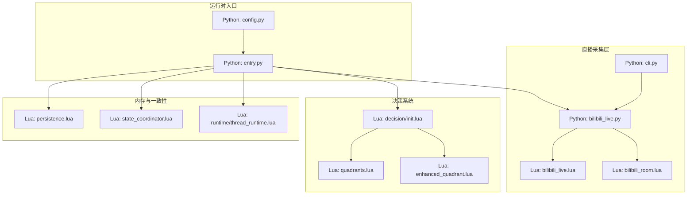
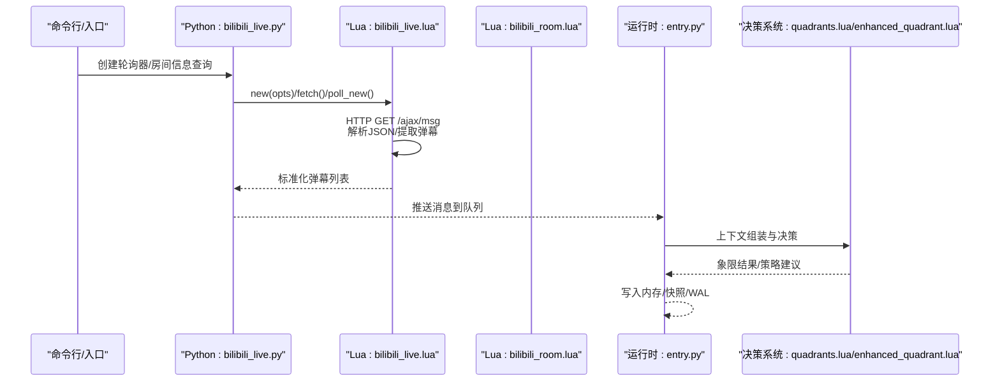
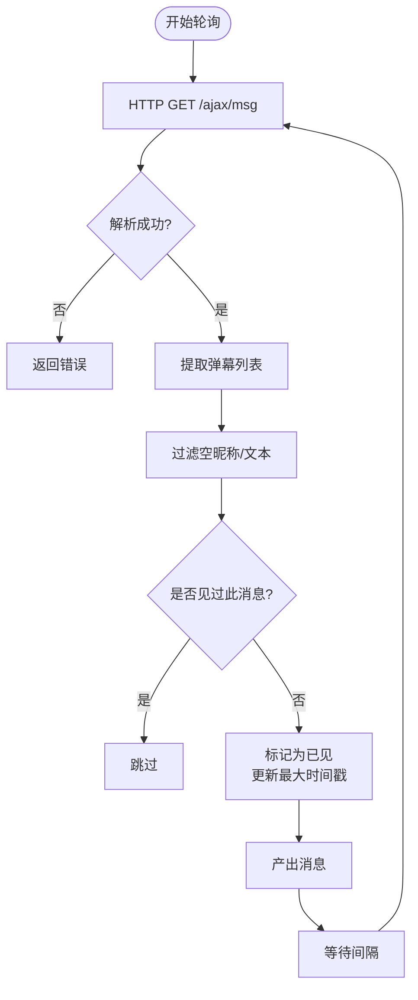
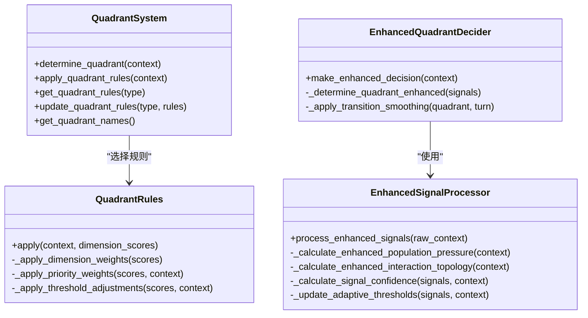
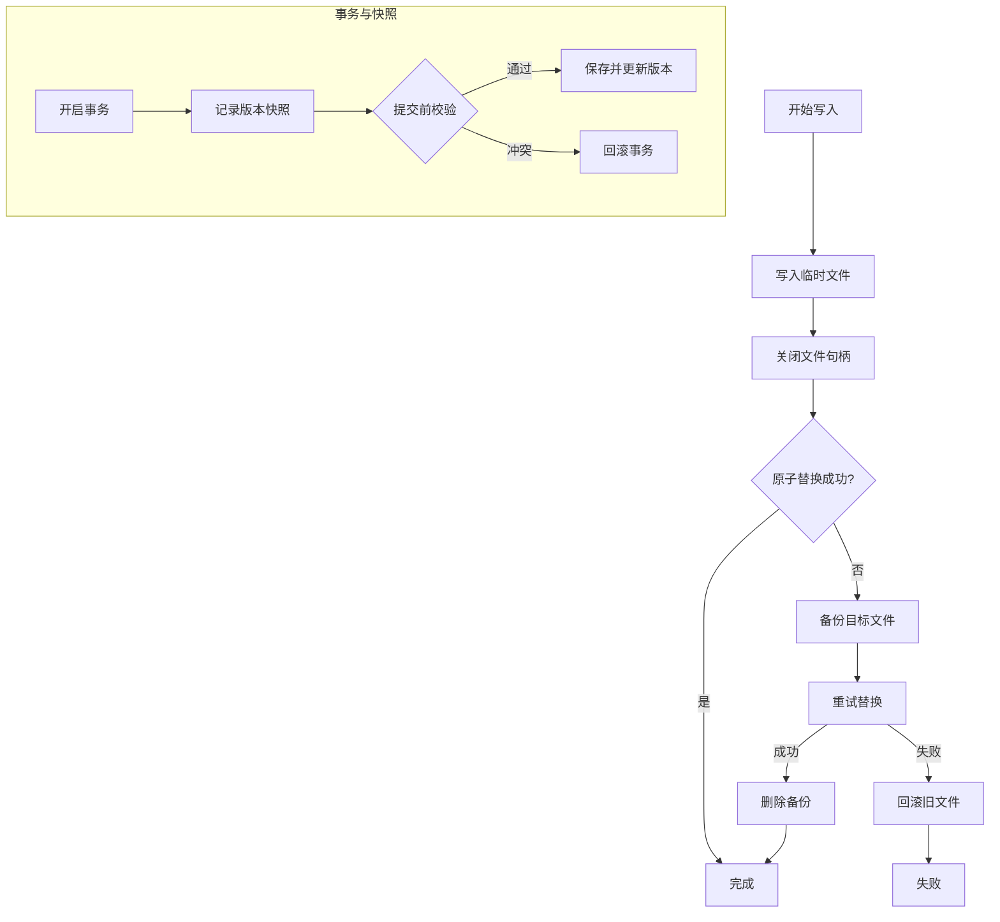
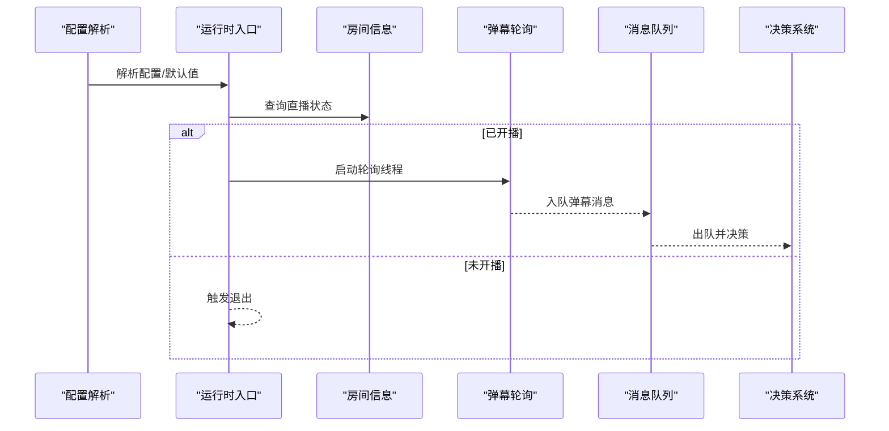
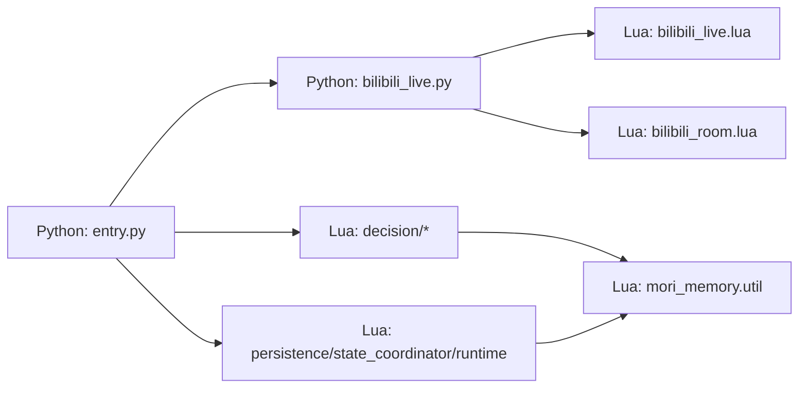

# 直播处理

<cite>
**本文引用的文件**
- [mori_live_stream/bilibili_live.py](file://mori_live_stream/bilibili_live.py)
- [mori_live_stream/lua/mori_live_stream/bilibili_live.lua](file://mori_live_stream/lua/mori_live_stream/bilibili_live.lua)
- [mori_live_stream/lua/mori_live_stream/bilibili_room.lua](file://mori_live_stream/lua/mori_live_stream/bilibili_room.lua)
- [mori_live_stream/README.md](file://mori_live_stream/README.md)
- [mori_live_stream/cli.py](file://mori_live_stream/cli.py)
- [mori_memory/module/decision/init.lua](file://mori_memory/module/decision/init.lua)
- [mori_memory/module/decision/quadrants.lua](file://mori_memory/module/decision/quadrants.lua)
- [mori_memory/module/decision/enhanced_quadrant.lua](file://mori_memory/module/decision/enhanced_quadrant.lua)
- [mori_memory/module/persistence.lua](file://mori_memory/module/persistence.lua)
- [mori_memory/module/state_coordinator.lua](file://mori_memory/module/state_coordinator.lua)
- [mori_memory/module/runtime/thread_runtime.lua](file://mori_memory/module/runtime/thread_runtime.lua)
- [mori_runtime/entry.py](file://mori_runtime/entry.py)
- [mori_runtime/config.py](file://mori_runtime/config.py)
</cite>

## 目录
1. [简介](#简介)
2. [项目结构](#项目结构)
3. [核心组件](#核心组件)
4. [架构总览](#架构总览)
5. [组件详解](#组件详解)
6. [依赖关系分析](#依赖关系分析)
7. [性能考量](#性能考量)
8. [故障处理与异常恢复](#故障处理与异常恢复)
9. [结论](#结论)
10. [附录](#附录)

## 简介
本文件面向Mori直播处理系统，聚焦Bilibili直播的集成与运行时处理链路，涵盖房间信息获取、弹幕轮询、实时消息处理、弹幕去重与并发控制、决策系统（四象限分析与增强象限）、直播数据的持久化与一致性保障、性能优化策略以及配置参数与扩展接口。文档旨在帮助开发者快速理解系统设计、实现细节与最佳实践。

## 项目结构
- 直播采集层：Python桥接与LuaJIT核心协同，提供B站弹幕轮询与房间信息查询。
- 决策系统层：基于Lua实现的四象限分析与增强象限决策，支持维度权重与阈值调整。
- 内存与一致性层：提供原子写、快照、WAL、版本向量与事务一致性保障。
- 运行时入口：统一的Python入口，负责消息队列、TTS并发、B站采集线程与配置解析。

**图示来源**
- [mori_live_stream/bilibili_live.py:93-221](file://mori_live_stream/bilibili_live.py#L93-L221)
- [mori_live_stream/lua/mori_live_stream/bilibili_live.lua:70-242](file://mori_live_stream/lua/mori_live_stream/bilibili_live.lua#L70-L242)
- [mori_live_stream/lua/mori_live_stream/bilibili_room.lua:18-74](file://mori_live_stream/lua/mori_live_stream/bilibili_room.lua#L18-L74)
- [mori_live_stream/cli.py:39-58](file://mori_live_stream/cli.py#L39-L58)
- [mori_runtime/entry.py:479-580](file://mori_runtime/entry.py#L479-L580)
- [mori_runtime/config.py:204-270](file://mori_runtime/config.py#L204-L270)
- [mori_memory/module/decision/init.lua:1-21](file://mori_memory/module/decision/init.lua#L1-L21)
- [mori_memory/module/decision/quadrants.lua:207-285](file://mori_memory/module/decision/quadrants.lua#L207-L285)
- [mori_memory/module/decision/enhanced_quadrant.lua:213-335](file://mori_memory/module/decision/enhanced_quadrant.lua#L213-L335)
- [mori_memory/module/persistence.lua:25-97](file://mori_memory/module/persistence.lua#L25-L97)
- [mori_memory/module/state_coordinator.lua:14-302](file://mori_memory/module/state_coordinator.lua#L14-L302)
- [mori_memory/module/runtime/thread_runtime.lua:23-260](file://mori_memory/module/runtime/thread_runtime.lua#L23-L260)

**章节来源**
- [mori_live_stream/README.md:1-26](file://mori_live_stream/README.md#L1-L26)

## 核心组件
- B站弹幕轮询器（Python桥接 + LuaJIT核心）
  - 提供房间信息查询、弹幕拉取、增量轮询、去重与时间戳推进。
- 决策系统（四象限与增强象限）
  - 基于维度权重与阈值调整，动态确定互动模式并输出策略建议。
- 内存与一致性保障
  - 原子写、快照、WAL、版本向量与事务一致性，确保多模块状态一致。
- 运行时入口
  - 统一配置解析、B站采集线程、消息队列、TTS并发与生命周期管理。

**章节来源**
- [mori_live_stream/bilibili_live.py:93-221](file://mori_live_stream/bilibili_live.py#L93-L221)
- [mori_live_stream/lua/mori_live_stream/bilibili_live.lua:70-242](file://mori_live_stream/lua/mori_live_stream/bilibili_live.lua#L70-L242)
- [mori_memory/module/decision/quadrants.lua:207-285](file://mori_memory/module/decision/quadrants.lua#L207-L285)
- [mori_memory/module/decision/enhanced_quadrant.lua:213-335](file://mori_memory/module/decision/enhanced_quadrant.lua#L213-L335)
- [mori_memory/module/persistence.lua:25-97](file://mori_memory/module/persistence.lua#L25-L97)
- [mori_memory/module/state_coordinator.lua:14-302](file://mori_memory/module/state_coordinator.lua#L14-L302)
- [mori_runtime/entry.py:479-580](file://mori_runtime/entry.py#L479-L580)

## 架构总览
下图展示从B站采集到运行时处理的关键路径：Python桥接调用LuaJIT核心进行HTTP请求与JSON解析，产出标准化弹幕消息；运行时入口将消息注入内部队列，驱动决策系统与内存模块，并在必要时触发TTS合成与输出。

**图示来源**
- [mori_live_stream/bilibili_live.py:147-205](file://mori_live_stream/bilibili_live.py#L147-L205)
- [mori_live_stream/lua/mori_live_stream/bilibili_live.lua:149-237](file://mori_live_stream/lua/mori_live_stream/bilibili_live.lua#L149-L237)
- [mori_live_stream/lua/mori_live_stream/bilibili_room.lua:18-71](file://mori_live_stream/lua/mori_live_stream/bilibili_room.lua#L18-L71)
- [mori_runtime/entry.py:479-580](file://mori_runtime/entry.py#L479-L580)
- [mori_memory/module/decision/quadrants.lua:227-264](file://mori_memory/module/decision/quadrants.lua#L227-L264)
- [mori_memory/module/decision/enhanced_quadrant.lua:227-253](file://mori_memory/module/decision/enhanced_quadrant.lua#L227-L253)

## 组件详解

### B站弹幕轮询与去重（Python桥接 + LuaJIT核心）
- 房间信息获取
  - 通过房间ID调用房间信息接口，返回直播状态、标题、在线人数等。
- 弹幕轮询
  - 使用AJAX接口按房间ID拉取弹幕列表，解析JSON并标准化字段（昵称、文本、时间线、时间戳、原始数据）。
- 增量轮询与去重
  - 基于时间戳与键集合判定新消息，维护固定大小的去重环形缓冲区，避免重复推送与内存膨胀。
- 并发与超时
  - Python侧提供迭代器，按间隔轮询；Lua侧设置HTTP超时，失败时返回错误信息。

**图示来源**
- [mori_live_stream/lua/mori_live_stream/bilibili_live.lua:149-237](file://mori_live_stream/lua/mori_live_stream/bilibili_live.lua#L149-L237)
- [mori_live_stream/bilibili_live.py:147-205](file://mori_live_stream/bilibili_live.py#L147-L205)

**章节来源**
- [mori_live_stream/lua/mori_live_stream/bilibili_room.lua:18-71](file://mori_live_stream/lua/mori_live_stream/bilibili_room.lua#L18-L71)
- [mori_live_stream/lua/mori_live_stream/bilibili_live.lua:70-242](file://mori_live_stream/lua/mori_live_stream/bilibili_live.lua#L70-L242)
- [mori_live_stream/bilibili_live.py:93-221](file://mori_live_stream/bilibili_live.py#L93-L221)

### 决策系统：四象限分析与增强象限
- 四象限系统
  - 基于“参与压力”和“交互拓扑”两个维度，划分低/高人口与广播/对等两类象限，每象限定义不同的维度权重与阈值调整。
- 增强象限
  - 引入自适应阈值、信号置信度与转换平滑，结合历史信号稳定性与环境一致性，提升分类鲁棒性与平滑度。
- 输出
  - 返回当前象限、加权得分、阈值调整与坐标历史，便于策略适配与可视化。

**图示来源**
- [mori_memory/module/decision/quadrants.lua:207-285](file://mori_memory/module/decision/quadrants.lua#L207-L285)
- [mori_memory/module/decision/enhanced_quadrant.lua:213-335](file://mori_memory/module/decision/enhanced_quadrant.lua#L213-L335)

**章节来源**
- [mori_memory/module/decision/init.lua:1-21](file://mori_memory/module/decision/init.lua#L1-L21)
- [mori_memory/module/decision/quadrants.lua:1-285](file://mori_memory/module/decision/quadrants.lua#L1-L285)
- [mori_memory/module/decision/enhanced_quadrant.lua:1-335](file://mori_memory/module/decision/enhanced_quadrant.lua#L1-L335)

### 内存与一致性保障
- 原子写与快照
  - 原子替换策略保证写入过程中的数据一致性；临时文件写入后替换目标文件，失败时回滚。
- 版本向量与事务
  - 维护模块版本向量，开启事务时记录快照，提交前校验一致性，冲突则回滚。
- WAL与检查点
  - 运行时将状态变更写入WAL，周期性创建检查点并记录恢复日志，支持自动一致性维护。

**图示来源**
- [mori_memory/module/persistence.lua:25-97](file://mori_memory/module/persistence.lua#L25-L97)
- [mori_memory/module/state_coordinator.lua:74-143](file://mori_memory/module/state_coordinator.lua#L74-L143)
- [mori_memory/module/runtime/thread_runtime.lua:110-152](file://mori_memory/module/runtime/thread_runtime.lua#L110-L152)

**章节来源**
- [mori_memory/module/persistence.lua:1-97](file://mori_memory/module/persistence.lua#L1-L97)
- [mori_memory/module/state_coordinator.lua:1-302](file://mori_memory/module/state_coordinator.lua#L1-L302)
- [mori_memory/module/runtime/thread_runtime.lua:1-260](file://mori_memory/module/runtime/thread_runtime.lua#L1-L260)

### 运行时入口与B站集成
- 配置解析
  - 支持从配置文件加载通用、CLI、VTuber、Love2D、Inochi等多套默认参数，路径相对解析与别名映射。
- B站采集线程
  - 可选“补录最近N条”、离线退出、轮询间隔与直播状态检查；将消息注入内部队列，携带用户ID、时间线与优先级。
- 消息队列与并发
  - Python端使用队列承载消息，支持丢弃与溢出保护；TTS线程池并发执行，异步drain完成的任务。

**图示来源**
- [mori_runtime/config.py:204-270](file://mori_runtime/config.py#L204-L270)
- [mori_runtime/entry.py:479-580](file://mori_runtime/entry.py#L479-L580)
- [mori_live_stream/bilibili_room.py](file://mori_live_stream/bilibili_room.py/bilibili_room.py)

**章节来源**
- [mori_runtime/config.py:1-270](file://mori_runtime/config.py#L1-L270)
- [mori_runtime/entry.py:479-580](file://mori_runtime/entry.py#L479-L580)

## 依赖关系分析
- Python桥接依赖LuaJIT运行时与libcurl，通过lupa调用Lua模块。
- 决策系统依赖内存工具与配置模块，提供维度计算与上下文融合。
- 内存与一致性模块相互协作，共同保障状态一致性与可恢复性。
- 运行时入口同时依赖直播采集、决策系统与内存模块，形成闭环。

**图示来源**
- [mori_live_stream/bilibili_live.py:109-145](file://mori_live_stream/bilibili_live.py#L109-L145)
- [mori_live_stream/lua/mori_live_stream/bilibili_live.lua:125-141](file://mori_live_stream/lua/mori_live_stream/bilibili_live.lua#L125-L141)
- [mori_runtime/entry.py:414-438](file://mori_runtime/entry.py#L414-L438)
- [mori_memory/module/decision/init.lua:6-11](file://mori_memory/module/decision/init.lua#L6-L11)
- [mori_memory/module/persistence.lua:1-97](file://mori_memory/module/persistence.lua#L1-L97)
- [mori_memory/module/state_coordinator.lua:1-302](file://mori_memory/module/state_coordinator.lua#L1-L302)
- [mori_memory/module/runtime/thread_runtime.lua:1-260](file://mori_memory/module/runtime/thread_runtime.lua#L1-L260)

**章节来源**
- [mori_live_stream/bilibili_live.py:109-145](file://mori_live_stream/bilibili_live.py#L109-L145)
- [mori_live_stream/lua/mori_live_stream/bilibili_live.lua:125-141](file://mori_live_stream/lua/mori_live_stream/bilibili_live.lua#L125-L141)
- [mori_runtime/entry.py:414-438](file://mori_runtime/entry.py#L414-L438)

## 性能考量
- 轮询频率控制
  - Python侧提供轮询间隔参数，Lua侧设置HTTP超时，避免频繁请求导致限流。
- 内存管理
  - Lua侧采用固定大小去重环形缓冲区，超过阈值自动淘汰旧键并压缩头部，降低内存占用。
- 网络优化
  - 设置合理的User-Agent与Referer头，减少被拦截风险；对错误响应进行快速失败与错误信息透传。
- 并发与背压
  - Python队列设置上限，满载时丢弃旧消息；TTS线程池并发执行，drain异步回收任务结果。

**章节来源**
- [mori_live_stream/bilibili_live.py:208-221](file://mori_live_stream/bilibili_live.py#L208-L221)
- [mori_live_stream/lua/mori_live_stream/bilibili_live.lua:104-147](file://mori_live_stream/lua/mori_live_stream/bilibili_live.lua#L104-L147)
- [mori_runtime/entry.py:89-144](file://mori_runtime/entry.py#L89-L144)

## 故障处理与异常恢复
- 弹幕轮询错误
  - HTTP失败、JSON解码失败、接口返回非零码时，返回明确错误信息，避免崩溃传播。
- 原子写失败回滚
  - 原子替换失败时，尝试备份并回滚，确保数据一致性。
- 事务冲突与回滚
  - 提交前校验版本向量，冲突即回滚事务并记录问题。
- WAL与检查点
  - 运行时将状态变更写入WAL，周期性创建检查点并记录恢复日志，支持自动一致性维护与恢复验证。

**章节来源**
- [mori_live_stream/lua/mori_live_stream/bilibili_live.lua:149-175](file://mori_live_stream/lua/mori_live_stream/bilibili_live.lua#L149-L175)
- [mori_memory/module/persistence.lua:25-97](file://mori_memory/module/persistence.lua#L25-L97)
- [mori_memory/module/state_coordinator.lua:74-143](file://mori_memory/module/state_coordinator.lua#L74-L143)
- [mori_memory/module/runtime/thread_runtime.lua:110-152](file://mori_memory/module/runtime/thread_runtime.lua#L110-L152)

## 结论
本系统通过“Python桥接 + LuaJIT核心”的组合，实现了对B站直播的稳定采集与高效处理；结合四象限与增强象限的决策机制，能够根据互动特征动态调整策略；通过原子写、快照、WAL与版本向量等机制，保障了多模块状态的一致性与可恢复性。配合可调的轮询间隔、内存管理与并发控制，系统在性能与可靠性之间取得良好平衡。

## 附录

### 配置参数与扩展接口
- B站采集相关
  - 房间ID/URL、轮询间隔、是否补录历史、离线退出、直播状态检查间隔。
- 运行时与TTS
  - 配置文件路径、工作目录、模型路径、上下文长度、采样参数、TTS后端与参数。
- 扩展接口
  - 决策系统模块导出维度管理、象限系统、评估器、控制器与上下文融合引擎。
  - 内存模块提供原子写、快照、WAL与状态协调器接口。

**章节来源**
- [mori_runtime/config.py:204-270](file://mori_runtime/config.py#L204-L270)
- [mori_runtime/entry.py:582-794](file://mori_runtime/entry.py#L582-L794)
- [mori_live_stream/README.md:11-26](file://mori_live_stream/README.md#L11-L26)
- [mori_memory/module/decision/init.lua:13-21](file://mori_memory/module/decision/init.lua#L13-L21)