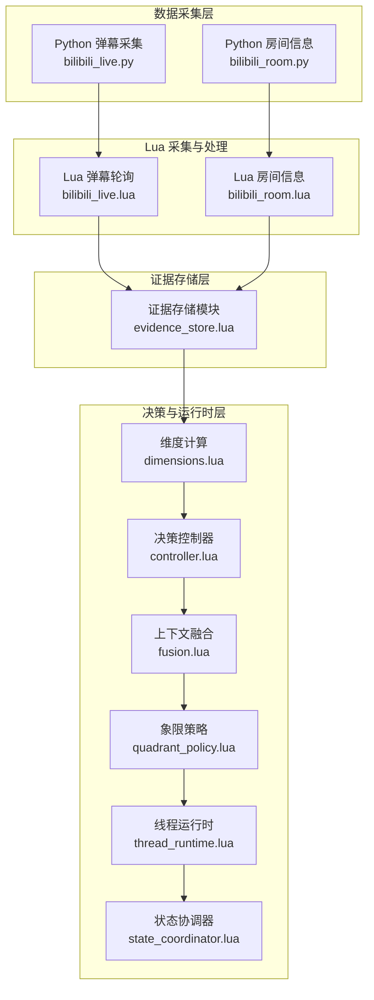
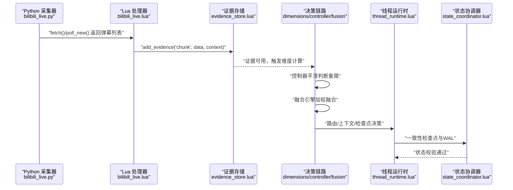
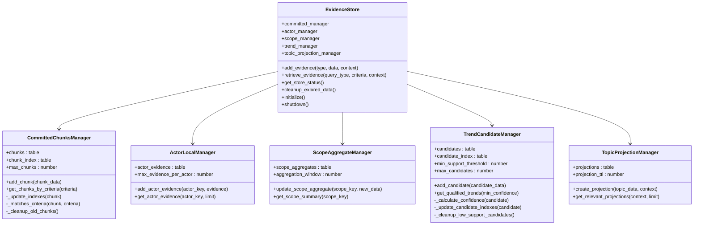
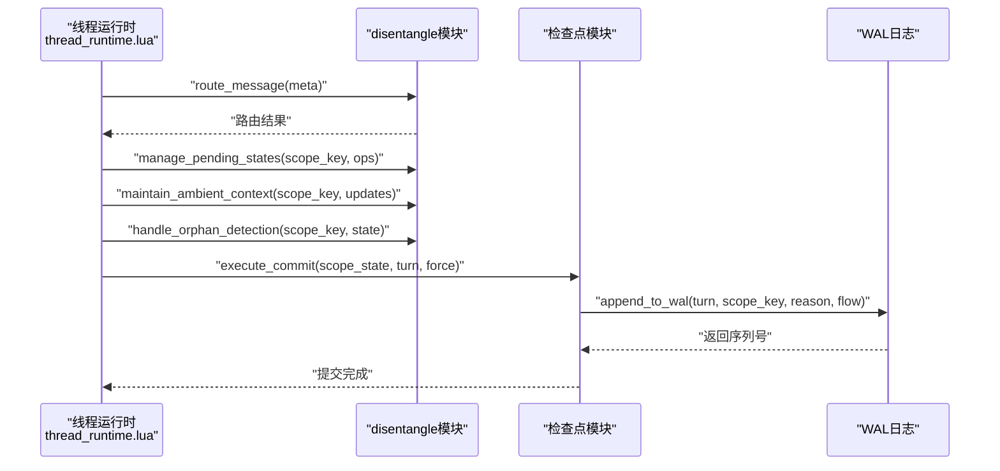
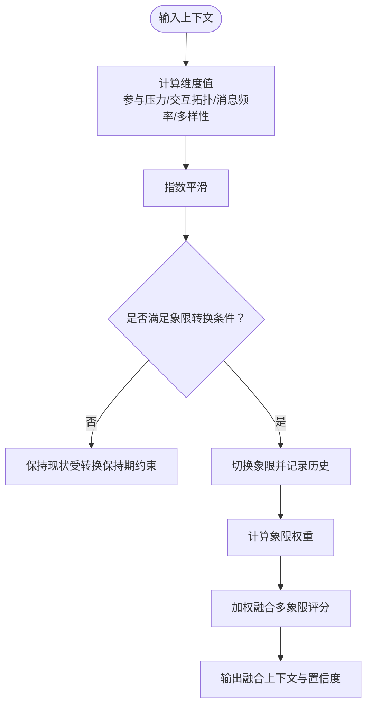
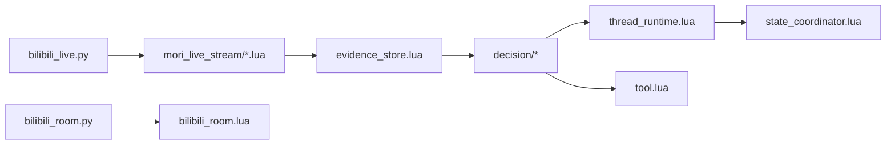

# 直播数据分析

<cite>
**本文档引用的文件**
- [bilibili_live.py](file://mori_live_stream/bilibili_live.py)
- [bilibili_room.py](file://mori_live_stream/bilibili_room.py)
- [bilibili_live.lua](file://mori_live_stream/lua/mori_live_stream/bilibili_live.lua)
- [bilibili_room.lua](file://mori_live_stream/lua/mori_live_stream/bilibili_room.lua)
- [evidence_store.lua](file://mori_memory/module/evidence/evidence_store.lua)
- [thread_runtime.lua](file://mori_memory/module/runtime/thread_runtime.lua)
- [dimensions.lua](file://mori_memory/module/decision/dimensions.lua)
- [controller.lua](file://mori_memory/module/decision/controller.lua)
- [fusion.lua](file://mori_memory/module/decision/fusion.lua)
- [quadrant_policy.lua](file://mori_memory/module/policy/quadrant_policy.lua)
- [state_coordinator.lua](file://mori_memory/module/state_coordinator.lua)
- [tool.lua](file://mori_memory/module/tool.lua)
</cite>

## 目录
1. [简介](#简介)
2. [项目结构](#项目结构)
3. [核心组件](#核心组件)
4. [架构总览](#架构总览)
5. [详细组件分析](#详细组件分析)
6. [依赖关系分析](#依赖关系分析)
7. [性能考量](#性能考量)
8. [故障排查指南](#故障排查指南)
9. [结论](#结论)
10. [附录](#附录)

## 简介
本技术文档聚焦于直播数据分析模块，围绕“弹幕证据收集与存储”、“线程运行时分析”、“内容摘要与主题建模”、“用户行为与画像”、“性能指标监控”、“可视化与导出”等维度，系统梳理代码架构与实现要点。文档以循序渐进的方式呈现，既适合工程实践参考，也便于非专业读者理解。

## 项目结构
直播数据分析由三层协同构成：
- 数据采集层：Python侧封装B站弹幕抓取与房间信息查询，Lua侧实现去重、时间戳解析与HTTP请求。
- 内存与证据层：Lua证据存储模块，管理已提交块、演员本地证据、作用域聚合、趋势候选与主题投影。
- 决策与运行时层：维度计算、象限策略、上下文融合、线程运行时、状态协调器，支撑实时统计、历史趋势与用户画像构建。

图示来源
- [bilibili_live.py:93-221](file://mori_live_stream/bilibili_live.py#L93-L221)
- [bilibili_room.py:93-141](file://mori_live_stream/bilibili_room.py#L93-L141)
- [bilibili_live.lua:70-242](file://mori_live_stream/lua/mori_live_stream/bilibili_live.lua#L70-L242)
- [bilibili_room.lua:18-74](file://mori_live_stream/lua/mori_live_stream/bilibili_room.lua#L18-L74)
- [evidence_store.lua:490-603](file://mori_memory/module/evidence/evidence_store.lua#L490-L603)
- [dimensions.lua:156-210](file://mori_memory/module/decision/dimensions.lua#L156-L210)
- [controller.lua:27-116](file://mori_memory/module/decision/controller.lua#L27-L116)
- [fusion.lua:117-229](file://mori_memory/module/decision/fusion.lua#L117-L229)
- [quadrant_policy.lua:141-225](file://mori_memory/module/policy/quadrant_policy.lua#L141-L225)
- [thread_runtime.lua:15-260](file://mori_memory/module/runtime/thread_runtime.lua#L15-L260)
- [state_coordinator.lua:1-302](file://mori_memory/module/state_coordinator.lua#L1-L302)

章节来源
- [bilibili_live.py:93-221](file://mori_live_stream/bilibili_live.py#L93-L221)
- [bilibili_room.py:93-141](file://mori_live_stream/bilibili_room.py#L93-L141)
- [bilibili_live.lua:70-242](file://mori_live_stream/lua/mori_live_stream/bilibili_live.lua#L70-L242)
- [bilibili_room.lua:18-74](file://mori_live_stream/lua/mori_live_stream/bilibili_room.lua#L18-L74)
- [evidence_store.lua:490-603](file://mori_memory/module/evidence/evidence_store.lua#L490-L603)
- [dimensions.lua:156-210](file://mori_memory/module/decision/dimensions.lua#L156-L210)
- [controller.lua:27-116](file://mori_memory/module/decision/controller.lua#L27-L116)
- [fusion.lua:117-229](file://mori_memory/module/decision/fusion.lua#L117-L229)
- [quadrant_policy.lua:141-225](file://mori_memory/module/policy/quadrant_policy.lua#L141-L225)
- [thread_runtime.lua:15-260](file://mori_memory/module/runtime/thread_runtime.lua#L15-L260)
- [state_coordinator.lua:1-302](file://mori_memory/module/state_coordinator.lua#L1-L302)

## 核心组件
- 弹幕采集与去重
  - Python侧封装B站弹幕轮询与去重窗口，Lua侧实现基于时间线与用户ID的键生成、滑动窗口去重与增量拉取。
- 证据存储系统
  - 已提交块、演员本地证据、作用域聚合、趋势候选、主题投影五类证据，配套索引与清理策略。
- 决策与运行时
  - 维度计算（参与压力、交互拓扑、消息频率、参与者多样性），控制器平滑切换，融合引擎加权融合，象限策略参数调节，线程运行时检查点与WAL，状态协调器一致性保障。
- 工具与向量化
  - 向量嵌入、余弦相似度、二进制编解码、SIMD加速，支撑主题建模与相似检索。

章节来源
- [bilibili_live.py:93-221](file://mori_live_stream/bilibili_live.py#L93-L221)
- [bilibili_live.lua:70-242](file://mori_live_stream/lua/mori_live_stream/bilibili_live.lua#L70-L242)
- [evidence_store.lua:26-589](file://mori_memory/module/evidence/evidence_store.lua#L26-L589)
- [dimensions.lua:156-210](file://mori_memory/module/decision/dimensions.lua#L156-L210)
- [controller.lua:27-116](file://mori_memory/module/decision/controller.lua#L27-L116)
- [fusion.lua:117-229](file://mori_memory/module/decision/fusion.lua#L117-L229)
- [quadrant_policy.lua:141-225](file://mori_memory/module/policy/quadrant_policy.lua#L141-L225)
- [thread_runtime.lua:15-260](file://mori_memory/module/runtime/thread_runtime.lua#L15-L260)
- [state_coordinator.lua:1-302](file://mori_memory/module/state_coordinator.lua#L1-L302)
- [tool.lua:174-725](file://mori_memory/module/tool.lua#L174-L725)

## 架构总览
直播数据分析采用“采集-证据-决策-运行时”的流水线式架构。Python负责稳定抓取，Lua负责高性能处理与去重，证据存储模块统一承载多源证据，决策层动态适配不同直播场景，运行时层保证状态一致性与可恢复性。

图示来源
- [bilibili_live.py:147-205](file://mori_live_stream/bilibili_live.py#L147-L205)
- [bilibili_live.lua:149-237](file://mori_live_stream/lua/mori_live_stream/bilibili_live.lua#L149-L237)
- [evidence_store.lua:508-563](file://mori_memory/module/evidence/evidence_store.lua#L508-L563)
- [dimensions.lua:182-189](file://mori_memory/module/decision/dimensions.lua#L182-L189)
- [controller.lua:44-79](file://mori_memory/module/decision/controller.lua#L44-L79)
- [fusion.lua:132-229](file://mori_memory/module/decision/fusion.lua#L132-L229)
- [thread_runtime.lua:110-152](file://mori_memory/module/runtime/thread_runtime.lua#L110-L152)
- [state_coordinator.lua:144-207](file://mori_memory/module/state_coordinator.lua#L144-L207)

## 详细组件分析

### 弹幕证据收集与存储
- 设计目标
  - 采集弹幕并去重，建立时间戳与用户键，形成可检索的证据块。
- 存储结构
  - 已提交块：按时间、演员、作用域索引，支持条件检索与清理。
  - 演员本地证据：限制每演员上限，保留最新N条。
  - 作用域聚合：统计互动次数、演员活动、主题分布。
  - 趋势候选：基于模式支持度与演员覆盖度计算置信度。
  - 主题投影：基于上下文与新鲜度计算相关性，缓存热点主题。
- 查询优化
  - 索引：时间、演员、作用域三类索引，按需裁剪。
  - 清理：按容量阈值与TTL淘汰，避免无限增长。
  - 去重：滑动窗口哈希集合，O(1)判定与常数开销维护。

图示来源
- [evidence_store.lua:26-589](file://mori_memory/module/evidence/evidence_store.lua#L26-L589)

章节来源
- [evidence_store.lua:26-589](file://mori_memory/module/evidence/evidence_store.lua#L26-L589)

### 线程运行时分析
- 路由与上下文
  - 路由边界管理：委托给disentangle模块，记录活跃作用域。
  - Ambient状态维护：更新环境上下文，支持动态调整。
  - Pending状态管理：统一处理挂起操作。
  - Orphan检测与处理：检测并回收孤儿状态。
- Commit与WAL
  - 依据配置周期性触发检查点，导出状态并保存，随后重置WAL。
  - 运行时状态包含序列号、最后检查点回合、活跃作用域与内存占用。
- 状态恢复
  - 初始化加载最近检查点，重放WAL后继续运行。

图示来源
- [thread_runtime.lua:24-201](file://mori_memory/module/runtime/thread_runtime.lua#L24-L201)

章节来源
- [thread_runtime.lua:24-201](file://mori_memory/module/runtime/thread_runtime.lua#L24-L201)

### 决策维度与上下文融合
- 决策维度
  - 参与压力：结合有效演员数、流压力、房间不稳定度与得分熵。
  - 交互拓扑：结合对等边比例、枢纽主导度、成对密度与演员切换率。
  - 消息频率：基于近期消息数与时窗换算。
  - 参与者多样性：结合唯一参与者数与参与平衡。
- 控制器
  - 对维度值进行指数平滑，限制转换保持期，避免频繁切换。
- 融合引擎
  - 基于环境特征与当前象限权重，对多象限评分进行加权融合，生成置信度与推理说明。

图示来源
- [dimensions.lua:56-154](file://mori_memory/module/decision/dimensions.lua#L56-L154)
- [controller.lua:44-116](file://mori_memory/module/decision/controller.lua#L44-L116)
- [fusion.lua:132-229](file://mori_memory/module/decision/fusion.lua#L132-L229)

章节来源
- [dimensions.lua:56-154](file://mori_memory/module/decision/dimensions.lua#L56-L154)
- [controller.lua:44-116](file://mori_memory/module/decision/controller.lua#L44-L116)
- [fusion.lua:132-229](file://mori_memory/module/decision/fusion.lua#L132-L229)

### 象限策略与参数调节
- 象限定义
  - 低/高人口 × 广播/对等，共四种象限。
- 参数调节
  - 基于象限映射调整附加保守度、挂起边际缩放、写入保守度、提交速度、召回宽度与资源分配，仅用于调节现有参数，不改变核心路由逻辑。
- 资源与提交建议
  - 提供资源分配倾向、提交时机与召回策略建议，辅助运行时决策。

章节来源
- [quadrant_policy.lua:141-225](file://mori_memory/module/policy/quadrant_policy.lua#L141-L225)

### 状态协调与一致性
- 版本向量
  - 为各模块维护版本向量，记录版本号、时间戳与依赖。
- 事务管理
  - 开启事务时记录模块版本快照，提交前验证一致性，冲突则回滚。
- 一致性检查点
  - 原子刷新持久化，生成快照并写入WAL，记录生成代数与模块数。
- 自动维护
  - 定期验证恢复状态，发现不一致自动创建检查点。

章节来源
- [state_coordinator.lua:1-302](file://mori_memory/module/state_coordinator.lua#L1-L302)

### 工具与向量化能力
- 向量工具
  - 嵌入获取、批量嵌入、向量平均、余弦相似度、二进制编解码。
- SIMD加速
  - 优先使用AVX2加速点积与余弦相似度，回退纯Lua实现。
- 应用场景
  - 主题建模、相似检索、证据投影与趋势候选置信度计算。

章节来源
- [tool.lua:174-725](file://mori_memory/module/tool.lua#L174-L725)

## 依赖关系分析
- Python采集器依赖Lua模块路径与包路径注入，通过lupa调用Lua实现。
- Lua采集器依赖HTTP/JSON/时间模块，实现轮询、解析与去重。
- 证据存储模块依赖配置、工具与主题模块，提供统一证据接口。
- 决策链路依赖维度、控制器、融合与策略模块，形成闭环。
- 运行时与状态协调器贯穿全链路，保障一致性与可恢复性。

图示来源
- [bilibili_live.py:121-145](file://mori_live_stream/bilibili_live.py#L121-L145)
- [bilibili_room.py:77-90](file://mori_live_stream/bilibili_room.py#L77-L90)
- [bilibili_live.lua:1-6](file://mori_live_stream/lua/mori_live_stream/bilibili_live.lua#L1-L6)
- [bilibili_room.lua:1-6](file://mori_live_stream/lua/mori_live_stream/bilibili_room.lua#L1-L6)
- [evidence_store.lua:7-12](file://mori_memory/module/evidence/evidence_store.lua#L7-L12)
- [thread_runtime.lua:6-12](file://mori_memory/module/runtime/thread_runtime.lua#L6-L12)
- [state_coordinator.lua:3-8](file://mori_memory/module/state_coordinator.lua#L3-L8)
- [tool.lua:1-8](file://mori_memory/module/tool.lua#L1-L8)

章节来源
- [bilibili_live.py:121-145](file://mori_live_stream/bilibili_live.py#L121-L145)
- [bilibili_room.py:77-90](file://mori_live_stream/bilibili_room.py#L77-L90)
- [bilibili_live.lua:1-6](file://mori_live_stream/lua/mori_live_stream/bilibili_live.lua#L1-L6)
- [bilibili_room.lua:1-6](file://mori_live_stream/lua/mori_live_stream/bilibili_room.lua#L1-L6)
- [evidence_store.lua:7-12](file://mori_memory/module/evidence/evidence_store.lua#L7-L12)
- [thread_runtime.lua:6-12](file://mori_memory/module/runtime/thread_runtime.lua#L6-L12)
- [state_coordinator.lua:3-8](file://mori_memory/module/state_coordinator.lua#L3-L8)
- [tool.lua:1-8](file://mori_memory/module/tool.lua#L1-L8)

## 性能考量
- 采集与去重
  - Lua侧滑动窗口去重，时间复杂度近似O(1)，空间开销可控。
  - Python侧轮询间隔与超时可调，避免过度拉取。
- 证据存储
  - 多级索引与容量/时间阈值清理，避免无限增长。
  - 增量聚合与投影缓存，降低重复计算。
- 决策与融合
  - 维度计算与控制器平滑均为轻量操作，融合权重可缓存。
- 运行时与一致性
  - 检查点周期可配置，WAL顺序追加，重启快速恢复。
- 向量化与SIMD
  - 向量相似度与编解码采用SIMD加速，显著提升主题建模与检索性能。

[本节为通用性能讨论，无需列出具体文件来源]

## 故障排查指南
- 采集失败
  - 检查网络与HTTP返回码，确认用户代理与URL拼接正确。
  - Python侧捕获异常并抛出自定义错误类型，定位具体步骤。
- Lua模块缺失
  - 确认package.path包含Lua模块目录，require成功加载。
- 证据存储异常
  - 查看清理与索引维护逻辑，确认阈值设置合理。
- 运行时提交失败
  - 检查状态导出、检查点保存与WAL重置流程，关注警告日志。
- 一致性问题
  - 使用状态协调器验证快照与WAL连续性，必要时触发自动检查点。

章节来源
- [bilibili_live.py:109-145](file://mori_live_stream/bilibili_live.py#L109-L145)
- [bilibili_live.lua:158-175](file://mori_live_stream/lua/mori_live_stream/bilibili_live.lua#L158-L175)
- [evidence_store.lua:578-583](file://mori_memory/module/evidence/evidence_store.lua#L578-L583)
- [thread_runtime.lua:132-151](file://mori_memory/module/runtime/thread_runtime.lua#L132-L151)
- [state_coordinator.lua:210-258](file://mori_memory/module/state_coordinator.lua#L210-L258)

## 结论
该直播数据分析模块以Lua高性能处理为核心，结合Python稳定采集与证据存储统一抽象，形成“采集-证据-决策-运行时”的完整闭环。通过维度与象限策略的动态适配、上下文融合的加权决策、线程运行时的检查点与WAL保障，以及状态协调器的一致性维护，系统在实时性、可扩展性与可靠性方面具备良好平衡。向量化工具与SIMD加速进一步提升了主题建模与检索效率，为后续内容摘要、用户画像与可视化提供了坚实基础。

[本节为总结性内容，无需列出具体文件来源]

## 附录
- 数据导出与外部集成
  - 证据检索接口支持按条件查询与限制返回数量，便于对接下游分析系统。
  - 运行时状态与证据状态提供统一查询入口，便于监控与审计。
- 可视化方案建议
  - 实时统计：基于作用域聚合与趋势候选，生成互动趋势与话题热度曲线。
  - 用户画像：基于演员本地证据与作用域活动，构建活跃度与偏好画像。
  - 报告输出：整合维度、融合上下文与置信度，生成周期性报告。
- 性能指标监控
  - 响应时间：采集轮询间隔与HTTP请求耗时。
  - 吞吐量：消息频率与处理速率。
  - 资源利用率：运行时内存占用与CPU使用率。

[本节为概念性建议，无需列出具体文件来源]