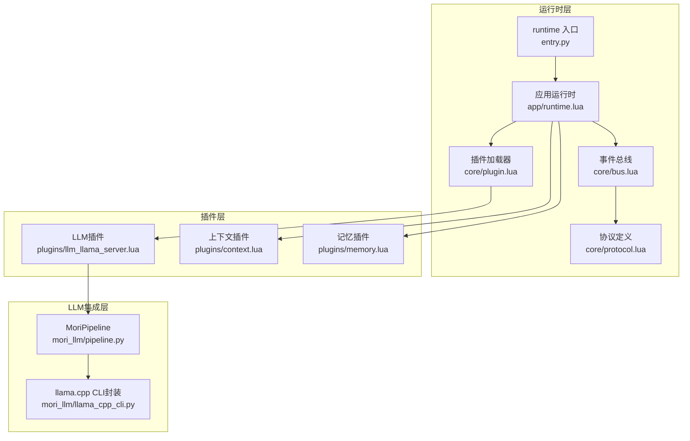
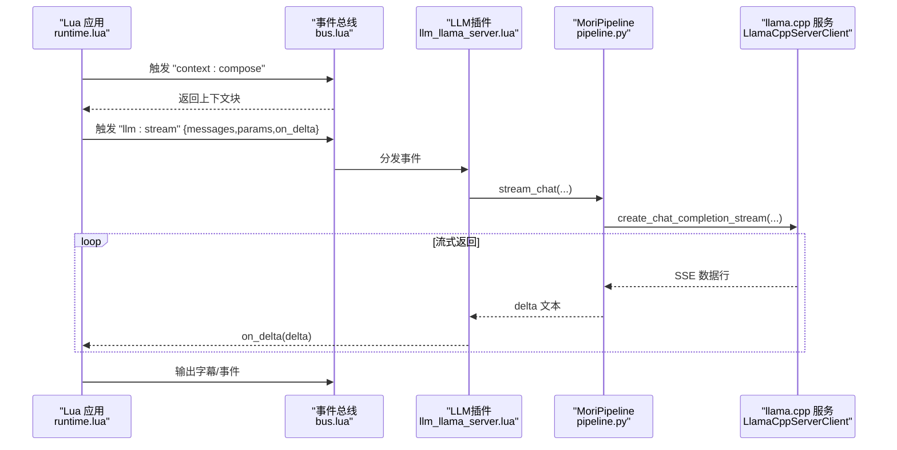
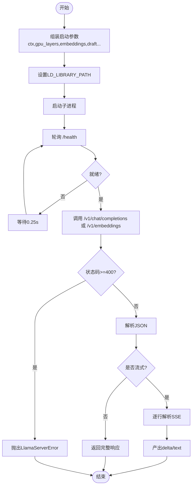
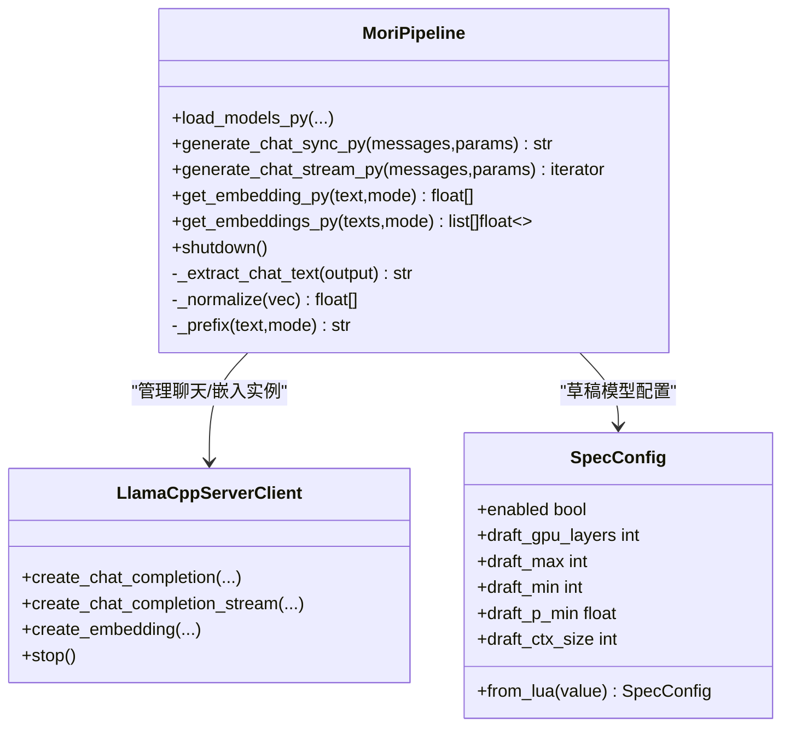
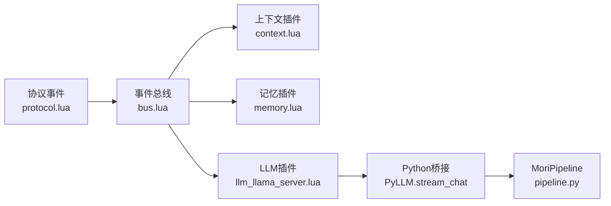
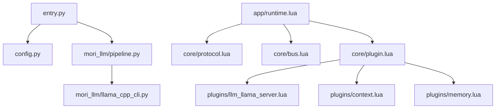

# LLM集成架构

<cite>
**本文引用的文件**
- [mori_llm/pipeline.py](file://mori_llm/pipeline.py)
- [mori_llm/llama_cpp_cli.py](file://mori_llm/llama_cpp_cli.py)
- [mori_runtime/entry.py](file://mori_runtime/entry.py)
- [mori_runtime/config.py](file://mori_runtime/config.py)
- [mori_runtime/lua/mori/app/runtime.lua](file://mori_runtime/lua/mori/app/runtime.lua)
- [mori_runtime/lua/mori/plugins/llm_llama_server.lua](file://mori_runtime/lua/mori/plugins/llm_llama_server.lua)
- [mori_runtime/lua/mori/core/plugin.lua](file://mori_runtime/lua/mori/core/plugin.lua)
- [mori_runtime/lua/mori/core/protocol.lua](file://mori_runtime/lua/mori/core/protocol.lua)
- [mori_runtime/lua/mori/plugins/context.lua](file://mori_runtime/lua/mori/plugins/context.lua)
- [mori_runtime/lua/mori/plugins/memory.lua](file://mori_runtime/lua/mori/plugins/memory.lua)
- [mori.config.json](file://mori.config.json)
- [README.md](file://README.md)
</cite>

## 目录
1. [简介](#简介)
2. [项目结构](#项目结构)
3. [核心组件](#核心组件)
4. [架构总览](#架构总览)
5. [详细组件分析](#详细组件分析)
6. [依赖分析](#依赖分析)
7. [性能考虑](#性能考虑)
8. [故障排查指南](#故障排查指南)
9. [结论](#结论)
10. [附录](#附录)

## 简介
本文件面向Mori LLM集成系统，聚焦以下目标：
- 深入解释llama.cpp集成方案：模型加载机制、推理优化技术、嵌入向量生成等
- 阐述MoriPipeline设计理念：流式推理、上下文管理、参数控制等关键特性
- 详解HTTP API服务器实现：请求路由、响应格式、错误处理等
- 解释LLM插件系统：与运行时的集成方式、Lua回调机制、性能监控
- 提供模型配置指南、性能优化建议与调试方法

## 项目结构
Mori采用多模块聚合架构，围绕运行时（LuaJIT + Python桥接）组织：
- mori_llm：LLM行为与llama.cpp驱动（服务客户端、嵌入器、管道）
- mori_runtime：运行时内核（事件总线、协议、插件系统、入口）
- mori_memory：LuaJIT记忆核心（通过lupa绑定）
- 配置与入口：统一配置文件与命令行入口

图表来源
- [mori_runtime/entry.py:1-120](file://mori_runtime/entry.py#L1-L120)
- [mori_runtime/lua/mori/app/runtime.lua:543-563](file://mori_runtime/lua/mori/app/runtime.lua#L543-L563)
- [mori_runtime/lua/mori/core/bus.lua:14-37](file://mori_runtime/lua/mori/core/bus.lua#L14-L37)
- [mori_runtime/lua/mori/core/protocol.lua:1-35](file://mori_runtime/lua/mori/core/protocol.lua#L1-L35)
- [mori_runtime/lua/mori/core/plugin.lua:13-48](file://mori_runtime/lua/mori/core/plugin.lua#L13-L48)
- [mori_runtime/lua/mori/plugins/llm_llama_server.lua:8-21](file://mori_runtime/lua/mori/plugins/llm_llama_server.lua#L8-L21)
- [mori_runtime/lua/mori/plugins/context.lua:30-87](file://mori_runtime/lua/mori/plugins/context.lua#L30-L87)
- [mori_runtime/lua/mori/plugins/memory.lua:8-26](file://mori_runtime/lua/mori/plugins/memory.lua#L8-L26)
- [mori_llm/pipeline.py:307-582](file://mori_llm/pipeline.py#L307-L582)
- [mori_llm/llama_cpp_cli.py:1-248](file://mori_llm/llama_cpp_cli.py#L1-L248)

章节来源
- [README.md:10-16](file://README.md#L10-L16)
- [mori_runtime/entry.py:582-794](file://mori_runtime/entry.py#L582-L794)
- [mori_runtime/lua/mori/app/runtime.lua:543-563](file://mori_runtime/lua/mori/app/runtime.lua#L543-L563)

## 核心组件
- LlamaCppServerClient：封装llama.cpp HTTP服务的启动、健康检查、聊天补全、流式补全、嵌入生成与停止逻辑
- LlamaCppEmbeddingRunner / LlamaCppChatRunner：基于llama-cli的嵌入与聊天执行器（用于CLI模式或替代服务）
- MoriPipeline：统一的模型加载与推理入口，负责上下文消息构建、参数解析、流式/同步推理、嵌入生成与归一化
- 插件系统：通过协议事件解耦LLM、上下文、记忆、TTS等模块，插件以setup函数注册事件处理器
- 运行时入口：解析配置、构建Pipeline、桥接Lua与Python、驱动事件循环

章节来源
- [mori_llm/pipeline.py:56-305](file://mori_llm/pipeline.py#L56-L305)
- [mori_llm/llama_cpp_cli.py:90-248](file://mori_llm/llama_cpp_cli.py#L90-L248)
- [mori_runtime/lua/mori/core/plugin.lua:13-48](file://mori_runtime/lua/mori/core/plugin.lua#L13-L48)
- [mori_runtime/lua/mori/core/protocol.lua:3-32](file://mori_runtime/lua/mori/core/protocol.lua#L3-L32)

## 架构总览
Mori的LLM集成以“服务端+插件”为核心：
- 服务端：MoriPipeline启动llama.cpp HTTP服务，提供OpenAI兼容接口
- 插件：LLM插件订阅“llm:stream”事件，委托Python侧流式生成
- 上下文与记忆：上下文插件组合系统提示与记忆块，记忆插件提供编译与摄入
- 运行时：事件总线驱动意图执行、字幕输出、TTS提交与完成回传

图表来源
- [mori_runtime/lua/mori/app/runtime.lua:449-466](file://mori_runtime/lua/mori/app/runtime.lua#L449-L466)
- [mori_runtime/lua/mori/plugins/llm_llama_server.lua:13-20](file://mori_runtime/lua/mori/plugins/llm_llama_server.lua#L13-L20)
- [mori_llm/pipeline.py:519-573](file://mori_llm/pipeline.py#L519-L573)
- [mori_llm/pipeline.py:228-290](file://mori_llm/pipeline.py#L228-L290)

## 详细组件分析

### LlamaCppServerClient（HTTP服务客户端）
- 启动与发现：自动寻找空闲端口，构造启动参数（上下文大小、GPU层数、是否嵌入模式、草稿模型等），设置LD_LIBRARY_PATH并启动进程
- 健康检查：轮询/health直到就绪或超时
- 请求封装：统一的HTTP请求与JSON解析，支持4xx错误抛出异常
- 聊天补全：同步补全接口，提取choices[0].message.content或文本字段
- 流式补全：基于SSE的逐行解析，过滤data前缀与[DONE]结束符，输出delta或text
- 嵌入生成：POST /v1/embeddings，返回向量列表
- 停止：优雅终止子进程

图表来源
- [mori_llm/pipeline.py:105-173](file://mori_llm/pipeline.py#L105-L173)
- [mori_llm/pipeline.py:175-202](file://mori_llm/pipeline.py#L175-L202)
- [mori_llm/pipeline.py:204-227](file://mori_llm/pipeline.py#L204-L227)
- [mori_llm/pipeline.py:228-290](file://mori_llm/pipeline.py#L228-L290)
- [mori_llm/pipeline.py:292-294](file://mori_llm/pipeline.py#L292-L294)

章节来源
- [mori_llm/pipeline.py:56-305](file://mori_llm/pipeline.py#L56-L305)

### LlamaCppEmbeddingRunner / LlamaCppChatRunner（CLI模式）
- EmbeddingRunner：调用llama-embedding，解析JSON输出，支持池化与归一化
- ChatRunner：调用llama-cli进行单轮对话，支持上下文大小、温度、top_p、预测长度等参数
- 通用工具：iter_lua_sequence用于兼容Lua表/序列访问

章节来源
- [mori_llm/llama_cpp_cli.py:90-160](file://mori_llm/llama_cpp_cli.py#L90-L160)
- [mori_llm/llama_cpp_cli.py:162-221](file://mori_llm/llama_cpp_cli.py#L162-L221)
- [mori_llm/llama_cpp_cli.py:223-248](file://mori_llm/llama_cpp_cli.py#L223-L248)

### MoriPipeline（统一推理入口）
- 模型加载：同时启动聊天与嵌入服务实例，支持草稿模型与规格配置
- 参数解析：从Lua消息序列中提取messages，从params中解析max_tokens、temperature、top_p、seed、stop
- 文本抽取：从OpenAI兼容响应中抽取content或text字段，支持多片段拼接
- 归一化：对嵌入向量进行L2归一化
- 前缀策略：对嵌入文本添加query:/passage:前缀
- 流式/同步：分别提供generate_chat_sync_py与generate_chat_stream_py

图表来源
- [mori_llm/pipeline.py:307-582](file://mori_llm/pipeline.py#L307-L582)
- [mori_llm/pipeline.py:22-54](file://mori_llm/pipeline.py#L22-L54)

章节来源
- [mori_llm/pipeline.py:307-582](file://mori_llm/pipeline.py#L307-L582)

### 插件系统与运行时集成
- 协议事件：定义MODULE_*、INPUT_TEXT、CONTEXT_COMPOSE、MEMORY_*、SPEECH_*、LLM_STREAM、TTS_*、OUTPUT_*等事件
- 插件加载：按顺序require插件模块，校验setup函数，捕获错误并上报
- LLM插件：订阅LLM_STREAM，转发到Python侧的stream_chat
- 上下文插件：收集系统提示与记忆块，拼装messages
- 记忆插件：编译上下文、摄入对话回合、关闭内存

图表来源
- [mori_runtime/lua/mori/core/protocol.lua:3-32](file://mori_runtime/lua/mori/core/protocol.lua#L3-L32)
- [mori_runtime/lua/mori/core/plugin.lua:13-48](file://mori_runtime/lua/mori/core/plugin.lua#L13-L48)
- [mori_runtime/lua/mori/plugins/llm_llama_server.lua:8-21](file://mori_runtime/lua/mori/plugins/llm_llama_server.lua#L8-L21)
- [mori_runtime/lua/mori/plugins/context.lua:30-87](file://mori_runtime/lua/mori/plugins/context.lua#L30-L87)
- [mori_runtime/lua/mori/plugins/memory.lua:8-26](file://mori_runtime/lua/mori/plugins/memory.lua#L8-L26)
- [mori_runtime/entry.py:146-188](file://mori_runtime/entry.py#L146-L188)
- [mori_llm/pipeline.py:519-573](file://mori_llm/pipeline.py#L519-L573)

章节来源
- [mori_runtime/lua/mori/core/plugin.lua:13-48](file://mori_runtime/lua/mori/core/plugin.lua#L13-L48)
- [mori_runtime/lua/mori/plugins/llm_llama_server.lua:8-21](file://mori_runtime/lua/mori/plugins/llm_llama_server.lua#L8-L21)
- [mori_runtime/lua/mori/plugins/context.lua:30-87](file://mori_runtime/lua/mori/plugins/context.lua#L30-L87)
- [mori_runtime/lua/mori/plugins/memory.lua:8-26](file://mori_runtime/lua/mori/plugins/memory.lua#L8-L26)

### HTTP API服务器实现（OpenAI兼容）
- 路由与端点：/health（健康检查）、/v1/chat/completions（补全）、/v1/embeddings（嵌入）
- 参数映射：max_tokens、temperature、top_p、stop、seed等
- 响应格式：聊天补全返回choices[0].message.content或text；嵌入返回encoding_format=float的data.embedding数组
- 错误处理：非2xx状态码抛出LlamaServerError；JSON解析失败抛出异常
- 流式输出：/v1/chat/completions支持SSE，逐行输出data:行，过滤[DONE]结束

章节来源
- [mori_llm/pipeline.py:175-202](file://mori_llm/pipeline.py#L175-L202)
- [mori_llm/pipeline.py:204-227](file://mori_llm/pipeline.py#L204-L227)
- [mori_llm/pipeline.py:228-290](file://mori_llm/pipeline.py#L228-L290)
- [mori_llm/pipeline.py:292-294](file://mori_llm/pipeline.py#L292-L294)

### 上下文管理与参数控制
- 上下文合成：上下文插件从记忆编译系统提示与历史消息，拼装最终messages
- 参数控制：运行时从配置读取llm_params，注入seed、max_tokens、temperature、top_p等
- 中断策略：根据优先级与策略决定是否中断当前说话意图

章节来源
- [mori_runtime/lua/mori/plugins/context.lua:30-87](file://mori_runtime/lua/mori/plugins/context.lua#L30-L87)
- [mori_runtime/lua/mori/app/runtime.lua:449-466](file://mori_runtime/lua/mori/app/runtime.lua#L449-L466)
- [mori_runtime/lua/mori/app/runtime.lua:113-136](file://mori_runtime/lua/mori/app/runtime.lua#L113-L136)

## 依赖分析
- 运行时依赖：lupa（LuaJIT绑定）、urllib（HTTP）、subprocess（llama.cpp进程）
- 配置依赖：统一配置文件mori.config.json，支持common/tts/cli/vtuber等分组
- 插件依赖：通过协议事件解耦，插件按需加载

图表来源
- [mori_runtime/entry.py:1-120](file://mori_runtime/entry.py#L1-L120)
- [mori_runtime/config.py:188-270](file://mori_runtime/config.py#L188-L270)
- [mori_llm/pipeline.py:1-50](file://mori_llm/pipeline.py#L1-L50)
- [mori_runtime/lua/mori/app/runtime.lua:543-563](file://mori_runtime/lua/mori/app/runtime.lua#L543-L563)
- [mori_runtime/lua/mori/core/plugin.lua:13-48](file://mori_runtime/lua/mori/core/plugin.lua#L13-L48)

章节来源
- [mori_runtime/entry.py:582-794](file://mori_runtime/entry.py#L582-L794)
- [mori_runtime/config.py:188-270](file://mori_runtime/config.py#L188-L270)

## 性能考虑
- GPU加速：通过--gpu-layers与草稿模型（draft）提升推理吞吐
- 上下文与草稿：草稿模型参数（draft_max/draft_min/draft_p_min/draft_ctx_size/draft_gpu_layers）影响生成效率与质量平衡
- 流式输出：SSE流式返回降低首字延迟，适合实时字幕与TTS分段
- 嵌入向量：归一化减少后续相似度计算开销
- 进程隔离：服务端进程与Python桥接分离，避免阻塞

## 故障排查指南
- 服务未就绪：检查startup_timeout_s与/health轮询，确认llama.cpp二进制路径与LD_LIBRARY_PATH
- 嵌入失败：确认嵌入模型路径与--embeddings开关，检查输出JSON解析
- 聊天异常：查看4xx响应与错误体，确认API Key、端口占用与网络可达性
- 插件加载失败：检查插件模块是否存在、setup函数签名是否正确
- 中断策略：调整interrupt_policy与优先级，避免频繁打断

章节来源
- [mori_llm/pipeline.py:159-173](file://mori_llm/pipeline.py#L159-L173)
- [mori_llm/pipeline.py:188-190](file://mori_llm/pipeline.py#L188-L190)
- [mori_runtime/lua/mori/core/plugin.lua:17-27](file://mori_runtime/lua/mori/core/plugin.lua#L17-L27)

## 结论
Mori通过“服务端+插件+运行时”的架构，实现了本地LLM的稳定集成与扩展。MoriPipeline统一抽象了模型加载、参数控制与流式推理，插件系统以事件协议解耦各模块，配合上下文与记忆插件形成完整的对话闭环。该设计兼顾易用性与可维护性，适合在资源受限环境下部署高质量的本地AI助手。

## 附录

### 模型配置指南
- 统一配置：mori.config.json支持common（工作目录、llama二进制、模型路径、上下文大小、推理参数）与tts等分组
- 命令行覆盖：命令行参数可覆盖配置文件中的默认值
- 相对路径解析：配置中的相对路径按配置文件所在目录解析

章节来源
- [mori.config.json:1-83](file://mori.config.json#L1-L83)
- [mori_runtime/config.py:188-270](file://mori_runtime/config.py#L188-L270)
- [mori_runtime/entry.py:582-794](file://mori_runtime/entry.py#L582-L794)

### 运行与调试要点
- 二进制定位：可通过LLAMA_CPP_BIN_DIR或LLAMA_CPP_DIR环境变量指定llama.cpp路径
- 日志与输出：运行时输出字幕、事件与TTS结果，便于调试
- 交互命令：支持/exit、/quit等控制命令

章节来源
- [mori_llm/llama_cpp_cli.py:26-56](file://mori_llm/llama_cpp_cli.py#L26-L56)
- [mori_runtime/entry.py:796-800](file://mori_runtime/entry.py#L796-L800)
- [mori_runtime/lua/mori/app/runtime.lua:639-641](file://mori_runtime/lua/mori/app/runtime.lua#L639-L641)