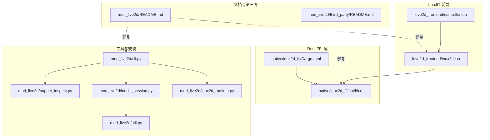
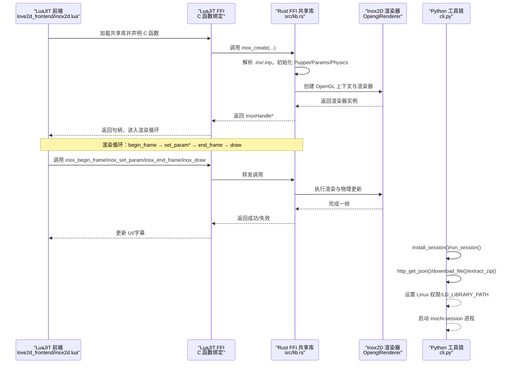
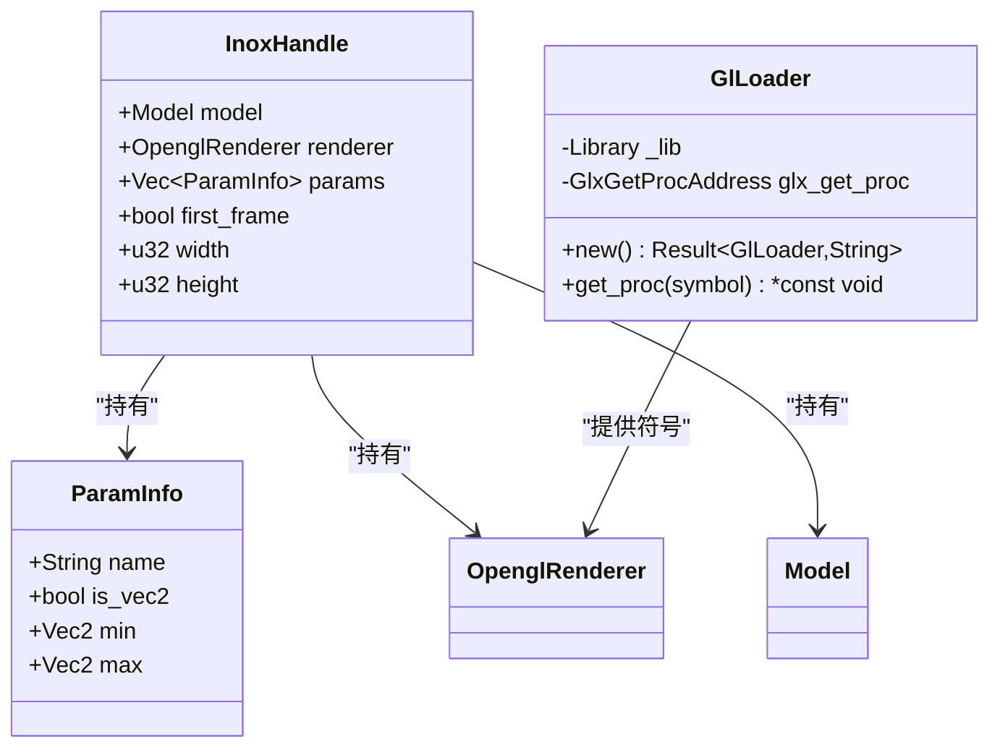
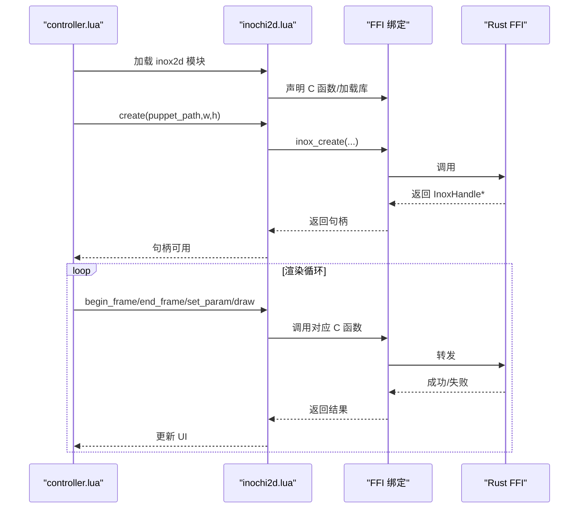
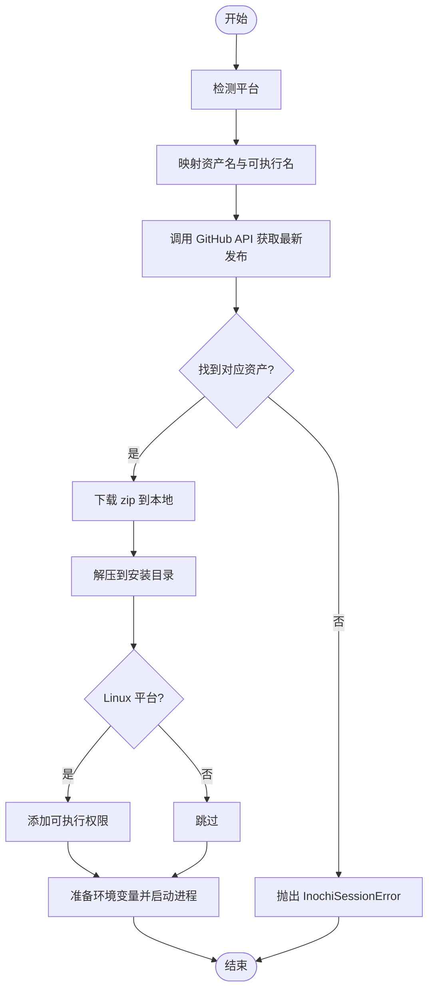
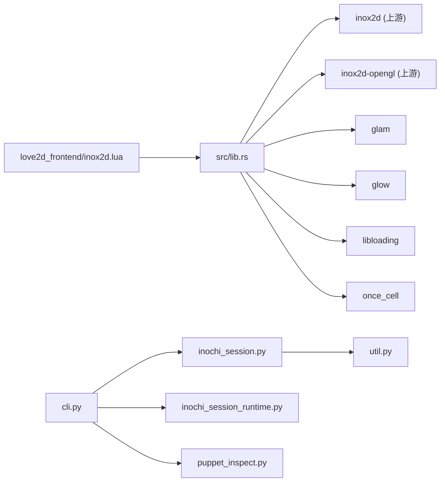

# Inochi2D FFI绑定

<cite>
**本文引用的文件**   
- [Cargo.toml](file://mori_live2d/native/inox2d_ffi/Cargo.toml)
- [lib.rs](file://mori_live2d/native/inox2d_ffi/src/lib.rs)
- [inochi_session.py](file://mori_live2d/inochi_session.py)
- [util.py](file://mori_live2d/util.py)
- [inochi_session_runtime.py](file://mori_live2d/inox2d_runtime.py)
- [controller.lua](file://mori_live2d/love2d_frontend/controller.lua)
- [inox2d.lua](file://mori_live2d/love2d_frontend/inox2d.lua)
- [cli.py](file://mori_live2d/cli.py)
- [README.md](file://mori_live2d/README.md)
- [puppet_inspect.py](file://mori_live2d/puppet_inspect.py)
- [third_party/README.md](file://mori_live2d/third_party/README.md)
</cite>

## 目录
1. [简介](#简介)
2. [项目结构](#项目结构)
3. [核心组件](#核心组件)
4. [架构总览](#架构总览)
5. [详细组件分析](#详细组件分析)
6. [依赖关系分析](#依赖关系分析)
7. [性能考量](#性能考量)
8. [故障排查指南](#故障排查指南)
9. [结论](#结论)
10. [附录](#附录)

## 简介
本技术文档围绕 Inochi2D 的 FFI 绑定系统展开，系统由三部分组成：
- Rust FFI 层：导出 C 可调用接口，封装 Inox2D 渲染管线与参数访问。
- LuaJIT FFI 前端：通过 LuaJIT FFI 加载共享库，桥接到 Love2D 渲染循环。
- 自动安装与运行辅助：Python 工具链负责 inochi-session 的自动下载、解压与运行，以及示例模型的安装。

文档重点解释：
- Rust FFI 的接口设计、数据类型转换、内存管理与错误传播。
- inochi-session 的自动安装机制（GitHub API、平台检测、下载与解压、权限与环境设置）。
- 跨平台兼容性处理（Linux 权限、Windows 路径、macOS 应用包）。
- 使用示例、错误处理策略与性能优化建议。
- 第三方库集成与调试方法。

## 项目结构
mori_live2d 子模块中与 Inochi2D FFI 相关的关键目录与文件：
- native/inox2d_ffi：Rust FFI 共享库源码与依赖声明。
- love2d_frontend：LuaJIT FFI 包装层，供 LÖVE 使用。
- 工具与安装：Python CLI、会话安装器、通用下载/解压工具。
- 检查与示例：模型检查工具、示例模型安装。

**图示来源**
- [Cargo.toml:1-16](file://mori_live2d/native/inox2d_ffi/Cargo.toml#L1-L16)
- [lib.rs:1-375](file://mori_live2d/native/inox2d_ffi/src/lib.rs#L1-L375)
- [inochi_session.py:1-103](file://mori_live2d/inochi_session.py#L1-L103)
- [util.py:1-68](file://mori_live2d/util.py#L1-L68)
- [inochi_session_runtime.py:1-64](file://mori_live2d/inox2d_runtime.py#L1-L64)
- [controller.lua:1-900](file://mori_live2d/love2d_frontend/controller.lua#L1-L900)
- [inox2d.lua:1-198](file://mori_live2d/love2d_frontend/inox2d.lua#L1-L198)
- [cli.py:1-125](file://mori_live2d/cli.py#L1-L125)
- [README.md:1-157](file://mori_live2d/README.md#L1-L157)
- [puppet_inspect.py:1-87](file://mori_live2d/puppet_inspect.py#L1-L87)
- [third_party/README.md:1-14](file://mori_live2d/third_party/README.md#L1-L14)

**章节来源**
- [Cargo.toml:1-16](file://mori_live2d/native/inox2d_ffi/Cargo.toml#L1-L16)
- [lib.rs:1-375](file://mori_live2d/native/inox2d_ffi/src/lib.rs#L1-L375)
- [inochi_session.py:1-103](file://mori_live2d/inochi_session.py#L1-L103)
- [util.py:1-68](file://mori_live2d/util.py#L1-L68)
- [inochi_session_runtime.py:1-64](file://mori_live2d/inox2d_runtime.py#L1-L64)
- [controller.lua:1-900](file://mori_live2d/love2d_frontend/controller.lua#L1-L900)
- [inox2d.lua:1-198](file://mori_live2d/love2d_frontend/inox2d.lua#L1-L198)
- [cli.py:1-125](file://mori_live2d/cli.py#L1-L125)
- [README.md:1-157](file://mori_live2d/README.md#L1-L157)
- [puppet_inspect.py:1-87](file://mori_live2d/puppet_inspect.py#L1-L87)
- [third_party/README.md:1-14](file://mori_live2d/third_party/README.md#L1-L14)

## 核心组件
- Rust FFI 共享库（cdylib）：提供 C 可调用接口，封装模型加载、OpenGL 渲染器初始化、帧生命周期管理、参数查询与设置。
- LuaJIT FFI 包装：声明 C 函数签名、动态加载共享库、参数缓冲区分配与字符串拷贝、错误查询。
- Python 工具链：构建 FFI 共享库、自动安装 inochi-session（含平台检测、下载、解压、权限设置）、安装示例模型、检查模型节点类型。
- 示例与文档：README 提供使用步骤与环境变量；third_party/README 指导子模块初始化。

**章节来源**
- [lib.rs:1-375](file://mori_live2d/native/inox2d_ffi/src/lib.rs#L1-L375)
- [inochi_session.py:1-103](file://mori_live2d/inochi_session.py#L1-L103)
- [util.py:1-68](file://mori_live2d/util.py#L1-L68)
- [inochi_session_runtime.py:1-64](file://mori_live2d/inox2d_runtime.py#L1-L64)
- [controller.lua:1-900](file://mori_live2d/love2d_frontend/controller.lua#L1-L900)
- [inox2d.lua:1-198](file://mori_live2d/love2d_frontend/inox2d.lua#L1-L198)
- [cli.py:1-125](file://mori_live2d/cli.py#L1-L125)
- [README.md:1-157](file://mori_live2d/README.md#L1-L157)
- [third_party/README.md:1-14](file://mori_live2d/third_party/README.md#L1-L14)

## 架构总览
下图展示从 Lua 前端到 Rust FFI 再到 Inox2D 渲染管线的整体调用链，以及 Python 工具链对 inochi-session 的安装与运行流程。

**图示来源**
- [inox2d.lua:1-198](file://mori_live2d/love2d_frontend/inox2d.lua#L1-L198)
- [lib.rs:136-290](file://mori_live2d/native/inox2d_ffi/src/lib.rs#L136-L290)
- [inochi_session.py:48-102](file://mori_live2d/inochi_session.py#L48-L102)
- [util.py:13-67](file://mori_live2d/util.py#L13-L67)

**章节来源**
- [lib.rs:136-290](file://mori_live2d/native/inox2d_ffi/src/lib.rs#L136-L290)
- [inochi_session.py:48-102](file://mori_live2d/inochi_session.py#L48-L102)
- [util.py:13-67](file://mori_live2d/util.py#L13-L67)
- [inox2d.lua:1-198](file://mori_live2d/love2d_frontend/inox2d.lua#L1-L198)

## 详细组件分析

### Rust FFI 绑定与渲染管线
- C 函数接口
  - 创建与销毁：inox_create、inox_destroy
  - 尺寸与帧管理：inox_resize、inox_begin_frame、inox_end_frame、inox_draw
  - 参数访问：inox_param_count、inox_param_name、inox_param_is_vec2、inox_param_minmax
  - 参数设置：inox_set_param
  - 错误查询：inox_last_error
- 数据类型与内存管理
  - 字符串通过 CStr/CString 在 Rust 与 C 之间传递，返回缓冲区长度用于预分配。
  - 句柄以裸指针形式在 C 与 Lua 间传递，销毁时通过 Box::from_raw 回收。
  - OpenGL 符号解析通过 libloading 动态加载 libGL.so.1 并查找 glXGetProcAddressARB。
- 错误处理
  - 使用静态 LAST_ERROR 保存最近错误，供 inox_last_error 查询。
  - 所有 C 接口在失败时设置错误并返回空指针或 0，便于前端判断。
- 渲染与参数缓存
  - 初始化时解析 .inx/.inp，建立 Puppet/Renderer/Params 缓存，排序后稳定输出参数列表。
  - 首帧 dt 设为 0，避免初始瞬态。

**图示来源**
- [lib.rs:84-100](file://mori_live2d/native/inox2d_ffi/src/lib.rs#L84-L100)
- [lib.rs:43-82](file://mori_live2d/native/inox2d_ffi/src/lib.rs#L43-L82)
- [lib.rs:136-197](file://mori_live2d/native/inox2d_ffi/src/lib.rs#L136-L197)

**章节来源**
- [lib.rs:1-375](file://mori_live2d/native/inox2d_ffi/src/lib.rs#L1-L375)

### LuaJIT FFI 包装层
- C 函数签名声明：根据位宽选择 size_t 类型，声明所有 C 函数。
- 库定位：优先从环境变量 MORI_INOX2D_LIB/INOX2D_LIB，否则在多个候选路径中查找共享库。
- 参数缓冲：调用参数名/范围查询时，先查询所需长度，再分配缓冲区并拷贝字符串。
- 错误查询：通过 inox_last_error 获取最近错误消息。
- 生命周期：create/destroy 对应 Rust 的 inox_create/inox_destroy；渲染循环中依次调用 begin_frame、set_param、end_frame、draw。

**图示来源**
- [controller.lua:601-791](file://mori_live2d/love2d_frontend/controller.lua#L601-L791)
- [inox2d.lua:10-35](file://mori_live2d/love2d_frontend/inox2d.lua#L10-L35)
- [lib.rs:136-290](file://mori_live2d/native/inox2d_ffi/src/lib.rs#L136-L290)

**章节来源**
- [controller.lua:1-900](file://mori_live2d/love2d_frontend/controller.lua#L1-L900)
- [inox2d.lua:1-198](file://mori_live2d/love2d_frontend/inox2d.lua#L1-L198)

### inochi-session 自动安装机制
- 平台检测：根据 sys.platform 判定 linux/win32/osx。
- 资产命名：按平台映射到对应的 zip 名称与二进制名称。
- GitHub API：请求最新发布信息，提取 tag 与资产列表，定位目标 zip 的下载地址。
- 下载与解压：使用 http_get_json/download_file/extract_zip 完成下载与解压。
- 权限与环境：
  - Linux：为可执行文件添加可执行位。
  - 运行时：为 Linux 设置 LD_LIBRARY_PATH，确保依赖库可被加载。
- 进程启动：支持强制 X11（Wayland 场景）并通过额外环境变量传递。

**图示来源**
- [inochi_session.py:24-102](file://mori_live2d/inochi_session.py#L24-L102)
- [util.py:13-67](file://mori_live2d/util.py#L13-L67)

**章节来源**
- [inochi_session.py:1-103](file://mori_live2d/inochi_session.py#L1-L103)
- [util.py:1-68](file://mori_live2d/util.py#L1-L68)

### 跨平台兼容性处理
- Linux
  - 权限：为可执行文件添加可执行位。
  - 运行：设置 LD_LIBRARY_PATH 指向二进制所在目录，确保运行时库可见。
  - Wayland：可通过环境变量强制使用 X11。
- Windows
  - 路径：统一使用 Path.resolve 与字符串拼接，避免相对路径歧义。
  - 可执行名：使用 .exe 后缀。
- macOS
  - 应用包：将可执行文件置于 .app 内，按平台约定处理 bundle 结构。

**章节来源**
- [inochi_session.py:75-101](file://mori_live2d/inochi_session.py#L75-L101)

### 使用示例与最佳实践
- 构建 FFI 共享库
  - 使用 Python CLI：python3 -m mori_live2d.cli build-inox2d
  - 输出位于 model/inochi2d/native/ 下的 libmori_inox2d.so
- 运行 Love2D 前端
  - 设置 MORI_INOX2D_LIB 指向构建产物，或放置于前端候选路径
  - 运行：love mori_live2d/love2d_frontend
- 安装示例模型
  - python3 -m mori_live2d.cli install-models --models aka midori
- 安装并运行 inochi-session
  - python3 -m mori_live2d.cli install-session
  - python3 -m mori_live2d.cli run-session --bin /path/to/inochi-session [--x11]

**章节来源**
- [README.md:20-157](file://mori_live2d/README.md#L20-L157)
- [cli.py:20-125](file://mori_live2d/cli.py#L20-L125)

## 依赖关系分析
- Rust 依赖
  - inox2d 与 inox2d-opengl：上游渲染与 OpenGL 渲染器。
  - glam：向量与矩阵运算。
  - glow：OpenGL 上下文封装。
  - libloading：动态加载系统库。
  - once_cell：懒初始化。
- Lua 前端依赖
  - LuaJIT FFI：动态加载共享库与类型声明。
- Python 工具链依赖
  - urllib/request、json、zipfile：网络与归档处理。
  - subprocess、shutil：进程与文件操作。

**图示来源**
- [Cargo.toml:9-16](file://mori_live2d/native/inox2d_ffi/Cargo.toml#L9-L16)
- [lib.rs:1-14](file://mori_live2d/native/inox2d_ffi/src/lib.rs#L1-L14)
- [inochi_session.py:1-103](file://mori_live2d/inochi_session.py#L1-L103)
- [util.py:1-68](file://mori_live2d/util.py#L1-L68)
- [inochi_session_runtime.py:1-64](file://mori_live2d/inox2d_runtime.py#L1-L64)
- [controller.lua:1-900](file://mori_live2d/love2d_frontend/controller.lua#L1-L900)
- [inox2d.lua:1-198](file://mori_live2d/love2d_frontend/inox2d.lua#L1-L198)
- [cli.py:1-125](file://mori_live2d/cli.py#L1-L125)
- [puppet_inspect.py:1-87](file://mori_live2d/puppet_inspect.py#L1-L87)

**章节来源**
- [Cargo.toml:1-16](file://mori_live2d/native/inox2d_ffi/Cargo.toml#L1-L16)
- [lib.rs:1-375](file://mori_live2d/native/inox2d_ffi/src/lib.rs#L1-L375)
- [inochi_session.py:1-103](file://mori_live2d/inochi_session.py#L1-L103)
- [util.py:1-68](file://mori_live2d/util.py#L1-L68)
- [inochi_session_runtime.py:1-64](file://mori_live2d/inox2d_runtime.py#L1-L64)
- [controller.lua:1-900](file://mori_live2d/love2d_frontend/controller.lua#L1-L900)
- [inox2d.lua:1-198](file://mori_live2d/love2d_frontend/inox2d.lua#L1-L198)
- [cli.py:1-125](file://mori_live2d/cli.py#L1-L125)
- [puppet_inspect.py:1-87](file://mori_live2d/puppet_inspect.py#L1-L87)

## 性能考量
- 渲染帧率
  - 首帧 dt 设为 0，避免初始瞬态导致的物理抖动。
  - 控制器侧平滑滤波（指数平滑）减少参数突变带来的视觉跳变。
- 参数访问
  - 参数列表在初始化时缓存并排序，后续查询为 O(1) 访问。
- I/O 与网络
  - 下载采用临时文件 + 原子替换，避免中断导致的损坏文件。
  - GitHub API 请求带超时与 User-Agent，提升稳定性。
- 平台差异
  - Linux 运行时设置 LD_LIBRARY_PATH，避免重复搜索与加载失败。
  - macOS 应用包内可执行文件路径需遵循 bundle 规范，减少路径解析成本。

[本节为通用性能建议，无需具体文件引用]

## 故障排查指南
- LuaJIT FFI 缺失
  - 现象：模块返回缺少 LuaJIT FFI。
  - 处理：使用 LÖVE 11.x（LuaJIT）版本。
- 共享库未找到
  - 现象：提示找不到 libmori_inox2d.so。
  - 处理：设置 MORI_INOX2D_LIB 或在候选路径放置构建产物；或通过 CLI 构建。
- OpenGL 初始化失败
  - 现象：创建渲染器失败。
  - 处理：确认 libGL.so.1 可用；检查显卡驱动与权限；在 Wayland 下尝试 X11。
- inochi-session 启动失败（Linux Wayland）
  - 现象：黑屏或无法显示。
  - 处理：使用 --x11 强制 X11，或设置 SDL_VIDEODRIVER=x11。
- 参数设置无效
  - 现象：调用 inox_set_param 返回失败。
  - 处理：确认参数名正确且存在于缓存；检查 param_ctx 是否初始化；使用参数枚举接口核对名称与范围。
- 模型节点类型未知
  - 现象：部分部件不渲染。
  - 处理：使用 CLI inspect-puppet 查看节点类型，若包含不受支持类型则需更换模型或等待上游支持。

**章节来源**
- [inochi_session.py:84-102](file://mori_live2d/inochi_session.py#L84-L102)
- [lib.rs:136-290](file://mori_live2d/native/inox2d_ffi/src/lib.rs#L136-L290)
- [puppet_inspect.py:60-87](file://mori_live2d/puppet_inspect.py#L60-L87)
- [README.md:10-157](file://mori_live2d/README.md#L10-L157)

## 结论
本系统通过 Rust FFI 将 Inox2D 的渲染能力暴露给 LuaJIT 前端，结合 Python 工具链完成 inochi-session 的自动安装与运行。其设计强调：
- 明确的 C 接口契约与稳定的错误传播。
- 跨平台兼容的安装与运行策略。
- 可扩展的参数映射与控制器逻辑，便于在不同 Live2D 风格模型间复用。

建议在生产环境中：
- 固定 inochi-session 版本并缓存安装产物。
- 在 CI 中预构建 FFI 共享库并分发。
- 使用参数映射文件明确参数语义，降低跨模型适配成本。

[本节为总结性内容，无需具体文件引用]

## 附录
- 第三方库集成
  - third_party 子模块需初始化以获取上游 inox2d 源码。
- 调试方法
  - 使用 CLI inspect-puppet 导出 payload.json 以便人工检查节点类型。
  - 在 Lua 前端打印 inox_last_error 以定位底层错误。

**章节来源**
- [third_party/README.md:1-14](file://mori_live2d/third_party/README.md#L1-L14)
- [puppet_inspect.py:96-118](file://mori_live2d/puppet_inspect.py#L96-L118)