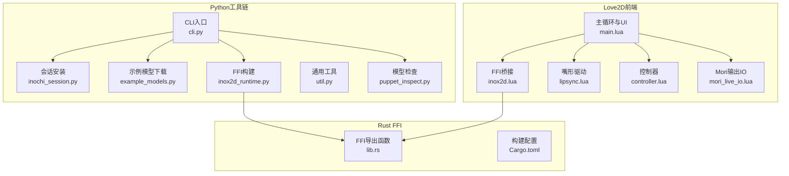
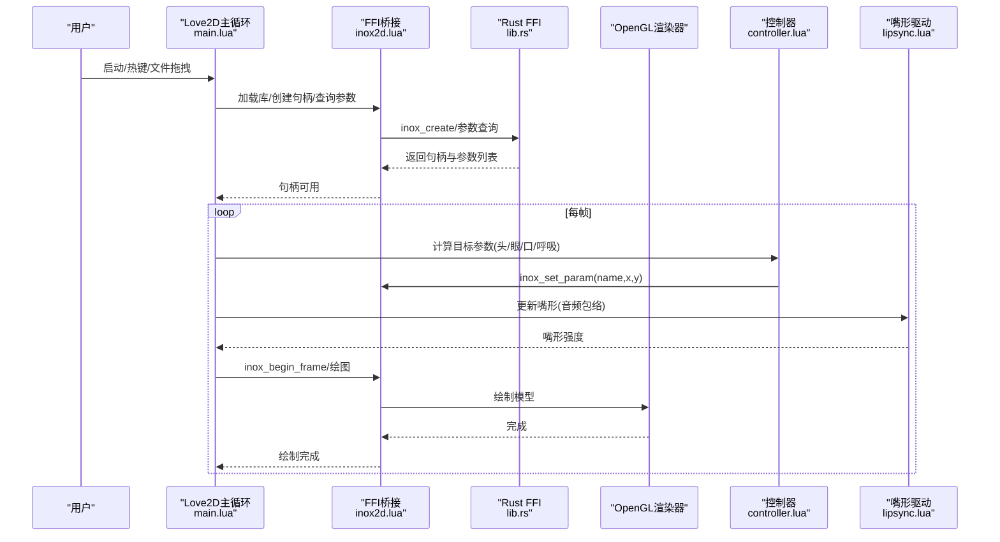
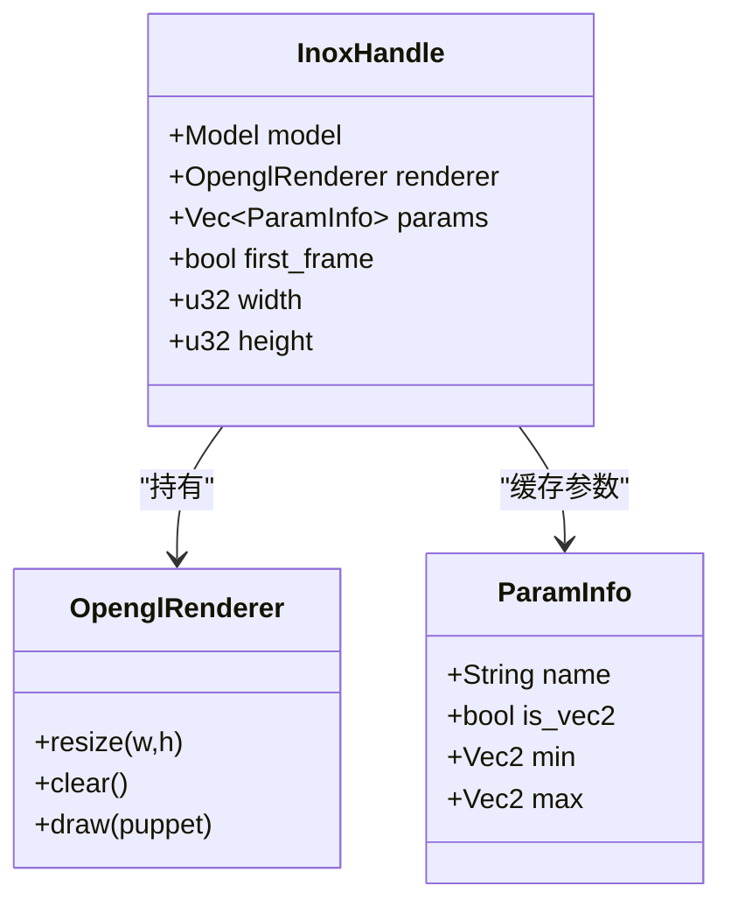
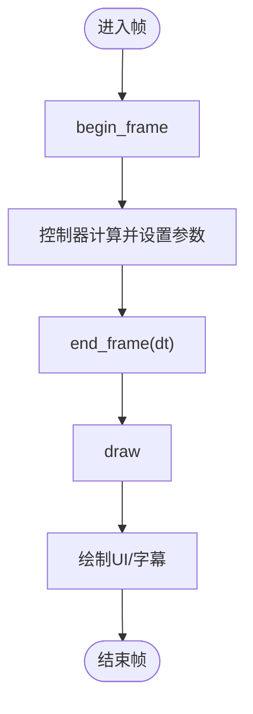
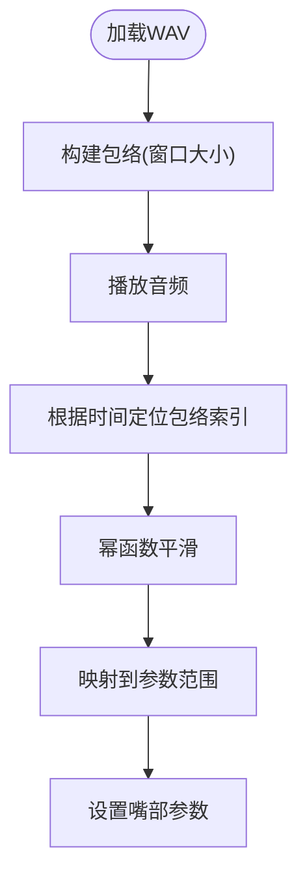
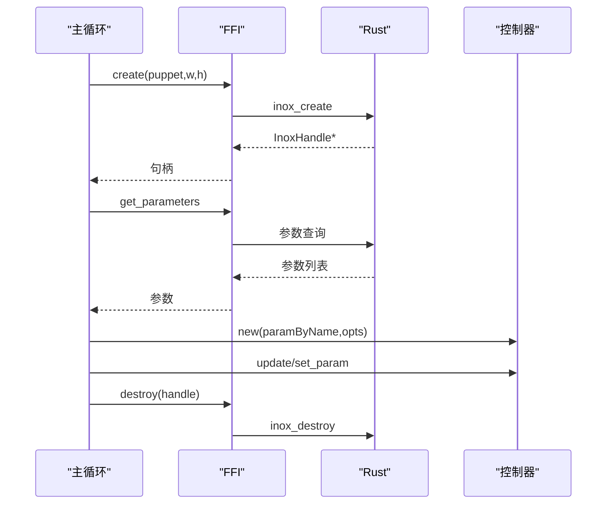
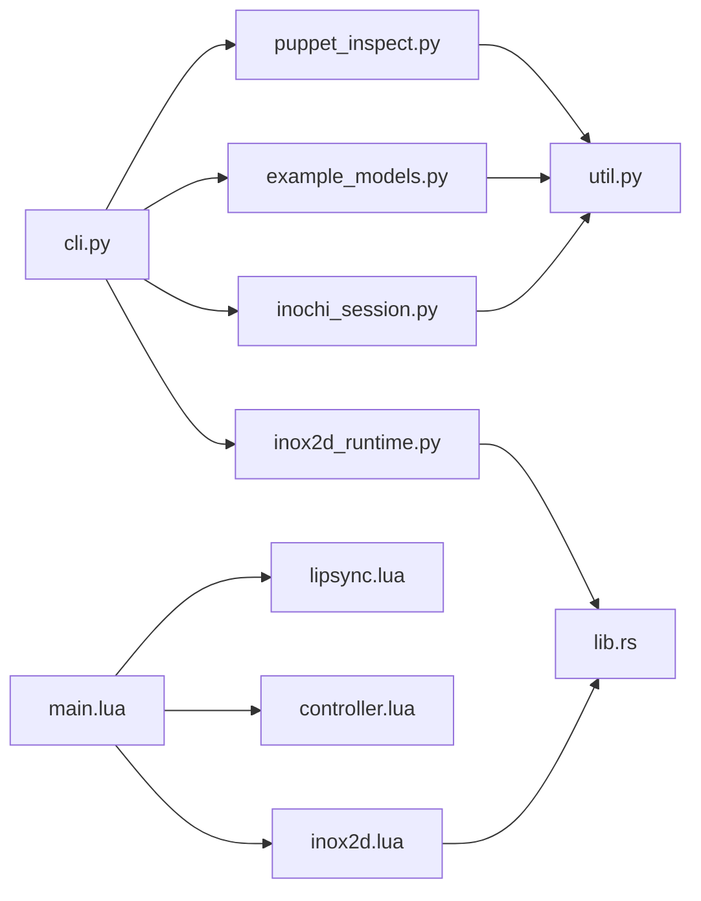

# Live2D集成架构

<cite>
**本文引用的文件**
- [README.md](file://mori_live2d/README.md)
- [__init__.py](file://mori_live2d/__init__.py)
- [cli.py](file://mori_live2d/cli.py)
- [inochi_session.py](file://mori_live2d/inochi_session.py)
- [inox2d_runtime.py](file://mori_live2d/inox2d_runtime.py)
- [puppet_inspect.py](file://mori_live2d/puppet_inspect.py)
- [util.py](file://mori_live2d/util.py)
- [example_models.py](file://mori_live2d/example_models.py)
- [main.lua](file://mori_live2d/love2d_frontend/main.lua)
- [inox2d.lua](file://mori_live2d/love2d_frontend/inox2d.lua)
- [lipsync.lua](file://mori_live2d/love2d_frontend/lipsync.lua)
- [controller.lua](file://mori_live2d/love2d_frontend/controller.lua)
- [mori_live_io.lua](file://mori_live2d/love2d_frontend/mori_live_io.lua)
- [lib.rs](file://mori_live2d/native/inox2d_ffi/src/lib.rs)
- [Cargo.toml](file://mori_live2d/native/inox2d_ffi/Cargo.toml)
- [Cargo.lock](file://mori_live2d/native/inox2d_ffi/Cargo.lock)
</cite>

## 目录
1. [简介](#简介)
2. [项目结构](#项目结构)
3. [核心组件](#核心组件)
4. [架构总览](#架构总览)
5. [详细组件分析](#详细组件分析)
6. [依赖分析](#依赖分析)
7. [性能考虑](#性能考虑)
8. [故障排查指南](#故障排查指南)
9. [结论](#结论)
10. [附录](#附录)

## 简介
本文件面向Mori Live2D集成系统，聚焦于Inochi2D（开源Live2D替代）与Love2D前端的协同架构，涵盖以下主题：
- Inochi2D架构设计：FFI绑定实现、C扩展模块、LuaJIT互操作
- Love2D前端系统：渲染管线、动画控制、用户交互
- 嘴形驱动系统：音频分析、表情同步、实时渲染
- Live2D会话管理：模型加载、状态维护、资源清理
- 使用指南、性能优化与调试方法
- Love2D前端开发指南与Live2D模型集成步骤

## 项目结构
mori_live2d子模块采用“Python工具链 + Rust FFI + Love2D前端”的分层组织方式：
- Python层：命令行工具、会话安装、模型下载、运行时构建、参数检查
- Rust层：Inox2D FFI绑定，封装OpenGL渲染器与参数接口
- Love2D层：LuaJIT脚本，通过FFI调用Rust库，驱动渲染与控制逻辑

图表来源
- [cli.py:1-125](file://mori_live2d/cli.py#L1-L125)
- [inochi_session.py:1-103](file://mori_live2d/inochi_session.py#L1-L103)
- [example_models.py:1-57](file://mori_live2d/example_models.py#L1-L57)
- [inox2d_runtime.py:1-64](file://mori_live2d/inox2d_runtime.py#L1-L64)
- [util.py:1-68](file://mori_live2d/util.py#L1-L68)
- [puppet_inspect.py:1-87](file://mori_live2d/puppet_inspect.py#L1-L87)
- [lib.rs:1-375](file://mori_live2d/native/inox2d_ffi/src/lib.rs#L1-L375)
- [Cargo.toml](file://mori_live2d/native/inox2d_ffi/Cargo.toml)
- [main.lua:1-631](file://mori_live2d/love2d_frontend/main.lua#L1-L631)
- [inox2d.lua:1-198](file://mori_live2d/love2d_frontend/inox2d.lua#L1-L198)
- [lipsync.lua:1-128](file://mori_live2d/love2d_frontend/lipsync.lua#L1-L128)
- [controller.lua:1-900](file://mori_live2d/love2d_frontend/controller.lua#L1-L900)
- [mori_live_io.lua](file://mori_live2d/love2d_frontend/mori_live_io.lua)

章节来源
- [README.md:1-157](file://mori_live2d/README.md#L1-L157)
- [__init__.py:1-3](file://mori_live2d/__init__.py#L1-L3)

## 核心组件
- CLI与会话管理：提供构建FFI、安装官方会话、下载示例模型、检查模型节点类型等能力
- Rust FFI：封装Inox2D模型解析、OpenGL渲染器初始化、参数查询与设置
- Love2D前端：通过LuaJIT FFI调用Rust库，实现渲染、参数驱动、嘴形同步、用户交互
- 嘴形驱动：基于音频包络的实时同步，平滑化处理以提升自然度
- 控制器：参数映射、平滑插值、随机抖动、鼠标跟随、眨眼与眼球运动

章节来源
- [cli.py:1-125](file://mori_live2d/cli.py#L1-L125)
- [inochi_session.py:1-103](file://mori_live2d/inochi_session.py#L1-L103)
- [example_models.py:1-57](file://mori_live2d/example_models.py#L1-L57)
- [puppet_inspect.py:1-87](file://mori_live2d/puppet_inspect.py#L1-L87)
- [lib.rs:1-375](file://mori_live2d/native/inox2d_ffi/src/lib.rs#L1-L375)
- [main.lua:1-631](file://mori_live2d/love2d_frontend/main.lua#L1-L631)
- [lipsync.lua:1-128](file://mori_live2d/love2d_frontend/lipsync.lua#L1-L128)
- [controller.lua:1-900](file://mori_live2d/love2d_frontend/controller.lua#L1-L900)

## 架构总览
整体数据流与控制流如下：
- Python工具负责准备模型与FFI库
- Love2D前端通过FFI加载模型并查询参数
- 控制器根据输入（鼠标、外部驱动、随机噪声）计算目标参数
- 嘴形驱动根据音频包络更新嘴部开合
- 渲染器在每帧绘制模型

图表来源
- [main.lua:156-400](file://mori_live2d/love2d_frontend/main.lua#L156-L400)
- [inox2d.lua:108-195](file://mori_live2d/love2d_frontend/inox2d.lua#L108-L195)
- [lib.rs:135-290](file://mori_live2d/native/inox2d_ffi/src/lib.rs#L135-L290)
- [controller.lua:700-800](file://mori_live2d/love2d_frontend/controller.lua#L700-L800)
- [lipsync.lua:109-125](file://mori_live2d/love2d_frontend/lipsync.lua#L109-L125)

## 详细组件分析

### Inochi2D FFI绑定与C扩展模块
- FFI导出函数：创建/销毁句柄、尺寸调整、帧开始/结束、参数设置、参数查询、绘制、错误报告
- OpenGL加载：通过GLX符号加载器动态获取OpenGL函数指针
- 模型初始化：解析.inp/.inx，初始化变换、渲染、参数、物理
- 参数缓存：按名称排序的参数信息，便于Lua侧查询与映射

图表来源
- [lib.rs:84-100](file://mori_live2d/native/inox2d_ffi/src/lib.rs#L84-L100)
- [lib.rs:116-133](file://mori_live2d/native/inox2d_ffi/src/lib.rs#L116-L133)
- [lib.rs:284-290](file://mori_live2d/native/inox2d_ffi/src/lib.rs#L284-L290)

章节来源
- [lib.rs:1-375](file://mori_live2d/native/inox2d_ffi/src/lib.rs#L1-L375)
- [Cargo.toml](file://mori_live2d/native/inox2d_ffi/Cargo.toml)
- [Cargo.lock](file://mori_live2d/native/inox2d_ffi/Cargo.lock)

### Love2D前端系统（渲染管线、动画控制、用户交互）
- 渲染管线：每帧begin_frame → 设置参数 → end_frame → draw；支持窗口大小变化
- 动画控制：头/身体姿态、眨眼、眼球运动、呼吸；可选鼠标跟随与随机抖动
- 用户交互：热键切换Idle/MouseLook/Blink/重载映射；拖拽更换模型
- 字幕与事件：轮询subtitle.txt与events.jsonl，驱动嘴形与TTS播放

图表来源
- [main.lua:293-400](file://mori_live2d/love2d_frontend/main.lua#L293-L400)
- [controller.lua:700-800](file://mori_live2d/love2d_frontend/controller.lua#L700-L800)
- [lib.rs:222-290](file://mori_live2d/native/inox2d_ffi/src/lib.rs#L222-L290)

章节来源
- [main.lua:156-631](file://mori_live2d/love2d_frontend/main.lua#L156-L631)
- [controller.lua:1-900](file://mori_live2d/love2d_frontend/controller.lua#L1-L900)

### 嘴形驱动系统（音频分析、表情同步、实时渲染）
- 包络提取：按固定窗口对采样求均方根，归一化得到包络
- 实时同步：根据播放进度定位包络索引，幂函数平滑，映射到参数范围
- 多源驱动：支持events.jsonl中的预计算包络、调试wav、实时mouth.txt流

图表来源
- [lipsync.lua:31-125](file://mori_live2d/love2d_frontend/lipsync.lua#L31-L125)
- [main.lua:323-399](file://mori_live2d/love2d_frontend/main.lua#L323-L399)

章节来源
- [lipsync.lua:1-128](file://mori_live2d/love2d_frontend/lipsync.lua#L1-L128)
- [main.lua:1-631](file://mori_live2d/love2d_frontend/main.lua#L1-L631)

### Live2D会话管理（模型加载、状态维护、资源清理）
- 模型加载：通过FFI创建句柄，查询参数，初始化控制器
- 状态维护：参数映射、选项（Idle/MouseLook/Blink）、平滑系数、眨眼/眼球/呼吸状态
- 资源清理：退出时销毁句柄，避免OpenGL上下文泄漏

图表来源
- [main.lua:238-282](file://mori_live2d/love2d_frontend/main.lua#L238-L282)
- [main.lua:628-630](file://mori_live2d/love2d_frontend/main.lua#L628-L630)
- [inox2d.lua:108-195](file://mori_live2d/love2d_frontend/inox2d.lua#L108-L195)
- [lib.rs:135-207](file://mori_live2d/native/inox2d_ffi/src/lib.rs#L135-L207)
- [controller.lua:601-632](file://mori_live2d/love2d_frontend/controller.lua#L601-L632)

章节来源
- [main.lua:1-631](file://mori_live2d/love2d_frontend/main.lua#L1-L631)
- [controller.lua:1-900](file://mori_live2d/love2d_frontend/controller.lua#L1-L900)
- [inox2d.lua:1-198](file://mori_live2d/love2d_frontend/inox2d.lua#L1-L198)
- [lib.rs:1-375](file://mori_live2d/native/inox2d_ffi/src/lib.rs#L1-L375)

## 依赖分析
- Python层依赖：标准库（argparse/json/pathlib/subprocess/urllib等），通过HTTP下载与解压
- Rust层依赖：glam、inox2d、inox2d_opengl、libloading、once_cell、glow
- Love2D层依赖：LuaJIT FFI、LÖVE图形/音频/文件系统API

图表来源
- [cli.py:1-125](file://mori_live2d/cli.py#L1-L125)
- [inochi_session.py:1-103](file://mori_live2d/inochi_session.py#L1-L103)
- [example_models.py:1-57](file://mori_live2d/example_models.py#L1-L57)
- [puppet_inspect.py:1-87](file://mori_live2d/puppet_inspect.py#L1-L87)
- [util.py:1-68](file://mori_live2d/util.py#L1-L68)
- [main.lua:1-631](file://mori_live2d/love2d_frontend/main.lua#L1-L631)
- [inox2d.lua:1-198](file://mori_live2d/love2d_frontend/inox2d.lua#L1-L198)
- [controller.lua:1-900](file://mori_live2d/love2d_frontend/controller.lua#L1-L900)
- [lipsync.lua:1-128](file://mori_live2d/love2d_frontend/lipsync.lua#L1-L128)
- [lib.rs:1-375](file://mori_live2d/native/inox2d_ffi/src/lib.rs#L1-L375)

章节来源
- [cli.py:1-125](file://mori_live2d/cli.py#L1-L125)
- [util.py:1-68](file://mori_live2d/util.py#L1-L68)
- [lib.rs:1-375](file://mori_live2d/native/inox2d_ffi/src/lib.rs#L1-L375)

## 性能考虑
- I/O轮询节流：字幕与mouth.txt轮询间隔降低磁盘压力
- 平滑插值：指数平滑减少参数跳跃，提升视觉连续性
- 包络缓存：预计算包络避免重复计算，窗口大小影响精度与内存
- OpenGL上下文：仅在必要时重建，避免频繁初始化
- 参数映射：优先vec2联合参数，减少设置次数
- 调试建议：启用调试模式观察参数映射与错误信息，定位渲染问题

[本节为通用指导，无需特定文件引用]

## 故障排查指南
- FFI库缺失：确认已构建并放置libmori_inox2d.so，或设置MORI_INOX2D_LIB
- 模型不完整：使用inspect-puppet检查节点类型，未知类型可能导致部分部件不渲染
- 平台问题：Linux Wayland可强制X11运行官方会话
- 参数映射：提供.mori-map覆盖映射，或使用自动匹配关键词
- 渲染异常：检查OpenGL加载器与渲染器初始化错误

章节来源
- [README.md:10-157](file://mori_live2d/README.md#L10-L157)
- [cli.py:95-118](file://mori_live2d/cli.py#L95-L118)
- [inochi_session.py:84-102](file://mori_live2d/inochi_session.py#L84-L102)
- [puppet_inspect.py:60-87](file://mori_live2d/puppet_inspect.py#L60-L87)
- [main.lua:226-229](file://mori_live2d/love2d_frontend/main.lua#L226-L229)

## 结论
本架构以Python工具链准备环境、Rust FFI提供高性能渲染与参数接口、Love2D前端实现直观控制与实时同步，形成轻量且可扩展的Live2D集成方案。当前Inox2D仍处于原型阶段，建议结合参数映射与调试工具逐步完善表现力。

[本节为总结，无需特定文件引用]

## 附录

### FFI绑定使用指南
- 构建FFI库：使用命令行工具构建并复制到模型目录
- 运行前端：在仓库根目录启动Love2D，或通过环境变量指定路径
- 热键控制：H/I/F/B/R分别控制帮助、Idle、MouseLook、Blink与重载映射
- 参数映射：提供.mori-map或.mori.lua覆盖映射，支持反向参数

章节来源
- [README.md:16-157](file://mori_live2d/README.md#L16-L157)
- [cli.py:20-54](file://mori_live2d/cli.py#L20-L54)
- [main.lua:555-588](file://mori_live2d/love2d_frontend/main.lua#L555-L588)
- [controller.lua:101-167](file://mori_live2d/love2d_frontend/controller.lua#L101-L167)

### 性能优化建议
- 降低轮询频率：字幕与mouth.txt轮询间隔可调
- 减少参数设置：合并vec2参数，减少set_param调用
- 包络窗口：平衡精度与内存占用
- 平滑系数：根据设备性能调整tau值

章节来源
- [main.lua:296-321](file://mori_live2d/love2d_frontend/main.lua#L296-L321)
- [controller.lua:556-592](file://mori_live2d/love2d_frontend/controller.lua#L556-L592)
- [lipsync.lua:31-60](file://mori_live2d/love2d_frontend/lipsync.lua#L31-L60)

### 调试方法
- 错误信息：FFI提供last_error接口，Lua侧可通过inoxi.lua暴露
- 日志输出：前端打印参数列表、映射文件路径、渲染器信息
- 截图：支持自动截图，便于CI与离线验证

章节来源
- [inox2d.lua:91-106](file://mori_live2d/love2d_frontend/inox2d.lua#L91-L106)
- [main.lua:401-454](file://mori_live2d/love2d_frontend/main.lua#L401-L454)

### Love2D前端开发指南
- 主循环：love.load/love.update/love.draw三段式结构
- FFI调用：通过require("inox2d")访问导出函数
- 控制器：new/make_mapping/update组合使用
- 嘴形：load_wav_for_playback + update_mouth
- IO：轮询subtitle.txt与events.jsonl

章节来源
- [main.lua:156-631](file://mori_live2d/love2d_frontend/main.lua#L156-L631)
- [controller.lua:601-900](file://mori_live2d/love2d_frontend/controller.lua#L601-L900)
- [lipsync.lua:62-125](file://mori_live2d/love2d_frontend/lipsync.lua#L62-L125)
- [mori_live_io.lua](file://mori_live2d/love2d_frontend/mori_live_io.lua)

### Live2D模型集成步骤
- 安装示例模型：下载Aka/Midori等示例模型
- 构建FFI库：确保Rust工具链与OpenGL依赖就绪
- 运行前端：启动Love2D，拖拽模型或通过环境变量指定路径
- 配置映射：提供.mori-map覆盖参数名，或使用自动匹配
- 集成TTS：生成events.jsonl与wav，前端自动播放并驱动嘴形

章节来源
- [README.md:97-157](file://mori_live2d/README.md#L97-L157)
- [example_models.py:37-57](file://mori_live2d/example_models.py#L37-L57)
- [cli.py:36-54](file://mori_live2d/cli.py#L36-L54)
- [main.lua:190-225](file://mori_live2d/love2d_frontend/main.lua#L190-L225)