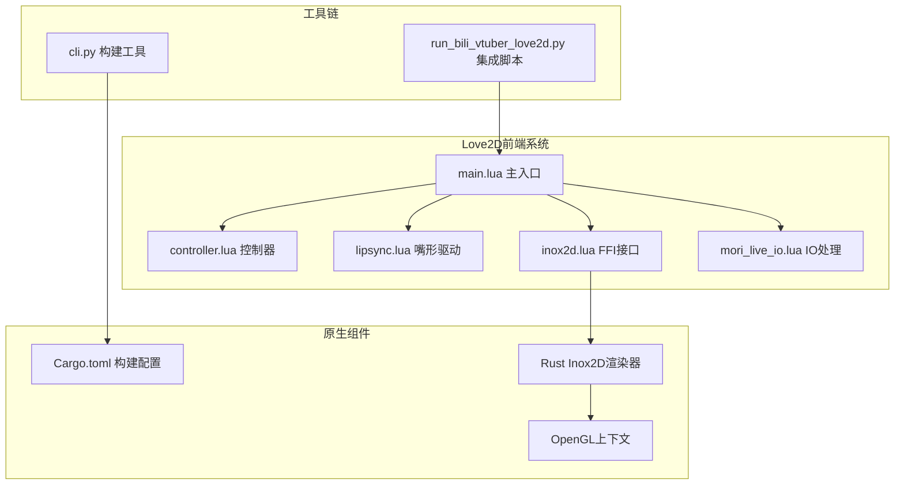
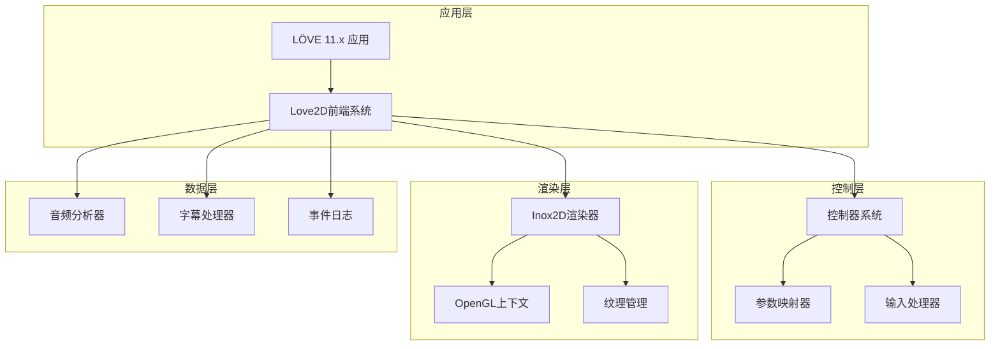
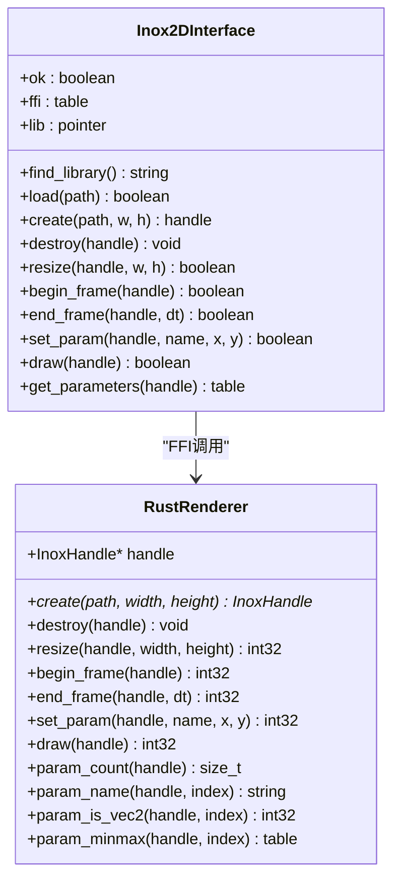
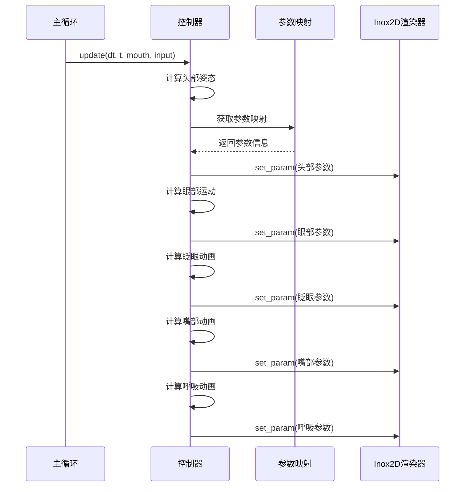
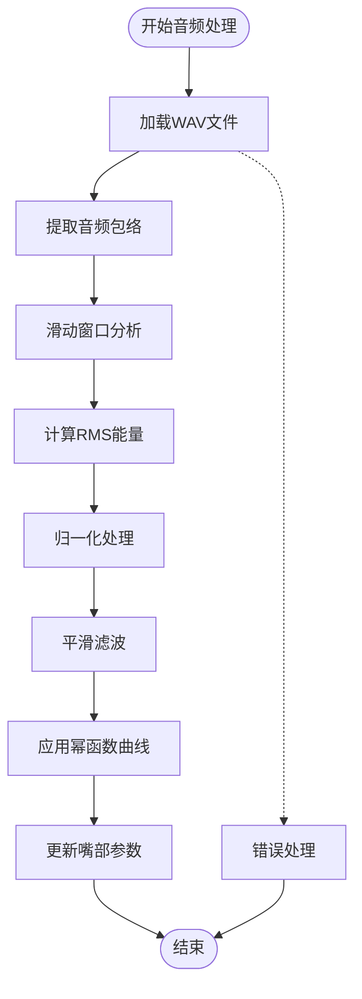
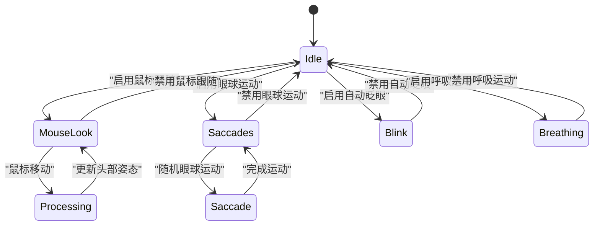
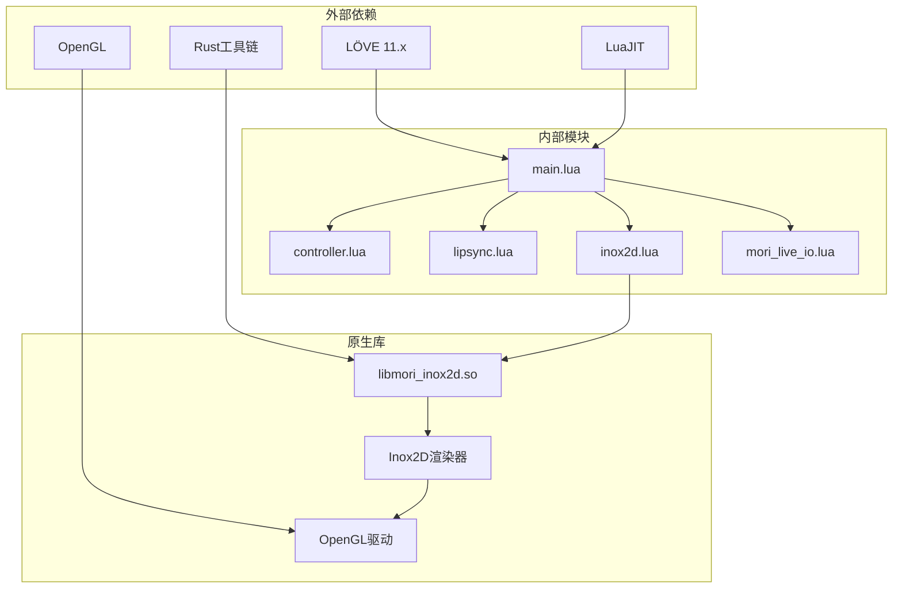

# Love2D前端系统

<cite>
**本文档引用的文件**
- [main.lua](file://mori_live2d/love2d_frontend/main.lua)
- [controller.lua](file://mori_live2d/love2d_frontend/controller.lua)
- [lipsync.lua](file://mori_live2d/love2d_frontend/lipsync.lua)
- [inox2d.lua](file://mori_live2d/love2d_frontend/inox2d.lua)
- [mori_live_io.lua](file://mori_live2d/love2d_frontend/mori_live_io.lua)
- [cli.py](file://mori_live2d/cli.py)
- [Cargo.toml](file://mori_live2d/native/inox2d_ffi/Cargo.toml)
- [README.md](file://mori_live2d/README.md)
- [third_party/README.md](file://mori_live2d/third_party/README.md)
- [third_party/inox2d/README.md](file://mori_live2d/third_party/inox2d/README.md)
- [run_bili_vtuber_love2d.py](file://scripts/run_bili_vtuber_love2d.py)
</cite>

## 目录
1. [简介](#简介)
2. [项目结构](#项目结构)
3. [核心组件](#核心组件)
4. [架构概览](#架构概览)
5. [详细组件分析](#详细组件分析)
6. [依赖关系分析](#依赖关系分析)
7. [性能考虑](#性能考虑)
8. [故障排除指南](#故障排除指南)
9. [结论](#结论)
10. [附录](#附录)

## 简介

Love2D前端系统是一个基于LÖVE 11.x（LuaJIT）的游戏引擎前端，专门用于渲染Inochi2D（开源Live2D替代方案）模型。该系统实现了完整的VTuber工作流，包括模型渲染、音频分析、表情同步和实时交互控制。

系统的核心特点：
- **Inox2D集成**：通过LuaJIT FFI调用Rust编写的Inox2D渲染器
- **实时渲染**：支持OpenGL渲染管道，提供流畅的动画播放
- **音频驱动**：基于音频分析的嘴形同步系统
- **交互控制**：支持鼠标键盘事件、触摸手势和热键绑定
- **参数映射**：智能的模型参数自动匹配和手动覆盖机制

## 项目结构

**图表来源**
- [main.lua:15-283](file://mori_live2d/love2d_frontend/main.lua#L15-L283)
- [Cargo.toml:1-16](file://mori_live2d/native/inox2d_ffi/Cargo.toml#L1-L16)

**章节来源**
- [README.md:16-56](file://mori_live2d/README.md#L16-L56)
- [third_party/README.md:1-14](file://mori_live2d/third_party/README.md#L1-L14)

## 核心组件

### 窗口管理系统

Love2D前端系统提供了完整的窗口管理功能：

- **窗口初始化**：设置900x700像素初始尺寸，支持可调整大小和垂直同步
- **字体系统**：自动检测并加载CJK字体，支持多语言显示
- **渲染器信息**：检测并报告当前OpenGL渲染器信息
- **路径解析**：智能解析模型和资源文件路径

### 渲染循环系统

系统采用标准的LÖVE渲染循环模式：

- **love.load()**：初始化阶段，加载模型和配置
- **love.update(dt)**：每帧更新，处理音频队列和参数更新
- **love.draw()**：渲染阶段，绘制模型和UI覆盖层
- **love.resize(w,h)**：窗口大小变化响应

### 事件处理系统

支持多种事件类型：

- **键盘事件**：热键控制（H/I/F/B/R）
- **文件拖拽**：动态切换模型文件
- **鼠标事件**：窗口大小调整和文件拖放
- **退出事件**：优雅关闭所有资源

**章节来源**
- [main.lua:156-283](file://mori_live2d/love2d_frontend/main.lua#L156-L283)
- [main.lua:293-399](file://mori_live2d/love2d_frontend/main.lua#L293-L399)
- [main.lua:401-553](file://mori_live2d/love2d_frontend/main.lua#L401-L553)

## 架构概览

**图表来源**
- [main.lua:15-18](file://mori_live2d/love2d_frontend/main.lua#L15-L18)
- [controller.lua:601-632](file://mori_live2d/love2d_frontend/controller.lua#L601-L632)
- [lipsync.lua:62-107](file://mori_live2d/love2d_frontend/lipsync.lua#L62-L107)

## 详细组件分析

### Inox2D FFI接口

Inox2D FFI接口提供了Lua到Rust的桥接层：

**图表来源**
- [inox2d.lua:37-197](file://mori_live2d/love2d_frontend/inox2d.lua#L37-L197)

**章节来源**
- [inox2d.lua:108-161](file://mori_live2d/love2d_frontend/inox2d.lua#L108-L161)
- [Cargo.toml:9-16](file://mori_live2d/native/inox2d_ffi/Cargo.toml#L9-L16)

### 控制器系统

控制器系统实现了复杂的动画控制逻辑：

**图表来源**
- [controller.lua:700-872](file://mori_live2d/love2d_frontend/controller.lua#L700-L872)

**章节来源**
- [controller.lua:201-452](file://mori_live2d/love2d_frontend/controller.lua#L201-L452)
- [controller.lua:634-680](file://mori_live2d/love2d_frontend/controller.lua#L634-L680)

### 嘴形驱动系统

嘴形驱动系统实现了基于音频的实时同步：

**图表来源**
- [lipsync.lua:31-60](file://mori_live2d/love2d_frontend/lipsync.lua#L31-L60)
- [lipsync.lua:109-125](file://mori_live2d/love2d_frontend/lipsync.lua#L109-L125)

**章节来源**
- [lipsync.lua:62-107](file://mori_live2d/love2d_frontend/lipsync.lua#L62-L107)

### 参数映射系统

参数映射系统提供了灵活的模型参数绑定：

| 参数类别 | 关键词模式 | 支持模式 | 示例参数 |
|---------|-----------|----------|----------|
| 头部旋转 | head, yaw, pitch, roll | vec2_signed/singed | Head::Yaw, Neck::Pitch |
| 身体跟随 | body, yaw, pitch, roll | vec2_signed/singed | Body::Yaw, Spine::Roll |
| 嘴部开口 | mouth, open, jaw | 01 | Mouth::Open, Jaw::Open |
| 眼球运动 | eye, ball, look | vec2_signed/singed | Eye::Look, EyeL::X |
| 眼睑开合 | eye, open, blink | 01 | EyeL::Open, EyeR::Open |
| 呼吸运动 | breath, chest | signed | Breath::Chest |

**章节来源**
- [controller.lua:260-449](file://mori_live2d/love2d_frontend/controller.lua#L260-L449)

### 交互控制系统

系统支持多种交互方式：

**图表来源**
- [controller.lua:682-698](file://mori_live2d/love2d_frontend/controller.lua#L682-L698)
- [controller.lua:813-821](file://mori_live2d/love2d_frontend/controller.lua#L813-L821)

**章节来源**
- [main.lua:555-588](file://mori_live2d/love2d_frontend/main.lua#L555-L588)
- [controller.lua:556-592](file://mori_live2d/love2d_frontend/controller.lua#L556-L592)

## 依赖关系分析

**图表来源**
- [main.lua:15-18](file://mori_live2d/love2d_frontend/main.lua#L15-L18)
- [Cargo.toml:1-16](file://mori_live2d/native/inox2d_ffi/Cargo.toml#L1-L16)

**章节来源**
- [third_party/README.md:7-13](file://mori_live2d/third_party/README.md#L7-L13)
- [third_party/inox2d/README.md:33-58](file://mori_live2d/third_party/inox2d/README.md#L33-L58)

## 性能考虑

### 渲染性能优化

1. **参数缓存**：避免重复查询模型参数
2. **平滑算法**：使用指数平滑减少参数抖动
3. **批量更新**：每帧统一更新所有参数
4. **纹理复用**：Inox2D渲染器自动管理纹理缓存

### 内存管理

1. **资源清理**：程序退出时自动释放所有资源
2. **文件句柄**：及时关闭文件描述符
3. **音频缓冲**：合理管理音频播放源
4. **内存池**：避免频繁的内存分配

### 线程安全

1. **单线程模型**：LÖVE使用单线程渲染循环
2. **FFI调用**：确保Rust代码线程安全
3. **状态同步**：通过Lua表传递状态信息

## 故障排除指南

### 常见问题及解决方案

| 问题类型 | 症状 | 解决方案 |
|---------|------|----------|
| 模型加载失败 | "puppet file not found" | 检查模型路径和权限 |
| FFI模块缺失 | "Missing LuaJIT FFI" | 安装LÖVE 11.x版本 |
| 渲染器错误 | OpenGL错误 | 更新显卡驱动 |
| 音频播放失败 | 无法播放WAV文件 | 检查音频文件格式 |
| 参数映射失败 | 动画不正确 | 检查.mori-map文件 |

### 调试技巧

1. **启用详细日志**：检查控制台输出
2. **参数可视化**：使用帮助界面查看参数映射
3. **性能监控**：观察帧率和内存使用
4. **错误处理**：捕获并记录异常信息

**章节来源**
- [main.lua:226-241](file://mori_live2d/love2d_frontend/main.lua#L226-L241)
- [main.lua:413-415](file://mori_live2d/love2d_frontend/main.lua#L413-L415)

## 结论

Love2D前端系统成功地将Inochi2D渲染器与LÖVE游戏引擎结合，创建了一个功能完整的VTuber解决方案。系统的主要优势包括：

1. **模块化设计**：清晰的组件分离便于维护和扩展
2. **高性能渲染**：基于OpenGL的高效渲染管道
3. **智能控制**：自动化的参数映射和动画控制
4. **易用性**：简化的配置和部署流程

未来改进方向：
- 完善动画系统支持
- 增强触摸交互功能
- 优化性能表现
- 扩展更多模型兼容性

## 附录

### 开发指南

1. **环境准备**：安装LÖVE 11.x和Rust工具链
2. **构建步骤**：运行`python3 -m mori_live2d.cli build-inox2d`
3. **运行应用**：`love mori_live2d/love2d_frontend`
4. **配置选项**：通过环境变量自定义行为

### API参考

| 函数 | 参数 | 返回值 | 描述 |
|------|------|--------|------|
| `love.load()` | 无 | 无 | 初始化阶段 |
| `love.update(dt)` | dt: 时间增量 | 无 | 更新逻辑 |
| `love.draw()` | 无 | 无 | 渲染阶段 |
| `love.keypressed(key)` | key: 键码 | 无 | 键盘事件 |
| `love.filedropped(file)` | file: 文件对象 | 无 | 文件拖拽事件 |

### 配置选项

| 环境变量 | 默认值 | 描述 |
|---------|--------|------|
| `MORI_LIVE_DIR` | `live` | Live目录路径 |
| `MORI_PUPPET_PATH` | `model/inochi2d/puppets/aka/Aka.inx` | 模型文件路径 |
| `MORI_MOUSE_LOOK` | `0` | 是否启用鼠标跟随 |
| `MORI_FONT_PATH` | 自动检测 | 字体文件路径 |
| `MORI_INOX2D_LIB` | 自动查找 | Inox2D库路径 |

**章节来源**
- [README.md:38-66](file://mori_live2d/README.md#L38-L66)
- [run_bili_vtuber_love2d.py:201-397](file://scripts/run_bili_vtuber_love2d.py#L201-L397)