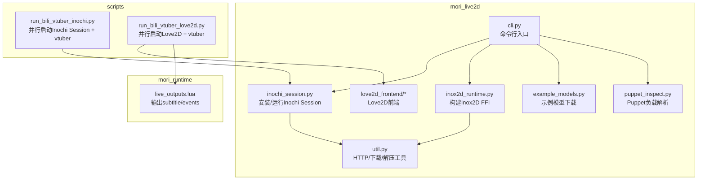
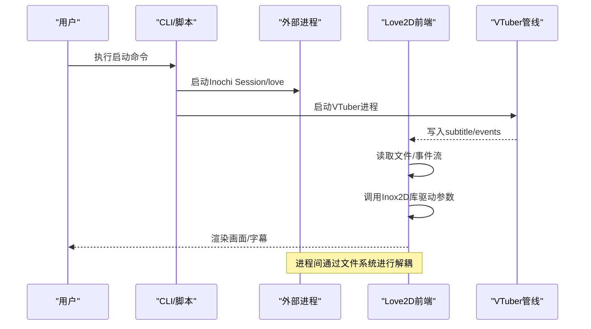
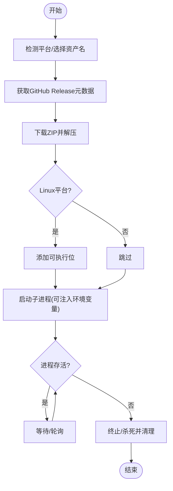
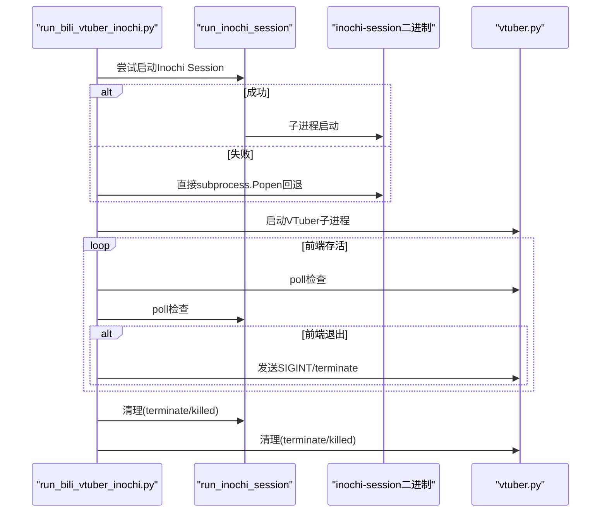
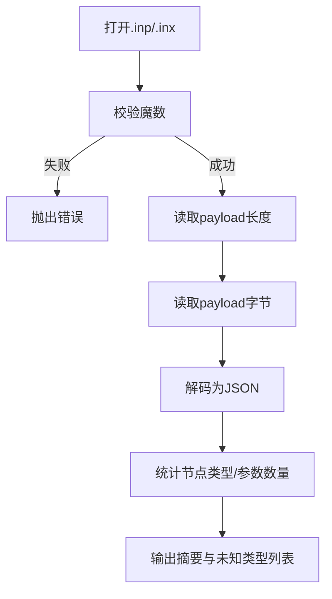
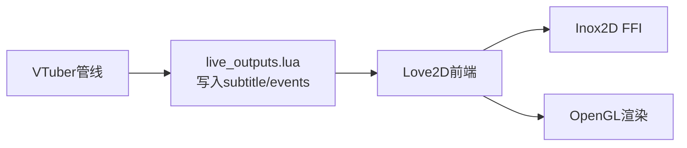
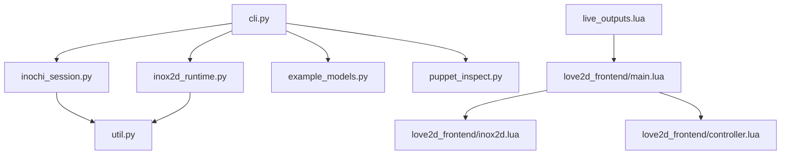

# 会话管理系统

<cite>
**本文引用的文件**
- [mori_live2d/inochi_session.py](file://mori_live2d/inochi_session.py)
- [mori_live2d/inox2d_runtime.py](file://mori_live2d/inox2d_runtime.py)
- [mori_live2d/cli.py](file://mori_live2d/cli.py)
- [mori_live2d/util.py](file://mori_live2d/util.py)
- [mori_live2d/example_models.py](file://mori_live2d/example_models.py)
- [mori_live2d/puppet_inspect.py](file://mori_live2d/puppet_inspect.py)
- [mori_live2d/README.md](file://mori_live2d/README.md)
- [mori_live2d/love2d_frontend/main.lua](file://mori_live2d/love2d_frontend/main.lua)
- [mori_live2d/love2d_frontend/controller.lua](file://mori_live2d/love2d_frontend/controller.lua)
- [mori_live2d/love2d_frontend/inox2d.lua](file://mori_live2d/love2d_frontend/inox2d.lua)
- [scripts/run_bili_vtuber_inochi.py](file://scripts/run_bili_vtuber_inochi.py)
- [scripts/run_bili_vtuber_love2d.py](file://scripts/run_bili_vtuber_love2d.py)
- [mori_runtime/lua/mori/plugins/live_outputs.lua](file://mori_runtime/lua/mori/plugins/live_outputs.lua)
</cite>

## 目录
1. [简介](#简介)
2. [项目结构](#项目结构)
3. [核心组件](#核心组件)
4. [架构总览](#架构总览)
5. [详细组件分析](#详细组件分析)
6. [依赖分析](#依赖分析)
7. [性能考虑](#性能考虑)
8. [故障排查指南](#故障排查指南)
9. [结论](#结论)
10. [附录](#附录)

## 简介
本文件面向Live2D会话管理系统，聚焦于InochiSession的生命周期管理、外部进程管理、配置与环境变量、故障恢复策略、性能监控与日志调试等方面。文档以mori_live2d子模块为核心，结合运行脚本与Love2D前端，给出从安装、启动、监控到退出的完整流程说明与可视化图示。

## 项目结构
mori_live2d子模块围绕Inochi2D生态提供以下能力：
- 官方前端（Inochi Session）的自动安装与运行封装
- Inox2D FFI运行时的构建与库分发
- 示例模型的下载与校验
- Puppet负载解析与诊断
- CLI入口与运行脚本（支持并行启动Love2D前端与VTuber管线）

图表来源
- [mori_live2d/cli.py:1-125](file://mori_live2d/cli.py#L1-L125)
- [mori_live2d/inochi_session.py:1-103](file://mori_live2d/inochi_session.py#L1-L103)
- [mori_live2d/inox2d_runtime.py:1-64](file://mori_live2d/inox2d_runtime.py#L1-L64)
- [mori_live2d/util.py:1-68](file://mori_live2d/util.py#L1-L68)
- [mori_live2d/example_models.py:1-57](file://mori_live2d/example_models.py#L1-L57)
- [mori_live2d/puppet_inspect.py:1-87](file://mori_live2d/puppet_inspect.py#L1-L87)
- [scripts/run_bili_vtuber_inochi.py:1-232](file://scripts/run_bili_vtuber_inochi.py#L1-L232)
- [scripts/run_bili_vtuber_love2d.py:1-401](file://scripts/run_bili_vtuber_love2d.py#L1-L401)
- [mori_runtime/lua/mori/plugins/live_outputs.lua:53-113](file://mori_runtime/lua/mori/plugins/live_outputs.lua#L53-L113)

章节来源
- [mori_live2d/README.md:1-157](file://mori_live2d/README.md#L1-L157)

## 核心组件
- InochiSession安装与运行
  - 自动检测平台、下载最新发布包、解压并设置执行权限
  - 通过子进程启动二进制，注入环境变量（Linux下追加LD_LIBRARY_PATH）
- Inox2D FFI构建
  - 使用cargo构建原生共享库，复制到目标目录供Love2D前端加载
- CLI命令体系
  - build-inox2d、install-session、install-models、run-session、inspect-puppet
- Puppet诊断
  - 解析.inp/.inx负载，统计节点类型与参数数量，识别未知节点类型
- 运行脚本
  - 并行启动前端与VTuber管线，统一参数传递与信号处理

章节来源
- [mori_live2d/inochi_session.py:1-103](file://mori_live2d/inochi_session.py#L1-L103)
- [mori_live2d/inox2d_runtime.py:1-64](file://mori_live2d/inox2d_runtime.py#L1-L64)
- [mori_live2d/cli.py:1-125](file://mori_live2d/cli.py#L1-L125)
- [mori_live2d/puppet_inspect.py:1-87](file://mori_live2d/puppet_inspect.py#L1-L87)
- [scripts/run_bili_vtuber_inochi.py:122-232](file://scripts/run_bili_vtuber_inochi.py#L122-L232)
- [scripts/run_bili_vtuber_love2d.py:201-401](file://scripts/run_bili_vtuber_love2d.py#L201-L401)

## 架构总览
系统采用“外部进程 + 文件/事件流”的会话模式：
- Inochi Session作为官方前端，由Python脚本启动并监控
- Love2D前端通过LuaJIT FFI调用Inox2D库渲染模型，同时消费subtitle/events文件进行嘴型同步与UI展示
- VTuber管线负责弹幕采集、LLM推理、字幕生成与音频事件写入，供前端消费

图表来源
- [scripts/run_bili_vtuber_inochi.py:122-232](file://scripts/run_bili_vtuber_inochi.py#L122-L232)
- [scripts/run_bili_vtuber_love2d.py:201-401](file://scripts/run_bili_vtuber_love2d.py#L201-L401)
- [mori_runtime/lua/mori/plugins/live_outputs.lua:53-113](file://mori_runtime/lua/mori/plugins/live_outputs.lua#L53-L113)
- [mori_live2d/love2d_frontend/main.lua:156-400](file://mori_live2d/love2d_frontend/main.lua#L156-L400)

## 详细组件分析

### InochiSession生命周期管理
- 初始化
  - 自动检测平台，定位资产名称与二进制文件名
  - 从GitHub Releases获取最新版本元数据，下载对应压缩包并解压
  - Linux平台为可执行位添加执行权限
- 运行
  - 通过子进程启动二进制，支持自定义工作目录与环境变量
  - Linux下自动追加LD_LIBRARY_PATH，确保依赖库可见
- 退出与清理
  - 脚本中提供终止与强制杀死的清理逻辑，避免僵尸进程

图表来源
- [mori_live2d/inochi_session.py:24-101](file://mori_live2d/inochi_session.py#L24-L101)

章节来源
- [mori_live2d/inochi_session.py:1-103](file://mori_live2d/inochi_session.py#L1-L103)

### 外部进程管理机制
- 进程启动
  - run_inochi_session：标准化启动入口，支持extra_env注入
  - run_bili_vtuber_inochi.py：优先使用run_inochi_session，失败则直接subprocess.Popen回退
  - run_bili_vtuber_love2d.py：Love2D前端通过love命令启动，VTuber通过python子进程启动
- 进程监控
  - 定期poll检查子进程状态，若前端退出则主动停止VTuber
- 重启与回退
  - 若run_inochi_session失败，脚本回退到直接启动二进制
  - 支持--x11参数在Linux Wayland环境下注入SDL_VIDEODRIVER=x11

图表来源
- [scripts/run_bili_vtuber_inochi.py:122-232](file://scripts/run_bili_vtuber_inochi.py#L122-L232)

章节来源
- [scripts/run_bili_vtuber_inochi.py:122-232](file://scripts/run_bili_vtuber_inochi.py#L122-L232)

### 会话配置管理
- 模型路径设置
  - Love2D前端通过MORI_PUPPET_PATH或命令行参数指定.puppet文件
  - CLI提供install-models子命令，下载示例模型至model/inochi2d/puppets
- 参数传递与环境变量
  - run_bili_vtuber_love2d.py：注入MORI_LIVE_DIR、MORI_PUPPET_PATH、MORI_INOX2D_LIB、MORI_MOUSE_LOOK、MORI_MAPPING_PATH等
  - run_bili_vtuber_inochi.py：在Linux Wayland下注入SDL_VIDEODRIVER=x11
  - Love2D前端：从环境变量或命令行解析subtitle/events/mouth等路径
- Puppet映射
  - 支持.mori-map或.mori.lua覆盖映射，Love2D前端自动发现同目录映射文件

章节来源
- [mori_live2d/cli.py:13-125](file://mori_live2d/cli.py#L13-L125)
- [mori_live2d/example_models.py:1-57](file://mori_live2d/example_models.py#L1-L57)
- [scripts/run_bili_vtuber_love2d.py:201-401](file://scripts/run_bili_vtuber_love2d.py#L201-L401)
- [mori_live2d/love2d_frontend/main.lua:190-225](file://mori_live2d/love2d_frontend/main.lua#L190-L225)
- [mori_live2d/love2d_frontend/controller.lua:169-186](file://mori_live2d/love2d_frontend/controller.lua#L169-L186)

### Puppet负载解析与诊断
- 载荷读取
  - 校验魔数、读取payload长度与JSON内容
- 统计与报告
  - 统计节点类型分布，识别未知类型
  - 输出参数总数与meta信息
- 用途
  - 在Love2D渲染前帮助判断模型兼容性与缺失特性

图表来源
- [mori_live2d/puppet_inspect.py:36-87](file://mori_live2d/puppet_inspect.py#L36-L87)

章节来源
- [mori_live2d/puppet_inspect.py:1-87](file://mori_live2d/puppet_inspect.py#L1-L87)

### Love2D前端与VTuber数据流
- 前端职责
  - 加载Inox2D库与.puppet，渲染并驱动参数
  - 读取subtitle与events文件，实现字幕叠加与嘴型同步
- VTuber职责
  - 生成subtitle.txt与events.jsonl，必要时生成wav
- 数据通道
  - live_outputs.lua插件负责写入subtitle与events，供前端消费

图表来源
- [mori_runtime/lua/mori/plugins/live_outputs.lua:53-113](file://mori_runtime/lua/mori/plugins/live_outputs.lua#L53-L113)
- [mori_live2d/love2d_frontend/main.lua:156-400](file://mori_live2d/love2d_frontend/main.lua#L156-L400)
- [mori_live2d/love2d_frontend/inox2d.lua:108-195](file://mori_live2d/love2d_frontend/inox2d.lua#L108-L195)

章节来源
- [mori_runtime/lua/mori/plugins/live_outputs.lua:53-113](file://mori_runtime/lua/mori/plugins/live_outputs.lua#L53-L113)
- [mori_live2d/love2d_frontend/main.lua:156-400](file://mori_live2d/love2d_frontend/main.lua#L156-L400)
- [mori_live2d/love2d_frontend/inox2d.lua:1-198](file://mori_live2d/love2d_frontend/inox2d.lua#L1-L198)

## 依赖分析
- 模块内聚与耦合
  - inochi_session.py与util.py强耦合（HTTP/下载/解压）
  - inox2d_runtime.py与系统工具链（cargo）强耦合
  - CLI作为门面，聚合上述功能
- 外部依赖
  - Python subprocess用于外部进程管理
  - LÖVE/LuaJIT用于前端渲染与事件循环
  - GitHub Releases用于Inochi Session二进制分发

图表来源
- [mori_live2d/cli.py:1-125](file://mori_live2d/cli.py#L1-L125)
- [mori_live2d/inochi_session.py:1-103](file://mori_live2d/inochi_session.py#L1-L103)
- [mori_live2d/inox2d_runtime.py:1-64](file://mori_live2d/inox2d_runtime.py#L1-L64)
- [mori_live2d/util.py:1-68](file://mori_live2d/util.py#L1-L68)
- [mori_live2d/example_models.py:1-57](file://mori_live2d/example_models.py#L1-L57)
- [mori_live2d/puppet_inspect.py:1-87](file://mori_live2d/puppet_inspect.py#L1-L87)
- [mori_live2d/love2d_frontend/main.lua:156-400](file://mori_live2d/love2d_frontend/main.lua#L156-L400)
- [mori_live2d/love2d_frontend/inox2d.lua:1-198](file://mori_live2d/love2d_frontend/inox2d.lua#L1-L198)
- [mori_live2d/love2d_frontend/controller.lua:1-200](file://mori_live2d/love2d_frontend/controller.lua#L1-L200)
- [mori_runtime/lua/mori/plugins/live_outputs.lua:53-113](file://mori_runtime/lua/mori/plugins/live_outputs.lua#L53-L113)

## 性能考虑
- I/O频率控制
  - Love2D前端对subtitle与mouth值采用定时轮询，降低磁盘压力
- 渲染与参数更新
  - 每帧begin_frame/end_frame调用Inox2D接口，参数更新采用指数平滑减少抖动
- 构建与分发
  - Inox2D FFI构建仅在首次或缺失时执行，避免重复编译
- 运行时优化
  - Linux下自动设置LD_LIBRARY_PATH，减少运行时库查找开销

章节来源
- [mori_live2d/love2d_frontend/main.lua:296-320](file://mori_live2d/love2d_frontend/main.lua#L296-L320)
- [mori_live2d/love2d_frontend/controller.lua:22-31](file://mori_live2d/love2d_frontend/controller.lua#L22-L31)
- [mori_live2d/inochi_session.py:96-101](file://mori_live2d/inochi_session.py#L96-L101)

## 故障排查指南
- Inochi Session无法启动（Linux Wayland）
  - 使用--x11参数注入SDL_VIDEODRIVER=x11
  - 若run_inochi_session失败，脚本会回退到直接启动二进制
- Love2D前端无渲染或参数不生效
  - 检查MORI_PUPPET_PATH与MORI_INOX2D_LIB是否正确
  - 使用inspect-puppet确认节点类型与参数是否存在
- VTuber输出未被前端消费
  - 确认MORI_LIVE_DIR与subtitle/events路径一致
  - 检查live_outputs.lua是否正常写入
- 进程悬挂或僵尸进程
  - 脚本提供terminate/killed清理逻辑，确保前端/VTuber进程被正确回收

章节来源
- [scripts/run_bili_vtuber_inochi.py:143-156](file://scripts/run_bili_vtuber_inochi.py#L143-L156)
- [mori_live2d/love2d_frontend/main.lua:190-225](file://mori_live2d/love2d_frontend/main.lua#L190-L225)
- [mori_runtime/lua/mori/plugins/live_outputs.lua:53-113](file://mori_runtime/lua/mori/plugins/live_outputs.lua#L53-L113)
- [mori_live2d/puppet_inspect.py:60-87](file://mori_live2d/puppet_inspect.py#L60-L87)

## 结论
本系统通过“CLI封装 + 外部进程 + 文件事件流”的方式，实现了InochiSession与Love2D前端的稳定运行与协同。其关键优势在于：
- 自动化安装与运行，降低环境门槛
- 清晰的进程生命周期管理与回退策略
- 可观测的Puppet负载诊断与参数映射
- 与VTuber管线的低耦合数据通道

## 附录
- 常用命令
  - 安装Inochi Session：python3 -m mori_live2d.cli install-session
  - 运行Inochi Session：python3 -m mori_live2d.cli run-session --bin /path/to/inochi-session [--x11]
  - 构建Inox2D FFI：python3 -m mori_live2d.cli build-inox2d
  - 安装示例模型：python3 -m mori_live2d.cli install-models --models aka midori
  - 并行启动（Inochi前端）：python3 scripts/run_bili_vtuber_inochi.py --bilibili-room-id <room_id>
  - 并行启动（Love2D前端）：python3 scripts/run_bili_vtuber_love2d.py --bilibili-room-id <room_id>

章节来源
- [mori_live2d/README.md:143-157](file://mori_live2d/README.md#L143-L157)
- [mori_live2d/cli.py:20-125](file://mori_live2d/cli.py#L20-L125)
- [scripts/run_bili_vtuber_inochi.py:74-120](file://scripts/run_bili_vtuber_inochi.py#L74-L120)
- [scripts/run_bili_vtuber_love2d.py:73-168](file://scripts/run_bili_vtuber_love2d.py#L73-L168)