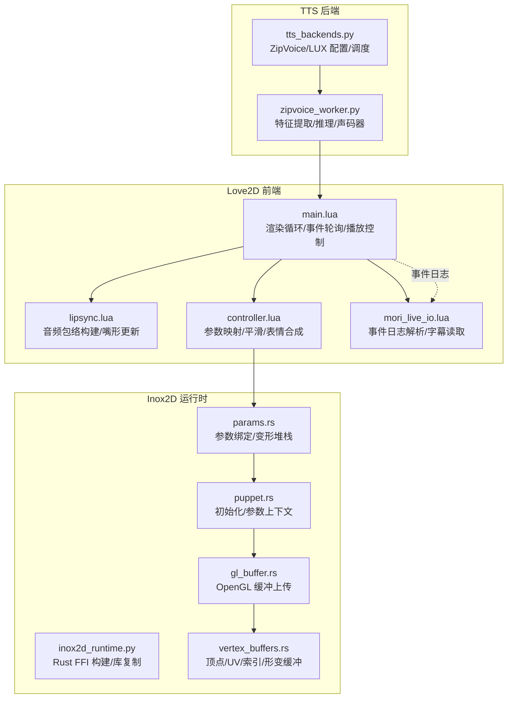
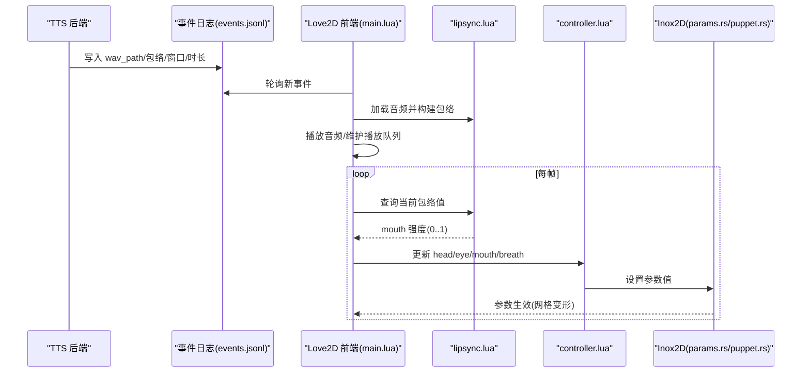
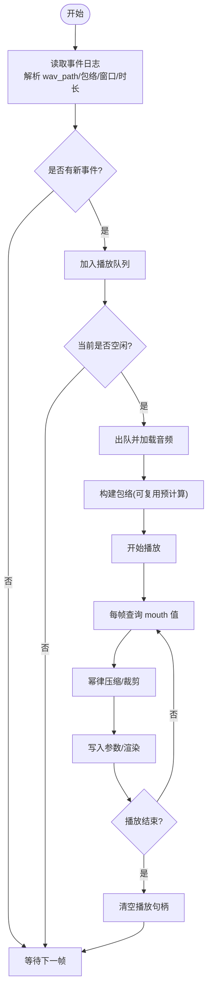
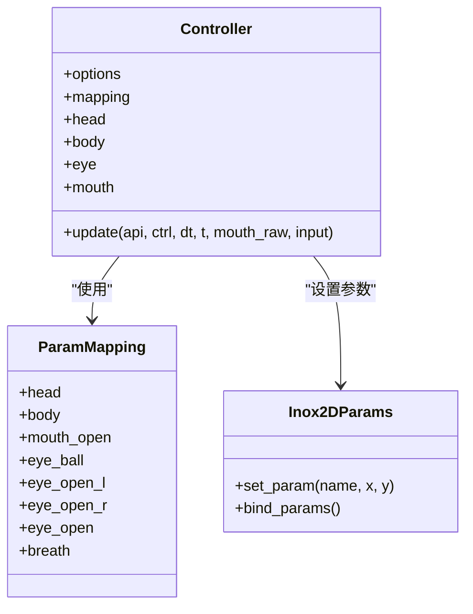
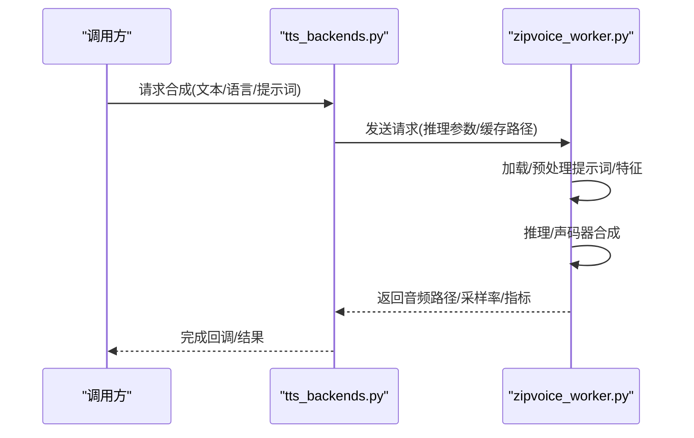
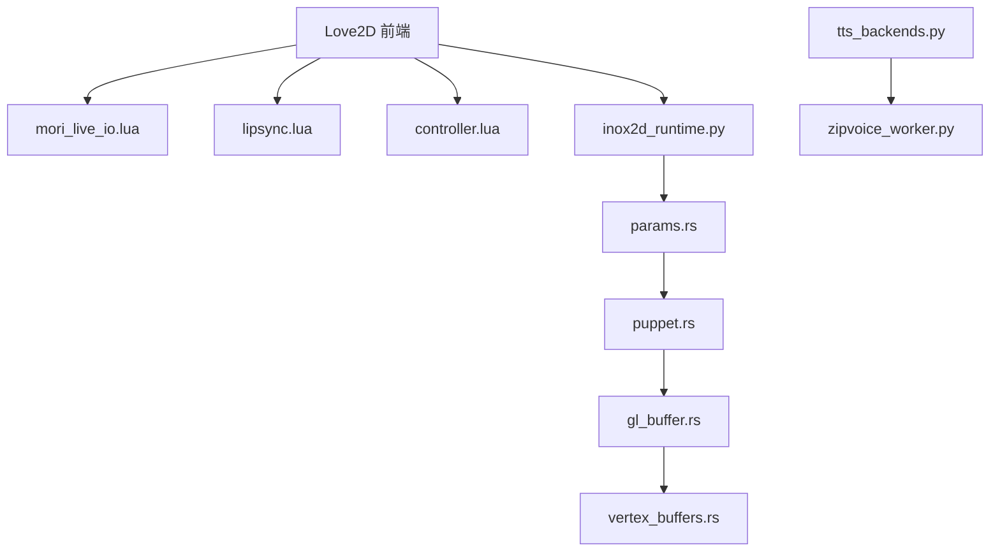

# 嘴形驱动系统

<cite>
**本文档引用的文件**
- [README.md](file://mori_live2d/README.md)
- [main.lua](file://mori_live2d/love2d_frontend/main.lua)
- [lipsync.lua](file://mori_live2d/love2d_frontend/lipsync.lua)
- [controller.lua](file://mori_live2d/love2d_frontend/controller.lua)
- [mori_live_io.lua](file://mori_live2d/love2d_frontend/mori_live_io.lua)
- [inox2d_runtime.py](file://mori_live2d/inox2d_runtime.py)
- [example_models.py](file://mori_live2d/example_models.py)
- [airi_puppet_control_compare.md](file://mori_live2d/notes/airi_puppet_control_compare.md)
- [params.rs](file://mori_live2d/third_party/inox2d/inox2d/src/params.rs)
- [interp.rs](file://mori_live2d/third_party/inox2d/inox2d/src/math/interp.rs)
- [puppet.rs](file://mori_live2d/third_party/inox2d/inox2d/src/puppet.rs)
- [gl_buffer.rs](file://mori_live2d/third_party/inox2d/inox2d-opengl/src/gl_buffer.rs)
- [vertex_buffers.rs](file://mori_live2d/third_party/inox2d/inox2d/src/render/vertex_buffers.rs)
- [tts_backends.py](file://mori_runtime/tts_backends.py)
- [zipvoice_worker.py](file://mori_runtime/zipvoice_worker.py)
</cite>

## 目录
1. [简介](#简介)
2. [项目结构](#项目结构)
3. [核心组件](#核心组件)
4. [架构总览](#架构总览)
5. [详细组件分析](#详细组件分析)
6. [依赖关系分析](#依赖关系分析)
7. [性能考虑](#性能考虑)
8. [故障排除指南](#故障排除指南)
9. [结论](#结论)
10. [附录](#附录)

## 简介
本文件面向“嘴形驱动系统”的技术文档，聚焦于从音频到嘴形的映射与驱动，涵盖以下方面：
- 音频到嘴形映射：频谱包络提取、窗口化 RMS 计算、幂律压缩等
- 实时音频处理：采样、缓冲、队列与播放、延迟控制
- 表情同步机制：参数映射、平滑过渡、关键帧与插值
- 不同 Live2D 模型适配：参数映射、权重与方向调整、个性化配置
- 配置与运维：音频输入源、性能调优、故障排除

## 项目结构
本系统围绕 Love2D 前端与 Inox2D 渲染管线，结合事件日志驱动音频播放与嘴形同步；TTS 后端负责音频生成。

图示来源
- [main.lua:156-403](file://mori_live2d/love2d_frontend/main.lua#L156-L403)
- [lipsync.lua:31-125](file://mori_live2d/love2d_frontend/lipsync.lua#L31-L125)
- [controller.lua:556-611](file://mori_live2d/love2d_frontend/controller.lua#L556-L611)
- [mori_live_io.lua:229-260](file://mori_live2d/love2d_frontend/mori_live_io.lua#L229-L260)
- [inox2d_runtime.py:32-62](file://mori_live2d/inox2d_runtime.py#L32-L62)
- [params.rs:287-326](file://mori_live2d/third_party/inox2d/inox2d/src/params.rs#L287-L326)
- [puppet.rs:58-96](file://mori_live2d/third_party/inox2d/inox2d/src/puppet.rs#L58-L96)
- [gl_buffer.rs:15-44](file://mori_live2d/third_party/inox2d/inox2d-opengl/src/gl_buffer.rs#L15-L44)
- [vertex_buffers.rs:49-64](file://mori_live2d/third_party/inox2d/inox2d/src/render/vertex_buffers.rs#L49-L64)
- [tts_backends.py:409-446](file://mori_runtime/tts_backends.py#L409-L446)
- [zipvoice_worker.py:66-112](file://mori_runtime/zipvoice_worker.py#L66-L112)

章节来源
- [README.md:1-157](file://mori_live2d/README.md#L1-L157)
- [main.lua:156-403](file://mori_live2d/love2d_frontend/main.lua#L156-L403)
- [lipsync.lua:31-125](file://mori_live2d/love2d_frontend/lipsync.lua#L31-L125)
- [controller.lua:556-611](file://mori_live2d/love2d_frontend/controller.lua#L556-L611)
- [mori_live_io.lua:229-260](file://mori_live2d/love2d_frontend/mori_live_io.lua#L229-L260)
- [inox2d_runtime.py:32-62](file://mori_live2d/inox2d_runtime.py#L32-L62)
- [params.rs:287-326](file://mori_live2d/third_party/inox2d/inox2d/src/params.rs#L287-L326)
- [puppet.rs:58-96](file://mori_live2d/third_party/inox2d/inox2d/src/puppet.rs#L58-L96)
- [gl_buffer.rs:15-44](file://mori_live2d/third_party/inox2d/inox2d-opengl/src/gl_buffer.rs#L15-L44)
- [vertex_buffers.rs:49-64](file://mori_live2d/third_party/inox2d/inox2d/src/render/vertex_buffers.rs#L49-L64)
- [tts_backends.py:409-446](file://mori_runtime/tts_backends.py#L409-L446)
- [zipvoice_worker.py:66-112](file://mori_runtime/zipvoice_worker.py#L66-L112)

## 核心组件
- 音频包络与嘴形驱动
  - 包络构建：按固定窗口大小对采样进行均方根（RMS）计算，归一化得到强度序列
  - 嘴形更新：根据播放时间定位包络索引，幂律压缩后写入 mouth 参数
- 参数映射与平滑
  - 参数映射：通过关键词模糊匹配与显式覆盖文件，将语义键（head/eye/mouth/breath）映射到具体参数名
  - 平滑过渡：指数平滑与分段缓动，确保参数变化自然
- 事件驱动与播放队列
  - 事件日志：从 JSONL 读取 wav 路径与预计算包络，入队播放
  - 播放控制：空闲时出队播放，播放结束自动清理
- Inox2D 参数绑定与渲染
  - 参数绑定：将参数值映射到节点变形或属性
  - 渲染缓冲：顶点/UV/索引与形变缓冲上传至 GPU

章节来源
- [lipsync.lua:31-125](file://mori_live2d/love2d_frontend/lipsync.lua#L31-L125)
- [controller.lua:556-611](file://mori_live2d/love2d_frontend/controller.lua#L556-L611)
- [mori_live_io.lua:229-260](file://mori_live2d/love2d_frontend/mori_live_io.lua#L229-L260)
- [params.rs:287-326](file://mori_live2d/third_party/inox2d/inox2d/src/params.rs#L287-L326)
- [gl_buffer.rs:15-44](file://mori_live2d/third_party/inox2d/inox2d-opengl/src/gl_buffer.rs#L15-L44)
- [vertex_buffers.rs:49-64](file://mori_live2d/third_party/inox2d/inox2d/src/render/vertex_buffers.rs#L49-L64)

## 架构总览
系统采用“事件驱动 + 参数写入”的架构：TTS 后端生成音频并写入事件日志；前端轮询事件，加载音频并驱动参数；Inox2D 将参数映射到网格变形与渲染。

图示来源
- [main.lua:293-399](file://mori_live2d/love2d_frontend/main.lua#L293-L399)
- [lipsync.lua:62-125](file://mori_live2d/love2d_frontend/lipsync.lua#L62-L125)
- [controller.lua:700-800](file://mori_live2d/love2d_frontend/controller.lua#L700-L800)
- [mori_live_io.lua:229-260](file://mori_live2d/love2d_frontend/mori_live_io.lua#L229-L260)
- [params.rs:287-326](file://mori_live2d/third_party/inox2d/inox2d/src/params.rs#L287-L326)

## 详细组件分析

### 音频到嘴形映射与实时处理
- 包络构建
  - 采样率与窗口：根据采样率与窗口秒数计算窗口样本数，逐窗求 RMS
  - 归一化：对整条音频包络做全局最大值归一
- 嘴形更新
  - 时间定位：根据播放时间除以窗口秒数定位包络索引
  - 幂律压缩：对包络值做幂次变换以增强感知
  - 边界裁剪：限制在 0..1 范围内
- 播放队列与延迟控制
  - 队列入列：从事件日志读取 wav_path、预计算包络、窗口与时长
  - 空闲出列：当前无播放时取出首个项开始播放
  - 播放完成检测：停止后清空播放句柄，避免重复播放

图示来源
- [main.lua:357-399](file://mori_live2d/love2d_frontend/main.lua#L357-L399)
- [mori_live_io.lua:229-260](file://mori_live2d/love2d_frontend/mori_live_io.lua#L229-L260)
- [lipsync.lua:31-125](file://mori_live2d/love2d_frontend/lipsync.lua#L31-L125)

章节来源
- [lipsync.lua:31-125](file://mori_live2d/love2d_frontend/lipsync.lua#L31-L125)
- [main.lua:357-399](file://mori_live2d/love2d_frontend/main.lua#L357-L399)
- [mori_live_io.lua:229-260](file://mori_live2d/love2d_frontend/mori_live_io.lua#L229-L260)

### 参数映射与表情同步机制
- 参数映射策略
  - 关键词匹配：按 head/eye/mouth/breath 等关键词查找参数
  - 显式覆盖：支持 .mori-map/.mori.lua 覆盖映射，支持参数反向（如 Blink）
  - 自动发现：优先选择 vec2 组合参数，否则回退到标量参数
- 表情同步
  - 平滑：指数平滑控制各自由度的响应时间常数
  - 关键帧与插值：参数值通过插值模式（最近/线性/阶梯/二次/三次）参与合成
  - 合成：眨眼与外部输入（如 eye_open）相乘，形成最终输出

图示来源
- [controller.lua:201-452](file://mori_live2d/love2d_frontend/controller.lua#L201-L452)
- [controller.lua:556-611](file://mori_live2d/love2d_frontend/controller.lua#L556-L611)
- [params.rs:287-326](file://mori_live2d/third_party/inox2d/inox2d/src/params.rs#L287-L326)

章节来源
- [controller.lua:201-452](file://mori_live2d/love2d_frontend/controller.lua#L201-L452)
- [controller.lua:556-611](file://mori_live2d/love2d_frontend/controller.lua#L556-L611)
- [airi_puppet_control_compare.md:31-55](file://mori_live2d/notes/airi_puppet_control_compare.md#L31-L55)

### Inox2D 参数绑定与渲染管线
- 参数绑定
  - 将参数值映射到节点的直接变形或属性，支持多种插值模式
  - 绑定矩阵与有效性检查，确保形状正确
- 渲染缓冲
  - 顶点/UV/索引缓冲与形变缓冲分离管理
  - OpenGL 动态上传形变数据，减少 CPU-GPU 数据拷贝

图示来源
- [puppet.rs:58-96](file://mori_live2d/third_party/inox2d/inox2d/src/puppet.rs#L58-L96)
- [params.rs:287-326](file://mori_live2d/third_party/inox2d/inox2d/src/params.rs#L287-L326)
- [vertex_buffers.rs:49-64](file://mori_live2d/third_party/inox2d/inox2d/src/render/vertex_buffers.rs#L49-L64)
- [gl_buffer.rs:15-44](file://mori_live2d/third_party/inox2d/inox2d-opengl/src/gl_buffer.rs#L15-L44)

章节来源
- [puppet.rs:58-96](file://mori_live2d/third_party/inox2d/inox2d/src/puppet.rs#L58-L96)
- [params.rs:287-326](file://mori_live2d/third_party/inox2d/inox2d/src/params.rs#L287-L326)
- [vertex_buffers.rs:49-64](file://mori_live2d/third_party/inox2d/inox2d/src/render/vertex_buffers.rs#L49-L64)
- [gl_buffer.rs:15-44](file://mori_live2d/third_party/inox2d/inox2d-opengl/src/gl_buffer.rs#L15-L44)

### TTS 后端与音频生成
- 配置与调度
  - 支持 ZipVoice/LUX 等后端，提供质量档位与推理参数
  - 提供提示词缓存与持久化，加速预热与推理
- 特征提取与声码器
  - 提取提示音频特征，拼接文本 tokens
  - 通过声码器生成波形并写入事件日志

图示来源
- [tts_backends.py:409-446](file://mori_runtime/tts_backends.py#L409-L446)
- [zipvoice_worker.py:66-112](file://mori_runtime/zipvoice_worker.py#L66-L112)
- [zipvoice_worker.py:681-722](file://mori_runtime/zipvoice_worker.py#L681-L722)

章节来源
- [tts_backends.py:409-446](file://mori_runtime/tts_backends.py#L409-L446)
- [zipvoice_worker.py:66-112](file://mori_runtime/zipvoice_worker.py#L66-L112)
- [zipvoice_worker.py:681-722](file://mori_runtime/zipvoice_worker.py#L681-L722)

## 依赖关系分析
- 前端依赖
  - Love2D API：窗口、渲染、音频、文件系统
  - Lua 模块：mori_live_io、lipsync、controller
- 运行时依赖
  - Rust FFI：Inox2D 库构建与复制
  - OpenGL：顶点/形变缓冲上传
- TTS 依赖
  - ZipVoice/LUX 模型与特征提取器
  - Python 生态：torch、tokenizer、特征提取

图示来源
- [main.lua:15-18](file://mori_live2d/love2d_frontend/main.lua#L15-L18)
- [inox2d_runtime.py:32-62](file://mori_live2d/inox2d_runtime.py#L32-L62)
- [params.rs:287-326](file://mori_live2d/third_party/inox2d/inox2d/src/params.rs#L287-L326)
- [puppet.rs:58-96](file://mori_live2d/third_party/inox2d/inox2d/src/puppet.rs#L58-L96)
- [gl_buffer.rs:15-44](file://mori_live2d/third_party/inox2d/inox2d-opengl/src/gl_buffer.rs#L15-L44)
- [vertex_buffers.rs:49-64](file://mori_live2d/third_party/inox2d/inox2d/src/render/vertex_buffers.rs#L49-L64)
- [tts_backends.py:409-446](file://mori_runtime/tts_backends.py#L409-L446)
- [zipvoice_worker.py:66-112](file://mori_runtime/zipvoice_worker.py#L66-L112)

章节来源
- [main.lua:15-18](file://mori_live2d/love2d_frontend/main.lua#L15-L18)
- [inox2d_runtime.py:32-62](file://mori_live2d/inox2d_runtime.py#L32-L62)
- [params.rs:287-326](file://mori_live2d/third_party/inox2d/inox2d/src/params.rs#L287-L326)
- [puppet.rs:58-96](file://mori_live2d/third_party/inox2d/inox2d/src/puppet.rs#L58-L96)
- [gl_buffer.rs:15-44](file://mori_live2d/third_party/inox2d/inox2d-opengl/src/gl_buffer.rs#L15-L44)
- [vertex_buffers.rs:49-64](file://mori_live2d/third_party/inox2d/inox2d/src/render/vertex_buffers.rs#L49-L64)
- [tts_backends.py:409-446](file://mori_runtime/tts_backends.py#L409-L446)
- [zipvoice_worker.py:66-112](file://mori_runtime/zipvoice_worker.py#L66-L112)

## 性能考虑
- 包络计算
  - 窗口大小影响实时性与平滑度：窗口越大越平滑但延迟越高
  - 预计算包络：若事件中提供预计算包络，可避免重复计算
- 播放与渲染
  - 指数平滑时间常数：平滑时间常数越小，响应越快但抖动越大
  - OpenGL 上传：批量/增量上传形变缓冲，减少状态切换
- TTS 推理
  - 质量档位与步数：实时模式降低 num_steps 与复杂度
  - 提示词缓存：持久化特征，避免重复特征提取
- I/O 与轮询
  - 事件日志轮询频率：降低轮询频率减少磁盘 I/O
  - 字符串编码清洗：UTF-8 清洗与 BOM 去除，避免解析错误

## 故障排除指南
- Inox2D 库构建失败
  - 现象：找不到共享库或构建工具缺失
  - 处理：安装 Rust 工具链，确认 cargo 可执行；检查目标目录与库名
- 参数映射无效
  - 现象：头/眼/嘴等参数未生效
  - 处理：检查 .mori-map 覆盖文件是否存在；确认参数名大小写与关键词匹配
- 嘴形不随语音变化
  - 现象：播放音频但 mouth 值不变
  - 处理：确认事件日志中 wav_path 存在且可读；检查包络索引与幂律压缩
- 渲染异常
  - 现象：模型部分不渲染或网格错乱
  - 处理：确认 Puppet 初始化顺序（transform → render → params）；检查绑定矩阵维度
- TTS 生成异常
  - 现象：合成失败或输出为空
  - 处理：检查提示词与文本 token 化；确认特征提取器与声码器配置

章节来源
- [inox2d_runtime.py:25-30](file://mori_live2d/inox2d_runtime.py#L25-L30)
- [README.md:10-14](file://mori_live2d/README.md#L10-L14)
- [mori_live_io.lua:229-260](file://mori_live2d/love2d_frontend/mori_live_io.lua#L229-L260)
- [puppet.rs:58-96](file://mori_live2d/third_party/inox2d/inox2d/src/puppet.rs#L58-L96)
- [zipvoice_worker.py:66-112](file://mori_runtime/zipvoice_worker.py#L66-L112)

## 结论
本系统通过“事件驱动 + 参数绑定”的方式实现了从 TTS 音频到嘴形的实时驱动，具备以下特点：
- 高内聚：音频包络与参数映射集中在前端模块
- 可扩展：参数映射与插值模式支持不同模型与风格
- 可运维：事件日志与 FFI 构建流程清晰，便于集成与排障

## 附录

### 不同 Live2D 模型适配指南
- 参数映射文件
  - 使用 .mori-map 或 .mori.lua 覆盖映射，支持参数反向（如 Blink）
  - 若未提供映射，系统将按关键词自动匹配
- 权重与方向调整
  - 通过 invert/invert_x/invert_y 控制方向一致性
  - 利用 smooth_* 与跟随系数调节响应速度与自然度
- 个性化配置
  - 通过环境变量与启动参数控制鼠标跟随、字体、UI 尺寸等

章节来源
- [README.md:67-96](file://mori_live2d/README.md#L67-L96)
- [controller.lua:556-611](file://mori_live2d/love2d_frontend/controller.lua#L556-L611)
- [airi_puppet_control_compare.md:31-55](file://mori_live2d/notes/airi_puppet_control_compare.md#L31-L55)

### 音频输入源与事件日志格式
- 事件字段
  - wav_path：音频文件路径
  - mouth_envelope：预计算包络数组
  - mouth_window_sec：包络窗口秒数
  - mouth_duration：音频时长（可选覆盖）
- 字幕与字幕字体
  - 支持 UTF-8 清洗与 BOM 去除
  - 可通过环境变量指定字体路径与字号

章节来源
- [mori_live_io.lua:229-260](file://mori_live2d/love2d_frontend/mori_live_io.lua#L229-L260)
- [main.lua:190-200](file://mori_live2d/love2d_frontend/main.lua#L190-L200)

### 示例模型与安装
- 示例模型
  - Aka、Midori 等示例模型可通过命令安装
- 安装流程
  - 下载 ZIP 并解压到指定目录
  - 确认模型文件存在并可被前端加载

章节来源
- [example_models.py:21-57](file://mori_live2d/example_models.py#L21-L57)
- [README.md:97-106](file://mori_live2d/README.md#L97-L106)