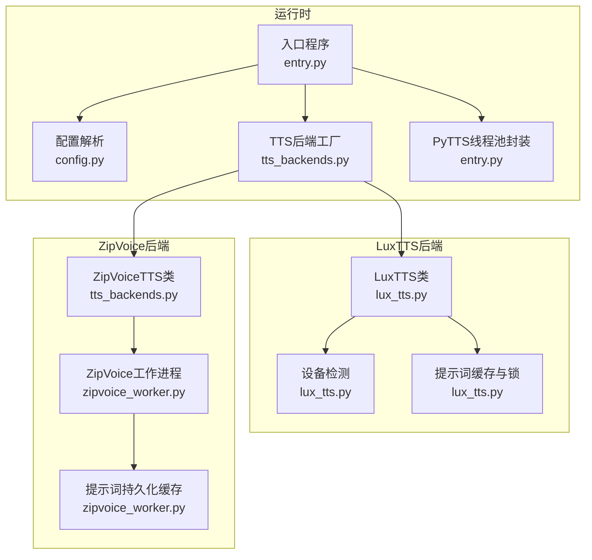
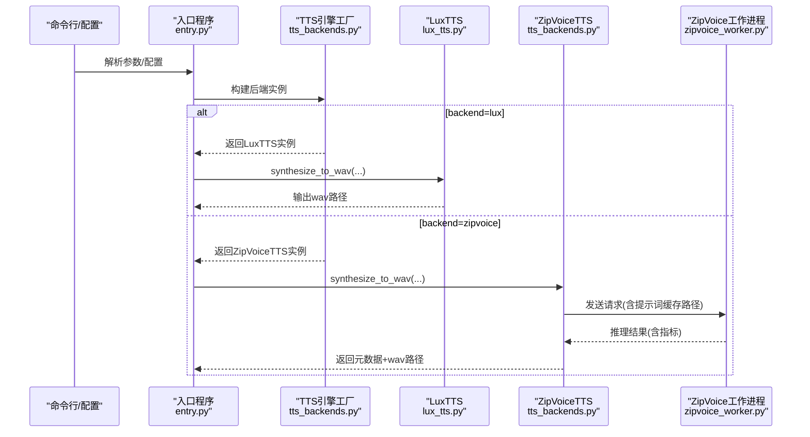
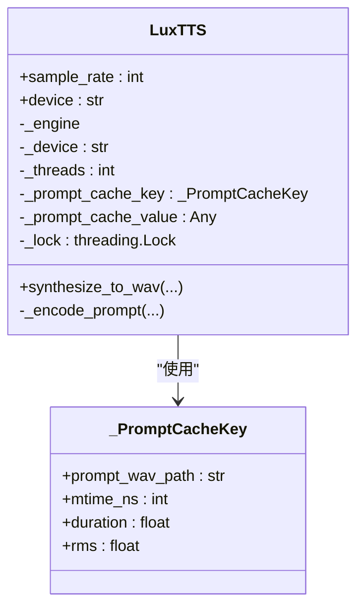
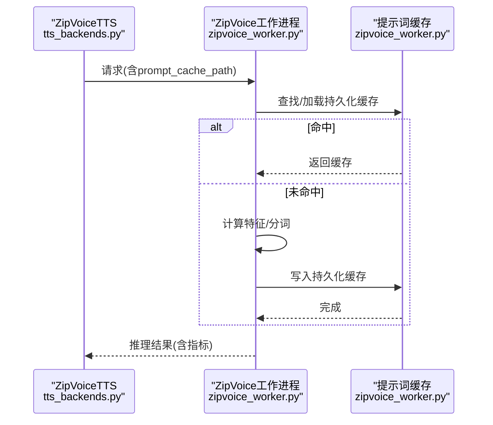
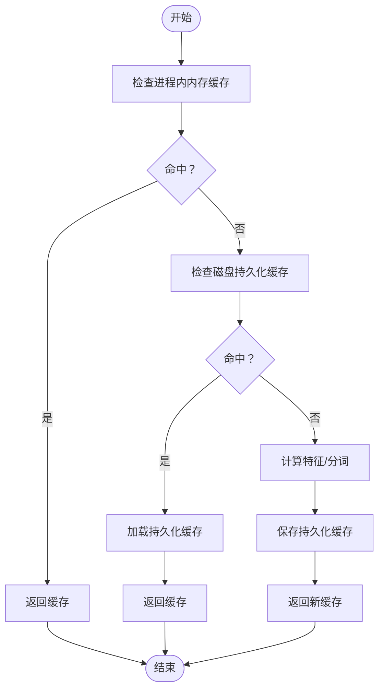
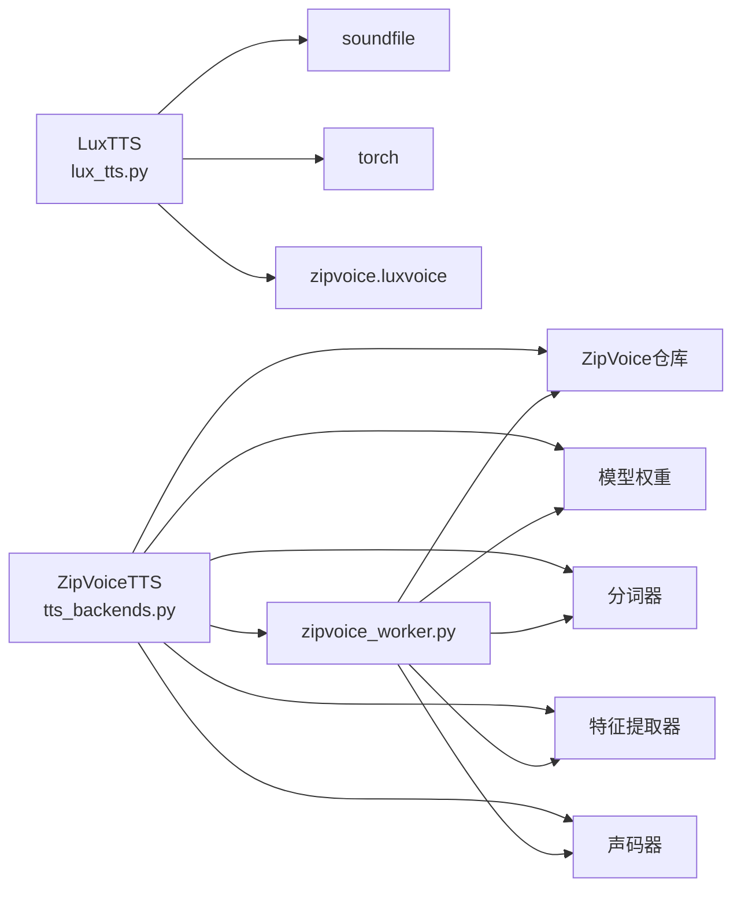

# LuxTTS后端

<cite>
**本文引用的文件列表**
- [lux_tts.py](file://mori_tts/lux_tts.py)
- [tts_backends.py](file://mori_runtime/tts_backends.py)
- [zipvoice_worker.py](file://mori_runtime/zipvoice_worker.py)
- [install_lux_tts.sh](file://mori_tts/scripts/install_lux_tts.sh)
- [config.py](file://mori_runtime/config.py)
- [entry.py](file://mori_runtime/entry.py)
- [zipvoice_zhja_dual_prompt_manifest.tsv](file://mori_runtime/prompts/zipvoice_zhja_dual_prompt_manifest.tsv)
</cite>

## 目录
1. [简介](#简介)
2. [项目结构](#项目结构)
3. [核心组件](#核心组件)
4. [架构总览](#架构总览)
5. [详细组件分析](#详细组件分析)
6. [依赖关系分析](#依赖关系分析)
7. [性能考量](#性能考量)
8. [故障排查指南](#故障排查指南)
9. [结论](#结论)
10. [附录](#附录)

## 简介
本文件面向LuxTTS后端的实现与使用，系统性梳理其技术架构、模型加载机制、设备自动检测（CPU/CUDA/MPS）、线程池与锁机制、提示词缓存系统设计与实现、语音合成流程（从文本预处理到音频输出）、关键参数配置（num_steps、guidance_scale、t_shift、speed等）对音质与速度的影响，并提供安装配置指南、性能优化建议与常见问题解决方案。文档同时给出代码级图示与路径引用，便于读者快速定位实现细节。

## 项目结构
本项目围绕“运行时入口”与“TTS后端”两条主线组织：
- 运行时入口负责解析配置、构建引擎、调度任务队列与TTS执行。
- TTS后端包含LuxTTS与ZipVoice两类实现，分别通过独立模块与进程化子系统完成推理与声码器合成。

图表来源
- [entry.py:832-1084](file://mori_runtime/entry.py#L832-L1084)
- [config.py:188-270](file://mori_runtime/config.py#L188-L270)
- [tts_backends.py:1102-1171](file://mori_runtime/tts_backends.py#L1102-L1171)
- [lux_tts.py:65-171](file://mori_tts/lux_tts.py#L65-L171)
- [zipvoice_worker.py:446-729](file://mori_runtime/zipvoice_worker.py#L446-L729)

章节来源
- [entry.py:832-1084](file://mori_runtime/entry.py#L832-L1084)
- [config.py:188-270](file://mori_runtime/config.py#L188-L270)
- [tts_backends.py:1102-1171](file://mori_runtime/tts_backends.py#L1102-L1171)
- [lux_tts.py:65-171](file://mori_tts/lux_tts.py#L65-L171)
- [zipvoice_worker.py:446-729](file://mori_runtime/zipvoice_worker.py#L446-L729)

## 核心组件
- LuxTTS后端：轻量封装，支持模型引用解析、设备自动检测、提示词缓存、线程安全的合成接口。
- ZipVoice后端：多语言路由、提示词池管理、持久化提示词缓存、子进程推理与声码器合成。
- 运行时入口：统一配置解析、后端选择、任务提交与结果回收。
- 提示词缓存：两套方案，LuxTTS在内存中按键缓存，ZipVoice在磁盘持久化并跨进程共享。

章节来源
- [lux_tts.py:65-171](file://mori_tts/lux_tts.py#L65-L171)
- [tts_backends.py:525-1100](file://mori_runtime/tts_backends.py#L525-L1100)
- [zipvoice_worker.py:16-232](file://mori_runtime/zipvoice_worker.py#L16-L232)
- [entry.py:203-412](file://mori_runtime/entry.py#L203-L412)

## 架构总览
下图展示从运行时入口到后端的具体调用链路与数据流。

图表来源
- [entry.py:865-962](file://mori_runtime/entry.py#L865-L962)
- [tts_backends.py:1102-1171](file://mori_runtime/tts_backends.py#L1102-L1171)
- [lux_tts.py:132-171](file://mori_tts/lux_tts.py#L132-L171)
- [zipvoice_worker.py:625-725](file://mori_runtime/zipvoice_worker.py#L625-L725)

## 详细组件分析

### LuxTTS后端
- 模型加载与设备检测
  - 支持模型引用解析（默认模型、本地目录、远程仓库），设备自动检测顺序：CUDA > MPS > CPU。
  - 使用静默导入避免控制台噪声。
- 线程与锁
  - 合成接口内部使用互斥锁保护提示词编码与生成过程，确保并发安全。
- 提示词缓存
  - 缓存键由提示音频路径、修改时间、持续时间、RMS组成；命中则复用编码结果，未命中则重新编码并写入缓存。
- 合成流程
  - 输入文本经提示词编码后，调用底层引擎生成语音张量，再写入wav文件返回。

图表来源
- [lux_tts.py:65-171](file://mori_tts/lux_tts.py#L65-L171)
- [lux_tts.py:24-30](file://mori_tts/lux_tts.py#L24-L30)

章节来源
- [lux_tts.py:42-56](file://mori_tts/lux_tts.py#L42-L56)
- [lux_tts.py:99-130](file://mori_tts/lux_tts.py#L99-L130)
- [lux_tts.py:132-171](file://mori_tts/lux_tts.py#L132-L171)

### ZipVoice后端
- 引擎初始化
  - 校验Python可执行、ZipVoice仓库、模型目录与关键文件存在性；启动子进程并等待就绪消息。
- 语言路由与提示词选择
  - 基于固定提示词或提示词清单，按策略（随机/轮询/按意图哈希）选择提示词条目，保证同一意图稳定使用相同提示词以避免音色跳跃。
- 提示词持久化缓存
  - 工作进程内维护内存缓存与磁盘持久化缓存，键包含提示文本、音频路径、分词器、采样率、目标RMS、特征缩放、设备等；持久化文件名基于输出wav所在目录与负载摘要生成，避免跨模型/配置污染。
- 推理与声码器
  - 将文本分块、批处理、解码为波形，进行交叉淡化拼接与静音裁剪，最终保存wav并返回RTF等指标。

图表来源
- [tts_backends.py:1010-1099](file://mori_runtime/tts_backends.py#L1010-L1099)
- [zipvoice_worker.py:174-232](file://mori_runtime/zipvoice_worker.py#L174-L232)
- [zipvoice_worker.py:303-443](file://mori_runtime/zipvoice_worker.py#L303-L443)

章节来源
- [tts_backends.py:525-760](file://mori_runtime/tts_backends.py#L525-L760)
- [tts_backends.py:807-865](file://mori_runtime/tts_backends.py#L807-L865)
- [tts_backends.py:916-960](file://mori_runtime/tts_backends.py#L916-L960)
- [tts_backends.py:1010-1099](file://mori_runtime/tts_backends.py#L1010-L1099)
- [zipvoice_worker.py:16-232](file://mori_runtime/zipvoice_worker.py#L16-L232)
- [zipvoice_worker.py:303-443](file://mori_runtime/zipvoice_worker.py#L303-L443)

### 提示词缓存系统设计与实现
- LuxTTS（内存缓存）
  - 键：提示音频绝对路径、修改时间、持续时间、RMS。
  - 命中：直接复用编码结果；未命中：调用底层编码器生成并写入缓存。
- ZipVoice（进程内内存+磁盘持久化）
  - 进程内内存缓存：键同上，命中即返回。
  - 磁盘持久化缓存：文件名基于输出wav目录与负载摘要生成，内容包含提示特征、分词等，支持跨进程复用。
  - 加载逻辑：若持久化文件存在且有效，则直接加载；否则计算后保存。

图表来源
- [zipvoice_worker.py:174-232](file://mori_runtime/zipvoice_worker.py#L174-L232)
- [zipvoice_worker.py:115-172](file://mori_runtime/zipvoice_worker.py#L115-L172)

章节来源
- [lux_tts.py:107-130](file://mori_tts/lux_tts.py#L107-L130)
- [zipvoice_worker.py:16-232](file://mori_runtime/zipvoice_worker.py#L16-L232)

### 语音合成流程（文本到音频）
- LuxTTS
  - 输入：文本、提示词wav、提示词持续时间与RMS、采样步数、引导强度、t_shift、速度、是否平滑输出。
  - 流程：提示词编码（缓存命中则复用）→生成语音张量→写入wav→返回路径。
- ZipVoice
  - 输入：文本、路由（zh/ja）、提示词条目、采样步数、引导强度、t_shift、速度、是否移除长静音、是否平滑输出。
  - 流程：语言检测/适配→提示词选择→提示词编码（内存/持久化缓存）→分块批处理→声码器解码→交叉淡化拼接→静音裁剪→保存wav→返回指标。

章节来源
- [lux_tts.py:132-171](file://mori_tts/lux_tts.py#L132-L171)
- [zipvoice_worker.py:303-443](file://mori_runtime/zipvoice_worker.py#L303-L443)
- [tts_backends.py:1010-1099](file://mori_runtime/tts_backends.py#L1010-L1099)

### 关键参数配置与影响
- num_steps（采样步数）
  - 影响推理质量与耗时：步数越多通常越清晰但更慢；ZipVoice默认随质量档位调整，LuxTTS默认较小步数用于实时性。
- guidance_scale（引导强度）
  - 控制文本与提示词一致性：值越大越贴合提示词，但可能过度约束导致自然度下降。
- t_shift（时间偏移）
  - 影响扩散过程的起始时间点，调节音色与节奏的稳定性。
- speed（播放速度）
  - 控制token长度与最大token数，从而影响合成时长与断句粒度。
- 其他
  - return_smooth：ZipVoice在支持的声码器配置下可输出更高采样率的平滑波形。
  - remove_long_sil：移除长静音提升听感，适合直播场景。

章节来源
- [lux_tts.py:14-18](file://mori_tts/lux_tts.py#L14-L18)
- [tts_backends.py:393-446](file://mori_runtime/tts_backends.py#L393-L446)
- [zipvoice_worker.py:684-725](file://mori_runtime/zipvoice_worker.py#L684-L725)

## 依赖关系分析
- LuxTTS
  - 依赖：soundfile、torch、zipvoice.luxvoice（底层LuxTTS实现）。
  - 设备检测依赖torch后端可用性。
- ZipVoice
  - 依赖：ZipVoice仓库、模型权重、分词器、特征提取器、声码器（可选高采样率版本）。
  - 子进程通信：通过标准输入/输出以JSON协议交互，支持预热、推理与关闭指令。

图表来源
- [lux_tts.py:74-82](file://mori_tts/lux_tts.py#L74-L82)
- [zipvoice_worker.py:477-548](file://mori_runtime/zipvoice_worker.py#L477-L548)
- [tts_backends.py:668-703](file://mori_runtime/tts_backends.py#L668-L703)

章节来源
- [lux_tts.py:74-82](file://mori_tts/lux_tts.py#L74-L82)
- [zipvoice_worker.py:477-548](file://mori_runtime/zipvoice_worker.py#L477-L548)
- [tts_backends.py:668-703](file://mori_runtime/tts_backends.py#L668-L703)

## 性能考量
- 设备选择
  - LuxTTS优先CUDA/MPS/CPU，ZipVoice工作进程同样自动选择GPU/MPS/CPU。
- 线程与并发
  - LuxTTS合成接口内部加锁，避免重复编码；ZipVoice通过子进程隔离推理，主进程使用线程池提交任务。
- 提示词缓存
  - LuxTTS内存缓存减少重复编码开销；ZipVoice持久化缓存跨进程复用，显著降低冷启动成本。
- 批量化与分块
  - ZipVoice将文本分块并批处理，结合交叉淡化拼接，平衡质量与时延。
- 参数权衡
  - 提升num_steps与guidance_scale可改善音质但增加耗时；合理设置speed与t_shift有助于稳定节奏与音色。

章节来源
- [lux_tts.py:42-56](file://mori_tts/lux_tts.py#L42-L56)
- [zipvoice_worker.py:366-443](file://mori_runtime/zipvoice_worker.py#L366-L443)
- [tts_backends.py:1046-1075](file://mori_runtime/tts_backends.py#L1046-L1075)

## 故障排查指南
- 依赖缺失
  - LuxTTS安装脚本会安装必要依赖；若仍报模块缺失，确认虚拟环境激活与脚本执行成功。
- 设备不可用
  - 若CUDA/MPS不可用，设备将回退至CPU；可通过显式指定device或检查驱动/框架版本。
- ZipVoice工作进程异常
  - 检查Python可执行、仓库路径、模型目录与关键文件是否存在；确认子进程已发送就绪消息。
- 提示词缓存问题
  - 确认持久化缓存文件存在且内容有效；必要时清理旧缓存文件以强制重建。
- 任务提交与取消
  - 主进程PyTTS线程池支持任务提交、完成回收与按意图取消，注意异常捕获与资源释放。

章节来源
- [install_lux_tts.sh:1-16](file://mori_tts/scripts/install_lux_tts.sh#L1-L16)
- [zipvoice_worker.py:637-640](file://mori_runtime/zipvoice_worker.py#L637-L640)
- [entry.py:203-412](file://mori_runtime/entry.py#L203-L412)

## 结论
本后端在运行时入口与后端实现之间建立了清晰的职责边界：入口负责配置与调度，后端负责具体推理与合成。LuxTTS提供轻量、线程安全的合成能力，ZipVoice提供多语言路由与更强的提示词管理与缓存能力。通过合理的参数配置与缓存策略，可在音质与时延间取得良好平衡。

## 附录

### 安装与配置指南
- LuxTTS安装
  - 使用提供的安装脚本在激活的虚拟环境中安装依赖与默认模型。
- ZipVoice配置
  - 指定Python可执行、ZipVoice仓库根目录、模型目录与检查点名称；可配置中日分词器、语言标签、提示词清单与选择策略。
- 运行时参数
  - 通过命令行或配置文件设置后端类型、模型、设备、线程数、提示词路径、合成参数等。

章节来源
- [install_lux_tts.sh:1-16](file://mori_tts/scripts/install_lux_tts.sh#L1-L16)
- [config.py:188-270](file://mori_runtime/config.py#L188-L270)
- [entry.py:582-794](file://mori_runtime/entry.py#L582-L794)

### 使用模式与示例（代码路径）
- LuxTTS合成
  - 路径：[lux_tts.py:132-171](file://mori_tts/lux_tts.py#L132-L171)
- ZipVoice合成
  - 路径：[tts_backends.py:1010-1099](file://mori_runtime/tts_backends.py#L1010-L1099)
- ZipVoice工作进程请求/响应
  - 路径：[zipvoice_worker.py:625-725](file://mori_runtime/zipvoice_worker.py#L625-L725)
- 提示词持久化缓存
  - 路径：[zipvoice_worker.py:115-172](file://mori_runtime/zipvoice_worker.py#L115-L172)
- 提示词内存缓存
  - 路径：[lux_tts.py:107-130](file://mori_tts/lux_tts.py#L107-L130)
- 提示词清单与路由
  - 路径：[tts_backends.py:174-246](file://mori_runtime/tts_backends.py#L174-L246)
  - 示例清单：[zipvoice_zhja_dual_prompt_manifest.tsv:1-4](file://mori_runtime/prompts/zipvoice_zhja_dual_prompt_manifest.tsv#L1-L4)