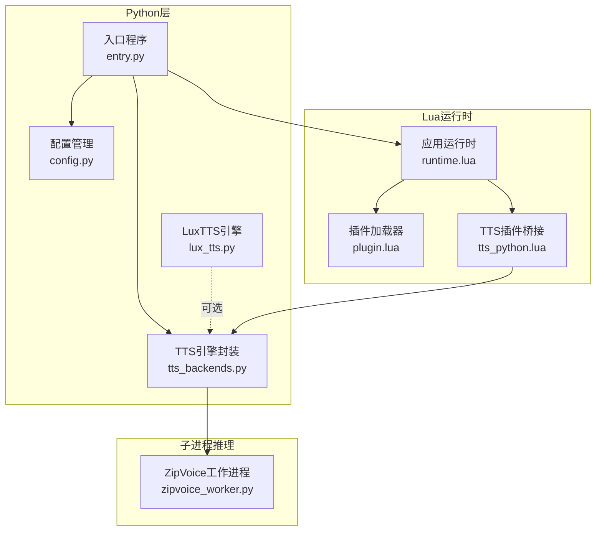
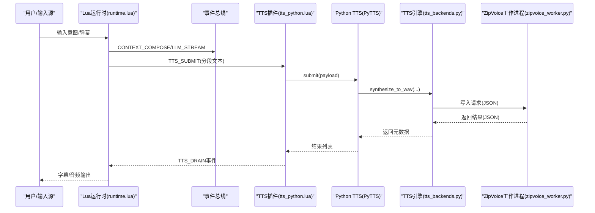
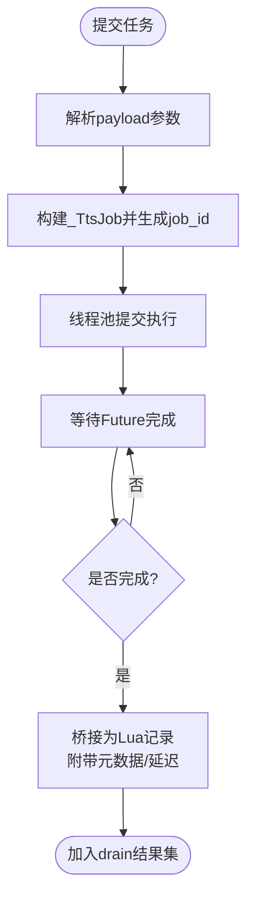
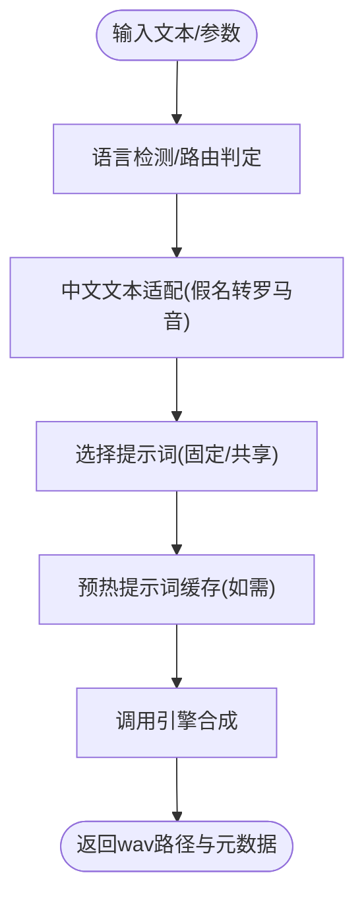
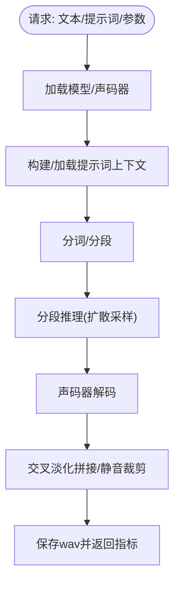
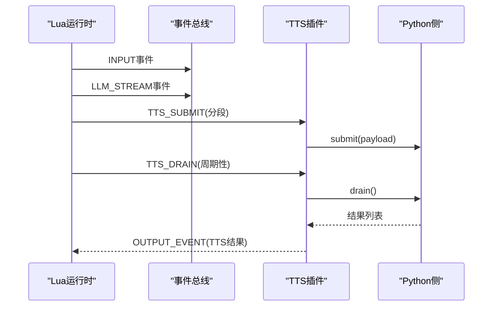
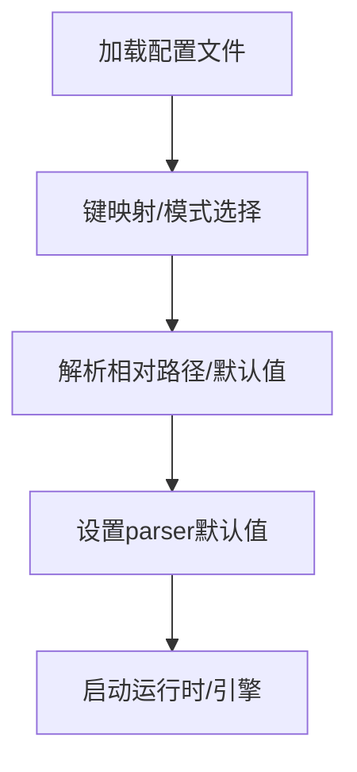
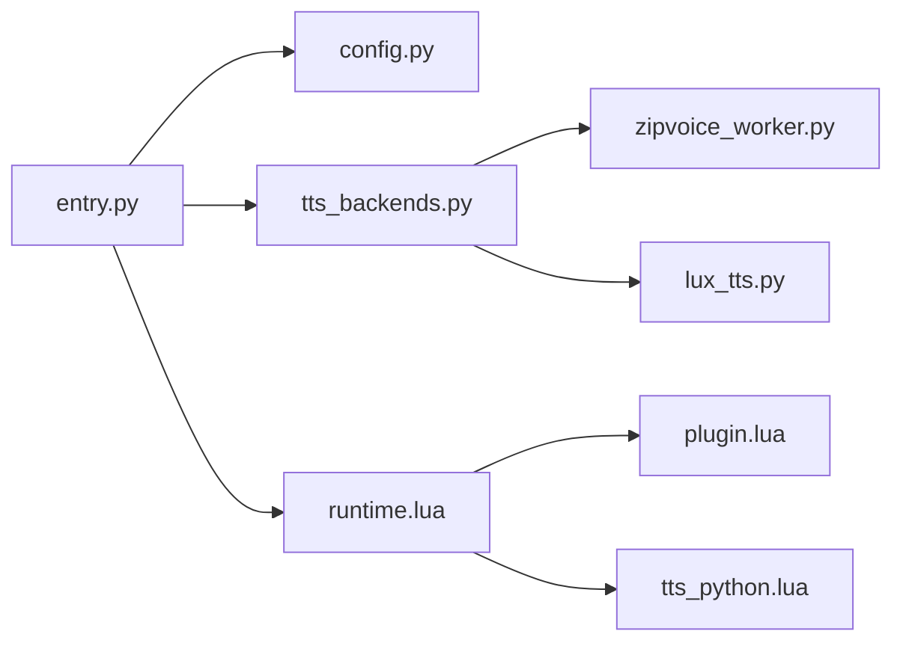

# TTS工作流管理

<cite>
**本文档引用的文件**
- [tts_backends.py](file://mori_runtime/tts_backends.py)
- [zipvoice_worker.py](file://mori_runtime/zipvoice_worker.py)
- [entry.py](file://mori_runtime/entry.py)
- [config.py](file://mori_runtime/config.py)
- [lux_tts.py](file://mori_tts/lux_tts.py)
- [runtime.lua](file://mori_runtime/lua/mori/app/runtime.lua)
- [plugin.lua](file://mori_runtime/lua/mori/core/plugin.lua)
- [tts_python.lua](file://mori_runtime/lua/mori/plugins/tts_python.lua)
</cite>

## 目录
1. [简介](#简介)
2. [项目结构](#项目结构)
3. [核心组件](#核心组件)
4. [架构总览](#架构总览)
5. [详细组件分析](#详细组件分析)
6. [依赖关系分析](#依赖关系分析)
7. [性能考虑](#性能考虑)
8. [故障排查指南](#故障排查指南)
9. [结论](#结论)

## 简介
本文件面向TTS工作流管理系统，系统性阐述任务调度机制（任务队列、优先级、并发控制）、后端选择逻辑（负载均衡、健康检查、故障转移）、结果聚合流程（多后端结果合并、质量评估、最终输出生成），以及与运行时系统的集成方式（插件接口、Lua回调、状态同步）。同时提供配置管理方案（动态参数、运行时更新、回滚机制），并给出性能监控指标、日志策略与故障诊断方法。

## 项目结构
系统采用“Python主进程 + Lua运行时 + 子进程推理引擎”的分层架构：
- Python入口负责参数解析、配置加载、任务提交与结果收集、与Lua运行时桥接
- Lua运行时负责事件总线、插件加载、意图调度、TTS任务分段与提交
- 子进程ZipVoice推理引擎负责实际语音合成，通过标准输入输出与Python通信
- 可选的LuxTTS后端作为传统TTS实现

**图表来源**
- [entry.py:832-1084](file://mori_runtime/entry.py#L832-L1084)
- [runtime.lua:543-668](file://mori_runtime/lua/mori/app/runtime.lua#L543-L668)
- [tts_backends.py:525-1171](file://mori_runtime/tts_backends.py#L525-L1171)
- [zipvoice_worker.py:446-729](file://mori_runtime/zipvoice_worker.py#L446-L729)
- [lux_tts.py:65-171](file://mori_tts/lux_tts.py#L65-L171)

**章节来源**
- [entry.py:832-1084](file://mori_runtime/entry.py#L832-L1084)
- [runtime.lua:543-668](file://mori_runtime/lua/mori/app/runtime.lua#L543-L668)

## 核心组件
- 任务调度与并发控制：Python侧PyTTS使用线程池执行任务，支持取消、批量收集结果
- 后端选择与路由：ZipVoice按语言检测与提示词策略进行路由，支持固定提示词与共享提示词池
- 推理引擎：ZipVoice工作进程负责模型加载、特征提取、声码器解码与分段拼接
- 运行时集成：Lua运行时通过事件总线驱动意图、分段、TTS提交与结果回传
- 配置管理：统一配置文件映射到命令行参数，支持相对路径解析与默认值注入

**章节来源**
- [entry.py:190-413](file://mori_runtime/entry.py#L190-L413)
- [tts_backends.py:525-1171](file://mori_runtime/tts_backends.py#L525-L1171)
- [zipvoice_worker.py:446-729](file://mori_runtime/zipvoice_worker.py#L446-L729)
- [runtime.lua:543-668](file://mori_runtime/lua/mori/app/runtime.lua#L543-L668)
- [config.py:188-270](file://mori_runtime/config.py#L188-L270)

## 架构总览
系统通过事件总线驱动完整工作流：Lua运行时从输入源（stdin、B站直播）收集意图，LLM生成文本，分段器切分为可合成片段，TTS插件桥接到Python侧，Python侧提交任务至ZipVoice/LuxTTS引擎，异步返回结果并通过事件总线回传给Lua运行时，最终输出字幕与音频文件。

**图表来源**
- [runtime.lua:355-485](file://mori_runtime/lua/mori/app/runtime.lua#L355-L485)
- [tts_python.lua:13-27](file://mori_runtime/lua/mori/plugins/tts_python.lua#L13-L27)
- [entry.py:245-413](file://mori_runtime/entry.py#L245-L413)
- [tts_backends.py:1010-1100](file://mori_runtime/tts_backends.py#L1010-L1100)
- [zipvoice_worker.py:625-725](file://mori_runtime/zipvoice_worker.py#L625-L725)

## 详细组件分析

### 任务调度与并发控制（PyTTS）
- 任务队列：PyTTS内部维护作业字典，键为job_id，值为(作业对象, Future)，支持并发执行与结果回收
- 提交流程：从payload解析参数，构造作业，提交到线程池执行；若引擎接口不支持某些参数则自动降级
- 结果收集：周期性drain，遍历未完成Future，收集结果并桥接为Lua可识别的记录，附带TTS元数据与延迟统计
- 取消策略：按intent_id取消未开始或未完成的任务，清理作业表

**图表来源**
- [entry.py:245-413](file://mori_runtime/entry.py#L245-L413)

**章节来源**
- [entry.py:190-413](file://mori_runtime/entry.py#L190-L413)

### 后端选择与路由（ZipVoice）
- 路由决策：优先使用lang_hint，其次根据语言检测器判断，最后回退到脚本规则；按路由选择tokenizer/lang
- 文本适配：中文路由遇到混合假名时先转罗马音，避免合成异常
- 提示词策略：支持固定提示词、共享提示词池（manifest），支持随机/轮询/基于intent的稳定哈希策略
- 预热缓存：启动时预热每个路由的提示词上下文，减少首次合成延迟
- 合成选项：按质量配置文件（实时/平衡/高质量）解析采样步数、引导强度等参数

**图表来源**
- [tts_backends.py:879-1100](file://mori_runtime/tts_backends.py#L879-L1100)

**章节来源**
- [tts_backends.py:525-1171](file://mori_runtime/tts_backends.py#L525-L1171)

### 推理引擎（ZipVoice工作进程）
- 模型与声码器：根据配置加载ZipVoice或ZipVoice Distill模型，按vocoder配置加载声码器
- 特征与提示词：构建/缓存提示词特征，支持持久化缓存以复用
- 分段合成：按标点分词、批量化token、分段推理、交叉淡化拼接、静音裁剪
- 性能指标：记录总时长、声码器耗时、RTF等指标，便于监控与优化

**图表来源**
- [zipvoice_worker.py:303-444](file://mori_runtime/zipvoice_worker.py#L303-L444)

**章节来源**
- [zipvoice_worker.py:446-729](file://mori_runtime/zipvoice_worker.py#L446-L729)

### 运行时集成（Lua事件总线）
- 插件加载：通过插件加载器加载内存、上下文、LLM、TTS、直播输出等插件
- 事件驱动：运行时监听INPUT事件，触发LLM流式生成；分段器将可见文本切分为可合成片段
- TTS桥接：TTS插件订阅TTS_SUBMIT/DRAIN/CANCEL_INTENT事件，转发到Python侧
- 输出汇总：收集TTS结果，生成字幕与事件日志，支持打印到终端

**图表来源**
- [runtime.lua:543-668](file://mori_runtime/lua/mori/app/runtime.lua#L543-L668)
- [tts_python.lua:8-28](file://mori_runtime/lua/mori/plugins/tts_python.lua#L8-L28)

**章节来源**
- [runtime.lua:543-668](file://mori_runtime/lua/mori/app/runtime.lua#L543-L668)
- [plugin.lua:13-48](file://mori_runtime/lua/mori/core/plugin.lua#L13-L48)
- [tts_python.lua:8-28](file://mori_runtime/lua/mori/plugins/tts_python.lua#L8-L28)

### 配置管理
- 统一配置：支持JSON配置文件，映射到CLI参数；支持相对路径解析与默认值注入
- 模式切换：支持cli/vtuber/love2d/inochi等模式，默认值按模式构建
- 参数覆盖：命令行参数可覆盖配置文件中的对应项

**图表来源**
- [config.py:188-270](file://mori_runtime/config.py#L188-L270)

**章节来源**
- [config.py:188-270](file://mori_runtime/config.py#L188-L270)

## 依赖关系分析
- Python入口依赖配置模块、TTS后端模块、LLM管道与运行时桥接
- Lua运行时依赖事件总线、插件框架与各功能插件
- ZipVoice工作进程依赖ZipVoice推理库、声码器与特征提取工具
- LuxTTS作为可选后端，提供独立的引擎实现

**图表来源**
- [entry.py:15-41](file://mori_runtime/entry.py#L15-L41)
- [runtime.lua:1-6](file://mori_runtime/lua/mori/app/runtime.lua#L1-L6)
- [tts_backends.py:13-15](file://mori_runtime/tts_backends.py#L13-L15)
- [zipvoice_worker.py:1-16](file://mori_runtime/zipvoice_worker.py#L1-L16)
- [lux_tts.py:65-97](file://mori_tts/lux_tts.py#L65-L97)

**章节来源**
- [entry.py:15-41](file://mori_runtime/entry.py#L15-L41)
- [runtime.lua:1-6](file://mori_runtime/lua/mori/app/runtime.lua#L1-L6)
- [tts_backends.py:13-15](file://mori_runtime/tts_backends.py#L13-L15)
- [zipvoice_worker.py:1-16](file://mori_runtime/zipvoice_worker.py#L1-L16)
- [lux_tts.py:65-97](file://mori_tts/lux_tts.py#L65-L97)

## 性能考虑
- 并发与吞吐：PyTTS使用线程池，建议根据CPU/GPU资源与任务特性调整max_workers；ZipVoice工作进程可通过num_thread控制推理线程
- 首次延迟：ZipVoice支持提示词预热，建议在启动阶段预热常用路由
- 分段策略：分段过小增加声码器开销，过大影响实时性；结合RTF与延迟目标调参
- 设备选择：LuxTTS支持自动设备选择，优先GPU；ZipVoice优先CUDA/MPS，否则CPU
- I/O与存储：提示词缓存持久化减少重复计算；输出目录提前创建避免阻塞

[本节为通用指导，无需具体文件引用]

## 故障排查指南
- 后端初始化失败：检查ZipVoice模型目录、检查点文件、提示词清单是否存在；确认语言检测与提示词策略配置正确
- 工作进程异常退出：查看工作进程标准错误输出，关注模型加载、声码器配置与依赖安装问题
- 任务超时/卡死：检查线程池大小、任务队列积压；确认Lua运行时的中断策略与优先级设置
- 结果缺失：确认事件总线回调是否正常触发，检查TTS_DRAIN收集逻辑与桥接记录字段
- 配置无效：核对配置文件路径、键映射与默认值注入流程

**章节来源**
- [tts_backends.py:668-754](file://mori_runtime/tts_backends.py#L668-L754)
- [zipvoice_worker.py:625-725](file://mori_runtime/zipvoice_worker.py#L625-L725)
- [runtime.lua:222-280](file://mori_runtime/lua/mori/app/runtime.lua#L222-L280)

## 结论
该TTS工作流管理系统通过清晰的分层设计与事件驱动架构，实现了从意图到语音输出的全链路自动化。Python侧负责任务编排与引擎交互，Lua侧负责业务流程与插件扩展，ZipVoice/LuxTTS提供高性能推理能力。系统具备完善的配置管理、并发控制与结果聚合能力，适合在直播等高并发场景中稳定运行。