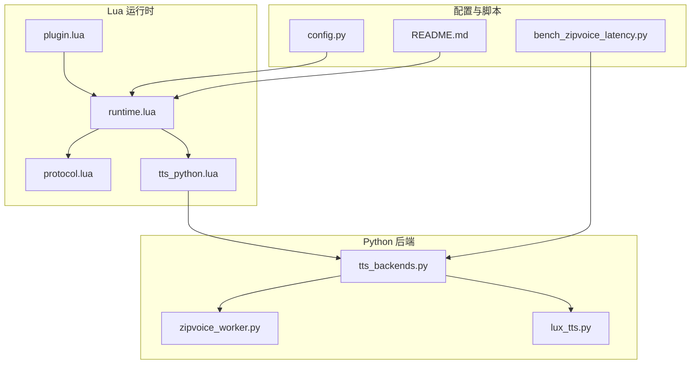
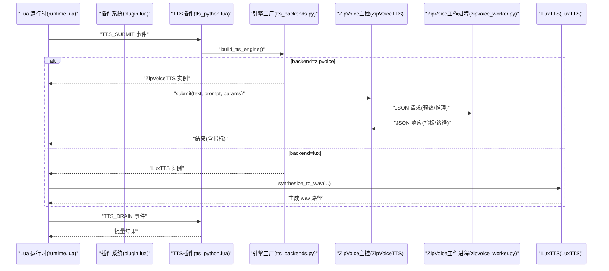
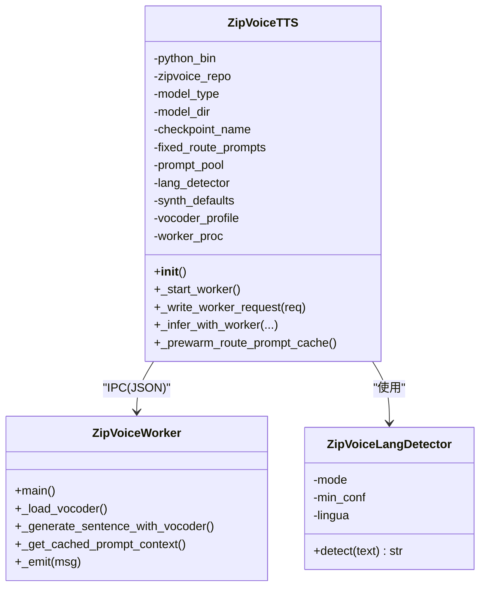
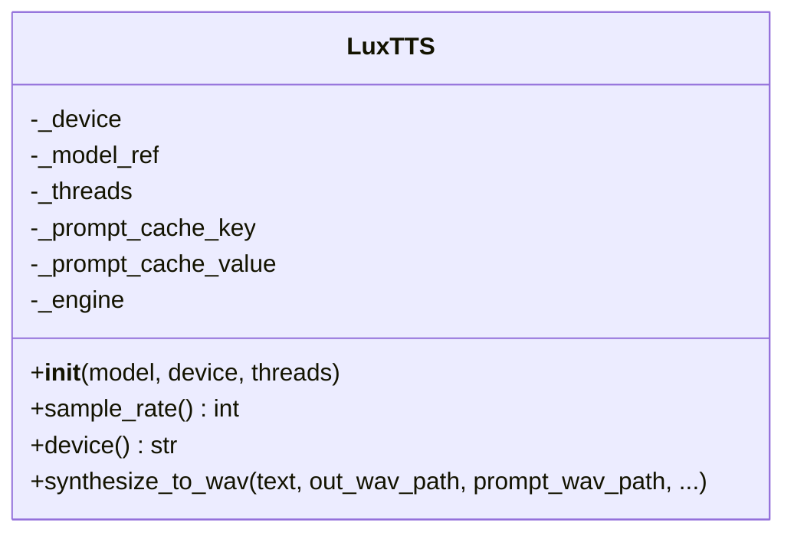
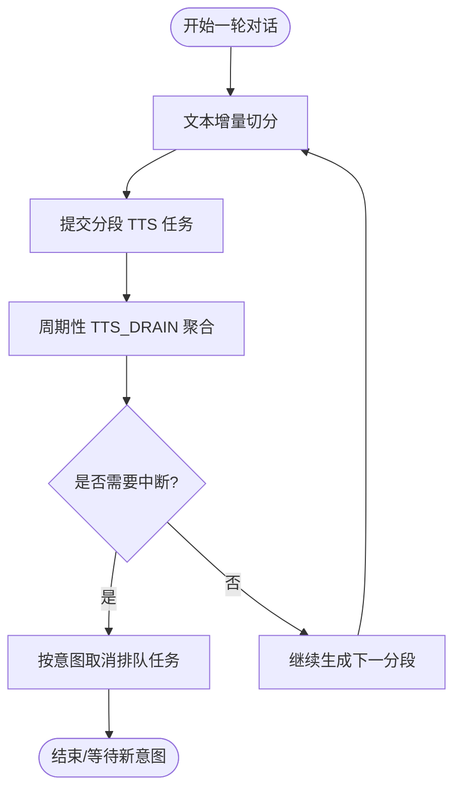
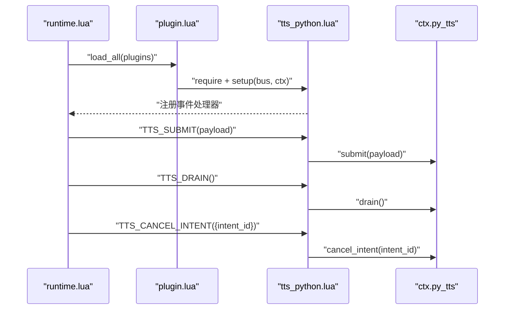
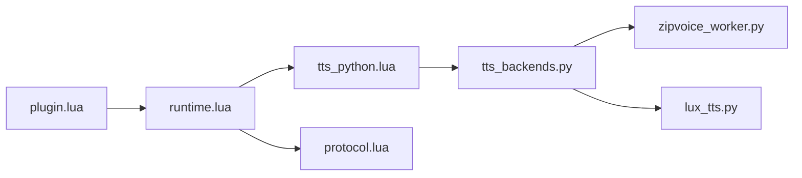

# TTS引擎架构

<cite>
**本文引用的文件**
- [tts_backends.py](file://mori_runtime/tts_backends.py)
- [zipvoice_worker.py](file://mori_runtime/zipvoice_worker.py)
- [lux_tts.py](file://mori_tts/lux_tts.py)
- [tts_python.lua](file://mori_runtime/lua/mori/plugins/tts_python.lua)
- [runtime.lua](file://mori_runtime/lua/mori/app/runtime.lua)
- [plugin.lua](file://mori_runtime/lua/mori/core/plugin.lua)
- [protocol.lua](file://mori_runtime/lua/mori/core/protocol.lua)
- [config.py](file://mori_runtime/config.py)
- [README.md](file://README.md)
- [bench_zipvoice_latency.py](file://scripts/bench_zipvoice_latency.py)
</cite>

## 目录
1. [简介](#简介)
2. [项目结构](#项目结构)
3. [核心组件](#核心组件)
4. [架构总览](#架构总览)
5. [详细组件分析](#详细组件分析)
6. [依赖分析](#依赖分析)
7. [性能考量](#性能考量)
8. [故障排除指南](#故障排除指南)
9. [结论](#结论)
10. [附录](#附录)

## 简介
本文件为 Mori TTS 引擎系统的全面架构文档，重点阐述双后端架构设计（LuxTTS 与 ZipVoice），并深入分析：
- LuxTTS 集成方案：模型加载、推理优化、参数配置与性能监控
- ZipVoice 集成机制：实时推理、语言检测与路由、提示词缓存与持久化
- TTS 工作流管理：任务调度、并发控制、结果聚合与中断策略
- TTS 插件系统：Lua 回调与运行时集成、事件总线协议
- 后端选择指南、配置优化建议与常见问题排查

## 项目结构
围绕 TTS 的核心代码主要分布在以下模块：
- Python 后端与桥接层：mori_runtime/tts_backends.py、mori_runtime/zipvoice_worker.py、mori_tts/lux_tts.py
- Lua 运行时与插件：mori_runtime/lua/mori/app/runtime.lua、mori_runtime/lua/mori/plugins/tts_python.lua、mori_runtime/lua/mori/core/*.lua
- 配置与入口：mori_runtime/config.py、scripts/bench_zipvoice_latency.py、README.md

图表来源
- [runtime.lua:543-665](file://mori_runtime/lua/mori/app/runtime.lua#L543-L665)
- [tts_python.lua:8-28](file://mori_runtime/lua/mori/plugins/tts_python.lua#L8-L28)
- [tts_backends.py:1102-1170](file://mori_runtime/tts_backends.py#L1102-L1170)
- [zipvoice_worker.py:446-729](file://mori_runtime/zipvoice_worker.py#L446-L729)
- [lux_tts.py:65-171](file://mori_tts/lux_tts.py#L65-L171)
- [config.py:188-270](file://mori_runtime/config.py#L188-L270)
- [bench_zipvoice_latency.py:186-236](file://scripts/bench_zipvoice_latency.py#L186-L236)
- [README.md:63-86](file://README.md#L63-L86)

章节来源
- [tts_backends.py:1102-1170](file://mori_runtime/tts_backends.py#L1102-L1170)
- [zipvoice_worker.py:446-729](file://mori_runtime/zipvoice_worker.py#L446-L729)
- [lux_tts.py:65-171](file://mori_tts/lux_tts.py#L65-L171)
- [runtime.lua:543-665](file://mori_runtime/lua/mori/app/runtime.lua#L543-L665)
- [tts_python.lua:8-28](file://mori_runtime/lua/mori/plugins/tts_python.lua#L8-L28)
- [plugin.lua:13-47](file://mori_runtime/lua/mori/core/plugin.lua#L13-L47)
- [protocol.lua:3-32](file://mori_runtime/lua/mori/core/protocol.lua#L3-L32)
- [config.py:188-270](file://mori_runtime/config.py#L188-L270)
- [bench_zipvoice_latency.py:186-236](file://scripts/bench_zipvoice_latency.py#L186-L236)
- [README.md:63-86](file://README.md#L63-L86)

## 核心组件
- 双后端引擎工厂：根据配置动态构建 LuxTTS 或 ZipVoice 实例
- ZipVoice 主控类：负责语言检测、提示词池与缓存、子进程推理协调
- ZipVoice 工作进程：加载模型、构建分词器、执行推理与声码器合成
- LuxTTS 引擎：封装提示词编码与推理，支持设备选择与线程数配置
- Lua 插件与运行时：通过事件总线桥接 Python TTS 引擎，实现任务提交、取消与结果回传
- 配置系统：统一解析与注入 TTS 参数，支持 CLI 与 JSON 配置

章节来源
- [tts_backends.py:1102-1170](file://mori_runtime/tts_backends.py#L1102-L1170)
- [zipvoice_worker.py:446-729](file://mori_runtime/zipvoice_worker.py#L446-L729)
- [lux_tts.py:65-171](file://mori_tts/lux_tts.py#L65-L171)
- [runtime.lua:375-485](file://mori_runtime/lua/mori/app/runtime.lua#L375-L485)
- [tts_python.lua:8-28](file://mori_runtime/lua/mori/plugins/tts_python.lua#L8-L28)
- [config.py:188-270](file://mori_runtime/config.py#L188-L270)

## 架构总览
双后端架构采用“运行时 Lua 事件总线 + Python 后端引擎”的解耦设计：
- Lua 运行时负责意图编排、文本切分、任务提交与结果聚合
- Python 后端负责具体推理与声码器合成，并通过子进程隔离 ZipVoice 工作流
- 配置系统贯穿 CLI 与 JSON，统一注入参数

图表来源
- [runtime.lua:375-485](file://mori_runtime/lua/mori/app/runtime.lua#L375-L485)
- [tts_python.lua:13-21](file://mori_runtime/lua/mori/plugins/tts_python.lua#L13-L21)
- [tts_backends.py:1102-1170](file://mori_runtime/tts_backends.py#L1102-L1170)
- [zipvoice_worker.py:625-725](file://mori_runtime/zipvoice_worker.py#L625-L725)
- [lux_tts.py:132-171](file://mori_tts/lux_tts.py#L132-L171)

## 详细组件分析

### ZipVoice 集成方案
- 语言检测与路由
  - 提供启发式与 Lingua 语言检测器，优先硬规则（日文假名）判定，其次基于置信度与稳定性阈值
  - 支持 zh/ja 两条路由，分别绑定不同分词器与语言标签
- 提示词池与缓存
  - 支持固定提示词与清单式提示词池，去重与规范化
  - 内存缓存 + 持久化缓存（.pt 保存），键包含提示音频、文本、分词器、采样率等
- 子进程推理
  - 启动独立 Python 工作进程，加载模型与声码器，通过标准输入输出进行 JSON 协议通信
  - 支持预热（prewarm）以复用提示特征，降低首帧延迟
- 推理参数与质量档位
  - 提供 realtime/balanced/hq 三档质量配置，映射到步数、guidance、t_shift、速度等
  - 支持返回平滑波形与长静音移除选项

图表来源
- [tts_backends.py:525-800](file://mori_runtime/tts_backends.py#L525-L800)
- [zipvoice_worker.py:446-729](file://mori_runtime/zipvoice_worker.py#L446-L729)
- [tts_backends.py:496-522](file://mori_runtime/tts_backends.py#L496-L522)

章节来源
- [tts_backends.py:496-522](file://mori_runtime/tts_backends.py#L496-L522)
- [tts_backends.py:525-800](file://mori_runtime/tts_backends.py#L525-L800)
- [zipvoice_worker.py:446-729](file://mori_runtime/zipvoice_worker.py#L446-L729)

### LuxTTS 集成方案
- 设备与线程
  - 自动探测 CUDA/MPS/CPU，支持线程数配置
  - 通过静默导入屏蔽第三方库输出噪声
- 提示词缓存
  - 基于提示音频 mtime、时长与 RMS 的组合键缓存编码结果，避免重复计算
- 推理流程
  - 编码提示 → 生成语音张量 → 写入 WAV 文件
  - 支持返回平滑波形与多参数调节

图表来源
- [lux_tts.py:65-171](file://mori_tts/lux_tts.py#L65-L171)

章节来源
- [lux_tts.py:65-171](file://mori_tts/lux_tts.py#L65-L171)

### TTS 工作流管理
- 任务提交与分段
  - 运行时按可见文本增量切分，逐段提交 TTS 任务，生成分段音频文件
  - 支持中断策略：当新意图优先级更高时，取消当前意图的 TTS 提交
- 结果聚合与输出
  - 定期调用 TTS_DRAIN 获取已完成结果，组装为输出事件，支持打印与日志记录
- 取消与清理
  - 通过 TTS_CANCEL_INTENT 按意图 ID 取消排队任务，避免资源浪费

图表来源
- [runtime.lua:375-485](file://mori_runtime/lua/mori/app/runtime.lua#L375-L485)

章节来源
- [runtime.lua:375-485](file://mori_runtime/lua/mori/app/runtime.lua#L375-L485)

### TTS 插件系统与运行时集成
- 插件加载
  - 插件需导出 { id, version, setup(bus, ctx) }，由 plugin.lua 加载并触发 setup
- 事件协议
  - 使用 protocol.lua 中定义的事件常量：TTS_SUBMIT、TTS_DRAIN、TTS_CANCEL_INTENT
- Lua 到 Python 的桥接
  - tts_python.lua 将 Lua 事件转发至 ctx.py_tts 对象，实现 submit/drain/cancel_intent

图表来源
- [plugin.lua:13-47](file://mori_runtime/lua/mori/core/plugin.lua#L13-L47)
- [tts_python.lua:8-28](file://mori_runtime/lua/mori/plugins/tts_python.lua#L8-L28)
- [protocol.lua:3-32](file://mori_runtime/lua/mori/core/protocol.lua#L3-L32)
- [runtime.lua:543-665](file://mori_runtime/lua/mori/app/runtime.lua#L543-L665)

章节来源
- [plugin.lua:13-47](file://mori_runtime/lua/mori/core/plugin.lua#L13-L47)
- [tts_python.lua:8-28](file://mori_runtime/lua/mori/plugins/tts_python.lua#L8-L28)
- [protocol.lua:3-32](file://mori_runtime/lua/mori/core/protocol.lua#L3-L32)
- [runtime.lua:543-665](file://mori_runtime/lua/mori/app/runtime.lua#L543-L665)

## 依赖分析
- ZipVoice 主控依赖 ZipVoice 工作进程，二者通过 JSON 协议通信
- ZipVoice 工作进程依赖 ZipVoice 仓库中的模型、分词器与声码器模块
- LuxTTS 依赖 zipvoice.luxvoice 包与第三方音频库
- Lua 插件依赖运行时事件总线与协议常量

图表来源
- [tts_backends.py:1102-1170](file://mori_runtime/tts_backends.py#L1102-L1170)
- [zipvoice_worker.py:446-729](file://mori_runtime/zipvoice_worker.py#L446-L729)
- [lux_tts.py:65-171](file://mori_tts/lux_tts.py#L65-L171)
- [tts_python.lua:8-28](file://mori_runtime/lua/mori/plugins/tts_python.lua#L8-L28)
- [runtime.lua:543-665](file://mori_runtime/lua/mori/app/runtime.lua#L543-L665)
- [plugin.lua:13-47](file://mori_runtime/lua/mori/core/plugin.lua#L13-L47)
- [protocol.lua:3-32](file://mori_runtime/lua/mori/core/protocol.lua#L3-L32)

章节来源
- [tts_backends.py:1102-1170](file://mori_runtime/tts_backends.py#L1102-L1170)
- [zipvoice_worker.py:446-729](file://mori_runtime/zipvoice_worker.py#L446-L729)
- [lux_tts.py:65-171](file://mori_tts/lux_tts.py#L65-L171)
- [tts_python.lua:8-28](file://mori_runtime/lua/mori/plugins/tts_python.lua#L8-L28)
- [runtime.lua:543-665](file://mori_runtime/lua/mori/app/runtime.lua#L543-L665)
- [plugin.lua:13-47](file://mori_runtime/lua/mori/core/plugin.lua#L13-L47)
- [protocol.lua:3-32](file://mori_runtime/lua/mori/core/protocol.lua#L3-L32)

## 性能考量
- ZipVoice
  - 质量档位：realtime/balanced/hq 对应不同的推理步数与引导强度，平衡延迟与音质
  - 语言检测：优先启发式规则，必要时启用 Lingua 提升稳定性
  - 提示词缓存：内存与持久化双重缓存，显著降低重复提示的特征提取开销
  - 声码器：可选 Lux 48k 声码器，提升输出采样率与音质，需额外依赖
- LuxTTS
  - 设备自适应：优先 GPU，其次 MPS，最后 CPU
  - 线程数：可通过参数调整推理线程，平衡吞吐与延迟
  - 提示词缓存：基于文件元信息的缓存键，避免重复编码
- 运行时
  - 分段提交：边生成边提交，降低首帧延迟
  - 中断策略：高优先级意图可抢占，减少无效工作

章节来源
- [zipvoice_worker.py:266-300](file://mori_runtime/zipvoice_worker.py#L266-L300)
- [tts_backends.py:393-446](file://mori_runtime/tts_backends.py#L393-L446)
- [tts_backends.py:496-522](file://mori_runtime/tts_backends.py#L496-L522)
- [lux_tts.py:65-171](file://mori_tts/lux_tts.py#L65-L171)
- [runtime.lua:375-485](file://mori_runtime/lua/mori/app/runtime.lua#L375-L485)
- [README.md:75-86](file://README.md#L75-L86)

## 故障排除指南
- ZipVoice 启动失败
  - 检查 ZipVoice Python 可执行路径、仓库路径与模型目录是否存在
  - 确认模型配置文件与检查点存在
  - 若使用 Lux 48k 声码器，确保已安装 LinaCodec 依赖
- 语言检测异常
  - 若 Lingua 不可用，模式将回落到启发式规则
  - 调整最小置信度阈值以提升稳定性
- 提示词缓存问题
  - 清理持久化缓存文件或更新提示音频，确保键一致
  - 检查分词器类型与语言参数匹配
- LuxTTS 依赖缺失
  - 按 README 提示安装 LuxTTS 依赖脚本
- 运行时未生成音频
  - 确认 TTS 插件已正确加载且 ctx.py_tts 可用
  - 检查 TTS_DRAIN 是否被周期性调用

章节来源
- [tts_backends.py:619-647](file://mori_runtime/tts_backends.py#L619-L647)
- [zipvoice_worker.py:276-285](file://mori_runtime/zipvoice_worker.py#L276-L285)
- [tts_backends.py:496-522](file://mori_runtime/tts_backends.py#L496-L522)
- [tts_backends.py:174-246](file://mori_runtime/tts_backends.py#L174-L246)
- [lux_tts.py:78-82](file://mori_tts/lux_tts.py#L78-L82)
- [runtime.lua:543-665](file://mori_runtime/lua/mori/app/runtime.lua#L543-L665)

## 结论
Mori 的 TTS 架构通过 Lua 事件总线与 Python 后端的清晰边界，实现了灵活的双后端选择与高效的任务编排。ZipVoice 在高质量与实时性之间提供了可调档位与完善的提示词缓存；LuxTTS 则以简洁的接口与设备自适应满足快速部署需求。配合运行时的分段提交与中断策略，系统在低延迟与资源利用率方面表现良好。

## 附录

### 后端选择指南
- 优先 ZipVoice（高质量/可调档位）
  - 需要较高音质与可控延迟时
  - 配置建议：质量档位 balanced 或 hq；如需 48k 输出，启用 vocoder_profile=lux_48k
- 优先 LuxTTS（快速部署/轻量）
  - 资源受限或快速验证场景
  - 配置建议：设备自动选择，适当增加线程数

章节来源
- [README.md:75-86](file://README.md#L75-L86)
- [tts_backends.py:393-446](file://mori_runtime/tts_backends.py#L393-L446)
- [zipvoice_worker.py:266-300](file://mori_runtime/zipvoice_worker.py#L266-L300)

### 配置优化建议
- ZipVoice
  - 使用固定提示词或清单式提示词池，结合持久化缓存
  - 合理设置 num_thread 与 vocoder_profile
  - 语言检测模式选择 auto/lingua 以提升稳定性
- LuxTTS
  - 设备自动选择，必要时强制 GPU/MPS/CPU
  - 线程数与 num_steps/guidance_scale/t_shift/speed 组合微调
- 运行时
  - 启用分段提交与中断策略，避免无效排队

章节来源
- [config.py:188-270](file://mori_runtime/config.py#L188-L270)
- [tts_backends.py:1102-1170](file://mori_runtime/tts_backends.py#L1102-L1170)
- [zipvoice_worker.py:523-525](file://mori_runtime/zipvoice_worker.py#L523-L525)
- [lux_tts.py:65-171](file://mori_tts/lux_tts.py#L65-L171)
- [runtime.lua:375-485](file://mori_runtime/lua/mori/app/runtime.lua#L375-L485)