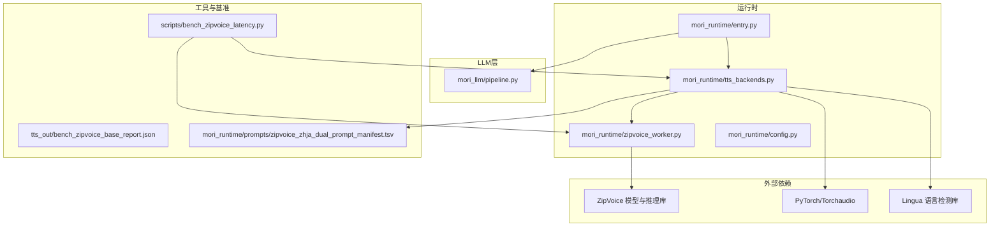
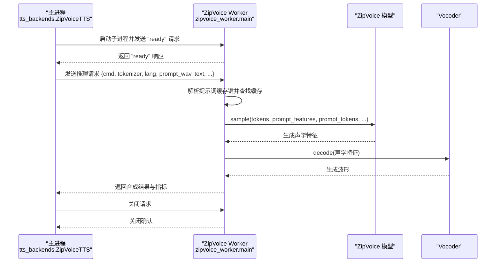
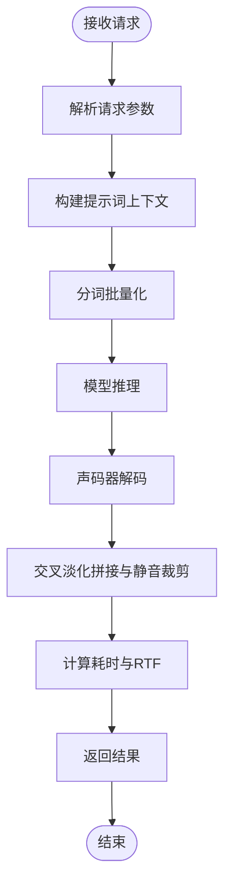
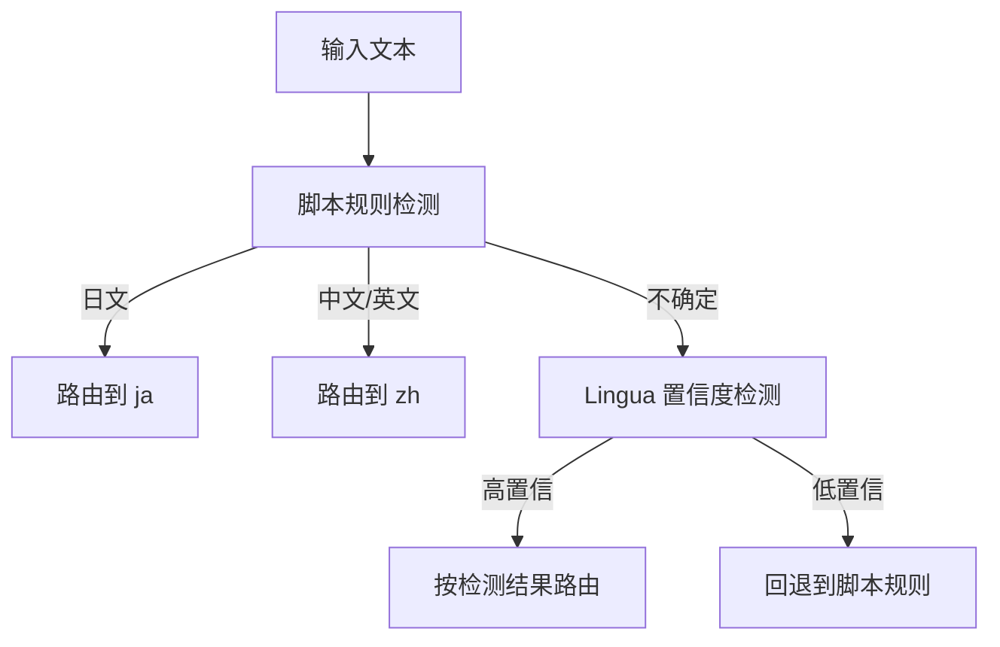
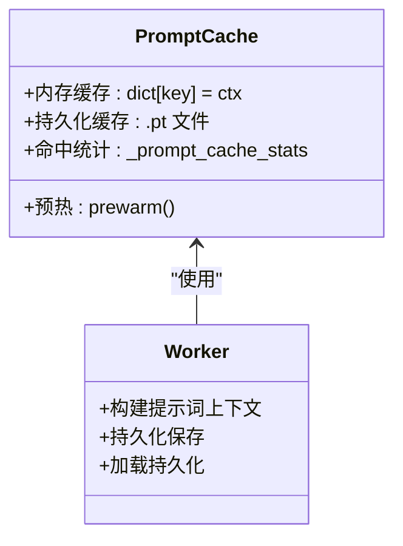
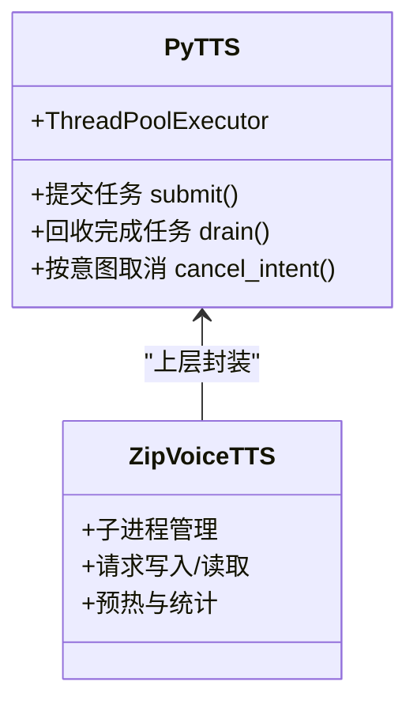
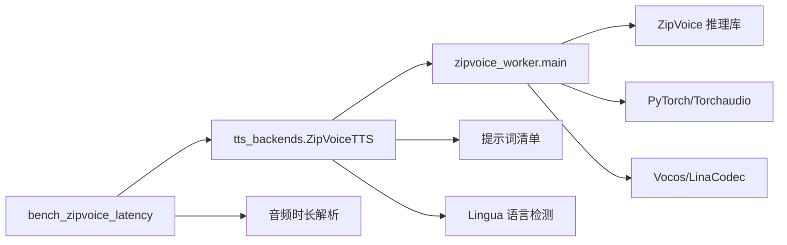

# ZipVoice后端

<cite>
**本文档引用的文件**
- [zipvoice_worker.py](file://mori_runtime/zipvoice_worker.py)
- [tts_backends.py](file://mori_runtime/tts_backends.py)
- [entry.py](file://mori_runtime/entry.py)
- [config.py](file://mori_runtime/config.py)
- [pipeline.py](file://mori_llm/pipeline.py)
- [bench_zipvoice_latency.py](file://scripts/bench_zipvoice_latency.py)
- [bench_zipvoice_base_report.json](file://tts_out/bench_zipvoice_base_report.json)
- [zipvoice_zhja_dual_prompt_manifest.tsv](file://mori_runtime/prompts/zipvoice_zhja_dual_prompt_manifest.tsv)
- [README.md](file://README.md)
</cite>

## 目录
1. [简介](#简介)
2. [项目结构](#项目结构)
3. [核心组件](#核心组件)
4. [架构总览](#架构总览)
5. [详细组件分析](#详细组件分析)
6. [依赖关系分析](#依赖关系分析)
7. [性能考量](#性能考量)
8. [故障排除指南](#故障排除指南)
9. [结论](#结论)
10. [附录](#附录)

## 简介
本文件为 ZipVoice 后端的全面架构文档，聚焦于实时推理架构、工作线程管理、任务队列处理、并发控制机制、语言路由系统、提示词缓存机制、ZipVoice Worker 工作原理、进程间通信、结果聚合与错误处理，并提供基于仓库内基准测试脚本与报告的性能分析，以及配置参数详解、部署指南与性能调优建议。

## 项目结构
ZipVoice 后端位于 mori_runtime 子模块中，核心文件包括：
- ZipVoice Worker 实现：负责模型推理、特征提取、声码器合成与持久化提示词缓存
- TTS 后端封装：提供 ZipVoice 与 LuxTTS 的统一接口，实现语言检测与路由、提示词池管理、质量配置与并发调度
- 入口与配置：提供 CLI/Vtuber 入口、配置解析与参数注入
- 基准测试：提供 ZipVoice 延迟测试脚本与报告

**图表来源**
- [entry.py:832-1084](file://mori_runtime/entry.py#L832-L1084)
- [tts_backends.py:525-1171](file://mori_runtime/tts_backends.py#L525-L1171)
- [zipvoice_worker.py:446-729](file://mori_runtime/zipvoice_worker.py#L446-L729)
- [bench_zipvoice_latency.py:367-440](file://scripts/bench_zipvoice_latency.py#L367-L440)

**章节来源**
- [entry.py:832-1084](file://mori_runtime/entry.py#L832-L1084)
- [tts_backends.py:525-1171](file://mori_runtime/tts_backends.py#L525-L1171)
- [zipvoice_worker.py:446-729](file://mori_runtime/zipvoice_worker.py#L446-L729)
- [bench_zipvoice_latency.py:367-440](file://scripts/bench_zipvoice_latency.py#L367-L440)

## 核心组件
- ZipVoice Worker：以子进程形式承载 ZipVoice 推理，提供预热、推理请求、结果返回与关闭流程
- ZipVoiceTTS 后端：封装 ZipVoice 语言检测与路由、提示词池选择、质量配置、并发执行与进程生命周期管理
- 语言路由系统：基于启发式与 Lingua 库的语言检测，结合脚本规则与质量配置进行路由决策
- 提示词缓存：内存与持久化两级缓存，键值由输入参数与模型配置派生，支持预热与命中统计
- 基准测试：提供延迟、RTF、稳态堆积等指标的自动化评测

**章节来源**
- [zipvoice_worker.py:446-729](file://mori_runtime/zipvoice_worker.py#L446-L729)
- [tts_backends.py:525-1171](file://mori_runtime/tts_backends.py#L525-L1171)
- [bench_zipvoice_latency.py:367-440](file://scripts/bench_zipvoice_latency.py#L367-L440)

## 架构总览
ZipVoice 后端采用“主进程 + 子进程 Worker”的架构。主进程负责语言检测、提示词选择、质量配置与并发调度；Worker 负责实际的模型推理与声码器合成。两者通过标准输入/输出进行 JSON 协议通信。

**图表来源**
- [tts_backends.py:668-754](file://mori_runtime/tts_backends.py#L668-L754)
- [zipvoice_worker.py:625-725](file://mori_runtime/zipvoice_worker.py#L625-L725)

## 详细组件分析

### ZipVoice Worker 工作原理
- 进程生命周期：主进程通过 subprocess 启动 Worker，等待 "ready" 消息后进入正常通信；异常时自动重启
- 请求协议：主进程发送 JSON 请求，包含 cmd、tokenizer、lang、prompt_wav、text、out_wav、采样步数、引导强度、速度、是否移除长静音等
- 推理流程：构建提示词上下文（音频去静音、RMS 归一化、特征提取、分词与 token 化）、批量化分词、模型推理、声码器解码、交叉淡化拼接、静音裁剪
- 结果聚合：返回总耗时、仅模型耗时、声码器耗时、音频秒数、RTF 等指标
- 错误处理：捕获异常并返回错误信息；子进程退出时主进程重新启动

**图表来源**
- [zipvoice_worker.py:303-443](file://mori_runtime/zipvoice_worker.py#L303-L443)

**章节来源**
- [zipvoice_worker.py:446-729](file://mori_runtime/zipvoice_worker.py#L446-L729)

### 语言路由系统
- 语言检测：优先使用启发式脚本规则（识别平假名/汉字/拉丁字母），可选 Lingua 库进行置信度检测；当置信度过低或不稳定时回退到脚本规则
- 路由策略：根据检测结果选择 zh 或 ja 路由，对应不同的分词器与语言标签
- 文本适配：针对中文路由，将混合日文假名转写为罗马音，避免分词爆炸
- 提示词池：支持固定提示词与共享提示词清单，按策略（随机、轮询、按意图哈希）选择

**图表来源**
- [tts_backends.py:496-523](file://mori_runtime/tts_backends.py#L496-L523)
- [tts_backends.py:879-900](file://mori_runtime/tts_backends.py#L879-L900)

**章节来源**
- [tts_backends.py:496-523](file://mori_runtime/tts_backends.py#L496-L523)
- [tts_backends.py:879-900](file://mori_runtime/tts_backends.py#L879-L900)

### 提示词缓存机制
- 缓存键：由提示音频绝对路径、提示文本、分词器对象 id、采样率、目标 RMS、特征缩放、设备等构成
- 内存缓存：进程内字典缓存，命中则直接复用
- 持久化缓存：将特征、分词等序列化保存至磁盘，下次启动可直接加载
- 预热：启动时对 zh/ja 固定提示或候选提示进行预热，记录特征维度与大小
- 命中率优化：通过稳定的提示选择策略（如按意图哈希）减少 timbre 跳跃，提升复用率

**图表来源**
- [zipvoice_worker.py:45-232](file://mori_runtime/zipvoice_worker.py#L45-L232)
- [tts_backends.py:807-841](file://mori_runtime/tts_backends.py#L807-L841)
- [tts_backends.py:982-1008](file://mori_runtime/tts_backends.py#L982-L1008)

**章节来源**
- [zipvoice_worker.py:45-232](file://mori_runtime/zipvoice_worker.py#L45-L232)
- [tts_backends.py:807-841](file://mori_runtime/tts_backends.py#L807-L841)
- [tts_backends.py:982-1008](file://mori_runtime/tts_backends.py#L982-L1008)

### 并发控制与任务队列
- 主进程并发：PyTTS 使用 ThreadPoolExecutor 管理合成任务，支持取消与批量回收
- Worker 并发：通过 num_thread 控制模型推理线程数；默认单线程以降低资源竞争
- 任务队列：主进程内部维护作业字典，完成即回收；支持按意图取消
- 交互模式：CLI/Vtuber 场景下，消息通过 stdin 线程读入 Inbox 队列，按优先级调度

**图表来源**
- [entry.py:203-412](file://mori_runtime/entry.py#L203-L412)
- [tts_backends.py:525-754](file://mori_runtime/tts_backends.py#L525-L754)

**章节来源**
- [entry.py:203-412](file://mori_runtime/entry.py#L203-L412)
- [tts_backends.py:525-754](file://mori_runtime/tts_backends.py#L525-L754)

### 进程间通信与结果聚合
- 协议：JSON 行协议，主进程写入请求行，Worker 逐行读取并返回响应
- 请求字段：cmd、tokenizer、lang、prompt_wav、prompt_text、prompt_cache_path、text、out_wav、num_step、guidance_scale、t_shift、speed、return_smooth、target_rms、feat_scale、max_duration、remove_long_sil
- 响应字段：ok、error、out_wav、sample_rate、vocoder_profile、t、t_no_vocoder、t_vocoder、wav_seconds、rtf、rtf_no_vocoder、rtf_vocoder
- 关闭：主进程发送 shutdown 请求，等待 Worker 退出

**章节来源**
- [zipvoice_worker.py:625-725](file://mori_runtime/zipvoice_worker.py#L625-L725)
- [tts_backends.py:704-754](file://mori_runtime/tts_backends.py#L704-L754)

## 依赖关系分析
- ZipVoice Worker 依赖 ZipVoice 推理库、PyTorch、Torchaudio、Vocos/LinaCodec（可选）
- ZipVoiceTTS 依赖 ZipVoice Worker、提示词清单、语言检测库（Lingua）
- 基准测试依赖 ZipVoiceTTS 引擎与音频时长解析库（soundfile/torchaudio/wave）

**图表来源**
- [tts_backends.py:525-1171](file://mori_runtime/tts_backends.py#L525-L1171)
- [zipvoice_worker.py:446-729](file://mori_runtime/zipvoice_worker.py#L446-L729)
- [bench_zipvoice_latency.py:16-440](file://scripts/bench_zipvoice_latency.py#L16-L440)

**章节来源**
- [tts_backends.py:525-1171](file://mori_runtime/tts_backends.py#L525-L1171)
- [zipvoice_worker.py:446-729](file://mori_runtime/zipvoice_worker.py#L446-L729)
- [bench_zipvoice_latency.py:16-440](file://scripts/bench_zipvoice_latency.py#L16-L440)

## 性能考量
- 延迟测试：脚本提供多种场景（中文确认、中文回答、日文回答、混合切换、长文本分段）与分词切段逻辑，输出首段音频就绪时间、总合成时间、总音频时长、稳态堆积与整体 RTF
- 报告解读：基准报告包含引擎初始化时间、参数配置、提示词缓存统计、各场景汇总与总体 RTF，可用于对比不同配置下的延迟与吞吐
- 资源消耗：可通过 zipvoice_num_thread 调整 Worker 线程数；vocoder_profile 切换到 lux_48k 时需安装 LinaCodec 依赖

**章节来源**
- [bench_zipvoice_latency.py:367-440](file://scripts/bench_zipvoice_latency.py#L367-L440)
- [bench_zipvoice_base_report.json:1-303](file://tts_out/bench_zipvoice_base_report.json#L1-L303)

## 故障排除指南
- Worker 启动失败：检查 ZipVoice 仓库路径、模型目录与配置文件是否存在；确认 Python 虚拟环境与依赖安装
- 语言检测异常：确保 Lingua 库可用或切换到 heuristic 模式；调整最小置信度阈值
- 提示词缓存问题：确认提示词清单路径正确、音频文件存在；检查持久化缓存文件权限
- 声码器问题：lux_48k 需要 LinaCodec 依赖；若缺失会抛出模块导入错误
- 延迟过高：尝试减少 num_steps、提高 speed、启用提示词预热、使用更合适的 vocoder profile

**章节来源**
- [zipvoice_worker.py:266-300](file://mori_runtime/zipvoice_worker.py#L266-L300)
- [tts_backends.py:496-523](file://mori_runtime/tts_backends.py#L496-L523)
- [README.md:75-81](file://README.md#L75-L81)

## 结论
ZipVoice 后端通过清晰的进程分离、稳健的语言路由与提示词缓存机制，在保证低延迟的同时提供了良好的可扩展性与可维护性。结合基准测试与配置调优，可在不同硬件条件下获得稳定的实时合成体验。

## 附录

### 配置参数详解
- ZipVoice 后端参数（tts_backends）
  - zipvoice_python_bin：ZipVoice Worker 使用的 Python 可执行文件
  - zipvoice_repo：ZipVoice 推理库仓库根目录
  - zipvoice_model_type：模型类型（zipvoice 或 zipvoice_distill）
  - zipvoice_model_dir：模型目录，包含 checkpoint 与 tokens.txt
  - zipvoice_checkpoint_name：模型权重文件名
  - zipvoice_zh_tokenizer / zipvoice_ja_tokenizer：中文/日文分词器名称
  - zipvoice_zh_lang / zipvoice_ja_lang：传递给推理的 lang 参数
  - zipvoice_zh_prompt_text / zipvoice_ja_prompt_text：固定中文/日文提示文本
  - zipvoice_zh_prompt_wav / zipvoice_ja_prompt_wav：固定中文/日文提示音频
  - zipvoice_remove_long_sil：是否移除长静音
  - zipvoice_num_thread：ZipVoice 推理线程数
  - zipvoice_lang_detector：语言检测模式（auto/heuristic/lingua）
  - zipvoice_lang_min_conf：Lingua 最小置信度
  - zipvoice_prompt_manifest：提示词清单路径（支持多文件逗号分隔）
  - zipvoice_prompt_policy：提示词选择策略（intent_hash/round_robin/random）
  - zipvoice_quality_profile：质量配置（realtime/balanced/hq）
  - zipvoice_num_steps / zipvoice_guidance_scale / zipvoice_t_shift / zipvoice_speed / zipvoice_return_smooth：推理参数覆盖
  - zipvoice_vocoder_profile：声码器配置（base_24k/lux_48k）
  - zipvoice_vocoder_model：声码器模型引用或本地路径

- CLI/Vtuber 参数映射
  - 通过 config.json 将 common/tts/cli/vtuber 等分组映射到上述参数
  - 支持相对路径解析与默认值注入

**章节来源**
- [tts_backends.py:19-83](file://mori_runtime/tts_backends.py#L19-L83)
- [config.py:23-270](file://mori_runtime/config.py#L23-L270)
- [entry.py:582-793](file://mori_runtime/entry.py#L582-L793)

### 部署指南
- 安装依赖：创建并激活 venv，安装项目依赖
- 准备模型：将 ZipVoice 模型放入 model/ 目录
- 配置文件：编写 mori.config.json，设置 tts 后端与 ZipVoice 参数
- 启动服务：使用 main.py 或 vtuber.py 启动，或运行基准脚本进行测试

**章节来源**
- [README.md:17-81](file://README.md#L17-L81)
- [entry.py:800-830](file://mori_runtime/entry.py#L800-L830)

### 性能调优建议
- 合理设置 zipvoice_num_thread：根据 CPU 核心数与 GPU 加速情况平衡
- 选择合适 vocoder profile：lux_48k 提升音质但需要额外依赖
- 使用提示词预热：启动时预热 zh/ja 提示，减少首次合成延迟
- 调整质量配置：realtime 适合低延迟，balanced 在延迟与质量间折中，hq 适合高质量但延迟较高
- 分段合成：对长文本进行分段，降低稳态堆积与 RTF 波动

**章节来源**
- [tts_backends.py:393-446](file://mori_runtime/tts_backends.py#L393-L446)
- [bench_zipvoice_latency.py:367-440](file://scripts/bench_zipvoice_latency.py#L367-L440)