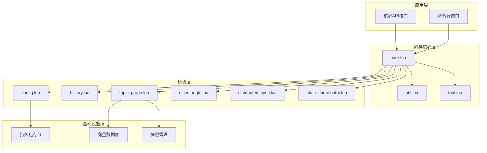
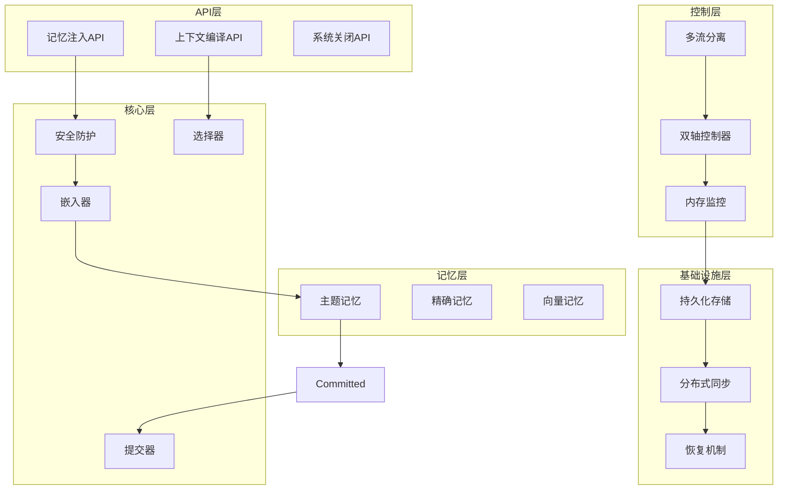
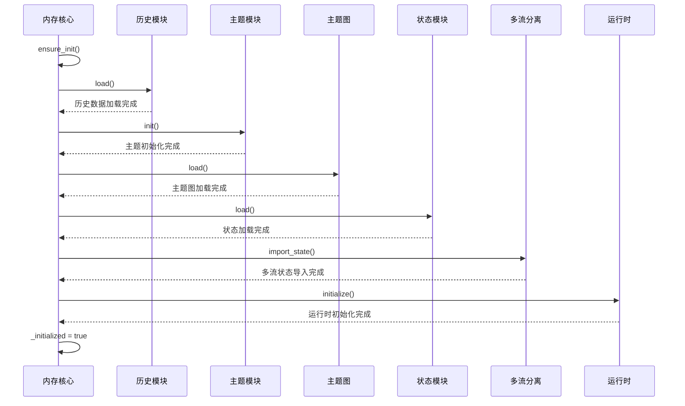
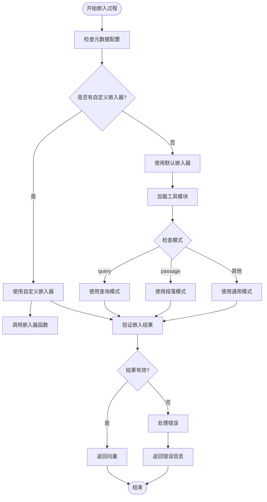
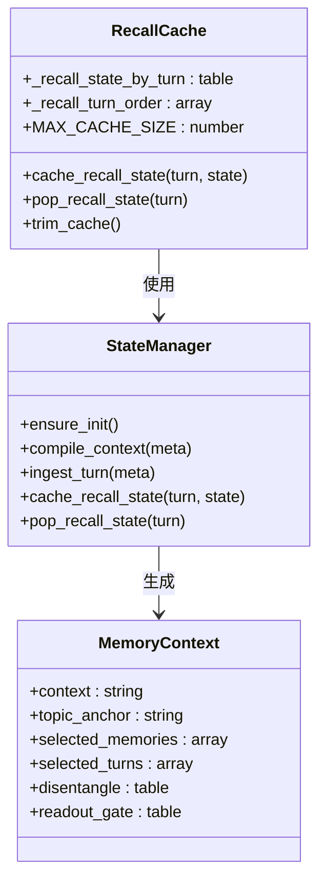
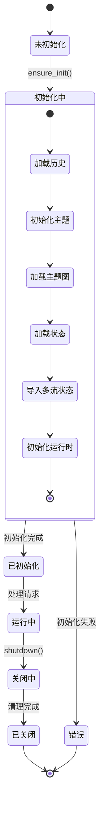
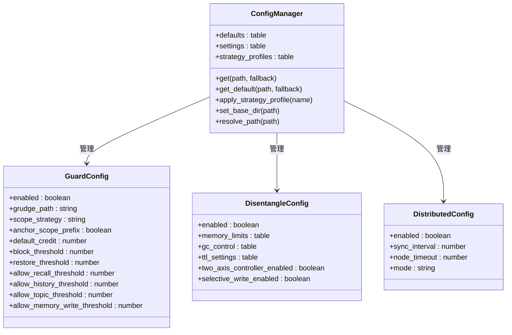
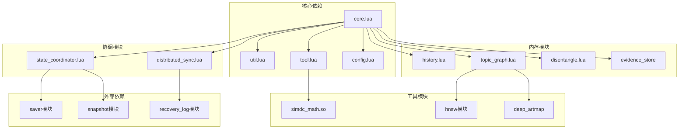

# 内存核心系统

<cite>
**本文档引用的文件**
- [core.lua](file://mori_memory/mori_memory/core.lua)
- [init.lua](file://mori_memory/mori_memory/init.lua)
- [config.lua](file://mori_memory/module/config.lua)
- [distributed_sync.lua](file://mori_memory/module/distributed_sync.lua)
- [state_coordinator.lua](file://mori_memory/module/state_coordinator.lua)
- [util.lua](file://mori_memory/mori_memory/util.lua)
- [tool.lua](file://mori_memory/module/tool.lua)
- [history.lua](file://mori_memory/module/memory/history.lua)
- [topic_graph.lua](file://mori_memory/module/memory/topic_graph.lua)
- [disentangle.lua](file://mori_memory/module/memory/disentangle.lua)
</cite>

## 目录
1. [简介](#简介)
2. [项目结构](#项目结构)
3. [核心组件](#核心组件)
4. [架构概览](#架构概览)
5. [详细组件分析](#详细组件分析)
6. [依赖关系分析](#依赖关系分析)
7. [性能考虑](#性能考虑)
8. [故障排除指南](#故障排除指南)
9. [结论](#结论)

## 简介

Mori内存核心系统是一个复杂的多模块内存管理系统，专为实时对话场景设计。该系统实现了先进的记忆检索、主题建模、多流对话分离等功能，支持分布式状态同步和一致性保证。

系统的核心特性包括：
- **多模态记忆管理**：支持向量记忆、精确记忆和主题记忆的统一管理
- **分布式一致性**：通过版本向量和事务机制保证多节点状态一致性
- **智能路由**：基于双轴控制器的对话流路由和选择
- **内存限制保护**：动态内存监控和垃圾回收机制
- **安全防护**：基于信用系统的访问控制和防滥用机制

## 项目结构

内存核心系统采用模块化架构，主要由以下层次组成：

**图表来源**
- [core.lua:1-50](file://mori_memory/mori_memory/core.lua#L1-L50)
- [init.lua:1-3](file://mori_memory/mori_memory/init.lua#L1-L3)

**章节来源**
- [core.lua:1-50](file://mori_memory/mori_memory/core.lua#L1-L50)
- [init.lua:1-3](file://mori_memory/mori_memory/init.lua#L1-L3)

## 核心组件

### 内存核心引擎 (core.lua)

内存核心引擎是整个系统的大脑，负责协调各个子模块的工作。其主要职责包括：

- **初始化管理**：确保所有依赖模块正确加载和初始化
- **记忆写入**：处理用户输入的记忆写入流程
- **记忆检索**：根据查询向量检索相关记忆
- **状态缓存**：管理回忆状态的缓存和恢复
- **API接口**：提供统一的内存操作接口

### 配置管理系统 (config.lua)

配置系统提供了完整的内存核心配置管理能力：

- **默认配置**：包含所有可用的配置选项和默认值
- **策略配置**：支持多种记忆策略的配置和切换
- **分布式配置**：分布式同步和节点管理配置
- **安全配置**：信用系统和访问控制配置
- **内存限制配置**：动态内存监控和保护配置

### 分布式同步 (distributed_sync.lua)

分布式同步模块实现了多节点状态一致性：

- **节点管理**：管理集群中的活跃节点
- **状态广播**：在节点间广播状态变更
- **增量同步**：实现高效的增量状态同步
- **冲突解决**：处理分布式环境下的状态冲突
- **优雅降级**：在网络分区时提供降级模式

### 状态协调器 (state_coordinator.lua)

状态协调器确保多模块间的状态一致性：

- **版本向量**：跟踪每个模块的状态版本
- **事务管理**：支持跨模块的事务操作
- **一致性检查**：验证状态的一致性
- **检查点管理**：创建和恢复状态检查点
- **自动维护**：定期检查和修复状态不一致

**章节来源**
- [core.lua:227-327](file://mori_memory/mori_memory/core.lua#L227-L327)
- [config.lua:6-497](file://mori_memory/module/config.lua#L6-L497)
- [distributed_sync.lua:1-287](file://mori_memory/module/distributed_sync.lua#L1-L287)
- [state_coordinator.lua:1-302](file://mori_memory/module/state_coordinator.lua#L1-L302)

## 架构概览

内存核心系统采用分层架构设计，每层都有明确的职责分工：

**图表来源**
- [core.lua:1712-1959](file://mori_memory/mori_memory/core.lua#L1712-L1959)
- [disentangle.lua:1-100](file://mori_memory/module/memory/disentangle.lua#L1-L100)

## 详细组件分析

### 内存初始化流程

内存初始化是一个复杂的过程，涉及多个模块的协调工作：

**图表来源**
- [core.lua:227-327](file://mori_memory/mori_memory/core.lua#L227-L327)
- [history.lua:67-115](file://mori_memory/module/memory/history.lua#L67-L115)

初始化流程的关键步骤包括：

1. **历史数据加载**：从持久化存储中加载对话历史
2. **主题模块初始化**：建立主题建模的基础结构
3. **主题图加载**：加载向量索引和主题关系图
4. **状态恢复**：从检查点恢复多流分离状态
5. **运行时设置**：初始化线程运行时环境

**章节来源**
- [core.lua:227-327](file://mori_memory/mori_memory/core.lua#L227-L327)
- [history.lua:67-115](file://mori_memory/module/memory/history.lua#L67-L115)

### 嵌入向量生成机制

嵌入向量生成是内存系统的核心功能之一，支持多种模式：

**图表来源**
- [core.lua:83-96](file://mori_memory/mori_memory/core.lua#L83-L96)
- [tool.lua:174-187](file://mori_memory/module/tool.lua#L174-L187)

嵌入向量生成的关键特性：

- **多模式支持**：支持查询模式和段落模式的向量生成
- **自定义扩展**：允许用户自定义嵌入器函数
- **结果验证**：确保生成的向量符合预期格式
- **错误处理**：提供详细的错误信息和回退机制

**章节来源**
- [core.lua:83-96](file://mori_memory/mori_memory/core.lua#L83-L96)
- [tool.lua:160-170](file://mori_memory/module/tool.lua#L160-L170)

### 记忆检索状态缓存系统

记忆检索状态缓存系统通过LRU缓存机制提高检索效率：

**图表来源**
- [core.lua:29-50](file://mori_memory/mori_memory/core.lua#L29-L50)
- [core.lua:2264-2273](file://mori_memory/mori_memory/core.lua#L2264-L2273)

缓存系统的设计特点：

- **循环队列**：维护最近12轮的检索状态
- **快速查找**：通过哈希表实现O(1)的查找时间
- **自动清理**：超出容量时自动移除最旧的状态
- **内存友好**：限制缓存大小防止内存泄漏

**章节来源**
- [core.lua:29-50](file://mori_memory/mori_memory/core.lua#L29-L50)
- [core.lua:2264-2273](file://mori_memory/mori_memory/core.lua#L2264-L2273)

### 内存核心生命周期管理

内存核心的生命周期管理包括完整的启动、运行和关闭流程：

**图表来源**
- [core.lua:227-327](file://mori_memory/mori_memory/core.lua#L227-L327)
- [core.lua:2275-2307](file://mori_memory/mori_memory/core.lua#L2275-L2307)

生命周期管理的关键机制：

- **模块加载顺序**：严格按照依赖关系加载模块
- **初始化失败处理**：遇到错误时提供详细的错误信息
- **状态恢复机制**：从检查点恢复系统状态
- **优雅关闭**：确保所有资源正确释放

**章节来源**
- [core.lua:227-327](file://mori_memory/mori_memory/core.lua#L227-L327)
- [core.lua:2275-2307](file://mori_memory/mori_memory/core.lua#L2275-L2307)

### 内存核心配置管理

内存核心的配置管理提供了灵活的配置选项：

**图表来源**
- [config.lua:6-497](file://mori_memory/module/config.lua#L6-L497)

配置管理的主要功能：

- **默认值管理**：提供完整的默认配置值
- **策略配置**：支持多种记忆策略的配置
- **动态调整**：运行时可以调整配置参数
- **路径解析**：自动解析相对路径到绝对路径

**章节来源**
- [config.lua:6-497](file://mori_memory/module/config.lua#L6-L497)

## 依赖关系分析

内存核心系统的依赖关系错综复杂，涉及多个层次的模块交互：

**图表来源**
- [core.lua:1-20](file://mori_memory/mori_memory/core.lua#L1-L20)

### 模块耦合度分析

系统采用松耦合设计，通过接口抽象降低模块间的依赖：

- **低耦合高内聚**：每个模块专注于特定功能
- **接口标准化**：通过统一的接口规范进行交互
- **配置驱动**：通过配置文件控制模块行为
- **插件化架构**：支持动态加载和卸载模块

### 循环依赖检测

系统通过以下机制避免循环依赖：

- **单向依赖链**：确保依赖关系形成单向链
- **接口抽象**：通过接口定义避免直接依赖
- **延迟加载**：按需加载依赖模块
- **工厂模式**：使用工厂模式创建对象实例

**章节来源**
- [core.lua:1-20](file://mori_memory/mori_memory/core.lua#L1-L20)
- [util.lua:1-153](file://mori_memory/mori_memory/util.lua#L1-L153)

## 性能考虑

内存核心系统在设计时充分考虑了性能优化：

### 内存管理优化

- **向量缓存**：缓存常用的向量计算结果
- **批量处理**：支持批量向量计算减少开销
- **内存池**：使用内存池减少频繁分配
- **垃圾回收**：智能垃圾回收策略

### 计算优化

- **SIMD加速**：利用SIMD指令集加速向量运算
- **异步处理**：支持异步向量计算
- **结果缓存**：缓存计算结果避免重复计算
- **批量化查询**：支持批量记忆检索

### 网络优化

- **增量同步**：只同步变化的状态
- **压缩传输**：对传输的数据进行压缩
- **背压控制**：防止网络拥塞
- **连接复用**：复用网络连接

## 故障排除指南

### 常见问题及解决方案

#### 初始化失败

**问题症状**：系统启动时抛出初始化异常

**可能原因**：
- 配置文件格式错误
- 持久化文件损坏
- 依赖模块缺失
- 权限不足

**解决步骤**：
1. 检查配置文件语法
2. 验证持久化文件完整性
3. 确认所有依赖模块存在
4. 检查文件权限设置

#### 记忆检索异常

**问题症状**：记忆检索返回空结果或错误结果

**可能原因**：
- 向量维度不匹配
- 嵌入器配置错误
- 主题图索引损坏
- 查询向量格式错误

**解决步骤**：
1. 验证向量维度配置
2. 检查嵌入器函数实现
3. 重建主题图索引
4. 格式化查询向量

#### 分布式同步问题

**问题症状**：多节点状态不一致

**可能原因**：
- 网络分区
- 节点超时
- 冲突解决失败
- 版本向量不匹配

**解决步骤**：
1. 检查网络连接状态
2. 调整超时参数
3. 手动触发冲突解决
4. 重新同步状态

**章节来源**
- [core.lua:234-240](file://mori_memory/mori_memory/core.lua#L234-L240)
- [distributed_sync.lua:240-285](file://mori_memory/module/distributed_sync.lua#L240-L285)

## 结论

Mori内存核心系统是一个设计精良的复杂系统，具有以下特点：

### 技术优势

- **架构清晰**：采用分层架构，职责明确
- **扩展性强**：支持插件化和配置驱动
- **性能优秀**：通过多种优化技术提升性能
- **可靠性高**：完善的错误处理和恢复机制

### 应用价值

- **实时对话**：支持实时的多轮对话记忆
- **多模态融合**：统一管理不同类型的记忆
- **分布式部署**：支持多节点分布式部署
- **安全防护**：内置安全机制防止滥用

### 发展方向

未来可以进一步优化的方向包括：
- **模型集成**：集成更多类型的AI模型
- **性能优化**：继续优化内存和计算性能
- **功能扩展**：增加更多记忆管理功能
- **监控完善**：增强系统的可观测性

该系统为构建智能对话代理提供了坚实的基础，其设计理念和实现方式值得其他类似系统借鉴。