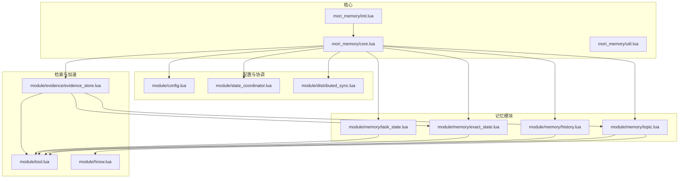
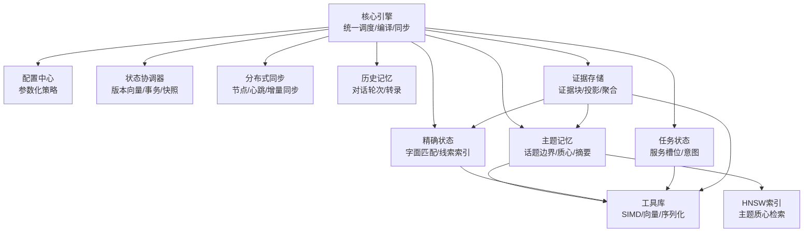
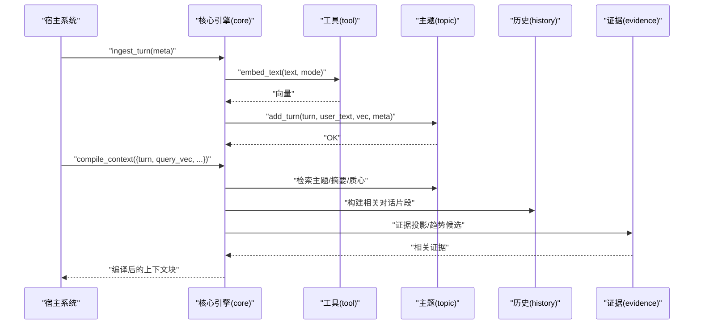
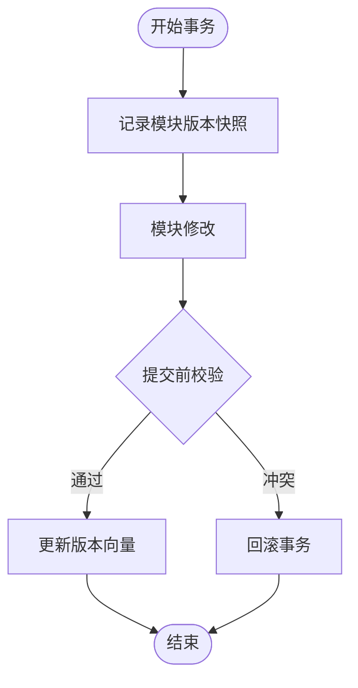
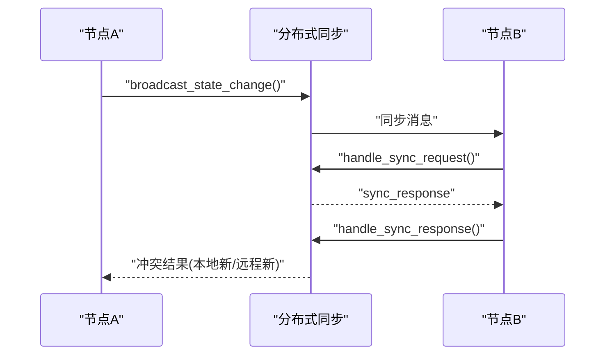
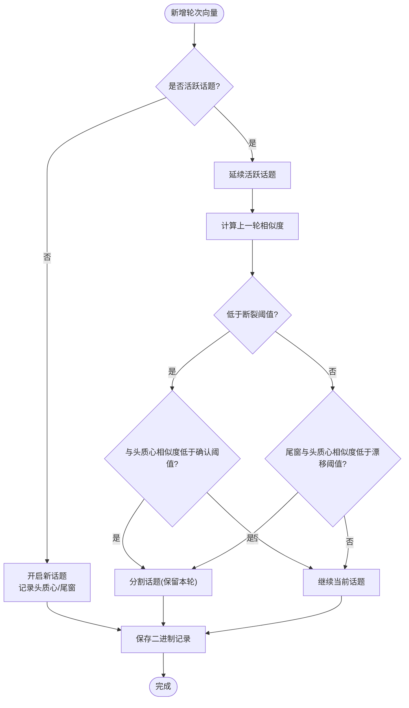
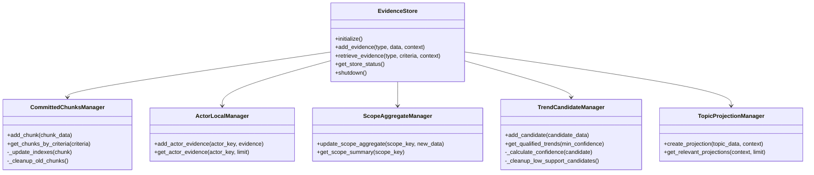
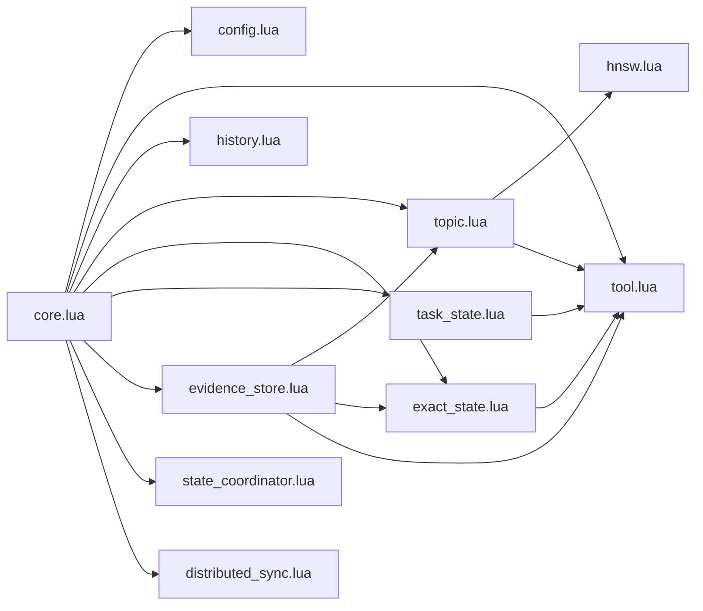

# 内存系统架构

<cite>
**本文档引用的文件**
- [mori_memory/core.lua](file://mori_memory/mori_memory/core.lua)
- [mori_memory/init.lua](file://mori_memory/mori_memory/init.lua)
- [module/config.lua](file://mori_memory/module/config.lua)
- [module/distributed_sync.lua](file://mori_memory/module/distributed_sync.lua)
- [module/state_coordinator.lua](file://mori_memory/module/state_coordinator.lua)
- [module/evidence/evidence_store.lua](file://mori_memory/module/evidence/evidence_store.lua)
- [module/memory/history.lua](file://mori_memory/module/memory/history.lua)
- [module/memory/topic.lua](file://mori_memory/module/memory/topic.lua)
- [module/memory/exact_state.lua](file://mori_memory/module/memory/exact_state.lua)
- [module/memory/task_state.lua](file://mori_memory/module/memory/task_state.lua)
- [module/hnsw.lua](file://mori_memory/module/hnsw.lua)
- [module/tool.lua](file://mori_memory/module/tool.lua)
- [mori_memory/util.lua](file://mori_memory/mori_memory/util.lua)
- [mori_memory/README.md](file://mori_memory/README.md)
</cite>

## 目录
1. [简介](#简介)
2. [项目结构](#项目结构)
3. [核心组件](#核心组件)
4. [架构总览](#架构总览)
5. [详细组件分析](#详细组件分析)
6. [依赖关系分析](#依赖关系分析)
7. [性能考虑](#性能考虑)
8. [故障排除指南](#故障排除指南)
9. [结论](#结论)

## 简介
本文件为 Mori 内存系统的技术架构文档，聚焦于 LuaJIT 内存核心的设计与实现，涵盖多维度记忆存储结构（主题记忆、历史记忆、精确状态、任务状态）、分布式同步机制、检索算法与插件化扩展点。文档旨在帮助开发者快速理解系统架构、数据模型、访问模式与性能优化策略，并提供配置参数说明与故障排除建议。

## 项目结构
Mori 内存核心位于 `mori_memory/` 目录，采用模块化设计：
- 核心入口与初始化：`mori_memory/init.lua` → `mori_memory/core.lua`
- 配置中心：`module/config.lua`
- 状态协调与分布式同步：`module/state_coordinator.lua`、`module/distributed_sync.lua`
- 多维度记忆模块：`module/memory/history.lua`、`module/memory/topic.lua`、`module/memory/exact_state.lua`、`module/memory/task_state.lua`
- 检索与加速：`module/hnsw.lua`、`module/tool.lua`
- 证据存储与插件化：`module/evidence/evidence_store.lua`
- 工具与实用函数：`mori_memory/util.lua`

**图表来源**
- [mori_memory/init.lua:1-3](file://mori_memory/mori_memory/init.lua#L1-L3)
- [mori_memory/core.lua:1-50](file://mori_memory/mori_memory/core.lua#L1-L50)
- [module/config.lua:1-60](file://mori_memory/module/config.lua#L1-L60)
- [module/state_coordinator.lua:1-40](file://mori_memory/module/state_coordinator.lua#L1-L40)
- [module/distributed_sync.lua:1-40](file://mori_memory/module/distributed_sync.lua#L1-L40)
- [module/memory/history.lua:1-30](file://mori_memory/module/memory/history.lua#L1-L30)
- [module/memory/topic.lua:1-40](file://mori_memory/module/memory/topic.lua#L1-L40)
- [module/memory/exact_state.lua:1-30](file://mori_memory/module/memory/exact_state.lua#L1-L30)
- [module/memory/task_state.lua:1-30](file://mori_memory/module/memory/task_state.lua#L1-L30)
- [module/hnsw.lua:1-40](file://mori_memory/module/hnsw.lua#L1-L40)
- [module/tool.lua:1-40](file://mori_memory/module/tool.lua#L1-L40)
- [module/evidence/evidence_store.lua:1-30](file://mori_memory/module/evidence/evidence_store.lua#L1-L30)

**章节来源**
- [mori_memory/README.md:1-89](file://mori_memory/README.md#L1-L89)
- [mori_memory/mori_memory/init.lua:1-3](file://mori_memory/mori_memory/init.lua#L1-L3)
- [mori_memory/mori_memory/core.lua:1-50](file://mori_memory/mori_memory/core.lua#L1-L50)

## 核心组件
- 核心引擎（core）：负责初始化、模块装载、嵌入生成、编译上下文、线程运行时与证据存储集成、分布式同步与状态协调。
- 配置中心（config）：集中管理主题图、话题、精确状态、任务状态、分布式、抗毒化等配置。
- 状态协调器（state_coordinator）：维护版本向量、事务一致性、快照与恢复日志，保障多模块原子性。
- 分布式同步（distributed_sync）：节点管理、心跳、广播、增量同步与冲突解决。
- 多维度记忆模块：历史记忆（history）、主题记忆（topic）、精确状态（exact_state）、任务状态（task_state）。
- 检索与加速（tool、hnsw）：SIMD 点积/余弦加速、HNSW 索引、向量归一化与序列化。
- 证据存储（evidence_store）：证据块、演员本地、范围聚合、趋势候选与主题投影。

**章节来源**
- [mori_memory/mori_memory/core.lua:1-120](file://mori_memory/mori_memory/core.lua#L1-L120)
- [module/config.lua:1-120](file://mori_memory/module/config.lua#L1-L120)
- [module/state_coordinator.lua:1-60](file://mori_memory/module/state_coordinator.lua#L1-L60)
- [module/distributed_sync.lua:1-60](file://mori_memory/module/distributed_sync.lua#L1-L60)
- [module/evidence/evidence_store.lua:1-60](file://mori_memory/module/evidence/evidence_store.lua#L1-L60)

## 架构总览
系统采用“核心引擎 + 模块化记忆 + 协调与同步”的分层架构。核心引擎统一调度各模块，配置中心提供参数化能力，状态协调器与分布式同步保障一致性与可用性，检索模块通过 SIMD/HNSW 实现高效相似度计算与索引查询。

**图表来源**
- [mori_memory/mori_memory/core.lua:1-120](file://mori_memory/mori_memory/core.lua#L1-L120)
- [module/config.lua:1-120](file://mori_memory/module/config.lua#L1-L120)
- [module/state_coordinator.lua:1-80](file://mori_memory/module/state_coordinator.lua#L1-L80)
- [module/distributed_sync.lua:1-80](file://mori_memory/module/distributed_sync.lua#L1-L80)
- [module/memory/topic.lua:1-120](file://mori_memory/module/memory/topic.lua#L1-L120)
- [module/memory/exact_state.lua:1-120](file://mori_memory/module/memory/exact_state.lua#L1-L120)
- [module/memory/task_state.lua:1-120](file://mori_memory/module/memory/task_state.lua#L1-L120)
- [module/evidence/evidence_store.lua:1-120](file://mori_memory/module/evidence/evidence_store.lua#L1-L120)
- [module/tool.lua:1-120](file://mori_memory/module/tool.lua#L1-L120)
- [module/hnsw.lua:1-120](file://mori_memory/module/hnsw.lua#L1-L120)

## 详细组件分析

### 核心引擎（mori_memory/core.lua）
- 初始化流程：按顺序加载历史、主题、主题图、精确状态、任务状态、离散消解（线程运行时）与证据存储；注册模块到状态协调器；按配置启动分布式同步。
- 嵌入生成：优先使用传入向量，否则调用工具模块的嵌入接口；支持按模式选择 query/passage。
- 编译上下文：构建相关对话片段、控制读出门控与阈值，结合主题图检索与精确状态匹配输出编译后的上下文块。
- 线程运行时与检查点：周期性写入 WAL、导出/导入离散消解状态、按阈值触发垃圾回收。
- 安全与守卫：基于来源/房间/用户等身份字段计算信用度，动态决定是否允许回忆、写入、历史/主题检索。

**图表来源**
- [mori_memory/mori_memory/core.lua:52-120](file://mori_memory/mori_memory/core.lua#L52-L120)
- [module/tool.lua:174-187](file://mori_memory/module/tool.lua#L174-L187)
- [module/memory/topic.lua:659-794](file://mori_memory/module/memory/topic.lua#L659-L794)
- [module/memory/history.lua:128-165](file://mori_memory/module/memory/history.lua#L128-L165)
- [module/evidence/evidence_store.lua:508-563](file://mori_memory/module/evidence/evidence_store.lua#L508-L563)

**章节来源**
- [mori_memory/mori_memory/core.lua:227-327](file://mori_memory/mori_memory/core.lua#L227-L327)
- [mori_memory/mori_memory/core.lua:361-404](file://mori_memory/mori_memory/core.lua#L361-L404)
- [mori_memory/mori_memory/core.lua:438-474](file://mori_memory/mori_memory/core.lua#L438-L474)

### 配置中心（module/config.lua）
- 主题图检索参数：最大返回主题数、每主题证据数、桥接 TopK、衰减系数、语义权重、桥接权重等。
- 话题模块参数：聚类阈值、最小话题长度、摘要压缩比与变体权重。
- 精确状态参数：启用开关、存储根、回复父节点窗口与阈值、符号索引容量等。
- 任务状态参数：启用开关、存储根、最大服务数、槽位值上限、是否输出块。
- 抗毒化与多用户鲁棒性：信用计算、阻断阈值、恢复阈值、来源策略、锚定前缀等。
- 分布式与离散消解：节点 ID、同步间隔、内存限制、GC 控制、TTL 设置、两轴控制器权重等。

**章节来源**
- [module/config.lua:6-180](file://mori_memory/module/config.lua#L6-L180)
- [module/config.lua:181-496](file://mori_memory/module/config.lua#L181-L496)

### 状态协调器（module/state_coordinator.lua）
- 版本向量：为每个模块维护版本号、时间戳与依赖，用于一致性校验。
- 事务管理：开始/提交/回滚事务，提交前验证版本快照是否被并发修改。
- 一致性检查点：原子性刷新所有模块、生成快照、写入恢复日志。
- 恢复验证：校验快照与实际版本向量一致性、恢复日志序列连续性。
- 自动维护：定期检查不一致并自动创建检查点。

**图表来源**
- [module/state_coordinator.lua:75-142](file://mori_memory/module/state_coordinator.lua#L75-L142)

**章节来源**
- [module/state_coordinator.lua:1-302](file://mori_memory/module/state_coordinator.lua#L1-L302)

### 分布式同步（module/distributed_sync.lua）
- 节点管理：增删节点、心跳维护、活跃节点筛选。
- 广播与请求：状态变更广播、同步请求/响应、版本对比与不一致收集。
- 冲突解决：基于时间戳的保守策略（本地新/远程新）。
- 定期同步：按配置间隔进行增量同步，检测网络分区并降级。
- 回调注册：支持注册同步回调以扩展行为。

**图表来源**
- [module/distributed_sync.lua:58-142](file://mori_memory/module/distributed_sync.lua#L58-L142)

**章节来源**
- [module/distributed_sync.lua:1-287](file://mori_memory/module/distributed_sync.lua#L1-L287)

### 多维度记忆模块

#### 历史记忆（module/memory/history.lua）
- 文件格式：V3 带快照生成号头，支持原子写入与生成号校验。
- 结构：按轮次存储用户/助手文本，提供解析、追加、按轮次读取。
- 生成号一致性：加载时校验与快照模块要求一致，防止跨快照混用。

**章节来源**
- [module/memory/history.lua:1-195](file://mori_memory/module/memory/history.lua#L1-L195)

#### 主题记忆（module/memory/topic.lua）
- 话题边界检测：基于“话语对相似度”与“全局漂移”双重阈值，支持最小话题长度约束。
- 质心与摘要：头质心、尾部滑窗质心、整体质心；支持分级摘要（full/slight/heavy/none）。
- 线程安全与持久化：二进制记录包含版本、活跃状态掩码与向量，支持恢复与重建提示。
- 作用域隔离：按 scope_key 强制话题分裂，降低多用户污染。

**图表来源**
- [module/memory/topic.lua:659-794](file://mori_memory/module/memory/topic.lua#L659-L794)

**章节来源**
- [module/memory/topic.lua:1-200](file://mori_memory/module/memory/topic.lua#L1-L200)
- [module/memory/topic.lua:482-657](file://mori_memory/module/memory/topic.lua#L482-L657)

#### 精确状态（module/memory/exact_state.lua）
- 字面匹配：基于词法权重、提及、动机模式与书签构建索引，支持回复父节点提示。
- 线程运行时：按线程键重建符号图与后缀图，支持后缀长度上限与直接后继边。
- 作用域聚合：按 scope_key 维护事件、提及、动机、符号索引与线程集合。

**章节来源**
- [module/memory/exact_state.lua:1-120](file://mori_memory/module/memory/exact_state.lua#L1-L120)
- [module/memory/exact_state.lua:559-678](file://mori_memory/module/memory/exact_state.lua#L559-L678)

#### 任务状态（module/memory/task_state.lua）
- 服务槽位：规范化服务快照，合并请求槽位与值，限制最大服务数。
- 输出块：按服务名格式化意图、请求槽位与槽位值，支持预览与观察。

**章节来源**
- [module/memory/task_state.lua:1-120](file://mori_memory/module/memory/task_state.lua#L1-L120)
- [module/memory/task_state.lua:275-302](file://mori_memory/module/memory/task_state.lua#L275-L302)

### 检索与加速

#### 工具库（module/tool.lua）
- 向量数学：SIMD 点积/余弦（优先）与 Lua 回退；向量平均、归一化、序列化/反序列化。
- 嵌入接口：统一调用 Python 管道生成 query/passage 向量，兼容批量接口。
- 字符串与表工具：Lua 表编码/解析、严格字符串数组解析、COT 去除等。

**章节来源**
- [module/tool.lua:1-120](file://mori_memory/module/tool.lua#L1-L120)
- [module/tool.lua:500-725](file://mori_memory/module/tool.lua#L500-L725)

#### HNSW 索引（module/hnsw.lua）
- FFI 接口：创建/加载索引、添加/删除标签、设置 ef、搜索 K 近邻、保存/销毁。
- 空间与相似度：支持 L2/内积/Cosine 空间，距离到相似度转换。
- 可用性降级：未加载原生模块时返回错误信息，不中断核心流程。

**章节来源**
- [module/hnsw.lua:1-120](file://mori_memory/module/hnsw.lua#L1-L120)
- [module/hnsw.lua:146-160](file://mori_memory/module/hnsw.lua#L146-L160)

### 证据存储（module/evidence/evidence_store.lua）
- 证据块：已提交的记忆块，按时间/演员/范围索引，支持清理与过期管理。
- 演员本地：按演员键维护证据队列，限制数量。
- 范围聚合：按 scope_key 统计演员活动、主题分布、交互模式与更新时间。
- 趋势候选：基于模式支持度、演员覆盖与最近出现时间计算置信度。
- 主题投影：基于上下文与新鲜度计算相关性，支持 TTL 管理。

**图表来源**
- [module/evidence/evidence_store.lua:26-175](file://mori_memory/module/evidence/evidence_store.lua#L26-L175)
- [module/evidence/evidence_store.lua:177-226](file://mori_memory/module/evidence/evidence_store.lua#L177-L226)
- [module/evidence/evidence_store.lua:228-284](file://mori_memory/module/evidence/evidence_store.lua#L228-L284)
- [module/evidence/evidence_store.lua:286-411](file://mori_memory/module/evidence/evidence_store.lua#L286-L411)
- [module/evidence/evidence_store.lua:413-488](file://mori_memory/module/evidence/evidence_store.lua#L413-L488)

**章节来源**
- [module/evidence/evidence_store.lua:1-603](file://mori_memory/module/evidence/evidence_store.lua#L1-L603)

## 依赖关系分析
- 核心引擎依赖：配置、工具、历史、主题、主题图、精确状态、任务状态、证据存储、状态协调器、分布式同步、线程运行时。
- 模块耦合：主题记忆与工具库强耦合（向量运算、HNSW）；精确状态与工具库耦合（索引构建）；证据存储与主题/精确状态耦合（投影与索引）。
- 外部依赖：Python 嵌入管道（通过工具模块）、原生模块（simdc_math.so、mori_hnsw.so）。

**图表来源**
- [mori_memory/mori_memory/core.lua:1-20](file://mori_memory/mori_memory/core.lua#L1-L20)
- [module/memory/topic.lua:1-10](file://mori_memory/module/memory/topic.lua#L1-L10)
- [module/hnsw.lua:1-10](file://mori_memory/module/hnsw.lua#L1-L10)
- [module/tool.lua:1-10](file://mori_memory/module/tool.lua#L1-L10)
- [module/evidence/evidence_store.lua:1-14](file://mori_memory/module/evidence/evidence_store.lua#L1-L14)

**章节来源**
- [mori_memory/mori_memory/core.lua:1-20](file://mori_memory/mori_memory/core.lua#L1-L20)

## 性能考虑
- 向量相似度计算
  - 优先使用 SIMD 加速（simdc_math.so），回退至 Lua 实现。
  - HNSW 索引（mori_hnsw.so）用于主题质心检索，提升大规模检索效率。
- 内存与持久化
  - 历史/主题/精确状态/任务状态均支持原子写入与生成号校验，减少不一致风险。
  - 主题记忆二进制记录包含活跃状态掩码，避免仅恢复头/尾导致的状态漂移。
- 线程运行时与垃圾回收
  - 离散消解运行时具备内存压力阈值与 GC 触发策略，定期检查与清理。
- 读出门控与阈值
  - 通过配置参数控制读出最小记忆、转录与待定证据权重，平衡召回与质量。

[本节为通用指导，无需具体文件分析]

## 故障排除指南
- 嵌入模块不可用
  - 现象：SIMD 或 HNSW 原生模块加载失败。
  - 处理：确认模块已构建并放置于正确路径；系统会回退至 Lua 实现。
  - 参考：原生模块加载与错误信息记录。
- 生成号不一致
  - 现象：历史/任务状态加载时报生成号不匹配。
  - 处理：确保快照模块要求与文件生成号一致；必要时重建快照。
- 话题边界异常
  - 现象：频繁分割或无法分割。
  - 处理：调整断裂/确认/漂移阈值与最小话题长度；检查向量维度一致性。
- 分布式同步异常
  - 现象：节点不活跃、同步不一致、网络分区。
  - 处理：检查心跳与超时配置；启用降级模式；手动触发冲突解决。
- 证据存储过期
  - 现象：趋势候选或投影过多。
  - 处理：调整 TTL 与最大容量；定期清理过期数据。

**章节来源**
- [module/tool.lua:31-42](file://mori_memory/module/tool.lua#L31-L42)
- [module/hnsw.lua:82-103](file://mori_memory/module/hnsw.lua#L82-L103)
- [module/memory/history.lua:71-104](file://mori_memory/module/memory/history.lua#L71-L104)
- [module/memory/task_state.lua:227-251](file://mori_memory/module/memory/task_state.lua#L227-L251)
- [module/memory/topic.lua:468-479](file://mori_memory/module/memory/topic.lua#L468-L479)
- [module/distributed_sync.lua:241-285](file://mori_memory/module/distributed_sync.lua#L241-L285)
- [module/evidence/evidence_store.lua:578-583](file://mori_memory/module/evidence/evidence_store.lua#L578-L583)

## 结论
Mori 内存系统通过“核心引擎 + 模块化记忆 + 协调与同步”的架构实现了高一致性、可扩展与高性能的记忆管理。多维度记忆结构清晰分离职责，分布式同步与状态协调保障跨进程一致性，SIMD/HNSW 加速显著提升检索效率。配置中心与插件化扩展点（证据存储、决策适配器、状态协调器）为不同场景提供了灵活适配空间。