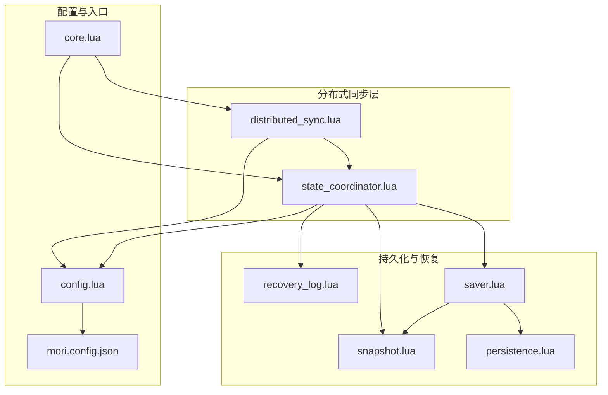
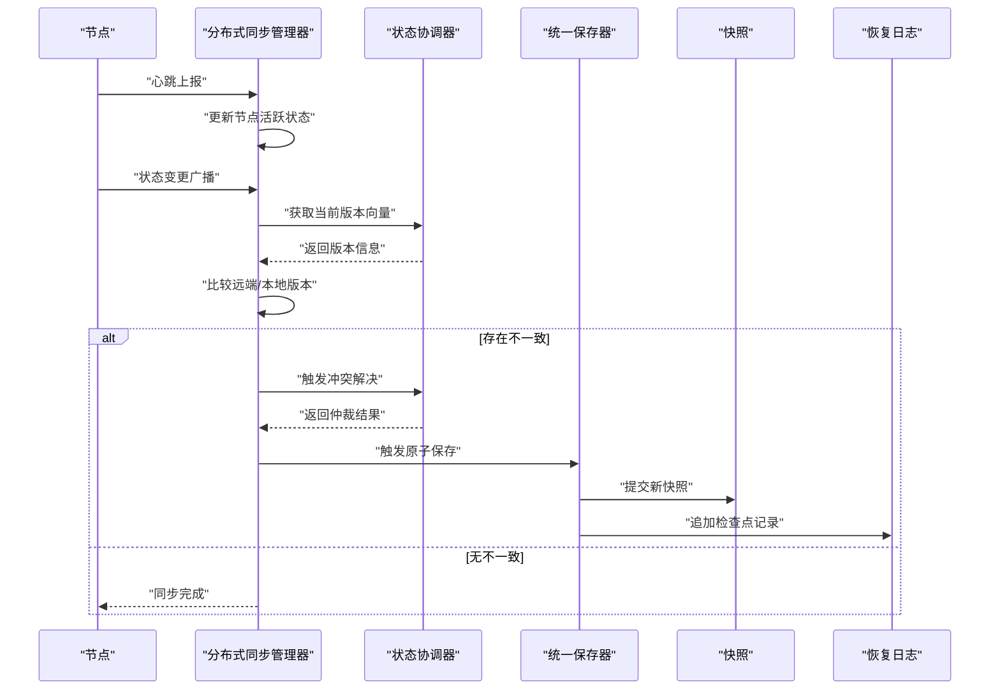
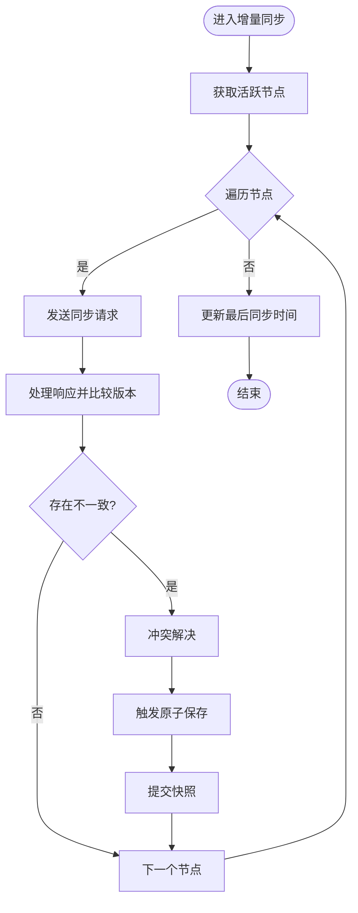
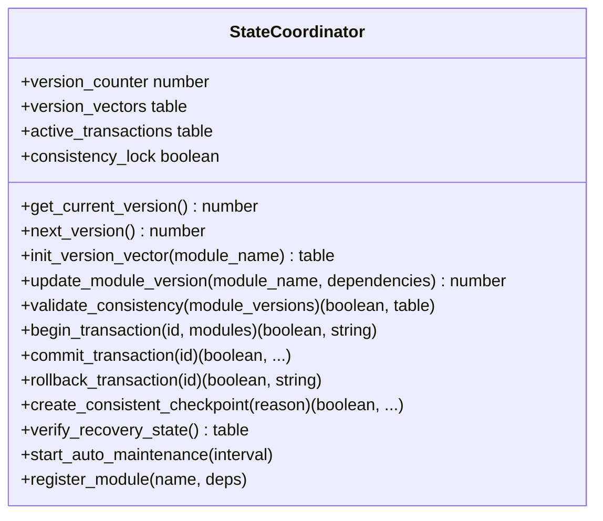
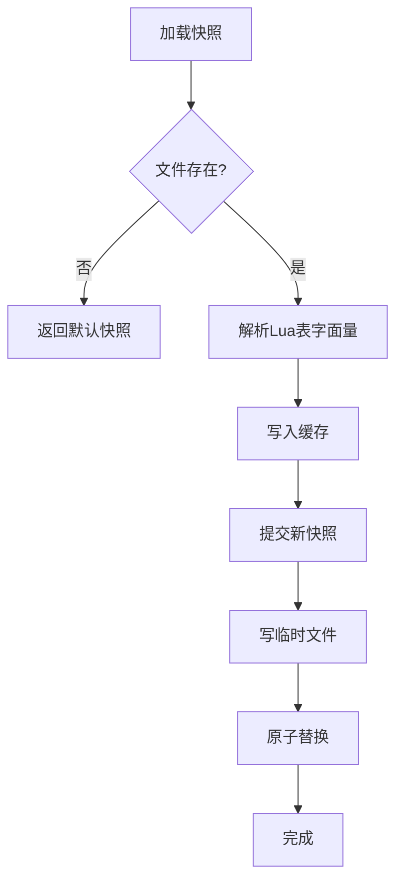
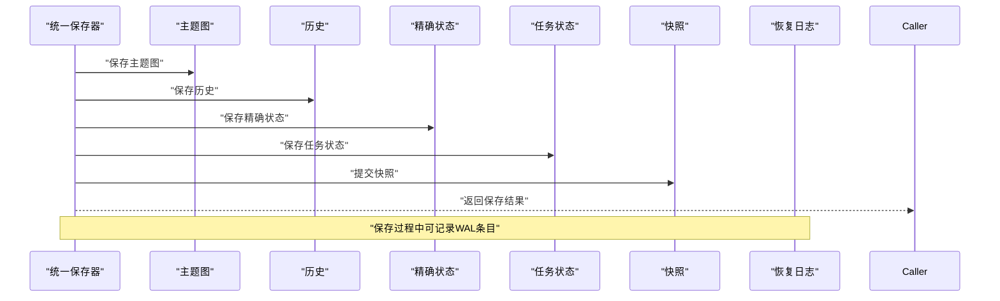
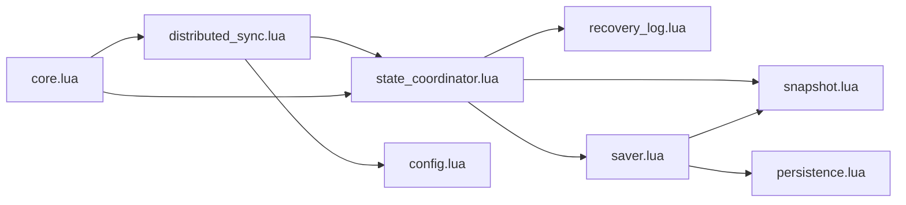

# 分布式同步机制

<cite>
**本文档引用的文件**
- [distributed_sync.lua](file://mori_memory/module/distributed_sync.lua)
- [state_coordinator.lua](file://mori_memory/module/state_coordinator.lua)
- [snapshot.lua](file://mori_memory/module/snapshot.lua)
- [persistence.lua](file://mori_memory/module/persistence.lua)
- [recovery_log.lua](file://mori_memory/module/memory/recovery_log.lua)
- [saver.lua](file://mori_memory/module/memory/saver.lua)
- [config.lua](file://mori_memory/module/config.lua)
- [core.lua](file://mori_memory/mori_memory/core.lua)
- [mori.config.json](file://mori.config.json)
</cite>

## 目录
1. [简介](#简介)
2. [项目结构](#项目结构)
3. [核心组件](#核心组件)
4. [架构总览](#架构总览)
5. [详细组件分析](#详细组件分析)
6. [依赖关系分析](#依赖关系分析)
7. [性能考虑](#性能考虑)
8. [故障排除指南](#故障排除指南)
9. [结论](#结论)
10. [附录](#附录)

## 简介
本文件面向Mori分布式同步机制，系统性阐述其架构设计与实现细节，重点覆盖以下方面：
- 节点发现与心跳管理
- 状态传播与增量同步协议
- 冲突检测与解决策略
- 状态协调器（StateCoordinator）的模块注册、版本向量、事务一致性与检查点机制
- 快照系统与WAL恢复日志的配合
- 分布式部署最佳实践、网络拓扑建议、性能优化与故障恢复
- 实际配置示例与故障排除指南

该机制以LuaJIT实现，采用版本向量与WAL（预写日志）保障一致性，并通过可插拔的持久化层实现原子写入。

## 项目结构
围绕分布式同步的核心模块位于 `mori_memory/module` 与 `mori_memory/module/memory` 下，主要文件如下：
- 分布式同步：`distributed_sync.lua`
- 状态协调：`state_coordinator.lua`
- 快照：`snapshot.lua`
- 原子持久化：`persistence.lua`
- 恢复日志：`recovery_log.lua`
- 统一保存器：`saver.lua`
- 配置中心：`config.lua`
- 核心入口：`core.lua`
- 顶层配置：`mori.config.json`

**图表来源**
- [distributed_sync.lua:1-287](file://mori_memory/module/distributed_sync.lua#L1-L287)
- [state_coordinator.lua:1-302](file://mori_memory/module/state_coordinator.lua#L1-L302)
- [snapshot.lua:1-112](file://mori_memory/module/snapshot.lua#L1-L112)
- [persistence.lua:1-97](file://mori_memory/module/persistence.lua#L1-L97)
- [recovery_log.lua:1-121](file://mori_memory/module/memory/recovery_log.lua#L1-L121)
- [saver.lua:1-67](file://mori_memory/module/memory/saver.lua#L1-L67)
- [config.lua:1-680](file://mori_memory/module/config.lua#L1-L680)
- [core.lua:1-200](file://mori_memory/mori_memory/core.lua#L1-L200)
- [mori.config.json:1-83](file://mori.config.json#L1-L83)

**章节来源**
- [distributed_sync.lua:1-287](file://mori_memory/module/distributed_sync.lua#L1-L287)
- [state_coordinator.lua:1-302](file://mori_memory/module/state_coordinator.lua#L1-L302)
- [snapshot.lua:1-112](file://mori_memory/module/snapshot.lua#L1-L112)
- [persistence.lua:1-97](file://mori_memory/module/persistence.lua#L1-L97)
- [recovery_log.lua:1-121](file://mori_memory/module/memory/recovery_log.lua#L1-L121)
- [saver.lua:1-67](file://mori_memory/module/memory/saver.lua#L1-L67)
- [config.lua:1-680](file://mori_memory/module/config.lua#L1-L680)
- [core.lua:1-200](file://mori_memory/mori_memory/core.lua#L1-L200)
- [mori.config.json:1-83](file://mori.config.json#L1-L83)

## 核心组件
- 分布式同步管理器（distributed_sync.lua）
  - 节点管理：添加/移除节点、心跳刷新、活跃节点筛选
  - 状态广播：向注册回调广播状态变更消息
  - 同步协议：发起/处理同步请求，比较远端与本地版本向量，识别不一致
  - 增量同步：周期性扫描活跃节点，基于版本向量进行增量同步
  - 冲突解决：基于时间戳的简单仲裁策略
  - 网络分区检测与优雅降级：根据活跃节点比例切换到本地优先模式并降低同步频率
- 状态协调器（state_coordinator.lua）
  - 版本向量：为每个模块维护版本号、时间戳与依赖集合
  - 事务管理：开始/提交/回滚事务，基于版本快照进行冲突检测
  - 一致性检查点：原子性地保存所有模块状态，生成快照并记录WAL
  - 自动维护：定期验证一致性并在不一致时自动创建检查点
  - 模块注册：初始化模块版本向量并设置初始依赖
- 快照系统（snapshot.lua）
  - 加载/生成/提交快照，支持缓存与原子写入
  - 提供下一生成号与模块需求标记
- 原子持久化（persistence.lua）
  - 提供原子替换与原子写入封装，确保文件写入的ACID特性
- 恢复日志（recovery_log.lua）
  - WAL记录的追加、顺序读取与重置，支持按序列号过滤
- 统一保存器（saver.lua）
  - 聚合多个模块的保存操作，确保原子性落盘
- 配置中心（config.lua）
  - 提供分布式同步间隔、节点超时、存储路径等配置项的读取与解析
- 核心入口（core.lua）
  - 引入分布式同步与状态协调器，作为系统集成点

**章节来源**
- [distributed_sync.lua:15-287](file://mori_memory/module/distributed_sync.lua#L15-L287)
- [state_coordinator.lua:15-302](file://mori_memory/module/state_coordinator.lua#L15-L302)
- [snapshot.lua:21-112](file://mori_memory/module/snapshot.lua#L21-L112)
- [persistence.lua:25-97](file://mori_memory/module/persistence.lua#L25-L97)
- [recovery_log.lua:22-121](file://mori_memory/module/memory/recovery_log.lua#L22-L121)
- [saver.lua:10-67](file://mori_memory/module/memory/saver.lua#L10-L67)
- [config.lua:615-680](file://mori_memory/module/config.lua#L615-L680)
- [core.lua:15-18](file://mori_memory/mori_memory/core.lua#L15-L18)

## 架构总览
分布式同步的整体流程包括：节点发现与心跳、状态变更广播、版本向量对比、增量同步、冲突解决与持久化。

**图表来源**
- [distributed_sync.lua:58-142](file://mori_memory/module/distributed_sync.lua#L58-L142)
- [state_coordinator.lua:42-131](file://mori_memory/module/state_coordinator.lua#L42-L131)
- [saver.lua:10-51](file://mori_memory/module/memory/saver.lua#L10-L51)
- [snapshot.lua:88-109](file://mori_memory/module/snapshot.lua#L88-L109)
- [recovery_log.lua:84-110](file://mori_memory/module/memory/recovery_log.lua#L84-L110)

## 详细组件分析

### 分布式同步管理器（distributed_sync.lua）
- 节点管理
  - 添加/移除节点，记录节点信息与最后心跳时间
  - 基于超时阈值筛选活跃节点，超过阈值标记为非活跃
- 心跳管理
  - 刷新节点心跳并标记为活跃
- 状态广播
  - 构造状态变更消息，包含模块名、变更信息、时间戳、源节点与当前版本
  - 调用已注册回调，捕获并打印错误
- 同步协议
  - 同步请求：构造请求消息，包含目标节点、请求者、模块列表与起始版本
  - 处理请求：收集指定模块的版本向量，返回响应
  - 处理响应：比较本地与远端版本，识别需要拉取或推送的模块
- 增量同步
  - 周期性扫描活跃节点，对每个节点发起同步请求
  - 统计不一致数量并更新最后同步时间
- 冲突解决
  - 当存在时间戳字段时，基于时间戳选择保留本地或远端版本
- 回调注册
  - 注册/注销同步回调，便于扩展自定义处理逻辑
- 定期同步任务
  - 基于配置的同步间隔启动定时任务，触发增量同步
- 网络分区检测与优雅降级
  - 当活跃节点比例低于阈值时，启用本地优先模式并增加同步间隔

**图表来源**
- [distributed_sync.lua:145-169](file://mori_memory/module/distributed_sync.lua#L145-L169)
- [distributed_sync.lua:116-142](file://mori_memory/module/distributed_sync.lua#L116-L142)
- [distributed_sync.lua:172-197](file://mori_memory/module/distributed_sync.lua#L172-L197)

**章节来源**
- [distributed_sync.lua:15-47](file://mori_memory/module/distributed_sync.lua#L15-L47)
- [distributed_sync.lua:50-55](file://mori_memory/module/distributed_sync.lua#L50-L55)
- [distributed_sync.lua:58-75](file://mori_memory/module/distributed_sync.lua#L58-L75)
- [distributed_sync.lua:78-114](file://mori_memory/module/distributed_sync.lua#L78-L114)
- [distributed_sync.lua:116-142](file://mori_memory/module/distributed_sync.lua#L116-L142)
- [distributed_sync.lua:145-169](file://mori_memory/module/distributed_sync.lua#L145-L169)
- [distributed_sync.lua:172-197](file://mori_memory/module/distributed_sync.lua#L172-L197)
- [distributed_sync.lua:214-238](file://mori_memory/module/distributed_sync.lua#L214-L238)
- [distributed_sync.lua:241-285](file://mori_memory/module/distributed_sync.lua#L241-L285)

### 状态协调器（state_coordinator.lua）
- 版本向量管理
  - 初始化模块版本向量（版本号、时间戳、依赖集合）
  - 提供当前版本号与递增版本号
- 版本一致性校验
  - 对比期望版本与当前版本，返回不一致列表
- 事务管理
  - 开启事务时记录各模块版本快照
  - 提交事务前再次检查快照版本是否一致，一致则更新模块版本并清理事务
  - 回滚事务仅清理事务记录
- 一致性检查点
  - 在一致性锁保护下，调用统一保存器原子保存所有模块状态
  - 提交新快照并记录WAL，最后释放一致性锁
- 恢复状态验证
  - 加载快照与WAL，验证模块版本一致性与WAL序列连续性
- 自动维护
  - 定期检查一致性并在不一致时自动创建检查点
- 模块注册
  - 初始化模块版本向量并设置初始依赖

**图表来源**
- [state_coordinator.lua:9-302](file://mori_memory/module/state_coordinator.lua#L9-L302)

**章节来源**
- [state_coordinator.lua:15-72](file://mori_memory/module/state_coordinator.lua#L15-L72)
- [state_coordinator.lua:75-142](file://mori_memory/module/state_coordinator.lua#L75-L142)
- [state_coordinator.lua:145-207](file://mori_memory/module/state_coordinator.lua#L145-L207)
- [state_coordinator.lua:210-258](file://mori_memory/module/state_coordinator.lua#L210-L258)
- [state_coordinator.lua:261-292](file://mori_memory/module/state_coordinator.lua#L261-L292)
- [state_coordinator.lua:295-302](file://mori_memory/module/state_coordinator.lua#L295-L302)

### 快照系统与原子持久化（snapshot.lua, persistence.lua）
- 快照系统
  - 加载现有快照或返回默认快照，支持缓存
  - 提交新快照时写入生成号、时间戳与模块映射
  - 提供路径解析与下一生成号计算
- 原子持久化
  - 原子替换：尝试直接重命名，失败时备份原文件后重命名
  - 原子写入：先写临时文件，关闭后再原子替换目标文件，失败时回滚

**图表来源**
- [snapshot.lua:42-68](file://mori_memory/module/snapshot.lua#L42-L68)
- [snapshot.lua:88-109](file://mori_memory/module/snapshot.lua#L88-L109)
- [persistence.lua:28-54](file://mori_memory/module/persistence.lua#L28-L54)
- [persistence.lua:58-94](file://mori_memory/module/persistence.lua#L58-L94)

**章节来源**
- [snapshot.lua:21-112](file://mori_memory/module/snapshot.lua#L21-L112)
- [persistence.lua:25-97](file://mori_memory/module/persistence.lua#L25-L97)

### 恢复日志与统一保存器（recovery_log.lua, saver.lua）
- 恢复日志（WAL）
  - 追加记录时分配序列号并写入文件
  - 按序列号与回合号排序读取记录
  - 支持重置WAL内容
- 统一保存器
  - 聚合多个模块保存操作，确保原子性
  - 保存完成后提交快照并清空脏标记

**图表来源**
- [saver.lua:10-51](file://mori_memory/module/memory/saver.lua#L10-L51)
- [recovery_log.lua:84-110](file://mori_memory/module/memory/recovery_log.lua#L84-L110)

**章节来源**
- [recovery_log.lua:22-121](file://mori_memory/module/memory/recovery_log.lua#L22-L121)
- [saver.lua:10-67](file://mori_memory/module/memory/saver.lua#L10-L67)

## 依赖关系分析
- distributed_sync.lua 依赖 state_coordinator.lua 获取版本向量，依赖 config.lua 读取节点配置
- state_coordinator.lua 依赖 snapshot.lua、recovery_log.lua、saver.lua 实现一致性检查点与恢复
- saver.lua 依赖 snapshot.lua 与 persistence.lua 实现原子保存
- persistence.lua 为快照与WAL提供原子写入能力
- core.lua 作为集成入口引入分布式同步与状态协调器

**图表来源**
- [distributed_sync.lua:3-7](file://mori_memory/module/distributed_sync.lua#L3-L7)
- [state_coordinator.lua:3-8](file://mori_memory/module/state_coordinator.lua#L3-L8)
- [saver.lua:13-18](file://mori_memory/module/memory/saver.lua#L13-L18)
- [core.lua:15-18](file://mori_memory/mori_memory/core.lua#L15-L18)

**章节来源**
- [distributed_sync.lua:3-7](file://mori_memory/module/distributed_sync.lua#L3-L7)
- [state_coordinator.lua:3-8](file://mori_memory/module/state_coordinator.lua#L3-L8)
- [saver.lua:13-18](file://mori_memory/module/memory/saver.lua#L13-L18)
- [core.lua:15-18](file://mori_memory/mori_memory/core.lua#L15-L18)

## 性能考虑
- 同步频率与超时
  - 通过配置项控制同步间隔与节点超时，避免频繁网络开销与误判节点离线
- 增量同步策略
  - 基于版本向量的增量同步减少全量传输，提高效率
- 原子持久化
  - 使用原子替换与临时文件写入，降低磁盘IO风险与数据损坏概率
- 事务与检查点
  - 事务提交前的版本快照检查可避免并发写入导致的冲突
  - 自动维护定期检查一致性，防止长期不一致累积
- 网络分区降级
  - 活跃节点比例低于阈值时启用本地优先与降低同步频率，提升系统鲁棒性

[本节为通用性能讨论，无需具体文件分析]

## 故障排除指南
- 同步不生效或频繁冲突
  - 检查节点超时与同步间隔配置，确认心跳正常上报
  - 查看分布式同步管理器的回调执行日志，定位回调异常
  - 使用状态协调器的验证接口检查快照与WAL一致性
- 快照或WAL损坏
  - 通过恢复日志的重置功能清理异常记录
  - 重新创建一致性检查点，确保快照与模块版本一致
- 原子写入失败
  - 检查持久化层的原子替换与回滚逻辑，确认临时文件写入与关闭流程
- 事务冲突
  - 检查事务开始时的版本快照，确认提交前未被其他写入破坏
  - 调整冲突解决策略或重试机制

**章节来源**
- [distributed_sync.lua:214-238](file://mori_memory/module/distributed_sync.lua#L214-L238)
- [state_coordinator.lua:261-292](file://mori_memory/module/state_coordinator.lua#L261-L292)
- [recovery_log.lua:112-121](file://mori_memory/module/memory/recovery_log.lua#L112-L121)
- [persistence.lua:28-54](file://mori_memory/module/persistence.lua#L28-L54)

## 结论
Mori的分布式同步机制通过版本向量、WAL与原子持久化实现了强一致性的状态协调与恢复能力。分布式同步管理器负责节点管理与增量同步，状态协调器提供事务与检查点保障，快照与恢复日志构成完整的容灾体系。结合合理的配置与部署策略，可在复杂网络环境下保持高可用与高性能。

[本节为总结性内容，无需具体文件分析]

## 附录

### 分布式部署最佳实践
- 网络拓扑设计
  - 采用星型或全连接拓扑，确保节点间低延迟通信
  - 对跨地域节点设置更高的节点超时阈值
- 同步性能优化
  - 合理设置同步间隔与节点超时，避免过度同步
  - 使用增量同步策略，仅同步有版本差异的模块
- 故障恢复机制
  - 启用自动维护与一致性检查点，定期验证快照与WAL
  - 在网络分区场景下启用优雅降级，降低同步频率并切换到本地优先模式

### 配置示例
- 分布式同步配置项
  - 同步间隔：用于控制周期性同步频率
  - 节点超时：用于判断节点活跃状态
- 存储路径配置
  - 快照路径与运行时WAL路径需可写且具备原子写入能力
- 顶层配置
  - 顶层配置文件用于统一管理运行参数与路径解析

**章节来源**
- [config.lua:615-680](file://mori_memory/module/config.lua#L615-L680)
- [snapshot.lua:21-36](file://mori_memory/module/snapshot.lua#L21-L36)
- [recovery_log.lua:17-24](file://mori_memory/module/memory/recovery_log.lua#L17-L24)
- [mori.config.json:1-83](file://mori.config.json#L1-L83)