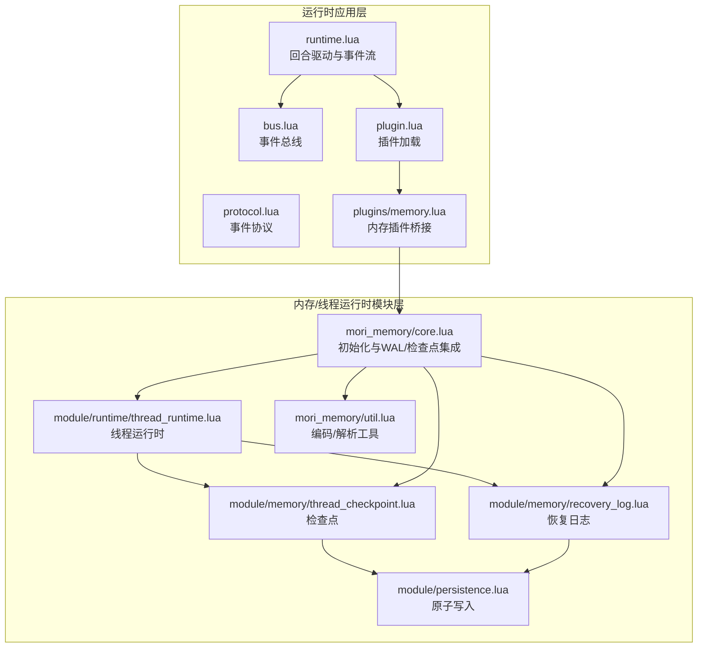
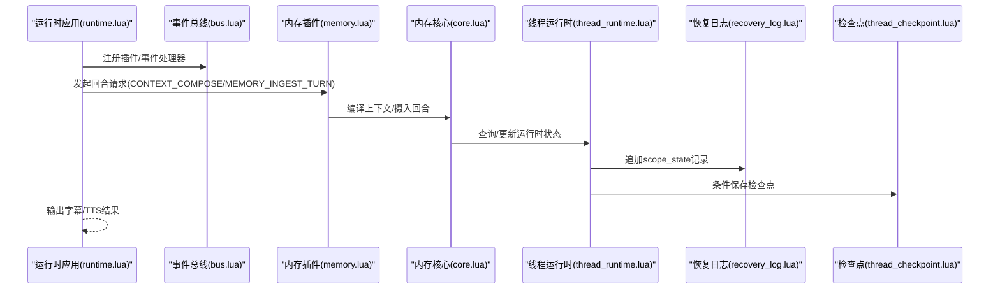
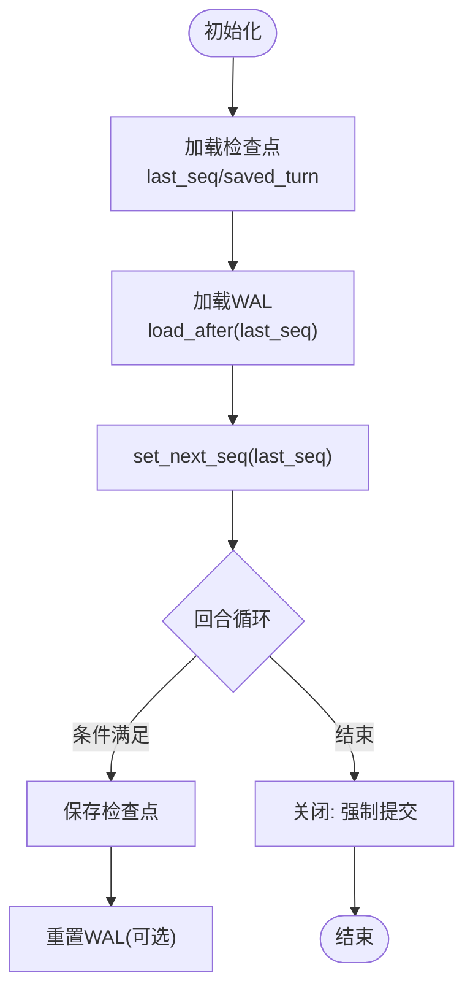
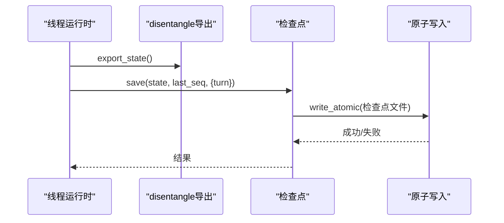
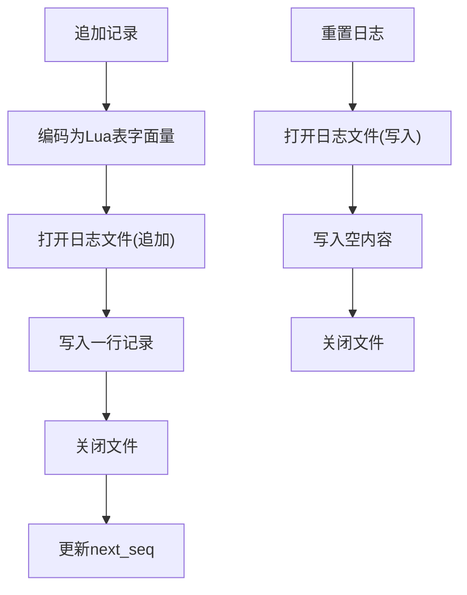
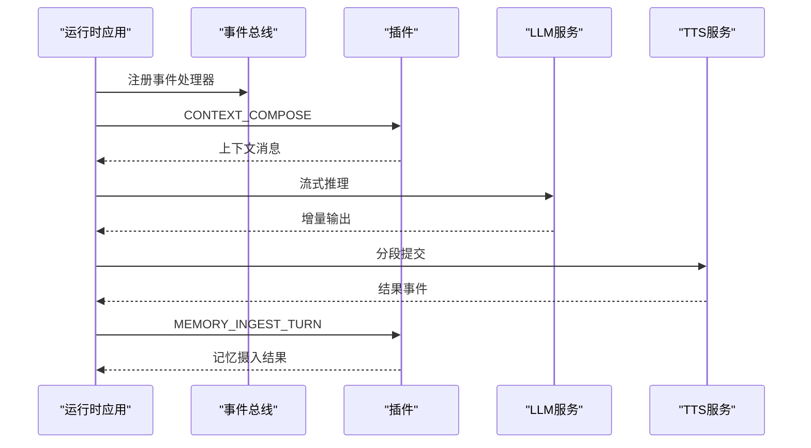
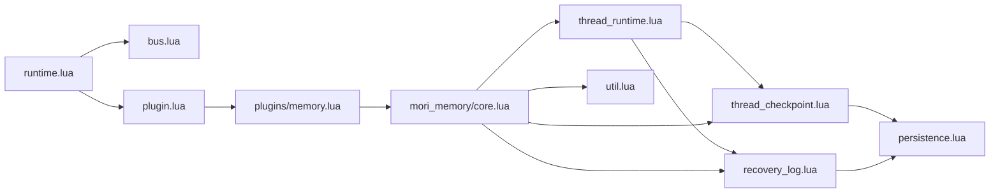

# 线程运行时系统

<cite>
**本文引用的文件**   
- [runtime.lua](file://mori_runtime/lua/mori/app/runtime.lua)
- [bus.lua](file://mori_runtime/lua/mori/core/bus.lua)
- [plugin.lua](file://mori_runtime/lua/mori/core/plugin.lua)
- [protocol.lua](file://mori_runtime/lua/mori/core/protocol.lua)
- [thread_runtime.lua](file://mori_memory/module/runtime/thread_runtime.lua)
- [core.lua](file://mori_memory/mori_memory/core.lua)
- [thread_checkpoint.lua](file://mori_memory/module/memory/thread_checkpoint.lua)
- [recovery_log.lua](file://mori_memory/module/memory/recovery_log.lua)
- [persistence.lua](file://mori_memory/module/persistence.lua)
- [util.lua](file://mori_memory/mori_memory/util.lua)
- [memory.lua](file://mori_runtime/lua/mori/plugins/memory.lua)
</cite>

## 目录
1. [引言](#引言)
2. [项目结构](#项目结构)
3. [核心组件](#核心组件)
4. [架构总览](#架构总览)
5. [详细组件分析](#详细组件分析)
6. [依赖关系分析](#依赖关系分析)
7. [性能考虑](#性能考虑)
8. [故障排查指南](#故障排查指南)
9. [结论](#结论)
10. [附录](#附录)

## 引言
本文件面向Mori线程运行时系统，围绕运行时生命周期管理、检查点机制与恢复日志系统进行深入技术说明。重点解释线程检查点的状态保存时机、数据序列化与内存清理策略；阐述恢复日志的记录格式、持久化策略与故障恢复流程；并提供运行时性能优化、监控与调试方法及常见问题诊断步骤。

## 项目结构
Mori线程运行时由“运行时应用层”和“内存/线程运行时模块层”协同构成：
- 运行时应用层：负责事件总线、插件加载、回合驱动、TTS/LLM集成等。
- 内存/线程运行时模块层：负责线程运行时状态、检查点、恢复日志、原子持久化工具等。

**图表来源**
- [runtime.lua:543-665](file://mori_runtime/lua/mori/app/runtime.lua#L543-L665)
- [bus.lua:1-95](file://mori_runtime/lua/mori/core/bus.lua#L1-L95)
- [plugin.lua:1-52](file://mori_runtime/lua/mori/core/plugin.lua#L1-L52)
- [protocol.lua:1-35](file://mori_runtime/lua/mori/core/protocol.lua#L1-L35)
- [thread_runtime.lua:1-260](file://mori_memory/module/runtime/thread_runtime.lua#L1-L260)
- [core.lua:227-327](file://mori_memory/mori_memory/core.lua#L227-L327)
- [thread_checkpoint.lua:1-76](file://mori_memory/module/memory/thread_checkpoint.lua#L1-L76)
- [recovery_log.lua:1-121](file://mori_memory/module/memory/recovery_log.lua#L1-L121)
- [persistence.lua:1-97](file://mori_memory/module/persistence.lua#L1-L97)
- [util.lua:1-153](file://mori_memory/mori_memory/util.lua#L1-L153)

**章节来源**
- [runtime.lua:543-665](file://mori_runtime/lua/mori/app/runtime.lua#L543-L665)
- [thread_runtime.lua:1-260](file://mori_memory/module/runtime/thread_runtime.lua#L1-L260)
- [core.lua:227-327](file://mori_memory/mori_memory/core.lua#L227-L327)

## 核心组件
- 运行时应用层
  - 事件总线：统一事件注册、广播、调用与错误上报。
  - 插件系统：按约定加载模块，注入bus与上下文。
  - 回合驱动：从inbox拉取意图，逐回合执行LLM推理与TTS输出。
- 线程运行时模块
  - 路由边界管理、pending状态管理、orphan检测与ambient上下文维护。
  - WAL追加、检查点保存、提交时机控制与运行时状态查询。
- 恢复日志与检查点
  - WAL以行分隔的Lua表文本形式存储，支持顺序读取与重置。
  - 检查点以原子方式写入Lua表字面量文件，包含版本、序列号、保存轮次与状态。
- 原子持久化与工具
  - 原子替换与临时文件写入，确保写入过程不可中断。
  - Lua值编码/解析工具，保证日志与检查点的可读性与一致性。

**章节来源**
- [bus.lua:1-95](file://mori_runtime/lua/mori/core/bus.lua#L1-L95)
- [plugin.lua:1-52](file://mori_runtime/lua/mori/core/plugin.lua#L1-L52)
- [runtime.lua:543-665](file://mori_runtime/lua/mori/app/runtime.lua#L543-L665)
- [thread_runtime.lua:1-260](file://mori_memory/module/runtime/thread_runtime.lua#L1-L260)
- [recovery_log.lua:1-121](file://mori_memory/module/memory/recovery_log.lua#L1-L121)
- [thread_checkpoint.lua:1-76](file://mori_memory/module/memory/thread_checkpoint.lua#L1-L76)
- [persistence.lua:1-97](file://mori_memory/module/persistence.lua#L1-L97)
- [util.lua:1-153](file://mori_memory/mori_memory/util.lua#L1-L153)

## 架构总览
线程运行时通过“回合”推进，每回合完成上下文编排、LLM推理、记忆摄入与TTS输出，并在必要时追加WAL与保存检查点。初始化阶段会从检查点与恢复日志中恢复运行时状态，确保崩溃后可连续执行。

**图表来源**
- [runtime.lua:303-541](file://mori_runtime/lua/mori/app/runtime.lua#L303-L541)
- [memory.lua:8-26](file://mori_runtime/lua/mori/plugins/memory.lua#L8-L26)
- [core.lua:227-327](file://mori_memory/mori_memory/core.lua#L227-L327)
- [thread_runtime.lua:174-201](file://mori_memory/module/runtime/thread_runtime.lua#L174-L201)
- [recovery_log.lua:84-110](file://mori_memory/module/memory/recovery_log.lua#L84-L110)
- [thread_checkpoint.lua:60-73](file://mori_memory/module/memory/thread_checkpoint.lua#L60-L73)

## 详细组件分析

### 线程运行时生命周期与状态管理
- 初始化
  - 从检查点加载last_seq与saved_turn，设置WAL next_seq。
  - 从恢复日志中加载大于last_seq的记录，重建运行时状态。
- 运行期
  - 每回合根据配置决定是否保存检查点（间隔轮次）。
  - 在路由、pending、orphan、ambient等环节维护活跃作用域与事务日志。
- 关闭
  - 强制执行一次提交，清空运行时状态。

**图表来源**
- [thread_runtime.lua:221-243](file://mori_memory/module/runtime/thread_runtime.lua#L221-L243)
- [core.lua:227-327](file://mori_memory/mori_memory/core.lua#L227-L327)

**章节来源**
- [thread_runtime.lua:221-243](file://mori_memory/module/runtime/thread_runtime.lua#L221-L243)
- [core.lua:227-327](file://mori_memory/mori_memory/core.lua#L227-L327)

### 线程检查点机制
- 保存时机
  - 当前轮次与上次检查点轮次差达到配置阈值，或显式强制保存。
  - 保存前可选择触发持久化缓冲刷新。
- 数据序列化
  - 使用工具函数将状态表编码为Lua字面量字符串，写入原子文件。
- 内存清理策略
  - 提交成功后可重置WAL，释放历史记录占用空间。

**图表来源**
- [thread_runtime.lua:125-152](file://mori_memory/module/runtime/thread_runtime.lua#L125-L152)
- [thread_checkpoint.lua:60-73](file://mori_memory/module/memory/thread_checkpoint.lua#L60-L73)
- [persistence.lua:58-94](file://mori_memory/module/persistence.lua#L58-L94)

**章节来源**
- [thread_runtime.lua:111-152](file://mori_memory/module/runtime/thread_runtime.lua#L111-L152)
- [thread_checkpoint.lua:60-73](file://mori_memory/module/memory/thread_checkpoint.lua#L60-L73)
- [persistence.lua:58-94](file://mori_memory/module/persistence.lua#L58-L94)

### 恢复日志系统
- 记录格式
  - 每条记录为Lua表字面量，包含序号、轮次、类型(kind)、作用域键、原因与作用域状态。
- 持久化策略
  - 追加写入，自动分配递增序号；重置时以空文件覆盖。
  - 使用原子写入保障落盘安全。
- 故障恢复流程
  - 启动时从检查点获取last_seq，加载后续记录，按序导入作用域状态，更新next_seq。

**图表来源**
- [recovery_log.lua:84-118](file://mori_memory/module/memory/recovery_log.lua#L84-L118)
- [util.lua:59-116](file://mori_memory/mori_memory/util.lua#L59-L116)
- [persistence.lua:58-94](file://mori_memory/module/persistence.lua#L58-L94)

**章节来源**
- [recovery_log.lua:26-121](file://mori_memory/module/memory/recovery_log.lua#L26-L121)
- [util.lua:59-116](file://mori_memory/mori_memory/util.lua#L59-L116)
- [persistence.lua:58-94](file://mori_memory/module/persistence.lua#L58-L94)

### 运行时应用与事件驱动
- 事件总线
  - 支持事件注册、广播、调用与错误回调，屏蔽插件异常。
- 插件加载
  - 按列表加载插件，校验setup接口，上报模块就绪事件。
- 回合驱动
  - 从inbox拉取意图，编排上下文，流式接收LLM增量输出，分段提交TTS，最终进行记忆摄入与输出事件。

**图表来源**
- [runtime.lua:303-541](file://mori_runtime/lua/mori/app/runtime.lua#L303-L541)
- [bus.lua:50-91](file://mori_runtime/lua/mori/core/bus.lua#L50-L91)
- [plugin.lua:13-48](file://mori_runtime/lua/mori/core/plugin.lua#L13-L48)
- [protocol.lua:10-32](file://mori_runtime/lua/mori/core/protocol.lua#L10-L32)

**章节来源**
- [runtime.lua:543-665](file://mori_runtime/lua/mori/app/runtime.lua#L543-L665)
- [bus.lua:1-95](file://mori_runtime/lua/mori/core/bus.lua#L1-L95)
- [plugin.lua:1-52](file://mori_runtime/lua/mori/core/plugin.lua#L1-L52)
- [protocol.lua:1-35](file://mori_runtime/lua/mori/core/protocol.lua#L1-L35)

## 依赖关系分析
- 运行时应用层依赖事件总线与插件系统，通过协议事件与内存模块交互。
- 内存/线程运行时模块依赖配置、工具与原子持久化模块。
- 恢复日志与检查点共享相同的持久化与编码工具，确保一致的数据格式与可靠性。

**图表来源**
- [runtime.lua:543-665](file://mori_runtime/lua/mori/app/runtime.lua#L543-L665)
- [bus.lua:1-95](file://mori_runtime/lua/mori/core/bus.lua#L1-L95)
- [plugin.lua:1-52](file://mori_runtime/lua/mori/core/plugin.lua#L1-L52)
- [memory.lua:1-28](file://mori_runtime/lua/mori/plugins/memory.lua#L1-L28)
- [core.lua:227-327](file://mori_memory/mori_memory/core.lua#L227-L327)
- [thread_runtime.lua:1-260](file://mori_memory/module/runtime/thread_runtime.lua#L1-L260)
- [recovery_log.lua:1-121](file://mori_memory/module/memory/recovery_log.lua#L1-L121)
- [thread_checkpoint.lua:1-76](file://mori_memory/module/memory/thread_checkpoint.lua#L1-L76)
- [persistence.lua:1-97](file://mori_memory/module/persistence.lua#L1-L97)
- [util.lua:1-153](file://mori_memory/mori_memory/util.lua#L1-L153)

**章节来源**
- [core.lua:227-327](file://mori_memory/mori_memory/core.lua#L227-L327)
- [thread_runtime.lua:1-260](file://mori_memory/module/runtime/thread_runtime.lua#L1-L260)

## 性能考虑
- 内存使用控制
  - 定期执行检查点保存，避免长时间累积的WAL导致磁盘与内存压力。
  - 在保存检查点前可触发持久化缓冲刷新，减少后续IO抖动。
- 垃圾回收策略
  - 运行时状态包含活跃作用域与事务日志，建议在长时运行场景中定期清理无用作用域，降低表规模。
- 并发访问优化
  - 恢复日志采用顺序追加与原子写入，避免并发写冲突；若需扩展并发，建议引入外部锁或分片策略。
- 序列化开销
  - Lua表编码/解析为文本格式，便于人类阅读与调试，但可能带来额外CPU开销；可结合压缩或二进制方案评估替代路径。

[本节为通用性能指导，不直接分析具体文件]

## 故障排查指南
- 检查点缺失或损坏
  - 现象：初始化时last_seq归零，或导入状态为空。
  - 排查：确认检查点文件存在且可读；查看最近一次保存时间；核对磁盘空间与权限。
  - 参考
    - [thread_checkpoint.lua:26-58](file://mori_memory/module/memory/thread_checkpoint.lua#L26-L58)
- 恢复日志无法加载
  - 现象：WAL读取失败或记录解析异常。
  - 排查：检查日志文件完整性；确认记录格式为合法Lua表字面量；验证next_seq一致性。
  - 参考
    - [recovery_log.lua:47-82](file://mori_memory/module/memory/recovery_log.lua#L47-L82)
- 事件处理异常
  - 现象：插件setup失败或处理器抛错。
  - 排查：查看BUS_ERROR事件输出；确认插件返回符合约定的setup函数；检查依赖模块可用性。
  - 参考
    - [bus.lua:50-91](file://mori_runtime/lua/mori/core/bus.lua#L50-L91)
    - [plugin.lua:13-48](file://mori_runtime/lua/mori/core/plugin.lua#L13-L48)
- 回合驱动卡顿
  - 现象：LLM流式输出延迟大、TTS队列堆积。
  - 排查：检查LLM/TTS插件负载；调整回合中断策略；观察队列压缩与去重逻辑。
  - 参考
    - [runtime.lua:582-650](file://mori_runtime/lua/mori/app/runtime.lua#L582-L650)

**章节来源**
- [thread_checkpoint.lua:26-58](file://mori_memory/module/memory/thread_checkpoint.lua#L26-L58)
- [recovery_log.lua:47-82](file://mori_memory/module/memory/recovery_log.lua#L47-L82)
- [bus.lua:50-91](file://mori_runtime/lua/mori/core/bus.lua#L50-L91)
- [plugin.lua:13-48](file://mori_runtime/lua/mori/core/plugin.lua#L13-L48)
- [runtime.lua:582-650](file://mori_runtime/lua/mori/app/runtime.lua#L582-L650)

## 结论
Mori线程运行时通过“回合驱动+事件总线+线程运行时模块”的组合，实现了可恢复、可观测、可扩展的多模态交互系统。检查点与恢复日志共同保障了崩溃后的连续性；原子持久化与Lua表序列化提供了简单可靠的持久化方案。建议在生产环境中结合监控指标与告警策略，持续优化检查点频率、WAL清理与内存占用，以获得更稳定的运行表现。

[本节为总结性内容，不直接分析具体文件]

## 附录
- 配置要点
  - 线程运行时根目录：disentangle.runtime.root
  - 检查点间隔轮次：disentangle.runtime.checkpoint_interval_turns
  - 存储路径：storage.snapshot_path
- 关键事件
  - CONTEXT_COMPOSE/MEMORY_INGEST_TURN/MEMORY_SHUTDOWN
  - LLM_STREAM/TTS_SUBMIT/TTS_DRAIN
  - OUTPUT_SUBTITLE/OUTPUT_EVENT/OUTPUT_PRINT

[本节为概览性内容，不直接分析具体文件]