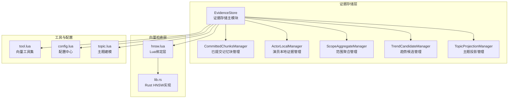
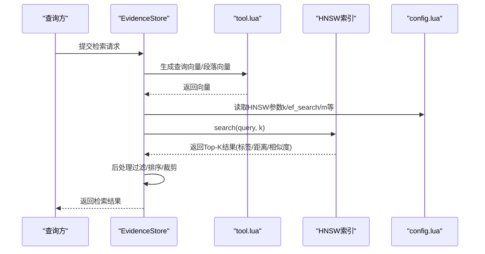
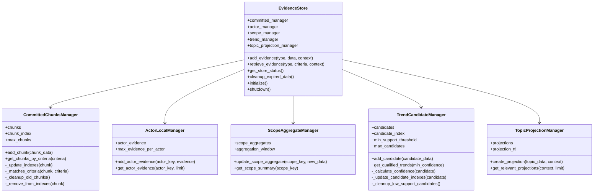
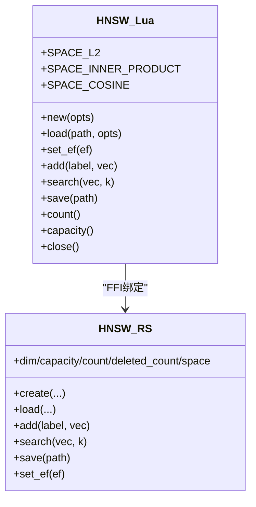
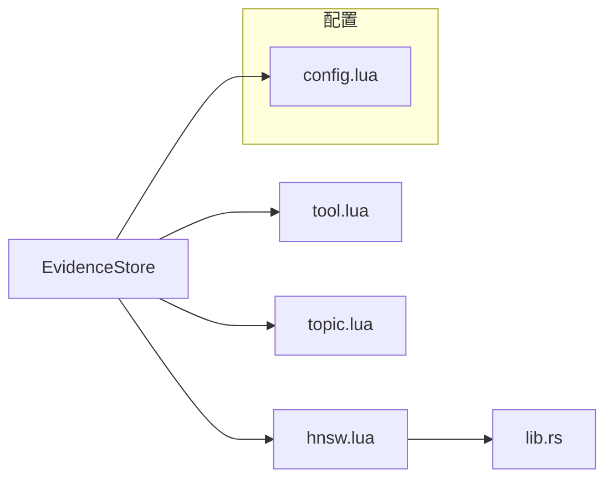

# 记忆检索系统

<cite>
**本文档引用的文件**
- [evidence_store.lua](file://mori_memory/module/evidence/evidence_store.lua)
- [hnsw.lua](file://mori_memory/module/hnsw.lua)
- [lib.rs](file://mori_memory/native/hnsw/rust/src/lib.rs)
- [config.lua](file://mori_memory/module/config.lua)
- [tool.lua](file://mori_memory/module/tool.lua)
- [topic.lua](file://mori_memory/module/memory/topic.lua)
- [init.lua](file://mori_memory/module/evidence/init.lua)
</cite>

## 目录
1. [简介](#简介)
2. [项目结构](#项目结构)
3. [核心组件](#核心组件)
4. [架构总览](#架构总览)
5. [详细组件分析](#详细组件分析)
6. [依赖关系分析](#依赖关系分析)
7. [性能考量](#性能考量)
8. [故障排查指南](#故障排查指南)
9. [结论](#结论)
10. [附录](#附录)

## 简介
本文件面向Mori记忆检索系统，聚焦证据存储（EvidenceStore）与HNSW向量检索子系统，系统性阐述以下内容：
- 证据存储（EvidenceStore）的实现原理：已提交记忆块、演员本地证据、范围聚合、趋势候选、主题投影等子模块的职责与交互。
- 向量索引构建与相似度计算：Cosine、L2、内积空间的定义与映射，以及相似度换算策略。
- HNSW算法应用：索引构建参数、搜索性能优化、内存使用控制与持久化。
- 检索系统整体架构：查询预处理、向量生成、索引查询、结果后处理的完整流程。
- 性能调优指南：索引规模控制、查询速度优化、内存使用优化等实用建议。

## 项目结构
围绕记忆检索的关键目录与文件如下：
- evidence_store.lua：证据存储主模块，统一管理多种证据类型与检索接口。
- hnsw.lua：Lua绑定层，封装底层Rust实现的HNSW索引能力。
- lib.rs：Rust实现的HNSW索引，支持Cosine/L2/内积空间，提供构建、搜索、持久化等能力。
- config.lua：检索与记忆系统的核心配置，包含HNSW参数、主题检索参数等。
- tool.lua：向量工具集，提供嵌入生成、相似度计算、序列化/反序列化等。
- topic.lua：主题建模与摘要，为检索提供语义锚点与上下文匹配。
- evidence/init.lua：证据模块入口，导出证据存储实例。

图表来源
- [evidence_store.lua:490-603](file://mori_memory/module/evidence/evidence_store.lua#L490-L603)
- [hnsw.lua:108-310](file://mori_memory/module/hnsw.lua#L108-L310)
- [lib.rs:23-61](file://mori_memory/native/hnsw/rust/src/lib.rs#L23-L61)
- [config.lua:133-140](file://mori_memory/module/config.lua#L133-L140)
- [tool.lua:174-270](file://mori_memory/module/tool.lua#L174-L270)
- [topic.lua:49-59](file://mori_memory/module/memory/topic.lua#L49-L59)

章节来源
- [evidence_store.lua:1-603](file://mori_memory/module/evidence/evidence_store.lua#L1-L603)
- [hnsw.lua:1-310](file://mori_memory/module/hnsw.lua#L1-L310)
- [lib.rs:1-592](file://mori_memory/native/hnsw/rust/src/lib.rs#L1-L592)
- [config.lua:1-680](file://mori_memory/module/config.lua#L1-L680)
- [tool.lua:1-800](file://mori_memory/module/tool.lua#L1-L800)
- [topic.lua:1-800](file://mori_memory/module/memory/topic.lua#L1-L800)
- [init.lua:1-10](file://mori_memory/module/evidence/init.lua#L1-L10)

## 核心组件
本节聚焦证据存储与向量检索两大核心子系统。

- 证据存储（EvidenceStore）
  - 已提交记忆块（CommittedChunksManager）：维护按时间/演员/范围索引的记忆块集合，支持按条件检索与相关性排序。
  - 演员本地证据（ActorLocalManager）：按演员键维护最近证据列表，受上限约束。
  - 范围聚合（ScopeAggregateManager）：按作用域统计演员活动、主题分布、交互模式等。
  - 趋势候选（TrendCandidateManager）：维护模式支持度、演员参与、置信度计算与索引，支持资格筛选与排序。
  - 主题投影（TopicProjectionManager）：基于主题数据与上下文创建证据投影，计算相关性与新鲜度，支持按相关性检索。
  - 统一接口：add_evidence与retrieve_evidence，覆盖多种证据类型与查询场景。

- 向量检索（HNSW）
  - 空间定义：支持L2、内积、余弦三种距离/相似度空间，底层Rust实现统一抽象。
  - 参数化索引：维度、最大元素数、每层边数m、构建时扩展宽度ef_construction、随机种子、替换删除标记等。
  - 搜索优化：ef_search动态设置，搜索时根据k自动提升至合适值，保证召回质量。
  - 持久化：支持保存与加载索引文件，路径解析与校验。
  - 错误处理：全局错误与索引级错误分离，便于定位问题。

章节来源
- [evidence_store.lua:26-589](file://mori_memory/module/evidence/evidence_store.lua#L26-L589)
- [hnsw.lua:54-310](file://mori_memory/module/hnsw.lua#L54-L310)
- [lib.rs:9-32](file://mori_memory/native/hnsw/rust/src/lib.rs#L9-L32)
- [lib.rs:243-554](file://mori_memory/native/hnsw/rust/src/lib.rs#L243-L554)

## 架构总览
检索系统整体流程如下：
- 查询预处理：文本清洗、向量化（工具层），必要时进行主题摘要与上下文增强。
- 向量生成：通过工具层调用Python嵌入管线生成查询向量或段落向量。
- 索引查询：将查询向量送入HNSW索引，按ef_search策略搜索Top-K近邻。
- 结果后处理：根据配置与上下文进行相关性打分、过滤、排序与裁剪。

图表来源
- [evidence_store.lua:540-563](file://mori_memory/module/evidence/evidence_store.lua#L540-L563)
- [tool.lua:174-270](file://mori_memory/module/tool.lua#L174-L270)
- [hnsw.lua:288-307](file://mori_memory/module/hnsw.lua#L288-L307)
- [config.lua:133-140](file://mori_memory/module/config.lua#L133-L140)

## 详细组件分析

### 证据存储（EvidenceStore）组件
EvidenceStore采用组合式设计，将不同证据类型的管理器聚合为统一接口，支持多维检索与投影。

图表来源
- [evidence_store.lua:26-589](file://mori_memory/module/evidence/evidence_store.lua#L26-L589)

章节来源
- [evidence_store.lua:26-589](file://mori_memory/module/evidence/evidence_store.lua#L26-L589)

### HNSW向量检索组件
HNSW在Lua层提供简洁的API，在Rust层实现高性能索引构建与搜索，并支持多种距离空间。

图表来源
- [hnsw.lua:54-310](file://mori_memory/module/hnsw.lua#L54-L310)
- [lib.rs:23-61](file://mori_memory/native/hnsw/rust/src/lib.rs#L23-L61)

章节来源
- [hnsw.lua:1-310](file://mori_memory/module/hnsw.lua#L1-L310)
- [lib.rs:1-592](file://mori_memory/native/hnsw/rust/src/lib.rs#L1-L592)

### 相似度计算与空间映射
- 空间枚举：L2（欧氏距离）、内积（最大内积）、余弦（余弦距离）。
- 相似度换算：根据空间类型将底层距离映射为相似度，确保排序一致性。
- Cosine空间：支持向量归一化，提高语义检索稳定性。

章节来源
- [hnsw.lua:6-52](file://mori_memory/module/hnsw.lua#L6-L52)
- [lib.rs:9-31](file://mori_memory/native/hnsw/rust/src/lib.rs#L9-L31)
- [lib.rs:193-211](file://mori_memory/native/hnsw/rust/src/lib.rs#L193-L211)

### 检索流程与后处理
- 查询预处理：文本清洗、向量化（工具层），必要时结合主题摘要与上下文。
- 向量生成：工具层封装嵌入生成接口，支持批量与单条向量生成。
- 索引查询：Lua层将查询向量传递给Rust实现，按ef_search策略搜索Top-K。
- 结果后处理：EvidenceStore根据上下文与证据类型进行二次过滤、排序与裁剪。

章节来源
- [tool.lua:174-270](file://mori_memory/module/tool.lua#L174-L270)
- [hnsw.lua:288-307](file://mori_memory/module/hnsw.lua#L288-L307)
- [evidence_store.lua:540-563](file://mori_memory/module/evidence/evidence_store.lua#L540-L563)

## 依赖关系分析
- EvidenceStore依赖工具层进行向量生成与相似度计算，依赖配置中心读取HNSW参数，依赖主题模块提供上下文信息。
- HNSW Lua绑定依赖Rust实现，通过FFI调用，具备错误处理与资源管理。
- 配置中心集中管理检索参数（如k、m、ef_construction、ef_search、max_elements等）。

图表来源
- [evidence_store.lua:540-563](file://mori_memory/module/evidence/evidence_store.lua#L540-L563)
- [hnsw.lua:108-194](file://mori_memory/module/hnsw.lua#L108-L194)
- [lib.rs:243-374](file://mori_memory/native/hnsw/rust/src/lib.rs#L243-L374)
- [config.lua:133-140](file://mori_memory/module/config.lua#L133-L140)

章节来源
- [evidence_store.lua:1-603](file://mori_memory/module/evidence/evidence_store.lua#L1-L603)
- [hnsw.lua:1-310](file://mori_memory/module/hnsw.lua#L1-L310)
- [lib.rs:1-592](file://mori_memory/native/hnsw/rust/src/lib.rs#L1-L592)
- [config.lua:1-680](file://mori_memory/module/config.lua#L1-L680)

## 性能考量
- 索引规模控制
  - 控制max_elements与m参数，避免索引容量过大导致内存压力与构建开销上升。
  - 使用aggregation_window与ttl策略限制聚合与投影的生命周期，降低内存占用。
- 查询速度优化
  - 合理设置ef_search，使其不低于k且不超过合理上限，以平衡召回与速度。
  - 使用k参数限制返回结果数量，减少后续排序与裁剪成本。
- 内存使用优化
  - 利用清理策略（如过期数据清理、候选趋势上限、演员证据上限）控制驻留数据规模。
  - 对Cosine空间启用向量归一化，有助于稳定相似度计算与减少数值误差。

## 故障排查指南
- HNSW模块不可用
  - 现象：提示native模块不可用或加载失败。
  - 排查：确认构建脚本已执行，so文件存在且路径正确；检查Lua路径解析逻辑。
- 索引操作失败
  - 现象：add/save/load/set_ef等返回错误。
  - 排查：检查向量维度与索引维度一致性；确认ef必须大于0；查看全局错误与索引级错误信息。
- 相似度异常
  - 现象：Cosine相似度为负或异常高/低。
  - 排查：确认Cosine空间已启用归一化；检查向量合法性与维度匹配。

章节来源
- [hnsw.lua:81-103](file://mori_memory/module/hnsw.lua#L81-L103)
- [hnsw.lua:111-130](file://mori_memory/module/hnsw.lua#L111-L130)
- [lib.rs:44-75](file://mori_memory/native/hnsw/rust/src/lib.rs#L44-L75)

## 结论
Mori记忆检索系统通过EvidenceStore统一管理多源证据，并结合HNSW向量检索实现高效、可扩展的相似度检索。配置中心提供灵活的参数化控制，工具层保障向量生成与相似度计算的稳定性。通过合理的参数调优与内存控制策略，可在召回质量与性能之间取得良好平衡。

## 附录
- 配置要点（HNSW相关）
  - enabled/k/m/ef_construction/ef_search/max_elements：控制索引构建与搜索行为。
  - topic_hnsw.enabled/k/m/ef_construction/ef_search/max_elements：主题检索专用参数。
- 常用流程
  - 构建索引：new(opts) → add(label, vec) × N → save(path)
  - 加载索引：load(path, opts) → set_ef(ef) → search(vec, k)
  - 证据检索：add_evidence → retrieve_evidence → 后处理

章节来源
- [config.lua:133-140](file://mori_memory/module/config.lua#L133-L140)
- [hnsw.lua:171-217](file://mori_memory/module/hnsw.lua#L171-L217)
- [evidence_store.lua:508-563](file://mori_memory/module/evidence/evidence_store.lua#L508-L563)