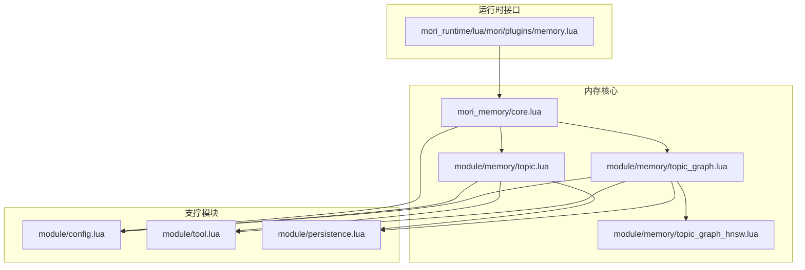
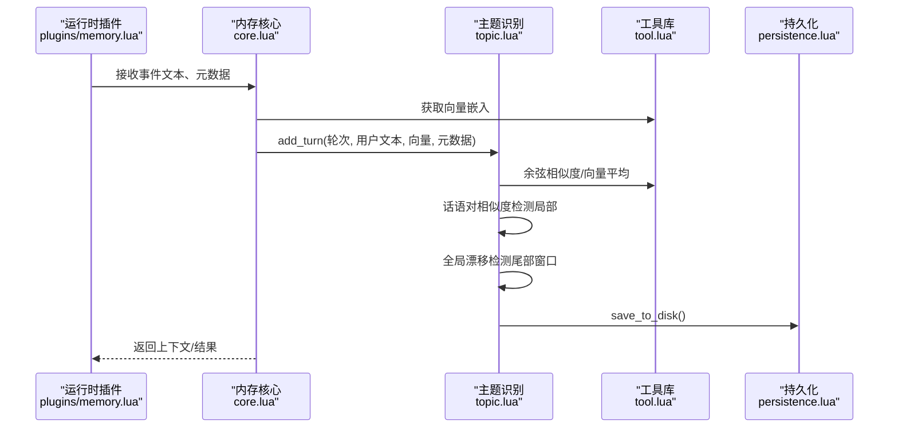
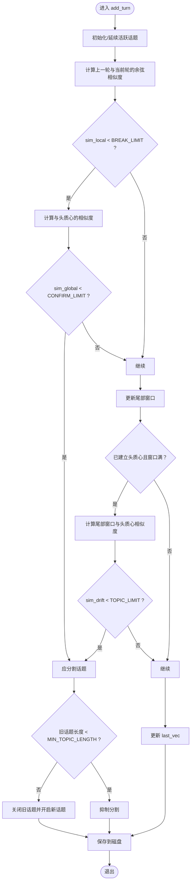
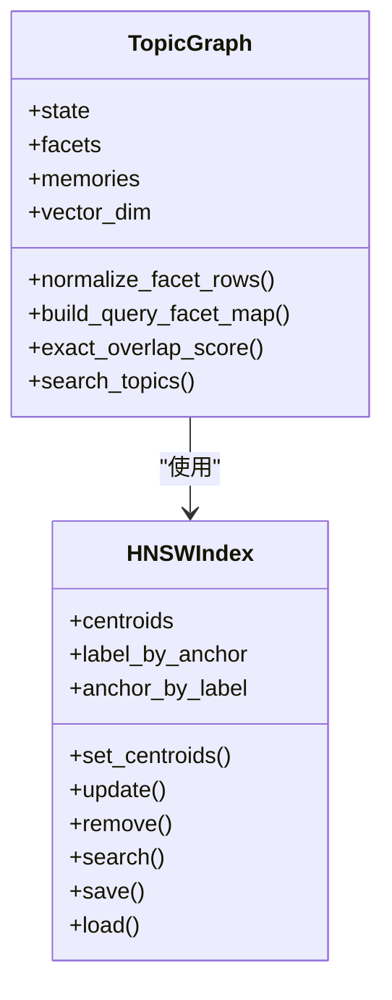
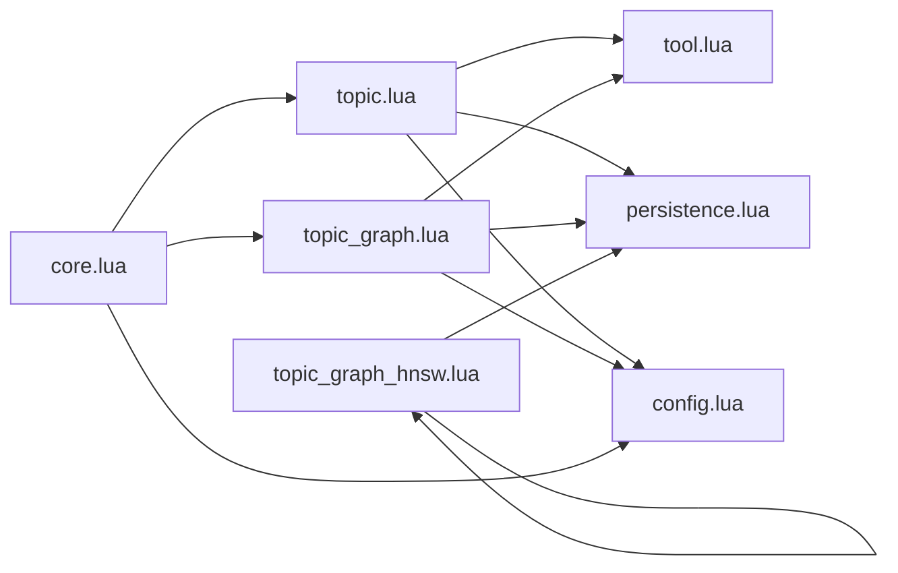

# 主题记忆（Topic Memory）

<cite>
**本文引用的文件**
- [mori_memory/module/memory/topic.lua](file://mori_memory/module/memory/topic.lua)
- [mori_memory/module/memory/topic_graph.lua](file://mori_memory/module/memory/topic_graph.lua)
- [mori_memory/module/memory/topic_graph_hnsw.lua](file://mori_memory/module/memory/topic_graph_hnsw.lua)
- [mori_memory/module/config.lua](file://mori_memory/module/config.lua)
- [mori_memory/module/tool.lua](file://mori_memory/module/tool.lua)
- [mori_memory/module/persistence.lua](file://mori_memory/module/persistence.lua)
- [mori_runtime/lua/mori/plugins/memory.lua](file://mori_runtime/lua/mori/plugins/memory.lua)
- [test_memory_limits.lua](file://test_memory_limits.lua)
</cite>

## 目录
1. [简介](#简介)
2. [项目结构](#项目结构)
3. [核心组件](#核心组件)
4. [架构总览](#架构总览)
5. [详细组件分析](#详细组件分析)
6. [依赖关系分析](#依赖关系分析)
7. [性能考量](#性能考量)
8. [故障排除指南](#故障排除指南)
9. [结论](#结论)
10. [附录](#附录)

## 简介
本文件面向Mori主题记忆系统，聚焦“基于向量聚类的对话主题识别、话语对相似度检测、话题边界分割机制”。文档深入解释头质心（head_centroid）与尾部窗口（tail_window）的设计动机与实现方式，阐明BREAK_LIMIT与CONFIRM_LIMIT等关键阈值在话题边界检测中的作用，并系统梳理主题记忆的二进制存储格式、版本管理与持久化机制。同时提供配置参数说明、性能优化策略与故障排除方法，并给出使用示例与最佳实践。

## 项目结构
主题记忆位于mori_memory子系统中，围绕“核心主题识别模块”“图谱检索模块”“向量索引模块”“工具与持久化模块”展开。运行时通过插件桥接到mori_runtime，接收输入并输出上下文。

图表来源
- [mori_runtime/lua/mori/plugins/memory.lua:1-30](file://mori_runtime/lua/mori/plugins/memory.lua#L1-L30)
- [mori_memory/module/memory/topic.lua:1-1116](file://mori_memory/module/memory/topic.lua#L1-L1116)
- [mori_memory/module/memory/topic_graph.lua:1-800](file://mori_memory/module/memory/topic_graph.lua#L1-L800)
- [mori_memory/module/memory/topic_graph_hnsw.lua:1-267](file://mori_memory/module/memory/topic_graph_hnsw.lua#L1-L267)
- [mori_memory/module/config.lua:1-680](file://mori_memory/module/config.lua#L1-L680)
- [mori_memory/module/tool.lua:1-800](file://mori_memory/module/tool.lua#L1-L800)
- [mori_memory/module/persistence.lua:1-97](file://mori_memory/module/persistence.lua#L1-L97)

章节来源
- [mori_runtime/lua/mori/plugins/memory.lua:1-30](file://mori_runtime/lua/mori/plugins/memory.lua#L1-L30)
- [mori_memory/module/memory/topic.lua:1-1116](file://mori_memory/module/memory/topic.lua#L1-L1116)
- [mori_memory/module/memory/topic_graph.lua:1-800](file://mori_memory/module/memory/topic_graph.lua#L1-L800)
- [mori_memory/module/memory/topic_graph_hnsw.lua:1-267](file://mori_memory/module/memory/topic_graph_hnsw.lua#L1-L267)
- [mori_memory/module/config.lua:1-680](file://mori_memory/module/config.lua#L1-L680)
- [mori_memory/module/tool.lua:1-800](file://mori_memory/module/tool.lua#L1-L800)
- [mori_memory/module/persistence.lua:1-97](file://mori_memory/module/persistence.lua#L1-L97)

## 核心组件
- 主题识别模块（topic.lua）：负责向量缓存、活跃话题状态维护、头质心与尾部窗口构建、话语对相似度检测、话题边界分割、摘要生成与缓存、二进制持久化。
- 图谱检索模块（topic_graph.lua）：负责主题图谱的向量化、词槽提取、精确匹配、反馈权重、运行时状态管理、持久化与加载。
- HNSW索引模块（topic_graph_hnsw.lua）：提供基于余弦空间的近似最近邻索引，支持质心集的增量更新与查询。
- 工具与配置（tool.lua、config.lua）：提供向量校验、相似度计算、二进制编解码、路径解析与默认配置。
- 持久化（persistence.lua）：提供原子写入与替换，保障主题记忆文件的强一致性。

章节来源
- [mori_memory/module/memory/topic.lua:1-1116](file://mori_memory/module/memory/topic.lua#L1-L1116)
- [mori_memory/module/memory/topic_graph.lua:1-800](file://mori_memory/module/memory/topic_graph.lua#L1-L800)
- [mori_memory/module/memory/topic_graph_hnsw.lua:1-267](file://mori_memory/module/memory/topic_graph_hnsw.lua#L1-L267)
- [mori_memory/module/tool.lua:1-800](file://mori_memory/module/tool.lua#L1-L800)
- [mori_memory/module/config.lua:1-680](file://mori_memory/module/config.lua#L1-L680)
- [mori_memory/module/persistence.lua:1-97](file://mori_memory/module/persistence.lua#L1-L97)

## 架构总览
主题记忆由“输入处理—向量计算—主题识别—摘要与持久化—检索与反馈”构成闭环。运行时通过插件将事件注入内存核心，核心调用主题识别模块进行话题边界检测与摘要生成，并通过图谱模块进行主题检索与权重反馈。

图表来源
- [mori_runtime/lua/mori/plugins/memory.lua:1-30](file://mori_runtime/lua/mori/plugins/memory.lua#L1-L30)
- [mori_memory/module/memory/topic.lua:659-794](file://mori_memory/module/memory/topic.lua#L659-L794)
- [mori_memory/module/tool.lua:500-725](file://mori_memory/module/tool.lua#L500-L725)
- [mori_memory/module/persistence.lua:56-94](file://mori_memory/module/persistence.lua#L56-L94)

## 详细组件分析

### 主题识别与边界分割（topic.lua）
- 核心状态
  - 活跃话题：包含起始轮次、头质心（head_centroid）、累积向量（用于整体质心）、尾部滑动窗口（tail_window）、上一轮向量（last_vec）、摘要缓存等。
  - 历史话题：按轮次区间记录摘要与整体质心。
- 关键阈值
  - BREAK_LIMIT：话语对相似度阈值，低于此值触发“断裂”检测。
  - CONFIRM_LIMIT：与头质心的相似度阈值，用于确认“断裂”是否真实跨话题。
  - TOPIC_LIMIT：尾部窗口与头质心的相似度阈值，用于全局漂移兜底。
  - MIN_TOPIC_LENGTH：最小话题长度，防止短片段被分割。
- 边界检测流程
  - 局部断裂检测：当前轮与上一轮的余弦相似度低于BREAK_LIMIT，且与头质心相似度低于CONFIRM_LIMIT时，判定为话题边界。
  - 全局漂移检测：当尾部窗口与头质心相似度低于TOPIC_LIMIT时，判定为长期漂移，触发边界。
  - 最小长度约束：若即将分割导致旧话题长度小于MIN_TOPIC_LENGTH，则抑制分割。
- 头质心与尾部窗口
  - 头质心：在累积向量达到MAKE_CLUSTER1时，取前MAKE_CLUSTER1个向量的平均得到。
  - 尾部窗口：滑动窗口大小为MAKE_CLUSTER2，维持近期向量，用于全局漂移检测。
- 摘要与分级摘要
  - 支持full/slight/heavy/none四种摘要变体，按配置压缩比例生成。
  - 活跃话题与历史话题均支持摘要缓存，避免重复LLM调用。
- 持久化
  - 二进制文件magic为“TOPC”，版本号为3。
  - 头部包含版本、历史话题数量、活跃话题起始轮、最后处理轮、活跃标志位。
  - 活跃状态位掩码：HEAD/TAIL/LAST分别指示头质心、尾部向量、last_vec是否存在。
  - 记录格式包含起始轮、结束轮、摘要文本、整体质心、摘要变体。

图表来源
- [mori_memory/module/memory/topic.lua:659-794](file://mori_memory/module/memory/topic.lua#L659-L794)
- [mori_memory/module/memory/topic.lua:303-464](file://mori_memory/module/memory/topic.lua#L303-L464)

章节来源
- [mori_memory/module/memory/topic.lua:11-38](file://mori_memory/module/memory/topic.lua#L11-L38)
- [mori_memory/module/memory/topic.lua:48-59](file://mori_memory/module/memory/topic.lua#L48-L59)
- [mori_memory/module/memory/topic.lua:695-780](file://mori_memory/module/memory/topic.lua#L695-L780)
- [mori_memory/module/memory/topic.lua:303-464](file://mori_memory/module/memory/topic.lua#L303-L464)

### 图谱检索与主题索引（topic_graph.lua、topic_graph_hnsw.lua）
- 主题图谱
  - 维度自适应：首次遇到向量时记录维度，后续校验维度一致性。
  - 词槽提取：对文本提取facet权重，限制槽位数量，用于主题检索的语义覆盖。
  - 精确匹配：支持硬词项（如带等号/数字/事实ID）的精确重叠评分与惩罚。
  - 反馈权重：区分快/慢先验，结合读时融合权重与主题局部先验提示。
- HNSW索引
  - 余弦空间索引，支持增量更新与持久化。
  - 提供标签映射与元信息保存，便于重启后重建索引。
- 运行时状态
  - 流式运行时状态按流键隔离，支持TTL与容量控制，定期清理。

图表来源
- [mori_memory/module/memory/topic_graph.lua:1-800](file://mori_memory/module/memory/topic_graph.lua#L1-L800)
- [mori_memory/module/memory/topic_graph_hnsw.lua:1-267](file://mori_memory/module/memory/topic_graph_hnsw.lua#L1-L267)

章节来源
- [mori_memory/module/memory/topic_graph.lua:15-800](file://mori_memory/module/memory/topic_graph.lua#L15-L800)
- [mori_memory/module/memory/topic_graph_hnsw.lua:32-177](file://mori_memory/module/memory/topic_graph_hnsw.lua#L32-L177)

### 工具与配置（tool.lua、config.lua）
- 向量工具
  - 向量维度校验、平均向量、余弦相似度（SIMD加速）、向量与二进制互转。
- 配置
  - 主题识别：make_cluster1/make_cluster2/break_limit/confirm_limit/topic_limit/min_topic_length/摘要相关参数。
  - 图谱检索：存储根目录、候选主题数、桥接权重、衰减因子、反馈权重等。
  - 安全与隔离：多源隔离开关、锚点前缀、信用阈值等。

章节来源
- [mori_memory/module/tool.lua:143-725](file://mori_memory/module/tool.lua#L143-L725)
- [mori_memory/module/config.lua:147-166](file://mori_memory/module/config.lua#L147-L166)
- [mori_memory/module/config.lua:27-145](file://mori_memory/module/config.lua#L27-L145)

### 持久化与版本管理（persistence.lua、topic.lua）
- 原子写入
  - 使用临时文件+原子替换，确保写入过程中的数据一致性。
- 主题二进制格式
  - magic: “TOPC”，版本：3
  - 头部：版本号、历史话题数、活跃话题起始轮、最后处理轮、活跃标志位
  - 活跃状态：头质心/尾部向量/last_vec（按标志位存在性写入）
  - 记录：每个历史话题的起止轮、摘要、整体质心、摘要变体
  - 加载时校验版本，不兼容版本直接跳过加载并打印提示

章节来源
- [mori_memory/module/persistence.lua:25-94](file://mori_memory/module/persistence.lua#L25-L94)
- [mori_memory/module/memory/topic.lua:303-464](file://mori_memory/module/memory/topic.lua#L303-L464)

## 依赖关系分析
- 主题识别模块依赖工具库进行向量运算与二进制编解码，依赖持久化模块进行原子写入，依赖配置模块读取阈值与摘要参数。
- 图谱模块依赖工具库进行向量归一化与相似度计算，依赖持久化模块进行状态与索引的保存/加载。
- 运行时插件桥接内存核心，内存核心在初始化时加载历史、主题、图谱、任务状态等模块。

图表来源
- [mori_memory/module/memory/topic.lua:1-1116](file://mori_memory/module/memory/topic.lua#L1-L1116)
- [mori_memory/module/memory/topic_graph.lua:1-800](file://mori_memory/module/memory/topic_graph.lua#L1-L800)
- [mori_memory/module/memory/topic_graph_hnsw.lua:1-267](file://mori_memory/module/memory/topic_graph_hnsw.lua#L1-L267)
- [mori_memory/module/tool.lua:1-800](file://mori_memory/module/tool.lua#L1-L800)
- [mori_memory/module/persistence.lua:1-97](file://mori_memory/module/persistence.lua#L1-L97)
- [mori_memory/module/config.lua:1-680](file://mori_memory/module/config.lua#L1-L680)

章节来源
- [mori_memory/module/memory/topic.lua:1-1116](file://mori_memory/module/memory/topic.lua#L1-L1116)
- [mori_memory/module/memory/topic_graph.lua:1-800](file://mori_memory/module/memory/topic_graph.lua#L1-L800)
- [mori_memory/module/memory/topic_graph_hnsw.lua:1-267](file://mori_memory/module/memory/topic_graph_hnsw.lua#L1-L267)
- [mori_memory/module/tool.lua:1-800](file://mori_memory/module/tool.lua#L1-L800)
- [mori_memory/module/persistence.lua:1-97](file://mori_memory/module/persistence.lua#L1-L97)
- [mori_memory/module/config.lua:1-680](file://mori_memory/module/config.lua#L1-L680)

## 性能考量
- 向量相似度计算
  - 使用SIMD加速的余弦相似度与点积，减少CPU开销；在无SIMD环境退化为纯Lua实现。
- 二进制存储
  - 向量以float（4字节）紧凑存储，显著降低IO与磁盘占用。
- 索引检索
  - HNSW在余弦空间提供高效近邻检索，支持增量更新与持久化，适合大规模主题检索。
- 运行时GC与压力控制
  - disentangle模块提供内存上限、GC触发策略、TTL设置与状态版本控制，保障系统稳定性。

章节来源
- [mori_memory/module/tool.lua:44-725](file://mori_memory/module/tool.lua#L44-L725)
- [mori_memory/module/memory/topic_graph_hnsw.lua:102-177](file://mori_memory/module/memory/topic_graph_hnsw.lua#L102-L177)
- [mori_memory/module/config.lua:224-496](file://mori_memory/module/config.lua#L224-L496)
- [test_memory_limits.lua:1-63](file://test_memory_limits.lua#L1-L63)

## 故障排除指南
- 主题二进制损坏
  - 症状：加载失败或提示损坏字段。
  - 处理：检查磁盘空间与权限；确认版本兼容（仅支持v3）；必要时删除损坏文件以重新生成。
- 向量维度不匹配
  - 症状：add_turn报错“维度不匹配”。
  - 处理：确保嵌入模型输出维度与图谱模块记录的维度一致；首次遇到向量时会自动记录维度。
- 摘要生成失败
  - 症状：按需摘要生成失败并打印警告。
  - 处理：检查LLM服务可用性；确认allow_llm_summary配置；必要时禁用按需摘要。
- 运行时不稳定
  - 症状：内存占用过高或GC频繁触发。
  - 处理：调整disentangle内存上限、GC触发阈值与TTL设置；启用状态版本控制以避免不一致。

章节来源
- [mori_memory/module/memory/topic.lua:373-464](file://mori_memory/module/memory/topic.lua#L373-L464)
- [mori_memory/module/tool.lua:160-170](file://mori_memory/module/tool.lua#L160-L170)
- [mori_memory/module/config.lua:224-496](file://mori_memory/module/config.lua#L224-L496)
- [test_memory_limits.lua:1-63](file://test_memory_limits.lua#L1-L63)

## 结论
主题记忆通过“头质心+尾部窗口”的双层阈值设计，实现了对对话主题的稳健识别与边界分割；结合分级摘要与原子持久化，兼顾了准确性与可靠性。图谱检索与HNSW索引进一步提升了主题检索效率。配合安全隔离、内存上限与版本控制，系统在复杂多源场景下具备良好的鲁棒性与可维护性。

## 附录

### 配置参数说明（主题识别）
- make_cluster1：建立头质心所需的轮次数
- make_cluster2：尾部窗口大小
- topic_limit：全局漂移阈值
- break_limit：话语对断裂阈值
- confirm_limit：确认跨话题阈值
- min_topic_length：最小话题长度
- summary_max_tokens：摘要最大token数
- allow_llm_summary：是否允许按需摘要
- summary_variant_weights：摘要变体权重
- summary_compress_ratio_slight/heavy：摘要压缩比例

章节来源
- [mori_memory/module/config.lua:147-166](file://mori_memory/module/config.lua#L147-L166)
- [mori_memory/module/memory/topic.lua:11-38](file://mori_memory/module/memory/topic.lua#L11-L38)

### 使用示例与最佳实践
- 输入事件
  - 通过运行时插件注入事件，确保元数据包含scope_key等标识，以便多源隔离。
- 阈值调优
  - BREAK_LIMIT与CONFIRM_LIMIT共同决定话题边界敏感度；TOPIC_LIMIT用于抑制长期漂移。
- 摘要策略
  - 生产环境建议禁用按需摘要或限制调用频率；利用摘要变体满足不同上下文需求。
- 稳定性保障
  - 启用disentangle内存上限与GC控制；定期检查主题二进制文件完整性；使用版本控制避免状态不一致。

章节来源
- [mori_runtime/lua/mori/plugins/memory.lua:1-30](file://mori_runtime/lua/mori/plugins/memory.lua#L1-L30)
- [mori_memory/module/config.lua:224-496](file://mori_memory/module/config.lua#L224-L496)
- [mori_memory/module/memory/topic.lua:102-160](file://mori_memory/module/memory/topic.lua#L102-L160)