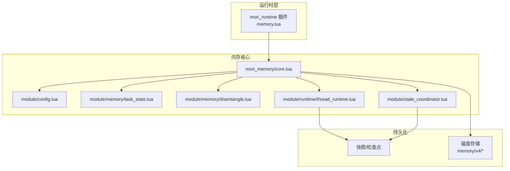
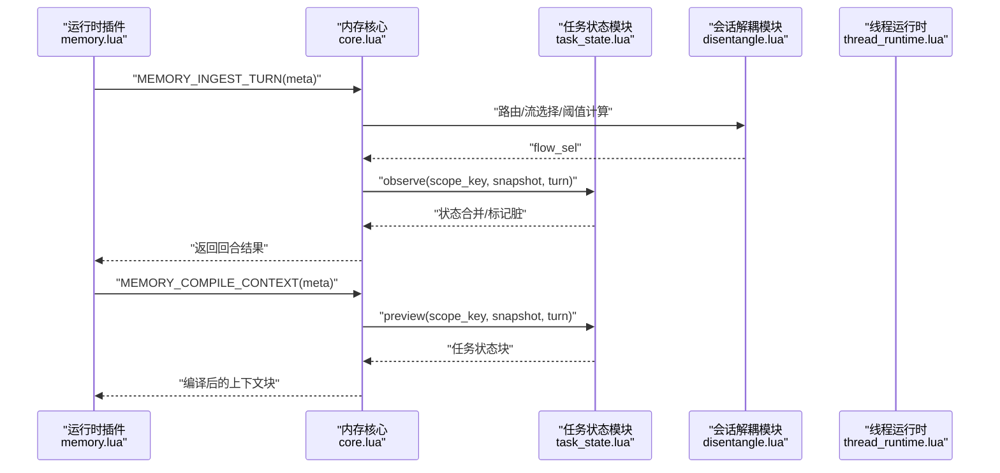
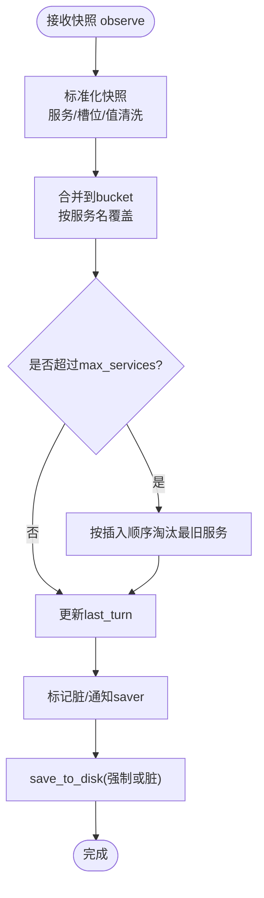
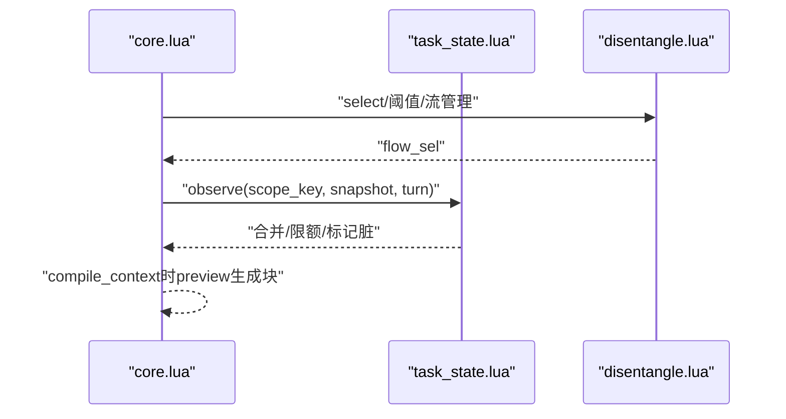
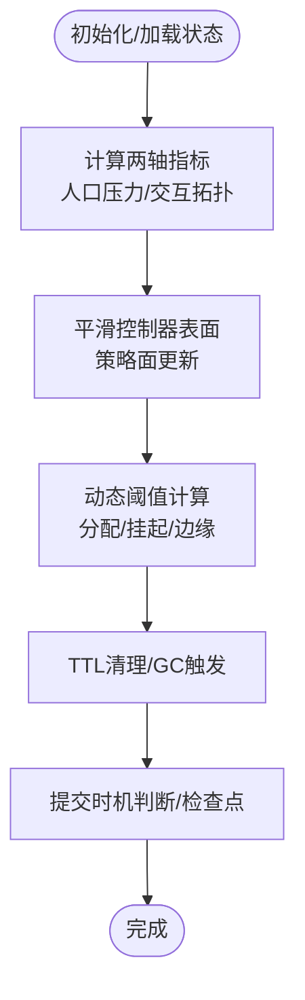
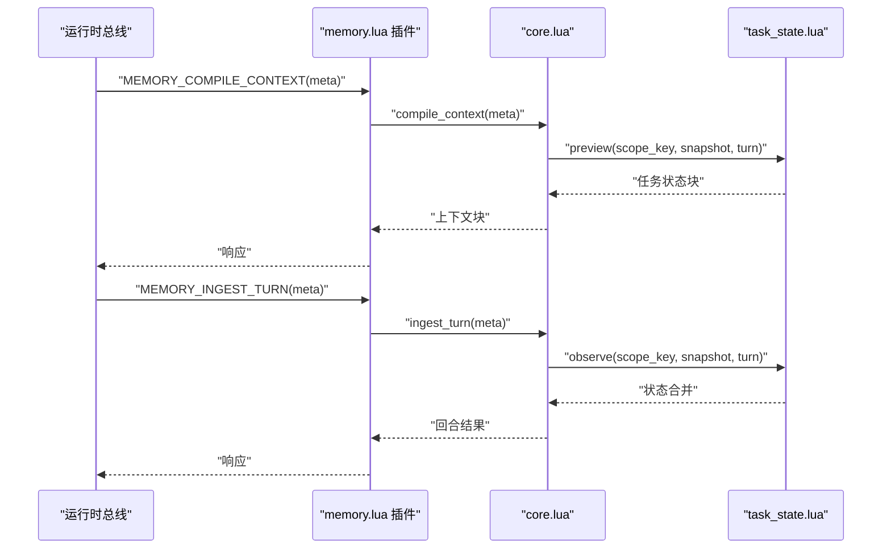
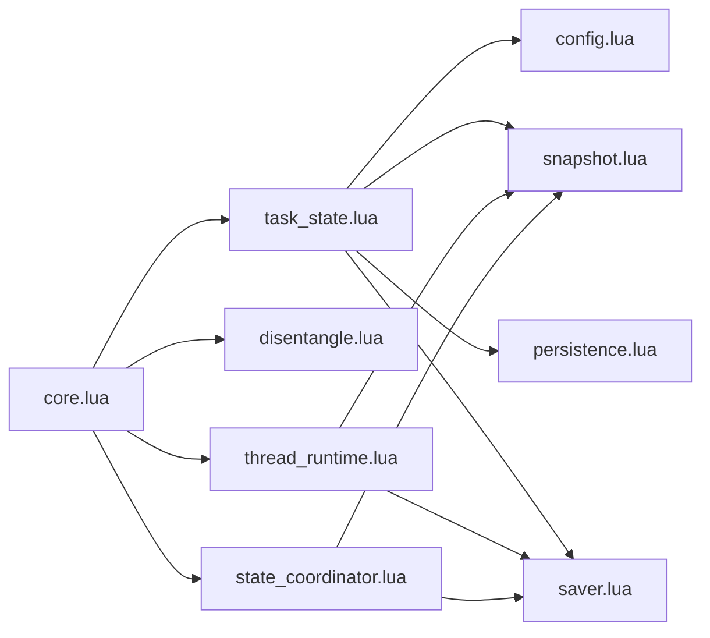

# 任务状态记忆 (Task State Memory)

<cite>
**本文档引用的文件**
- [mori_memory/core.lua](file://mori_memory/mori_memory/core.lua)
- [module/memory/task_state.lua](file://mori_memory/module/memory/task_state.lua)
- [module/memory/disentangle.lua](file://mori_memory/module/memory/disentangle.lua)
- [module/config.lua](file://mori_memory/module/config.lua)
- [module/runtime/thread_runtime.lua](file://mori_memory/module/runtime/thread_runtime.lua)
- [module/state_coordinator.lua](file://mori_memory/module/state_coordinator.lua)
- [mori_runtime/plugins/memory.lua](file://mori_runtime/lua/mori/plugins/memory.lua)
- [benchmarks/results/bench_mw_task_state_v0.json](file://mori_memory/benchmarks/results/bench_mw_task_state_v0.json)
- [README.md](file://mori_memory/README.md)
</cite>

## 目录
1. [简介](#简介)
2. [项目结构](#项目结构)
3. [核心组件](#核心组件)
4. [架构总览](#架构总览)
5. [详细组件分析](#详细组件分析)
6. [依赖关系分析](#依赖关系分析)
7. [性能考量](#性能考量)
8. [故障排查指南](#故障排查指南)
9. [结论](#结论)
10. [附录](#附录)

## 简介
本文件面向Mori任务状态记忆系统，围绕任务追踪机制、进度管理、状态转换逻辑展开，系统性阐述任务记忆的数据模型设计（生命周期、依赖关系、优先级调度）、与对话流程的集成方式及在复杂任务场景下的应用策略。同时提供配置选项、监控指标与故障诊断方法，并给出实际应用场景与最佳实践建议。

## 项目结构
Mori任务状态记忆位于mori_memory子模块中，核心入口为LuaJIT模块，对外通过mori_runtime插件桥接到上层运行时。关键目录与文件如下：
- 核心入口与编排：mori_memory/mori_memory/core.lua
- 任务状态模块：mori_memory/module/memory/task_state.lua
- 会话解耦与流管理：mori_memory/module/memory/disentangle.lua
- 配置中心：mori_memory/module/config.lua
- 线程运行时：mori_memory/module/runtime/thread_runtime.lua
- 状态协调器：mori_memory/module/state_coordinator.lua
- 运行时插件桥接：mori_runtime/lua/mori/plugins/memory.lua
- 基准结果示例：mori_memory/benchmarks/results/bench_mw_task_state_v0.json
- 模块自述：mori_memory/README.md

**图表来源**
- [mori_runtime/plugins/memory.lua:1-28](file://mori_runtime/lua/mori/plugins/memory.lua#L1-L28)
- [mori_memory/mori_memory/core.lua:1-1984](file://mori_memory/mori_memory/core.lua#L1-L1984)
- [module/memory/task_state.lua:1-305](file://mori_memory/module/memory/task_state.lua#L1-L305)
- [module/memory/disentangle.lua:1-800](file://mori_memory/module/memory/disentangle.lua#L1-L800)
- [module/runtime/thread_runtime.lua:1-260](file://mori_memory/module/runtime/thread_runtime.lua#L1-L260)
- [module/state_coordinator.lua:1-302](file://mori_memory/module/state_coordinator.lua#L1-L302)

**章节来源**
- [mori_runtime/plugins/memory.lua:1-28](file://mori_runtime/lua/mori/plugins/memory.lua#L1-L28)
- [mori_memory/README.md:1-89](file://mori_memory/README.md#L1-L89)

## 核心组件
- 任务状态模块（task_state）：负责任务状态的归档、合并、持久化与展示块生成，支持按作用域聚合服务状态，限制最大服务数量，清洗槽位值，输出统一格式的“任务状态”块。
- 会话解耦模块（disentangle）：负责多流并发、动态阈值、TTL清理、控制器表面平滑与两轴控制器等，支撑任务状态在复杂对话中的稳定承载。
- 配置中心（config）：集中管理任务状态开关、存储根路径、最大服务数、是否输出块等；同时提供disentangle的内存限制、GC控制、TTL设置、两轴控制器等参数。
- 线程运行时（thread_runtime）：负责路由边界、pending状态管理、孤儿检测与处理、环境上下文维护、提交时机控制与WAL管理。
- 状态协调器（state_coordinator）：提供版本向量、事务一致性、检查点创建与恢复验证、自动维护等能力，保障多模块状态一致性。
- 运行时插件（memory.lua）：将内存核心事件桥接到运行时总线，提供编译上下文与摄入回合的统一入口。

**章节来源**
- [module/memory/task_state.lua:1-305](file://mori_memory/module/memory/task_state.lua#L1-L305)
- [module/memory/disentangle.lua:1-800](file://mori_memory/module/memory/disentangle.lua#L1-L800)
- [module/config.lua:168-174](file://mori_memory/module/config.lua#L168-L174)
- [module/runtime/thread_runtime.lua:1-260](file://mori_memory/module/runtime/thread_runtime.lua#L1-L260)
- [module/state_coordinator.lua:1-302](file://mori_memory/module/state_coordinator.lua#L1-L302)
- [mori_runtime/plugins/memory.lua:1-28](file://mori_runtime/lua/mori/plugins/memory.lua#L1-L28)

## 架构总览
任务状态记忆在对话流程中的位置与交互如下：

**图表来源**
- [mori_runtime/plugins/memory.lua:12-18](file://mori_runtime/lua/mori/plugins/memory.lua#L12-L18)
- [mori_memory/mori_memory/core.lua:1842-1958](file://mori_memory/mori_memory/core.lua#L1842-L1958)
- [module/memory/task_state.lua:290-302](file://mori_memory/module/memory/task_state.lua#L290-L302)
- [module/memory/disentangle.lua:1-800](file://mori_memory/module/memory/disentangle.lua#L1-L800)
- [module/runtime/thread_runtime.lua:1-260](file://mori_memory/module/runtime/thread_runtime.lua#L1-L260)

## 详细组件分析

### 任务状态数据模型与生命周期
- 存储结构
  - 版本字段：用于快照一致性校验与迁移。
  - 作用域（scopes）：键为scope_key，值包含服务集合（services）与最后回合（last_turn）。
  - 服务（services）：键为服务名，值包含活动意图（active_intent）、请求槽位（requested_slots）、槽位值（slot_values）。
- 生命周期管理
  - 归档：observe在启用时接收来自meta的快照，标准化后合并进对应scope的服务桶。
  - 清洗：规范化服务名、槽位名与槽位值，去空、去重、排序，避免污染。
  - 限额：max_services限制每个scope的服务数量，超限按插入顺序淘汰最旧服务。
  - 展示：preview在启用emit_block时，基于当前bucket与新快照合并生成“任务状态”块文本。
  - 持久化：save_to_disk写入原子文件，标记脏标志，配合saver与snapshot模块。
- 依赖关系
  - 依赖配置中心的task_state.enabled、storage_root、max_services、emit_block。
  - 依赖快照模块进行生成号一致性校验与模块要求检查。
  - 依赖持久化模块进行原子写入。
- 优先级调度
  - 通过合并逻辑与限额淘汰，维持最新服务优先；槽位值按唯一排序，保证展示稳定。

**图表来源**
- [module/memory/task_state.lua:144-168](file://mori_memory/module/memory/task_state.lua#L144-L168)
- [module/memory/task_state.lua:290-302](file://mori_memory/module/memory/task_state.lua#L290-L302)
- [module/memory/task_state.lua:254-273](file://mori_memory/module/memory/task_state.lua#L254-L273)

**章节来源**
- [module/memory/task_state.lua:65-168](file://mori_memory/module/memory/task_state.lua#L65-L168)
- [module/memory/task_state.lua:221-273](file://mori_memory/module/memory/task_state.lua#L221-L273)
- [module/config.lua:168-174](file://mori_memory/module/config.lua#L168-L174)

### 任务追踪机制与进度管理
- 追踪入口
  - 在core.lua的摄入回合（ingest_turn）阶段，当存在task_state_snapshot时，调用task_state.observe进行状态观测与合并。
- 进度管理
  - last_turn记录每个scope的最新回合，用于后续合并与展示。
  - preview在编译上下文阶段生成“任务状态”块，便于对话系统感知当前任务进度。
- 与会话解耦的协同
  - disentangle提供动态阈值、TTL清理、两轴控制器等，降低任务状态在高并发场景下的抖动风险，提升稳定性。

**图表来源**
- [mori_memory/mori_memory/core.lua:1842-1958](file://mori_memory/mori_memory/core.lua#L1842-L1958)
- [module/memory/task_state.lua:290-302](file://mori_memory/module/memory/task_state.lua#L290-L302)
- [module/memory/disentangle.lua:1-800](file://mori_memory/module/memory/disentangle.lua#L1-L800)

**章节来源**
- [mori_memory/mori_memory/core.lua:1842-1958](file://mori_memory/mori_memory/core.lua#L1842-L1958)
- [module/memory/task_state.lua:275-288](file://mori_memory/module/memory/task_state.lua#L275-L288)

### 状态转换逻辑与控制器
- 两轴控制器
  - 基于有效参与者数量与切换率计算人口压力，基于显式回复强度、行对邻接密度、对密度与反枢纽性计算交互拓扑，形成两轴坐标，平滑控制器表面，决定策略面（如写保守、读本地化等）。
- 动态阈值
  - 根据房间温度、活跃流压力、分数熵、显式回复强度等动态调整分配阈值、挂起阈值与边缘阈值，避免静态阈值导致的误判。
- TTL与清理
  - 对挂起消息、线程空闲时间进行TTL清理，防止资源膨胀；周期性触发GC，缓解内存压力。
- 版本控制与一致性
  - 通过版本向量、事务、快照与WAL，确保状态一致性与可恢复性。

**图表来源**
- [module/memory/disentangle.lua:1416-1535](file://mori_memory/module/memory/disentangle.lua#L1416-L1535)
- [module/memory/disentangle.lua:1537-1599](file://mori_memory/module/memory/disentangle.lua#L1537-L1599)
- [module/runtime/thread_runtime.lua:110-152](file://mori_memory/module/runtime/thread_runtime.lua#L110-L152)

**章节来源**
- [module/memory/disentangle.lua:1416-1535](file://mori_memory/module/memory/disentangle.lua#L1416-L1535)
- [module/runtime/thread_runtime.lua:110-152](file://mori_memory/module/runtime/thread_runtime.lua#L110-L152)
- [module/state_coordinator.lua:1-302](file://mori_memory/module/state_coordinator.lua#L1-L302)

### 与对话流程的集成方式
- 运行时桥接
  - 运行时插件订阅协议事件，转发至内存核心的编译上下文与摄入回合接口，实现端到端集成。
- 元信息传递
  - meta中携带task_state_snapshot、scope_key、turn等，供任务状态模块进行观测与合并。
- 上下文输出
  - 编译阶段通过preview生成“任务状态”块，作为系统提示的一部分参与后续推理。

**图表来源**
- [mori_runtime/plugins/memory.lua:12-18](file://mori_runtime/lua/mori/plugins/memory.lua#L12-L18)
- [mori_memory/mori_memory/core.lua:1961-2020](file://mori_memory/mori_memory/core.lua#L1961-L2020)
- [module/memory/task_state.lua:275-302](file://mori_memory/module/memory/task_state.lua#L275-L302)

**章节来源**
- [mori_runtime/plugins/memory.lua:1-28](file://mori_runtime/lua/mori/plugins/memory.lua#L1-L28)
- [mori_memory/mori_memory/core.lua:1961-2020](file://mori_memory/mori_memory/core.lua#L1961-L2020)

### 复杂任务场景的应用策略
- 多服务/多槽位场景
  - 通过max_services与槽位值去重排序，确保展示稳定与容量可控。
- 高并发/多流场景
  - 依赖disentangle的动态阈值与TTL清理，降低流切换抖动与资源膨胀风险。
- 跨会话/跨主题场景
  - 通过scope_key隔离不同作用域，避免状态交叉污染；结合主题图检索与exact state增强长程记忆。

**章节来源**
- [module/memory/task_state.lua:144-168](file://mori_memory/module/memory/task_state.lua#L144-L168)
- [module/memory/disentangle.lua:193-269](file://mori_memory/module/memory/disentangle.lua#L193-L269)

## 依赖关系分析
- 组件耦合
  - task_state依赖config、snapshot、persistence与saver；与core.lua在摄入与编译阶段耦合。
  - disentangle与thread_runtime共同维护运行时状态与提交时机，与core.lua在路由与阈值计算上耦合。
  - state_coordinator提供跨模块一致性保障，与thread_runtime、saver、snapshot协作。
- 外部依赖
  - 运行时插件桥接至mori_runtime总线，依赖协议事件与上下文编译。

**图表来源**
- [module/memory/task_state.lua:1-30](file://mori_memory/module/memory/task_state.lua#L1-L30)
- [mori_memory/mori_memory/core.lua:1-20](file://mori_memory/mori_memory/core.lua#L1-L20)
- [module/runtime/thread_runtime.lua:1-20](file://mori_memory/module/runtime/thread_runtime.lua#L1-L20)
- [module/state_coordinator.lua:1-20](file://mori_memory/module/state_coordinator.lua#L1-L20)

**章节来源**
- [module/memory/task_state.lua:1-30](file://mori_memory/module/memory/task_state.lua#L1-L30)
- [mori_memory/mori_memory/core.lua:1-20](file://mori_memory/mori_memory/core.lua#L1-L20)
- [module/runtime/thread_runtime.lua:1-20](file://mori_memory/module/runtime/thread_runtime.lua#L1-L20)
- [module/state_coordinator.lua:1-20](file://mori_memory/module/state_coordinator.lua#L1-L20)

## 性能考量
- 写入路径
  - 任务状态写入采用原子文件写入，减少部分写入风险；脏标志与saver配合批量落盘。
- 读取路径
  - preview在编译上下文阶段生成块，避免重复扫描；合并与限额在observe阶段完成，降低编译时开销。
- 内存与GC
  - disentangle内置内存压力检测与GC触发策略，周期性清理过期挂起消息与空闲线程，防止内存膨胀。
- 存储布局
  - 通过配置中心设定storage_root，统一管理任务状态持久化目录，便于运维与迁移。

**章节来源**
- [module/memory/task_state.lua:254-273](file://mori_memory/module/memory/task_state.lua#L254-L273)
- [module/memory/disentangle.lua:127-191](file://mori_memory/module/memory/disentangle.lua#L127-L191)

## 故障排查指南
- 初始化失败
  - 若task_state.load失败，core.lua在ensure_init阶段会抛出错误，需检查快照生成号与模块要求。
- 状态不一致
  - 使用state_coordinator的verify_recovery_state检查快照与WAL一致性，必要时创建一致性检查点。
- 写入阻断
  - 若启用guard且信用不足，可能阻断写入；可通过grudge模块查看note与block状态。
- 内存压力
  - 观察disentangle的内存压力阈值与GC触发日志，必要时调整配置中心的memory_limits与gc_control。

**章节来源**
- [mori_memory/mori_memory/core.lua:227-262](file://mori_memory/mori_memory/core.lua#L227-L262)
- [module/state_coordinator.lua:210-258](file://mori_memory/module/state_coordinator.lua#L210-L258)
- [module/config.lua:184-219](file://mori_memory/module/config.lua#L184-L219)
- [module/memory/disentangle.lua:127-191](file://mori_memory/module/memory/disentangle.lua#L127-L191)

## 结论
Mori任务状态记忆通过清晰的数据模型、严格的生命周期管理与与会话解耦模块的协同，实现了在复杂对话场景下的稳定任务追踪与进度管理。借助动态阈值、TTL清理与版本控制，系统在高并发与跨主题场景中仍能保持一致性与可恢复性。通过配置中心与运行时插件的桥接，任务状态无缝融入对话流程，为多轮任务型交互提供了可靠的记忆基础。

## 附录

### 配置选项（节选）
- 任务状态相关
  - enabled：是否启用任务状态模块
  - storage_root：任务状态存储根路径
  - max_services：每个scope的最大服务数
  - emit_block：是否在编译上下文时输出任务状态块
- 会话解耦相关（disentangle）
  - memory_limits：内存限制（线程挂起上限、主题节点上限、精确状态条目上限、内存使用阈值）
  - gc_control：GC触发策略（基于检查点、孤儿线程、内存压力）
  - ttl_settings：TTL设置（挂起消息最大年龄、线程最大空闲时间、清理检查间隔）
  - state_version_control：状态版本控制（启用、当前版本、最小兼容版本、版本不匹配处理）
  - dynamic_threshold_enabled：动态阈值开关
  - two_axis_controller_enabled：两轴控制器开关
  - runtime.checkpoint_interval_turns：运行时检查点间隔（回合）

**章节来源**
- [module/config.lua:168-174](file://mori_memory/module/config.lua#L168-L174)
- [module/config.lua:224-281](file://mori_memory/module/config.lua#L224-L281)
- [module/config.lua:283-496](file://mori_memory/module/config.lua#L283-L496)

### 监控指标与可观测性
- 状态协调器
  - 版本向量、事务状态、活跃事务数、快照生成号、WAL记录数、一致性检查结果
- 线程运行时
  - 最后序列号、最后检查点回合、活跃作用域数量、运行时状态、内存占用
- 会话解耦
  - 内存使用（MB）、GC触发次数与时序、过期挂起消息清理数量、空闲线程孤儿数量

**章节来源**
- [module/state_coordinator.lua:19-207](file://mori_memory/module/state_coordinator.lua#L19-L207)
- [module/runtime/thread_runtime.lua:204-218](file://mori_memory/module/runtime/thread_runtime.lua#L204-L218)
- [module/memory/disentangle.lua:121-166](file://mori_memory/module/memory/disentangle.lua#L121-L166)

### 应用场景与最佳实践
- 场景
  - 多轮任务型对话（如多woz场景）、跨会话任务延续、多服务协同（如酒店/景点查询）
- 最佳实践
  - 启用任务状态模块并设置合理的max_services，避免状态膨胀
  - 在高并发场景下开启disentangle的动态阈值与TTL清理，降低抖动
  - 使用state_coordinator定期创建一致性检查点，确保可恢复性
  - 通过preview在编译上下文阶段输出任务状态块，增强系统对任务进度的理解

**章节来源**
- [benchmarks/results/bench_mw_task_state_v0.json:1-51](file://mori_memory/benchmarks/results/bench_mw_task_state_v0.json#L1-L51)
- [module/memory/task_state.lua:275-288](file://mori_memory/module/memory/task_state.lua#L275-L288)
- [module/state_coordinator.lua:145-207](file://mori_memory/module/state_coordinator.lua#L145-L207)