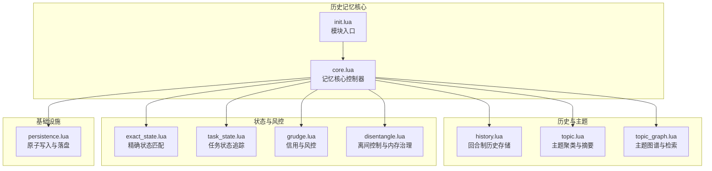
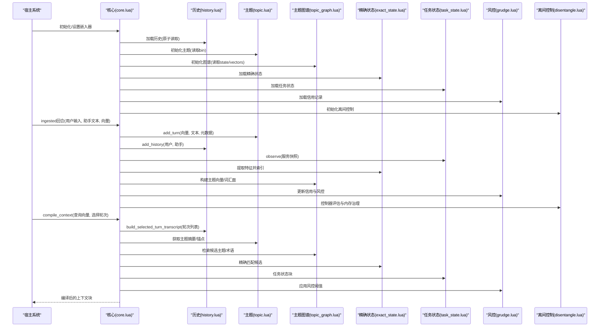
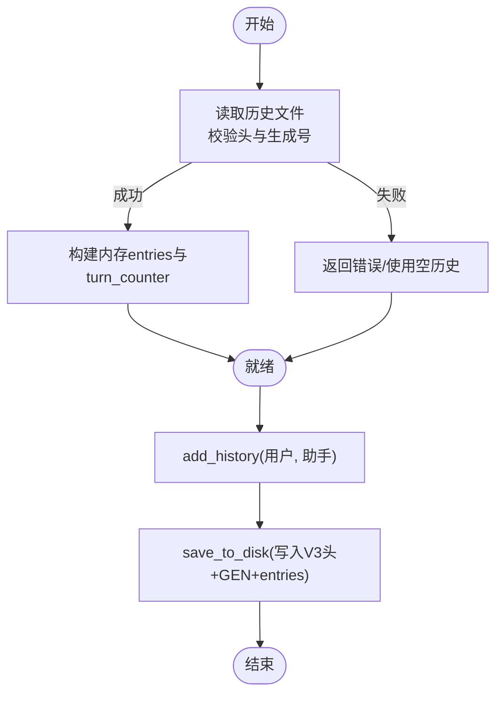
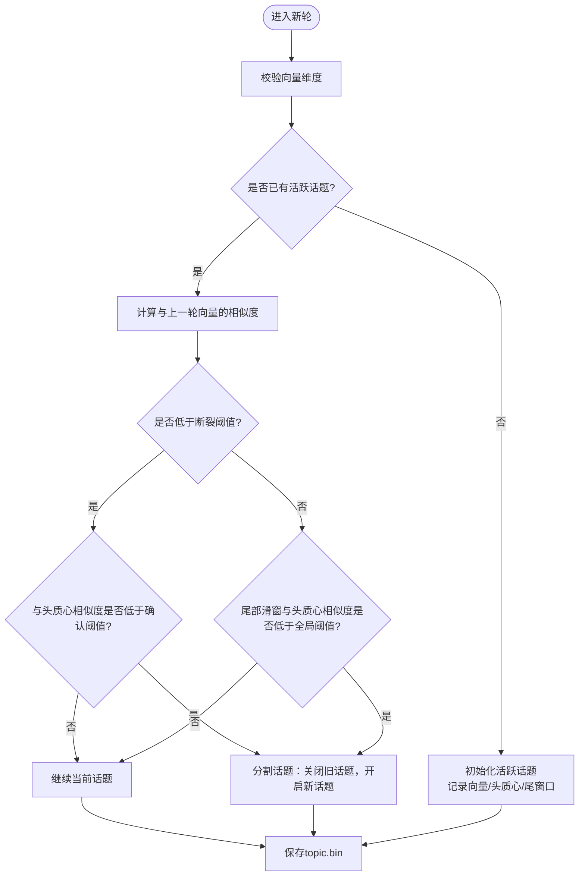
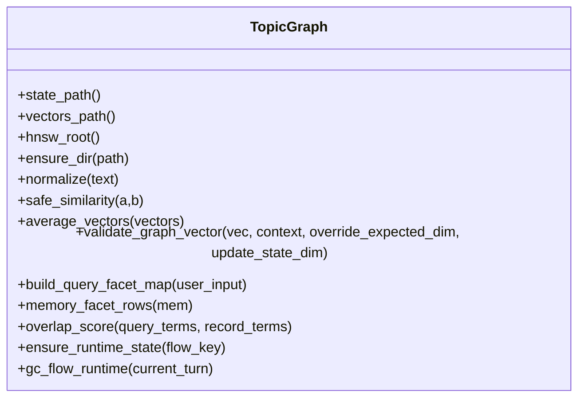
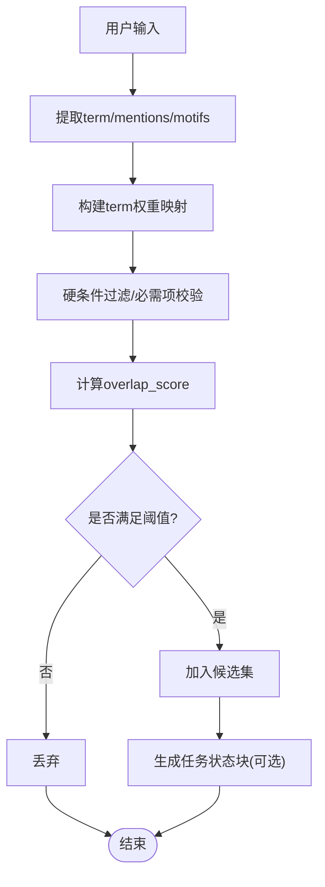
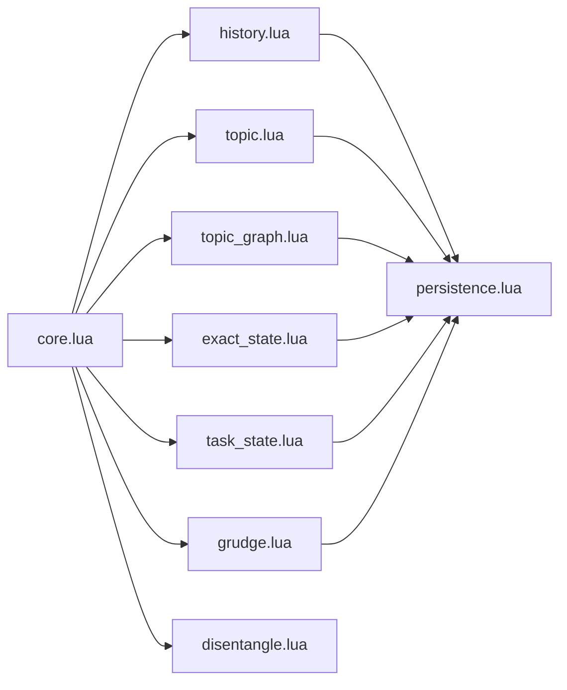

# 历史记忆（History Memory）

<cite>
**本文档引用的文件**
- [README.md](file://mori_memory/README.md)
- [core.lua](file://mori_memory/mori_memory/core.lua)
- [init.lua](file://mori_memory/mori_memory/init.lua)
- [history.lua](file://mori_memory/module/memory/history.lua)
- [topic.lua](file://mori_memory/module/memory/topic.lua)
- [topic_graph.lua](file://mori_memory/module/memory/topic_graph.lua)
- [exact_state.lua](file://mori_memory/module/memory/exact_state.lua)
- [task_state.lua](file://mori_memory/module/memory/task_state.lua)
- [grudge.lua](file://mori_memory/module/memory/grudge.lua)
- [disentangle.lua](file://mori_memory/module/memory/disentangle.lua)
- [persistence.lua](file://mori_memory/module/persistence.lua)
- [memory_trace.jsonl](file://live_capture/bilibili_room_3971693_20260318-205900/memory_trace.jsonl)
</cite>

## 目录
1. [简介](#简介)
2. [项目结构](#项目结构)
3. [核心组件](#核心组件)
4. [架构总览](#架构总览)
5. [详细组件分析](#详细组件分析)
6. [依赖关系分析](#依赖关系分析)
7. [性能考虑](#性能考虑)
8. [故障排除指南](#故障排除指南)
9. [结论](#结论)
10. [附录](#附录)

## 简介
本文件面向Mori历史记忆系统的技术文档，聚焦历史记忆的回合制存储机制、对话上下文管理、时间线组织结构。文档详细说明历史记忆的数据模型设计（对话记录的存储格式、索引机制和查询接口）、与其它记忆类型（主题、精确状态、任务状态、图谱、离间控制等）的协作关系，以及在对话上下文中如何发挥作用。同时提供配置选项、性能调优建议、数据迁移方案，并给出实际使用场景与集成示例。

## 项目结构
Mori历史记忆系统位于mori_memory仓库，采用模块化设计，核心入口为Lua模块，围绕历史记录、主题建模、图谱检索、精确匹配、任务状态、安全风控与离间控制等子系统协同工作。

**图表来源**
- [core.lua:1-327](file://mori_memory/mori_memory/core.lua#L1-L327)
- [history.lua:1-195](file://mori_memory/module/memory/history.lua#L1-L195)
- [topic.lua:1-800](file://mori_memory/module/memory/topic.lua#L1-L800)
- [topic_graph.lua:1-800](file://mori_memory/module/memory/topic_graph.lua#L1-L800)
- [exact_state.lua:1-800](file://mori_memory/module/memory/exact_state.lua#L1-L800)
- [task_state.lua:1-305](file://mori_memory/module/memory/task_state.lua#L1-L305)
- [grudge.lua:1-497](file://mori_memory/module/memory/grudge.lua#L1-L497)
- [disentangle.lua:1-800](file://mori_memory/module/memory/disentangle.lua#L1-L800)
- [persistence.lua:1-97](file://mori_memory/module/persistence.lua#L1-L97)

**章节来源**
- [README.md:1-89](file://mori_memory/README.md#L1-L89)
- [core.lua:1-327](file://mori_memory/mori_memory/core.lua#L1-L327)
- [init.lua:1-3](file://mori_memory/mori_memory/init.lua#L1-L3)

## 核心组件
- 历史记录模块（history.lua）：以回合为单位存储用户输入与助手输出，提供按轮次读取、转义/反转义、原子落盘等能力。
- 主题模块（topic.lua）：基于向量相似度进行话题聚类，维护活跃话题与历史话题，支持摘要生成与分级摘要缓存。
- 主题图谱（topic_graph.lua）：构建主题向量与词汇面索引，提供快速检索、反馈学习、趋势候选等功能。
- 精确状态（exact_state.lua）：基于术语权重、提及、动机等特征提取，支持精确匹配与回复父节点候选。
- 任务状态（task_state.lua）：服务意图与槽位状态的快照与合并，形成可读的任务状态块。
- 风控与信用（grudge.lua）：基于风险分析与信用衰减策略，决定是否允许写入与检索。
- 离间控制（disentangle.lua）：内存压力监控、TTL清理、象限策略与控制器状态，保障系统稳定性。

**章节来源**
- [history.lua:1-195](file://mori_memory/module/memory/history.lua#L1-L195)
- [topic.lua:1-800](file://mori_memory/module/memory/topic.lua#L1-L800)
- [topic_graph.lua:1-800](file://mori_memory/module/memory/topic_graph.lua#L1-L800)
- [exact_state.lua:1-800](file://mori_memory/module/memory/exact_state.lua#L1-L800)
- [task_state.lua:1-305](file://mori_memory/module/memory/task_state.lua#L1-L305)
- [grudge.lua:1-497](file://mori_memory/module/memory/grudge.lua#L1-L497)
- [disentangle.lua:1-800](file://mori_memory/module/memory/disentangle.lua#L1-L800)

## 架构总览
历史记忆系统以core.lua为核心控制器，统一调度各子模块。核心流程包括：初始化加载、回合写入、主题建模、上下文编译、检索与融合、落盘与清理。系统通过原子写入保证一致性，并提供可选的原生加速模块（HNSW、SIMD）提升性能。

**图表来源**
- [core.lua:197-474](file://mori_memory/mori_memory/core.lua#L197-L474)
- [history.lua:67-192](file://mori_memory/module/memory/history.lua#L67-L192)
- [topic.lua:659-794](file://mori_memory/module/memory/topic.lua#L659-L794)
- [topic_graph.lua:1-800](file://mori_memory/module/memory/topic_graph.lua#L1-L800)
- [exact_state.lua:1-800](file://mori_memory/module/memory/exact_state.lua#L1-L800)
- [task_state.lua:275-302](file://mori_memory/module/memory/task_state.lua#L275-L302)
- [grudge.lua:358-471](file://mori_memory/module/memory/grudge.lua#L358-L471)
- [disentangle.lua:1-800](file://mori_memory/module/memory/disentangle.lua#L1-L800)

## 详细组件分析

### 历史记录模块（history.lua）
- 存储格式：以V3版本头+生成号+逐行记录的方式存储，字段间使用特殊分隔符，内容进行转义处理，确保跨平台可读写。
- 轮次管理：维护turn_counter与entries数组，支持按轮次读取与解析。
- 原子落盘：通过persistence模块的原子替换机制，避免部分写入导致的数据损坏。
- 生成号校验：与快照生成号关联，确保模块一致性。

**图表来源**
- [history.lua:67-192](file://mori_memory/module/memory/history.lua#L67-L192)

**章节来源**
- [history.lua:1-195](file://mori_memory/module/memory/history.lua#L1-L195)

### 主题模块（topic.lua）
- 话题建模：基于向量相似度与“话语对相似度”检测话题断裂，结合头质心与尾部滑窗进行话题延续/分割。
- 摘要生成：支持分级摘要（full/slight/heavy/none），并缓存当前轮次摘要，避免重复LLM调用。
- 活跃话题：维护head_centroid、tail_window、last_vec等状态，支持跨轮次的向量聚合与平均。
- 二进制索引：将活跃话题与历史话题序列化为topic.bin，支持版本校验与恢复。

**图表来源**
- [topic.lua:659-794](file://mori_memory/module/memory/topic.lua#L659-L794)

**章节来源**
- [topic.lua:1-800](file://mori_memory/module/memory/topic.lua#L1-L800)

### 主题图谱（topic_graph.lua）
- 图谱状态：维护state.lua、vectors.bin、hnsw索引与词汇面（facet）索引，支持主题向量检索与术语权重匹配。
- 词汇面提取：从文本中抽取term权重，构建faceted表示，用于精确匹配与检索。
- 反馈学习：支持fast/slow学习率与topic_prior权重，动态调整召回与采纳行为。
- 运行时管理：维护每个flow_key的runtime状态，包括last_anchor、last_selected、last_turn等，支持TTL与容量限制。

**图表来源**
- [topic_graph.lua:1-800](file://mori_memory/module/memory/topic_graph.lua#L1-L800)

**章节来源**
- [topic_graph.lua:1-800](file://mori_memory/module/memory/topic_graph.lua#L1-L800)

### 精确状态（exact_state.lua）
- 特征提取：从文本中抽取term权重、提及、动机（reaction_motifs）等，构建精确匹配索引。
- 精确匹配：支持hard-only过滤、required_terms校验、overlap_score计算，结合查询线索惩罚因子。
- 线程与书签：维护thread_index、symbol_index、suffix_graph等，支持线程内符号序列与后缀图。
- 任务状态块：当任务状态存在时，格式化输出任务状态块，便于上下文编译。

**图表来源**
- [exact_state.lua:447-488](file://mori_memory/module/memory/exact_state.lua#L447-L488)

**章节来源**
- [exact_state.lua:1-800](file://mori_memory/module/memory/exact_state.lua#L1-L800)

### 任务状态（task_state.lua）
- 快照合并：规范化服务快照，合并多个服务的槽位值，限制最大服务数量。
- 任务块格式化：将服务意图、请求槽位与槽位值格式化为可读块，供上下文编译使用。
- 观察与预览：支持observe（写入）与preview（预览）两种模式，便于调试与集成。

**章节来源**
- [task_state.lua:1-305](file://mori_memory/module/memory/task_state.lua#L1-L305)

### 风控与信用（grudge.lua）
- 信用计算：基于风险分析（prompt injection、长文本、命令式开头等）与信用衰减/奖励机制，动态调整信用值。
- 阻断策略：当信用低于阈值时，设置阻断until_ts，并生成提示信息。
- 作用域与演员键：支持多种scope策略（source/room/user），生成actor_key用于区分不同来源与房间。

**章节来源**
- [grudge.lua:1-497](file://mori_memory/module/memory/grudge.lua#L1-L497)

### 离间控制（disentangle.lua）
- 内存治理：监控内存使用，按压力阈值触发GC，限制每线程事件数量，执行TTL清理。
- TTL清理：清理过期待处理消息与闲置线程，降低内存占用。
- 控制器与象限策略：维护控制器轴、诊断指标与表面参数，支持动态分配阈值与待处理边际。

**章节来源**
- [disentangle.lua:1-800](file://mori_memory/module/memory/disentangle.lua#L1-L800)

## 依赖关系分析
历史记忆系统通过core.lua统一编排，各模块之间存在清晰的依赖与协作关系：

**图表来源**
- [core.lua:1-327](file://mori_memory/mori_memory/core.lua#L1-L327)
- [history.lua:1-195](file://mori_memory/module/memory/history.lua#L1-L195)
- [topic.lua:1-800](file://mori_memory/module/memory/topic.lua#L1-L800)
- [topic_graph.lua:1-800](file://mori_memory/module/memory/topic_graph.lua#L1-L800)
- [exact_state.lua:1-800](file://mori_memory/module/memory/exact_state.lua#L1-L800)
- [task_state.lua:1-305](file://mori_memory/module/memory/task_state.lua#L1-L305)
- [grudge.lua:1-497](file://mori_memory/module/memory/grudge.lua#L1-L497)
- [disentangle.lua:1-800](file://mori_memory/module/memory/disentangle.lua#L1-L800)
- [persistence.lua:1-97](file://mori_memory/module/persistence.lua#L1-L97)

**章节来源**
- [core.lua:1-327](file://mori_memory/mori_memory/core.lua#L1-L327)

## 性能考虑
- 原子写入：使用临时文件+原子替换，避免部分写入与竞态，确保崩溃恢复一致性。
- 可选原生加速：HNSW主题索引与SIMD点积/余弦加速，可通过脚本构建并自动加载。
- 内存治理：离间控制模块内置内存压力检测与TTL清理，防止长时间运行内存膨胀。
- 摘要缓存：主题模块对摘要进行缓存，减少重复LLM调用成本。
- 精确匹配剪枝：通过hard-only过滤与必需项校验，缩小候选范围，提高检索效率。

[本节为通用指导，无需具体文件分析]

## 故障排除指南
- 历史文件损坏：检查V2/V3头与生成号，必要时回退到空历史或修复文件。
- topic.bin版本不匹配：仅支持特定版本，若版本不一致需重新生成或迁移。
- 原子写入失败：检查磁盘权限与空间，确认临时文件写入与重命名流程。
- 风控阻断：查看信用记录与阻断原因，调整阈值或等待冷却时间。
- 内存压力：启用离间控制的GC触发与TTL清理，监控内存使用并调整限制。

**章节来源**
- [history.lua:67-115](file://mori_memory/module/memory/history.lua#L67-L115)
- [topic.lua:373-464](file://mori_memory/module/memory/topic.lua#L373-L464)
- [persistence.lua:25-94](file://mori_memory/module/persistence.lua#L25-L94)
- [grudge.lua:316-356](file://mori_memory/module/memory/grudge.lua#L316-L356)
- [disentangle.lua:127-269](file://mori_memory/module/memory/disentangle.lua#L127-L269)

## 结论
Mori历史记忆系统通过回合制存储、主题聚类与图谱检索、精确匹配与任务状态融合，实现了高效且可控的对话上下文管理。核心模块围绕一致性（原子写入）、性能（可选原生加速）、稳定性（风控与离间控制）展开设计，既适合在线推理也适合离线分析与迁移。通过合理的配置与调优，可在不同场景下获得稳定、可扩展的记忆体验。

[本节为总结性内容，无需具体文件分析]

## 附录

### 使用场景与集成示例
- 在线对话：通过compile_context获取上下文块，结合query_vec与max_selected_turns控制上下文规模。
- 历史回放：使用build_selected_turn_transcript按轮次拼接对话片段，便于审计与复盘。
- 多源隔离：通过scope_key与actor_key实现多房间/多来源的独立记忆空间。
- 安全集成：结合风控模块的信用与阻断策略，避免恶意输入影响长期记忆。

**章节来源**
- [README.md:9-42](file://mori_memory/README.md#L9-L42)
- [core.lua:438-474](file://mori_memory/mori_memory/core.lua#L438-L474)

### 配置选项与参数
- 历史存储：memory/history.txt、生成号校验、原子写入路径。
- 主题建模：make_cluster1/2、topic_limit、break_limit、confirm_limit、min_topic_length、摘要参数。
- 主题图谱：storage根目录、facet_slots、反馈学习率、topic_prior权重。
- 精确状态：storage_root、suffix_max_len、term权重阈值。
- 任务状态：storage_root、max_services。
- 风控：default_credit、credit_decay/bonus/penalty、block_threshold、note_threshold、grudge_path。
- 离间控制：memory_limits、ttl_settings、gc_control。

**章节来源**
- [topic.lua:11-38](file://mori_memory/module/memory/topic.lua#L11-L38)
- [topic_graph.lua:20-53](file://mori_memory/module/memory/topic_graph.lua#L20-L53)
- [exact_state.lua:33-52](file://mori_memory/module/memory/exact_state.lua#L33-L52)
- [task_state.lua:18-25](file://mori_memory/module/memory/task_state.lua#L18-L25)
- [grudge.lua:22-42](file://mori_memory/module/memory/grudge.lua#L22-L42)
- [disentangle.lua:127-191](file://mori_memory/module/memory/disentangle.lua#L127-L191)

### 数据迁移方案
- 历史迁移：确保V3头与生成号一致，必要时通过快照模块要求强制匹配。
- 主题迁移：topic.bin版本校验，不一致时需重新训练或迁移。
- 图谱迁移：state.lua与vectors.bin需在同一快照生成号下，避免版本不匹配。
- 精确状态与任务状态：检查storage_root与版本字段，确保路径正确与版本兼容。

**章节来源**
- [history.lua:67-115](file://mori_memory/module/memory/history.lua#L67-L115)
- [topic.lua:373-464](file://mori_memory/module/memory/topic.lua#L373-L464)
- [topic_graph.lua:1-800](file://mori_memory/module/memory/topic_graph.lua#L1-L800)
- [exact_state.lua:1-800](file://mori_memory/module/memory/exact_state.lua#L1-L800)
- [task_state.lua:227-252](file://mori_memory/module/memory/task_state.lua#L227-L252)

### 实际运行示例（来自直播采集）
- memory_trace.jsonl展示了每轮的上下文构建耗时、事件来源标签、检索到的轮次与事实ID、以及记忆写入状态等，可用于验证历史记忆在真实场景中的表现。

**章节来源**
- [memory_trace.jsonl:1-9](file://live_capture/bilibili_room_3971693_20260318-205900/memory_trace.jsonl#L1-L9)