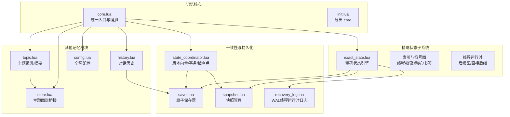
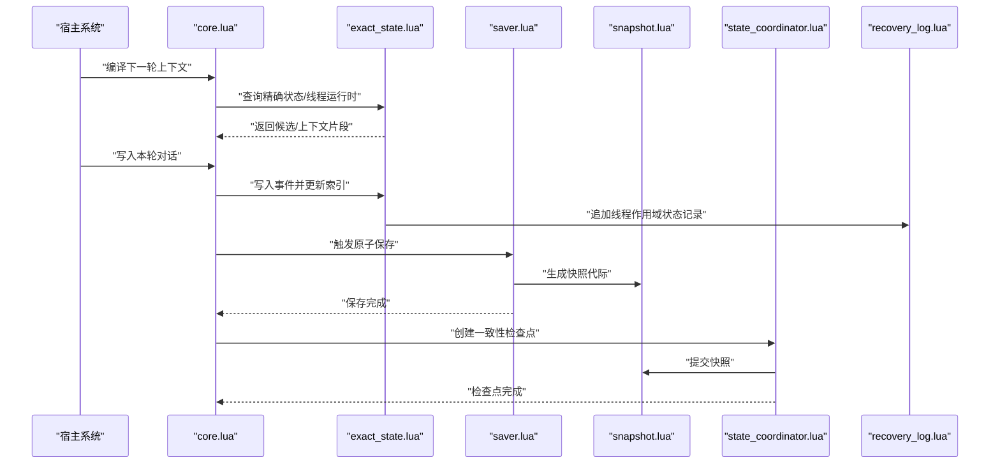
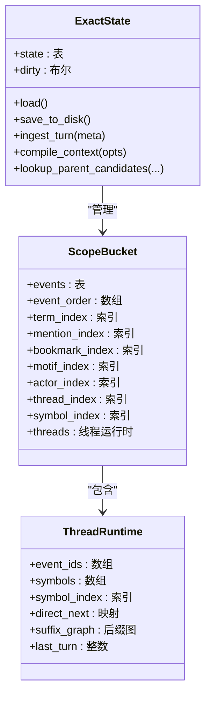
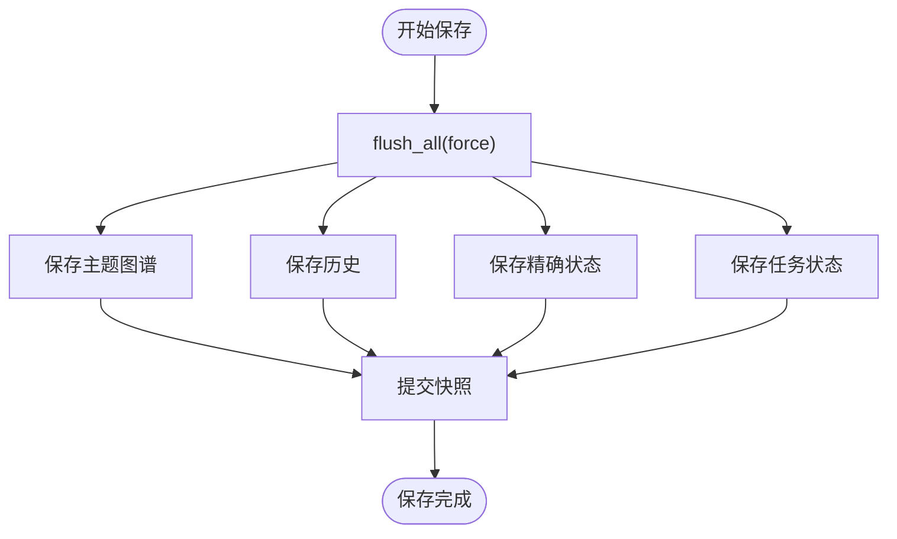
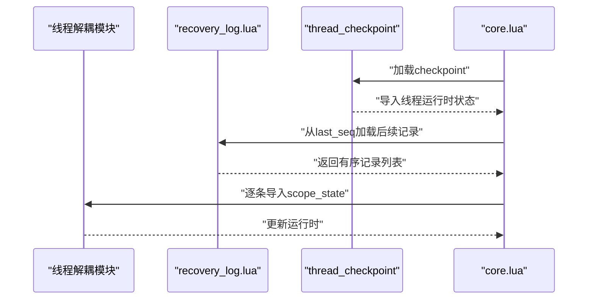
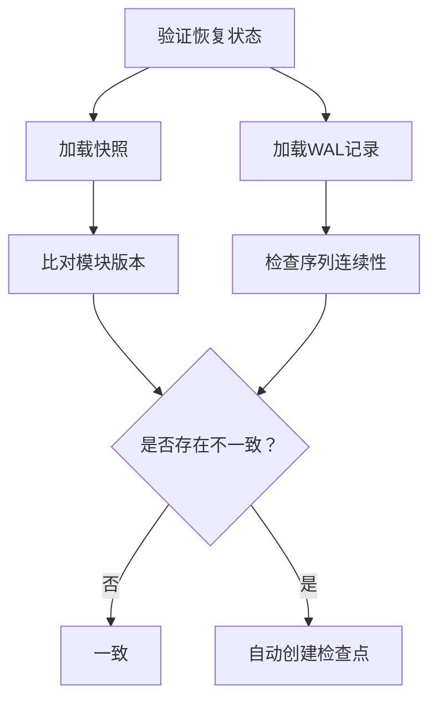
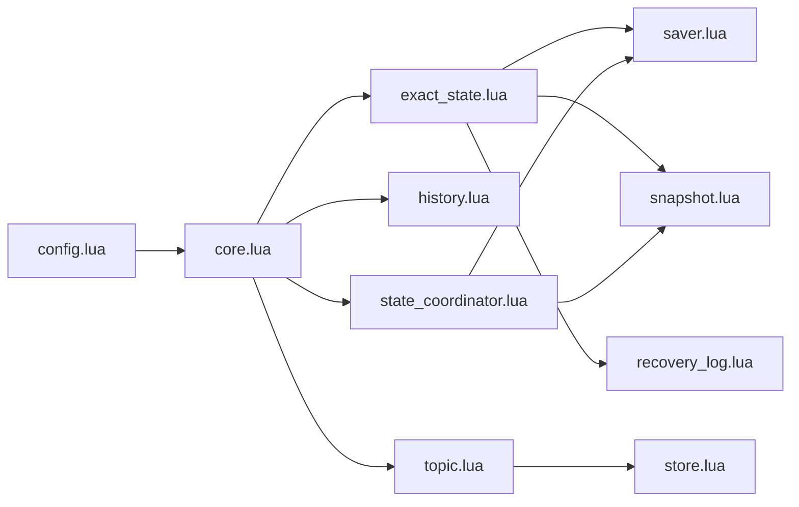

# 精确状态记忆（Exact State Memory）

<cite>
**本文引用的文件**
- [mori_memory/core.lua](file://mori_memory/mori_memory/core.lua)
- [mori_memory/init.lua](file://mori_memory/mori_memory/init.lua)
- [module/state_coordinator.lua](file://mori_memory/module/state_coordinator.lua)
- [module/snapshot.lua](file://mori_memory/module/snapshot.lua)
- [module/memory/exact_state.lua](file://mori_memory/module/memory/exact_state.lua)
- [module/memory/saver.lua](file://mori_memory/module/memory/saver.lua)
- [module/memory/recovery_log.lua](file://mori_memory/module/memory/recovery_log.lua)
- [module/config.lua](file://mori_memory/module/config.lua)
- [module/memory/history.lua](file://mori_memory/module/memory/history.lua)
- [module/memory/topic.lua](file://mori_memory/module/memory/topic.lua)
- [module/memory/store.lua](file://mori_memory/module/memory/store.lua)
- [mori_memory/README.md](file://mori_memory/README.md)
</cite>

## 目录
1. [简介](#简介)
2. [项目结构](#项目结构)
3. [核心组件](#核心组件)
4. [架构总览](#架构总览)
5. [详细组件分析](#详细组件分析)
6. [依赖关系分析](#依赖关系分析)
7. [性能考量](#性能考量)
8. [故障排查指南](#故障排查指南)
9. [结论](#结论)
10. [附录](#附录)

## 简介
本文件面向Mori精确状态记忆系统（Exact State Memory），系统性阐述其时间线管理机制、状态变更追踪、快照保存策略，以及数据结构设计、版本控制与冲突解决机制。文档同时覆盖精确状态在对话过程中的作用、一致性保证与回滚能力，并提供配置参数、性能优化建议与数据备份方案，辅以使用案例与集成指导。

## 项目结构
Mori记忆核心采用模块化分层设计，精确状态记忆位于“memory”子系统内，配合主题图谱、历史记录、任务状态等共同构成完整的记忆体系。核心入口通过Lua模块导出统一接口，底层通过原子保存器与快照协调器保障一致性与可恢复性。

图表来源
- [mori_memory/core.lua](file://mori_memory/mori_memory/core.lua)
- [mori_memory/init.lua](file://mori_memory/mori_memory/init.lua)
- [module/memory/exact_state.lua](file://mori_memory/module/memory/exact_state.lua)
- [module/memory/saver.lua](file://mori_memory/module/memory/saver.lua)
- [module/snapshot.lua](file://mori_memory/module/snapshot.lua)
- [module/memory/recovery_log.lua](file://mori_memory/module/memory/recovery_log.lua)
- [module/state_coordinator.lua](file://mori_memory/module/state_coordinator.lua)
- [module/memory/history.lua](file://mori_memory/module/memory/history.lua)
- [module/memory/topic.lua](file://mori_memory/module/memory/topic.lua)
- [module/memory/store.lua](file://mori_memory/module/memory/store.lua)
- [module/config.lua](file://mori_memory/module/config.lua)

章节来源
- [mori_memory/README.md](file://mori_memory/README.md)
- [mori_memory/mori_memory/core.lua](file://mori_memory/mori_memory/core.lua)

## 核心组件
- 精确状态引擎（exact_state.lua）：负责按作用域组织事件、构建索引（术语、提及、动机、书签、演员、线程、符号）、维护线程运行时（后缀图、直接后继、符号序列），并提供精确检索与回复父节点候选。
- 原子保存器（saver.lua）：协调多个模块的原子落盘，确保快照生成与各模块持久化的一致性。
- 快照管理（snapshot.lua）：记录快照代际、模块集合与保存时间，提供加载、提交与校验。
- 线程运行时WAL（recovery_log.lua）：记录线程作用域状态变更，支持增量恢复与检查点后的连续性校验。
- 状态协调器（state_coordinator.lua）：维护模块版本向量、事务快照、一致性检查点、冲突检测与自动维护。
- 历史与主题（history.lua、topic.lua、store.lua）：提供对话历史与主题聚类的持久化与检索能力，支撑精确状态的上下文编译。
- 配置中心（config.lua）：集中管理精确状态、主题图谱、分布式运行时、保护与阈值等参数。

章节来源
- [module/memory/exact_state.lua](file://mori_memory/module/memory/exact_state.lua)
- [module/memory/saver.lua](file://mori_memory/module/memory/saver.lua)
- [module/snapshot.lua](file://mori_memory/module/snapshot.lua)
- [module/memory/recovery_log.lua](file://mori_memory/module/memory/recovery_log.lua)
- [module/state_coordinator.lua](file://mori_memory/module/state_coordinator.lua)
- [module/memory/history.lua](file://mori_memory/module/memory/history.lua)
- [module/memory/topic.lua](file://mori_memory/module/memory/topic.lua)
- [module/memory/store.lua](file://mori_memory/module/memory/store.lua)
- [module/config.lua](file://mori_memory/module/config.lua)

## 架构总览
精确状态记忆在对话流程中的职责：
- 时间线管理：以“轮次”为单位组织事件，按作用域（scope）隔离，支持线程化组织与符号化表示。
- 状态变更追踪：通过WAL记录线程作用域状态变化，结合版本向量与事务快照进行一致性校验。
- 快照保存策略：在原子保存器协调下，对精确状态、历史、主题图谱与任务状态进行批量落盘，并生成快照。
- 一致性保证与回滚：状态协调器在检查点阶段执行快照提交与WAL记录，若发现不一致则触发自动检查点；事务阶段进行冲突检测，失败时回滚。
- 对话上下文编译：结合历史、主题与精确状态，生成下一轮上下文块。

图表来源
- [mori_memory/mori_memory/core.lua](file://mori_memory/mori_memory/core.lua)
- [module/memory/exact_state.lua](file://mori_memory/module/memory/exact_state.lua)
- [module/memory/saver.lua](file://mori_memory/module/memory/saver.lua)
- [module/snapshot.lua](file://mori_memory/module/snapshot.lua)
- [module/state_coordinator.lua](file://mori_memory/module/state_coordinator.lua)
- [module/memory/recovery_log.lua](file://mori_memory/module/memory/recovery_log.lua)

## 详细组件分析

### 精确状态引擎（exact_state.lua）
- 数据结构设计
  - 作用域桶（scopes）：按scope_key组织，每个桶包含事件表、事件顺序、索引（术语、提及、书签、动机、演员、线程、符号）与线程运行时。
  - 事件模型：包含文本、显示轮次、线程键、段键、书签、演员标识等，支持多维特征提取与权重计算。
  - 线程运行时（threads）：维护事件ID序列、符号序列、符号索引、直接后继、后缀图（用于连续性与模式预测）。
- 精确检索与回复父节点
  - 通过术语权重、提及、动机与书签等特征计算重叠得分，筛选高相关事件作为回复父节点候选。
  - 支持按窗口限制与最小分数过滤，兼顾召回与质量。
- 线程化组织
  - 基于线程键与符号键构建后缀图与直接后继，支持连续性约束与模式学习。
  - 提供线程重建与运行时维护，确保大规模事件下的高效查询。

图表来源
- [module/memory/exact_state.lua](file://mori_memory/module/memory/exact_state.lua)

章节来源
- [module/memory/exact_state.lua](file://mori_memory/module/memory/exact_state.lua)

### 原子保存器与快照（saver.lua、snapshot.lua）
- 原子保存流程
  - 统一触发topic_graph、history.txt、exact_state、task_state的保存，确保在同一代际下落盘。
  - 成功后提交快照，记录模块集合与保存时间。
- 快照管理
  - 提供加载、生成下一代理、提交与缓存失效，支持模块级存在性判断。
  - 与状态协调器协作，用于一致性检查点的持久化。

图表来源
- [module/memory/saver.lua](file://mori_memory/module/memory/saver.lua)
- [module/snapshot.lua](file://mori_memory/module/snapshot.lua)

章节来源
- [module/memory/saver.lua](file://mori_memory/module/memory/saver.lua)
- [module/snapshot.lua](file://mori_memory/module/snapshot.lua)

### 线程运行时WAL与恢复（recovery_log.lua）
- WAL记录
  - 记录线程作用域状态变更（scope_state），包含序列号、轮次、作用域键与状态内容。
  - 提供加载、追加、重置能力，支持从指定序列号之后增量读取。
- 恢复流程
  - 启动时从checkpoint导入线程运行时状态，并按序应用WAL记录，确保运行时一致性。

图表来源
- [module/memory/recovery_log.lua](file://mori_memory/module/memory/recovery_log.lua)
- [mori_memory/mori_memory/core.lua](file://mori_memory/mori_memory/core.lua)

章节来源
- [module/memory/recovery_log.lua](file://mori_memory/module/memory/recovery_log.lua)
- [mori_memory/mori_memory/core.lua](file://mori_memory/mori_memory/core.lua)

### 状态协调器与一致性（state_coordinator.lua）
- 版本向量与事务
  - 维护模块版本向量（版本号、时间戳、依赖），支持事务开始、提交与回滚。
  - 提交前进行冲突检测，若检测到其他模块版本变化则回滚。
- 一致性检查点
  - 创建检查点时，先触发原子保存，再提交快照并写入WAL记录，最后记录恢复日志。
  - 提供自动维护功能，周期性验证快照与WAL连续性，必要时自动创建检查点。
- 恢复验证
  - 加载快照与WAL记录，比对模块版本与序列连续性，输出一致性报告。

图表来源
- [module/state_coordinator.lua](file://mori_memory/module/state_coordinator.lua)
- [module/snapshot.lua](file://mori_memory/module/snapshot.lua)
- [module/memory/recovery_log.lua](file://mori_memory/module/memory/recovery_log.lua)

章节来源
- [module/state_coordinator.lua](file://mori_memory/module/state_coordinator.lua)

### 历史与主题（history.lua、topic.lua、store.lua）
- 历史持久化
  - 采用带版本头与生成代际的文本格式，加载时校验快照代际一致性。
  - 提供转义/反转义机制，保证多轮对话文本的稳定存储与读取。
- 主题聚类与摘要
  - 基于向量相似度与话语对建模进行话题分割，支持分级摘要缓存与持久化。
  - 通过store.lua桥接主题图谱，提供检索与向量存储能力。

章节来源
- [module/memory/history.lua](file://mori_memory/module/memory/history.lua)
- [module/memory/topic.lua](file://mori_memory/module/memory/topic.lua)
- [module/memory/store.lua](file://mori_memory/module/memory/store.lua)

## 依赖关系分析
- 组件耦合
  - 精确状态引擎依赖配置中心、持久化工具与索引模块；与原子保存器、快照管理、WAL形成强耦合以保证一致性。
  - 状态协调器作为横切关注点，向上游提供版本控制与事务管理，向下与保存器、快照、WAL协作。
  - 核心编排模块（core.lua）聚合历史、主题、精确状态与线程运行时，统一对外提供编译上下文与写入接口。
- 外部依赖
  - 配置中心提供精确状态、主题图谱、分布式运行时与保护阈值等参数。
  - 原生模块（SIMD/HNSW）通过工具模块注入，提升向量运算与检索效率。

图表来源
- [module/config.lua](file://mori_memory/module/config.lua)
- [mori_memory/mori_memory/core.lua](file://mori_memory/mori_memory/core.lua)
- [module/memory/exact_state.lua](file://mori_memory/module/memory/exact_state.lua)
- [module/memory/saver.lua](file://mori_memory/module/memory/saver.lua)
- [module/snapshot.lua](file://mori_memory/module/snapshot.lua)
- [module/memory/recovery_log.lua](file://mori_memory/module/memory/recovery_log.lua)
- [module/memory/topic.lua](file://mori_memory/module/memory/topic.lua)
- [module/memory/store.lua](file://mori_memory/module/memory/store.lua)

章节来源
- [mori_memory/mori_memory/core.lua](file://mori_memory/mori_memory/core.lua)
- [module/config.lua](file://mori_memory/module/config.lua)

## 性能考量
- 索引与检索
  - 使用术语权重、提及、动机与书签等特征进行精确检索，建议合理设置检索上限与最小分数，平衡召回与性能。
  - 线程运行时的后缀图与直接后继可显著降低连续性查询成本，建议根据场景调整后缀最大长度。
- 原子保存与快照
  - 原子保存器按模块批量落盘，减少频繁IO；快照代际递增，便于增量恢复与一致性校验。
- 向量化加速
  - 可选的SIMD与HNSW模块可加速向量点积/余弦与主题图谱检索，建议在资源允许时启用。
- 内存与GC
  - 线程运行时具备内存压力与GC控制策略，建议结合配置阈值与检查点触发时机进行调优。

[本节为通用性能建议，无需特定文件引用]

## 故障排查指南
- 快照与WAL不一致
  - 现象：恢复验证报告版本不匹配或WAL序列缺失。
  - 处理：触发状态协调器自动维护或手动创建一致性检查点；检查保存器是否成功提交快照。
- 保存失败
  - 现象：原子保存器报告某模块保存失败并标记脏状态。
  - 处理：检查磁盘权限与路径解析；确认快照路径与模块开关；重试保存或回滚事务。
- 线程运行时异常
  - 现象：WAL加载后运行时状态不一致。
  - 处理：重新加载checkpoint并按序应用WAL记录；检查序列号与作用域键一致性。
- 配置不当
  - 现象：精确状态未生效或检索效果差。
  - 处理：核对精确匹配开关、存储根路径、检索上限与最小分数等参数；必要时切换策略配置文件。

章节来源
- [module/state_coordinator.lua](file://mori_memory/module/state_coordinator.lua)
- [module/memory/saver.lua](file://mori_memory/module/memory/saver.lua)
- [module/memory/recovery_log.lua](file://mori_memory/module/memory/recovery_log.lua)
- [module/config.lua](file://mori_memory/module/config.lua)

## 结论
精确状态记忆系统通过“作用域-线程-符号”三层结构实现对话层面的细粒度状态管理，结合WAL与快照的原子保存策略，确保在复杂多源、多流对话场景下的状态一致性与可恢复性。状态协调器与事务机制进一步增强了并发安全与容错能力。通过合理的配置与性能优化，可在保证质量的同时获得稳定的运行表现。

[本节为总结性内容，无需特定文件引用]

## 附录

### 使用案例与集成指导
- 基本集成
  - 宿主系统通过记忆核心提供的API写入每轮对话元信息（用户输入、助手文本、向量等），随后编译下一轮上下文。
  - 可选择注入嵌入器回调，或在写入时直接提供向量。
- 精确状态检索
  - 在编译上下文时，结合精确状态的回复父节点候选与线程运行时信息，提升上下文的相关性与连贯性。
- 一致性与回滚
  - 在关键操作前后使用状态协调器的事务管理；出现冲突或不一致时，回滚事务并重试。
- 数据备份
  - 建议定期创建一致性检查点；快照与WAL记录可用于灾备恢复；历史与主题图谱同样纳入备份范围。

章节来源
- [mori_memory/README.md](file://mori_memory/README.md)
- [mori_memory/mori_memory/core.lua](file://mori_memory/mori_memory/core.lua)
- [module/state_coordinator.lua](file://mori_memory/module/state_coordinator.lua)