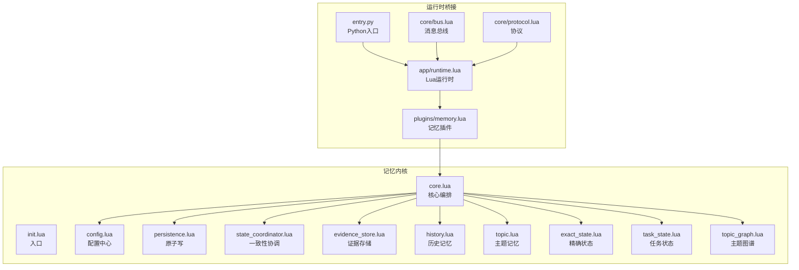
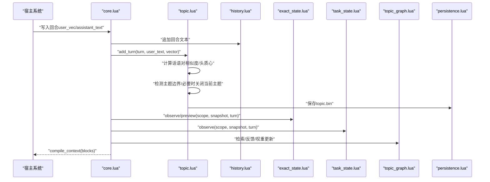
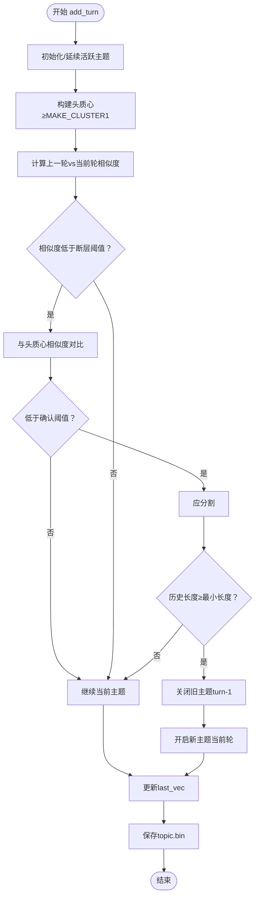
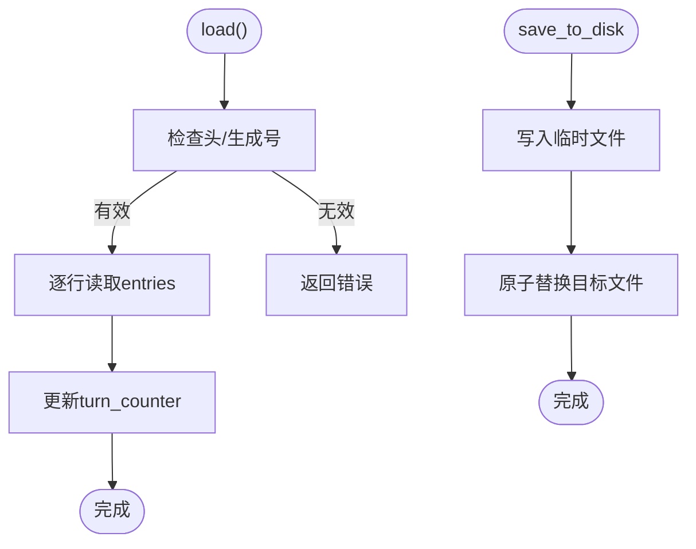
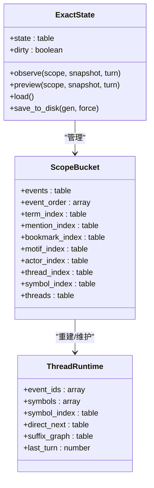
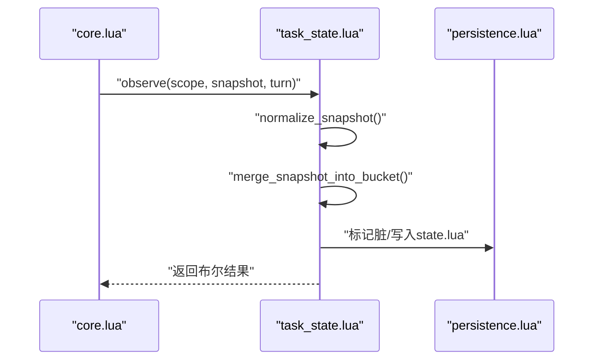
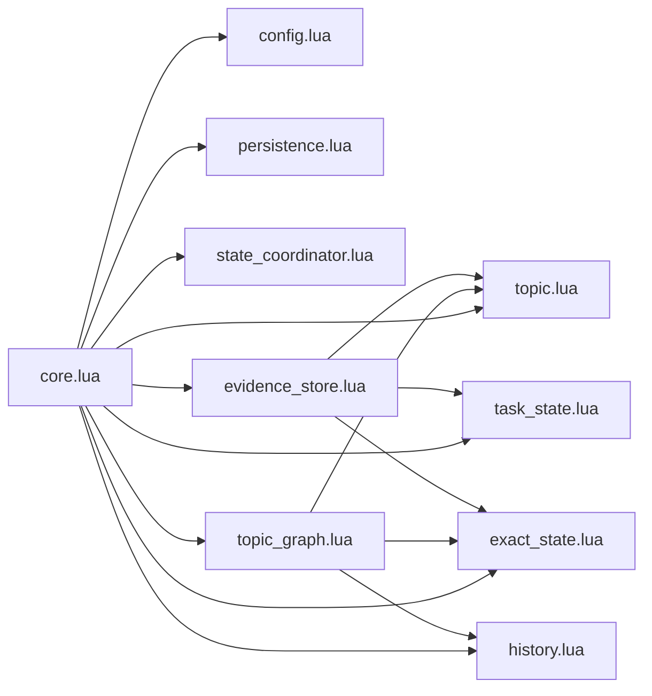

# 记忆类型系统

<cite>
**本文档引用的文件**
- [mori_memory/core.lua](file://mori_memory/mori_memory/core.lua)
- [mori_memory/init.lua](file://mori_memory/mori_memory/init.lua)
- [module/config.lua](file://mori_memory/module/config.lua)
- [module/persistence.lua](file://mori_memory/module/persistence.lua)
- [module/state_coordinator.lua](file://mori_memory/module/state_coordinator.lua)
- [module/evidence/evidence_store.lua](file://mori_memory/module/evidence/evidence_store.lua)
- [module/memory/history.lua](file://mori_memory/module/memory/history.lua)
- [module/memory/topic.lua](file://mori_memory/module/memory/topic.lua)
- [module/memory/topic_graph.lua](file://mori_memory/module/memory/topic_graph.lua)
- [module/memory/exact_state.lua](file://mori_memory/module/memory/exact_state.lua)
- [module/memory/task_state.lua](file://mori_memory/module/memory/task_state.lua)
- [mori_runtime/entry.py](file://mori_runtime/entry.py)
- [mori_runtime/app/runtime.lua](file://mori_runtime/lua/mori/app/runtime.lua)
- [mori_runtime/plugins/memory.lua](file://mori_runtime/plugins/memory.lua)
- [mori_runtime/core/bus.lua](file://mori_runtime/lua/mori/core/bus.lua)
- [mori_runtime/core/plugin.lua](file://mori_runtime/lua/mori/core/plugin.lua)
- [mori_runtime/core/protocol.lua](file://mori_runtime/lua/mori/core/protocol.lua)
</cite>

## 目录
1. [简介](#简介)
2. [项目结构](#项目结构)
3. [核心组件](#核心组件)
4. [架构总览](#架构总览)
5. [详细组件分析](#详细组件分析)
6. [依赖关系分析](#依赖关系分析)
7. [性能考虑](#性能考虑)
8. [故障排除指南](#故障排除指南)
9. [结论](#结论)

## 简介
本文件面向Mori记忆类型系统，系统性阐述四种核心记忆类型的设计与实现：主题记忆（topic）、历史记忆（history）、精确状态（exact_state）、任务状态（task_state）。文档涵盖数据模型、存储格式、查询接口、更新策略、性能特征、类型间关系与协作机制（数据共享、冲突解决、一致性保证），并提供使用场景、配置参数、性能调优与故障排除建议。

## 项目结构
Mori记忆内核位于`mori_memory/`目录，采用模块化设计，核心入口为Lua模块，Python桥接位于`mori_runtime/`。关键模块包括：
- 核心调度与编排：`mori_memory/core.lua`、`mori_memory/init.lua`
- 配置中心：`module/config.lua`
- 持久化与原子写：`module/persistence.lua`
- 状态一致性协调：`module/state_coordinator.lua`
- 证据存储（包含topic投影）：`module/evidence/evidence_store.lua`
- 四种记忆类型实现：
  - 主题记忆：`module/memory/topic.lua`
  - 历史记忆：`module/memory/history.lua`
  - 精确状态：`module/memory/exact_state.lua`
  - 任务状态：`module/memory/task_state.lua`
- 主题图谱（topic_graph）：`module/memory/topic_graph.lua`
- 运行时桥接：`mori_runtime/entry.py`、`mori_runtime/app/runtime.lua`、`mori_runtime/plugins/memory.lua`

图表来源
- [mori_memory/core.lua:1-800](file://mori_memory/mori_memory/core.lua#L1-L800)
- [mori_memory/init.lua:1-3](file://mori_memory/mori_memory/init.lua#L1-L3)
- [module/config.lua:1-680](file://mori_memory/module/config.lua#L1-L680)
- [module/persistence.lua:1-97](file://mori_memory/module/persistence.lua#L1-L97)
- [module/state_coordinator.lua:1-302](file://mori_memory/module/state_coordinator.lua#L1-L302)
- [module/evidence/evidence_store.lua:1-603](file://mori_memory/module/evidence/evidence_store.lua#L1-L603)
- [module/memory/history.lua:1-195](file://mori_memory/module/memory/history.lua#L1-L195)
- [module/memory/topic.lua:1-800](file://mori_memory/module/memory/topic.lua#L1-L800)
- [module/memory/topic_graph.lua:1-800](file://mori_memory/module/memory/topic_graph.lua#L1-L800)
- [module/memory/exact_state.lua:1-800](file://mori_memory/module/memory/exact_state.lua#L1-L800)
- [module/memory/task_state.lua:1-305](file://mori_memory/module/memory/task_state.lua#L1-L305)
- [mori_runtime/entry.py](file://mori_runtime/entry.py)
- [mori_runtime/app/runtime.lua](file://mori_runtime/lua/mori/app/runtime.lua)
- [mori_runtime/plugins/memory.lua](file://mori_runtime/plugins/memory.lua)
- [mori_runtime/core/bus.lua](file://mori_runtime/lua/mori/core/bus.lua)
- [mori_runtime/core/protocol.lua](file://mori_runtime/lua/mori/core/protocol.lua)

章节来源
- [mori_memory/core.lua:1-800](file://mori_memory/mori_memory/core.lua#L1-L800)
- [mori_memory/init.lua:1-3](file://mori_memory/mori_memory/init.lua#L1-L3)
- [module/config.lua:1-680](file://mori_memory/module/config.lua#L1-L680)

## 核心组件
- 核心编排（core.lua）：统一初始化四大记忆模块、向量嵌入处理、安全门控、回合推进、上下文编译、运行时线程检查点与WAL记录。
- 配置中心（config.lua）：集中管理主题图谱、主题记忆、精确状态、任务状态、防毒墙（guard）、多流解耦（disentangle）等参数。
- 原子持久化（persistence.lua）：提供原子替换与临时文件写入封装，保障崩溃安全。
- 状态协调器（state_coordinator.lua）：版本向量、事务、一致性检查点、WAL记录与恢复验证。
- 证据存储（evidence_store.lua）：证据块、演员本地证据、范围聚合、趋势候选、topic投影，支撑主题图谱与精确状态的检索与融合。

章节来源
- [mori_memory/core.lua:1-800](file://mori_memory/mori_memory/core.lua#L1-L800)
- [module/config.lua:1-680](file://mori_memory/module/config.lua#L1-L680)
- [module/persistence.lua:1-97](file://mori_memory/module/persistence.lua#L1-L97)
- [module/state_coordinator.lua:1-302](file://mori_memory/module/state_coordinator.lua#L1-L302)
- [module/evidence/evidence_store.lua:1-603](file://mori_memory/module/evidence/evidence_store.lua#L1-L603)

## 架构总览
四种记忆类型围绕“向量语义+结构化索引+回合制历史”的协同体系工作：
- 主题记忆（topic）：基于向量聚类与话语对相似度的动态主题边界检测，产出头/尾质心与摘要变体，支撑主题图谱与上下文编译。
- 历史记忆（history）：回合制纯文本存储，按V3头+生成号持久化，支持解析与按轮次检索。
- 精确状态（exact_state）：基于词法/提及/动机模式的精确匹配与符号链，支持回复父节点候选、线程后缀图、演员/线程/话题索引。
- 任务状态（task_state）：服务意图与槽位值的结构化快照，支持跨轮次合并与格式化输出。

图表来源
- [mori_memory/core.lua:1-800](file://mori_memory/mori_memory/core.lua#L1-L800)
- [module/memory/history.lua:1-195](file://mori_memory/module/memory/history.lua#L1-L195)
- [module/memory/topic.lua:1-800](file://mori_memory/module/memory/topic.lua#L1-L800)
- [module/memory/exact_state.lua:1-800](file://mori_memory/module/memory/exact_state.lua#L1-L800)
- [module/memory/task_state.lua:1-305](file://mori_memory/module/memory/task_state.lua#L1-L305)
- [module/memory/topic_graph.lua:1-800](file://mori_memory/module/memory/topic_graph.lua#L1-L800)
- [module/persistence.lua:1-97](file://mori_memory/module/persistence.lua#L1-L97)

## 详细组件分析

### 主题记忆（topic）：主题图谱构建
- 数据模型
  - 活跃主题：起始轮次、头质心、向量缓冲、尾部滑窗、上一轮向量、作用域键、摘要缓存与变体。
  - 历史主题：起始/结束轮次、摘要、整体质心、摘要变体。
  - 二进制索引：包含版本、活跃状态标志、向量序列与历史记录。
- 实现要点
  - 话语对相似度与全局漂移检测，双阈值分割，最小主题长度保护。
  - 头质心与尾部均值质心的构建，支持摘要变体（full/slight/heavy/none）。
  - 作用域隔离：跨作用域强制分割，降低多源污染。
- 存储格式
  - 二进制文件（topic.bin），包含头部魔数、版本、活跃状态标志、向量与历史记录。
- 查询与更新
  - add_turn：追加向量与文本，触发分割与保存。
  - update_assistant：补全助手文本，失效活跃摘要缓存。
  - ensure_topic_summary：按需生成摘要变体并缓存。
- 性能特征
  - O(1)轮次增量更新，向量平均与相似度计算为O(d)（d为维度）。
  - 活跃主题仅缓存必要向量，避免全量存储。
- 使用场景
  - 需要基于语义主题的上下文召回与摘要驱动的长程理解。

图表来源
- [module/memory/topic.lua:659-794](file://mori_memory/module/memory/topic.lua#L659-L794)

章节来源
- [module/memory/topic.lua:1-800](file://mori_memory/module/memory/topic.lua#L1-L800)

### 历史记忆（history）：回合制存储
- 数据模型
  - 内存数组entries按回合存储，turn_counter记录当前轮次。
  - 文件格式：V3头+生成号+多行记录，字段分隔符与记录分隔符转义。
- 实现要点
  - 解析/转义机制保证文本完整性。
  - get_by_turn/get_turn_text按轮次检索用户/助手文本。
  - save_to_disk写入V3格式，配合原子写。
- 存储格式
  - 文本文件（history.txt），V2/V3头版本控制与生成号校验。
- 查询与更新
  - add_history：追加一行并标记脏状态。
  - parse_entry：解析回合文本。
  - get_turn/get_by_turn：查询当前轮次与指定轮次内容。
- 性能特征
  - O(1)追加，O(n)遍历检索（n为回合数）。
- 使用场景
  - 简单的回合制对话历史记录与回放。

图表来源
- [module/memory/history.lua:67-194](file://mori_memory/module/memory/history.lua#L67-L194)

章节来源
- [module/memory/history.lua:1-195](file://mori_memory/module/memory/history.lua#L1-L195)

### 精确状态（exact_state）：时间线管理
- 数据模型
  - 作用域桶（scopes）：事件、事件顺序、术语索引、提及索引、书签索引、动机模式索引、演员索引、线程索引、符号索引、线程运行时。
  - 线程运行时：事件ID序列、符号序列、直接后继、后缀图、最后轮次。
- 实现要点
  - 术语权重提取（ASCII/CJK混合窗口）、提及抽取、动机模式（反应/简写）。
  - 符号键生成：稳定化令牌集合，限制数量，支持精确匹配与回复父节点候选。
  - 线程后缀图：固定长度后缀邻接统计，支持连续性评分与边权重。
- 存储格式
  - Lua表字面量（state.lua），包含版本、下一个事件ID、作用域桶。
- 查询与更新
  - observe/preview：合并/预览服务快照，格式化输出。
  - rebuild_thread_runtime：基于事件顺序重建线程运行时。
- 性能特征
  - 索引维护为摊还O(1)，查询按索引映射O(1)/O(log n)。
- 使用场景
  - 需要精确匹配、回复父节点、线程连续性与符号链的任务。

图表来源
- [module/memory/exact_state.lua:1-800](file://mori_memory/module/memory/exact_state.lua#L1-L800)

章节来源
- [module/memory/exact_state.lua:1-800](file://mori_memory/module/memory/exact_state.lua#L1-L800)

### 任务状态（task_state）：任务追踪机制
- 数据模型
  - 作用域桶（scopes）：服务集合、最后轮次。
  - 服务快照：活动意图、请求槽位、槽位值集合。
- 实现要点
  - 快照规范化：去重、排序、清洗空值。
  - 合并与裁剪：限制服务数量，保留最新轮次。
  - 格式化输出：服务块格式化，支持预览与观察。
- 存储格式
  - Lua表字面量（state.lua），包含版本、作用域桶。
- 查询与更新
  - observe：合并快照并标记脏。
  - preview：在不持久化的情况下格式化输出。
  - load/save_to_disk：版本与生成号校验。
- 性能特征
  - O(k)合并（k为服务数），格式化O(k)。
- 使用场景
  - 多轮对话中的服务意图与槽位追踪，如预订、查询等。

图表来源
- [module/memory/task_state.lua:290-302](file://mori_memory/module/memory/task_state.lua#L290-L302)

章节来源
- [module/memory/task_state.lua:1-305](file://mori_memory/module/memory/task_state.lua#L1-L305)

### 主题图谱（topic_graph）：语义检索与反馈
- 数据模型
  - Facet词汇表：令牌到ID映射，归一化权重。
  - 记忆条目：文本、facets、向量、时间戳、作用域等。
  - 运行时状态：锚点选择、下一跳优先、主题先验、流运行时。
- 实现要点
  - Facet权重提取与归一化，支持硬词项过滤与必需词项校验。
  - 精确匹配重叠评分（含事实ID/等式/数字/下划线权重加分）。
  - 反馈学习率（fast/slow）与衰减，主题先验权重混合。
  - HNSW索引与深度ARTMAP（可选）增强检索效率。
- 查询与更新
  - build_query_facet_map：从查询文本提取Facet。
  - exact_overlap_score：精确匹配评分。
  - runtime_memory_next_fast/runtime_topic_fast_prior：流运行时缓存。
- 性能特征
  - Facet归一化O(k)，评分O(k)，HNSW检索O(log n)。
- 使用场景
  - 语义检索、跨轮次主题关联、趋势候选与反馈强化。

章节来源
- [module/memory/topic_graph.lua:1-800](file://mori_memory/module/memory/topic_graph.lua#L1-L800)

### 证据存储（evidence_store）：topic投影与聚合
- 数据模型
  - 已提交证据块、演员本地证据、范围聚合、趋势候选、topic投影。
- 实现要点
  - CommittedChunksManager：按时间/演员/范围索引，支持清理。
  - ActorLocalManager：限制每个演员证据数量。
  - ScopeAggregateManager：聚合演员活动、主题分布、交互模式。
  - TrendCandidateManager：候选趋势的置信度计算与清理。
  - TopicProjectionManager：基于topic数据创建证据投影，带TTL与相关性评分。
- 使用场景
  - 多粒度证据检索、范围聚合洞察、趋势发现与topic投影辅助。

章节来源
- [module/evidence/evidence_store.lua:1-603](file://mori_memory/module/evidence/evidence_store.lua#L1-L603)

## 依赖关系分析
- 组件耦合
  - core.lua依赖四大记忆模块、配置、工具、持久化与状态协调器。
  - topic_graph依赖topic、history、exact_state、config、tool。
  - exact_state依赖config、util、persistence。
  - task_state依赖config、util、persistence。
  - evidence_store依赖topic、topic_graph、exact_state、task_state。
- 一致性与事务
  - state_coordinator通过版本向量与事务管理，确保多模块一致性。
  - atomic_replace提供崩溃安全的文件替换。
- 运行时桥接
  - Python入口通过Lua运行时与插件加载核心模块，实现编排与上下文编译。

图表来源
- [mori_memory/core.lua:1-800](file://mori_memory/mori_memory/core.lua#L1-L800)
- [module/config.lua:1-680](file://mori_memory/module/config.lua#L1-L680)
- [module/persistence.lua:1-97](file://mori_memory/module/persistence.lua#L1-L97)
- [module/state_coordinator.lua:1-302](file://mori_memory/module/state_coordinator.lua#L1-L302)
- [module/evidence/evidence_store.lua:1-603](file://mori_memory/module/evidence/evidence_store.lua#L1-L603)
- [module/memory/history.lua:1-195](file://mori_memory/module/memory/history.lua#L1-L195)
- [module/memory/topic.lua:1-800](file://mori_memory/module/memory/topic.lua#L1-L800)
- [module/memory/topic_graph.lua:1-800](file://mori_memory/module/memory/topic_graph.lua#L1-L800)
- [module/memory/exact_state.lua:1-800](file://mori_memory/module/memory/exact_state.lua#L1-L800)
- [module/memory/task_state.lua:1-305](file://mori_memory/module/memory/task_state.lua#L1-L305)

章节来源
- [mori_memory/core.lua:1-800](file://mori_memory/mori_memory/core.lua#L1-L800)
- [module/state_coordinator.lua:1-302](file://mori_memory/module/state_coordinator.lua#L1-L302)

## 性能考虑
- 向量操作
  - cosine_similarity与向量平均为O(d)，主题边界检测O(1)轮次开销。
- 索引与检索
  - topic_graph支持HNSW与深度ARTMAP，检索复杂度显著降低。
  - exact_state的线程后缀图与符号索引提供快速连续性与精确匹配。
- 写入与落盘
  - 原子写与脏标记减少频繁IO，topic.bin与state.lua按需保存。
- 内存与GC
  - disentangle的内存限制与TTL设置，结合自动GC触发策略，防止膨胀。
- 配置调优
  - topic_graph.feedback.*、topic_graph.trend_candidates.*、exact_state.*、task_state.*等参数影响召回质量与性能权衡。

## 故障排除指南
- 历史文件缺失或版本不匹配
  - 现象：load返回缺失或版本不一致错误。
  - 处理：检查快照生成号与文件头版本，确保一致性。
- topic.bin损坏
  - 现象：活跃头/尾向量或整体记录损坏。
  - 处理：删除或修复二进制文件，重新生成摘要变体。
- 精确状态写入失败
  - 现象：observe返回false或保存失败。
  - 处理：检查存储根目录权限与磁盘空间，确认state.lua写入成功。
- 一致性问题
  - 现象：状态协调器报告版本不一致或WAL序列间隙。
  - 处理：执行一致性检查点，验证快照与WAL记录，必要时回滚。
- 运行时桥接异常
  - 现象：Python端无法加载Lua模块或插件。
  - 处理：检查entry.py与runtime.lua路径，确认插件注册与bus通信正常。

章节来源
- [module/memory/history.lua:67-115](file://mori_memory/module/memory/history.lua#L67-L115)
- [module/memory/topic.lua:373-464](file://mori_memory/module/memory/topic.lua#L373-L464)
- [module/memory/exact_state.lua:227-273](file://mori_memory/module/memory/exact_state.lua#L227-L273)
- [module/state_coordinator.lua:210-258](file://mori_memory/module/state_coordinator.lua#L210-L258)

## 结论
Mori记忆类型系统通过“主题记忆+历史记忆+精确状态+任务状态”的协同，实现了从语义主题到精确匹配再到任务意图的多层次记忆能力。核心编排（core.lua）统一调度四大模块，配置中心（config.lua）提供细粒度参数控制，状态协调器（state_coordinator.lua）与原子持久化（persistence.lua）保障一致性与可靠性。主题图谱（topic_graph.lua）与证据存储（evidence_store.lua）进一步增强了检索与聚合能力。通过合理的配置与调优，可在不同场景下平衡召回质量与性能表现。