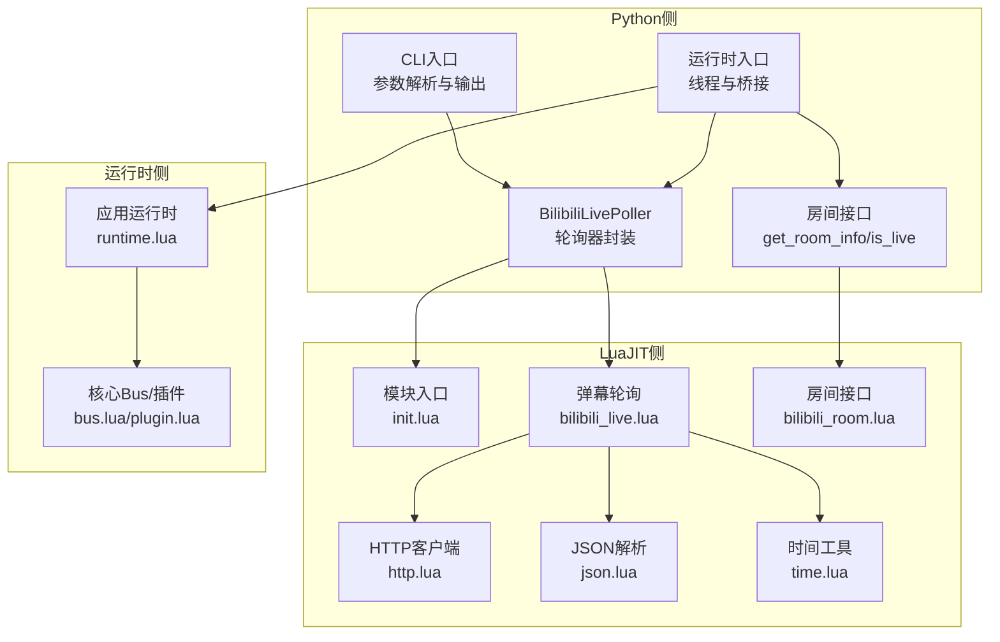
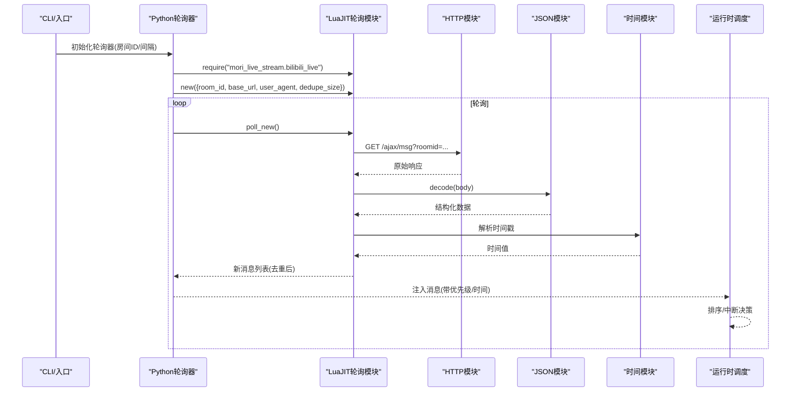
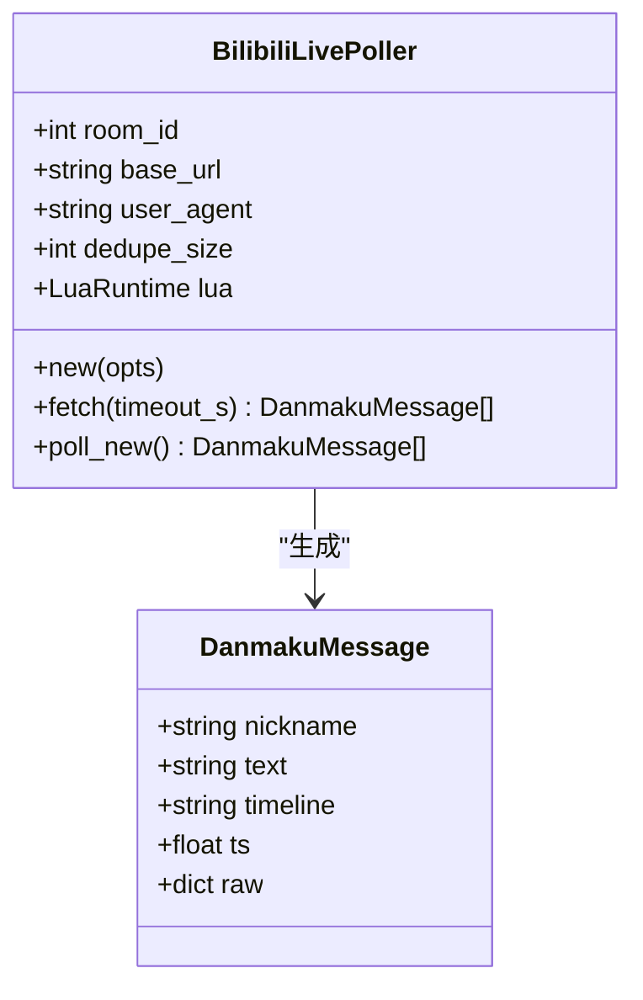
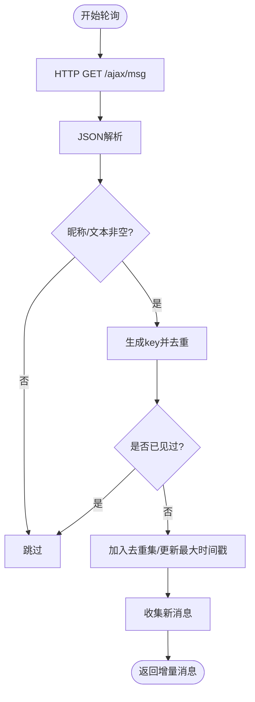
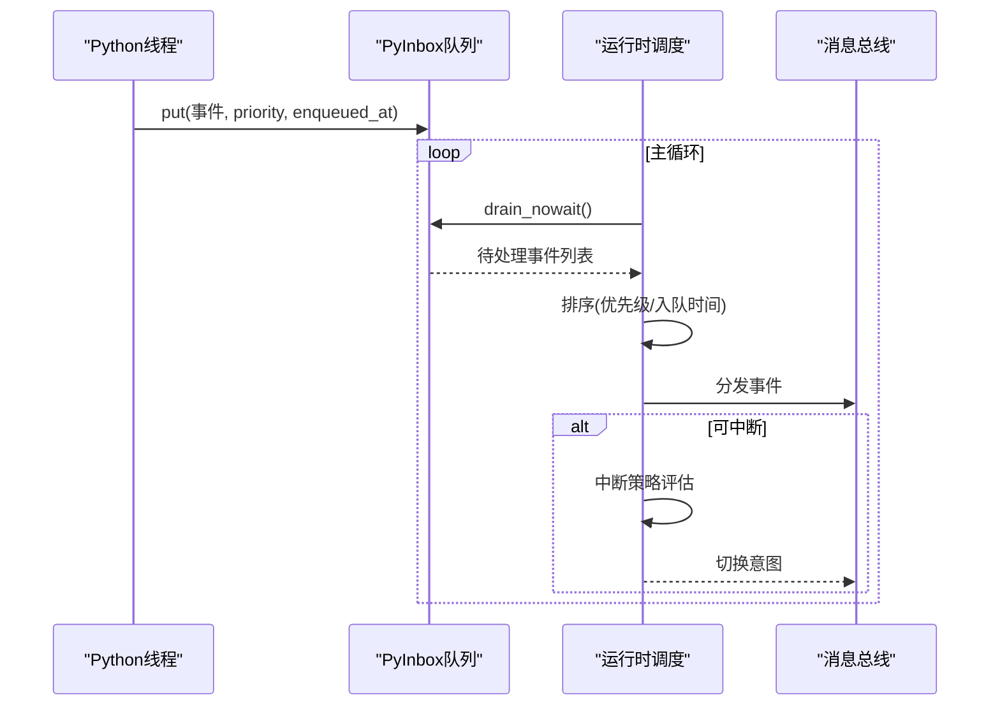
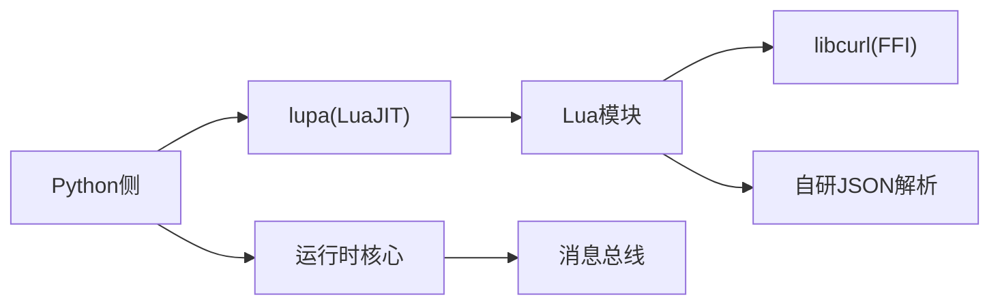

# 直播处理架构

<cite>
**本文引用的文件**
- [mori_live_stream/__init__.py](file://mori_live_stream/__init__.py)
- [mori_live_stream/bilibili_live.py](file://mori_live_stream/bilibili_live.py)
- [mori_live_stream/bilibili_room.py](file://mori_live_stream/bilibili_room.py)
- [mori_live_stream/cli.py](file://mori_live_stream/cli.py)
- [mori_live_stream/lua/mori_live_stream/init.lua](file://mori_live_stream/lua/mori_live_stream/init.lua)
- [mori_live_stream/lua/mori_live_stream/bilibili_live.lua](file://mori_live_stream/lua/mori_live_stream/bilibili_live.lua)
- [mori_live_stream/lua/mori_live_stream/bilibili_room.lua](file://mori_live_stream/lua/mori_live_stream/bilibili_room.lua)
- [mori_live_stream/lua/mori_live_stream/http.lua](file://mori_live_stream/lua/mori_live_stream/http.lua)
- [mori_live_stream/lua/mori_live_stream/json.lua](file://mori_live_stream/lua/mori_live_stream/json.lua)
- [mori_live_stream/lua/mori_live_stream/time.lua](file://mori_live_stream/lua/mori_live_stream/time.lua)
- [mori_runtime/entry.py](file://mori_runtime/entry.py)
- [mori_runtime/lua/mori/app/runtime.lua](file://mori_runtime/lua/mori/app/runtime.lua)
</cite>

## 目录
1. [引言](#引言)
2. [项目结构](#项目结构)
3. [核心组件](#核心组件)
4. [架构总览](#架构总览)
5. [详细组件分析](#详细组件分析)
6. [依赖分析](#依赖分析)
7. [性能考虑](#性能考虑)
8. [故障排除指南](#故障排除指南)
9. [结论](#结论)
10. [附录](#附录)

## 引言
本架构文档面向Mori直播处理系统，聚焦于Bilibili直播集成方案与运行时消息调度。文档涵盖以下主题：
- 轮询机制与弹幕解析：基于LuaJIT模块的轮询、去重、时间戳解析与消息结构化。
- 直播房间管理：房间信息获取、在线状态检查与离线检测。
- LuaJIT模块设计：模块加载、回调桥接、错误传播与类型转换。
- 消息优先级调度：优先级排序、实时处理与中断策略。
- 数据预处理：内容清洗、用户ID提取、时间戳处理。
- 配置指南、性能优化与故障排除。

## 项目结构
Mori直播处理系统由三层组成：
- Python侧：负责轮询器封装、命令行入口、与运行时的桥接与线程管理。
- LuaJIT侧：提供HTTP请求、JSON解析、时间工具与弹幕轮询逻辑。
- 运行时侧：负责消息队列、优先级调度、中断策略与消息注入。

图表来源
- [mori_live_stream/bilibili_live.py:93-221](file://mori_live_stream/bilibili_live.py#L93-L221)
- [mori_live_stream/lua/mori_live_stream/init.lua:1-6](file://mori_live_stream/lua/mori_live_stream/init.lua#L1-L6)
- [mori_live_stream/lua/mori_live_stream/bilibili_live.lua:70-242](file://mori_live_stream/lua/mori_live_stream/bilibili_live.lua#L70-L242)
- [mori_live_stream/lua/mori_live_stream/bilibili_room.lua:18-74](file://mori_live_stream/lua/mori_live_stream/bilibili_room.lua#L18-L74)
- [mori_live_stream/lua/mori_live_stream/http.lua:104-186](file://mori_live_stream/lua/mori_live_stream/http.lua#L104-L186)
- [mori_live_stream/lua/mori_live_stream/json.lua:288-303](file://mori_live_stream/lua/mori_live_stream/json.lua#L288-L303)
- [mori_live_stream/lua/mori_live_stream/time.lua:22-36](file://mori_live_stream/lua/mori_live_stream/time.lua#L22-L36)
- [mori_runtime/entry.py:489-829](file://mori_runtime/entry.py#L489-L829)
- [mori_runtime/lua/mori/app/runtime.lua:98-136](file://mori_runtime/lua/mori/app/runtime.lua#L98-L136)

章节来源
- [mori_live_stream/__init__.py:1-3](file://mori_live_stream/__init__.py#L1-L3)
- [mori_live_stream/bilibili_live.py:1-221](file://mori_live_stream/bilibili_live.py#L1-L221)
- [mori_live_stream/bilibili_room.py](file://mori_live_stream/bilibili_room.py)
- [mori_live_stream/cli.py:1-58](file://mori_live_stream/cli.py#L1-L58)
- [mori_live_stream/lua/mori_live_stream/init.lua:1-6](file://mori_live_stream/lua/mori_live_stream/init.lua#L1-L6)
- [mori_live_stream/lua/mori_live_stream/bilibili_live.lua:1-242](file://mori_live_stream/lua/mori_live_stream/bilibili_live.lua#L1-L242)
- [mori_live_stream/lua/mori_live_stream/bilibili_room.lua:1-74](file://mori_live_stream/lua/mori_live_stream/bilibili_room.lua#L1-L74)
- [mori_live_stream/lua/mori_live_stream/http.lua:1-190](file://mori_live_stream/lua/mori_live_stream/http.lua#L1-L190)
- [mori_live_stream/lua/mori_live_stream/json.lua:1-307](file://mori_live_stream/lua/mori_live_stream/json.lua#L1-L307)
- [mori_live_stream/lua/mori_live_stream/time.lua:1-38](file://mori_live_stream/lua/mori_live_stream/time.lua#L1-L38)
- [mori_runtime/entry.py:489-829](file://mori_runtime/entry.py#L489-L829)
- [mori_runtime/lua/mori/app/runtime.lua:1-200](file://mori_runtime/lua/mori/app/runtime.lua#L1-L200)

## 核心组件
- Python轮询器封装：负责初始化LuaJIT运行时、加载Lua模块、构造轮询器实例，并将Lua返回的消息序列化为Python对象。
- LuaJIT弹幕轮询模块：实现HTTP轮询、JSON解析、时间戳解析、消息去重与增量拉取。
- 房间接口模块：提供房间信息查询与在线状态判断。
- HTTP与JSON模块：基于LuaJIT FFI调用libcurl进行网络请求，自研JSON解析器以兼容性与可控性。
- 时间工具模块：提供高精度时间获取，用于去重窗口与时间戳计算。
- 运行时消息调度：负责从Python侧注入消息到Lua运行时，按优先级与时间排序，支持中断策略。

章节来源
- [mori_live_stream/bilibili_live.py:93-221](file://mori_live_stream/bilibili_live.py#L93-L221)
- [mori_live_stream/lua/mori_live_stream/bilibili_live.lua:70-242](file://mori_live_stream/lua/mori_live_stream/bilibili_live.lua#L70-L242)
- [mori_live_stream/lua/mori_live_stream/bilibili_room.lua:18-74](file://mori_live_stream/lua/mori_live_stream/bilibili_room.lua#L18-L74)
- [mori_live_stream/lua/mori_live_stream/http.lua:104-186](file://mori_live_stream/lua/mori_live_stream/http.lua#L104-L186)
- [mori_live_stream/lua/mori_live_stream/json.lua:288-303](file://mori_live_stream/lua/mori_live_stream/json.lua#L288-L303)
- [mori_live_stream/lua/mori_live_stream/time.lua:22-36](file://mori_live_stream/lua/mori_live_stream/time.lua#L22-L36)
- [mori_runtime/entry.py:489-829](file://mori_runtime/entry.py#L489-L829)
- [mori_runtime/lua/mori/app/runtime.lua:98-136](file://mori_runtime/lua/mori/app/runtime.lua#L98-L136)

## 架构总览
系统采用“Python桥接 + LuaJIT核心”的混合架构。Python侧负责配置、线程与运行时交互，LuaJIT侧负责高性能网络与数据处理。消息从B站轮询后进入Python侧的队列，再由运行时按优先级调度。

图表来源
- [mori_live_stream/bilibili_live.py:147-205](file://mori_live_stream/bilibili_live.py#L147-L205)
- [mori_live_stream/lua/mori_live_stream/bilibili_live.lua:208-237](file://mori_live_stream/lua/mori_live_stream/bilibili_live.lua#L208-L237)
- [mori_live_stream/lua/mori_live_stream/http.lua:104-186](file://mori_live_stream/lua/mori_live_stream/http.lua#L104-L186)
- [mori_live_stream/lua/mori_live_stream/json.lua:288-303](file://mori_live_stream/lua/mori_live_stream/json.lua#L288-L303)
- [mori_live_stream/lua/mori_live_stream/time.lua:22-36](file://mori_live_stream/lua/mori_live_stream/time.lua#L22-L36)
- [mori_runtime/entry.py:489-829](file://mori_runtime/entry.py#L489-L829)
- [mori_runtime/lua/mori/app/runtime.lua:98-136](file://mori_runtime/lua/mori/app/runtime.lua#L98-L136)

## 详细组件分析

### 组件A：Python轮询器封装（BilibiliLivePoller）
- 职责：初始化LuaJIT运行时、加载Lua模块、构造轮询器、拉取消息并序列化为Python对象。
- 关键点：
  - 使用LuaRuntime加载Lua模块路径，require目标模块。
  - 将Python字典转为Lua表传入Lua构造函数，获得轮询器实例。
  - 提供fetch/poll_new两种模式：前者一次性拉取全部，后者仅返回增量新消息。
  - 对Lua返回的多返回值进行解包，错误通过异常抛出。
  - 将Lua消息映射为Python数据类，字段包含昵称、文本、时间线、时间戳与原始数据。

图表来源
- [mori_live_stream/bilibili_live.py:93-221](file://mori_live_stream/bilibili_live.py#L93-L221)

章节来源
- [mori_live_stream/bilibili_live.py:93-221](file://mori_live_stream/bilibili_live.py#L93-L221)

### 组件B：LuaJIT弹幕轮询模块（bilibili_live.lua）
- 职责：基于HTTP轮询B站接口，解析JSON，提取弹幕字段，生成时间戳，维护去重窗口，返回增量消息。
- 关键点：
  - 构造函数接收房间ID、基础URL、User-Agent、去重大小等参数，初始化去重列表与最大时间戳。
  - fetch：拼接URL，设置请求头，调用HTTP模块GET，解析JSON，过滤空昵称/文本，生成消息数组。
  - poll_new：遍历fetch结果，使用make_key进行去重判定，记录最大时间戳，更新去重集合。
  - 去重策略：固定容量环形缓冲区，结合哈希集合，定期紧凑化，避免内存膨胀。
  - 时间戳解析：从时间线字符串解析为Unix秒，作为去重与排序依据。

图表来源
- [mori_live_stream/lua/mori_live_stream/bilibili_live.lua:149-237](file://mori_live_stream/lua/mori_live_stream/bilibili_live.lua#L149-L237)

章节来源
- [mori_live_stream/lua/mori_live_stream/bilibili_live.lua:70-242](file://mori_live_stream/lua/mori_live_stream/bilibili_live.lua#L70-L242)

### 组件C：房间信息与在线状态（bilibili_room.lua）
- 职责：通过房间信息接口获取标题、在线人数、直播状态等；提供is_live便捷判断。
- 关键点：
  - get_room_info：调用房间信息API，校验返回码，提取必要字段。
  - is_live：基于live_status判断是否在线。

章节来源
- [mori_live_stream/lua/mori_live_stream/bilibili_room.lua:18-74](file://mori_live_stream/lua/mori_live_stream/bilibili_room.lua#L18-L74)

### 组件D：HTTP与JSON模块（http.lua, json.lua）
- HTTP模块：
  - 基于LuaJIT FFI加载libcurl，设置URL、超时、User-Agent、请求头等。
  - 回调收集响应体，返回响应体与HTTP状态码；失败时返回错误信息。
- JSON模块：
  - 自研递归下降解析器，支持字符串、数字、布尔、null、数组与对象。
  - 处理转义、Unicode代理对与UTF-8编码，提供错误定位。

章节来源
- [mori_live_stream/lua/mori_live_stream/http.lua:104-186](file://mori_live_stream/lua/mori_live_stream/http.lua#L104-L186)
- [mori_live_stream/lua/mori_live_stream/json.lua:288-303](file://mori_live_stream/lua/mori_live_stream/json.lua#L288-L303)

### 组件E：时间工具（time.lua）
- 职责：提供高精度时间获取，优先使用gettimeofday，失败回退os.time。
- 用途：为去重与排序提供稳定的时间基准。

章节来源
- [mori_live_stream/lua/mori_live_stream/time.lua:22-36](file://mori_live_stream/lua/mori_live_stream/time.lua#L22-L36)

### 组件F：运行时消息调度（runtime.lua）与桥接（entry.py）
- Python桥接：
  - 启动独立线程执行轮询，周期性拉取消息，注入到PyInbox队列。
  - 支持“启动时回放历史N条”、“离线退出”、“轮询间隔”等参数。
  - 通过桥接记录统一消息格式，包含优先级、入队时间、来源等。
- Lua运行时：
  - 从Python侧drain消息，按优先级降序、入队时间升序排序。
  - 支持中断策略：根据当前意图优先级与待处理队列最高优先级决定是否打断。
  - bilibili专用压缩：同一轮次内保留最近一条bilibili消息，减少噪声。

图表来源
- [mori_runtime/entry.py:89-144](file://mori_runtime/entry.py#L89-L144)
- [mori_runtime/lua/mori/app/runtime.lua:98-136](file://mori_runtime/lua/mori/app/runtime.lua#L98-L136)
- [mori_runtime/lua/mori/app/runtime.lua:167-200](file://mori_runtime/lua/mori/app/runtime.lua#L167-L200)

章节来源
- [mori_runtime/entry.py:489-829](file://mori_runtime/entry.py#L489-L829)
- [mori_runtime/lua/mori/app/runtime.lua:98-136](file://mori_runtime/lua/mori/app/runtime.lua#L98-L136)
- [mori_runtime/lua/mori/app/runtime.lua:167-200](file://mori_runtime/lua/mori/app/runtime.lua#L167-L200)

## 依赖分析
- Python侧依赖：
  - lupa（LuaJIT运行时绑定），用于在Python中加载Lua模块。
  - 标准库：time、pathlib、typing、dataclasses。
- LuaJIT侧依赖：
  - FFI加载libcurl，自研JSON解析器，时间工具封装。
- 运行时侧依赖：
  - 核心Bus与插件框架，消息总线与插件化扩展。
- 外部接口：
  - B站弹幕轮询接口：/ajax/msg
  - B站房间信息接口：/room/v1/Room/get_info

图表来源
- [mori_live_stream/bilibili_live.py:110-114](file://mori_live_stream/bilibili_live.py#L110-L114)
- [mori_live_stream/lua/mori_live_stream/http.lua:43-49](file://mori_live_stream/lua/mori_live_stream/http.lua#L43-L49)
- [mori_runtime/entry.py:1-52](file://mori_runtime/entry.py#L1-L52)

章节来源
- [mori_live_stream/bilibili_live.py:110-114](file://mori_live_stream/bilibili_live.py#L110-L114)
- [mori_live_stream/lua/mori_live_stream/http.lua:43-49](file://mori_live_stream/lua/mori_live_stream/http.lua#L43-L49)
- [mori_runtime/entry.py:1-52](file://mori_runtime/entry.py#L1-L52)

## 性能考虑
- 轮询频率与延迟：
  - 增大轮询间隔可降低请求压力，但会增加延迟；默认2秒平衡实时性与开销。
- 去重窗口：
  - dedupe_size控制去重集合容量，过大导致内存占用上升，过小可能导致重复消息被误判。
- 网络层：
  - 使用libcurl异步回调聚合响应体，避免阻塞；合理设置连接/读取超时。
- 解析层：
  - 自研JSON解析器可控性强，避免外部依赖；注意错误路径的健壮性。
- 运行时调度：
  - 优先级排序与中断策略减少高优先级消息等待时间；批量drain提升吞吐。
- 内存管理：
  - Lua侧去重列表定期紧凑化，Python侧队列有上限，防止内存泄漏。

## 故障排除指南
- 缺少依赖
  - 现象：初始化轮询器时报错，提示缺少lupa。
  - 处理：安装依赖并激活虚拟环境后重新运行。
- HTTP请求失败
  - 现象：fetch/poll_new返回错误，包含HTTP状态码与错误描述。
  - 处理：检查网络连通性、User-Agent、URL拼接与超时设置。
- JSON解析失败
  - 现象：返回“invalid_json”或“decode_failed”。
  - 处理：确认响应体为有效JSON；检查编码与转义。
- 离线退出
  - 现象：启用“离线退出”后，房间下播即退出。
  - 处理：调整参数或关闭该选项以便持续监听。
- 消息未到达
  - 现象：运行时未见弹幕。
  - 处理：确认Python线程已启动、队列未满、运行时调度正常。

章节来源
- [mori_live_stream/bilibili_live.py:110-114](file://mori_live_stream/bilibili_live.py#L110-L114)
- [mori_live_stream/lua/mori_live_stream/bilibili_live.lua:164-175](file://mori_live_stream/lua/mori_live_stream/bilibili_live.lua#L164-L175)
- [mori_live_stream/lua/mori_live_stream/json.lua:288-303](file://mori_live_stream/lua/mori_live_stream/json.lua#L288-L303)
- [mori_runtime/entry.py:489-829](file://mori_runtime/entry.py#L489-L829)

## 结论
本架构以轻量、可控为目标，通过Python桥接与LuaJIT核心实现高实时性的B站弹幕轮询与处理。去重、时间戳解析与优先级调度确保了消息质量与运行时稳定性。通过合理的参数配置与性能优化，可在保证实时性的同时降低资源消耗。

## 附录

### 配置指南
- CLI参数
  - --room-id：房间ID（必填或通过URL解析）。
  - --room-url：房间URL，自动提取ID。
  - --interval：轮询间隔（秒）。
  - --stop-after：停止时间（秒，0为无限）。
  - --include-history：启动时打印当前房间消息一次。
- 运行时参数（入口）
  - --bilibili-room-id/--bilibili-room-url：启用B站轮询。
  - --bilibili-interval：轮询间隔。
  - --bilibili-catchup：启动时回放最近N条消息。
  - --bilibili-exit-when-offline：房间下播即退出。
  - --bilibili-live-check-interval：在线状态检查间隔。

章节来源
- [mori_live_stream/cli.py:22-58](file://mori_live_stream/cli.py#L22-L58)
- [mori_runtime/entry.py:813-829](file://mori_runtime/entry.py#L813-L829)