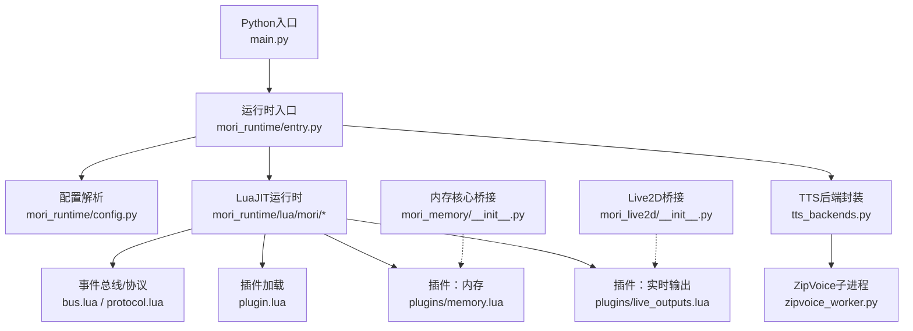
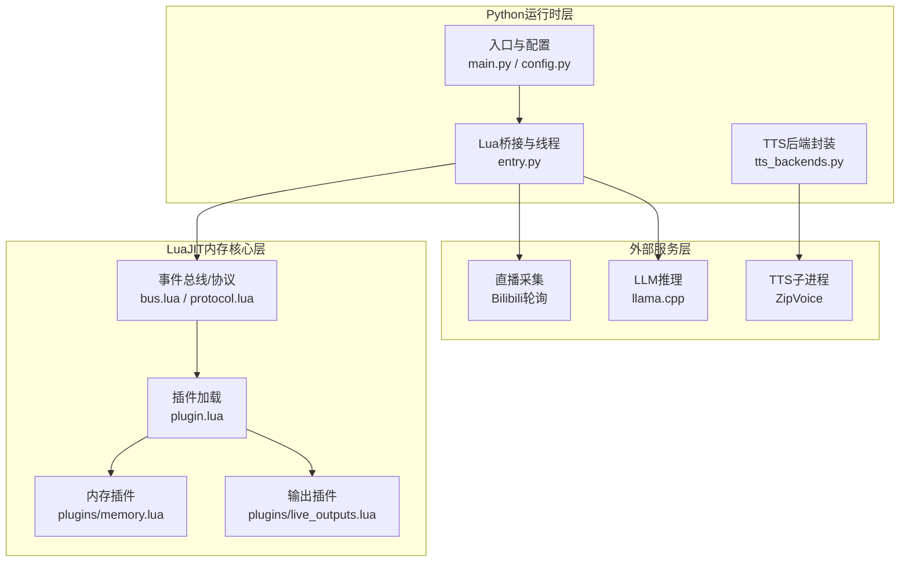
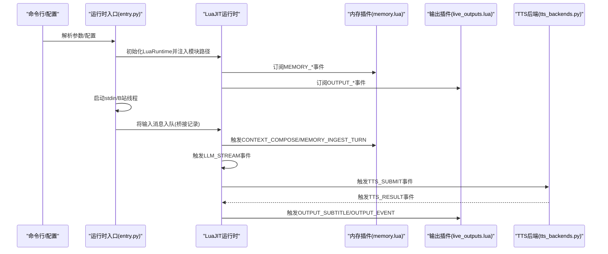
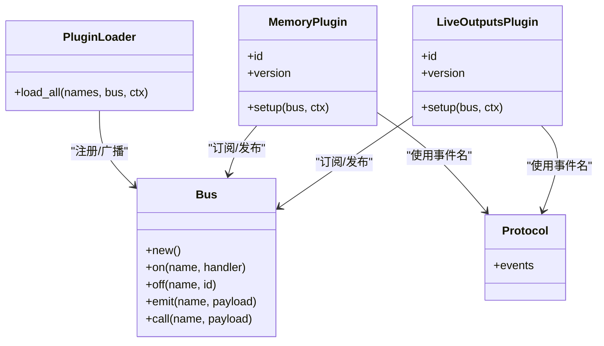
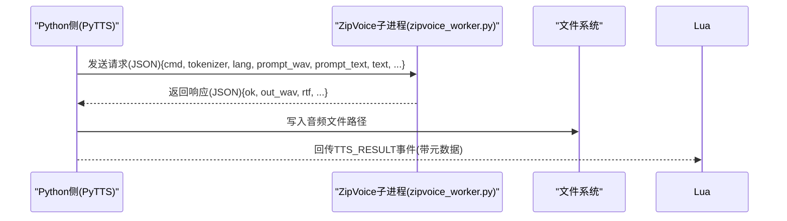
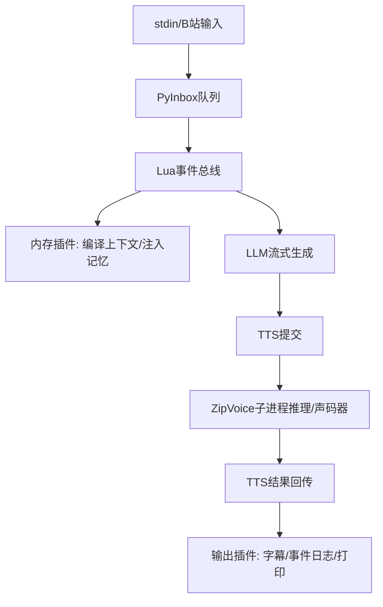
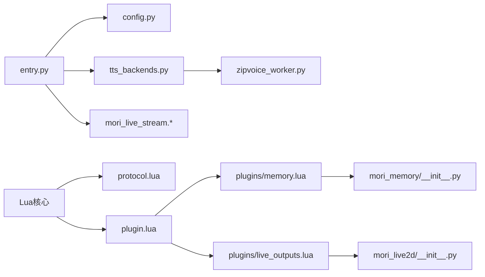

# 系统架构

<cite>
**本文引用的文件**
- [main.py](file://main.py)
- [entry.py](file://mori_runtime/entry.py)
- [config.py](file://mori_runtime/config.py)
- [tts_backends.py](file://mori_runtime/tts_backends.py)
- [zipvoice_worker.py](file://mori_runtime/zipvoice_worker.py)
- [plugin.lua](file://mori_runtime/lua/mori/core/plugin.lua)
- [bus.lua](file://mori_runtime/lua/mori/core/bus.lua)
- [protocol.lua](file://mori_runtime/lua/mori/core/protocol.lua)
- [memory.lua](file://mori_runtime/lua/mori/plugins/memory.lua)
- [live_outputs.lua](file://mori_runtime/lua/mori/plugins/live_outputs.lua)
- [__init__.py](file://mori_memory/__init__.py)
- [__init__.py](file://mori_live2d/__init__.py)
</cite>

## 目录
1. [引言](#引言)
2. [项目结构](#项目结构)
3. [核心组件](#核心组件)
4. [架构总览](#架构总览)
5. [详细组件分析](#详细组件分析)
6. [依赖分析](#依赖分析)
7. [性能考虑](#性能考虑)
8. [故障排查指南](#故障排查指南)
9. [结论](#结论)
10. [附录](#附录)

## 引言
本架构文档面向Mori系统，聚焦其分层架构与跨语言互操作设计。系统采用“Python运行时层 + LuaJIT内存核心层 + 外部服务层”的三层协同模式：Python负责入口、配置、线程调度、消息桥接与TTS子系统；LuaJIT负责实时内存编排、决策与事件总线；外部服务层涵盖直播采集、推理引擎与TTS后端。文档将深入解析模块间通信机制（尤其是lupa绑定）、事件驱动的消息队列、插件化架构、数据流路径以及关键设计决策。

## 项目结构
- Python入口与运行时
  - 入口脚本：main.py 调用 mori_runtime.entry.run_cli 启动
  - 运行时核心：mori_runtime/entry.py 提供参数解析、LuaJIT初始化、消息桥接、TTS执行器、输入源线程（stdin、B站直播）
  - 配置管理：mori_runtime/config.py 解析统一配置文件，合并默认值与相对路径解析
  - TTS后端：mori_runtime/tts_backends.py 统一封装 LuxTTS 与 ZipVoice 子进程工作流
  - ZipVoice子进程：mori_runtime/zipvoice_worker.py 实现推理与声码器流水线
- LuaJIT核心与插件
  - 事件总线与协议：mori_runtime/lua/mori/core/bus.lua、protocol.lua
  - 插件加载：mori_runtime/lua/mori/core/plugin.lua
  - 插件示例：memory.lua（内存桥接）、live_outputs.lua（字幕/事件日志/打印）
- 内存与Live2D桥接
  - mori_memory/__init__.py 提供LuaJIT对内存核心的Python桥接说明
  - mori_live2d/__init__.py 提供Live2D前端说明

**图表来源**
- [main.py:1-13](file://main.py#L1-L13)
- [entry.py:796-1084](file://mori_runtime/entry.py#L796-L1084)
- [config.py:188-270](file://mori_runtime/config.py#L188-L270)
- [bus.lua:1-95](file://mori_runtime/lua/mori/core/bus.lua#L1-L95)
- [protocol.lua:1-35](file://mori_runtime/lua/mori/core/protocol.lua#L1-L35)
- [plugin.lua:1-52](file://mori_runtime/lua/mori/core/plugin.lua#L1-L52)
- [memory.lua:1-30](file://mori_runtime/lua/mori/plugins/memory.lua#L1-L30)
- [live_outputs.lua:1-114](file://mori_runtime/lua/mori/plugins/live_outputs.lua#L1-L114)
- [tts_backends.py:1-120](file://mori_runtime/tts_backends.py#L1-L120)
- [zipvoice_worker.py:446-729](file://mori_runtime/zipvoice_worker.py#L446-L729)
- [__init__.py:1-3](file://mori_memory/__init__.py#L1-L3)
- [__init__.py:1-3](file://mori_live2d/__init__.py#L1-L3)

**章节来源**
- [main.py:1-13](file://main.py#L1-L13)
- [entry.py:796-1084](file://mori_runtime/entry.py#L796-L1084)
- [config.py:188-270](file://mori_runtime/config.py#L188-L270)

## 核心组件
- Python运行时层
  - 参数与配置：统一解析命令行与JSON配置，支持相对路径解析与键映射
  - LuaJIT桥接：通过lupa创建LuaRuntime，注入模块搜索路径，桥接Python对象到Lua表
  - 输入源线程：stdin与B站直播轮询线程，将消息入队至PyInbox
  - LLM/TTS执行器：PyLLM提供流式生成回调；PyTTS封装任务提交、并发执行与结果回传
  - 事件循环：在Python侧维护消息桥接与插件生命周期
- LuaJIT内存核心层
  - 事件总线：Bus提供订阅/发布、调用（call）与错误冒泡
  - 协议常量：定义模块生命周期、输入、记忆、语音意图、LLM流、TTS、输出等事件名
  - 插件系统：按约定加载插件，注册生命周期事件，建立上下文桥接
- 外部服务层
  - 直播采集：B站轮询器与房间信息查询
  - 推理引擎：llama.cpp服务（通过MoriPipeline与参数传递）
  - TTS后端：LuxTTS与ZipVoice（含子进程工作流与声码器）

**章节来源**
- [entry.py:414-438](file://mori_runtime/entry.py#L414-L438)
- [entry.py:452-579](file://mori_runtime/entry.py#L452-L579)
- [entry.py:146-188](file://mori_runtime/entry.py#L146-L188)
- [entry.py:203-412](file://mori_runtime/entry.py#L203-L412)
- [bus.lua:14-91](file://mori_runtime/lua/mori/core/bus.lua#L14-L91)
- [protocol.lua:1-35](file://mori_runtime/lua/mori/core/protocol.lua#L1-L35)
- [plugin.lua:13-48](file://mori_runtime/lua/mori/core/plugin.lua#L13-L48)
- [memory.lua:8-26](file://mori_runtime/lua/mori/plugins/memory.lua#L8-L26)
- [live_outputs.lua:63-111](file://mori_runtime/lua/mori/plugins/live_outputs.lua#L63-L111)

## 架构总览
Mori采用事件驱动的插件化架构。Python侧负责系统启动、配置、输入采集、LLM与TTS执行，并通过lupa将Python对象桥接到LuaJIT环境。LuaJIT侧通过事件总线组织各插件协作，内存插件负责上下文编译与记忆注入，输出插件负责字幕、事件日志与标准输出。ZipVoice通过独立子进程承载推理与声码器，Python侧以IPC方式提交请求并接收指标与音频路径。

**图表来源**
- [entry.py:796-1084](file://mori_runtime/entry.py#L796-L1084)
- [bus.lua:1-95](file://mori_runtime/lua/mori/core/bus.lua#L1-L95)
- [protocol.lua:1-35](file://mori_runtime/lua/mori/core/protocol.lua#L1-L35)
- [plugin.lua:1-52](file://mori_runtime/lua/mori/core/plugin.lua#L1-L52)
- [memory.lua:1-30](file://mori_runtime/lua/mori/plugins/memory.lua#L1-L30)
- [live_outputs.lua:1-114](file://mori_runtime/lua/mori/plugins/live_outputs.lua#L1-L114)
- [tts_backends.py:525-800](file://mori_runtime/tts_backends.py#L525-L800)
- [zipvoice_worker.py:446-729](file://mori_runtime/zipvoice_worker.py#L446-L729)

## 详细组件分析

### Python运行时层
- 参数与配置
  - 支持从命令行与JSON配置合并默认值，自动解析相对路径，键映射到运行时参数
- LuaJIT初始化与模块路径
  - 动态追加package.path，加载mori_runtime、mori_memory、mori_live_stream的Lua模块
- 消息桥接与队列
  - PyInbox基于queue.Queue实现有界缓冲，支持超时入队与drain批量拉取
- 输入源线程
  - stdin线程：逐行读取并入队，支持退出指令
  - B站直播线程：可选catchup，定时轮询，支持离线退出策略
- LLM与TTS执行器
  - PyLLM：将Python生成器的增量文本通过回调传给Lua侧
  - PyTTS：线程池并发合成，支持取消指定intent、批量drain结果

**图表来源**
- [entry.py:414-438](file://mori_runtime/entry.py#L414-L438)
- [entry.py:452-579](file://mori_runtime/entry.py#L452-L579)
- [entry.py:146-188](file://mori_runtime/entry.py#L146-L188)
- [entry.py:203-412](file://mori_runtime/entry.py#L203-L412)
- [protocol.lua:1-35](file://mori_runtime/lua/mori/core/protocol.lua#L1-L35)
- [memory.lua:8-26](file://mori_runtime/lua/mori/plugins/memory.lua#L8-L26)
- [live_outputs.lua:63-111](file://mori_runtime/lua/mori/plugins/live_outputs.lua#L63-L111)
- [tts_backends.py:525-800](file://mori_runtime/tts_backends.py#L525-L800)

**章节来源**
- [config.py:188-270](file://mori_runtime/config.py#L188-L270)
- [entry.py:414-438](file://mori_runtime/entry.py#L414-L438)
- [entry.py:452-579](file://mori_runtime/entry.py#L452-L579)
- [entry.py:146-188](file://mori_runtime/entry.py#L146-L188)
- [entry.py:203-412](file://mori_runtime/entry.py#L203-L412)

### LuaJIT事件总线与插件系统
- 事件总线Bus
  - 提供on/emit/call/off能力，call返回首个非nil响应，异常通过BUS_ERROR事件上报
- 协议Protocol
  - 定义模块生命周期、输入、记忆、LLM流、TTS、输出等事件名
- 插件加载Plugin
  - 加载Lua模块，校验setup函数签名，广播MODULE_ANNOUNCE/MODULE_READY/MODULE_ERROR
- 插件示例
  - memory.lua：向ctx注入mori_memory并订阅记忆事件
  - live_outputs.lua：根据配置写字幕文件、事件日志，标准输出打印最终字幕

**图表来源**
- [bus.lua:14-91](file://mori_runtime/lua/mori/core/bus.lua#L14-L91)
- [plugin.lua:13-48](file://mori_runtime/lua/mori/core/plugin.lua#L13-L48)
- [memory.lua:8-26](file://mori_runtime/lua/mori/plugins/memory.lua#L8-L26)
- [live_outputs.lua:63-111](file://mori_runtime/lua/mori/plugins/live_outputs.lua#L63-L111)
- [protocol.lua:1-35](file://mori_runtime/lua/mori/core/protocol.lua#L1-L35)

**章节来源**
- [bus.lua:14-91](file://mori_runtime/lua/mori/core/bus.lua#L14-L91)
- [plugin.lua:13-48](file://mori_runtime/lua/mori/core/plugin.lua#L13-L48)
- [protocol.lua:1-35](file://mori_runtime/lua/mori/core/protocol.lua#L1-L35)
- [memory.lua:8-26](file://mori_runtime/lua/mori/plugins/memory.lua#L8-L26)
- [live_outputs.lua:63-111](file://mori_runtime/lua/mori/plugins/live_outputs.lua#L63-L111)

### TTS子系统与ZipVoice工作流
- 后端选择与参数
  - 支持lux与zipvoice两种后端，提供模型、设备、采样步数、引导系数、速度、平滑输出等参数
- ZipVoice子进程
  - 通过zipvoice_worker.py启动推理与声码器，支持预热缓存、持久化提示特征、RTF统计
  - Python侧通过stdin/stdout与子进程交换JSON请求/响应
- 并发与取消
  - PyTTS使用ThreadPoolExecutor并发合成，支持按intent取消未完成任务，drain批量回传结果

**图表来源**
- [tts_backends.py:525-800](file://mori_runtime/tts_backends.py#L525-L800)
- [zipvoice_worker.py:625-725](file://mori_runtime/zipvoice_worker.py#L625-L725)
- [protocol.lua:24-27](file://mori_runtime/lua/mori/core/protocol.lua#L24-L27)

**章节来源**
- [tts_backends.py:1-120](file://mori_runtime/tts_backends.py#L1-L120)
- [tts_backends.py:525-800](file://mori_runtime/tts_backends.py#L525-L800)
- [zipvoice_worker.py:446-729](file://mori_runtime/zipvoice_worker.py#L446-L729)

### 数据流：从用户输入到最终输出
- 输入阶段
  - stdin线程：逐行读取文本，入队至PyInbox
  - B站直播线程：轮询弹幕，提取用户ID/昵称/时间线，入队至PyInbox
- 处理阶段
  - Lua侧事件总线触发：INPUT_TEXT → CONTEXT_COMPOSE → LLM_STREAM
  - 记忆插件：MEMORY_COMPILE_CONTEXT/MEMORY_INGEST_TURN
  - 输出插件：OUTPUT_SUBTITLE/OUTPUT_EVENT/OUTPUT_PRINT
- TTS阶段
  - TTS_SUBMIT → ZipVoice子进程推理/声码器 → TTS_RESULT → 输出字幕/事件日志

**图表来源**
- [entry.py:452-579](file://mori_runtime/entry.py#L452-L579)
- [protocol.lua:10-32](file://mori_runtime/lua/mori/core/protocol.lua#L10-L32)
- [memory.lua:8-26](file://mori_runtime/lua/mori/plugins/memory.lua#L8-L26)
- [live_outputs.lua:63-111](file://mori_runtime/lua/mori/plugins/live_outputs.lua#L63-L111)
- [tts_backends.py:525-800](file://mori_runtime/tts_backends.py#L525-L800)

**章节来源**
- [entry.py:452-579](file://mori_runtime/entry.py#L452-L579)
- [protocol.lua:10-32](file://mori_runtime/lua/mori/core/protocol.lua#L10-L32)
- [memory.lua:8-26](file://mori_runtime/lua/mori/plugins/memory.lua#L8-L26)
- [live_outputs.lua:63-111](file://mori_runtime/lua/mori/plugins/live_outputs.lua#L63-L111)

## 依赖分析
- Python层
  - entry.py依赖config.py、tts_backends.py、mori_llm.pipeline（通过MoriPipeline）、mori_live_stream.bilibili_live等
  - tts_backends.py依赖zipvoice_worker.py（通过子进程），并封装ZipVoiceLangDetector、PromptEntry等
- Lua层
  - plugin.lua依赖protocol.lua；memory.lua依赖mori_memory；live_outputs.lua依赖json与protocol.lua
- 内存与Live2D桥接
  - mori_memory/__init__.py声明为“Python桥接LuaJIT内存核心”
  - mori_live2d/__init__.py声明为“Live2D前端”

**图表来源**
- [entry.py:13-41](file://mori_runtime/entry.py#L13-L41)
- [config.py:188-270](file://mori_runtime/config.py#L188-L270)
- [tts_backends.py:1-120](file://mori_runtime/tts_backends.py#L1-L120)
- [zipvoice_worker.py:446-729](file://mori_runtime/zipvoice_worker.py#L446-L729)
- [protocol.lua:1-35](file://mori_runtime/lua/mori/core/protocol.lua#L1-L35)
- [plugin.lua:1-52](file://mori_runtime/lua/mori/core/plugin.lua#L1-L52)
- [memory.lua:1-30](file://mori_runtime/lua/mori/plugins/memory.lua#L1-L30)
- [live_outputs.lua:1-114](file://mori_runtime/lua/mori/plugins/live_outputs.lua#L1-L114)
- [__init__.py:1-3](file://mori_memory/__init__.py#L1-L3)
- [__init__.py:1-3](file://mori_live2d/__init__.py#L1-L3)

**章节来源**
- [entry.py:13-41](file://mori_runtime/entry.py#L13-L41)
- [tts_backends.py:1-120](file://mori_runtime/tts_backends.py#L1-L120)
- [zipvoice_worker.py:446-729](file://mori_runtime/zipvoice_worker.py#L446-L729)
- [protocol.lua:1-35](file://mori_runtime/lua/mori/core/protocol.lua#L1-L35)
- [plugin.lua:1-52](file://mori_runtime/lua/mori/core/plugin.lua#L1-L52)
- [memory.lua:1-30](file://mori_runtime/lua/mori/plugins/memory.lua#L1-L30)
- [live_outputs.lua:1-114](file://mori_runtime/lua/mori/plugins/live_outputs.lua#L1-L114)
- [__init__.py:1-3](file://mori_memory/__init__.py#L1-L3)
- [__init__.py:1-3](file://mori_live2d/__init__.py#L1-L3)

## 性能考虑
- LuaJIT选择
  - LuaJIT具备高性能即时编译与轻量级协程，适合实时内存编排与事件驱动逻辑，降低Python-GIL影响
- Python桥接
  - lupa桥接需注意对象序列化成本，尽量使用轻量结构；桥接记录避免重复转换
- 并发与背压
  - PyInbox使用有界队列与超时入队，防止内存膨胀；B站轮询间隔与catchup数量可调
  - PyTTS使用线程池并发，drain批量回传减少事件风暴
- ZipVoice子进程
  - 预热提示缓存与持久化缓存减少重复特征计算；按token块切分与交叉淡化拼接提升长句质量
- I/O与磁盘
  - 输出插件写文件与事件日志需考虑磁盘吞吐；建议异步落盘或批量化写入

[本节为通用指导，无需特定文件引用]

## 故障排查指南
- LuaJIT依赖缺失
  - 现象：导入lupa失败
  - 处理：安装依赖并确保虚拟环境激活
- ZipVoice子进程异常
  - 现象：子进程提前退出或写入失败
  - 处理：检查python_bin、repo、model_dir、checkpoint存在性；查看stderr与响应中的error字段
- TTS提交参数缺失
  - 现象：报错缺少intent_id或out_wav路径
  - 处理：确保提交负载包含必要字段；固定路由提示或清单中至少提供zh/ja之一
- 输入源离线退出
  - 现象：B站离线后自动发送退出事件
  - 处理：调整exit_when_offline与live_check_interval参数
- 事件总线错误
  - 现象：插件setup或handler抛错，BUS_ERROR被触发
  - 处理：检查插件返回格式与setup签名；捕获异常并记录错误

**章节来源**
- [entry.py:414-418](file://mori_runtime/entry.py#L414-L418)
- [tts_backends.py:668-754](file://mori_runtime/tts_backends.py#L668-L754)
- [zipvoice_worker.py:637-725](file://mori_runtime/zipvoice_worker.py#L637-L725)
- [live_outputs.lua:63-111](file://mori_runtime/lua/mori/plugins/live_outputs.lua#L63-L111)
- [bus.lua:50-91](file://mori_runtime/lua/mori/core/bus.lua#L50-L91)

## 结论
Mori通过清晰的分层与事件驱动架构实现了高内聚低耦合的系统设计。Python层负责系统控制与外部集成，LuaJIT层专注实时内存与插件编排，ZipVoice子进程承担重型推理任务。lupa桥接使跨语言协作自然高效，事件总线与插件化进一步增强了扩展性与可维护性。该架构在保证实时性的同时，兼顾了多模态输出协调与跨语言生态整合。

[本节为总结，无需特定文件引用]

## 附录
- 关键设计决策
  - 选择LuaJIT作为内存核心：兼顾性能与脚本灵活性，适配事件驱动与插件化
  - 使用ZipVoice子进程：隔离重型推理与声码器，便于资源控制与稳定性
  - lupa桥接：在Python侧保持强类型与并发控制，在Lua侧获得动态扩展
- 建议实践
  - 严格遵循插件setup签名与事件命名规范
  - 对长文本进行分块与缓存，优化ZipVoice推理效率
  - 在生产环境中启用事件日志与指标上报，便于问题定位

[本节为补充说明，无需特定文件引用]