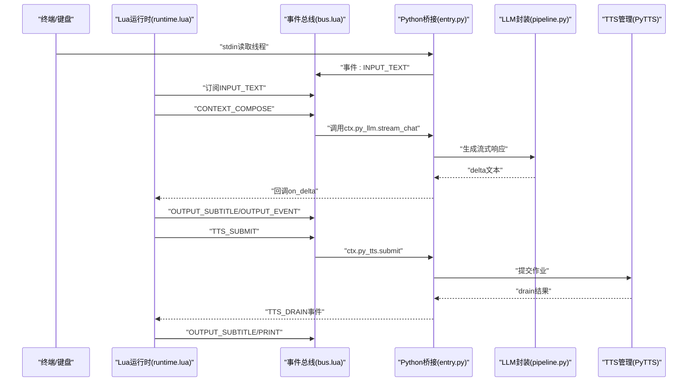
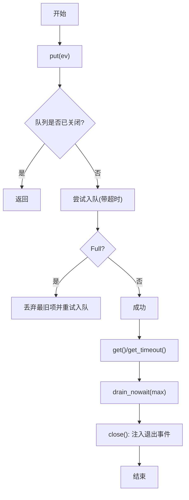
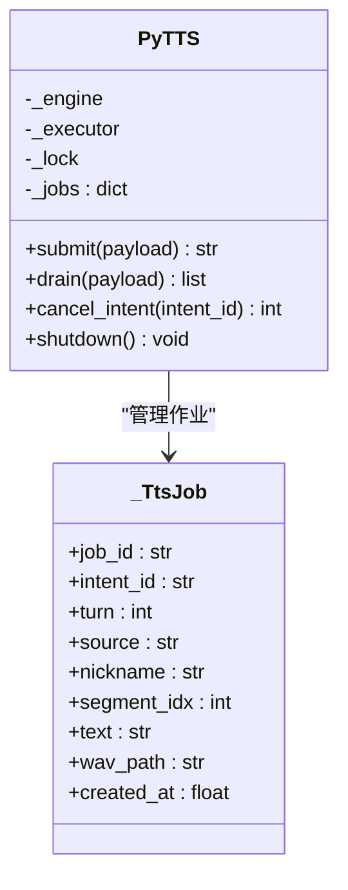
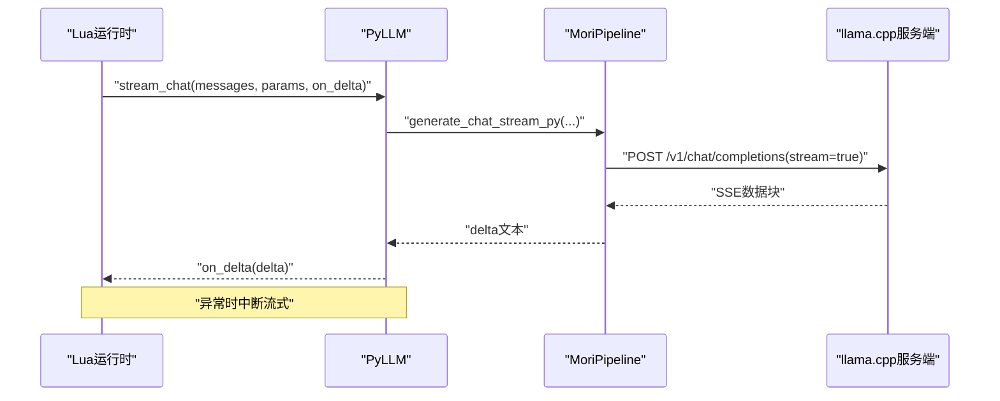
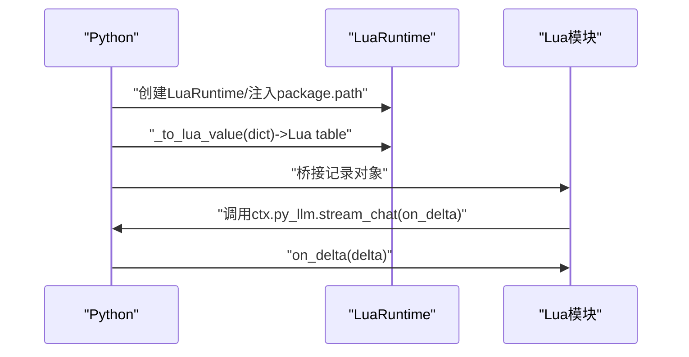
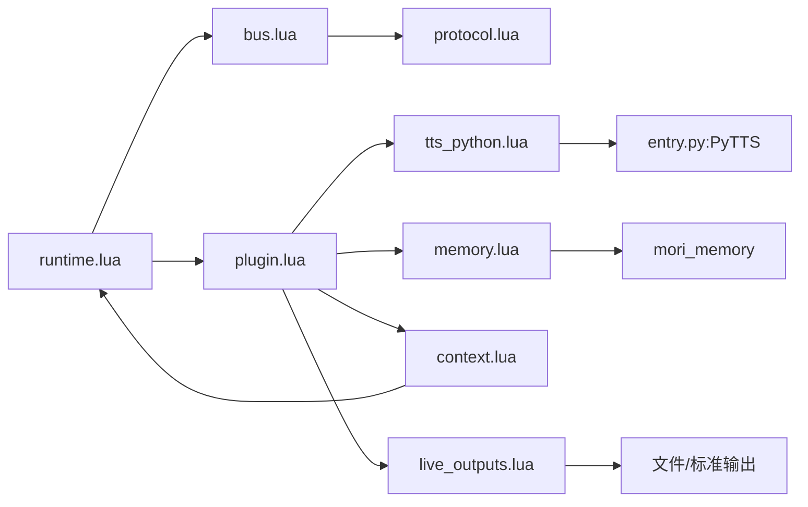
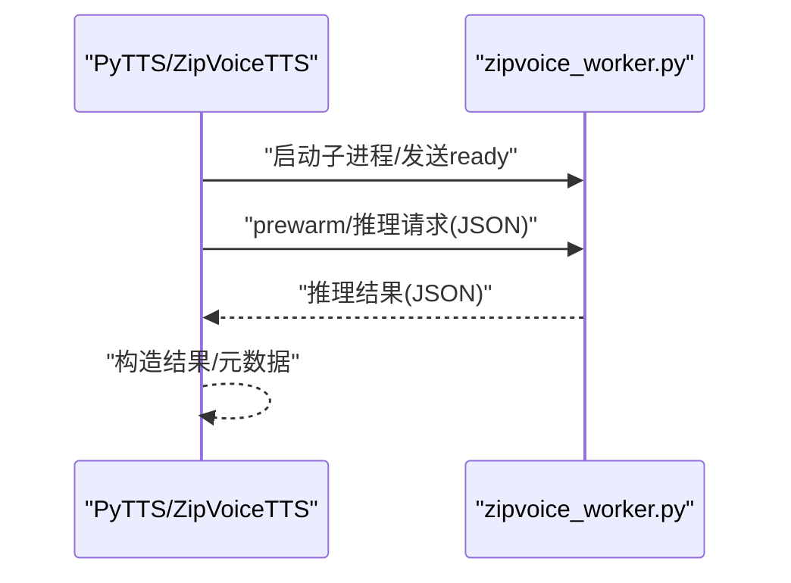
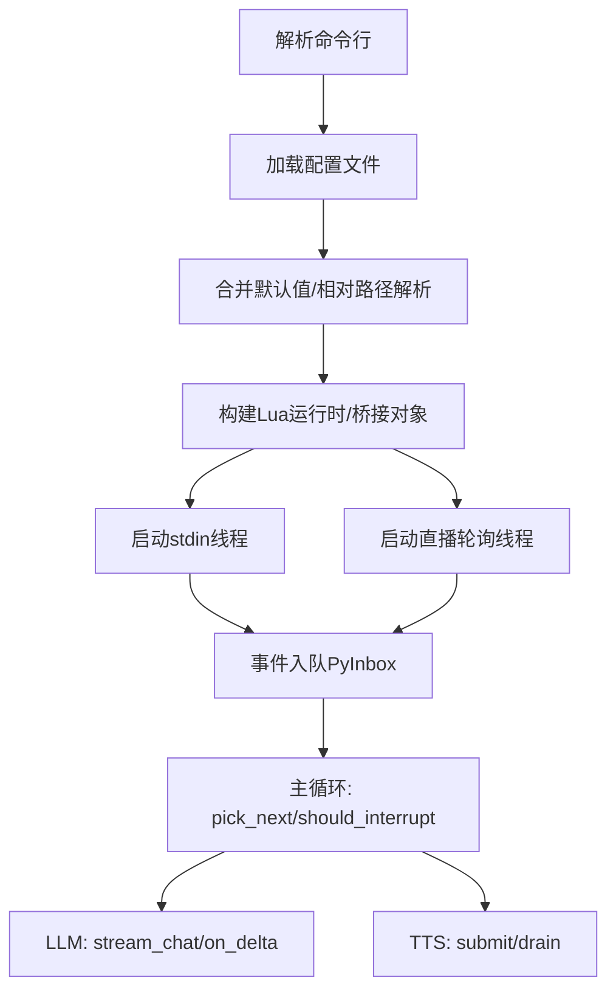
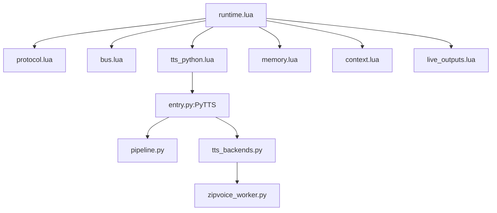

# 运行时架构

<cite>
**本文引用的文件**
- [mori_runtime/entry.py](file://mori_runtime/entry.py)
- [mori_runtime/config.py](file://mori_runtime/config.py)
- [mori_runtime/tts_backends.py](file://mori_runtime/tts_backends.py)
- [mori_runtime/zipvoice_worker.py](file://mori_runtime/zipvoice_worker.py)
- [mori_runtime/lua/mori/app/runtime.lua](file://mori_runtime/lua/mori/app/runtime.lua)
- [mori_runtime/lua/mori/core/bus.lua](file://mori_runtime/lua/mori/core/bus.lua)
- [mori_runtime/lua/mori/core/plugin.lua](file://mori_runtime/lua/mori/core/plugin.lua)
- [mori_runtime/lua/mori/core/protocol.lua](file://mori_runtime/lua/mori/core/protocol.lua)
- [mori_runtime/lua/mori/plugins/tts_python.lua](file://mori_runtime/lua/mori/plugins/tts_python.lua)
- [mori_runtime/lua/mori/plugins/memory.lua](file://mori_runtime/lua/mori/plugins/memory.lua)
- [mori_runtime/lua/mori/plugins/context.lua](file://mori_runtime/lua/mori/plugins/context.lua)
- [mori_runtime/lua/mori/plugins/live_outputs.lua](file://mori_runtime/lua/mori/plugins/live_outputs.lua)
- [mori_llm/pipeline.py](file://mori_llm/pipeline.py)
- [mori_llm/llama_cpp_cli.py](file://mori_llm/llama_cpp_cli.py)
</cite>

## 目录
1. [简介](#简介)
2. [项目结构](#项目结构)
3. [核心组件](#核心组件)
4. [架构总览](#架构总览)
5. [详细组件分析](#详细组件分析)
6. [依赖分析](#依赖分析)
7. [性能考虑](#性能考虑)
8. [故障排查指南](#故障排查指南)
9. [结论](#结论)
10. [附录](#附录)

## 简介
本文件面向Mori运行时系统，系统以“Lua运行时 + llama.cpp + 记忆模块 + 可选TTS”为核心，采用事件驱动的桥接设计，通过Python与Lua之间的双向桥接实现消息队列、LLM推理封装与TTS多线程管理。运行时支持从stdin读取命令、直播轮询、以及异步TTS合成，并通过插件化协议实现模块解耦。

## 项目结构
- Python侧
  - 运行时入口与桥接：mori_runtime/entry.py
  - 配置解析与默认值：mori_runtime/config.py
  - TTS后端与ZipVoice子进程：mori_runtime/tts_backends.py、mori_runtime/zipvoice_worker.py
  - LLM推理封装：mori_llm/pipeline.py、mori_llm/llama_cpp_cli.py
- Lua侧
  - 应用主循环与意图处理：mori_runtime/lua/mori/app/runtime.lua
  - 事件总线与协议：mori_runtime/lua/mori/core/bus.lua、mori_runtime/lua/mori/core/protocol.lua、mori_runtime/lua/mori/core/plugin.lua
  - 插件：tts_python.lua、memory.lua、context.lua、live_outputs.lua

```mermaid
graph TB
subgraph "Python侧"
E["entry.py<br/>运行时入口/桥接"]
C["config.py<br/>配置解析/默认值"]
T["tts_backends.py<br/>TTS后端/ZipVoice子进程"]
Z["zipvoice_worker.py<br/>ZipVoice推理子进程"]
L["pipeline.py<br/>LLM封装(HTTP/流式)"]
CLI["llama_cpp_cli.py<br/>llama.cpp工具集"]
end
subgraph "Lua侧"
RT["runtime.lua<br/>应用主循环/意图调度"]
BUS["bus.lua<br/>事件总线"]
PLG["plugin.lua<br/>插件加载"]
PROT["protocol.lua<br/>事件协议"]
PTTS["tts_python.lua<br/>TTS插件"]
PMEM["memory.lua<br/>记忆插件"]
PCTX["context.lua<br/>上下文插件"]
POUT["live_outputs.lua<br/>输出插件"]
end
E --> RT
E --> T
T <- --> Z
E --> L
RT --> BUS
RT --> PLG
PLG --> PROT
RT --> PTTS
RT --> PMEM
RT --> PCTX
RT --> POUT
PTTS --> T
PMEM --> RT
PCTX --> RT
POUT --> RT
```

图表来源
- [mori_runtime/entry.py:1-1084](file://mori_runtime/entry.py#L1-L1084)
- [mori_runtime/config.py:1-270](file://mori_runtime/config.py#L1-L270)
- [mori_runtime/tts_backends.py:1-1171](file://mori_runtime/tts_backends.py#L1-L1171)
- [mori_runtime/zipvoice_worker.py:1-729](file://mori_runtime/zipvoice_worker.py#L1-L729)
- [mori_runtime/lua/mori/app/runtime.lua:1-668](file://mori_runtime/lua/mori/app/runtime.lua#L1-L668)
- [mori_runtime/lua/mori/core/bus.lua:1-95](file://mori_runtime/lua/mori/core/bus.lua#L1-L95)
- [mori_runtime/lua/mori/core/plugin.lua:1-52](file://mori_runtime/lua/mori/core/plugin.lua#L1-L52)
- [mori_runtime/lua/mori/core/protocol.lua:1-35](file://mori_runtime/lua/mori/core/protocol.lua#L1-L35)
- [mori_runtime/lua/mori/plugins/tts_python.lua:1-31](file://mori_runtime/lua/mori/plugins/tts_python.lua#L1-L31)
- [mori_runtime/lua/mori/plugins/memory.lua:1-30](file://mori_runtime/lua/mori/plugins/memory.lua#L1-L30)
- [mori_runtime/lua/mori/plugins/context.lua:1-90](file://mori_runtime/lua/mori/plugins/context.lua#L1-L90)
- [mori_runtime/lua/mori/plugins/live_outputs.lua:1-114](file://mori_runtime/lua/mori/plugins/live_outputs.lua#L1-L114)
- [mori_llm/pipeline.py:1-582](file://mori_llm/pipeline.py#L1-L582)
- [mori_llm/llama_cpp_cli.py:1-248](file://mori_llm/llama_cpp_cli.py#L1-L248)

章节来源
- [mori_runtime/entry.py:1-1084](file://mori_runtime/entry.py#L1-L1084)
- [mori_runtime/config.py:1-270](file://mori_runtime/config.py#L1-L270)
- [mori_runtime/lua/mori/app/runtime.lua:1-668](file://mori_runtime/lua/mori/app/runtime.lua#L1-L668)

## 核心组件
- 事件驱动消息队列（PyInbox）
  - 基于Python队列的有界缓冲，提供put/get/drain/close等接口，用于承载stdin与直播消息。
- 多线程TTS管理器（PyTTS）
  - 基于ThreadPoolExecutor的并发任务池，提交TTS作业并异步drain结果；支持按intent_id取消。
- LLM推理封装（PyLLM/MoriPipeline）
  - 封装llama.cpp服务端HTTP接口，提供同步与流式生成；支持参数映射与错误处理。
- Python-Lua桥接
  - lupa LuaRuntime绑定，路径注入，Lua表到Lua table的递归转换，桥接记录对象用于跨语言传递。
- 插件系统
  - 基于协议事件的插件加载与事件分发，插件通过setup注册事件处理器。
- 启动流程与配置
  - 命令行解析、配置文件发现与合并、默认值注入、工作目录与相对路径解析。

章节来源
- [mori_runtime/entry.py:89-412](file://mori_runtime/entry.py#L89-L412)
- [mori_runtime/lua/mori/core/bus.lua:1-95](file://mori_runtime/lua/mori/core/bus.lua#L1-L95)
- [mori_runtime/lua/mori/core/plugin.lua:1-52](file://mori_runtime/lua/mori/core/plugin.lua#L1-L52)
- [mori_runtime/lua/mori/core/protocol.lua:1-35](file://mori_runtime/lua/mori/core/protocol.lua#L1-L35)
- [mori_runtime/lua/mori/plugins/tts_python.lua:1-31](file://mori_runtime/lua/mori/plugins/tts_python.lua#L1-L31)
- [mori_runtime/lua/mori/plugins/memory.lua:1-30](file://mori_runtime/lua/mori/plugins/memory.lua#L1-L30)
- [mori_runtime/lua/mori/plugins/context.lua:1-90](file://mori_runtime/lua/mori/plugins/context.lua#L1-L90)
- [mori_runtime/lua/mori/plugins/live_outputs.lua:1-114](file://mori_runtime/lua/mori/plugins/live_outputs.lua#L1-L114)
- [mori_llm/pipeline.py:307-582](file://mori_llm/pipeline.py#L307-L582)

## 架构总览
运行时采用“Lua主循环 + Python桥接”的双层架构：
- Lua侧负责事件编排、意图调度、上下文组装、TTS提交与结果消费、输出渲染。
- Python侧负责消息队列、LLM推理、TTS后端（含ZipVoice子进程）、配置与启动流程。
- 二者通过lupa桥接，Lua调用ctx.py_*方法，Python调用Lua回调（如on_delta）。



图表来源
- [mori_runtime/lua/mori/app/runtime.lua:146-665](file://mori_runtime/lua/mori/app/runtime.lua#L146-L665)
- [mori_runtime/lua/mori/core/bus.lua:50-91](file://mori_runtime/lua/mori/core/bus.lua#L50-L91)
- [mori_runtime/entry.py:146-187](file://mori_runtime/entry.py#L146-L187)
- [mori_llm/pipeline.py:519-573](file://mori_llm/pipeline.py#L519-L573)
- [mori_runtime/entry.py:203-412](file://mori_runtime/entry.py#L203-L412)

## 详细组件分析

### 组件A：事件驱动消息队列（PyInbox）
- 设计要点
  - 有界队列，满载时丢弃最旧条目并重试，避免阻塞。
  - 提供drain_nowait批量拉取，降低Lua频繁调用开销。
  - 关闭时注入/system退出事件，确保主循环安全退出。
- 并发与边界
  - 单生产者单消费者场景下，队列大小限制防止内存膨胀。
  - 超时get避免死锁，适合与Lua的周期性轮询配合。



图表来源
- [mori_runtime/entry.py:89-144](file://mori_runtime/entry.py#L89-L144)

章节来源
- [mori_runtime/entry.py:89-144](file://mori_runtime/entry.py#L89-L144)

### 组件B：多线程TTS管理器（PyTTS）
- 设计要点
  - 以ThreadPoolExecutor管理并发，每个作业封装为Future，支持取消与结果聚合。
  - 支持可选参数回退（当引擎不支持某些参数时自动剔除），提升兼容性。
  - 作业元信息丰富，包含路由、采样率、质量配置等，便于下游消费。
- 关键接口
  - submit：解析payload，生成唯一job_id，提交至线程池。
  - drain：遍历未完成作业，收集结果并构造Lua桥接记录。
  - cancel_intent：按intent_id取消未完成作业。
  - shutdown：优雅关闭线程池。



图表来源
- [mori_runtime/entry.py:190-412](file://mori_runtime/entry.py#L190-L412)

章节来源
- [mori_runtime/entry.py:190-412](file://mori_runtime/entry.py#L190-L412)

### 组件C：LLM推理封装（PyLLM/MoriPipeline）
- 设计要点
  - PyLLM包装MoriPipeline的流式生成接口，将Python生成器转为Lua回调。
  - MoriPipeline基于llama.cpp服务端HTTP客户端，支持同步与流式两种模式。
  - 参数映射与校验：消息序列化、温度/采样/停止符/随机种子等。
- 错误处理
  - Lua回调异常时中断流式生成，避免卡死。
  - 服务器健康检查与超时控制，失败抛出明确异常。



图表来源
- [mori_runtime/entry.py:146-187](file://mori_runtime/entry.py#L146-L187)
- [mori_llm/pipeline.py:519-573](file://mori_llm/pipeline.py#L519-L573)

章节来源
- [mori_runtime/entry.py:146-187](file://mori_runtime/entry.py#L146-L187)
- [mori_llm/pipeline.py:307-582](file://mori_llm/pipeline.py#L307-L582)

### 组件D：Python-Lua互操作与桥接
- lupa绑定与路径注入
  - 创建LuaRuntime实例，动态追加package.path，加载mori_runtime、mori_memory、mori_live_stream模块。
- 数据桥接
  - _to_lua_value递归将Python字典/列表转换为Lua table，保证嵌套结构一致。
  - _bridge_record将Python字典包装为可索引对象，便于Lua侧访问。
- 回调传递
  - Lua通过ctx.py_llm.stream_chat传入on_delta回调，Python在生成delta时调用该回调。



图表来源
- [mori_runtime/entry.py:414-450](file://mori_runtime/entry.py#L414-L450)
- [mori_runtime/entry.py:146-187](file://mori_runtime/entry.py#L146-L187)

章节来源
- [mori_runtime/entry.py:414-450](file://mori_runtime/entry.py#L414-L450)
- [mori_runtime/entry.py:146-187](file://mori_runtime/entry.py#L146-L187)

### 组件E：插件系统与事件协议
- 插件加载
  - plugin.load_all遍历插件名，require并调用setup，发布MODULE_ANNOUNCE/MODULE_READY/MODULE_ERROR事件。
- 事件协议
  - protocol.lua定义INPUT_TEXT、CONTEXT_COMPOSE、MEMORY_*、LLM_STREAM、TTS_*、OUTPUT_*等事件。
- 典型插件
  - tts_python：将TTS_SUBMIT/DRAIN/CANCEL_INTENT映射到ctx.py_tts。
  - memory：将MEMORY_COMPILE_CONTEXT/INGEST_TURN/SHUTDOWN委托给mori_memory。
  - context：组合系统提示与记忆块形成messages。
  - live_outputs：输出字幕、打印日志、写事件日志。



图表来源
- [mori_runtime/lua/mori/app/runtime.lua:543-665](file://mori_runtime/lua/mori/app/runtime.lua#L543-L665)
- [mori_runtime/lua/mori/core/plugin.lua:13-47](file://mori_runtime/lua/mori/core/plugin.lua#L13-L47)
- [mori_runtime/lua/mori/core/protocol.lua:1-35](file://mori_runtime/lua/mori/core/protocol.lua#L1-L35)
- [mori_runtime/lua/mori/plugins/tts_python.lua:8-28](file://mori_runtime/lua/mori/plugins/tts_python.lua#L8-L28)
- [mori_runtime/lua/mori/plugins/memory.lua:8-26](file://mori_runtime/lua/mori/plugins/memory.lua#L8-L26)
- [mori_runtime/lua/mori/plugins/context.lua:30-86](file://mori_runtime/lua/mori/plugins/context.lua#L30-L86)
- [mori_runtime/lua/mori/plugins/live_outputs.lua:63-111](file://mori_runtime/lua/mori/plugins/live_outputs.lua#L63-L111)

章节来源
- [mori_runtime/lua/mori/core/plugin.lua:1-52](file://mori_runtime/lua/mori/core/plugin.lua#L1-L52)
- [mori_runtime/lua/mori/core/protocol.lua:1-35](file://mori_runtime/lua/mori/core/protocol.lua#L1-L35)
- [mori_runtime/lua/mori/plugins/tts_python.lua:1-31](file://mori_runtime/lua/mori/plugins/tts_python.lua#L1-L31)
- [mori_runtime/lua/mori/plugins/memory.lua:1-30](file://mori_runtime/lua/mori/plugins/memory.lua#L1-L30)
- [mori_runtime/lua/mori/plugins/context.lua:1-90](file://mori_runtime/lua/mori/plugins/context.lua#L1-L90)
- [mori_runtime/lua/mori/plugins/live_outputs.lua:1-114](file://mori_runtime/lua/mori/plugins/live_outputs.lua#L1-L114)

### 组件F：ZipVoice子进程与TTS后端
- ZipVoiceTTS
  - 启动zipvoice_worker.py子进程，约定JSON请求/响应协议，支持预热与推理。
  - 语言检测、提示词池、质量档位、Vocoder选择等策略。
- zipvoice_worker.py
  - 加载ZipVoice模型与tokenizer，建立设备上下文，处理预热与推理请求。
  - 输出RTF、时长等指标，支持持久化提示缓存。



图表来源
- [mori_runtime/tts_backends.py:525-800](file://mori_runtime/tts_backends.py#L525-L800)
- [mori_runtime/zipvoice_worker.py:446-729](file://mori_runtime/zipvoice_worker.py#L446-L729)

章节来源
- [mori_runtime/tts_backends.py:1-1171](file://mori_runtime/tts_backends.py#L1-L1171)
- [mori_runtime/zipvoice_worker.py:1-729](file://mori_runtime/zipvoice_worker.py#L1-L729)

### 组件G：启动流程与配置加载
- 命令行参数
  - 统一解析通用参数（模型、上下文、采样等）与TTS参数（后端、提示音、质量等）。
- 配置文件
  - 自动发现mori.config.json，合并common/cli/vtuber/tts等段落，默认值注入与相对路径解析。
- 运行时线程
  - 启动stdin读取线程与直播轮询线程，将事件入队PyInbox。
  - 主循环按优先级与中断策略调度意图，驱动LLM与TTS。



图表来源
- [mori_runtime/entry.py:582-800](file://mori_runtime/entry.py#L582-L800)
- [mori_runtime/config.py:188-270](file://mori_runtime/config.py#L188-L270)

章节来源
- [mori_runtime/entry.py:582-800](file://mori_runtime/entry.py#L582-L800)
- [mori_runtime/config.py:188-270](file://mori_runtime/config.py#L188-L270)

## 依赖分析
- 模块耦合
  - Lua运行时与Python桥接松耦合：通过事件协议与桥接对象交互。
  - 插件系统通过协议解耦具体实现（TTS、记忆、上下文、输出）。
- 外部依赖
  - lupa：Lua与Python互操作。
  - llama.cpp：服务端HTTP接口与CLI工具。
  - torch/torchaudio：ZipVoice推理与音频处理。
- 循环依赖
  - 无直接循环依赖；Lua插件require各自模块，Python侧通过事件间接通信。



图表来源
- [mori_runtime/lua/mori/app/runtime.lua:543-665](file://mori_runtime/lua/mori/app/runtime.lua#L543-L665)
- [mori_runtime/lua/mori/plugins/tts_python.lua:8-28](file://mori_runtime/lua/mori/plugins/tts_python.lua#L8-L28)
- [mori_runtime/entry.py:190-412](file://mori_runtime/entry.py#L190-L412)
- [mori_runtime/tts_backends.py:525-800](file://mori_runtime/tts_backends.py#L525-L800)
- [mori_runtime/zipvoice_worker.py:446-729](file://mori_runtime/zipvoice_worker.py#L446-L729)
- [mori_llm/pipeline.py:307-582](file://mori_llm/pipeline.py#L307-L582)

章节来源
- [mori_runtime/lua/mori/app/runtime.lua:1-668](file://mori_runtime/lua/mori/app/runtime.lua#L1-L668)
- [mori_runtime/lua/mori/core/protocol.lua:1-35](file://mori_runtime/lua/mori/core/protocol.lua#L1-L35)
- [mori_runtime/lua/mori/core/bus.lua:1-95](file://mori_runtime/lua/mori/core/bus.lua#L1-L95)
- [mori_runtime/lua/mori/core/plugin.lua:1-52](file://mori_runtime/lua/mori/core/plugin.lua#L1-L52)
- [mori_runtime/lua/mori/plugins/tts_python.lua:1-31](file://mori_runtime/lua/mori/plugins/tts_python.lua#L1-L31)
- [mori_runtime/lua/mori/plugins/memory.lua:1-30](file://mori_runtime/lua/mori/plugins/memory.lua#L1-L30)
- [mori_runtime/lua/mori/plugins/context.lua:1-90](file://mori_runtime/lua/mori/plugins/context.lua#L1-L90)
- [mori_runtime/lua/mori/plugins/live_outputs.lua:1-114](file://mori_runtime/lua/mori/plugins/live_outputs.lua#L1-L114)
- [mori_runtime/entry.py:190-412](file://mori_runtime/entry.py#L190-L412)
- [mori_runtime/tts_backends.py:1-1171](file://mori_runtime/tts_backends.py#L1-L1171)
- [mori_runtime/zipvoice_worker.py:1-729](file://mori_runtime/zipvoice_worker.py#L1-L729)
- [mori_llm/pipeline.py:1-582](file://mori_llm/pipeline.py#L1-L582)

## 性能考虑
- 队列与批处理
  - 使用drain_nowait批量拉取，减少跨语言调用次数。
  - PyInbox有界队列避免内存暴涨，必要时丢弃旧消息。
- 并发与资源
  - PyTTS线程池大小可调，避免过度并发导致CPU争用。
  - ZipVoice子进程独立运行，推理与主线程解耦。
- I/O与网络
  - LLM通过HTTP流式传输，避免大块响应堆积。
  - 配置中可设置GPU层、上下文大小等，平衡吞吐与延迟。
- 中断策略
  - 支持优先级、总是、从不三种中断策略，兼顾实时性与稳定性。

## 故障排查指南
- 缺少依赖
  - lupa缺失：安装依赖后重试。
  - llama.cpp二进制未找到：设置LLAMA_CPP_BIN_DIR或LLAMA_CPP_DIR，或显式指定--llama-bin-dir。
- LLM服务异常
  - 启动超时：检查模型路径、端口占用、GPU可用性。
  - 流式解析失败：确认服务端返回格式正确。
- TTS子进程异常
  - 子进程提前退出：查看stderr与启动参数，确认ZipVoice环境与模型文件存在。
  - 推理失败：检查提示音、语言检测、质量档位与Vocoder配置。
- 配置问题
  - 相对路径解析：确认配置文件所在目录与工作目录，避免路径错配。
  - 插件加载失败：检查插件setup返回结构与require路径。

章节来源
- [mori_runtime/entry.py:414-418](file://mori_runtime/entry.py#L414-L418)
- [mori_llm/llama_cpp_cli.py:26-56](file://mori_llm/llama_cpp_cli.py#L26-L56)
- [mori_runtime/tts_backends.py:668-703](file://mori_runtime/tts_backends.py#L668-L703)
- [mori_runtime/config.py:134-157](file://mori_runtime/config.py#L134-L157)

## 结论
Mori运行时通过清晰的事件协议与插件化架构，实现了Python与Lua的高效协作。消息队列、LLM封装与TTS管理三大核心组件分别承担输入汇聚、智能推理与语音合成职责，配合ZipVoice子进程与线程池并发模型，满足直播场景下的低延迟与高可用需求。建议在生产环境中结合中断策略、批处理与资源限制，进一步优化吞吐与稳定性。

## 附录
- 初始化与使用示例（路径参考）
  - 启动入口与桥接：[mori_runtime/entry.py:796-1084](file://mori_runtime/entry.py#L796-L1084)
  - 配置加载与默认值：[mori_runtime/config.py:188-270](file://mori_runtime/config.py#L188-L270)
  - Lua运行时主循环：[mori_runtime/lua/mori/app/runtime.lua:543-665](file://mori_runtime/lua/mori/app/runtime.lua#L543-L665)
  - 事件总线与协议：[mori_runtime/lua/mori/core/bus.lua:1-95](file://mori_runtime/lua/mori/core/bus.lua#L1-L95)、[mori_runtime/lua/mori/core/protocol.lua:1-35](file://mori_runtime/lua/mori/core/protocol.lua#L1-L35)
  - 插件加载：[mori_runtime/lua/mori/core/plugin.lua:13-47](file://mori_runtime/lua/mori/core/plugin.lua#L13-L47)
  - TTS插件：[mori_runtime/lua/mori/plugins/tts_python.lua:8-28](file://mori_runtime/lua/mori/plugins/tts_python.lua#L8-L28)
  - 记忆插件：[mori_runtime/lua/mori/plugins/memory.lua:8-26](file://mori_runtime/lua/mori/plugins/memory.lua#L8-L26)
  - 上下文插件：[mori_runtime/lua/mori/plugins/context.lua:30-86](file://mori_runtime/lua/mori/plugins/context.lua#L30-L86)
  - 输出插件：[mori_runtime/lua/mori/plugins/live_outputs.lua:63-111](file://mori_runtime/lua/mori/plugins/live_outputs.lua#L63-L111)
  - LLM封装：[mori_llm/pipeline.py:307-582](file://mori_llm/pipeline.py#L307-L582)
  - ZipVoice后端：[mori_runtime/tts_backends.py:525-800](file://mori_runtime/tts_backends.py#L525-L800)
  - ZipVoice子进程：[mori_runtime/zipvoice_worker.py:446-729](file://mori_runtime/zipvoice_worker.py#L446-L729)