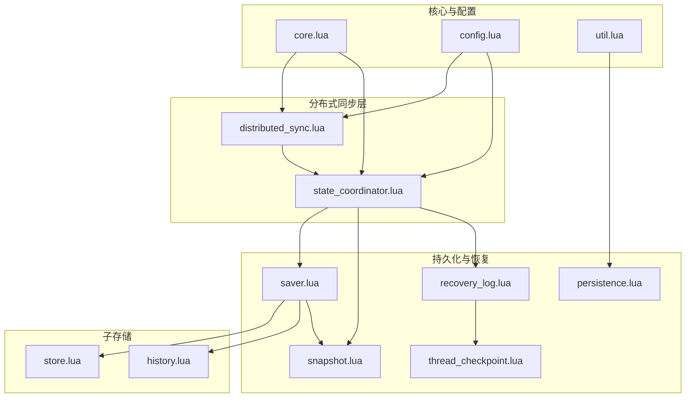
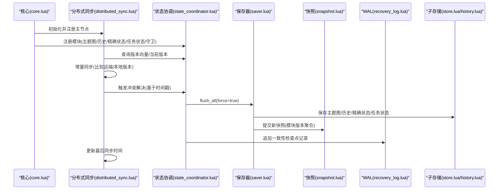
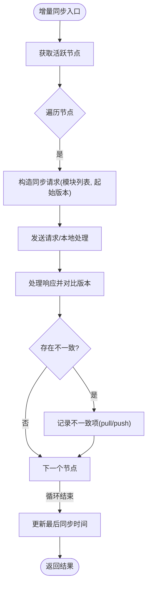
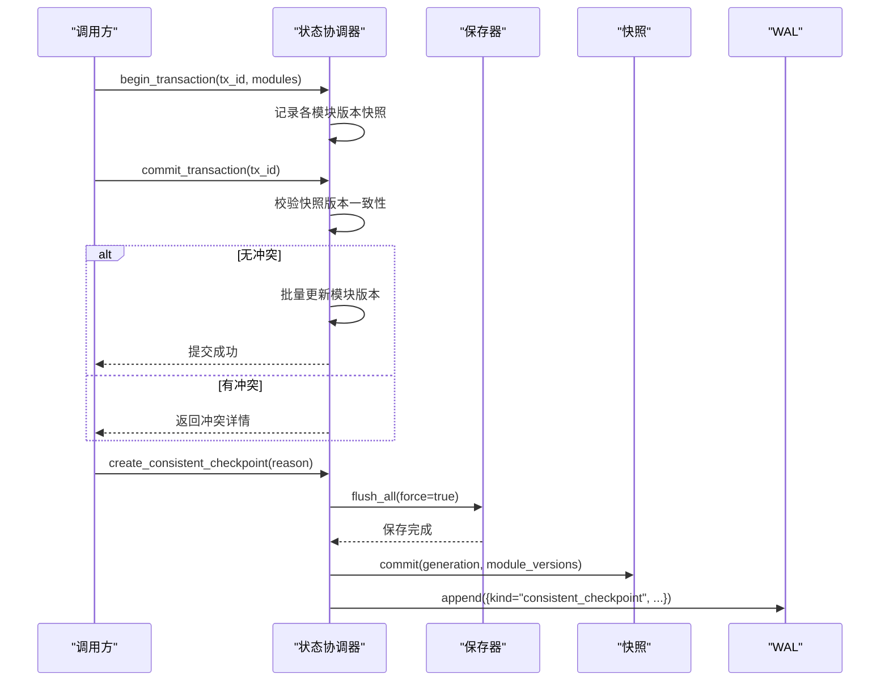
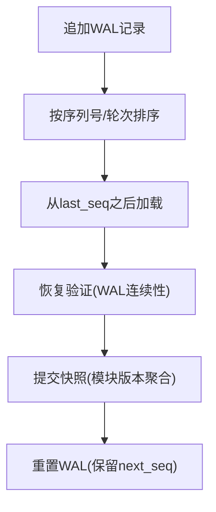
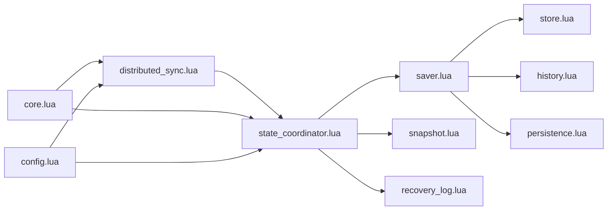

# 分布式同步机制

<cite>
**本文引用的文件**
- [distributed_sync.lua](file://mori_memory/module/distributed_sync.lua)
- [state_coordinator.lua](file://mori_memory/module/state_coordinator.lua)
- [recovery_log.lua](file://mori_memory/module/memory/recovery_log.lua)
- [saver.lua](file://mori_memory/module/memory/saver.lua)
- [snapshot.lua](file://mori_memory/module/snapshot.lua)
- [persistence.lua](file://mori_memory/module/persistence.lua)
- [config.lua](file://mori_memory/module/config.lua)
- [core.lua](file://mori_memory/mori_memory/core.lua)
- [util.lua](file://mori_memory/mori_memory/util.lua)
- [store.lua](file://mori_memory/module/memory/store.lua)
- [history.lua](file://mori_memory/module/memory/history.lua)
- [thread_checkpoint.lua](file://mori_memory/module/memory/thread_checkpoint.lua)
</cite>

## 目录
1. [引言](#引言)
2. [项目结构](#项目结构)
3. [核心组件](#核心组件)
4. [架构总览](#架构总览)
5. [详细组件分析](#详细组件分析)
6. [依赖关系分析](#依赖关系分析)
7. [性能考量](#性能考量)
8. [故障排查指南](#故障排查指南)
9. [结论](#结论)
10. [附录](#附录)

## 引言
本文件面向Mori项目的分布式同步机制，系统化阐述分布式内存系统的架构设计与实现要点，涵盖节点发现与心跳、状态同步协议、冲突解决策略、状态协调器（State Coordinator）的模块注册与版本控制、恢复日志（WAL）与快照的协同、事务一致性保障、网络分区检测与优雅降级等关键技术。同时提供分布式部署配置建议与性能调优思路，帮助开发者构建高可用的记忆系统。

## 项目结构
围绕分布式同步的关键模块主要位于以下路径：
- 分布式同步与协调：mori_memory/module/distributed_sync.lua、mori_memory/module/state_coordinator.lua
- 恢复日志与持久化：mori_memory/module/memory/recovery_log.lua、mori_memory/module/memory/saver.lua、mori_memory/module/snapshot.lua、mori_memory/module/persistence.lua
- 核心入口与集成：mori_memory/mori_memory/core.lua
- 配置中心：mori_memory/module/config.lua
- 辅助工具：mori_memory/mori_memory/util.lua
- 子存储抽象：mori_memory/module/memory/store.lua、mori_memory/module/memory/history.lua
- 线程运行时检查点：mori_memory/module/memory/thread_checkpoint.lua

**图表来源**
- [distributed_sync.lua:1-287](file://mori_memory/module/distributed_sync.lua#L1-L287)
- [state_coordinator.lua:1-302](file://mori_memory/module/state_coordinator.lua#L1-L302)
- [recovery_log.lua:1-121](file://mori_memory/module/memory/recovery_log.lua#L1-L121)
- [saver.lua:1-67](file://mori_memory/module/memory/saver.lua#L1-L67)
- [snapshot.lua:1-112](file://mori_memory/module/snapshot.lua#L1-L112)
- [persistence.lua:1-97](file://mori_memory/module/persistence.lua#L1-L97)
- [core.lua:1-800](file://mori_memory/mori_memory/core.lua#L1-L800)
- [config.lua:1-680](file://mori_memory/module/config.lua#L1-L680)
- [util.lua:1-153](file://mori_memory/mori_memory/util.lua#L1-L153)
- [store.lua:1-100](file://mori_memory/module/memory/store.lua#L1-L100)
- [history.lua:1-195](file://mori_memory/module/memory/history.lua#L1-L195)
- [thread_checkpoint.lua:1-76](file://mori_memory/module/memory/thread_checkpoint.lua#L1-L76)

**章节来源**
- [core.lua:313-327](file://mori_memory/mori_memory/core.lua#L313-L327)
- [config.lua:1-680](file://mori_memory/module/config.lua#L1-L680)

## 核心组件
- 分布式同步管理器（distributed_sync.lua）
  - 节点管理：添加/移除节点、心跳刷新、活跃节点筛选
  - 同步协议：广播状态变更、发起/处理同步请求、增量同步、冲突检测
  - 冲突解决：基于时间戳的简单策略
  - 网络分区检测与优雅降级：根据活跃节点比例动态调整模式与同步频率
- 状态协调器（state_coordinator.lua）
  - 版本向量：模块级版本号、时间戳、依赖集合
  - 事务管理：开始/提交/回滚，版本快照校验
  - 一致性检查点：原子保存、快照提交、WAL记录
  - 自动维护：定期一致性验证与自动检查点
  - 模块注册：初始化模块版本向量
- 恢复日志（WAL）与快照（recovery_log.lua, snapshot.lua, thread_checkpoint.lua）
  - WAL：顺序记录线程运行状态，支持追加、加载、重置
  - 快照：模块版本聚合的持久化快照，支持生成、加载、提交
  - 线程检查点：运行时状态的原子落盘与WAL截断
- 持久化工具（persistence.lua）
  - 原子替换与原子写：保证落盘过程中的数据一致性
- 配置中心（config.lua）
  - 分布式与节点相关参数、存储路径解析、策略配置
- 核心集成（core.lua）
  - 初始化阶段导入线程运行时状态、注册模块、启动分布式同步

**章节来源**
- [distributed_sync.lua:15-287](file://mori_memory/module/distributed_sync.lua#L15-L287)
- [state_coordinator.lua:15-302](file://mori_memory/module/state_coordinator.lua#L15-L302)
- [recovery_log.lua:22-121](file://mori_memory/module/memory/recovery_log.lua#L22-L121)
- [snapshot.lua:21-112](file://mori_memory/module/snapshot.lua#L21-L112)
- [thread_checkpoint.lua:18-76](file://mori_memory/module/memory/thread_checkpoint.lua#L18-L76)
- [persistence.lua:25-97](file://mori_memory/module/persistence.lua#L25-L97)
- [core.lua:227-327](file://mori_memory/mori_memory/core.lua#L227-L327)
- [config.lua:1-680](file://mori_memory/module/config.lua#L1-L680)

## 架构总览
下图展示分布式同步在系统中的位置与交互关系：

**图表来源**
- [core.lua:313-327](file://mori_memory/mori_memory/core.lua#L313-L327)
- [distributed_sync.lua:145-169](file://mori_memory/module/distributed_sync.lua#L145-L169)
- [state_coordinator.lua:145-207](file://mori_memory/module/state_coordinator.lua#L145-L207)
- [saver.lua:10-51](file://mori_memory/module/memory/saver.lua#L10-L51)
- [snapshot.lua:88-109](file://mori_memory/module/snapshot.lua#L88-L109)
- [recovery_log.lua:84-110](file://mori_memory/module/memory/recovery_log.lua#L84-L110)
- [store.lua:9-11](file://mori_memory/module/memory/store.lua#L9-L11)
- [history.lua:167-192](file://mori_memory/module/memory/history.lua#L167-L192)

## 详细组件分析

### 分布式同步管理器（distributed_sync.lua）
- 节点发现与心跳
  - 维护节点表，记录心跳时间与状态；按超时阈值标记非活跃节点
  - 提供活跃节点集合，用于后续同步范围
- 状态广播与同步协议
  - 广播状态变更消息，携带模块名、变更信息、时间戳、源节点、版本
  - 处理同步请求：收集指定模块的版本向量摘要（版本号、时间戳、数据哈希）
  - 处理同步响应：对比本地与远端版本，识别不一致项（拉取/推送）
- 增量同步与冲突解决
  - 增量同步：遍历活跃节点，发起请求并汇总不一致项
  - 冲突解决：当前实现采用基于时间戳的简单策略（本地/远端谁更新谁为准）
- 网络分区检测与优雅降级
  - 当活跃节点比例低于阈值，进入降级模式：切换到本地优先、延长同步间隔
- 回调与定时任务
  - 支持注册/注销同步回调
  - 定期任务周期性触发增量同步

**图表来源**
- [distributed_sync.lua:145-169](file://mori_memory/module/distributed_sync.lua#L145-L169)
- [distributed_sync.lua:93-142](file://mori_memory/module/distributed_sync.lua#L93-L142)

**章节来源**
- [distributed_sync.lua:15-287](file://mori_memory/module/distributed_sync.lua#L15-L287)

### 状态协调器（state_coordinator.lua）
- 版本向量与一致性
  - 模块级版本向量包含版本号、时间戳、依赖集合；版本号单调递增
  - 提供版本一致性校验，检测缺失或不匹配
- 事务管理
  - 开启事务时记录各模块版本快照
  - 提交前再次校验快照，若无冲突则批量更新模块版本
  - 回滚仅清理事务记录
- 一致性检查点与恢复验证
  - 创建检查点：原子保存全部模块、提交快照、追加WAL记录
  - 恢复验证：比对快照模块版本与当前版本向量，校验WAL序列连续性
- 自动维护
  - 定期检查一致性，不一致时自动创建检查点
- 模块注册
  - 初始化模块版本向量并设置初始依赖

**图表来源**
- [state_coordinator.lua:75-142](file://mori_memory/module/state_coordinator.lua#L75-L142)
- [state_coordinator.lua:145-207](file://mori_memory/module/state_coordinator.lua#L145-L207)
- [saver.lua:10-51](file://mori_memory/module/memory/saver.lua#L10-L51)
- [snapshot.lua:88-109](file://mori_memory/module/snapshot.lua#L88-L109)
- [recovery_log.lua:84-110](file://mori_memory/module/memory/recovery_log.lua#L84-L110)

**章节来源**
- [state_coordinator.lua:15-302](file://mori_memory/module/state_coordinator.lua#L15-L302)

### 恢复日志（WAL）与快照
- WAL（recovery_log.lua）
  - 记录线程运行状态变更，字段包含序列号、轮次、类型、作用域键、原因、作用域状态
  - 支持按序列号增量加载、追加记录、重置
- 快照（snapshot.lua）
  - 记录生成代数、保存时间、模块版本映射
  - 提供生成、加载、提交接口，配合原子写保证一致性
- 线程检查点（thread_checkpoint.lua）
  - 保存运行时状态、最后序列号、轮次与保存时间
  - 与WAL重置配合，实现周期性截断与落盘

**图表来源**
- [recovery_log.lua:47-82](file://mori_memory/module/memory/recovery_log.lua#L47-L82)
- [snapshot.lua:88-109](file://mori_memory/module/snapshot.lua#L88-L109)
- [thread_checkpoint.lua:60-73](file://mori_memory/module/memory/thread_checkpoint.lua#L60-L73)

**章节来源**
- [recovery_log.lua:1-121](file://mori_memory/module/memory/recovery_log.lua#L1-L121)
- [snapshot.lua:1-112](file://mori_memory/module/snapshot.lua#L1-L112)
- [thread_checkpoint.lua:1-76](file://mori_memory/module/memory/thread_checkpoint.lua#L1-L76)

### 持久化与原子写（persistence.lua）
- 原子替换策略：先尝试直接重命名，失败则备份目标文件后迁移，最终清理备份
- 原子写封装：临时文件写入+关闭+替换，失败时回滚并清理临时文件
- 用于快照与WAL的写入，确保崩溃场景下的数据一致性

**章节来源**
- [persistence.lua:25-97](file://mori_memory/module/persistence.lua#L25-L97)

### 配置中心（config.lua）
- 分布式相关参数：同步间隔、节点超时、分布式开关、存储路径解析
- 存储根路径、快照路径、运行时根路径等
- 提供默认值、深度合并、路径解析、策略配置应用

**章节来源**
- [config.lua:1-680](file://mori_memory/module/config.lua#L1-L680)

### 核心集成（core.lua）
- 初始化阶段导入线程运行时状态，恢复WAL至disentangle模块
- 注册模块到状态协调器（主题图、历史、精确状态、任务状态、守卫）
- 启动分布式同步（若配置启用）

**章节来源**
- [core.lua:227-327](file://mori_memory/mori_memory/core.lua#L227-L327)

## 依赖关系分析
- distributed_sync依赖state_coordinator进行版本查询与一致性判定
- state_coordinator依赖saver进行原子保存、snapshot进行快照提交、recovery_log进行WAL记录
- saver依赖store与history等子存储模块进行具体落盘
- persistence提供底层原子写能力
- core负责编排初始化与分布式同步启动

**图表来源**
- [distributed_sync.lua:1-20](file://mori_memory/module/distributed_sync.lua#L1-L20)
- [state_coordinator.lua:1-14](file://mori_memory/module/state_coordinator.lua#L1-L14)
- [saver.lua:1-18](file://mori_memory/module/memory/saver.lua#L1-L18)
- [store.lua:1-3](file://mori_memory/module/memory/store.lua#L1-L3)
- [history.lua:1-6](file://mori_memory/module/memory/history.lua#L1-L6)
- [snapshot.lua:1-3](file://mori_memory/module/snapshot.lua#L1-L3)
- [recovery_log.lua:1-6](file://mori_memory/module/memory/recovery_log.lua#L1-L6)
- [persistence.lua:1-4](file://mori_memory/module/persistence.lua#L1-L4)
- [core.lua:1-18](file://mori_memory/mori_memory/core.lua#L1-L18)
- [config.lua:1-6](file://mori_memory/module/config.lua#L1-L6)

**章节来源**
- [distributed_sync.lua:1-20](file://mori_memory/module/distributed_sync.lua#L1-L20)
- [state_coordinator.lua:1-14](file://mori_memory/module/state_coordinator.lua#L1-L14)
- [saver.lua:1-18](file://mori_memory/module/memory/saver.lua#L1-L18)
- [core.lua:1-18](file://mori_memory/mori_memory/core.lua#L1-L18)

## 性能考量
- 同步频率与窗口
  - 通过配置项控制同步间隔与节点超时，避免频繁全量同步
- 增量同步
  - 仅比较自上次同步以来的版本差异，降低带宽与CPU开销
- 原子保存与快照
  - 使用原子写与快照聚合，减少多次小IO带来的系统开销
- WAL截断
  - 周期性重置WAL，避免无限增长
- 内存压力与GC
  - 检查点后触发GC，缓解内存压力

[本节为通用性能建议，无需特定文件引用]

## 故障排查指南
- 同步不生效或频繁冲突
  - 检查节点心跳是否正常、活跃节点比例是否过低
  - 查看分布式同步的冲突解决结果与版本对比日志
- 一致性检查点失败
  - 核查保存器flush_all返回值、快照提交错误、WAL追加失败
  - 对比快照中记录的模块版本与当前版本向量
- WAL损坏或序列不连续
  - 使用“从last_seq之后加载”接口定位异常位置
  - 通过重置WAL并重新导入线程运行时状态恢复
- 崩溃后数据不一致
  - 启动时由核心模块导入线程检查点与WAL，恢复到最近一致状态
  - 如需强制修复，可手动重建检查点并重放WAL

**章节来源**
- [distributed_sync.lua:240-285](file://mori_memory/module/distributed_sync.lua#L240-L285)
- [state_coordinator.lua:209-258](file://mori_memory/module/state_coordinator.lua#L209-L258)
- [recovery_log.lua:47-82](file://mori_memory/module/memory/recovery_log.lua#L47-L82)
- [core.lua:261-296](file://mori_memory/mori_memory/core.lua#L261-L296)

## 结论
Mori的分布式同步机制通过“状态协调器+版本向量+WAL+快照”的组合，实现了模块间的强一致检查点与弱一致增量同步的平衡。分布式同步管理器负责节点生命周期与同步协议，状态协调器提供事务与一致性保障，WAL与快照确保崩溃后的可恢复性。结合优雅降级与自动维护，系统在复杂网络环境下仍能保持稳定与可用。

[本节为总结性内容，无需特定文件引用]

## 附录

### 分布式部署配置指南（关键参数）
- 分布式开关与节点
  - distributed.enabled：是否启用分布式同步
  - node.id：节点标识
  - distributed.sync_interval：同步间隔（秒）
  - distributed.node_timeout：节点超时（秒）
- 存储与路径
  - storage.base_dir：相对路径基目录
  - storage.snapshot_path：快照文件路径
  - disentangle.runtime.root：运行时根目录（WAL/检查点存放）
- 策略与行为
  - disentangle.state_version_control：状态版本控制（启用、当前版本、兼容版本、不一致处理策略）
  - disentangle.runtime.checkpoint_interval_turns：线程运行时检查点间隔轮次

**章节来源**
- [config.lua:1-680](file://mori_memory/module/config.lua#L1-L680)
- [core.lua:320-327](file://mori_memory/mori_memory/core.lua#L320-L327)